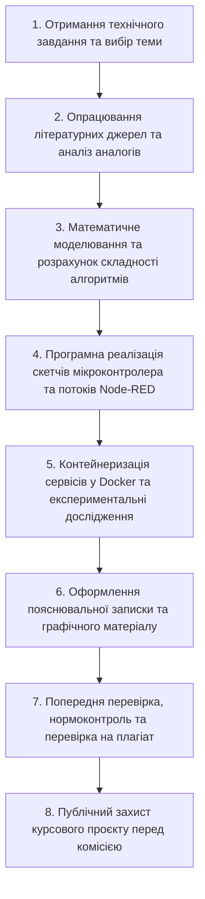

# МЕТОДИЧНІ ВКАЗІВКИ ЩОДО ВИКОНАННЯ КУРСОВОГО ПРОЄКТУ (РОБОТИ) з освітнього компонента «Прикладні алгоритми кіберфізичних систем»

## ВСТУП

Виконання курсового проєкту з освітнього компонента «Прикладні алгоритми кіберфізичних систем» є підсумковим етапом засвоєння теоретичних знань та практичних навичок, здобутих здобувачами вищої освіти у процесі вивчення комплексного стека технологій проєктування розбалансованих, розподілених та автономних кіберфізичних систем (КФС). Курсове проєктування акумулює знання з алгоритмізації на рівні мозкового забезпечення (Brainware), програмної реалізації низькорівневих алгоритмів обробки даних з давачів у середовищі мікроконтролерів, організації мережевої взаємодії за протоколами Промислового Інтернету речей (IIoT), побудови нечітких контролерів автоматизації, оптимізації маршрутизації на графах та контейнеризації сервісів у хмарно-граничних обчислювальних середовищах.

Головною метою курсового проєктування є формування у здобувачів вищої освіти системного інженерного мислення, здатності самостійно вирішувати складні прикладні задачі щодо розробки програмно-апаратних комплексів моніторингу та керування КФС, а також набуття досвіду з оформлення науково-технічної документації відповідно до чинних державних та міжнародних стандартів.

Під час виконання курсового проєкту здобувач вищої освіти повинен продемонструвати сформованість наступних програмних результатів навчання:
*   здатність розробляти та реалізовувати детерміновані та евристичні алгоритми первинної обробки телеметрії у умовах завад та обмежених обчислювальних ресурсів реального часу;
*   уміння проєктувати розгалужені ієрархічні дерева тем протоколу MQTT та оркеструвати потоки даних у середовищі Node-RED із використанням формату JSON;
*   здатність конструювати системи автоматичного керування на основі теорії нечіткої логіки Заде, реалізуючи повний цикл нечіткого логічного виведення за методом Мамдані;
*   уміння оптимізувати мережеві маршрути у просторових сенсорних сітках за допомогою алгоритмів на графах із використанням пріоритетних черг;
*   здатність проєктувати та віртуалізувати розподілені мікросервісні архітектури КФС за допомогою контейнеризації Docker та Docker Compose із забезпеченням мережевої ізоляції та збереження даних.

---

## 1. ЗАГАЛЬНІ ПОЛОЖЕННЯ

### 1.1 Мета і завдання курсового проєкту

Курсовий проєкт являє собою самостійну комплексну розрахунково-графічну та програмно-інженерну працю здобувача вищої освіти, яка виконується на основі індивідуального технічного завдання під керівництвом призначеного викладача.

Об'єктом розробки у курсовому проєкті є розподілена система моніторингу та керування кіберфізичним об'єктом, яка охоплює первинний сенсорний шар збору даних, мікроконтролерний модуль первинної фільтрації, мережевий шар маршрутизації телеметрії, інтелектуальний шар нечіткого або графового прийняття рішень та хмарно-граничний шар контейнеризованих сервісів.

У процесі курсового проєктування здобувач вирішує наступні розрахункові та конструкторські завдання:
*   формалізація технічного завдання та побудова концептуальної схеми взаємодії рівнів КФС;
*   синтез алгоритмів первинної обробки сигналів АЦП з використанням стратегії відсікання бар'єрами та ковзного середнього;
*   аналітичний розрахунок часової складності $T(n)$, кількості елементарних операцій $K_{сер}$ та функції трудомісткості $\Psi$ для розроблених алгоритмів;
*   проєктування структури тем MQTT та розробка програмних потоків оркестрування в середовищі Node-RED;
*   синтез нечіткого контролера автоматизації з обчисленням функцій приналежності термів, бази правил «IF-THEN» та дефазифікацією методом Центру Ваги;
*   розробка конфігураційних маніфестів `docker-compose.yml` для розгортання мікросервісного стека у складі MQTT-брокера Mosquitto, Node-RED та бази даних InfluxDB або PostgreSQL;
*   проведення експериментальних досліджень відмовостійкості, часових затримок та збереження даних при розривах зв'язку.

### 1.2 Основні етапи виконання курсового проєкту

Процес виконання курсового проєкту розбивається на послідовність календарних етапів, виконання яких контролюється керівником проєкту відповідно до затвердженого графіка.


*Рисунок 1 — Послідовність етапів виконання та захисту курсового проєкту*

На рисунку 1 відображено покроковий маршрут виконання проєкту, що проводиться здобувачем від моменту видачі завдання до підсумкового захисту. Кожен наступний етап базується на результатах попередніх обчислень та програмних розробок.

Перший етап охоплює видачу індивідуального завдання, узгодження структури об'єкта КФС та визначення контрольних термінів. На другому етапі здобувач опрацьовує науково-технічну літературу, формує аналітичний огляд існуючих рішень та формулює технічне завдання. Третій етап присвячений побудові математичних моделей первинного зчитування, фільтрації, нечіткого виведення та розрахунку часової складності. На четвертому етапі здійснюється кодування скетчів у середовищі Arduino IDE, налаштування симуляції в SimulIDE та створення потоків даних у Node-RED. П'ятий етап включає написання конфігурацій `docker-compose.yml`, випробування ізоляції мереж та вимірювання затримок. Шостий та сьомий етапи передбачають оформлення пояснювальної записки, проходження нормоконтролю та перевірку на академічну доброчесність. Завершальним восьмим етапом є публічний захист проєкту перед комісією.

### 1.3 Типова структура курсового проєкту та вимоги до її змісту

Пояснювальна записка курсового проєкту повинна мати суворо регламентовану структуру. Розділи записки розміщуються у наступній послідовності:

1.  **Титульна сторінка** (оформлюється за встановленим бланком, наведеним у Додатку А).
2.  **Бланк завдання на курсовий проєкт** (підписується здобувачем та керівником, наведений у Додатку Б).
3.  **Реферат (Анотація)** (викладається українською та англійською мовами).
4.  **Зміст** (автоматично згенерований перелік усіх розділів, підрозділів із зазначенням сторінок).
5.  **Перелік умовних позначень, символів, одиниць та скорочень** (заповнюється у разі використання понад 5 специфічних абревіатур).
6.  **Вступ** (обґрунтування актуальності теми, визначення об'єкта, предмета та методів дослідження, формулювання практичного значення роботи).
7.  **Розділ 1. Інформаційно-аналітичне дослідження предметної області та технічне завдання:**
    *   *1.1. Загальний опис досліджуваного фізичного об'єкта або технологічного процесу КФС.*
    *   *1.2. Порівняльний аналіз існуючих аналогів та протоколів передачі телеметрії.*
    *   *1.3. Формалізація технічного завдання на розробку розподіленої системи моніторингу та керування.*
8.  **Розділ 2. Математичне моделювання та алгоритмізація процесів у КФС:**
    *   *2.1. Математичні моделі первинних датчиків, перетворення АЦП та лінійної масштабізації.*
    *   *2.2. Синтез алгоритмів фільтрації аномального шуму за стратегією відсікання бар'єрами та обчислення ковзного середнього.*
    *   *2.3. Розрахунок часової складності $T(n)$, оцінка кількості операцій $K_{сер}$ та функції трудомісткості $\Psi$.*
    *   *2.4. Математичне забезпечення нечіткого контролера (функції приналежності, база правил, максимінна композиція Заде, дефазифікація CoG) або графового алгоритму Дейкстри з Min-Heap.*
9.  **Розділ 3. Проєктно-схемотехнічна та програмна реалізація системи:**
    *   *3.1. Розробка схемотехнічної моделі у симуляторі SimulIDE та кодування скетчу C++ в Arduino IDE.*
    *   *3.2. Проєктування чотирирівневої ієрархії тем MQTT та розробка потоків оркестрування в середовищі Node-RED.*
    *   *3.3. Розробка інтерфейсу користувача (Dashboard) для візуалізації телеметрії та контролю стану приводів.*
10. **Розділ 4. Контейнеризація, оркестрація та експериментальні дослідження КФС:**
    *   *4.1. Розробка конфігураційного маніфесту `docker-compose.yml` та налаштування ізольованих мереж.*
    *   *4.2. Налаштування постійних томів (volumes) та експериментальна перевірка енергонезалежності даних.*
    *   *4.3. Результати вимірювання затримок передачі даних та аналіз швидкодії системи під навантаженням.*
11. **Висновки** (узагальнений виклад отриманих науково-технічних результатів із оцінкою ступеня виконання технічного завдання).
12. **Список використаної літератури** (перелік джерел, оформлений згідно з ДСТУ 8302:2015 або стандартом APA).
13. **Додатки** (повні лістинги програмних кодів, конфігурації Docker, специфікації та графічні аркуші).

---

## 2. ОФОРМЛЕННЯ ПОЯСНЮВАЛЬНОЇ ЗАПИСКИ

### 2.1 Загальні вимоги та правила викладу тексту

Текст пояснювальної записки курсового проєкту викладається державною мовою у природному академічному стилі з дотриманням вимог науково-технічного етикету. Виклад матеріалу здійснюється у третій особі або у безособовій формі (наприклад: «проведено розрахунок», «запропоновано алгоритм», «в результаті експерименту встановлено»).

Пояснювальна записка друкується на аркушах білого паперу формату А4 ($210 \times 297\text{ мм}$) з одного боку. При форматуванні сторінки встановлюються такі розміри берегів: ліве поле становить $30\text{ мм}$, праве — $10\text{ мм}$, верхнє та нижнє поля дорівнюють по $20\text{ мм}$.

Для гарнітури шрифту використовується гарнітура Times New Roman розміром 14 пунктів (pt) з міжрядковим інтервалом 1.5. Абзацний відступ становить $1.25\text{ см}$ і повинен бути однаковим по всьому тексту. Текст вирівнюється по ширині сторінки з увімкненим автоматичним переносом слів.

Використання сухих словникових конструкцій виду `Термін: Опис` у тексті записки заборонено. Усі описи, характеристики, параметри та визначення викладаються виключно у вигляді суцільних, граматично зв'язаних речень та академічних абзаців.

### 2.2 Правила формування шифру документа

Кожній пояснювальній записці та графічному аркушу курсового проєкту присвоюється унікальний шифр (позначення документа). Шифр формується відповідно до вимог ЄСКД за наступною структурою:

$$
\text{Позначення} = \text{ТИП} . \text{СПЕЦ} . \text{РІК} . \text{ВАР} . \text{КОД}
$$

де:
*   `ТИП` — буквальне позначення вигляду роботи (`КП` — курсовий проєкт, `КР` — курсова робота, `РГР` — розрахунково-графічна робота);
*   `СПЕЦ` — трицифровий код спеціальності за переліком галузей знань (`123` — Комп'ютерна інженерія, `151` — Автоматизація та комп'ютерно-інтегровані технології);
*   `РІК` — дві останні цифри поточного року виконання (`26` для 2026 року);
*   `ВАР` — трицифровий номер варіанта за списком групи з провідними нулями (`001`, `012`);
*   `КОД` — літерне позначення виду документа (`ПЗ` — пояснювальна записка, `СК` — схема концептуальна, `С3` — схема принципова).

Приклад шифру пояснювальної записки курсового проєкту здобувача спеціальності 123 з варіантом №5 у 2026 році: `КП.123.26.005.ПЗ`.

### 2.3 Вимоги до складання реферату

Реферат призначений для швидкого ознайомлення зі змістом та основними технічними досягненнями курсового проєкту. Обсяг реферату не повинен перевищувати 500 слів (1 сторінка).

Реферат розміщується безпосередньо за бланком завдання та обов'язково містить такі структурні елементи:
*   відомості про обсяг записки (кількість сторінок), кількість ілюстрацій, таблиць, додатків та використаних джерел літератури;
*   перелік ключових слів (від 5 до 15 слів або словосполучень, надрукованих великими літерами у називному відмінку через кому);
*   стислий виклад суті роботи: об'єкт розробки, мета проєкту, реалізовані алгоритми, використані інструменти, отримані практичні результати та їх новизна.

### 2.4 Нумерація розділів, сторінок, ілюстрацій та таблиць

Нумерація сторінок записки є наскрізною, починаючи від титульної сторінки і закінчуючи останнім додатком. Номер сторінки проставляється арабськими цифрами у правому верхньому куті сторінки без слів, тире чи крапок. На титульній сторінці, бланку завдання та рефераті номер сторінки не друкується, але враховується у загальну кількість.

Розділи записки нумеруються арабськими цифрами в межах усього документа (наприклад: `1`, `2`, `3`). Підрозділи нумеруються у межах кожного розділу із зазначенням номера розділу та підрозділу через крапку (наприклад: `1.1`, `1.2`, `2.1`). Заголовки розділів друкуються великими літерами по центру сторінки з напівжирним виділенням.

Ілюстрації (рисунки, графіки, схеми) нумеруються арабськими цифрами у межах розділу. Позначення та назва рисунка розміщуються по центру під ілюстрацією у форматі: `*Рисунок X.Y — Назва рисунка*`, де `X` — номер розділу, `Y` — номер рисунка у розділі.

Таблиці нумеруються арабськими цифрами у межах розділу. Назва таблиці розміщується з лівого боку над таблицею у форматі: `*Таблиця X.Y — Назва таблиці*`. Перенесення таблиці на наступну сторінку супроводжується написом `*Продовження табл. X.Y*` у правому верхньому куті.

### 2.5 Оформлення математичних виразів та формул

Формули та математичні вирази розташовуються окремими рядками по центру сторінки та записуються у форматі LaTeX. Формули нумеруються арабськими цифрами праворуч у крайньому положенні рядка у круглих дужках у межах розділу (наприклад: `(2.1)`).

Пояснення значення кожної змінної та її фізичних одиниць вимірювання наводиться безпосередньо під формулою. Пояснення розпочинаються зі слова «де» без двокрапки, з абзацного відступу, а значення кожної змінної записується з нового рядка через кому або крапку з комою.

Приклад оформлення формули у пояснювальному тексті:

Розрахунок загального часу життя автономного сенсорного вузла $T_{life}$ здійснюється за співвідношенням:

$$
T_{life} = \frac{C_{bat}}{I_{avg} \cdot 24 \cdot 365} \quad (2.1)
$$

де:
*   $T_{life}$ — розрахунковий термін роботи джерела живлення, вимірюється в роках;
*   $C_{bat}$ — номінальна ємність батареї, вимірюється в міліампер-годинах ($\text{мА}\cdot\text{год}$);
*   $I_{avg}$ — середній струм споживання вузла за один повний цикл функціонування, вимірюється в міліамперах ($\text{мА}$).

### 2.6 Оформлення додатків та списку літератури

Додатки оформлюються наприкінці записки після списку літератури. Кожен додаток розпочинається з нової сторінки. У верхньому правому куті друкується слово `ДОДАТОК` та велика літера українського алфавіту за порядком (за винятком літер Ґ, Є, І, Ї, Й, О, Ч, Ь), наприклад: `ДОДАТОК А`. З нового рядка по центру друкується назва додатка.

Ілюстрації, таблиці та формули у додаткам нумеруються у межах кожного додатка із додаванням літери додатка, наприклад: `Рисунок А.1`, `Таблиця Б.2`, формула `(В.1)`.

Список використаної літератури формується за порядком згадування джерел у тексті або в алфавітному порядку. Джерела описуються відповідно до державних стандартів бібліографічного опису ДСТУ 8302:2015 або міжнародного стандарту APA.

---

## 3. ОФОРМЛЕННЯ ГРАФІЧНОЇ / ПРАКТИЧНОЇ ЧАСТИНИ

Графічна частина курсового проєкту (або практичні демонстраційні аркуші) призначена для наочного висвітлення основних технічних та алгоритмічних рішень, розроблених здобувачем.

Обсяг графічної частини становить від 2 до 3 аркушів стандартних форматів (А1 або А2). Графічний матеріал може бути поданий у вигляді друкованих аркушів креслень або у формі високоякісних електронних плакатів для демонстрації на захисті через мультимедійне обладнання.

Графічний матеріал оформлюється з дотриманням рамок та основних написів (кутових штампів) за ЕСКД:
*   формою 1 (для першого аркуша графічного документа);
*   формою 2а (для наступних аркушів).

Типовий склад графічних аркушів курсового проєкту з КФС включає:
1.  **Аркуш 1:** Структурно-концептуальна схема розподіленої кіберфізичної системи (подаються рівні сенсорів, Edge, Fog, Cloud, мережеві топології та ієрархія тем MQTT).
2.  **Аркуш 2:** Алгоритмічні схеми обробки даних (подаються блок-схеми первинної фільтрації, Action Diagrams нечіткого контролера, схема каскадів Lambda-архітектури та конвеєра CEP).
3.  **Аркуш 3:** Схемотехнічні рішення та інтерфейси користувача (подаються розводка у SimulIDE, структура файлу `docker-compose.yml`, дашборди Node-RED та графіки розрахованої складності $T(n)$).

---

## 4. ТИПОВІ ТЕМИ КУРСОВИХ ПРОЄКТІВ

Нижче наведено перелік актуальних та деталізованих тем курсових проєктів, адаптованих до змісту навчальної дисципліни:

1.  Розробка розподіленої системи нечіткого керування мікрокліматом тепличного комплексу з оркестрацією в Node-RED та віртуалізацією у Docker.
2.  Проєктування КФС моніторингу вібраційного стану турбоагрегату ТЕС на основі фільтрації АЦП, алгоритму Дейкстри та Lambda-архітектури Big Data.
3.  Розробка системи автоматизованого контролю температури та пастеризації у молочній промисловості з використанням MQTT та баз даних часових рядів InfluxDB.
4.  Проєктування бездротової сенсорної мережі екологічного моніторингу лісових масивів з алгоритмами оптимізації маршрутів A* та контейнеризованим брокером Mosquitto.
5.  Розробка КФС керування роботизованим комплексом зварювання автомобільних кузовів на основі нечітких контролерів та буферних черг FIFO.
6.  Проєктування розподіленої системи виявлення витоків газу на компресорних станціях із конвеєром обробки складних подій (CEP).
7.  Розробка інтелектуальної системи керування аварійним охолодженням ядерного реактора з розрахунком WCET та формуванням захищених MQTT-тем.
8.  Проєктування КФС моніторингу деформацій та сейсмічної активності мостових опор із застосуванням індекс-прапорців та алгоритмів in-place транспонування.
9.  Розробка системи автоматизованого керування дозуванням агресивних рідин у хімічному виробництві за допомогою нечіткого виведення Мамдані.
10. Проєктування туманної обчислювальної мережі диспетчеризації висотних ліфтів із оркестрацією мікросервісів у Docker Compose.
11. Розробка КФС предиктивного обслуговування насосних станцій водоканалу на основі аналізу вібрацій та акустичного шуму.
12. Проєктування системи автоматичного позиціонування сонячних панелей на основі аналізу кута інсоляції та евристичних алгоритмів.
13. Розробка КФС моніторингу стану акумуляторних батарей у системі безперебійного живлення з розрахунком часу життя вузлів $T_{life}$.
14. Проєктування інтелектуальної системи вентиляції та дегазації вугільних шахт із застосуванням нечітких множин Заде.
15. Розробка розподіленої КФС керування автоклавами фармацевтичного підприємства з контейнеризацією Node-RED та PostgreSQL.
16. Проєктування КФС моніторингу та регулювання температури намотування папероробної машини з алгоритмом ковзного середнього.
17. Розробка системи автоматизованої інспекції якості паяних з'єднань електронних плат з обробкою просторових матриць сигналів.
18. Проєктування КФС керування мікрокліматом фармацевтичного складу з високими вимогами до збереження даних (Data Persistence).
19. Розробка розподіленої системи моніторингу параметерів гальванічних ванн із застосуванням пріоритетних черг на базі Min-Heap.
20. Проєктування КФС контролю режиму вистоювання тіста у хлібопекарській промисловості з візуалізацією на дашборді Node-RED.

---

## 5. КРИТЕРІЇ ТА ШКАЛА ОЦІНЮВАННЯ

### 5.1 Розподіл балів

Оцінювання курсового проєкту здійснюється за 100-бальною шкалою. Сумарна оцінка формується з трьох основних складників, наведених у таблиці нижче.

| Складові частини оцінювання курсового проєкту | Максимальний бал |
| :--- | :---: |
| **1. Зміст та технічна/наукова якість проєкту** (обґрунтованість математичних моделей, точність алгоритмів, працездатність коду C++/Node-RED, налаштування Docker та бази даних) | **50** |
| **2. Якість оформлення записки та графічного матеріалу** (відповідність ЄСКД/ДСТУ, якість креслень/плакатів, граматика, структура, правильність формул) | **10** |
| **3. Публічний захист проєкту перед комісією** (доповідь, якість презентації, відповіді на фахові запитання членів комісії, володіння матеріалом) | **40** |
| **ВСЬОГО** | **100** |

### 5.2 Опис критеріїв оцінювання змісту та захисту

Для отримання максимальної оцінки за кожним із розділів розробка повинна відповідати наступним вимогам:

*   **Зміст та технічна якість (до 50 балів):** Технічне завдання виконано у повному обсязі, математичні моделі та формули розраховані без помилок, скетчі C++ успішно компілюються та моделюються у SimulIDE, потоки Node-RED здійснюють обмін даними за MQTT із розгорнутим у Docker брокером Mosquitto, контейнери розгортаються без помилок за допомогою `docker compose up -d`, а томи забезпечують збереження даних при зупинці стека.
*   **Оформлення (до 10 балів):** Записка повністю відповідає вимогам щодо шрифтів, полів, нумерації сторінок, рисунків, таблиць, джерел та додатків. Шифр документа сформовано вірно. Немає словникових конструкцій вида `Термін: Опис`.
*   **Захист (до 40 балів):** Здобувач вільно володіє матеріалом розробки, чітко відповідає на концептуальні запитання щодо алгоритмів $O(n)$, нечіткої логіки, протоколів MQTT та контейнеризації Docker, демонструє діючу модель проєкту у реальному часі.

Дотримання принципів академічної доброчесності є обов'язковою умовою допуску до захисту. Роботи, у яких за результатами комп'ютерної перевірки виявлено некоректні запозичення (плагіат) або частка унікальності тексту є меншою за $80\%$, до захисту не допускаються та повертаються здобувачу на доопрацювання.

### 5.3 Шкала оцінювання

Підсумкові бали за курсовий проєкт переводяться у національну шкалу та шкалу ECTS відповідно до наведеної Markdown-таблиці.

| Оцінка за 100-бальною шкалою | Оцінка ECTS | Оцінка за національною шкалою | Критерії оцінювання рівнів навчальних досягнень |
| :---: | :---: | :---: | :--- |
| **90 – 100** | **A** | **Відмінно** | Завдання виконано повністю і безпомилково. Глибоке теоретичне та практичне обґрунтування, діючий програмно-контейнерний комплекс, бездоганне оформлення, блискучий захист. |
| **82 – 89** | **B** | **Добре** | Завдання виконано повністю. Наявні несуттєві зауваження до оформлення записки або незначні похибки у відповідях на засіданні комісії. |
| **75 – 81** | **C** | **Добре** | Проєкт виконано у повному обсязі, але виявлено окремі дрібні помилки у розрахунках складності або часткові зауваження до коду приводу. |
| **67 – 74** | **D** | **Задовільно** | Технічне завдання виконано, проте наявні зауваження до алгоритмів, спрощений аналіз складників трудомісткості або невпевнений захист. |
| **60 – 66** | **E** | **Задовільно** | Мінімально допустимий рівень виконання розробки. Наявні помилки у розрахунках, неповне оформлення додатків, відповіді на захисті базові. |
| **35 – 59** | **FX** | **Незадовільно** | Завдання виконано не в повному обсязі, виявлені істотні помилки у розрахунках чи коді, що вимагають обов'язкового доопрацювання та повторного захисту. |
| **0 – 34** | **F** | **Незадовільно** | Роботу не виконано, виявлено грубі порушення академічної доброчесності (плагіат). Потрібне повторне вивчення освітнього компонента. |

---

## СПИСОК РЕКОМЕНДОВАНОЇ ЛІТЕРАТУРИ

1. **Грудзинський Ю. Є.** Технології сучасних кібер-фізичних систем : навч. посіб. для студ. спеціальності 151 «Автоматизація та комп’ютерно-інтегровані технології» / уклад. Ю. Є. Грудзинський ; КПІ ім. Ігоря Сікорського. — Київ : КПІ ім. Ігоря Сікорського, 2020. — 327 с. — URL: https://ela.kpi.ua/bitstream/123456789/43394/1/TKFS_NP_2020_Lektsii.pdf
2. **Креневич А. П.** Алгоритми і структури даних : підручник / А. П. Креневич. — Київ : ВПЦ «Київський Університет», 2021. — 200 с. — URL: https://www.mechmat.univ.kiev.ua/wp-content/uploads/2021/09/pidruchnyk-alhorytmy-i-struktury-danykh.pdf
3. **Марченко О. І.** Структури даних та алгоритми : підручник. У 2-х ч. Ч. 1 / О. І. Марченко, О. О. Марченко ; КПІ ім. Ігоря Сікорського. — Київ : Просвіта, 2024. — 268 с. — ISBN 978-617-7010-34-9. — URL: https://e-library.kpefk.com.ua/wp-content/uploads/2025/03/ASD-Marchenko-O.I.-Pidruchnyk-2024r-Liudmyla-Meleshchuk.pdf
4. **Назарчук І. В.** Програмування та алгоритмічні мови 1. Алгоритмізація та основи програмування : конспект лекцій : навч. посіб. для студ. спеціальності 124 «Системний аналіз» / уклад. І. В. Назарчук ; КПІ ім. Ігоря Сікорського. — Київ : КПІ ім. Ігоря Сікорського, 2020. — 140 с.
5. **Темнікова О. Л.** Математична логіка та теорія алгоритмів : конспект лекцій : навч. посіб. для студ. спеціальності 113 «Прикладна математика» / О. Л. Темнікова ; КПІ ім. Ігоря Сікорського. — Київ : КПІ ім. Ігоря Сікорського, 2021. — 177 с. — URL: https://ela.kpi.ua/server/api/core/bitstreams/90cfd1e3-1a98-4370-95f3-bd1d677d0e7c/content
6. **Троцько В. В.** Теорія алгоритмів : навч.-метод. посіб. / В. В. Троцько. — Київ : ВНЗ «Університет економіки та права «КРОК», 2023. — 126 с. — ISBN 978-966-170-075-7. — URL: https://library.krok.edu.ua/media/library/category/navchalni-posibniki/trotsko_0003.pdf

---

## ДОДАТКИ

### Додаток А. Зразок оформлення титульної сторінки

```text
МІНІСТЕРСТВО ОСВІТИ І НАУКИ УКРАЇНИ
КРЕМЕНЧУЦЬКИЙ НАЦІОНАЛЬНИЙ УНІВЕРСИТЕТ ІМЕНІ МИХАЙЛА ОСТРОГРАДСЬКОГО
Факультет електроніки та комп'ютерної інженерії
Кафедра комп'ютерної інженерії та електроніки


ПОЯСНЮВАЛЬНА ЗАПИСКА
до курсового проєкту (роботи)
з освітнього компонента «Прикладні алгоритми кіберфізичних систем»

на тему: «Розробка розподіленої системи нечіткого керування мікрокліматом тепличного комплексу з оркестрацією в Node-RED та віртуалізацією у Docker»

Шифр документа: КП.123.26.001.ПЗ


                                            Виконав: студент ____ курсу, групи ________
                                            спеціальності 123 «Комп'ютерна інженерія»
                                            _________________________________________
                                            (ПІБ студента)

                                            Керівник: _______________________________
                                            (посада, науковий ступінь, ПІБ)

                                            Оцінка:
                                            За 100-бальною шкалою: ___________________
                                            Оцінка ECTS: ____________________________
                                            За національною шкалою: __________________

                                            Члени комісії:
                                            _________________  ______________________
                                                (підпис)             (ПІБ)
                                            _________________  ______________________
                                                (підпис)             (ПІБ)


Кременчук — 2026
```

---

### Додаток Б. Зразок бланка технічного завдання та календарного плану

```text
КРЕМЕНЧУЦЬКИЙ НАЦІОНАЛЬНИЙ УНІВЕРСИТЕТ ІМЕНІ МИХАЙЛА ОСТРОГРАДСЬКОГО
Кафедра комп'ютерної інженерії та електроніки

Освітньо-професійна програма: «Комп'ютерна інженерія»
Спеціальність: 123 «Комп'ютерна інженерія»
Освітній рівень: перший (бакалаврський)

ЗАТВЕРДЖУЮ
Завідувач кафедри ___________
«___» ________________ 2026 р.


ЗАВДАННЯ
НА КУРСОВИЙ ПРОЄКТ (РОБОТУ) СТУДЕНТУ

________________________________________________________________________________
(прізвище, ім'я, по батькові)

1. Тема проєкту: «Розробка розподіленої системи нечіткого керування мікрокліматом тепличного комплексу з оркестрацією в Node-RED та віртуалізацією у Docker»
Керівник проєкту: _______________________________________________________________,
(прізвище, ім'я, по батькові, науковий ступінь, вчене звання)
затверджені наказом по університету від «___» ____________ 2026 р. № _____

2. Термін здачі студентом закінченого проєкту: «___» ________________ 2026 р.

3. Вихідні дані до проєкту:
   - Об'єкт КФС: Тепличний комплекс для вирощування розсади;
   - Діапазон вимірювання температури T: від -10 °C до +60 °C;
   - Цільова уставка температури T_set: +22.0 °C;
   - Мережеві протоколи: MQTT (QoS 1), WebSockets;
   - Програмне середовище: C++ (Arduino IDE), Node-RED, Docker Compose, InfluxDB;
   - Структура топіка MQTT: kyiv_metal/shop_greenhouse/fan_01/temperature.

4. Зміст Пояснювальної записки (перелік питань, що підлягають розробці):
   - Вступ (актуальність, мета, завдання).
   - Розділ 1. Інформаційно-аналітичний опис об'єкта КФС та формування ТЗ.
   - Розділ 2. Математичне моделювання фильтрації сигналів, нечіткого контролера Мамдані та розрахунок часової складності T(n) і трудомісткості Psi.
   - Розділ 3. Схемотехнічне моделювання у SimulIDE, кодування скетчу C++, налаштування потоків у Node-RED та ієрархії MQTT.
   - Розділ 4. Розробка маніфесту docker-compose.yml, тестування томів збереження даних та проведення хронометражу.
   - Висновки та Список літератури.

5. Перелік графічного (демонстраційного) матеріалу:
   - Схема концептуальна розподіленої системи КФС (Аркуш 1, формат А1).
   - Алгоритмічні схеми первинної фільтрації, Action Diagrams нечіткого контролера та Lambda-архітектури (Аркуш 2, формат А1).
   - Схема у SimulIDE, конфігурація Docker Compose та інтерфейси дашборду Node-RED (Аркуш 3, формат А1).
```

#### Календарний план виконання етапів курсового проєкту

| № | Назва етапів курсового проєкту | Термін виконання етапу | Максимальний бал | Примітка про виконання |
| :---: | :--- | :---: | :---: | :---: |
| **1** | Отримання завдання, аналіз літератури та написання Розділу 1 | 1–2 тиждень | $5$ | Виконано |
| **2** | Математичне моделювання, синтез нечіткого контролера та розрахунок $\Psi$ (Розділ 2) | 3–5 тиждень | $15$ | Виконано |
| **3** | Програмування скетчу в Arduino IDE, симуляція в SimulIDE та створення потоку Node-RED (Розділ 3) | 6–8 тиждень | $15$ | Виконано |
| **4** | Контейнеризація у Docker Compose, тестування томів та розрахунок затримок (Розділ 4) | 9–11 тиждень | $15$ | Виконано |
| **5** | Оформлення пояснювальної записки, графічних аркушів та проходження нормоконтролю | 12–13 тиждень | $10$ | Виконано |
| **6** | Попередній перегляд, перевірка на плагіат та публічний захист проєкту перед комісією | 14 тиждень | $40$ | Захищено |

```text
Студент  _________________  (_________________________)
             (підпис)                 (ПІБ)

Керівник _________________  (_________________________)
             (підпис)                 (ПІБ)
```
