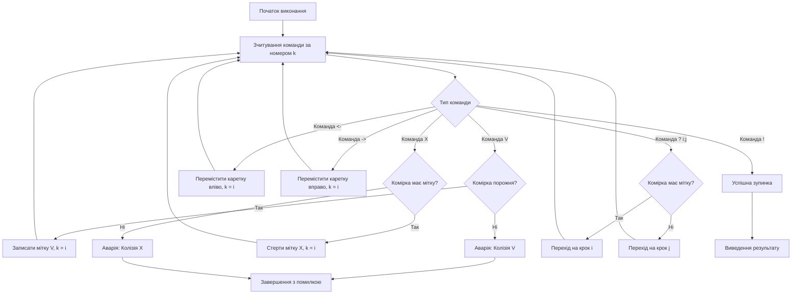
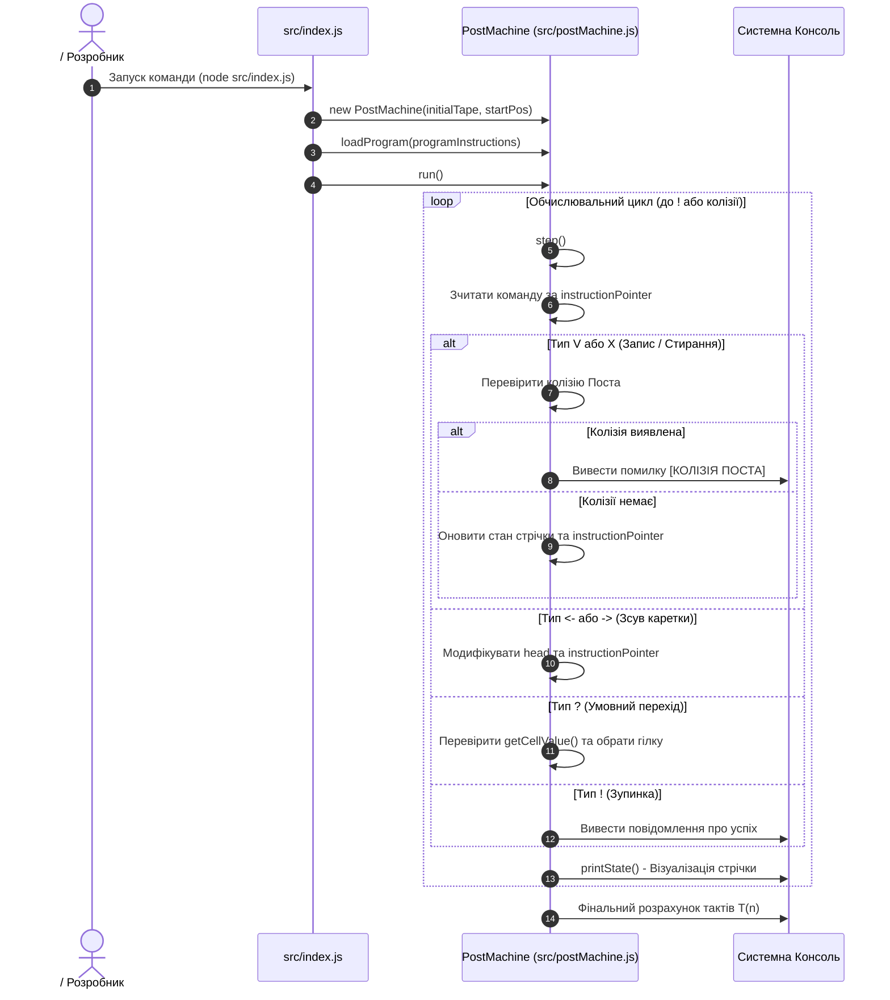

# **Лабораторна робота № 1<br>Моделювання логіки керування низького рівня**

## **Мета роботи та стек технологій**

**Мета:** Ознайомлення з теоретичними засадами алгоритмізації в кіберфізичних системах (КФС), дослідження фундаментальних властивостей детермінованості, дискретності та покрокового виконання обчислювальних процесів шляхом розробки та програмної реалізації симулятора абстрактної обчислювальної машини Поста мовою JavaScript у середовищі Node.js.

**Стек технологій та інструменти:**
*   **Мова програмування:** JavaScript (ECMAScript 2022+).
*   **Середовище виконання:** Node.js (версія v18.0.0 або новіша).
*   **Інструменти розробки:** cистемна консоль/термінал (Bash, PowerShell або zsh), текстовий редактор або інтегроване середовище розробки (Visual Studio Code, WebStorm).

---

## **1 Теоретичні відомості**

### **Концепція Brainware, Software та Hardware в кіберфізичних системах**

У сучасній теорії проєктування обчислювальних та кіберфізичних систем виділяють триієрархічні рівні архітектури. Фізичний рівень **Hardware** становить апаратну основу системи, включаючи мікроконтролери, сенсори, виконавчі механізми та лінії зв'язку. Програмний рівень **Software** являє собою сукупність машинних інструкцій або коду мовою високого рівня, що виконується апаратурою. 

Однак первинним стосовно цих двох рівнів є концептуальний рівень **Brainware** (мозкове забезпечення). Поняття Brainware описує абстрактну сюжетну лінію, алгоритмічну концепцію та математичну логіку поведінки системи, яка залишається незмінною незалежно від того, на якій конкретно мові програмування реалізовано код або які процесорні архітектури використовуються для обчислень. Для інженера з КФС алгоритмічне мислення на рівні Brainware є вирішальним, оскільки воно дозволяє прорахувати стійкість та детермінованість системи заздалегідь.

### **Властивості алгоритмів у контексті КФС**

Будь-який алгоритм управління в КФС повинен відповідати строгому набору фундаментальних властивостей:

*   Властивість **дискретності** передбачає, що алгоритм розбивається на окремі елементарні кроки, а обчислювальний процес виконується послідовно, де кожна операція повністю завершується перед початком наступної.
*   Властивість **детермінованості (визначеності)** гарантує, що кожен крок алгоритму є строго однозначним для виконавця. Повторне застосування алгоритму до ідентичних вхідних даних у однакових початкових умовах завжди призводить до однакового результату.
*   Властивість **скінченності (збіжності)** вимагає, щоб процес обчислень обов'язково завершувався за скінченне число кроків із видачею підсумкового результату.
*   Властивість **результативності** визначає, що після завершення роботи алгоритм видає конкретні вихідні дані або сигнал про неможливість розв'язання задачі.
*   Властивість **масовості** означає придатність алгоритму для розв'язання цілого класу однотипних задач із заданої предметної області.
*   Властивість **здійсненності** вимагає фізичної та логічної можливості виконання кожної операції в межах наявних апаратних ресурсів пам'яті та часу.

### **Формальна модель обчислень. Машина Поста**

Абстрактна обчислювальна модель, запропонована американським математиком Емілем Постом у 1936 році, стала однією з перших спроб формалізувати поняття алгоритму. Машина Поста складається з двох основних компонентів: нескінченної в обидва боки стрічки, розбитої на окремі комірки, та каретки (зчитувально-записувальної головки), яка здатна переміщуватися вздовж стрічки на одну комірку за крок.

Машина Поста працює в **унарній системі числення**, де інформація кодується за допомогою одного типу знака — мітки (позначається символом `V` або `1`). Порожня комірка позначається як відсутність мітки (символ пробілу або `0`). 

Програма для машини Поста складається зі скінченного впорядкованого списку пронумерованих інструкцій. Пост виділив шість базових команд:

1.  `V i` — поставити мітку в поточну комірку та перейти до виконання інструкції № `i`.
2.  `X i` — стерти мітку в поточній комірці та перейти до виконання інструкції № `i`.
3.  `← i` — перемістити каретку на одну комірку ліворуч та перейти до інструкції № `i`.
4.  `→ i` — перемістити каретку на одну комірку праворуч та перейти до інструкції № `i`.
5.  `? i; j` — перевірити стан поточної комірки: якщо в комірці **є мітка**, перейти до інструкції № `i`; якщо комірка **порожня**, перейти до інструкції № `j` (умовний перехід).
6.  `!` — зупинити роботу алгоритму (термінальна команда).

Критичним поняттям у теорії Поста є **колізія машини Поста**. Колізія виникає тоді, коли програма намагається встановити мітку `V` у комірку, де мітка вже присутня, або намагається стерти мітку `X` у комірці, яка вже є порожньою. Виникнення колізії свідчить про логічну помилку на рівні Brainware і призводить до аварійної зупинки алгоритму.

Послідовність інструкцій, яка не створює колізій і гарантовано завершується командою зупинки `!` за скінченну кількість кроків із наданням коректного результату для будь-яких допустимих вхідних даних, називається **фінітним 1-процесом**.

### **Математичний апарат оцінки обчислювальної складності**

Стрічка машини Поста математично описується як функція стану $T$, яка відображає множину цілих чисел $\mathbb{Z}$ (індекси комірок) у двоелементну множину значень $\{0, 1\}$:

$$
T: \mathbb{Z} \to \{0, 1\}
$$

де $T(p) = 1$ відповідає наявності мітки в комірці з індексом $p \in \mathbb{Z}$, а $T(p) = 0$ відображає порожню комірку.

Поточний стан обчислювального автомата в кожен момент дискретного часу (такт) $t \in \mathbb{N}_0$ повністю описується впорядкованою трійкою (конфігурацією):

$$
S_t = \langle T_t, p_t, k_t \rangle
$$

де $T_t$ — стан стрічки на такті $t$, $p_t \in \mathbb{Z}$ — поточна позиція каретки, $k_t \in \{1, 2, \dots, N\}$ — номер інструкції програми, що виконується.

Часова складність алгоритму $T(n)$ оцінюється загальною кількістю елементарних тактів каретки $M$, виконаних до моменту виклику термінальної команди `!`:

$$
T(n) = \sum_{i=1}^{M} t_i
$$

де $n$ — розмірність вхідного унарного сигналу (кількість початкових міток на стрічці), $t_i$ — фіксований час виконання одного такту машини (у спрощеній обчислювальній моделі приймається $t_i = 1$).

Для оцінки загального використання ресурсів вбудованої системи використовується **функція трудомісткості** $\Psi$:

$$
\Psi = c_1 \cdot F_a(N) + c_2 \cdot M + c_3 \cdot S_d + c_4 \cdot S_r
$$

де:
*   $F_a(N)$ — часова складність алгоритму (загальна кількість виконаних кроків каретки $M$), вимірюється в тактах;
*   $M$ — обсяг програмного коду (кількість команд у системі інструкцій машини Поста), вимірюється в одиницях інструкцій;
*   $S_d$ — обсяг пам'яті стрічки, зайнятий вхідними та вихідними даними (кількість комірок);
*   $S_r$ — обсяг оперативної пам'яті стрічки, використаний під проміжні обчислення (допоміжні мітки/пробіли);
*   $c_1, c_2, c_3, c_4$ — безрозмірні вагові коефіцієнти, які визначають пріоритетність відповідного ресурсу для обраної апаратної платформи КФС.

Обчислювальний процес емулятора Поста можна зобразити у вигляді графа станів.


*Рисунок 1 — Схема обчислювального циклу та обробки станів машини Поста*

Наведеній схемі відповідає послідовний перехід між конфігураціями $S_t \to S_{t+1}$. Якщо на певному кроці виникає колізія, машина зупиняє виконання та переходить у стан помилки.

---

## **2 Підготовка середовища та розгортання проєкту (Крок 0)**

Для виконання лабораторної роботи необхідно встановити середовище виконання **Node.js**. Якщо Node.js ще не встановлено, завантажте та встановіть версію LTS з офіційного сайту [nodejs.org](https://nodejs.org/).

### **Крок 0.1. Перевірка встановленого ПЗ**
Відкрийте термінал (командний рядок) вашої операційної системи та виконайте команди для перевірки наявності Node.js та менеджера пакетів npm:

```bash
node -v
npm -v
```

У разі успішного встановлення у консолі відобразяться версії програм (наприклад, `v20.11.0` та `10.2.4`).

### **Крок 0.2. Створення структури проєкту**
Створіть робочу директорію для проєкту за допомогою термінала та перейдіть у неї:

```bash
mkdir post-machine-emulator
cd post-machine-emulator
```

Ініціалізуйте новий проєкт Node.js (створиться файл `package.json`):

```bash
npm init -y
```

Створіть папку `src` для вихідного коду, а всередині неї файли `postMachine.js` (ядро емулятора) та `index.js` (точка входу):

```bash
mkdir src
touch src/postMachine.js
touch src/index.js
```

Структура вашого проєкту повинна мати наступний вигляд:

```
post-machine-emulator/
├── package.json
└── src/
    ├── index.js
    └── postMachine.js
```

---

## **3 Порядок виконання роботи**

### **Індивідуальні завдання**

Кожен здобувач виконує варіант, який відповідає його номеру у списку групи. Завдання полягає в побудові системи команд машини Поста для обробки унарних сигналів та перевірці її роботи на розробленому емуляторі.

> **Примітка:** Усі числа задаються в унарній системі числення. Число $n$ представляється у вигляді суцільного блоку з $n$ міток (`1`). Якщо задано кілька чисел, вони розділяються на стрічці **однією порожньою коміркою (`0`)**.

| Варіант | Назва алгоритму | Вхідний стан стрічки (унарний) | Очікуваний вихідний стан стрічки |
| :---: | :--- | :--- | :--- |
| **1** | Інкремент унарного числа ($n + 1$) | `...0 1 1 1 0...` (число 3) | `...0 1 1 1 1 0...` (число 4) |
| **2** | Декремент унарного числа ($n - 1$) | `...0 1 1 1 1 0...` (число 4) | `...0 1 1 1 0...` (число 3) |
| **3** | Додавання двох чисел ($a + b$) | `...0 1 1 0 1 1 1 0...` ($2 + 3$) | `...0 1 1 1 1 1 0...` (число 5) |
| **4** | Віднімання двох чисел ($a - b$, $a > b$) | `...0 1 1 1 1 0 1 1 0...` ($4 - 2$) | `...0 1 1 0...` (число 2) |
| **5** | Зсув блоку з $n$ міток на 2 комірки праворуч | `...0 1 1 1 0 0 0...` | `...0 0 0 1 1 1 0...` |
| **6** | Зсув блоку з $n$ міток на 2 комірки ліворуч | `...0 0 0 1 1 1 0...` | `...0 1 1 1 0 0 0...` |
| **7** | Очищення стрічки (стирання $n$ міток) | `...0 1 1 1 1 0...` | `...0 0 0 0 0 0...` |
| **8** | Множення унарного числа на 2 ($2n$) | `...0 1 1 0...` (число 2) | `...0 1 1 1 1 0...` (число 4) |
| **9** | Перевірка парності (парне $\to 1$, непарне $\to 0$) | `...0 1 1 1 1 0...` (число 4) | `...0 1 0...` (мітка 1, бо 4 — парне) |
| **10** | Вилучення середньої мітки блоку з 5 міток | `...0 1 1 1 1 1 0...` (5 міток) | `...0 1 1 0 1 1 0...` (дві групи по 2) |
| **11** | Об'єднання двох блоків, розділених 2 пробілами | `...0 1 1 0 0 1 1 1 0...` | `...0 1 1 1 1 1 0...` |
| **12** | Копіювання блоку з $n$ міток через пробіл | `...0 1 1 1 0 0 0...` ($n=3$) | `...0 1 1 1 0 1 1 1 0...` |
| **13** | Встановлення прапорця $1$, якщо $a = b$ | `...0 1 1 0 1 1 0...` ($2 = 2$) | `...0 1 0...` (прапорець рівності) |
| **14** | Генерація тріади (додати 3 мітки праворуч) | `...0 1 1 0...` (число 2) | `...0 1 1 0 1 1 1 0...` |
| **15** | Поділ унарного числа $2n$ навпіл через пробіл | `...0 1 1 1 1 0...` (число 4) | `...0 1 1 0 1 1 0...` ($2$ і $2$) |
| **16** | Пошук інтервалу з 2 пробілів праворуч та його помітка | `...1 1 0 0 1 0...` | `...1 1 1 1 1 0...` |
| **17** | Інверсія значень діапазону з 4 комірок | `...0 1 0 1 0 0...` | `...0 0 1 0 1 0...` |
| **18** | Порівняння $a > b$ (якщо так $\to 1$, інакше $\to 0$) | `...0 1 1 1 0 1 1 0...` ($3 > 2$) | `...0 1 0...` (істина) |
| **19** | Додавання трьох чисел ($a + b + c$) | `...0 1 0 1 1 0 1 0...` ($1 + 2 + 1$) | `...0 1 1 1 1 0...` (число 4) |
| **20** | Обчислення функції $2n + 1$ | `...0 1 1 0...` ($n = 2$) | `...0 1 1 1 1 1 0...` ($2\cdot 2 + 1 = 5$) |

---

### **Покрокова розробка емулятора машини Поста**

#### **Крок 1. Реалізація ядра емулятора (`src/postMachine.js`)**

Відкрийте файл `src/postMachine.js` та вставте наступний код. Кожен модуль та метод забезпечені розширеними коментарями, що пояснюють логіку функціонування.

```javascript
/**
 * Клас PostMachine - емулятор формальної машини Поста.
 * Реалізує нескінченну стрічку, каретку та командний процесор.
 */
class PostMachine {
  /**
   * Конструктор ініціалізує початковий стан стрічки, позицію каретки та програму.
   * @param {Object} initialTape - Початкові мітки на стрічці у формі { index: value }.
   * @param {number} startPosition - Початковий індекс позиції каретки.
   */
  constructor(initialTape = {}, startPosition = 0) {
    // Нескінченна стрічка моделюється через Структуру Map для підтримки довільних цілих індексів
    this.tape = new Map();
    
    // Заповнення стрічки початковими даними (1 - мітка, 0 - порожньо)
    Object.keys(initialTape).forEach(index => {
      this.tape.set(Number(index), Number(initialTape[index]));
    });

    // Поточна позиція каретки
    this.head = startPosition;

    // Вказівник на поточну інструкцію програми (починається з 1)
    this.instructionPointer = 1;

    // Лічильник виконаних кроків (для аналізу часової складності T(n))
    this.stepCount = 0;

    // Масив інструкцій програми
    this.program = [];

    // Прапорець стану аварійної колізії
    this.hasCollision = false;
  }

  /**
   * Завантаження системи команд (програми) в емулятор.
   * @param {Array<Object>} instructions - Масив інструкцій машини Поста.
   */
  loadProgram(instructions) {
    this.program = instructions;
  }

  /**
   * Зчитування значення поточної комірки під кареткою.
   * @returns {number} 1 якщо є мітка, 0 якщо порожньо.
   */
  getCellValue() {
    return this.tape.get(this.head) || 0;
  }

  /**
   * Виконання одного дискретного такту (кроку) обчислень.
   * @returns {boolean} true - продовжувати обчислення, false - зупинка (! або колізія).
   */
  step() {
    if (this.hasCollision) {
      return false;
    }

    // Знаходження інструкції за поточним лічильником
    const command = this.program.find(cmd => cmd.id === this.instructionPointer);

    if (!command) {
      console.error(`[ПОМИЛКА] Інструкцію №${this.instructionPointer} не знайдено в програмі!`);
      return false;
    }

    this.stepCount++;
    const currentValue = this.getCellValue();

    // Обробка типів команд машини Поста
    switch (command.type) {
      case 'V': // Встановлення мітки
        if (currentValue === 1) {
          console.error(`[КОЛІЗІЯ ПОСТА] Спроба поставити мітку 'V' у вже зайняту комірку ${this.head} на кроці ${command.id}!`);
          this.hasCollision = true;
          return false;
        }
        this.tape.set(this.head, 1);
        this.instructionPointer = command.next;
        break;

      case 'X': // Стирання мітки
        if (currentValue === 0) {
          console.error(`[КОЛІЗІЯ ПОСТА] Спроба стерти мітку 'X' у порожній комірці ${this.head} на кроці ${command.id}!`);
          this.hasCollision = true;
          return false;
        }
        this.tape.set(this.head, 0);
        this.instructionPointer = command.next;
        break;

      case '<-': // Зсув каретки ліворуч
        this.head -= 1;
        this.instructionPointer = command.next;
        break;

      case '->': // Зсув каретки праворуч
        this.head += 1;
        this.instructionPointer = command.next;
        break;

      case '?': // Умовний перехід
        if (currentValue === 1) {
          this.instructionPointer = command.ifMarked; // Перехід якщо мітка є
        } else {
          this.instructionPointer = command.ifEmpty;  // Перехід якщо порожньо
        }
        break;

      case '!': // Термінальна команда зупинки
        console.log(`[ЗУПИНКА] Алгоритм успішно завершено на команді ! (крок №${command.id}).`);
        return false;

      default:
        console.error(`[НЕВІДОМА КОМАНДА] Нерозпізнаний тип інструкції: ${command.type}`);
        return false;
    }

    return true;
  }

  /**
   * Запуск повного обчислювального циклу до зупинки.
   * @param {number} maxSteps - Захисний ліміт кроків від безкінечного зациклення.
   */
  run(maxSteps = 1000) {
    console.log("=== ПОЧАТОК ВИКОНАННЯ ПРОГРАМИ МАШИНИ ПОСТА ===");
    this.printState();

    while (this.step() && this.stepCount < maxSteps) {
      this.printState();
    }

    if (this.stepCount >= maxSteps) {
      console.warn(`[УВАГА] Досягнуто ліміт кроків (${maxSteps}). Можливе безкінечне зациклення!`);
    }

    console.log("=== ФІНАЛЬНИЙ СТАН СТРІЧКИ ===");
    this.printState();
    console.log(`Загальна кількість виконаних тактів T(n) = ${this.stepCount}`);
  }

  /**
   * Візуалізація поточного стану стрічки та позиції каретки у консолі.
   */
  printState() {
    // Визначення меж стрічки для відображення
    const keys = Array.from(this.tape.keys()).concat(this.head);
    const minIndex = Math.min(...keys) - 2;
    const maxIndex = Math.max(...keys) + 2;

    let tapeStr = "Стрічка:  ";
    let headStr = "Каретка:  ";

    for (let i = minIndex; i <= maxIndex; i++) {
      const val = this.tape.get(i) || 0;
      tapeStr += `[${val}]`;
      if (i === this.head) {
        headStr += " ^ ";
      } else {
        headStr += "   ";
      }
    }

    console.log(`Крок: ${String(this.stepCount).padStart(3, ' ')} | Інструкція: №${this.instructionPointer}`);
    console.log(tapeStr);
    console.log(headStr);
    console.log("-".repeat(60));
  }
}

module.exports = PostMachine;
```

#### **Крок 2. Реалізація точці входу та виклику індивідуального завдання (`src/index.js`)**

Нижче наведено приклад реалізації **Варіанта №3 (Додавання двох унарних чисел $a + b$)**. 

Якщо вам призначено інший варіант, змініть початковий стан стрічки `initialTape` та масив `programInstructions` відповідно до вашого завдання.

```javascript
const PostMachine = require('./postMachine');

/**
 * ПРИКЛАД: ВАРАНТ №3 (Додавання двох унарних чисел: a + b)
 * Початковий стан: Число a = 2 (дві мітки) та Число b = 3 (три мітки), 
 * розділені однією порожньою коміркою.
 * Стрічка: ...0 [1] [1] 0 [1] [1] [1] 0...
 * Каретка стоїть на першій мітці числа a (індекс 0).
 */

// 1. Формування початкового стану стрічки у вигляді об'єкта { індекс: значення }
const initialTape = {
  0: 1, 1: 1,  // Число a = 2 (комірки 0, 1)
  2: 0,        // Розділовий пробіл (комірка 2)
  3: 1, 4: 1, 5: 1 // Число b = 3 (комірки 3, 4, 5)
};

// 2. Створення системи команд машини Поста
// Алгоритм додавання: заповнити розділовий пробіл міткою, а потім стерти крайню ліву мітку.
const programInstructions = [
  { id: 1, type: '?', ifMarked: 2, ifEmpty: 3 }, // Перевірка: якщо є мітка, рухаємося вправо
  { id: 2, type: '->', next: 1 },                 // Пошук розділового пробілу (рух праворуч)
  { id: 3, type: 'V', next: 4 },                  // Заповнення пробілу міткою (об'єднання двох блоків)
  { id: 4, type: '<-', next: 5 },                 // Повернення каретки вліво
  { id: 5, type: '?', ifMarked: 4, ifEmpty: 6 }, // Пошук лівої межі об'єднаного блоку
  { id: 6, type: '->', next: 7 },                 // Перехід на крайню ліву мітку
  { id: 7, type: 'X', next: 8 },                  // Стирання зайвої мітки для збереження суми a+b
  { id: 8, type: '!', next: null }               // Успішна зупинка
];

// 3. Створення екземпляра емулятора (початкова позиція каретки = 0)
const machine = new PostMachine(initialTape, 0);

// 4. Завантаження програми та її виконання
machine.loadProgram(programInstructions);
machine.run();
```

---

### **Алгоритм роботи програмного емулятора**

Логічна послідовність функціонування розробленого модуля емулятора представлена у вигляді діаграми послідовності дій.


*Рисунок 2 — Схема роботи програмного емулятора машини Поста*

Опис процесу: точка входу `index.js` ініціалізує емулятор початковим станом стрічки та завантажує масив команд. Метод `run()` у циклі викликає `step()`, де на кожному кроці перевіряються умови колізії, виконуються модифікації комірок стрічки або зсуви каретки, після чого стан стрічки виводиться в термінал.

---

### **Запуск та перевірка виконання**

Для запуску програми виконайте у терміналі наступну команду із кореневої папки проєкту:

```bash
node src/index.js
```

**Приклад очікуваного виведення у терміналі для Варіанта №3:**

```text
=== ПОЧАТОК ВИКОНАННЯ ПРОГРАМИ МАШИНИ ПОСТА ===
Крок:   0 | Інструкція: №1
Стрічка:  [0][0][1][1][0][1][1][1][0][0]
Каретка:        ^                        
------------------------------------------------------------
Крок:   1 | Інструкція: №2
Стрічка:  [0][0][1][1][0][1][1][1][0][0]
Каретка:           ^                     
------------------------------------------------------------
Крок:   2 | Інструкція: №1
Стрічка:  [0][0][1][1][0][1][1][1][0][0]
Каретка:              ^                  
------------------------------------------------------------
Крок:   3 | Інструкція: №3
Стрічка:  [0][0][1][1][1][1][1][1][0][0]
Каретка:              ^                  
------------------------------------------------------------
...
[ЗУПИНКА] Алгоритм успішно завершено на команді ! (крок №8).
=== ФІНАЛЬНИЙ СТАН СТРІЧКИ ===
Крок:  12 | Інструкція: №8
Стрічка:  [0][0][0][1][1][1][1][1][0][0]
Каретка:           ^                     
------------------------------------------------------------
Загальна кількість виконаних тактів T(n) = 12
```

---

## **4 Вимоги до змісту звіту**

Звіт з лабораторної роботи оформлюється відповідно до прийнятих у навчальному закладі академічних стандартів і повинен містити наступні обов'язкові розділи:

1.  **Титульна сторінка.**
    *   Назва вищого навчального закладу, кафедри, дисципліни.
    *   Номер та назва лабораторної роботи, номер обраного варіанта.
    *   ПІБ а, шифр навчальної групи.
2.  **Мета роботи, короткі теоретичні відомості та опис отриманого завдання.**
    *   Виклад основного теоретичного базису.
    *   Опис завдання згідно з таблицею варіантів.
3.  **Умова та синтаксична таблиця індивідуального завдання.**
    *   Математична постановка задачі обраного варіанта та аналітичний вираз функції трудомісткості $\Psi$    
    *   Таблиця системи команд машини Поста для розробленого алгоритму із зазначенням дій та коментарів до кожного кроку.
4.  **Програмний код рішення.**
    *   Повний текст файлів `src/postMachine.js` та `src/index.js` із деталізацією алгоритму коментарями.
5.  **Результати виконання та скріншоти.**
    *   Скріншоти виконання програми у консолі/терміналі із зображенням початкового стану, проміжних кроків та фінальної конфігурації стрічки.
6.  **Розрахунок часової складності та висновки.**
    *   Аналітичний розрахунок часової складності $T(n)$ залежно від довжини вхідного унарного сигналу $n$.
    *   Підсумкові висновки щодо підтвердження властивостей детермінованості та дискретності в розробленому емуляторі.

---

## **5 Контрольні запитання для захисту роботи**

1.  У чому полягає фундаментальна відмінність між рівнями **Brainware**, **Software** та **Hardware** у контексті розробки кіберфізичних систем? Чому рівень Brainware вважається первинним?
2.  Яким чином виникає **колізія машини Поста**? Які дії командного процесора вважаються некоректними та як вони обробляються у створеному програмному емуляторі?
3.  Дайте визначення поняття **фінітного 1-процесу** в теорії Поста. Які властивості алгоритму гарантують завершення обчислень за скінченне число кроків?
4.  Поясніть математичний зміст **функції трудомісткості** $\Psi = c_1 \cdot F_a(N) + c_2 \cdot M + c_3 \cdot S_d + c_4 \cdot S_r$. Які ресурси є критичними при реалізації алгоритмів у контролерах КФС з обмеженою пам'яттю?
5.  Як реалізована власна система зберігання стрічки у створеному коді Node.js? Чому використання структури `Map` дозволяє моделювати нескінченну в обидва боки стрічку з від'ємними та додатними індексами?
