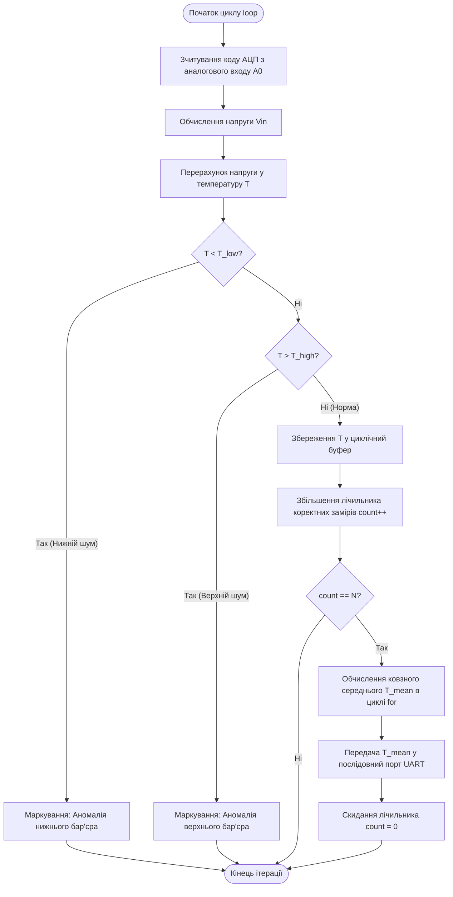
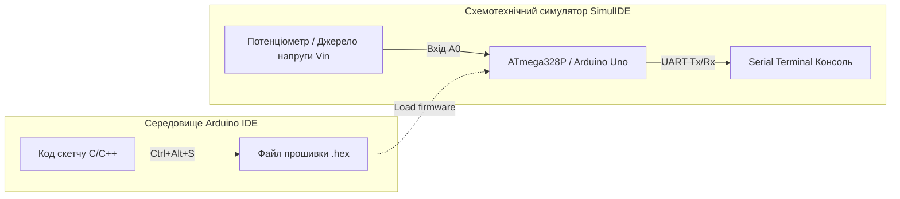

## **Лабораторна робота № 2<br>Розробка алгоритмів обробки даних з давачів**

## **Мета роботи та стек технологій**

**Мета:** Набуття практичних навичок проєктування та реалізації високоефективних алгоритмів первинної обробки телеметрії від сенсорних пристроїв у системах жорсткого реального часу. Навчання включає реалізацію алгоритмів відсікання аномальних значень і шуму за допомогою умовних розгалужень та обчислення ковзного середнього з використанням циклічних конструкцій мовою C/C++ у середовищі Arduino IDE та схемотехнічному симуляторі SimulIDE.

**Стек технологій та інструменти:**
*   **Мова програмування:** C/C++ (стандарт C++17 для вбудованих систем).
*   **Середовище розробки:** Arduino IDE (версія 1.8.x або 2.x).
*   **Схемотехнічний симулятор:** SimulIDE (версія 0.4.15 або новіша).
*   **Апаратна платформа симуляції:** мікроконтролер ATmega328P (платформа Arduino Uno), віртуальні термопари, потенціометри аналогового сигналу, послідовний порт UART (Serial Terminal).

---

## **1 Теоретичні відомості**

### **Особливості алгоритмів обробки телеметрії в системах жорсткого реального часу**

Кіберфізичні системи функціонують у безпосередньому зв'язку з фізичним середовищем, де затримка в обробці сигналу від датчика може призвести до системної аварії або деструкції обладнання. У системах жорсткого реального часу час виконання алгоритму є такою ж критичною характеристикою коректності, як і математична точність результату.

Під час зчитування сигналів із первинних перетворювачів (наприклад, термопар, датчиків тиску чи вібрації) на вхідні кола мікроконтролера потрапляє корисний сигнал, спотворений електромагнітними завадами, імпульсними перешкодами та шумами аналогово-цифрового перетворення. Для отримання достовірної інформації на рівні алгоритмічного забезпечення (**Brainware**) застосовують два послідовних етапи:
1.  **Фільтрація аномальних значень (відсікання шумів)** за допомогою умовних розгалужень, де виміри, що виходять за допустимі фізичні межі, відкидаються.
2.  **Згладжування (фільтрація високочастотного шуму)** шляхом накопичення вибірки коректних значень у циклічному буфері та обчислення середнього арифметичного значення.

### **Стратегія побудови умовних розгалужень без складних булевих виразів**

Під час розробки алгоритмів реального часу для мікроконтролерів із обмеженою частотою тактування та малим обсягом оперативної пам'яті вибір керуючих конструкцій має вирішальне значення.

Традиційний підхід із використанням складних булевих виразів вигляду `if (temp >= T_MIN && temp <= T_MAX)` вимагає від процесора обчислення кількох логічних операндів та виконання декількох умовних переходів на рівні машинних інструкцій. Це збільшує середню кількість операцій $K_{сер}$ та створює невизначеність у часі виконання різних гілок коду.

Альтернативною та рекомендованою для систем жорсткого реального часу є **стратегія відсікання бар'єрами (послідовне відсікання значень зліва направо)**. Цей підхід передбачає послідовну перевірку вхідного значення на вихід за межі допустимого діапазону за допомогою простих умовних операторів `if - else if`. 

Застосування послідовного відсікання бар'єрами дає змогу швидко завершити обробку аномального сигналу на першому ж логічному кроці. Це мінімізує обсяг скомпільованого машинного коду $M$ у флеш-пам'яті мікроконтролера та забезпечує детермінований час проходження алгоритму.

### **Циклічні конструкції та накопичення ковзного середнього**

Для згладжування флуктуацій сигналу використовується алгоритм ковзного середнього. Накопичення $N$ послідовних коректних замірів здійснюється в циклічному буфері (масиві).

При організації циклів у вбудованих системах застосовують наступні керуючі конструкції:
*   Конструкція `while` здійснює перевірку умови до початку ітерації та використовується у випадках, коли кількість повторень заздалегідь невідома.
*   Конструкція `do - while` виконує перевірку умови в кінці ітерації, що гарантує принаймні одноразове виконання тіла циклу.
*   Конструкція `for` автоматизує лічильник ітерацій і є найбільш структурованою для обробки фіксованих масивів даних.

### **Математичний апарат та функції трудомісткості**

Аналогово-цифровий перетворювач (АЦП) мікроконтролера ATmega328P є 10-розрядним, тому він трансформує аналогову напругу $V_{in}$ у цифровий код $ADC_{val}$ у діапазоні від $0$ до $1023$.

Залежність напруги на вхідному аналоговому піні від цифрового коду АЦП описується формулою:

$$
V_{in} = \frac{ADC_{val} \cdot V_{ref}}{1023}
$$

де:
*   $V_{in}$ — виміряна напруга на аналоговому вході, вимірюється у волотах ($\text{В}$);
*   $ADC_{val}$ — цілочисельний код АЦП у діапазоні $[0, 1023]$;
*   $V_{ref}$ — опорна напруга АЦП (для Arduino Uno за замовчуванням $V_{ref} = 5.0\text{ В}$).

Лінійна трансформація виміряної напруги $V_{in}$ у значення температури $T$ здійснюється за залежністю:

$$
T = T_{min} + \frac{V_{in}}{V_{ref}} \cdot (T_{max} - T_{min})
$$

де:
*   $T$ — розрахована температура, вимірюється у градусах Цельсія ($^\circ\text{C}$);
*   $T_{min}, T_{max}$ — мінімальне та максимальне значення температурного діапазону конкретного датчика.

Обчислення середнього арифметичного значення $\bar{T}$ для вибірки з $N$ коректних вимірів реалізується за формулою:

$$
\bar{T} = \frac{1}{N} \sum_{i=0}^{N-1} T_i
$$

де:
*   $\bar{T}$ — усереднене значення температури ($^\circ\text{C}$);
*   $T_i$ — $i$-й коректний замір температури, що пройшов бар'єрну фільтрацію;
*   $N$ — розмір вікна накопичення (кількість елементів вибірки).

Ефективність алгоритму в умовах обмежених ресурсів мікроконтролера оцінюється за **функцією трудомісткості** $\Psi$:

$$
\Psi = c_1 \cdot F_a(N) + c_2 \cdot M + c_3 \cdot S_d + c_4 \cdot S_r
$$

де:
*   $F_a(N)$ — часова складність алгоритму (загальна кількість елементарних операцій додавання, порівняння та присвоєння), вимірюється в тактах;
*   $M$ — обсяг програмного коду в машинного інструкціях (розмір Flash-пам'яті);
*   $S_d$ — обсяг оперативної пам'яті (SRAM), виділений під статичні та глобальні змінні (масив буфера);
*   $S_r$ — обсяг оперативної пам'яті, необхідний для організації системного стека під час виклику функцій;
*   $c_1, c_2, c_3, c_4$ — вагові коефіцієнти значущості ресурсів для платформи ATmega328P.

Середня кількість операцій $K_{сер}$ для розгалужених алгоритмів фільтрації обчислюється як:

$$
K_{сер} = \frac{K_{min} + K_{max}}{2}
$$

де $K_{min}$ та $K_{max}$ — відповідно мінімальна та максимальна кількість операцій порівняння і переходу залежно від того, якою гілкою підуть обчислення.


*Рисунок 1 — Алгоритм відсікання аномальних значений та обчислення середнього значення телеметрії*

Представлена схема наочно ілюструє відсутність складних вкладених умовних операторів. Вхідне значення температури спочатку перевіряється нижнім бар'єром, і у разі завади обробка переривається, що забезпечує мінімальний час затримки $K_{min}$.

---

## **2 Підготовка середовища та розгортання проєкту (Крок 0)**

Для виконання роботи необхідно встановити та налаштувати програмний комплекс, що складається з середовища розробки Arduino IDE та симулятора SimulIDE.

### **Крок 0.1. Встановлення ПЗ**
1.  Завантажте та встановіть **Arduino IDE** з офіційного сайту [arduino.cc](https://www.arduino.cc/en/software).
2.  Завантажте схемотехнічний симулятор **SimulIDE** з офіційного ресурсу [simulide.com](https://www.simulide.com/). Симулятор не потребує інсталяції та запускається з розархівованої папки за допомогою виконуваного файлу `SimulIDE.exe`.

### **Крок 0.2. Створення робочого проєкту**
Створіть на диску папку для проєкту з назвою `cps-lab2-sensor`. Всередині папки створіть скетч Arduino з аналогічною назвою `cps-lab2-sensor.ino`.

Структура папки проєкту повинна мати вигляд:
```
cps-lab2-sensor/
├── cps-lab2-sensor.ino   (Файл коду C/C++)
└── circuit.simu           (Схема моделювання SimulIDE)
```

### **Крок 0.3. Налаштування симуляційної схеми в SimulIDE**
1.  Запустіть `SimulIDE.exe`.
2.  У лівій панелі компонентів у розділі **Micro** знайдіть компонент **Arduino Uno** та перетягніть його на робоче поле.
3.  У розділі **Switches/Potentiometers** знайдіть **Potentiometer** (або у розділі **Sources** візьміть **Volt. Source**) для імітації виходу термопари.
4.  З’єднайте центральний вивід потенціометра з аналоговим входом **A0** плати Arduino Uno. Крайні виводи потенціометра підключіть до ліній **5V** та **GND**.
5.  Клацніть правою кнопкою миші на плату Arduino Uno та оберіть пункт **Open Serial Monitor** для відкриття консолі UART.
6.  Збережіть схему у папку проєкту під назвою `circuit.simu`.

---

## **3 Порядок виконання роботи**

### **Індивідуальні завдання**

Параметри систем обробки телеметрії вибираються з наведеної нижче таблиці відповідно до номера варіанта (номер студента у списку групи).

| Варіант | Процес / Тип датчика | $V_{ref}$, В | $T_{min}, ^\circ\text{C}$ | $T_{max}, ^\circ\text{C}$ | Нижній бар'єр $T_{low}, ^\circ\text{C}$ | Верхній бар'єр $T_{high}, ^\circ\text{C}$ | Розмір вікна $N$ |
| :---: | :--- | :---: | :---: | :---: | :---: | :---: | :---: |
| **1** | Охолодження реактора | $5.0$ | $-50$ | $+150$ | $-20$ | $+100$ | $8$ |
| **2** | Термообробка сталі | $5.0$ | $0$ | $+1000$ | $+100$ | $+850$ | $10$ |
| **3** | Клімат-контроль теплиці | $5.0$ | $-10$ | $+60$ | $0$ | $+45$ | $5$ |
| **4** | Моніторинг двигуна | $5.0$ | $-40$ | $+200$ | $-10$ | $+140$ | $12$ |
| **5** | Кріогенна установка | $5.0$ | $-200$ | $+50$ | $-180$ | $0$ | $6$ |
| **6** | Сушильна камера | $5.0$ | $0$ | $+300$ | $+20$ | $+220$ | $8$ |
| **7** | Інкубатор птахофабрики | $5.0$ | $+10$ | $+50$ | $+25$ | $+42$ | $4$ |
| **8** | Паровий котел | $5.0$ | $0$ | $+500$ | $+50$ | $+400$ | $15$ |
| **9** | Масляний трансформатор | $5.0$ | $-20$ | $+120$ | $0$ | $+90$ | $10$ |
| **10** | Теплообмінник ГВС | $5.0$ | $0$ | $+100$ | $+10$ | $+80$ | $5$ |
| **11** | Автоклав харчовий | $5.0$ | $0$ | $+200$ | $+30$ | $+150$ | $8$ |
| **12** | Сонячний колектор | $5.0$ | $-30$ | $+120$ | $-10$ | $+95$ | $6$ |
| **13** | Серверна стійка | $5.0$ | $0$ | $+70$ | $+10$ | $+45$ | $5$ |
| **14** | Ливарна форма | $5.0$ | $+100$ | $+1200$ | $+200$ | $+1000$ | $12$ |
| **15** | Холодильна камера | $5.0$ | $-35$ | $+15$ | $-30$ | $+5$ | $8$ |
| **16** | Газова турбіна | $5.0$ | $0$ | $+800$ | $+100$ | $+650$ | $10$ |
| **17** | Магістральний нафтопровід| $5.0$ | $-40$ | $+80$ | $-20$ | $+50$ | $6$ |
| **18** | Паяльна станція | $5.0$ | $0$ | $+450$ | $+100$ | $+380$ | $5$ |
| **19** | Електролізний ванна | $5.0$ | $0$ | $+250$ | $+40$ | $+180$ | $8$ |
| **20** | Система дегазації | $5.0$ | $-20$ | $+150$ | $0$ | $+110$ | $10$ |

---

### **Покроковий алгоритм розробки скетчу в Arduino IDE**

Відкрийте файл `cps-lab2-sensor.ino` у середовищі Arduino IDE та введіть повний програмний код, поданий нижче.

> **Увага:** У коді наведено конфігурацію для **Варіанта №1**. При виконанні свого варіанта замініть значення констант `T_MIN`, `T_MAX`, `T_LOW_BARRIER`, `T_HIGH_BARRIER` та `WINDOW_SIZE` на значення з таблиці.

```cpp
/**
 * Лабораторна робота №2. Прикладні алгоритми КФС.
 * Алгоритм відсікання аномальних значень телеметрії та накопичення ковзного середнього.
 * Варіант №1: Охолодження реактора.
 */

// 1. Конфігураційні константи системи (залежать від Варіанта)
const float V_REF = 5.0;            // Опорна напруга АЦП, Вольт
const float T_MIN = -50.0;          // Мінімальна температура датчика, град. C
const float T_MAX = 150.0;          // Максимальна температура датчика, град. C
const float T_LOW_BARRIER = -20.0;  // Нижній допустимий бар'єр відсікання, град. C
const float T_HIGH_BARRIER = 100.0; // Верхній допустимий бар'єр відсікання, град. C
const int WINDOW_SIZE = 8;          // Розмір вікна накопичення коректних замірів N

// 2. Визначення вхідного піна АЦП
const int SENSOR_PIN = A0;          // Аналоговий вхід мікроконтролера

// 3. Глобальні змінні для зберігання стану буфера
float tempBuffer[WINDOW_SIZE];      // Циклічний буфер для збереження коректних замірів
int validSampleCount = 0;           // Лічильник збережених коректних замірів
unsigned long totalReadings = 0;    // Загальний лічильник виконаних зчитувань
unsigned long rejectedReadings = 0; // Лічильник відкинутих аномальних значень

void setup() {
  // Ініціалізація послідовного порту UART зі швидкістю 9600 біт/с
  Serial.begin(9600);
  
  // Виведення банера системи у консоль
  Serial.println(F("=================================================="));
  Serial.println(F(" КФС: Система первинної обробки телеметрії реального часу"));
  Serial.println(F(" Стратегія: Послідовне відсікання бар'єрами без складних булевих умов"));
  Serial.println(F("=================================================="));
}

void loop() {
  // 1. Зчитування цифрового коду АЦП з аналогового входу A0
  uint16_t adcRaw = analogRead(SENSOR_PIN);
  totalReadings++;

  // 2. Розрахунок фактичної напруги Vin
  float vIn = (adcRaw * V_REF) / 1023.0;

  // 3. Масштабування напруги у фізичне значення температури T
  float currentTemp = T_MIN + (vIn / V_REF) * (T_MAX - T_MIN);

  // 4. Реалізація стратегії відсікання бар'єрами (оптимізована для реального часу)
  // Використовуємо прості послідовні перевірки замість складних умов з && та ||
  if (currentTemp < T_LOW_BARRIER) {
    // Відсікання за нижньою межею (аномальний холод/шум)
    rejectedReadings++;
    Serial.print(F("[АНОМАЛІЯ НИЖНЯ] Замір #"));
    Serial.print(totalReadings);
    Serial.print(F(": T = "));
    Serial.print(currentTemp, 2);
    Serial.println(F(" deg C < T_low. Відкинуто."));
  } 
  else if (currentTemp > T_HIGH_BARRIER) {
    // Відсікання за верхньою межею (аномальне перегрівання/імпульсний шум)
    rejectedReadings++;
    Serial.print(F("[АНОМАЛІЯ ВЕРХНЯ] Замір #"));
    Serial.print(totalReadings);
    Serial.print(F(": T = "));
    Serial.print(currentTemp, 2);
    Serial.println(F(" deg C > T_high. Відкинуто."));
  } 
  else {
    // Замір знаходиться в межах норми - додаємо до циклічного буфера
    tempBuffer[validSampleCount] = currentTemp;
    validSampleCount++;

    Serial.print(F("[НОРМА] Замір #"));
    Serial.print(totalReadings);
    Serial.print(F(": T = "));
    Serial.print(currentTemp, 2);
    Serial.print(F(" deg C занесено в буфер ("));
    Serial.print(validSampleCount);
    Serial.print(F("/"));
    Serial.print(WINDOW_SIZE);
    Serial.println(F(")"));

    // 5. Перевірка заповнення вікна накопичення N
    if (validSampleCount >= WINDOW_SIZE) {
      // Обчислення ковзного середнього за допомогою циклу for
      float sum = 0.0;
      for (int i = 0; i < WINDOW_SIZE; i++) {
        sum += tempBuffer[i];
      }
      float meanTemp = sum / WINDOW_SIZE;

      // Виведення підсумкового результату
      Serial.println(F("--------------------------------------------------"));
      Serial.print(F(">>> УСЕРЕДНЕНА ТЕЛЕМЕТРІЯ (N="));
      Serial.print(WINDOW_SIZE);
      Serial.print(F("): T_mean = "));
      Serial.print(meanTemp, 3);
      Serial.println(F(" deg C <<<"));
      
      // Статистика відсікання завад
      float errorRate = ((float)rejectedReadings / totalReadings) * 100.0;
      Serial.print(F("Статистика: Всього замірів: "));
      Serial.print(totalReadings);
      Serial.print(F(" | Відкинуто завад: "));
      Serial.print(rejectedReadings);
      Serial.print(F(" ("));
      Serial.print(errorRate, 1);
      Serial.println(F("%)\n--------------------------------------------------"));

      // Скидання лічильника буфера для наступного вікна
      validSampleCount = 0;
    }
  }

  // Затримка 500 мс між замірами для симуляції періодичного опитування
  delay(500);
}
```

### **Компіляція та завантаження прошивки в SimulIDE**

1.  У середовищі **Arduino IDE** перевірте правильність налаштувань плати: оберіть пункт меню **Tools -> Board -> Arduino AVR Boards -> Arduino Uno**.
2.  Виконайте експорт скомпільованого двійкового файлу прошивки: оберіть пункт меню **Sketch -> Export Compiled Binary** (або натисніть комбінацію клавіш `Ctrl + Alt + S`).
3.  У папці проєкту `cps-lab2-sensor` з'явиться скомпільований файл із розширенням `.hex` (наприклад, `cps-lab2-sensor.ino.hex`).
4.  Перейдіть до вікна програму **SimulIDE**.
5.  Клацніть правою кнопкою миші на мікроконтролер **ATmega328P** (Arduino Uno) та у контекстному меню оберіть пункт **Load firmware**.
6.  У вікні файлового менеджера вкажіть шлях до завантаженого `.hex` файлу.
7.  Натисніть кнопку **Power Circuit** (червона кнопка запуску симуляції у верхній лівій частині вікна SimulIDE).


*Рисунок 2 — Схема взаємодії апаратних компонентів та програмного комплексу в SimulIDE*

Ця схема показує, що прошивка C/C++, розроблена в Arduino IDE, після компіляції в `.hex` файл завантажується у віртуальний мікроконтролер, який зчитує аналоговий сигнал від потенціометра та виводить відфільтровані результати в консоль UART.

---

### **Проведення експерименту та зняття логів**

1.  Після запуску симулятора відкрийте **Serial Monitor** у SimulIDE.
2.  Змінюйте положення ручки потенціометра для створення різного рівня напруги $V_{in}$:
    *   Встановіть напругу, яка відповідає нормальній температурі (наприклад, $2.5\text{ В}$). Переконайтеся у появі повідомлень `[НОРМА]` та заповненні буфера.
    *   Зменшіть напругу до $0\text{ В}$ (температура нижче $T_{low}$). Переконайтеся у появі повідомлень `[АНОМАЛІЯ НИЖНЯ]` та відсутності зміни лічильника `validSampleCount`.
    *   Збільште напругу до $5\text{ В}$ (температура вище $T_{high}$). Переконайтеся у появі повідомлень `[АНОМАЛІЯ ВЕРХНЯ]`.
3.  Після накопичення $N$ коректних замірів перевірте розрахунок підсумкового значення `T_mean`.

**Приклад виведення у Serial Monitor:**

```text
==================================================
 КФС: Система первинної обробки телеметрії реального часу
 Стратегія: Послідовне відсікання бар'єрами без складних булевих умов
==================================================
[НОРМА] Замір #1: T = 25.40 deg C занесено в буфер (1/8)
[НОРМА] Замір #2: T = 26.10 deg C занесено в буфер (2/8)
[АНОМАЛІЯ ВЕРХНЯ] Замір #3: T = 125.00 deg C > T_high. Відкинуто.
[НОРМА] Замір #4: T = 24.80 deg C занесено в буфер (3/8)
[АНОМАЛІЯ НИЖНЯ] Замір #5: T = -45.00 deg C < T_low. Відкинуто.
[НОРМА] Замір #6: T = 25.00 deg C занесено в буфер (4/8)
[НОРМА] Замір #7: T = 25.20 deg C занесено в буфер (5/8)
[НОРМА] Замір #8: T = 24.90 deg C занесено в буфер (6/8)
[НОРМА] Замір #9: T = 25.10 deg C занесено в буфер (7/8)
[НОРМА] Замір #10: T = 25.30 deg C занесено в буфер (8/8)
--------------------------------------------------
>>> УСЕРЕДНЕНА ТЕЛЕМЕТРІЯ (N=8): T_mean = 25.225 deg C <<<
Статистика: Всього замірів: 10 | Відкинуто завад: 2 (20.0%)
--------------------------------------------------
```

---

## **4 Вимоги до змісту звіту**

Звіт з лабораторної роботи оформлюється у форматі PDF або MS Word відповідно до стандартів вищого навчального закладу і повинен містити наступні обов’язкові елементи:

1.  **Титульна сторінка.**
    *   Назва вищого навчального закладу, кафедри, дисципліни.
    *   Номер та назва лабораторної роботи, номер обраного варіанта.
    *   ПІБ а, шифр навчальної групи.
2.  **Мета роботи, короткі теоретичні відомості та опис отриманого завдання.**
    *   Виклад основного теоретичного базису.
    *   Опис завдання згідно з таблицею варіантів.
3.  **Схемотехнічна модель.** Скріншот робочого поля симулятора SimulIDE із зображенням підключеної плати Arduino Uno, аналогового джерела сигналу та відкритого монітора послідовного порту.
4.  **Програмний код.** Повний текст скетчу C/C++ (`cps-lab2-sensor.ino`) із коментарями.
5.  **Результати вимірювань.** Скріншоти консолі UART, що підтверджують відсікання нижньої та верхньої аномалій, а також підсумковий розрахунок усередненої температури `T_mean`.
6.  **Аналітичний розрахунок складності.**
    *   Розрахунок середньої кількості операцій розгалуження $K_{сер} = \frac{K_{min} + K_{max}}{2}$.
    *   Оцінка обсягу Flash та SRAM пам’яті, використаної скетчем (на основі звіту компілятора Arduino IDE).
7.  **Висновки.** Підсумковий аналіз ефективності застосування стратегії відсікання бар'єрами для систем жорсткого реального часу.

---

## **5 Контрольні запитання**

1.  Чому при розробці програмного забезпечення для систем жорсткого реального часу рекомендується уникати складних умовних виразів із великою кількістю вкладених булевих операторів (`&&`, `||`)?
2.  Поясніть фізичний зміст коефіцієнтів $c_1, c_2, c_3, c_4$ у формулі функції трудомісткості $\Psi$. Який із ресурсів є найбіднішим у мікроконтролері ATmega328P?
3.  У чому полягає відмінність між повною та короткою схемами обчислення булевих виразів компілятором C++? Як короткий вирахування запобігає помилкам звернення до пам'яті?
4.  Яким чином розрядність АЦП (10 біт) впливає на роздільну здатність вимірювання температури у градусах Цельсія для вашого варіанта? Наведіть розрахунок ціни найменшого розряду (LSB).
5.  Як використання статичного масиву як циклічного буфера впливає на ємнісну складність $S_d$ в оперативній пам'яті (SRAM) порівняно з використанням динамічної пам'яті (`malloc`/`new`) у мікроконтролерах?

