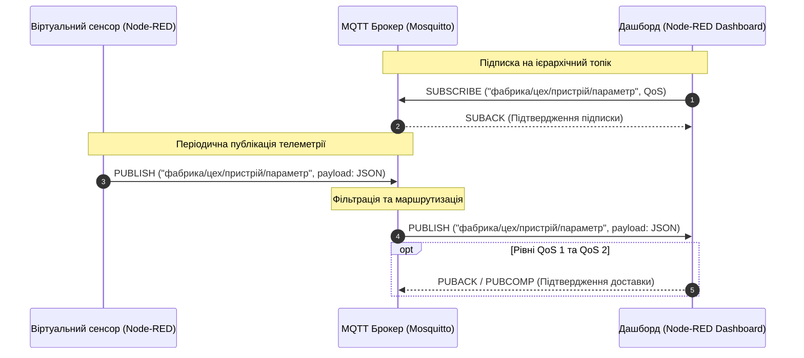
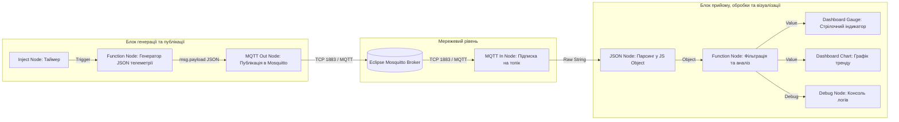

# МЕТОДИЧНА ІНСТРУКЦІЯ ДО ВИКОНАННЯ ЛАБОРАТОРНОЇ РОБОТИ № 3

## **Дисципліна:** Прикладні алгоритми кіберфізичних систем
## **Тема:** Архітектура та обмін даними в КФС (Протокол MQTT та візуалізація телеметрії)
## **Лабораторна робота № 3:** Оркестрування потоків даних у середовищі Node-RED

---

## **1. Мета роботи та стек технологій**

**Мета роботи:** Засвоєння практичних навичок оркістрування потоків телеметрії в екосистемах Інтернету речей (IoT) та промислового Інтернету речей (IIoT), налаштування протоколів обміну даними реального часу, конфігурування MQTT-брокера, формування структурованих повідомлень у форматі JSON, розробка ієрархічних тем (топіків) публікації та підписки, а також побудова інтерактивних панелей моніторингу в середовищі Node-RED.

**Стек технологій та інструменти:**
*   **Платформа оркестрування:** Node-RED (потокове програмування на базі Node.js).
*   **Мова скриптів обробки:** JavaScript (ECMAScript 2022+).
*   **Протокол передачі даних:** MQTT (Message Queuing Telemetry Transport v3.1.1 / v5.0).
*   **MQTT-брокер:** Eclipse Mosquitto.
*   **Формат даних:** JSON (JavaScript Object Notation).
*   **Модуль візуалізації:** `node-red-dashboard`.

---

## **2. Теоретичні відомості**

### **2.1. Екосистема IIoT та парадигма публікації/підписки**

У кіберфізичних системах рівень **Brainware** забезпечує перетворення первинних фізичних сигналів на інтелектуальні рішення. Для обміну даними між розподіленими сенсорними вузлами та хмарно-граничними обчислювальними платформами використовується протокол MQTT. На відміну від традиційної клієнт-серверної моделі HTTP, де клієнт постійно опитує сервер, протокол MQTT працює за моделлю **«публікація/підписка» (publish/subscribe)**.

Парадигма публікації та підписки повністю розв'язує відправника (публікатора) і отримувача (підписника) у часі, просторі та за джерелами даних. Центральним вузлом такої мережі є **MQTT-брокер**, який приймає повідомлення від пристроїв-публікаторів, виконує їх фільтрацію та миттєво перенаправляє відповідним пристроям-підписникам.


*Рисунок 1 — Схема взаємодії компонентів у екосистемі MQTT при передачі телеметрії КФС*

Наведений рисунок ілюструє повний життєвий цикл передачі даних. Процес розпочинається з ініціалізації підписки панеллю моніторингу, після чого віртуальний сенсор генерує телеметрію та публікує її на брокер, який здійснює маршрутизацію до споживачів.

### **2.2. Ієрархія топіків та структуризація JSON-пакетів**

Маршрутизація повідомлень у протоколі MQTT здійснюється за допомогою **тем (топіків)**, які являють собою текстові рядки у кодуванні UTF-8 з ієрархічною структурою. Рівні ієрархії розділяються символом похилої риски `/`. Для кіберфізичних систем стандартом де-факто є чотирирівнева адресація:

$$
\text{Топік} = \text{фабрика} / \text{цех} / \text{пристрій} / \text{параметр}
$$

Наприклад, тема `kyiv_plant/shop_1/press_04/pressure` чітко ідентифікує тиск на пресі №4 у першому цеху київського заводу. 

Для гнучкого управління підписками протокол підтримує символи шаблонів (wildcards):
*   Однорівневий шаблон `+` замінює точно один рівень ієрархії. Підписка `kyiv_plant/+/press_04/pressure` дозволить отримувати дані про тиск з усіх цехів.
*   Багаторівневий шаблон `#` замінює всі наступні рівні ієрархії і повинен стояти лише наприкінці рядка. Підписка `kyiv_plant/shop_1/#` дозволить отримувати всю телеметрію першого цеху.

Для забезпечення універсальності обміну даними корисне навантаження (payload) формується у форматі **JSON**. Структура JSON-пакета в КФС включає метку часу (timestamp), числове значення параметра, одиниці вимірювання та діагностичний статус.

### **2.3. Рівні якості обслуговування (QoS)**

Протокол MQTT підтримує три рівні якості обслуговування (Quality of Service), які визначають гарантії доставки повідомлень в умовах нестабільного зв'язку:

*   Рівень **QoS 0 (At most once)** забезпечує доставку повідомлення не більше одного разу без очікування підтвердження, що гарантує мінімальне використання мережевого трафіку та низьку затримку.
*   Рівень **QoS 1 (At least once)** гарантує доставку повідомлення принаймні один раз за допомогою квитування пакетом `PUBACK`. Якщо підтвердження не надійшло, відправник повторює передачу, що може призвести до дублювання даних.
*   Рівень **QoS 2 (Exactly once)** забезпечує доставку повідомлення строго один раз за допомогою чотирьохетапного рукостискання (`PUBREC`, `PUBREL`, `PUBCOMP`), що виключає втрату чи дублювання команд у критичних вузлах КФС.

### **2.4. Математичний апарат аналізу каналів зв'язку та автономності**

Максимальна пропускна здатність каналу зв'язку $C$, яка визначає верхню межу швидкості передачі телеметрії від сенсорного вузла до брокера, розраховується за **теоремою Шеннона-Гартлі**:

$$
C = W \cdot \log_2\left(1 + \frac{S}{N}\right)
$$

де:
*   $C$ — максимальна швидкість передачі інформації, вимірюється в бітах за секунду ($\text{біт/с}$);
*   $W$ — смуга пропускання радіоканалу, вимірюється в герцах ($\text{Гц}$);
*   $S/N$ — безрозмірне відношення потужності корисного сигналу $S$ до потужності завад і шуму $N$ (відношення сигнал/шум).

Для автономних сенсорних вузлів КФС критичним показником є час життя батареї $T_{life}$, який залежить від періоду опитування та тривалості активної фази передачі через MQTT:

$$
T_{life} = \frac{C_{bat}}{I_{avg} \cdot 24 \cdot 365}
$$

$$
I_{avg} = \frac{I_{active} \cdot t_{active} + I_{sleep} \cdot t_{sleep}}{t_{cycle}}
$$

де:
*   $T_{life}$ — розрахунковий термін роботи автономного живлення, вимірюється в роках;
*   $C_{bat}$ — номінальна ємність акумулятора, вимірюється в міліампер-годинах ($\text{мА}\cdot\text{год}$);
*   $I_{avg}$ — середній струм споживання за один повний цикл, вимірюється в міліамперах ($\text{мА}$);
*   $I_{active}$ та $t_{active}$ — струм ($\text{мА}$) та тривалість ($\text{с}$) активного стану пристрою під час зняття показників та MQTT-сесії;
*   $I_{sleep}$ та $t_{sleep}$ — струм ($\text{мА}$) та тривалість ($\text{с}$) режиму енергозбереження (сну);
*   $t_{cycle}$ — загальний період циклу роботи ($t_{cycle} = t_{active} + t_{sleep}$), вимірюється в секундах ($\text{с}$).

Для кодування поля залишкової довжини (Remaining Length) у заголовку пакета MQTT використовується змінна кількість байтів від 1 до 4. Обчислення фактичної довжини корисного навантаження $L$ здійснюється за формулою:

$$
L = \sum_{i=1}^{n} (B_i \ \& \ 127) \cdot 128^{i-1}
$$

де $n$ позначає кількість байтів поля довжини ($1 \le n \le 4$), $B_i$ — значення $i$-го байта, а побітова операція $\& \ 127$ виділяє 7 молодших бітів даних, відкидаючи старший біт продовження.

---

## **3. Підготовка середовища та розгортання проєкту (Крок 0)**

Для виконання лабораторної роботи необхідно встановити середовище Node.js, платформу Node-RED, панель візуалізації `node-red-dashboard` та брокер повідомлень Eclipse Mosquitto.

### **Крок 0.1. Перевірка Node.js та глобальне встановлення Node-RED**

Відкрийте системний термінал (PowerShell, Bash) і перевірте наявність Node.js:

```bash
node -v
npm -v
```

Якщо Node.js встановлено, виконайте глобальну інсталяцію платформи Node-RED:

```bash
npm install -g --unsafe-perm node-red
```

### **Крок 0.2. Встановлення та запуск MQTT-брокера Mosquitto**

Встановити брокер Mosquitto можна залежно від вашої операційної системи:

*   **Windows:** Завантажте та встановіть інсталятор з офіційного сайту [mosquitto.org](https://mosquitto.org/download/).
*   **Linux (Ubuntu/Debian):**
    ```bash
    sudo apt update
    sudo apt install -y mosquitto mosquitto-clients
    sudo systemctl enable mosquitto
    sudo systemctl start mosquitto
    ```

Перевірте функціонування брокера за допомогою локального підключення на порт `1883`:

```bash
mosquitto_sub -h localhost -t "test/topic" -v
```

У новому вікні термінала опублікуйте тестове повідомлення:

```bash
mosquitto_pub -h localhost -t "test/topic" -m "Hello CPS MQTT"
```

Якщо в першому терміналі відобразився текст `test/topic Hello CPS MQTT`, брокер працює коректно.

### **Крок 0.3. Запуск Node-RED та встановлення додаткових вузлів**

Запустіть платформу Node-RED з термінала:

```bash
node-red
```

У терміналі з'явиться лог запуску та мережева адреса веб-інтерфейсу (зазвичай `http://127.0.0.1:1880/`).

Відкрийте веб-браузер і перейдіть за адресою `http://127.0.0.1:1880/`.

Для встановлення панелі візуалізації перейдіть у меню Node-RED (верхній правий кут) $\to$ **Manage palette** $\to$ вкладка **Install**, у полі пошуку введіть `node-red-dashboard` та натисніть кнопку **Install**.

Альтернативно встановити плагін можна через термінал у домашній папці Node-RED:

```bash
cd ~/.node-red
npm install node-red-dashboard
```

Після встановлення перезапустіть Node-RED у терміналі.

### **Крок 0.4. Створення структури папок проєкту**

Створіть на локальному диску папку проєкту для збереження конфігурацій та експортованих потоків:

```bash
mkdir cps-lab3-nodered
cd cps-lab3-nodered
touch README.md
```

Структура робочої директорії матиме вигляд:

```
cps-lab3-nodered/
├── flows.json          (Експортований потік Node-RED)
└── README.md           (Опис виконаної роботи)
```

---

## **4. Порядок виконання роботи**

### **4.1. Індивідуальні завдання (20 варіантів)**

Кожен студент виконує завдання відповідно до свого номера у списку групи. Необхідно налаштувати симуляцію сенсора, сформувати топік за шаблоном `фабрика/цех/пристрій/параметр`, налаштувати відповідний рівень QoS, сформувати JSON-пакет та вивести дані на панель дашборду.

| Варіант | Фабрика | Цех | Пристрій | Параметр | Діапазон значень | Період (мс) | Рівень QoS |
| :---: | :--- | :--- | :--- | :--- | :---: | :---: | :---: |
| **1** | `kyiv_metal` | `shop_smelting` | `furnace_01` | `temperature` | $500 \dots 1500\ ^\circ\text{C}$ | $1000$ | QoS 1 |
| **2** | `dnipro_auto` | `shop_assembly` | `robot_arm_3` | `vibration` | $0 \dots 50\ \text{мм/с}$ | $500$ | QoS 2 |
| **3** | `lviv_pharma` | `shop_clean` | `reactor_v2` | `pressure` | $1.0 \dots 5.0\ \text{бар}$ | $2000$ | QoS 0 |
| **4** | `kharkiv_chem` | `shop_acid` | `pump_p102` | `flow_rate` | $10 \dots 200\ \text{л/хв}$ | $1500$ | QoS 1 |
| **5** | `odesa_port` | `grain_terminal` | `conveyor_c1` | `load_weight` | $0 \dots 500\ \text{т/год}$ | $1000$ | QoS 2 |
| **6** | `zap_power` | `turbine_hall` | `generator_g1` | `frequency` | $49.0 \dots 51.0\ \text{Гц}$ | $500$ | QoS 1 |
| **7** | `vin_agro` | `greenhouse_01` | `climate_node` | `humidity` | $30 \dots 95\ \%$ | $3000$ | QoS 0 |
| **8** | `poltava_gas` | `well_site_12` | `compressor_k4` | `gas_pressure` | $10 \dots 100\ \text{атм}$ | $1000$ | QoS 2 |
| **9** | `chernihiv_paper`| `shop_paper` | `dryer_d02` | `temp_roller` | $80 \dots 220\ ^\circ\text{C}$ | $1500$ | QoS 1 |
| **10** | `sumy_machine` | `shop_cnc` | `milling_m01` | `spindle_speed` | $500 \dots 12000\ \text{об/хв}$ | $500$ | QoS 0 |
| **11** | `rivne_basalt` | `crushing_plant` | `jaw_crusher` | `current_draw` | $10 \dots 250\ \text{А}$ | $1000$ | QoS 1 |
| **12** | `zhytomyr_milk` | `pasteurizer_01` | `tank_t3` | `level_liters` | $100 \dots 5000\ \text{л}$ | $2000$ | QoS 2 |
| **13** | `kremenchuk_oil`| `refinery_unit` | `cracking_c1` | `temp_column` | $200 \dots 450\ ^\circ\text{C}$ | $1000$ | QoS 1 |
| **14** | `ternopil_solar` | `inverter_station`| `inverter_i05` | `dc_voltage` | $300 \dots 800\ \text{В}$ | $1000$ | QoS 0 |
| **15** | `frankivsk_cement`| `kiln_dept` | `rotary_kiln` | `torque` | $50 \dots 300\ \text{кН}\cdot\text{м}$ | $1500$ | QoS 2 |
| **16** | `lutsk_plastic` | `injection_shop` | `moulding_m04` | `oil_pressure` | $50 \dots 210\ \text{бар}$ | $500$ | QoS 1 |
| **17** | `cherkasy_azot` | `ammonia_shop` | `synthesis_s2` | `gas_temp` | $350 \dots 550\ ^\circ\text{C}$ | $1000$ | QoS 2 |
| **18** | `zakarpattia_wind`| `wind_farm_03` | `turbine_t12` | `wind_speed` | $0 \dots 35\ \text{м/с}$ | $2000$ | QoS 0 |
| **19** | `kropyv_oil` | `extraction_shop`| `extractor_e1` | `solvent_level` | $5 \dots 95\ \%$ | $1500$ | QoS 1 |
| **20** | `mfg_smart_city` | `water_pumping` | `pump_station_3`| `water_head` | $20 \dots 80\ \text{м}$ | $1000$ | QoS 2 |

---

### **4.2. Покрокова побудова потоку в Node-RED**

#### **Крок 1. Конфігурація вузлів потоку**

У веб-інтерфейсі Node-RED (`http://127.0.0.1:1880/`) перетягніть на робоче поле з лівої панелі наступні вузли:

1.  **Inject (Inject node):** Служить таймером для періодичного запуску генерації даних.
    *   У налаштуваннях оберіть **Repeat** $\to$ **interval**, вкажіть період у мілісекундах відповідно до вашого варіанта.
2.  **Function (Function node):** Містить JavaScript-код для розрахунку симульованого значення сенсора з накладанням завад та формування JSON-об'єкта.
3.  **MQTT Out (mqtt out node):** Публікує сформований пакет у брокер.
    *   Натисніть іконку олівця біля поля **Server** для додавання брокера: **Server** = `localhost` (або `127.0.0.1`), **Port** = `1883`.
    *   Поле **Topic**: вкажіть ієрархічний топік вашого варіанта (наприклад, `kyiv_metal/shop_smelting/furnace_01/temperature`).
    *   Поле **QoS**: виберіть рівень QoS (0, 1 або 2) відповідно до вашого варіанта.
4.  **MQTT In (mqtt in node):** Підписується на топік для отримання даних з брокера.
    *   Використовуйте той самий сервер `localhost:1883`.
    *   Вкажіть топік вашого варіанта або топік з маскою (наприклад, `kyiv_metal/+/+/temperature`).
    *   Встановіть відповідний рівень QoS.
5.  **JSON (json node):** Перетворює отриманий з MQTT рядок у об'єкт JavaScript.
6.  **Function "Filter & Check" (Function node):** Перевіряє отримане значення на нормальний стан та готує дані для візуалізації.
7.  **Dashboard Gauge & Chart (ui_gauge, ui_chart):** Візуалізують поточне значення та графік зміни у часі.
8.  **Debug (debug node):** Виводить лог повідомлень у праву панель відлагодження.


*Рисунок 2 — Схема розробленого потоку даних у середовищі Node-RED*

На рисунку показано поділ потоку на два незалежні блоки. Перший блок створює віртуальні виміри та відправляє їх у брокер Mosquitto, а другий блок підписується на цей же брокер, розпаковує пакет та передає дані на елементи дашборду.

---

#### **Крок 2. Написання коду генерації телеметрії в Node-RED**

Двічі клацніть на вузол **Function Node** у блоці генератора телеметрії та введіть наступний код JavaScript:

```javascript
/**
 * Вузол генерації віртуальної телеметрії КФС (Варіант №1).
 * Генерує значення з плаваючою крапкою, додає випадковий шум,
 * формує ієрархічний топік та JSON-пакет з меткою часу.
 */

// 1. Параметри варіанта завдання
const factory = "kyiv_metal";
const shop = "shop_smelting";
const device = "furnace_01";
const parameter = "temperature";

// 2. Генерація симульованого значення з шумним розподілом
const minVal = 500.0;
const maxVal = 1500.0;
// Базове синусоїдальне значення + випадковий шум
const time = Date.now() / 10000;
const baseValue = minVal + (Math.sin(time) + 1) * 0.5 * (maxVal - minVal);
const noise = (Math.random() - 0.5) * 20.0; // завада +-10 градусів
const currentVal = parseFloat((baseValue + noise).toFixed(2));

// 3. Формування ієрархічного топіка публікації
const fullTopic = `${factory}/${shop}/${device}/${parameter}`;

// 4. Формування об'єкта корисного навантаження (Payload)
const telemetryPayload = {
    timestamp: new Date().toISOString(),
    factory: factory,
    shop: shop,
    device: device,
    metric: parameter,
    value: currentVal,
    unit: "degC",
    status: (currentVal > 1400.0) ? "CRITICAL" : "NORMAL"
};

// 5. Заповнення вихідного повідомлення Node-RED
msg.topic = fullTopic;
msg.payload = JSON.stringify(telemetryPayload); // Серіалізація в JSON-рядок

return msg;
```

---

#### **Крок 3. Написання коду обробки та фільтрації підписаних даних**

Двічі клацніть на вузол **Function Node** у блоці обробки підписаного повідомлення та введіть наступний код:

```javascript
/**
 * Вузол десеріалізації, перевірки та підготовки даних для Dashboard.
 */

// Отримання об'єкта телеметрії (якщо пройшов через JSON node)
let data = msg.payload;

if (typeof data === 'string') {
    try {
        data = JSON.parse(data);
    } catch (e) {
        node.error("Помилка парсингу JSON: " + e.message);
        return null;
    }
}

// Виділення числового значення та формування статусного повідомлення
const sensorValue = Number(data.value);
const deviceStatus = data.status || "UNKNOWN";

// Формування вихідних повідомлень для візуальних вузлів
const msgGauge = { payload: sensorValue };
const msgStatus = { payload: `Пристрій: ${data.device} | Стан: ${deviceStatus}` };

return [msgGauge, msgStatus];
```

---

#### **Крок 4. Повний код експорту потоку Node-RED (Flow JSON)**

Для імпорту готової конфігурації у Node-RED натисніть меню (верхній правий кут) $\to$ **Import**, вставте наведений нижче JSON-код і натисніть **Import**:

```json
[
    {
        "id": "tab_cps_lab3",
        "type": "tab",
        "label": "ЛБ3: MQTT Телеметрія КФС",
        "disabled": false,
        "info": "Потік генерації, публікації та візуалізації телеметрії КФС"
    },
    {
        "id": "mqtt_broker_local",
        "type": "mqtt-broker",
        "name": "Mosquitto Local",
        "broker": "localhost",
        "port": "1883",
        "clientid": "NodeRed_CPS_Client",
        "usetls": false,
        "protocolVersion": "4",
        "keepalive": "60",
        "cleansession": true
    },
    {
        "id": "ui_group_telemetry",
        "type": "ui_group",
        "name": "Показники телеметрії",
        "tab": "ui_tab_dashboard",
        "order": 1,
        "disp": true,
        "width": "6",
        "collapse": false
    },
    {
        "id": "ui_tab_dashboard",
        "type": "ui_tab",
        "name": "Дашборд КФС",
        "icon": "dashboard",
        "order": 1
    },
    {
        "id": "node_inject_timer",
        "type": "inject",
        "z": "tab_cps_lab3",
        "name": "Таймер 1000мс",
        "props": [
            {
                "p": "payload"
            }
        ],
        "repeat": "1",
        "crontab": "",
        "once": false,
        "onceDelay": 0.1,
        "topic": "",
        "x": 150,
        "y": 120,
        "wires": [
            [
                "node_func_generator"
            ]
        ]
    },
    {
        "id": "node_func_generator",
        "type": "function",
        "z": "tab_cps_lab3",
        "name": "Генератор телеметрії (JSON)",
        "func": "const factory = \"kyiv_metal\";\nconst shop = \"shop_smelting\";\nconst device = \"furnace_01\";\nconst parameter = \"temperature\";\n\nconst minVal = 500.0;\nconst maxVal = 1500.0;\nconst time = Date.now() / 10000;\nconst baseValue = minVal + (Math.sin(time) + 1) * 0.5 * (maxVal - minVal);\nconst noise = (Math.random() - 0.5) * 20.0;\nconst currentVal = parseFloat((baseValue + noise).toFixed(2));\n\nconst fullTopic = `${factory}/${shop}/${device}/${parameter}`;\n\nconst telemetryPayload = {\n    timestamp: new Date().toISOString(),\n    factory: factory,\n    shop: shop,\n    device: device,\n    metric: parameter,\n    value: currentVal,\n    unit: \"degC\",\n    status: (currentVal > 1400.0) ? \"CRITICAL\" : \"NORMAL\"\n};\n\nmsg.topic = fullTopic;\nmsg.payload = JSON.stringify(telemetryPayload);\nreturn msg;",
        "outputs": 1,
        "noerr": 0,
        "initialize": "",
        "finalize": "",
        "libs": [],
        "x": 410,
        "y": 120,
        "wires": [
            [
                "node_mqtt_out"
            ]
        ]
    },
    {
        "id": "node_mqtt_out",
        "type": "mqtt out",
        "z": "tab_cps_lab3",
        "name": "Публікація MQTT (QoS 1)",
        "topic": "",
        "qos": "1",
        "retain": "false",
        "respTopic": "",
        "contentType": "",
        "userProps": "",
        "correl": "",
        "expiry": "",
        "broker": "mqtt_broker_local",
        "x": 710,
        "y": 120,
        "wires": []
    },
    {
        "id": "node_mqtt_in",
        "type": "mqtt in",
        "z": "tab_cps_lab3",
        "name": "Підписка MQTT",
        "topic": "kyiv_metal/shop_smelting/furnace_01/temperature",
        "qos": "1",
        "datatype": "auto",
        "broker": "mqtt_broker_local",
        "nl": false,
        "rap": true,
        "rh": 0,
        "inputs": 0,
        "x": 140,
        "y": 260,
        "wires": [
            [
                "node_json_parser"
            ]
        ]
    },
    {
        "id": "node_json_parser",
        "type": "json",
        "z": "tab_cps_lab3",
        "name": "JSON Парсер",
        "property": "payload",
        "action": "",
        "pretty": false,
        "x": 360,
        "y": 260,
        "wires": [
            [
                "node_func_processor",
                "node_debug_out"
            ]
        ]
    },
    {
        "id": "node_func_processor",
        "type": "function",
        "z": "tab_cps_lab3",
        "name": "Обробка даних",
        "func": "const sensorValue = Number(msg.payload.value);\nmsg.payload = sensorValue;\nreturn msg;",
        "outputs": 1,
        "noerr": 0,
        "initialize": "",
        "finalize": "",
        "libs": [],
        "x": 580,
        "y": 260,
        "wires": [
            [
                "node_ui_gauge",
                "node_ui_chart"
            ]
        ]
    },
    {
        "id": "node_debug_out",
        "type": "debug",
        "z": "tab_cps_lab3",
        "name": "Лог Консолі",
        "active": true,
        "toside": true,
        "console": false,
        "tostatus": false,
        "complete": "payload",
        "targetType": "msg",
        "statusVal": "",
        "statusType": "auto",
        "x": 570,
        "y": 340,
        "wires": []
    },
    {
        "id": "node_ui_gauge",
        "type": "ui_gauge",
        "z": "tab_cps_lab3",
        "name": "Індикатор температури",
        "group": "ui_group_telemetry",
        "order": 1,
        "width": 0,
        "height": 0,
        "gtype": "gage",
        "title": "Температура (°C)",
        "label": "°C",
        "format": "{{value}}",
        "min": "500",
        "max": "1500",
        "colors": [
            "#00b500",
            "#e6e600",
            "#ca3838"
        ],
        "seg1": "1000",
        "seg2": "1400",
        "className": "",
        "x": 830,
        "y": 240,
        "wires": []
    },
    {
        "id": "node_ui_chart",
        "type": "ui_chart",
        "z": "tab_cps_lab3",
        "name": "Графік Тренду",
        "group": "ui_group_telemetry",
        "order": 2,
        "width": 0,
        "height": 0,
        "label": "Тренд температури",
        "chartType": "line",
        "legend": "false",
        "xformat": "HH:mm:ss",
        "interpolate": "linear",
        "nodata": "Очікування даних...",
        "dot": false,
        "ymin": "500",
        "ymax": "1500",
        "removeOlder": 1,
        "removeOlderPoints": "",
        "removeOlderUnit": "3600",
        "cutout": 0,
        "useOneColor": false,
        "useUTC": false,
        "colors": [
            "#1f77b4",
            "#aec7e8",
            "#ff7f0e",
            "#2ca02c",
            "#98df8a",
            "#d62728",
            "#ff9896",
            "#9467bd",
            "#c5b0d5"
        ],
        "outputs": 1,
        "useDifferentColor": false,
        "className": "",
        "x": 800,
        "y": 300,
        "wires": [
            []
        ]
    }
]
```

---

### **4.3. Запуск та перевірка функціонування дашборду**

1.  Після імпорту або ручного створення потоку натисніть червону кнопку **Deploy** у верхньому правому куті вікна Node-RED.
2.  Перевірте статус підключення під вузлами **MQTT Out** та **MQTT In**: має з'явитися зелений індикатор зі словом `connected`.
3.  Для відкриття панелі візуалізації (Dashboard) перейдіть за адресою:

```
http://127.0.0.1:1880/ui
```

4.  На екрані відобразиться інтерактивна панель із стрілочним індикатором (Gauge) та графіком часового тренду (Chart), що оновлюватимуться в реальному часі згідно з інтервалом вашого варіанта.

---

## **5. Вимоги до змісту звіту**

Звіт з лабораторної роботи оформлюється у форматі PDF або MS Word і повинен містити наступні обов'язкові розділи:

1.  **Титульна сторінка:** Назва університету, факультету, кафедри, дисципліни, номер лабораторної роботи, тема, варіант, ПІБ студента та викладача.
2.  **Формулювання завдання варіанта:** Таблиця з вхідними параметрами вашого варіанта (Фабрика, Цех, Пристрій, Параметр, Діапазон значень, Період, QoS).
3.  **Схема потоку даних Node-RED:** Скріншот робочого поля редактора Node-RED із розгорнутими вузлами та статусними індикаторами підключення `connected`.
4.  **Програмний код функціональних вузлів:** Повний код JavaScript з вузлів генерації та обробки даних.
5.  **Інтерфейс дашборду:** Скріншот веб-сторінки `http://127.0.0.1:1880/ui` із працюючим індикатором Gauge та графіком Chart.
6.  **Мережевий лог MQTT:** Скріншот термінала з командами `mosquitto_sub`, який підтверджує прийом JSON-повідомлень безпосередньо з брокера.
7.  **Розрахункова частина:**
    *   Розрахунок тривалості автономної роботи акумулятора $T_{life}$ за наведеними у теорії формулами для заданого періоду оновлення.
    *   Обчислення залишкової довжини корисного навантаження $L$ пакета MQTT.
8.  **Висновки:** Підсумковий аналіз переваг використання протоколу MQTT та середовища Node-RED для побудови рішень IIoT.

---

## **6. Контрольні запитання**

1.  У чому полягає концептуальна відмінність між моделлю «запит/відповідь» (HTTP) та моделлю «публікація/підписка» (MQTT)? Які переваги надає MQTT для мереж з мільйонами сенсорів?
2.  Яким чином вибір рівнів якості обслуговування QoS 0, QoS 1 та QoS 2 впливає на обсяг мережевого трафіку, затримки та час життя автономного давача?
3.  Поясніть алгоритм розрахунку поля змінної довжини пакета MQTT (Remaining Length). Яка максимальна довжина корисного навантаження може бути закодована чотирма байтами?
4.  У чому полягає функціональна відмінність між символами шаблонів підписки `+` та `#`? Наведіть приклади їх використання для збору телеметрії з кількох цехів.
5.  Як використання граничних обчислень (Edge Computing) безпосередньо у вузлах Node-RED допомагає зменшити навантаження на мережеві канали та розвантажити центральні хмарні сервери?

