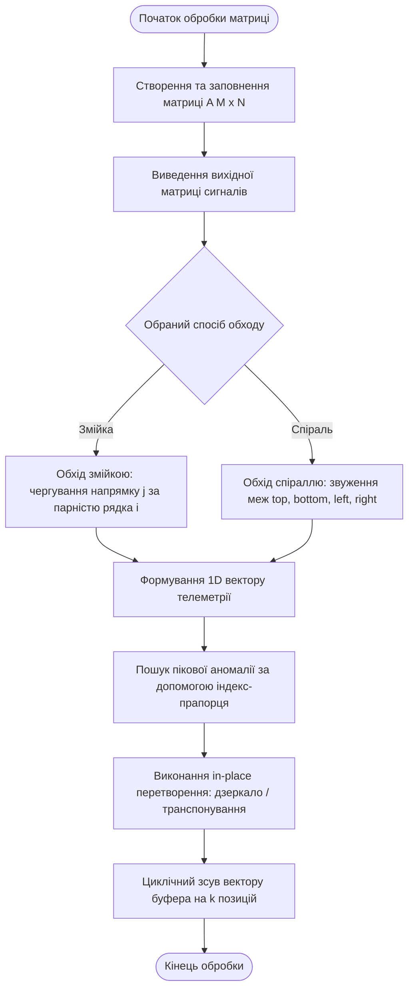
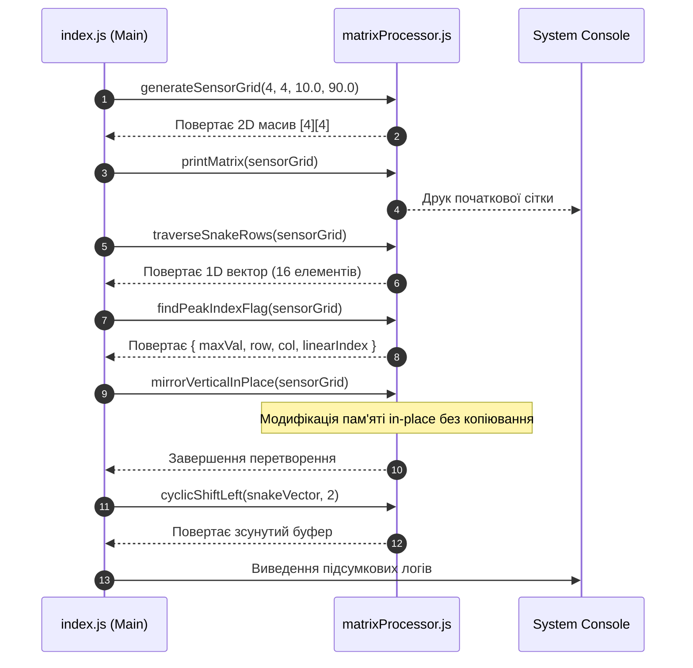

# **Лабораторна робота № 4<br>Обробка матриць сигналів у розподілених системах**

## Мета роботи та стек технологій

**Мета:** Засвоєння практичних навичок розробки та аналізу алгоритмів опрацювання структурованих масивів даних у кіберфізичних системах. Навчання включає створення серверних модулів мовою JavaScript для обробки просторових матриць сенсорних сигналів (grid-based sensors), реалізацію алгоритмів спеціалізованого обходу матриць («змійка», «спіраль»), виконання дзеркальних і діагональних перетворень безпосередньо у вихідній пам'яті (in-place), виявлення просторових пікових аномалій за допомогою індекс-прапорців та створення циклічних буферів для потокової телеметрії.

**Стек технологій та інструменти:**
*   **Серверна платформа:** Node.js (версія v18.0.0 або новіша).
*   **Мова програмування:** JavaScript (стандарт ECMAScript 2022+).
*   **Інструменти розробки:** системний термінал (Bash, PowerShell або zsh), текстовий редактор (Visual Studio Code, WebStorm).

---

## 1 Теоретичні відомості

### Структуровані дані у просторових сенсорних мережах КФС

У сучасних кіберфізичних системах моніторинг просторово-розподілених фізичних процесів (наприклад, температурних полів реакторів, деформаційних матриць будівельних конструкцій чи оптичних датчиків зображень) реалізується за допомогою просторових сенсорних сіток (grid-based sensors). Телеметрія від таких мереж формується у вигляді двовимірних масивів — матриць сигналів розмірністю $M \times N$, де $M$ позначає кількість рядків (координата $Y$), а $N$ визначає кількість стовпчиків (координата $X$).

У фізичній оперативній пам'яті комп'ютера двовимірна матриця розгортається у лінійну послідовність комірок за рядками (row-major order). Це означає, що елементи одного рядка розташовуються у пам'яті один за одним, а перехід до наступного рядка здійснюється зі зміщенням на величину розмірності стовпчиків $N$. Прямий розрахунок лінійного індексу $Idx(i, j)$ для елемента з координатами $(i, j)$ здійснюється за формулою:

$$
Idx(i, j) = i \cdot N + j
$$

де:

*   $i$ — поточний номер рядка матриці у діапазоні $[0, M - 1]$;
*   $j$ — поточний номер стовпчика матриці у діапазоні $[0, N - 1]$;
*   $N$ — загальна кількість стовпчиків у двовимірній матриці.

### Спеціалізовані способи обходу сенсорних матриць

Для обробки просторових даних у КФС стандартний послідовний прохід по рядках не завжди є оптимальним. Для задач сканування та первинного відбору сигналів застосовують такі топологічні обходи:

1.  **Обхід «змійкою» (Zig-zag scan):** Передбачає почергову зміну напрямку проходу елементів у сусідніх рядках. У парних рядках ($i = 0, 2, 4, \dots$) елементи обходяться зліва направо (індекс $j$ зростає від $0$ до $N - 1$), а в непарних рядках ($i = 1, 3, 5, \dots$) — справа наліво (індекс $j$ спадає від $N - 1$ до $0$). Це зменшує просторовий стрибок каретки сканування при переході між рядками.
2.  **Обхід «спіраллю» (Spiral scan):** Полягає у концентричному проходженні периметрів вкладених прямокутників від зовнішніх меж матриці до її центру. Алгоритм керується чотирма динамічними межами: верхньою ($top$), нижньою ($bottom$), лівою ($left$) та правою ($right$), які звужуються після кожного завершеного проходу уздовж відповідної межі.

### Алгоритми симетричних перетворень без додаткової пам'яті

Під час обробки сигналів на граничних пристроях обсяг оперативної пам'яті є жорстко обмеженим. Створення копій матриць для виконання геометричних поворотах або дзеркальних відображень є неприпустимим. Тому застосовують алгоритми виконання операцій **на тому ж місці**, де ємнісна складність становить $S(M, N) = \mathcal{O}(1)$.

Для виконання симетричних перетворень встановлюються строго визначені математичні залежності між індексами вихідної комірки $(i, j)$ та цільової комірки $(i^*, j^*)$:

1.  **Дзеркальне відображення відносно вертикальної осі симетрії:**
    
$$
j^* = (N - 1) - j, \quad i^* = i
$$

    Для запобігання подвійному обміну (який поверне елементи у початковий стан) внутрішній цикл за стовпчиками $j$ виконується суворо до середини рядка, тобто $j < \lfloor N / 2 \rfloor$.

2.  **Дзеркальне відображення відносно горизонтальної осі симетрії:**
    
$$
i^* = (M - 1) - i, \quad j^* = j
$$

    Зовнішній цикл за рядками $i$ виконується суворо до середини висоти матриці, тобто $i < \lfloor M / 2 \rfloor$.

3.  **Транспонування квадратної матриці розміром $N \times N$ (відображення відносно головної діагоналі):**
    
$$
i^* = j, \quad j^* = i
$$

    Обмін елементів $A[i][j] \leftrightarrow A[j][i]$ виконується виключно для елементів, розміщених суворо вище головної діагоналі, тобто за умови $j > i$.

### Пошук пікових аномалій та циклічне буферизація

Пошук максимального значення сигналів у просторовій сітці реалізується за допомогою алгоритмічного прийому **індекс-прапорця**. Створюється цілочисельна змінна `peakIndex`, яка ініціалізується значенням `-1`. Якщо під час обходу виявляється елемент, що перевищує поточний максимум, змінній `peakIndex` присвоюється поточний обчислений лінійний індекс. Значення `-1` наприкінці обходу свідчить про відсутність аномальних сигналів.

Для буферизації часових рядів телеметрії застосовують **циклічний зсув масиву** на $k$ позицій. При зсуві вліво кожен $i$-й елемент заміщується значенням $(i + k)$-го елемента, а витіснені елементи переносяться в кінець масиву за допомогою тимчасового буфера.

### Математичний апарат оцінки алгоритмів

Загальна кількість операцій $T(M, N)$ при повному обході матриці розміром $M \times N$ прямо пропорційна добутку її вимірів, що задає квадратичну або лінійно-квадратичну часову складність:

$$
T(M, N) = \mathcal{O}(M \cdot N)
$$

Загальна трудомісткість обчислювального процесу $\Psi$ оцінюється за формулою:

$$
\Psi = c_1 \cdot F_a(M \cdot N) + c_2 \cdot M_{code} + c_3 \cdot S_d + c_4 \cdot S_r
$$

де:

*   $F_a(M \cdot N)$ — часова складність (кількість елементарних операцій обміну, порівняння та індексного арифметичного розрахунку);
*   $M_{code}$ — розмір обсягу коду програмного модуля;
*   $S_d$ — обсяг оперативної пам'яті для зберігання статичного масиву сигналів;
*   $S_r$ — додатковий обсяг стекової пам'яті, який для in-place алгоритмів є константним $S_r = \mathcal{O}(1)$;
*   $c_1, c_2, c_3, c_4$ — вагові коефіцієнти значущості ресурсів серверної платформи.


*Рисунок 1 — Алгоритмічна схема втузельного обходу та дзеркального перетворення матриці сигналів in-place*

Наведений рисунок показує послідовність етапів конвеєра обробки даних: від первинного формування двовимірної сітки до впорядкованого розгортання у вектор, локалізації пікових аномалій та модифікації структури масиву без виділення додаткової пам'яті.

---

## 2 Підготовка середовища та розгортання проєкту (Крок 0)

Для виконання лабораторної роботи використовується серверне середовище виконання **Node.js**.

### Крок 0.1. Перевірка середовища Node.js
Відкрийте системний термінал та виконайте перевірку версій Node.js та менеджера пакетів npm:

```bash
node -v
npm -v
```

У разі відсутності Node.js завантажте та встановіть актуальну версію LTS з офіційного сайту [nodejs.org](https://nodejs.org/).

### Крок 0.2. Створення структури проєкту
Створіть робочу директорію проєкту в терміналі та перейдіть у неї:

```bash
mkdir cps-lab4-matrix
cd cps-lab4-matrix
```

Ініціалізуйте проєкт Node.js (створиться базовий файл `package.json`):

```bash
npm init -y
```

Створіть папку `src` та необхідні файли JavaScript:

```bash
mkdir src
touch src/matrixProcessor.js
touch src/index.js
```

Структура каталогу проєкту повинна мати такий вигляд:

```
cps-lab4-matrix/
├── package.json
└── src/
    ├── index.js            (Точка входу та запуск варіанта)
    └── matrixProcessor.js  (Ядро алгоритмів обробки матриць)
```

### Крок 0.3. Довідка щодо синтаксису роботи з масивами в JavaScript
У мові JavaScript двовимірна матриця створюється як масив масивів:

```javascript
// Створення порожньої матриці M x N
const M = 4, N = 4;
const matrix = Array.from({ length: M }, () => new Array(N).fill(0));
```

Для копіювання значень без створення посилань застосовується створення нових масивів, проте для виконання in-place операцій ми модифікуємо елементи безпосередньо за індексами `matrix[i][j]`.

---

## 3 Порядок виконання роботи

### Індивідуальні завдання

Параметри алгоритмів обробки просторових матриць вибираються з наведеної нижче таблиці відповідно до номера вашого варіанта (номер у списку групи).

| Варіант | Об'єкт КФС | Розмірність $M \times N$ | Спосіб обходу | Тип перетворення (In-place) | Критерій пошуку піку | Крок зсуву буфера $k$ |
| :---: | :--- | :---: | :---: | :--- | :--- | :---: |
| **1** | Температурне поле реактора | $4 \times 4$ | Змійка по рядках | Вертикальне дзеркало | Абсолютний максимум | $2$ (вліво) |
| **2** | Оптична матриця сканера | $4 \times 4$ | Спіраль ззовні | Горизонтальне дзеркало | Абсолютний мінімум | $1$ (вправо) |
| **3** | Вібраційна сітка турбіни | $5 \times 5$ | Змійка по стовпчиках | Транспонування (головна) | Понад поріг $85.0$ | $3$ (вліво) |
| **4** | Сейсмічний масив датчиків | $4 \times 4$ | Змійка по рядках | Центральна симетрія ($180^\circ$) | Абсолютний максимум | $1$ (вліво) |
| **5** | Датчики тиску трубопроводу | $5 \times 5$ | Спіраль зсередини | Відображення по побічній | Локальні максимуми | $2$ (вправо) |
| **6** | Радіаційний моніторинг АЕС | $4 \times 4$ | Змійка по стовпчиках | Вертикальне дзеркало | Понад поріг $120.0$ | $2$ (вліво) |
| **7** | Текстурний матричний сенсор| $5 \times 5$ | Спіраль ззовні | Горизонтальне дзеркало | Абсолютний мінімум | $4$ (вліво) |
| **8** | Тепловізор сушильної вежі | $4 \times 4$ | Змійка по рядках | Транспонування (головна) | Абсолютний максимум | $3$ (вправо) |
| **9** | Акустична ґратка локатора | $5 \times 5$ | Спіраль зсередини | Центральна симетрія ($180^\circ$) | Понад поріг $90.0$ | $1$ (вліво) |
| **10** | Масив датчиків вологості | $4 \times 4$ | Змійка по стовпчиках | Відображення по побічній | Абсолютний мінімум | $2$ (вправо) |
| **11** | Напруження ливарної форми | $5 \times 5$ | Змійка по рядках | Вертикальне дзеркало | Локальні максимуми | $3$ (вліво) |
| **12** | Охолодження серверної шафи | $4 \times 4$ | Спіраль ззовні | Горизонтальне дзеркало | Абсолютний максимум | $1$ (вліво) |
| **13** | Деформація мостової опори | $5 \times 5$ | Змійка по стовпчиках | Транспонування (головна) | Понад поріг $150.0$ | $2$ (вправо) |
| **14** | Магнітометричний масив | $4 \times 4$ | Спіраль зсередини | Центральна симетрія ($180^\circ$) | Абсолютний мінімум | $3$ (вліво) |
| **15** | Потік газу супутникової систем| $5 \times 5$ | Змійка по рядках | Відображення по побічній | Абсолютний максимум | $1$ (вправо) |
| **16** | Ультразвуковий дефектоскоп | $4 \times 4$ | Змійка по стовпчиках | Вертикальне дзеркало | Понад поріг $75.0$ | $2$ (вліво) |
| **17** | Сенсорна підлога складу | $5 \times 5$ | Спіраль ззовні | Горизонтальне дзеркало | Локальні максимуми | $4$ (вправо) |
| **18** | ІК-сітка сонячних панелей | $4 \times 4$ | Змійка по рядках | Транспонування (головна) | Абсолютний мінімум | $1$ (вліво) |
| **19** | Поле напруженості елегазу | $5 \times 5$ | Спіраль зсередини | Центральна симетрія ($180^\circ$) | Абсолютний максимум | $2$ (вправо) |
| **20** | Гідродинамічна сітка дамби | $4 \times 4$ | Змійка по стовпчиках | Відображення по побічній | Понад поріг $200.0$ | $3$ (вліво) |

---

### Покроковий алгоритм розробки програмного коду

#### Крок 1. Реалізація алгоритмічного ядра (`src/matrixProcessor.js`)

Відкрийте файл `src/matrixProcessor.js` та вставте наступний повний код. Усі функції розроблені з урахуванням академічних вимог щодо виконання перетворень на тому ж місці (in-place) та супроводжуються розширеними коментарями.

```javascript
/**
 * Модуль matrixProcessor.js
 * Містить алгоритми для обробки двовимірних матриць сигналів КФС,
 * обходу елементів, in-place симетричних перетворень та буферизації.
 */

/**
 * Генерація двовимірної матриці сигналів розміром M x N з випадковими значеннями.
 * @param {number} M - Кількість рядків.
 * @param {number} N - Кількість стовпчиків.
 * @param {number} min - Мінімальне значення сигналу.
 * @param {number} max - Максимальне значення сигналу.
 * @returns {Array<Array<number>>} Згенерована матриця.
 */
function generateSensorGrid(M, N, min = 10.0, max = 50.0) {
  const grid = [];
  for (let i = 0; i < M; i++) {
    const row = [];
    for (let j = 0; j < N; j++) {
      // Генерація значення з точністю до одного десяткового знака
      const val = parseFloat((Math.random() * (max - min) + min).toFixed(1));
      row.push(val);
    }
    grid.push(row);
  }
  return grid;
}

/**
 * Красиве виведення двовимірної матриці у консоль.
 * @param {Array<Array<number>>} matrix - Матриця для друку.
 * @param {string} title - Заголовок таблиці.
 */
function printMatrix(matrix, title = "Матриця сигналів") {
  console.log(`\n=== ${title} ===`);
  const M = matrix.length;
  const N = matrix[0].length;
  
  for (let i = 0; i < M; i++) {
    let rowStr = `Рядок ${i} [ `;
    for (let j = 0; j < N; j++) {
      rowStr += String(matrix[i][j]).padStart(6, ' ') + " ";
    }
    rowStr += " ]";
    console.log(rowStr);
  }
}

/**
 * Алгоритм обходу матриці «змійкою» по рядках.
 * На парних рядках рухаємося зліва направо, на непарних - справа наліво.
 * @param {Array<Array<number>>} matrix - Вихідна матриця.
 * @returns {Array<number>} Одновимірний вектор обходу.
 */
function traverseSnakeRows(matrix) {
  const M = matrix.length;
  const N = matrix[0].length;
  const resultVector = [];

  for (let i = 0; i < M; i++) {
    if (i % 2 === 0) {
      // Парний рядок: прямий хід (зліва направо)
      for (let j = 0; j < N; j++) {
        resultVector.push(matrix[i][j]);
      }
    } else {
      // Непарний рядок: зворотний хід (справа наліво)
      for (let j = N - 1; j >= 0; j--) {
        resultVector.push(matrix[i][j]);
      }
    }
  }
  return resultVector;
}

/**
 * Алгоритм обходу матриці «спіраллю» ззовні всередину.
 * @param {Array<Array<number>>} matrix - Вихідна матриця.
 * @returns {Array<number>} Одновимірний вектор обходу.
 */
function traverseSpiralOuter(matrix) {
  const resultVector = [];
  let top = 0;
  let bottom = matrix.length - 1;
  let left = 0;
  let right = matrix[0].length - 1;

  while (top <= bottom && left <= right) {
    // 1. Прохід по верхній межі зліва направо
    for (let j = left; j <= right; j++) {
      resultVector.push(matrix[top][j]);
    }
    top++;

    // 2. Прохід по правій межі зверху вниз
    for (let i = top; i <= bottom; i++) {
      resultVector.push(matrix[i][right]);
    }
    right--;

    // 3. Прохід по нижній межі справа наліво (якщо межі не перетнулися)
    if (top <= bottom) {
      for (let j = right; j >= left; j--) {
        resultVector.push(matrix[bottom][j]);
      }
      bottom--;
    }

    // 4. Прохід по лівій межі знизу вгору (якщо межі не перетнулися)
    if (left <= right) {
      for (let i = bottom; i >= top; i--) {
        resultVector.push(matrix[i][left]);
      }
      left++;
    }
  }
  return resultVector;
}

/**
 * Алгоритм пошуку абсолютного максимуму за допомогою індекс-прапорця.
 * @param {Array<Array<number>>} matrix - Вихідна матриця.
 * @returns {Object} Об'єкт з інформацією про пік { maxVal, row, col, linearIndex }.
 */
function findPeakIndexFlag(matrix) {
  const M = matrix.length;
  const N = matrix[0].length;
  
  let peakIndex = -1; // Індекс-прапорець
  let maxVal = -Infinity;
  let peakRow = -1;
  let peakCol = -1;

  for (let i = 0; i < M; i++) {
    for (let j = 0; j < N; j++) {
      if (matrix[i][j] > maxVal) {
        maxVal = matrix[i][j];
        peakRow = i;
        peakCol = j;
        peakIndex = i * N + j; // Обчислення лінійного індексу
      }
    }
  }

  return {
    maxVal: maxVal,
    row: peakRow,
    col: peakCol,
    linearIndex: peakIndex
  };
}

/**
 * Алгоритм дзеркального відображення відносно вертикальної осі "на тому ж місці" (in-place).
 * Обмін виконується суворо до середини рядка (j < N / 2).
 * @param {Array<Array<number>>} matrix - Матриця для модифікації.
 */
function mirrorVerticalInPlace(matrix) {
  const M = matrix.length;
  const N = matrix[0].length;
  const halfN = Math.floor(N / 2);

  for (let i = 0; i < M; i++) {
    for (let j = 0; j < halfN; j++) {
      const targetCol = N - 1 - j;
      // Властивість дзеркального обміну через тимчасову змінну
      const temp = matrix[i][j];
      matrix[i][j] = matrix[i][targetCol];
      matrix[i][targetCol] = temp;
    }
  }
}

/**
 * Алгоритм транспонування квадратної матриці (N x N) "на тому ж місці" (in-place).
 * Обмін виконується виключно для елементів вище головної діагоналі (j > i).
 * @param {Array<Array<number>>} matrix - Квадратна матриця.
 */
function transposeInPlace(matrix) {
  const N = matrix.length;
  for (let i = 0; i < N; i++) {
    for (let j = i + 1; j < N; j++) {
      const temp = matrix[i][j];
      matrix[i][j] = matrix[j][i];
      matrix[j][i] = temp;
    }
  }
}

/**
 * Алгоритм циклічного зсуву вектору телеметрії вліво на k позицій.
 * @param {Array<number>} vector - Вихідний масив.
 * @param {number} k - Крок зсуву.
 * @returns {Array<number>} Зсунутий вектор.
 */
function cyclicShiftLeft(vector, k) {
  const len = vector.length;
  const effectiveK = k % len; // Нормалізація кроку зсуву
  if (effectiveK === 0) return vector.slice();

  // Виділення витісненої лівої частини
  const shiftedOut = vector.slice(0, effectiveK);
  // Залишкова частина
  const remaining = vector.slice(effectiveK);

  // Конкатенація залишкової частини з витісненою
  return remaining.concat(shiftedOut);
}

module.exports = {
  generateSensorGrid,
  printMatrix,
  traverseSnakeRows,
  traverseSpiralOuter,
  findPeakIndexFlag,
  mirrorVerticalInPlace,
  transposeInPlace,
  cyclicShiftLeft
};
```

#### Крок 2. Реалізація точки входу та виконання варіанта (`src/index.js`)

Нижче наведено код точки входу, який реалізує **Варіант №1 (Температурне поле реактора $4 \times 4$, обхід змійкою, вертикальне дзеркало in-place, абсолютний максимум, зсув вліво на 2)**.

```javascript
/**
 * Точка входу в програму (index.js).
 * Реалізація Варіанта №1:
 * - Об'єкт: Температурне поле реактора (розмірність 4x4)
 * - Спосіб обходу: Змійка по рядках
 * - Перетворення: Вертикальне дзеркальне відображення in-place
 * - Пошук: Абсолютний максимум з індекс-прапорцем
 * - Буферизація: Циклічний зсув вліво на k = 2
 */

const {
  generateSensorGrid,
  printMatrix,
  traverseSnakeRows,
  findPeakIndexFlag,
  mirrorVerticalInPlace,
  cyclicShiftLeft
} = require('./matrixProcessor');

console.log("==========================================================");
console.log(" КФС: Серверний модуль обробки просторових матриць сигналів");
console.log(" Варіант №1: Температурне поле реактора (4x4)");
console.log("==========================================================");

// 1. Генерація вихідної матриці сигналів 4x4
const M = 4, N = 4;
const sensorGrid = generateSensorGrid(M, N, 10.0, 90.0);

// Навмисне занесення штучного піку аномалії для наочності тесту
sensorGrid[2][1] = 145.8;

printMatrix(sensorGrid, "ПОЧАТКОВА МАТРИЦЯ СИГНАЛІВ (4x4)");

// 2. Виконання просторового обходу «змійкою» по рядках
const snakeVector = traverseSnakeRows(sensorGrid);
console.log("\n=== РЕЗУЛЬТАТ ОБХОДУ «ЗМІЙКОЮ» ПО РЯДКАХ ===");
console.log("Вектор сигналів: [ " + snakeVector.join(", ") + " ]");

// 3. Пошук пікової аномалії за допомогою індекс-прапорця
const peakInfo = findPeakIndexFlag(sensorGrid);
console.log("\n=== РЕЗУЛЬТАТИ ПОШУКУ ПІКОВОЇ АНОМАЛІЇ ===");
if (peakInfo.linearIndex !== -1) {
  console.log(`[ПІК ЗНАЙДЕНО] Значення: ${peakInfo.maxVal} °C`);
  console.log(`Локалізація у сітці: Рядок ${peakInfo.row}, Стовпчик ${peakInfo.col}`);
  console.log(`Лінійний індекс пам'яті Idx: ${peakInfo.linearIndex}`);
} else {
  console.log("[УВАГА] Аномальних піків не виявлено.");
}

// 4. Виконання дзеркального відображення in-place відносно вертикальної осі
console.log("\n=== ВИКОНАННЯ IN-PLACE ВЕРТИКАЛЬНОГО ДЗЕРКАЛЬНОГО ПЕРЕТВОРЕННЯ ===");
mirrorVerticalInPlace(sensorGrid);
printMatrix(sensorGrid, "МОДИФІКОВАНА МАТРИЦЯ (IN-PLACE MIRROR)");

// 5. Буферизація телеметрії: циклічний зсув вектору вліво на k = 2
const kShift = 2;
const shiftedVector = cyclicShiftLeft(snakeVector, kShift);
console.log(`\n=== ЦИКЛІЧНИЙ ЗСУВ БУФЕРА ТЕЛЕМЕТРІЇ ВЛІВО (k = ${kShift}) ===`);
console.log("Вхідний вектор: [ " + snakeVector.join(", ") + " ]");
console.log("Зсунутий вектор:[ " + shiftedVector.join(", ") + " ]");
console.log("==========================================================");
```

---

### Схема серверного конвеєра обробки даних

Взаємодія функціональних модулів у Node.js під час виконання обробки телеметрії представлена на рисунку 2.


*Рисунок 2 — Схема конвеєра серверної обробки структурованих сигналів у Node.js*

Опис процесу: модуль `index.js` ініціалізує конвеєр, звертаючись до ядра `matrixProcessor.js`. Отримані матричні дані послідовно розгортаються у вектор, піддаються пошуку аномалій, модифікуються у вихідній пам'яті без створення дублікатів та заносяться у циклічний буфер.

---

### Запуск та перевірка роботи

Для запуску серверної програми виконайте команду у терміналі з папки проєкту:

```bash
node src/index.js
```

**Приклад очікуваного виведення у терміналі:**

```text
==========================================================
 КФС: Серверний модуль обробки просторових матриць сигналів
 Варіант №1: Температурне поле реактора (4x4)
==========================================================

=== ПОЧАТКОВА МАТРИЦЯ СИГНАЛІВ (4x4) ===
Рядок 0 [   24.3    31.5    45.1    12.8  ]
Рядок 1 [   52.4    61.0    18.9    73.2  ]
Рядок 2 [   33.1   145.8    41.2    29.5  ]
Рядок 3 [   81.0    15.4    62.3    50.1  ]

=== РЕЗУЛЬТАТ ОБХОДУ «ЗМІЙКОЮ» ПО РЯДКАХ ===
Вектор сигналів: [ 24.3, 31.5, 45.1, 12.8, 73.2, 18.9, 61, 52.4, 33.1, 145.8, 41.2, 29.5, 50.1, 62.3, 15.4, 81 ]

=== РЕЗУЛЬТАТИ ПОШУКУ ПІКОВОЇ АНОМАЛІЇ ===
[ПІК ЗНАЙДЕНО] Значення: 145.8 °C
Локалізація у сітці: Рядок 2, Стовпчик 1
Лінійний індекс пам'яті Idx: 9

=== ВИКОНАННЯ IN-PLACE ВЕРТИКАЛЬНОГО ДЗЕРКАЛЬНОГО ПЕРЕТВОРЕННЯ ===

=== МОДИФІКОВАНА МАТРИЦЯ (IN-PLACE MIRROR) ===
Рядок 0 [   12.8    45.1    31.5    24.3  ]
Рядок 1 [   73.2    18.9    61.0    52.4  ]
Рядок 2 [   29.5    41.2   145.8    33.1  ]
Рядок 3 [   50.1    62.3    15.4    81.0  ]

=== ЦИКЛІЧНИЙ ЗСУВ БУФЕРА ТЕЛЕМЕТРІЇ ВЛІВО (k = 2) ===
Вхідний вектор: [ 24.3, 31.5, 45.1, 12.8, 73.2, 18.9, 61, 52.4, 33.1, 145.8, 41.2, 29.5, 50.1, 62.3, 15.4, 81 ]
Зсунутий вектор:[ 45.1, 12.8, 73.2, 18.9, 61, 52.4, 33.1, 145.8, 41.2, 29.5, 50.1, 62.3, 15.4, 81, 24.3, 31.5 ]
==========================================================
```

---

## 4 Вимоги до змісту звіту

Звіт з лабораторної роботи оформлюється у форматі PDF або MS Word та має включати наступні розділи:

1.  **Титульна сторінка.**
    *   Назва вищого навчального закладу, кафедри, дисципліни.
    *   Номер та назва лабораторної роботи, номер обраного варіанта.
    *   ПІБ, шифр навчальної групи.
2.  **Мета роботи, короткі теоретичні відомості та опис отриманого завдання.**
    *   Виклад основного теоретичного базису.
    *   Опис завдання згідно з таблицею варіантів.
3.  **Умова та синтаксична таблиця індивідуального завдання.**
3.  **Схеми алгоритмів.** Схема обходу та перетворення матриці (Mermaid flowchart).
4.  **Програмний код рішення.** Повний код файлів `src/matrixProcessor.js` та `src/index.js` із коментарями.
5.  **Результати виконання.** Скріншоти термінала із зображенням вихідної матриці, вектору обходу, знайденої пікової аномалії, модифікованої in-place матриці та циклічно зсунутого буфера.
6.  **Аналітична частина.**
    *   Обчислення лінійного індексу пам'яті $Idx$ для знайденого пікового елемента за формулою $Idx = i \cdot N + j$.
    *   Оцінка часової $\mathcal{O}(M \cdot N)$ та ємнісної $\mathcal{O}(1)$ складності реалізованого in-place алгоритму.
7.  **Висновки.** Порівняльний аналіз обчислювальної ефективності in-place перетворень структурованих даних у КФС реального часу.

---

## 5 Контрольні запитання

1.  Чим обумовлене застосування вбудованих алгоритмів перетворення даних «на тому ж місці» (in-place) у серверах обробки телеметрії КФС порівняно зі створенням нових масивів?
2.  Яка математична залежність описує зв'язок між координатою елемента двовимірної матриці $A[i][j]$ та його фактичним лінійним індексом у послідовній оперативній пам'яті?
3.  Поясніть логіку обмеження циклу за стовпчиками $j < \lfloor N / 2 \rfloor$ при виконанні дзеркального відображення матриці відносно вертикальної осі симетрії. Що відбудеться у разі виконання циклу до $N - 1$?
4.  У чому полягає алгоритмічна особливість обходу матриці сигналів «змійкою» по рядках порівняно зі стандартним обходом по рядках?
5.  Як використання індекс-прапорця зі стартовим значенням `-1` дозволяє забезпечити детермінованість процесів пошуку аномальних сигналів у КФС?
