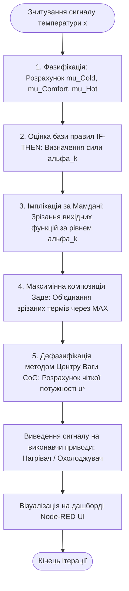
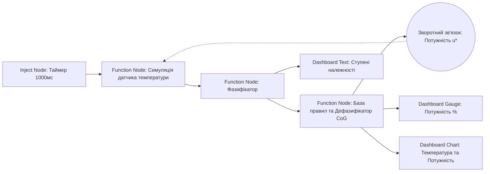

# **Лабораторна робота № 5<br>Побудова нечіткого контролера для автоматизації**

## Мета роботи та стек технологій

**Мета:** Засвоєння практичних навичок розробки та проєктування інтелектуальних систем автоматичного керування в кіберфізичних системах (КФС) на основі теорії нечіткої логіки. Навчання включає розробку потоку оркестрування в середовищі Node-RED, реалізацію повного циклу нечіткого логічного виведення Мамдані (фазифікація вхідної температури, обчислення бази нечітких правил «IF-THEN», максимінна композиція Заде та дефазифікація методом центру ваги) для генерування безперервного сигналу керування виконавчими механізмами нагрівання та охолодження.

**Стек технологій та інструменти:**
*   **Платформа оркестрування:** Node-RED (потокове програмування у середовищі виконання Node.js).
*   **Мова скриптів обробки:** JavaScript (стандарт ECMAScript 2022+ у функціональних вузлах Node-RED).
*   **Модуль візуалізації:** `node-red-dashboard` (інтерактивні графіки та стрілочні індикатори).
*   **Математичний апарат:** теорія нечітких множин Заде, алгоритм нечіткого виведення Мамдані (Mamdani Fuzzy Inference), метод центру ваги (Center of Gravity / Center of Area).

---

## 1 Теоретичні відомості

### Концепція нечіткої логіки в кіберфізичних системах

Традиційні релейні або ПІД-регулятори в кіберфізичних системах оперують чіткими математичними моделями. Однак при управлінні складними, нелінійними фізичними об'єктами (наприклад, сушильними камерами, біореакторами чи кліматичними зонами) математичний опис процесу часто є неточним або невизначеним. Класична двозначна логіка, що базується на абсолютних значеннях $0$ («хиба») та $1$ («істина»), не здатна адекватно описати якісні поняття природної мови.

У 1965 році американський математик Лотфі Заде запропонував концепцію **нечітких множин (fuzzy sets)**, яка є узагальненням класичної теорії множин. У нечітких множинах перехід елемента від неприналежності до множини здійснюється не стрибкоподібно, а плавно. Для цього вводиться **функція приналежності** $\mu_A(x) \in [0, 1]$, значення якої показує ступінь відповідності елемента $x$ концепції нечіткої множини $A$. Значення $\mu_A(x) = 1$ відповідає повній відповідності, $\mu_A(x) = 0$ — повній невідповідності, а проміжні значення відображають часткову належність.

Застосування нечіткої логіки на рівні **Brainware** дозволяє програмісту та інженеру формалізувати якісний досвід людини-експерта у вигляді алгоритму, який функціонує в умовах завад та невизначеності вхідних даних від датчиків.

### Лінгвістичні змінні та терми

Для опису фізичних параметрів КФС використовується поняття **лінгвістичної змінної**. Лінгвістична змінна визначається назвою (наприклад, «Температура»), універсумом $X$ (фізичним діапазоном вимірювання, наприклад, $[0, 100]^\circ\text{C}$) та терм-множиною $T$.

Терм-множина являє собою сукупність лінгвістичних термів (якісних значень), кожен з яких математично описується власною функцією приналежності. Для температурного контролера класична терм-множина включає три терми:
*   «Холодно» ($Cold$);
*   «Комфортно» ($Comfortable$);
*   «Жарко» ($Hot$).

Акустичні, геометричні чи температурні межі термів задаються за допомогою трикутних та трапецієподібних функцій приналежності.

### Алгоритм нечіткого логічного виведення за методом Мамдані

Процес нечіткого управління реалізується у п'ять послідовних етапів:

1.  **Фазифікація (Fuzzification):** Перетворення чіткого числового сигналу температури $x \in X$, отриманого від фізичного датчика, у ступені приналежності $\mu_{Cold}(x)$, $\mu_{Comfortable}(x)$, $\mu_{Hot}(x)$ до кожного лінгвістичного терму.
2.  **Оцінка бази правил (Rule Evaluation):** База нечітких правил складається з логічних конструкцій «IF-THEN» (ЯКЩО - ТО). Для кожного правила розраховується весовий коефіцієнт (сила спрацьовування правила $\alpha_k$) за допомогою операції мінімуму для логічного «І» (кон'юнкція).
3.  **Агрегування та імплікація (Implication):** Застосування мінімуму за Мамдані для відсікання (обрізання) вихідних функцій приналежності виконавчого механізму за рівнем $\alpha_k$.
4.  **Акумуляція / Композиція Заде (Composition):** Об'єднання всіх зрізаних нечітких множин виходу в єдину результуючу нечітку область за допомогою операції максимуму для логічного «АБО» (диз'юнкція).
5.  **Дефазифікація (Defuzzification):** Перетворення результуючої нечіткої множини виходу у чітке числове значення потужності керуючого сигналу $u^* \in [0, 100\%]$ за допомогою методу центру ваги (Center of Gravity).

### Математичний апарат нечіткого регулятора

Трикутна функція приналежності $\mu(x; a, b, c)$ описується кусочно-лінійною залежністю:

$$
\mu(x; a, b, c) = \max\left(0, \min\left(\frac{x - a}{b - a}, \frac{c - x}{c - b}\right)\right)
$$

де:
*   $x$ — поточне значення вхідного фізичного параметра (температура, $^\circ\text{C}$);
*   $a, c$ — відповідно ліва та права основи трикутника (межі, де $\mu(x) = 0$);
*   $b$ — вершина трикутника (точка максимальної приналежності, де $\mu(b) = 1$).

Трапецієподібна функція приналежності $\mu(x; a, b, c, d)$ описується виразом:

$$
\mu(x; a, b, c, d) = \max\left(0, \min\left(\frac{x - a}{b - a}, 1, \frac{d - x}{d - c}\right)\right)
$$

де $a, d$ — нижня основа трапеції, а $b, c$ — верхня основа трапеції, на якій функція приналежності дорівнює $1$.

База правил нечіткого температурного регулятора задається наступним чином:
*   **Правило 1:** $\text{IF } x \text{ is } Cold \text{ THEN } u \text{ is } Heat\_High$
*   **Правило 2:** $\text{IF } x \text{ is } Comfortable \text{ THEN } u \text{ is } Off$
*   **Правило 3:** $\text{IF } x \text{ is } Hot \text{ THEN } u \text{ is } Cool\_High$

Сила спрацьовування $k$-го правила $\alpha_k$ обчислюється як відповідний ступінь приналежності входу. Результуюча функція приналежності виходу $\mu_{out}(u)$ після максимінної композиції Заде має вигляд:

$$
\mu_{out}(u) = \max_{k} \left( \min\left(\alpha_k, \mu_{out\_k}(u)\right) \right)
$$

Дефазифікація методом центру ваги (Center of Gravity, CoG) перетворює огинаючу функцію $\mu_{out}(u)$ у чітке значення вихідної потужності $u^*$ (%) шляхом дискретного інтегрування по всьому діапазону виходу $u \in [0, 100\%]$:

$$
u^* = \frac{\sum_{i=0}^{M} u_i \cdot \mu_{out}(u_i)}{\sum_{i=0}^{M} \mu_{out}(u_i)}
$$

де:
*   $u^*$ — результуюча чітка потужність керуючого сигналу, вимірюється у відсотках ($\%$);
*   $u_i$ — $i$-та точка дискретизації вихідної шкали (наприклад, $u_i = 0, 1, 2, \dots, 100\%$);
*   $\mu_{out}(u_i)$ — значення об'єднаної функції приналежності виходу в точці $u_i$.


*Рисунок 1 — Структурна схема алгоритму нечіткого логічного виведення регулятора температури*

Наведений рисунок показує повний цикл роботи нечіткого контролера. Вхідний аналоговий сигнал температури послідовно проходить фазифікацію, оцінюється базною правил, агрегується максимінною композицією та перетворюється на чіткий відсоток потужності приводу за допомогою дефазифікації.

---

## 2 Підготовка середовища та розгортання проєкту (Крок 0)

Для виконання лабораторної роботи використовується Node-RED, що працює у середовищі виконання Node.js.

### Крок 0.1. Перевірка Node.js та запуск Node-RED

Перевірте наявність Node.js та менеджера пакетів npm у системному терміналі:

```bash
node -v
npm -v
```

Якщо Node-RED ще не за запущений, відкрийте термінал та виконайте команду:

```bash
node-red
```

У логах термінала буде вказано веб-адресу редактора (за замовчуванням `http://127.0.0.1:1880/`).

### Крок 0.2. Встановлення модуля візуалізації `node-red-dashboard`

Якщо модуль `node-red-dashboard` не було встановлено раніше, відкрийте веб-браузер, перейдіть за адресою `http://127.0.0.1:1880/`, відкрийте меню (верхній правий кут) $\to$ **Manage palette** $\to$ вкладка **Install**, знайдіть `node-red-dashboard` та натисніть **Install**.

Також встановлення можна виконати через термінал у каталозі користувача Node-RED:

```bash
cd ~/.node-red
npm install node-red-dashboard
```

Після встановлення модуля перезапустіть Node-RED у терміналі.

### Крок 0.3. Створення каталогу проєкту

Створіть робочу папку проєкту для збереження конфігураційних файлів та експортованого потоку:

```bash
mkdir cps-lab5-fuzzy
cd cps-lab5-fuzzy
touch README.md
```

Структура робочої директорії матиме вигляд:

```
cps-lab5-fuzzy/
├── flows.json          (Експортований конфігураційний потік Node-RED)
└── README.md           (Опис проєкту та інструкція запуску)
```

---

## 3 Порядок виконання роботи

### Індивідуальні завдання

Параметри нечіткого регулятора обираються з наведеної нижче таблиці відповідно до номера вашого варіанта (номеру у списку групи).

| Варіант | Об'єкт КФС | Цільова темп. $T_{set}, ^\circ\text{C}$ | Терм «Холодно» (Трапеція) | Терм «Комфорт» (Трикутник) | Терм «Жарко» (Трапеція) | Період (мс) |
| :---: | :--- | :---: | :---: | :---: | :---: | :---: |
| **1** | Теплиця для розсади | $+22.0$ | $[-10, 0, 12, 18]$ | $[15, 22, 28]$ | $[24, 30, 45, 60]$ | $1000$ |
| **2** | Серверна шафа | $+18.0$ | $[-10, 0, 10, 15]$ | $[12, 18, 24]$ | $[20, 26, 40, 50]$ | $1000$ |
| **3** | Біореактор ферментації | $+37.0$ | $[0, 10, 30, 35]$ | $[33, 37, 41]$ | $[39, 44, 55, 60]$ | $500$ |
| **4** | Сушильна шафа елеватора | $+65.0$ | $[0, 20, 50, 60]$ | $[58, 65, 72]$ | $[68, 76, 95, 110]$ | $1500$ |
| **5** | Пастеризатор молока | $+74.0$ | $[10, 20, 60, 70]$ | $[68, 74, 80]$ | $[77, 83, 98, 110]$ | $1000$ |
| **6** | Інкубатор яєчний | $+37.8$ | $[0, 10, 32, 36.5]$| $[36.0, 37.8, 39.5]$| $[38.8, 41, 50, 60]$ | $1000$ |
| **7** | Термостат акваріума | $+25.0$ | $[0, 10, 20, 23]$ | $[22, 25, 28]$ | $[26, 29, 38, 45]$ | $2000$ |
| **8** | Охолоджувач олії верстата| $+40.0$ | $[-10, 0, 25, 35]$ | $[32, 40, 48]$ | $[44, 52, 70, 85]$ | $1000$ |
| **9** | Камера полімеризації | $+120.0$ | $[0, 30, 90, 110]$ | $[105, 120, 135]$ | $[128, 142, 170, 190]$| $1500$ |
| **10** | Вузол пайки плати | $+210.0$ | $[0, 50, 160, 195]$ | $[190, 210, 230]$ | $[220, 242, 280, 300]$| $500$ |
| **11** | Автоклав медичний | $+134.0$ | $[0, 40, 110, 128]$ | $[125, 134, 143]$ | $[138, 148, 170, 185]$| $1000$ |
| **12** | Сонячний водонагрівач | $+55.0$ | $[-10, 0, 35, 48]$ | $[45, 55, 65]$ | $[60, 72, 90, 105]$ | $2000$ |
| **13** | Гальванічна ванна | $+60.0$ | $[0, 15, 42, 54]$ | $[50, 60, 70]$ | $[65, 75, 92, 105]$ | $1000$ |
| **14** | Вистоєчна шафа пекарні | $+38.0$ | $[0, 10, 28, 34]$ | $[33, 38, 43]$ | $[40, 46, 58, 70]$ | $1500$ |
| **15** | Кріокамера фармацевтична| $-20.0$ | $[-60,-50,-30,-24]$| $[-26, -20, -14]$ | $[-16, -10, 0, 15]$ | $1000$ |
| **16** | Вулканізатор гуми | $+150.0$ | $[0, 40, 115, 140]$ | $[135, 150, 165]$ | $[158, 172, 200, 220]$| $1000$ |
| **17** | Винний льох | $+14.0$ | $[-5, 0, 8, 12]$ | $[11, 14, 17]$ | $[15, 19, 28, 35]$ | $3000$ |
| **18** | Сушарка гранул пластику | $+80.0$ | $[0, 20, 60, 74]$ | $[70, 80, 90]$ | $[85, 96, 115, 130]$ | $1000$ |
| **19** | Вузол дегазації нафти | $+45.0$ | $[-10, 0, 30, 40]$ | $[38, 45, 52]$ | $[48, 56, 75, 90]$ | $1500$ |
| **20** | Кліматична камера випробувань|$+28.0$ | $[-20,-10, 15, 24]$ | $[22, 28, 34]$ | $[31, 38, 50, 60]$ | $1000$ |

---

### Покрокова розробка потоку нечіткого контролера в Node-RED

#### Крок 1. Конфігурація вузлів потоку

У веб-інтерфейсі Node-RED перетягніть на робочу область наступні вузли:

1.  **Inject Node (Таймер):** Генерує періодичні тригери опитування датчика.
2.  **Function Node "Sensor Generator":** Симулює неперервну зміну температури об'єкта під впливом теплових втрат та нагрівача/охолоджувача.
3.  **Function Node "Fuzzifier":** Обчислює ступені приналежності $\mu_{Cold}$, $\mu_{Comfort}$, $\mu_{Hot}$ за математичними формулами.
4.  **Function Node "Inference Engine & Defuzzifier":** Оцінює базу правил, виконує максимінну композицію Заде та обчислює чітку потужність керування $u^*$ методом центру ваги.
5.  **Dashboard UI Nodes (`ui_gauge`, `ui_chart`, `ui_text`):** Візуалізують вхідну температуру, ступені приналежності та вихідну потужність.
6.  **Debug Node:** Виводить лог стану нечіткого виведення в панель відлагодження.


*Рисунок 2 — Схема передачі повідомлень та трансформації нечітких даних між вузлами Node-RED*

На рисунку показано замикання контуру керування в КФС. Отримана після дефазифікації чітка потужність через зворотний зв'язок передається у симулятор датчика, що дозволяє спостерігати автоматичну стабілізацію температури біля цільового значення $T_{set}$.

---

#### Крок 2. Програмний код симулятора датчика температури

Двічі клацніть на вузол **Function Node "Sensor Generator"** та вставте наступний код JavaScript:

```javascript
/**
 * Вузол симуляції фізичного об'єкта (Термокамера).
 * Враховує інерційність, охолодження в довкілля та дію нагрівача/охолоджувача.
 */

// Отримання поточної потужності приводу зі збереженого контексту (зворотний зв'язок)
let controlPower = context.get('controlPower') || 0.0; // [-100% до +100%]
let currentTemp = context.get('currentTemp') || 12.0;   // Початкова температура, deg C

const ambientTemp = 15.0; // Температура навколишнього середовища
const dt = 1.0;           // Крок часу, секунда

// Фізична модель: зміна температури під дією приводу та тепловтрат
const heatingRate = 0.15;  // Ефективність нагрівача, deg C / (% * c)
const coolingRate = 0.05;  // Ефективність тепловтрат у довкілля
const driveEffect = controlPower * heatingRate * dt;
const thermalLoss = (currentTemp - ambientTemp) * coolingRate * dt;

currentTemp = currentTemp + driveEffect - thermalLoss;
currentTemp = parseFloat(currentTemp.toFixed(2));

// Збереження оновленого стану об'єкта
context.set('currentTemp', currentTemp);

msg.payload = {
    temperature: currentTemp,
    timestamp: new Date().toISOString()
};

return msg;
```

---

#### Крок 3. Програмний код фазифікатора вхідного сигналу

Двічі клацніть на вузол **Function Node "Fuzzifier"** та вставте код обчислення функцій приналежності (реалізація **Варіанта №1**):

```javascript
/**
 * Вузол Фазифікації (Fuzzifier).
 * Обчислює ступені приналежності вхідного сигналу до термів "Cold", "Comfortable", "Hot".
 */

const x = Number(msg.payload.temperature);

// Математична функція трикутної функції приналежності
function calcTriangular(x, a, b, c) {
    if (x <= a || x >= c) return 0.0;
    if (x === b) return 1.0;
    if (x > a && x < b) return (x - a) / (b - a);
    if (x > b && x < c) return (c - x) / (c - b);
    return 0.0;
}

// Математична функція трапецієподібної функції приналежності
function calcTrapezoidal(x, a, b, c, d) {
    if (x <= a || x >= d) return 0.0;
    if (x >= b && x <= c) return 1.0;
    if (x > a && x < b) return (x - a) / (b - a);
    if (x > c && x < d) return (d - x) / (d - c);
    return 0.0;
}

// Параметри термів для Варіанта №1 (Теплиця, T_set = 22 °C)
// Cold: трапеція [-10, 0, 12, 18]
const mu_Cold = calcTrapezoidal(x, -10.0, 0.0, 12.0, 18.0);

// Comfortable: трикутник [15, 22, 28]
const mu_Comfort = calcTriangular(x, 15.0, 22.0, 28.0);

// Hot: трапеція [24, 30, 45, 60]
const mu_Hot = calcTrapezoidal(x, 24.0, 30.0, 45.0, 60.0);

// Передачі нечіткої множини далі по конвеєру
msg.fuzzy = {
    temperature: x,
    mu_Cold: parseFloat(mu_Cold.toFixed(3)),
    mu_Comfort: parseFloat(mu_Comfort.toFixed(3)),
    mu_Hot: parseFloat(mu_Hot.toFixed(3))
};

return msg;
```

---

#### Крок 4. Програмний код механізму виведення та дефазифікатора

Двічі клацніть на вузол **Function Node "Inference Engine & Defuzzifier"** та вставте код, що виконує оцінку бази правил, композицію Заде та дефазифікацію методом Центру Ваги (CoG):

```javascript
/**
 * Вузол Нечіткого Логічного Виведення Мамдані та Дефазифікації (CoG).
 */

const fuzzyInputs = msg.fuzzy;
const mu_Cold = fuzzyInputs.mu_Cold;
const mu_Comfort = fuzzyInputs.mu_Comfort;
const mu_Hot = fuzzyInputs.mu_Hot;

// 1. Оцінка сили спрацьовування нечітких правил (Rule Firing Strength)
// Rule 1: IF Cold THEN Heat_High (Потужність +100%)
const alpha_Rule1 = mu_Cold;

// Rule 2: IF Comfortable THEN Off (Потужність 0%)
const alpha_Rule2 = mu_Comfort;

// Rule 3: IF Hot THEN Cool_High (Потужність -100%)
const alpha_Rule3 = mu_Hot;

// 2. Визначення термів виходу (Вихідна шкала потужності u від -100% до +100%)
function mu_HeatHigh(u) {
    if (u <= 30) return 0.0;
    if (u >= 80) return 1.0;
    return (u - 30) / (80 - 30);
}

function mu_PowerOff(u) {
    if (u <= -20 || u >= 20) return 0.0;
    if (u === 0) return 1.0;
    if (u > -20 && u < 0) return (u + 20) / 20;
    return (20 - u) / 20;
}

function mu_CoolHigh(u) {
    if (u >= -30) return 0.0;
    if (u <= -80) return 1.0;
    return (-30 - u) / (80 - 30);
}

// 3. Дискретизація вихідного інтервалу [-100, 100] з кроком 1% та Максимінна композиція Заде
let numerator = 0.0;   // Чисельник формули центру ваги: sum(u * mu_out)
let denominator = 0.0; // Знаменник формули центру ваги: sum(mu_out)

for (let u = -100; u <= 100; u += 1) {
    // Імплікація за Мамдані (зрізання функцій виходу за рівнем alpha_k)
    const clip1 = Math.min(alpha_Rule1, mu_HeatHigh(u));
    const clip2 = Math.min(alpha_Rule2, mu_PowerOff(u));
    const clip3 = Math.min(alpha_Rule3, mu_CoolHigh(u));

    // Максимінна композиція Заде (MAX об'єднання)
    const mu_aggregated = Math.max(clip1, clip2, clip3);

    numerator += u * mu_aggregated;
    denominator += mu_aggregated;
}

// 4. Розрахунок чіткого значення потужності u* (Центр Ваги)
let controlOutput = 0.0;
if (denominator > 0.0001) {
    controlOutput = numerator / denominator;
}
controlOutput = parseFloat(controlOutput.toFixed(2));

// 5. Оновлення контексту симулятора датчика (зворотний зв'язок)
const sensorNode = global.get('node_sensor_generator');
// Збереження значення у глобальний контекст для зчитування симулятором
global.set('controlPower', controlOutput);

// 6. Формування вихідних даних для дашборду
msg.payload = controlOutput;
msg.telemetry = {
    temperature: fuzzyInputs.temperature,
    power: controlOutput,
    mu_Cold: mu_Cold,
    mu_Comfort: mu_Comfort,
    mu_Hot: mu_Hot
};

return msg;
```

---

#### Крок 5. Повний код експорту конфігураційного потоку Node-RED

Для швидкого розгортання проєкту у Node-RED натисніть меню (верхній правий кут) $\to$ **Import**, вставте наведений нижче JSON-код та натисніть **Import**:

```json
[
    {
        "id": "tab_cps_lab5",
        "type": "tab",
        "label": "ЛБ5: Нечіткий контролер КФС",
        "disabled": false,
        "info": "Потік автоматизації нечіткого керування температурою"
    },
    {
        "id": "ui_group_fuzzy",
        "type": "ui_group",
        "name": "Моніторинг нечіткого регулятора",
        "tab": "ui_tab_fuzzy_dash",
        "order": 1,
        "disp": true,
        "width": "6",
        "collapse": false
    },
    {
        "id": "ui_tab_fuzzy_dash",
        "type": "ui_tab",
        "name": "Нечіткий контролер",
        "icon": "dashboard",
        "order": 1
    },
    {
        "id": "node_inject_fuzzy",
        "type": "inject",
        "z": "tab_cps_lab5",
        "name": "Тактувальний таймер",
        "props": [
            {
                "p": "payload"
            }
        ],
        "repeat": "1",
        "crontab": "",
        "once": true,
        "onceDelay": 0.1,
        "topic": "",
        "x": 140,
        "y": 140,
        "wires": [
            [
                "node_sensor_gen"
            ]
        ]
    },
    {
        "id": "node_sensor_gen",
        "type": "function",
        "z": "tab_cps_lab5",
        "name": "Симулятор об'єкта (Термокамера)",
        "func": "let controlPower = global.get('controlPower') || 0.0;\nlet currentTemp = context.get('currentTemp') || 10.0;\n\nconst ambientTemp = 15.0;\nconst dt = 1.0;\nconst heatingRate = 0.15;\nconst coolingRate = 0.05;\n\nconst driveEffect = controlPower * heatingRate * dt;\nconst thermalLoss = (currentTemp - ambientTemp) * coolingRate * dt;\n\ncurrentTemp = currentTemp + driveEffect - thermalLoss;\ncurrentTemp = parseFloat(currentTemp.toFixed(2));\n\ncontext.set('currentTemp', currentTemp);\n\nmsg.payload = {\n    temperature: currentTemp,\n    timestamp: new Date().toISOString()\n};\n\nreturn msg;",
        "outputs": 1,
        "noerr": 0,
        "initialize": "",
        "finalize": "",
        "libs": [],
        "x": 410,
        "y": 140,
        "wires": [
            [
                "node_fuzzifier"
            ]
        ]
    },
    {
        "id": "node_fuzzifier",
        "type": "function",
        "z": "tab_cps_lab5",
        "name": "Фазифікатор",
        "func": "const x = Number(msg.payload.temperature);\n\nfunction calcTriangular(x, a, b, c) {\n    if (x <= a || x >= c) return 0.0;\n    if (x === b) return 1.0;\n    if (x > a && x < b) return (x - a) / (b - a);\n    if (x > b && x < c) return (c - x) / (c - b);\n    return 0.0;\n}\n\nfunction calcTrapezoidal(x, a, b, c, d) {\n    if (x <= a || x >= d) return 0.0;\n    if (x >= b && x <= c) return 1.0;\n    if (x > a && x < b) return (x - a) / (b - a);\n    if (x > c && x < d) return (d - x) / (d - c);\n    return 0.0;\n}\n\nconst mu_Cold = calcTrapezoidal(x, -10.0, 0.0, 12.0, 18.0);\nconst mu_Comfort = calcTriangular(x, 15.0, 22.0, 28.0);\nconst mu_Hot = calcTrapezoidal(x, 24.0, 30.0, 45.0, 60.0);\n\nmsg.fuzzy = {\n    temperature: x,\n    mu_Cold: parseFloat(mu_Cold.toFixed(3)),\n    mu_Comfort: parseFloat(mu_Comfort.toFixed(3)),\n    mu_Hot: parseFloat(mu_Hot.toFixed(3))\n};\n\nreturn msg;",
        "outputs": 1,
        "noerr": 0,
        "initialize": "",
        "finalize": "",
        "libs": [],
        "x": 650,
        "y": 140,
        "wires": [
            [
                "node_inference_cog"
            ]
        ]
    },
    {
        "id": "node_inference_cog",
        "type": "function",
        "z": "tab_cps_lab5",
        "name": "Виведення Мамдані & CoG",
        "func": "const fuzzyInputs = msg.fuzzy;\nconst mu_Cold = fuzzyInputs.mu_Cold;\nconst mu_Comfort = fuzzyInputs.mu_Comfort;\nconst mu_Hot = fuzzyInputs.mu_Hot;\n\nconst alpha_Rule1 = mu_Cold;\nconst alpha_Rule2 = mu_Comfort;\nconst alpha_Rule3 = mu_Hot;\n\nfunction mu_HeatHigh(u) {\n    if (u <= 30) return 0.0;\n    if (u >= 80) return 1.0;\n    return (u - 30) / (80 - 30);\n}\n\nfunction mu_PowerOff(u) {\n    if (u <= -20 || u >= 20) return 0.0;\n    if (u === 0) return 1.0;\n    if (u > -20 && u < 0) return (u + 20) / 20;\n    return (20 - u) / 20;\n}\n\nfunction mu_CoolHigh(u) {\n    if (u >= -30) return 0.0;\n    if (u <= -80) return 1.0;\n    return (-30 - u) / (80 - 30);\n}\n\nlet numerator = 0.0;\nlet denominator = 0.0;\n\nfor (let u = -100; u <= 100; u += 1) {\n    const clip1 = Math.min(alpha_Rule1, mu_HeatHigh(u));\n    const clip2 = Math.min(alpha_Rule2, mu_PowerOff(u));\n    const clip3 = Math.min(alpha_Rule3, mu_CoolHigh(u));\n\n    const mu_aggregated = Math.max(clip1, clip2, clip3);\n\n    numerator += u * mu_aggregated;\n    denominator += mu_aggregated;\n}\n\nlet controlOutput = 0.0;\nif (denominator > 0.0001) {\n    controlOutput = numerator / denominator;\n}\ncontrolOutput = parseFloat(controlOutput.toFixed(2));\n\nglobal.set('controlPower', controlOutput);\n\nmsg.payload = controlOutput;\nmsg.telemetry = {\n    temperature: fuzzyInputs.temperature,\n    power: controlOutput,\n    mu_Cold: mu_Cold,\n    mu_Comfort: mu_Comfort,\n    mu_Hot: mu_Hot\n};\n\nreturn msg;",
        "outputs": 1,
        "noerr": 0,
        "initialize": "",
        "finalize": "",
        "libs": [],
        "x": 260,
        "y": 260,
        "wires": [
            [
                "node_ui_gauge_power",
                "node_ui_chart_temp",
                "node_debug_fuzzy"
            ]
        ]
    },
    {
        "id": "node_debug_fuzzy",
        "type": "debug",
        "z": "tab_cps_lab5",
        "name": "Лог нечіткого виведення",
        "active": true,
        "toside": true,
        "console": false,
        "tostatus": false,
        "complete": "telemetry",
        "targetType": "msg",
        "statusVal": "",
        "statusType": "auto",
        "x": 550,
        "y": 340,
        "wires": []
    },
    {
        "id": "node_ui_gauge_power",
        "type": "ui_gauge",
        "z": "tab_cps_lab5",
        "name": "Індикатор потужності %",
        "group": "ui_group_fuzzy",
        "order": 1,
        "width": 0,
        "height": 0,
        "gtype": "gage",
        "title": "Потужність керування (%)",
        "label": "%",
        "format": "{{value}}",
        "min": "-100",
        "max": "100",
        "colors": [
            "#0055ff",
            "#00e600",
            "#ff0000"
        ],
        "seg1": "-20",
        "seg2": "20",
        "className": "",
        "x": 570,
        "y": 220,
        "wires": []
    },
    {
        "id": "node_ui_chart_temp",
        "type": "ui_chart",
        "z": "tab_cps_lab5",
        "name": "Графік стабілізації",
        "group": "ui_group_fuzzy",
        "order": 2,
        "width": 0,
        "height": 0,
        "label": "Динаміка температури (°C)",
        "chartType": "line",
        "legend": "false",
        "xformat": "HH:mm:ss",
        "interpolate": "linear",
        "nodata": "Чекаємо телеметрію...",
        "dot": false,
        "ymin": "0",
        "ymax": "40",
        "removeOlder": 1,
        "removeOlderPoints": "",
        "removeOlderUnit": "3600",
        "cutout": 0,
        "useOneColor": false,
        "useUTC": false,
        "colors": [
            "#1f77b4",
            "#aec7e8",
            "#ff7f0e",
            "#2ca02c",
            "#98df8a",
            "#d62728",
            "#ff9896",
            "#9467bd",
            "#c5b0d5"
        ],
        "outputs": 1,
        "useDifferentColor": false,
        "className": "",
        "x": 550,
        "y": 280,
        "wires": [
            []
        ]
    }
]
```

---

### Тестування та перевірка дашборду

1.  Після розгортання потоку натисніть кнопку **Deploy** у Node-RED.
2.  Перейдіть за адресою інтерактивної панелі:

```
http://127.0.0.1:1880/ui
```

3.  Спостерігайте за процесом стабілізації температури: якщо початкова температура є низькою (наприклад, $+10^\circ\text{C}$), фазифікатор обчислить високий ступінь $\mu_{Cold}$, що приведе до спрацьовування Правила №1 та подачі $+100\%$ потужності на нагрівач.
4.  У міру наближення температури до цільової точки $+22^\circ\text{C}$ ступінь $\mu_{Cold}$ зменшиться, зросте $\mu_{Comfortable}$, а вихідна потужність плавним чином плавно знизиться до $0\%$, забезпечуючи точну стабілізацію без перерегулювання.

---

## 4 Вимоги до змісту звіту

Звіт з лабораторної роботи оформлюється у форматі PDF або MS Word та має містити наступні обов'язкові розділи:

1.  **Титульна сторінка.**
    *   Назва вищого навчального закладу, кафедри, дисципліни.
    *   Номер та назва лабораторної роботи, номер обраного варіанта.
    *   ПІБ, шифр навчальної групи.
2.  **Мета роботи, короткі теоретичні відомості та опис отриманого завдання.**
    *   Виклад основного теоретичного базису.
    *   Опис завдання згідно з таблицею варіантів.
3.  **Схема потоку Node-RED.** Скріншот робочого поля редактора Node-RED із розгорнутим потоком нечіткого контролера.
4.  **Програмний код.** Повний код JavaScript з функціональних вузлів фазифікації, оцінки бази правил та дефазифікації.
5.  **Графічна частина та логи.** Скріншоти дашборду `http://127.0.0.1:1880/ui` з графіком виходу температури на уставку та логами з панелі Debug.
6.  **Розрахунково-аналітична частина.**
    *   Математичний розрахунок степенів приналежності $\mu_{Cold}$, $\mu_{Comfortable}$, $\mu_{Hot}$ для одного конкретного значення температури вашого варіанта.
    *   Аналітичний розрахунок чіткої потужності $u^*$ за допомогою дискретної формули Центру Ваги (CoG).
7.  **Висновки.** Порівняльний аналіз плавності регулювання нечіткого контролера відносно двохпозиційного релейного регулятора.

---

## 5 Контрольні запитання

1.  У чому полягає фундаментальна відмінність між характеристичною функцією класичної множини та функцією приналежності нечіткої множини?
2.  Опишіть п'ять послідовних етапів нечіткого логічного виведення за методом Мамдані (Mamdani Fuzzy Inference).
3.  Поясніть математичний зміст максимінної композиції Заде. Які оператори відповідають за кон'юнкцію «І» та диз'юнкцію «АБО» при оцінці бази правил?
4.  У чому полягає сутність дефазифікації методом Центру Ваги (Center of Gravity, CoG)? Наведіть формулу та поясніть її фізичний зміст.
5.  Які переваги надає використання нечітких контролерів у кіберфізичних системах порівняно з класичними ПІД-регуляторами при роботі з зашумленими або нелінійними об'єктами?
