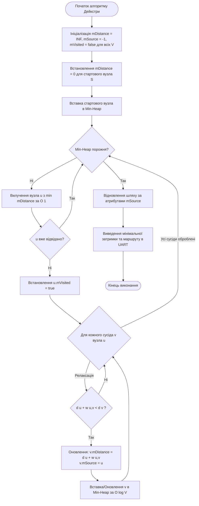
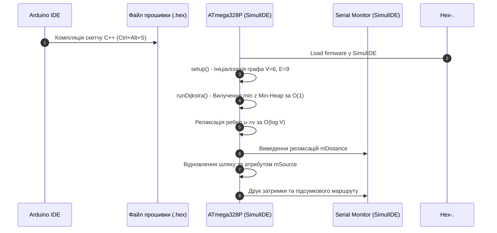

# МЕТОДИЧНА ІНСТРУКЦІЯ ДО ВИКОНАННЯ ЛАБОРАТОРНОЇ РОБОТИ № 6

## **Дисципліна:** Прикладні алгоритми кіберфізичних систем
## **Тема:** Алгоритми на графах у мережах КФС (Пошук найкоротшого шляху)
## **Лабораторна робота № 6:** Оптимізація маршрутів у сенсорних мережах

---

## **1. Мета роботи та стек технологій**

**Мета роботи:** Засвоєння практичних навичок проєктування, реалізації та апаратної симуляції алгоритмів маршрутизації потоків даних у бездротових сенсорних мережах (WSN) кіберфізичних систем. Навчання включає створення об'єктно-орієнтованої програми мовою C++ для мікроконтролера ATmega328P у середовищі Arduino IDE, реалізацію алгоритму Дейкстри з використанням атрибутів вершин (`mDistance`, `mSource`), застосування пріоритетної черги на основі двійкової мінімальної купи (Min-Heap) для забезпечення часової складності $\mathcal{O}(E \log V)$, а також перевірку обчислених маршрутів у схемотехнічному симуляторі SimulIDE.

**Стек технологій та інструменти:**
*   **Мова програмування:** C/C++ (стандарт C++17 для вбудованих систем).
*   **Середовище розробки:** Arduino IDE (версії 1.8.x або 2.x).
*   **Схемотехнічний симулятор:** SimulIDE (версія 0.4.15 або новіша).
*   **Апаратна платформа симуляції:** Мікроконтролер ATmega328P (платформа Arduino Uno), послідовний порт UART (Serial Monitor).

---

## **2. Теоретичні відомості**

### **2.1. Топологія сенсорних мереж КФС як зважений граф**

У кіберфізичних системах бездротові сенсорні мережі складаються з великогабаритної сукупності автономних вузлів, які збирають телеметрію та ретранслюють її через суміжні вузли до шлюзу або центрального сервера. Для формалізації цієї структури на рівні алгоритмічного забезпечення (**Brainware**) використовується математичний апарат теорії графів.

Сенсорна мережа моделюється у вигляді зваженого неорієнтованого (або орієнтованого) графа $G = (V, E, w)$, де:
*   Множина вершин $V = \{v_1, v_2, \dots, v_n\}$ відображає сукупність сенсорних вузлів та ретрансляторів.
*   Множина ребер $E = \{e_1, e_2, \dots, e_m\}$ відображає наявність прямих каналів радіозв'язку між вузлами.
*   Вагова функція ребер $w: E \to \mathbb{R}^+$ описує метрику каналу, яка може виражати затримку передачі пакета в мілісекундах, енергетичні витрати акумулятора або коефіцієнт втрати пакетів.

Завдання оптимізації маршруту полягає у знаходженні ланцюжка зв'язаних ребер від стартового вузла $S \in V$ до цільового шлюзу $T \in V$, сумарна вага яких є мінімальною.

### **2.2. Математична логіка алгоритму Дейкстри та атрибути вершин**

Алгоритм Дейкстри належить до класу «жадібних» алгоритмів і розв'язує задачу знаходження найкоротших шляхів від однієї фіксованої вершини до всіх інших у графах із невід'ємними вагами ребер.

Для об'єктно-орієнтованої реалізації алгоритму на рівні окремої вершини $v_i \in V$ вводяться наступні обов'язкові атрибути:
*   `mDistance` — поточна оцінка найкоротшої відстані від стартового вузла до даної вершини (на початку ініціалізується умовним значенням нескінченності $\infty$);
*   `mSource` — ідентифікатор попереднього (батьківського) вузла в оптимальному маршруті, необхідний для зворотного відновлення повного шляху (ініціалізується значенням $-1$);
*   `mVisited` — булевий прапорець, який приймає значення `true` після остаточної обробки вершини.

Основною обчислювальною операцією алгоритму є **процедура релаксації ребра**. Якщо каретка алгоритму перебуває у вершині $u$, і існує ребро $(u, v)$ з вагою $w(u, v)$, перевіряється умова поліпшення шляху до вершини $v$:

$$\text{Якщо } d(u) + w(u, v) < d(v) \implies \begin{cases} d(v) = d(u) + w(u, v) \\ \text{Source}(v) = u \end{cases}$$

де $d(u)$ відображає поточне значення атрибута `mDistance` для вершини $u$.

### **2.3. Застосування пріоритетної черги на основі двійкової мінімальної купи (Min-Heap)**

При класичній реалізації алгоритму Дейкстри з пошуком вершини з мінімальною відстанню через лінійний перебір масиву часова складність становить $\mathcal{O}(V^2)$. Для навантажених сенсорних мереж КФС із сотнями вузлів це створює неприпустимі затримки обчислень.

Для прискорення вибору вершини з мінімальним значенням `mDistance` використовується **двійкова мінімальна купа (Min-Heap)**, яка виконує роль пріоритетної черги. Двійкова купа являє собою деревну структуру даних, де для кожного вузла значення батьківського елемента не перевищує значень його дочірніх елементів.

У контигуальному масиві елементів купи для вузла з індексом $i$ індекси батька та нащадків обчислюються за співвідношеннями:

$$\text{Parent}(i) = \left\lfloor \frac{i - 1}{2} \right\rfloor, \quad \text{Left}(i) = 2i + 1, \quad \text{Right}(i) = 2i + 2$$

Використання Min-Heap дає змогу вилучати вершину з найменшою відстанню за константний час $\mathcal{O}(1)$, а відновлення властивостей купи після процедури релаксації (операція `decreaseKey` або `siftUp`) виконується за логарифмічний час $\mathcal{O}(\log V)$. Завдяки цьому загальна часова складність алгоритму Дейкстри скорочується до:

$$
T(V, E) = \mathcal{O}(E \cdot \log V)
$$

де $E$ — кількість ребер графа, а $V$ — кількість вершин.

### **2.4. Математичний апарат аналізу ресурсів та трудомісткості**

Загальне використання ресурсів мікроконтролера ATmega328P описується **функцією трудомісткості** $\Psi$:

$$
\Psi = c_1 \cdot F_a(E \log V) + c_2 \cdot M_{code} + c_3 \cdot S_d + c_4 \cdot S_r
$$

де:
*   $F_a(E \log V)$ — часова складність алгоритму у тактах процесора;
*   $M_{code}$ — обсяг машинної прошивки у Flash-пам'яті (до $32\text{ КБ}$);
*   $S_d$ — обсяг оперативної пам'яті (SRAM), виділений під статичне зберігання графа та масиву купи;
*   $S_r$ — обсяг стека, зайнятий під час виклику функцій релаксації;
*   $c_1, c_2, c_3, c_4$ — вагові коефіцієнти обмеження ресурсів для мікроконтролера.


*Рисунок 1 — Алгоритмічна схема пошуку найкоротшого шляху Дейкстри з мінімальною купою*

Наведеній схемі відповідає послідовна обробка вузлів графа. На кожному кроці вибирається вершина з найменшою поточною відстанню, для її суміжних вузлів виконується процедура релаксації, а оновлені значення додаються у Min-Heap для збереження впорядкованості за логарифмічний час.

---

## **3. Підготовка середовища та розгортання проєкту (Крок 0)**

Для розробки та виконання лабораторної роботи використовуються середовище розробки **Arduino IDE** та схемотехнічний симулятор **SimulIDE**.

### **Крок 0.1. Встановлення програмного забезпечення**
1.  Завантажте та встановіть **Arduino IDE** з офіційного ресурсу [arduino.cc](https://www.arduino.cc/en/software).
2.  Завантажте симулятор **SimulIDE** з офіційного сайту [simulide.com](https://www.simulide.com/). Запустіть програму через файл `SimulIDE.exe`.

### **Крок 0.2. Створення структури проєктного каталогу**
Створіть на локальному диску папку проєкту з назвою `cps-lab6-dijkstra` та розмістіть у ній файл коду `cps-lab6-dijkstra.ino`:

```bash
mkdir cps-lab6-dijkstra
cd cps-lab6-dijkstra
touch cps-lab6-dijkstra.ino
```

Структура папки проєкту повинна мати такий вигляд:
```
cps-lab6-dijkstra/
├── cps-lab6-dijkstra.ino   (Основний скетч C++)
└── topology.simu            (Схема симуляції SimulIDE)
```

### **Крок 0.3. Налаштування схеми в SimulIDE**
1.  Запустіть `SimulIDE.exe`.
2.  У лівій панелі компонентів перетягніть на робоче поле мікроконтролер **Arduino Uno** (ATmega328P).
3.  Клацніть правою кнопкою миші на платі Arduino Uno та оберіть пункт **Open Serial Monitor** для перегляду виведення консолі маршрутизації.
4.  Збережіть файл симуляції у папку проєкту під назвою `topology.simu`.

---

## **4. Порядок виконання роботи**

### **4.1. Індивідуальні завдання (20 варіантів)**

Топологічні параметри сенсорної мережі обираються з наведеної нижче таблиці відповідно до номера вашого варіанта (номеру у списку групи).

| Варіант | Об'єкт КФС (Топологія мережі) | Кількість вузлів $V$ | Кількість ребер $E$ | Стартовий вузол $S$ | Цільовий вузол $T$ | Метрика ваги ребер $w$ |
| :---: | :--- | :---: | :---: | :---: | :---: | :--- |
| **1** | Розумний міський квартал | $6$ | $9$ | $0$ | $5$ | Затримка каналу ($\text{мс}$) |
| **2** | Промислова цехова мережа | $6$ | $8$ | $0$ | $4$ | Енерговитрати ($\text{мДж}$) |
| **3** | Екологічний моніторинг лісу | $7$ | $10$ | $1$ | $6$ | Втрати пакетів ($\%$) |
| **4** | Автономний склад роботів | $6$ | $9$ | $0$ | $3$ | Відстань між модулями ($\text{м}$) |
| **5** | Нафтоперекачувальна станція | $8$ | $12$ | $0$ | $7$ | Затримка каналу ($\text{мс}$) |
| **6** | Агрокомплекс теплиць | $6$ | $8$ | $2$ | $5$ | Енерговитрати ($\text{мДж}$) |
| **7** | Портовий контейнерний кран | $7$ | $11$ | $0$ | $6$ | Затримка каналу ($\text{мс}$) |
| **8** | Розумна будівля (HVAC) | $6$ | $9$ | $1$ | $4$ | Втрати пакетів ($\%$) |
| **9** | Сонячна електростанція | $8$ | $13$ | $0$ | $6$ | Затримка каналу ($\text{мс}$) |
| **10** | Магістральний газопровід | $6$ | $8$ | $0$ | $5$ | Відстань між вузлами ($\text{м}$) |
| **11** | Водоочисна станція | $7$ | $10$ | $0$ | $5$ | Енерговитрати ($\text{мДж}$) |
| **12** | Фармацевтичний склад | $6$ | $9$ | $2$ | $4$ | Затримка каналу ($\text{мс}$) |
| **13** | Кар'єрний екскаватор | $8$ | $12$ | $1$ | $7$ | Втрати пакетів ($\%$) |
| **14** | Підводна сенсорна сітка | $6$ | $8$ | $0$ | $3$ | Затримка каналу ($\text{мс}$) |
| **15** | Залізничний вузол | $7$ | $11$ | $0$ | $6$ | Відстань між вузлами ($\text{м}$) |
| **16** | Мережа зарядних станцій | $6$ | $9$ | $1$ | $5$ | Енерговитрати ($\text{мДж}$) |
| **17** | Шахтний вентиляційний штрек| $8$ | $13$ | $0$ | $7$ | Затримка каналу ($\text{мс}$) |
| **18** | Гідроелектростанція | $6$ | $8$ | $0$ | $4$ | Втрати пакетів ($\%$) |
| **19** | Розумний паркінг | $7$ | $10$ | $2$ | $6$ | Затримка каналу ($\text{мс}$) |
| **20** | Мережа дронів-доставщиків | $8$ | $12$ | $0$ | $5$ | Відстань польоту ($\text{м}$) |

---

### **4.2. Покроковий алгоритм розробки скетчу C++**

Відкрийте файл `cps-lab6-dijkstra.ino` у середовищі Arduino IDE та вставте повний програмний код, поданий нижче.

> **Примітка:** У коді подано конфігурацію топології для **Варіанта №1** ($V = 6$, $E = 9$, Старт = $0$, Ціль = $5$). При виконанні свого варіанта замініть значення констант `START_NODE`, `TARGET_NODE`, а також списки суміжності у функції `setup()` на власні дані.

```cpp
/**
 * Лабораторна робота №6. Прикладні алгоритми КФС.
 * Оптимізація маршрутів у сенсорних мережах за допомогою алгоритму Дейкстри.
 * Часова складність: O(E * log V) за рахунок використання Min-Heap.
 */

#include <Arduino.h>

// 1. Обмеження розмірності графа для запобігання фрагментації SRAM
const int MAX_VERTICES = 10;
const int MAX_EDGES_PER_NODE = 5;
const float INF_DIST = 1e9; // Умовна нескінченність

// 2. Варіантні константи (Варіант №1: Старт = 0, Ціль = 5)
const int NUM_VERTICES = 6;
const int START_NODE = 0;
const int TARGET_NODE = 5;

// 3. Структура для зберігання ребра графа
struct Edge {
  int to;       // Ідентифікатор цільового вузла
  float weight; // Вага ребра (затримка в мс)
};

// 4. Об'єктно-орієнтований клас вершини графа
class Vertex {
public:
  int id;            // Унікальний ідентифікатор вузла
  float mDistance;   // Атрибут: накопичена найкоротша відстань від старту
  int mSource;       // Атрибут: батьківський вузол в оптимальному маршруті
  bool mVisited;     // Прапорець обробки вершини

  Vertex() {
    id = -1;
    mDistance = INF_DIST;
    mSource = -1;
    mVisited = false;
  }

  void init(int nodeId) {
    id = nodeId;
    mDistance = INF_DIST;
    mSource = -1;
    mVisited = false;
  }
};

// 5. Елемент пріоритетної черги Min-Heap
struct HeapNode {
  int vertexId;
  float distance;
};

// 6. Клас пріоритетної черги на основі двійкової мінімальної купи (Min-Heap)
class MinHeap {
private:
  HeapNode heap[MAX_VERTICES * 2];
  int size;

  void swapNodes(int i, int j) {
    HeapNode temp = heap[i];
    heap[i] = heap[j];
    heap[j] = temp;
  }

  void heapifyUp(int idx) {
    while (idx > 0) {
      int parent = (idx - 1) / 2;
      if (heap[idx].distance < heap[parent].distance) {
        swapNodes(idx, parent);
        idx = parent;
      } else {
        break;
      }
    }
  }

  void heapifyDown(int idx) {
    while (2 * idx + 1 < size) {
      int left = 2 * idx + 1;
      int right = 2 * idx + 2;
      int smallest = idx;

      if (left < size && heap[left].distance < heap[smallest].distance) {
        smallest = left;
      }
      if (right < size && heap[right].distance < heap[smallest].distance) {
        smallest = right;
      }

      if (smallest != idx) {
        swapNodes(idx, smallest);
        idx = smallest;
      } else {
        break;
      }
    }
  }

public:
  MinHeap() { size = 0; }

  void push(int vertexId, float distance) {
    if (size >= MAX_VERTICES * 2) return;
    heap[size] = { vertexId, distance };
    heapifyUp(size);
    size++;
  }

  HeapNode pop() {
    if (size == 0) return { -1, INF_DIST };
    HeapNode root = heap[0];
    heap[0] = heap[size - 1];
    size--;
    heapifyDown(0);
    return root;
  }

  bool isEmpty() const {
    return size == 0;
  }
};

// 7. Клас зваженого графа сенсорної мережі
class SensorGraph {
private:
  Vertex vertices[MAX_VERTICES];
  Edge adjList[MAX_VERTICES][MAX_EDGES_PER_NODE];
  int adjSize[MAX_VERTICES];
  int numVertices;

public:
  SensorGraph(int vCount) {
    numVertices = vCount;
    for (int i = 0; i < numVertices; i++) {
      vertices[i].init(i);
      adjSize[i] = 0;
    }
  }

  void addEdge(int u, int v, float weight) {
    if (adjSize[u] < MAX_EDGES_PER_NODE) {
      adjList[u][adjSize[u]++] = { v, weight };
    }
    if (adjSize[v] < MAX_EDGES_PER_NODE) {
      adjList[v][adjSize[v]++] = { u, weight }; // Неорієнтований граф
    }
  }

  // Основний метод алгоритму Дейкстри зі складністю O(E log V)
  void runDijkstra(int startId, int targetId) {
    // Ініціалізація стартового вузла
    vertices[startId].mDistance = 0.0;
    
    MinHeap pq;
    pq.push(startId, 0.0);

    Serial.println(F("--- ПОЧАТОК ОБЧИСЛЕННЯ МАРШРУТУ (ДЕЙКСТРА + MIN-HEAP) ---"));

    while (!pq.isEmpty()) {
      HeapNode current = pq.pop();
      int u = current.vertexId;

      if (vertices[u].mVisited) continue;
      vertices[u].mVisited = true;

      // Процедура релаксації для всіх суміжних ребер
      for (int i = 0; i < adjSize[u]; i++) {
        Edge edge = adjList[u][i];
        int v = edge.to;
        float weight = edge.weight;

        if (!vertices[v].mVisited) {
          if (vertices[u].mDistance + weight < vertices[v].mDistance) {
            // Оновлення атрибутів mDistance та mSource
            vertices[v].mDistance = vertices[u].mDistance + weight;
            vertices[v].mSource = u;

            // Вставка оновленого значення в Min-Heap (O(log V))
            pq.push(v, vertices[v].mDistance);

            Serial.print(F("[РЕЛАКСАЦІЯ] Вузол "));
            Serial.print(u);
            Serial.print(F(" -> Вузол "));
            Serial.print(v);
            Serial.print(F(" | Нова mDistance = "));
            Serial.println(vertices[v].mDistance, 2);
          }
        }
      }
    }

    // Виведення результатів обчислення
    printPath(startId, targetId);
  }

  void printPath(int startId, int targetId) {
    Serial.println(F("=================================================="));
    if (vertices[targetId].mDistance >= INF_DIST) {
      Serial.println(F("[ПОМИЛКА] Маршрут до цільового вузла не існує!"));
      return;
    }

    Serial.print(F(">>> МІНІМАЛЬНА ЗАТРИМКА ДО ВУЗЛА "));
    Serial.print(targetId);
    Serial.print(F(": "));
    Serial.print(vertices[targetId].mDistance, 2);
    Serial.println(F(" мс <<<"));

    // Відновлення шляху у зворотному порядку за атрибутом mSource
    int path[MAX_VERTICES];
    int pathLength = 0;
    int curr = targetId;

    while (curr != -1) {
      path[pathLength++] = curr;
      curr = vertices[curr].mSource;
    }

    Serial.print(F("Оптимальний маршрут пакета: "));
    for (int i = pathLength - 1; i >= 0; i--) {
      Serial.print(path[i]);
      if (i > 0) Serial.print(F(" -> "));
    }
    Serial.println(F("\n=================================================="));
  }
};

void setup() {
  Serial.begin(9600);
  delay(1000);

  Serial.println(F("=================================================="));
  Serial.println(F(" КФС: Оптимізація маршрутів у сенсорній мережі"));
  Serial.println(F(" Алгоритм: Дейкстра з пріоритетною чергою Min-Heap"));
  Serial.println(F("=================================================="));

  // Ініціалізація графа Варіанта №1 (V = 6 вузлів)
  SensorGraph network(NUM_VERTICES);

  // Додавання 9 зважених ребер (вузол_1, вузол_2, затримка в мс)
  network.addEdge(0, 1, 4.0);
  network.addEdge(0, 2, 2.0);
  network.addEdge(1, 2, 1.0);
  network.addEdge(1, 3, 5.0);
  network.addEdge(2, 3, 8.0);
  network.addEdge(2, 4, 10.0);
  network.addEdge(3, 4, 2.0);
  network.addEdge(3, 5, 6.0);
  network.addEdge(4, 5, 3.0);

  // Запуск оптимізації від вузла 0 до вузла 5
  network.runDijkstra(START_NODE, TARGET_NODE);
}

void loop() {
  // Повторне виконання не потрібне
}
```

---

### **4.3. Схема апаратно-програмної взаємодії в SimulIDE**

Процес компіляції прошивки, завантаження `.hex` файлу у віртуальний мікроконтролер та виведення логів показано на рисунку 2.


*Рисунок 2 — Схема взаємодії апаратних компонентів та програмного комплексу в SimulIDE*

Опис процесу: розроблений код C++ після компіляції експортується у `.hex` файл та завантажується у віртуальний процесор ATmega328P. У процесі виконання алгоритм ініціалізує граф у пам'яті, виконує обчислення найкоротших шляхів та транслює результати через послідовний порт у вікно термінала.

---

### **4.4. Запуск та перевірка результатів**

1.  У середовищі **Arduino IDE** оберіть пункт меню **Sketch -> Export Compiled Binary** (`Ctrl + Alt + S`).
2.  Перейдіть до програми **SimulIDE**, клацніть правою кнопкою миші на платі Arduino Uno, оберіть пункт **Load firmware** та вкажіть шлях до файлу `cps-lab6-dijkstra.ino.hex`.
3.  Натисніть кнопку **Power Circuit** для запуску симуляції.
4.  Відкрийте **Serial Monitor** у SimulIDE.

**Приклад очікуваного виведення логів у Serial Monitor (Варіант №1):**

```text
==================================================
 КФС: Оптимізація маршрутів у сенсорній мережі
 Алгоритм: Дейкстра з пріоритетною чергою Min-Heap
==================================================
--- ПОЧАТОК ОБЧИСЛЕННЯ МАРШРУТУ (ДЕЙКСТРА + MIN-HEAP) ---
[РЕЛАКСАЦІЯ] Вузол 0 -> Вузол 1 | Нова mDistance = 4.00
[РЕЛАКСАЦІЯ] Вузол 0 -> Вузол 2 | Нова mDistance = 2.00
[РЕЛАКСАЦІЯ] Вузол 2 -> Вузол 1 | Нова mDistance = 3.00
[РЕЛАКСАЦІЯ] Вузол 2 -> Вузол 3 | Нова mDistance = 10.00
[РЕЛАКСАЦІЯ] Вузол 2 -> Вузол 4 | Нова mDistance = 12.00
[РЕЛАКСАЦІЯ] Вузол 1 -> Вузол 3 | Нова mDistance = 8.00
[РЕЛАКСАЦІЯ] Вузол 3 -> Вузол 4 | Нова mDistance = 10.00
[РЕЛАКСАЦІЯ] Вузол 3 -> Вузол 5 | Нова mDistance = 14.00
[РЕЛАКСАЦІЯ] Вузол 4 -> Вузол 5 | Нова mDistance = 13.00
==================================================
>>> МІНІМАЛЬНА ЗАТРИМКА ДО ВУЗЛА 5: 13.00 мс <<<
Оптимальний маршрут пакета: 0 -> 2 -> 1 -> 3 -> 4 -> 5
==================================================
```

---

## **5. Вимоги до змісту звіту**

Звіт з лабораторної роботи оформлюється у форматі PDF або MS Word і повинен містити наступні обов'язкові розділи:

1.  **Титульна сторінка:** Назва університету, факультету, кафедри, дисципліни, номер лабораторної роботи, тема, варіант, ПІБ студента та викладача.
2.  **Завдання варіанта:** Графічне зображення топології сенсорної мережі з вагами ребер для вашого варіанта, вказівка стартового $S$ та цільового $T$ вузлів.
3.  **Схемотехнічна модель:** Скріншот робочого поля SimulIDE із зображенням завантаженої прошивки та відкритого Serial Monitor.
4.  **Програмний код рішення:** Повний текст скетчу C++ (`cps-lab6-dijkstra.ino`) із коментарями.
5.  **Результати виконання:** Скріншот логів з Serial Monitor із роздрукованими кроками релаксації, підсумковою затримкою та відновленим маршрутом.
6.  **Аналітичний розрахунок складності:**
    *   Порівняльний аналіз кількості операцій для лінійного масиву $\mathcal{O}(V^2)$ та Min-Heap $\mathcal{O}(E \log V)$ для графа вашого варіанта.
    *   Оцінка використання Flash та SRAM пам’яті мікроконтролера за звітом Arduino IDE.
7.  **Висновки:** Аналіз ефективності використання пріоритетних черг для маршрутизації телеметрії у КФС реального часу.

---

## **6. Контрольні запитання**

1.  У чому полягає відмінність у часовій складності алгоритму Дейкстри при використанні масиву $\mathcal{O}(V^2)$ та пріоритетної черги на основі двійкової купи $\mathcal{O}(E \log V)$?
2.  Яку роль відіграють атрибути вершин `mDistance` та `mSource` у процесі відновлення найкоротшого шляху після завершення роботи алгоритму?
3.  Поясніть математичний зміст операції релаксації ребра $(u, v)$. За яких умов відбувається оновлення атрибутів вершини $v$?
4.  Як влаштовані індексні співвідношення для знаходження батьківського та дочірніх вузлів у масиві двійкової мінімальної купи (Min-Heap)?
5.  Чому класичний алгоритм Дейкстри не призначений для обробки графів із від'ємними вагами ребер? Які альтернативні алгоритми використовуються в таких випадках?

