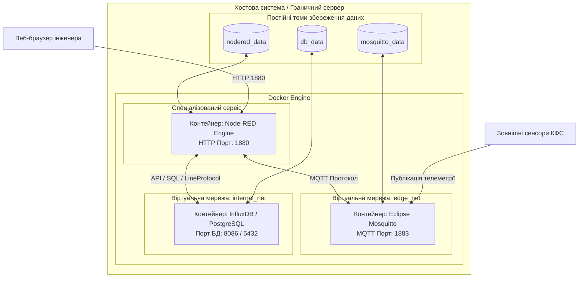
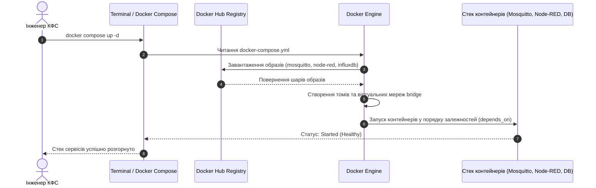

# МЕТОДИЧНА ІНСТРУКЦІЯ ДО ВИКОНАННЯ ЛАБОРАТОРНОЇ РОБОТИ № 7

## **Дисципліна:** Прикладні алгоритми кіберфізичних систем
## **Тема:** Хмарні та граничні обчислення в КФС (Контейнеризація та мікросервіси)
## **Лабораторна робота № 7:** Віртуалізація сервісів КФС за допомогою Docker

---

## **1. Мета роботи та стек технологій**

**Мета роботи:** Опанування практичних навичок проєктування, розгортання та адміністрування віртуалізованих мікросервісних архітектур кіберфізичних систем (КФС) на граничному (Edge) та туманному (Fog) рівнях обчислень. Навчання включає створення маніфестів декларативного опису контейнерів `docker-compose.yml`, налаштування ізольованих віртуальних мереж типу `bridge`, конфігурування монтування постійних томів (volumes) для збереження стану даних, а також розгортання цілісного стека сервісів КФС, що складається з MQTT-брокера (Eclipse Mosquitto), середовища оркестрування (Node-RED) та бази даних часових рядів або реляційної бази даних (InfluxDB / PostgreSQL).

**Стек технологій та інструменти:**
*   **Платформа контейнеризації:** Docker Engine (v24.0+ або v26.0+), Docker Desktop.
*   **Оркестратор контейнерів:** Docker Compose (v2.20+).
*   **Сервіс маршрутизації:** Eclipse Mosquitto (MQTT-брокер v2.0+).
*   **Сервіс оркестрування:** Node-RED (v3.1+ на базі Node.js).
*   **Сервіси збереження даних:** InfluxDB (v2.7+) або PostgreSQL (v15+).
*   **Командний інтерфейс:** Системний термінал (Bash, Zsh, PowerShell).

---

## **2. Теоретичні відомості**

### **2.1. Контейнеризація проти апаратної віртуалізації на граничному рівні КФС**

У кіберфізичних системах класичні централізовані обчислення у хмарах поступаються місцем трирівневій архітектурі: **Edge (граничний рівень) — Fog (туманний рівень) — Cloud (хмарний рівень)**. Граничні та туманні вузли функціонують на базі вбудованих обчислювачів із обмеженими апаратними ресурсами.

Застосування традиційних віртуальних машин на базі гіпервізорів першого або другого типу (таких як VMware чи KVM) є неефективним для КФС, оскільки кожна віртуальна машина потребує виділення окремої гостьової операційної системи. Це створює значний накладний видаток пам'яті та процесорного часу.

Концепція контейнеризації являє собою технологію віртуалізації на рівні операційної системи, за якої всі ізольовані середовища (контейнери) використовують єдине ядро (Kernel) хостової операційної системи. Контейнеризація забезпечує високу швидкість запуску мікросервісів (мілісекунди), мінімальний розмір образотворчих файлів та детермінований розподіл обчислювальних ресурсів, що є критичним для забезпечення функціональної безпеки та жорсткого реального часу.

### **2.2. Компоненти екосистеми Docker**

Для управління мікросервісним стеком КФС використовуються фундаментальні сутності платформи Docker:

*   **Образ (Image):** Статичний шаблон, що містить виконуваний код програми, системні бібліотеки, середовище виконання та конфігураційні файли.
*   **Контейнер (Container):** Динамічний екземпляр образу, що виконується в ізольованому процесному просторі хостової ОС.
*   **Том (Volume):** Механізм збереження даних, який монтується з хостової системи у файлову систему контейнера. Оскільки файлова система контейнера є тимчасовою (ефемерною) і знищується разом із контейнером, томи забезпечують збереження телеметрії та конфігурацій між перезапусками.
*   **Віртуальна мережа (Network):** Програмний комутатор, що створюється драйвером `bridge` для забезпечення взаємодії між контейнерами. Застосування кількох мереж дозволяє реалізувати мережеву ізоляцію: наприклад, база даних доступна лише сервісу обробки, але закрита від зовнішньої мережі.

### **2.3. Декларативне оркестрування за допомогою Docker Compose**

Інструмент Docker Compose дозволяє описувати складні багатоконтейнерні системи у єдиному конфігураційному файлі `docker-compose.yml`, використовуючи мову розмітки **YAML**. У цьому файлі декларуються всі необхідні сервіси, їхні мережеві порти, монтування томів, змінні середовища та залежності запуску.

Завдяки використанню маніфесту `docker-compose.yml` інженер КФС може розгорнути або зупинити весь стек сервісів (брокер, оркестратор, база даних) за допомогою однієї командної інструкції.

### **2.4. Математичний апарат оцінки ресурсів віртуалізованого стека**

Максимальна швидкість передачі телеметрії $C$ від граничних контейнерів до хмарних сервісів аналітики обмежується параметрами фізичного каналу згідно з **теоремою Шеннона-Гартлі**:

$$
C = W \cdot \log_2\left(1 + \frac{S}{N}\right)
$$

де:
*   $C$ — пропускна здатність каналу зв'язку, вимірюється у бітах за секунду ($\text{біт/с}$);
*   $W$ — смуга пропускання каналу, вимірюється у герцах ($\text{Гц}$);
*   $S/N$ — відношення потужності корисного сигналу до потужності шуму.

При аналізі функціонування контейнеризованих сервісів на граничному вузлі функція трудомісткості $\Psi$ розширюється параметрами використання дискового простору та оперативної пам'яті контейнерів:

$$
\Psi = c_1 \cdot F_a(N) + c_2 \cdot M_{image} + c_3 \cdot S_{RAM} + c_4 \cdot S_{Volume}
$$

де:
*   $F_a(N)$ — часова складність обробки потоку з $N$ повідомлень за секунду;
*   $M_{image}$ — сумарний розмір образів Docker у дисковій пам'яті, вимірюється в мегабайтах ($\text{МБ}$);
*   $S_{RAM}$ — обсяг оперативної пам'яті, виділений під виконання активних контейнерів, вимірюється в мегабайтах ($\text{МБ}$);
*   $S_{Volume}$ — обсяг дискового простору тома для зберігання бази даних телеметрії, вимірюється в гігабайтах ($\text{ГБ}$);
*   $c_1, c_2, c_3, c_4$ — вагові коефіцієнти обмеження ресурсів для граничного сервера.

Розрахунок автономності джерела живлення $T_{life}$ для граничного вузла, який надсилає телеметрію в контейнеризований брокер, здійснюється за співвідношеннями:

$$
T_{life} = \frac{C_{bat}}{I_{avg} \cdot 24 \cdot 365}
$$

$$
I_{avg} = \frac{I_{active} \cdot t_{active} + I_{sleep} \cdot t_{sleep}}{t_{cycle}}
$$

де $C_{bat}$ — ємність акумулятора ($\text{мА}\cdot\text{год}$), $I_{avg}$ — середній струм споживання ($\text{мА}$), $t_{cycle}$ — період відправки повідомлень ($\text{с}$).


*Рисунок 1 — Схема мікросервісної архітектури КФС у контейнеризованому середовищі Docker*

Наведеному рисунку відповідає структура розгорнутого мікросервісного стека. Контейнер `Node-RED` знаходиться на перетині двох ізольованих віртуальних мереж, що дозволяє йому зчитувати телеметрію з MQTT-брокера у мережі `edge_net` та зберігати відфільтровані дані в базі даних у мережі `internal_net`, закритій від зовнішнього доступу.

---

## **3. Підготовка середовища та розгортання проєкту (Крок 0)**

Для виконання лабораторної роботи необхідно встановити середовище контейнеризації Docker та інструмент Docker Compose.

### **Крок 0.1. Встановлення ПЗ**
*   **Windows / macOS:** Завантажте та встановіть **Docker Desktop** з офіційного сайту [docker.com](https://www.docker.com/products/docker-desktop/). Переконайтеся, що у налаштуваннях увімкнено підтримку WSL2 (для Windows).
*   **Linux (Ubuntu/Debian):**
    ```bash
    sudo apt update
    sudo apt install -y docker.io docker-compose-v2
    sudo systemctl enable --now docker
    sudo usermod -aG docker $USER
    ```

### **Крок 0.2. Перевірка функціонування Docker**
Відкрийте системний термінал та виконайте команди перевірки версій:

```bash
docker -v
docker compose version
```

У разі успішного встановлення у консолі відобразяться версії компонентів (наприклад, `Docker version 26.0.0` та `Docker Compose version v2.24.1`).

### **Крок 0.3. Створення структури папок проєкту**
Створіть робочу директорію проєкту та необхідні підпапки для конфігураційних файлів:

```bash
mkdir cps-lab7-docker
cd cps-lab7-docker
mkdir -p config/mosquitto
```

Структура робочого каталогу повинна мати такий вигляд:

```
cps-lab7-docker/
├── docker-compose.yml          (Маніфест конфігурації Docker Compose)
├── config/
│   └── mosquitto/
│       └── mosquitto.conf      (Файл налаштувань MQTT-брокера)
└── README.md                   (Інструкція запуску)
```

### **Крок 0.4. Коротка довідка щодо синтаксису YAML**
Файл `docker-compose.yml` використовує розмітку YAML. Ключові правила синтаксису:
*   Ієрархія блоків задається строго за допомогою **пробілів** (використання табуляції заборонено).
*   Списки позначаються дефісом із пробілом `- `.
*   Відображення портів задається у форматі `"порт_хоста:порт_контейнера"`.
*   Монтування томів задається у форматі `"назва_тома:шлях_у_контейнері"`.

---

## **4. Порядок виконання роботи**

### **4.1. Індивідуальні завдання (20 варіантів)**

Конфігураційні параметри мікросервісного стека обираються з наведеної нижче таблиці відповідно до номера вашого варіанта (номеру у списку групи).

| Варіант | Назва системи КФС | База даних телеметрії | Зовнішній порт MQTT | Зовнішній порт Node-RED | Зовнішній порт БД | Назва мережі Edge | Назва мережі Storage |
| :---: | :--- | :---: | :---: | :---: | :---: | :---: | :---: |
| **1** | Моніторинг тепломереж | InfluxDB | `1883` | `1880` | `8086` | `edge_net_1` | `storage_net_1` |
| **2** | Агро-сенсорна мережа | PostgreSQL | `1884` | `1881` | `5432` | `edge_net_2` | `storage_net_2` |
| **3** | Клімат-контроль фармацевтики| InfluxDB | `1885` | `1882` | `8087` | `edge_net_3` | `storage_net_3` |
| **4** | Автоматизація водовідведення | PostgreSQL | `1886` | `1883` | `5433` | `edge_net_4` | `storage_net_4` |
| **5** | Моніторинг сонячної ЕС | InfluxDB | `1887` | `1884` | `8088` | `edge_net_5` | `storage_net_5` |
| **6** | Диспетчеризація ліфтів | PostgreSQL | `1888` | `1885` | `5434` | `edge_net_6` | `storage_net_6` |
| **7** | Системи дегазації шахт | InfluxDB | `1889` | `1886` | `8089` | `edge_net_7` | `storage_net_7` |
| **8** | Розумний паркінг ТРЦ | PostgreSQL | `1890` | `1887` | `5435` | `edge_net_8` | `storage_net_8` |
| **9** | Контроль завад турбін | InfluxDB | `1891` | `1888` | `8090` | `edge_net_9` | `storage_net_9` |
| **10** | Охолодження дата-центру | PostgreSQL | `1892` | `1889` | `5436` | `edge_net_10` | `storage_net_10` |
| **11** | Автоматика птахофабрики | InfluxDB | `1893` | `1890` | `8091` | `edge_net_11` | `storage_net_11` |
| **12** | Роботизований конвеєр | PostgreSQL | `1894` | `1891` | `5437` | `edge_net_12` | `storage_net_12` |
| **13** | Моніторинг тиску нафти | InfluxDB | `1895` | `1892` | `8092` | `edge_net_13` | `storage_net_13` |
| **14** | Контроль вистоювання хліба | PostgreSQL | `1896` | `1893` | `5438` | `edge_net_14` | `storage_net_14` |
| **15** | Екологія міського повітря | InfluxDB | `1897` | `1894` | `8093` | `edge_net_15` | `storage_net_15` |
| **16** | Телеметрія портового крана | PostgreSQL | `1898` | `1895` | `5439` | `edge_net_16` | `storage_net_16` |
| **17** | Мережа заправних станцій | InfluxDB | `1899` | `1896` | `8094` | `edge_net_17` | `storage_net_17` |
| **18** | Контроль пастеризації | PostgreSQL | `1900` | `1897` | `5440` | `edge_net_18` | `storage_net_18` |
| **19** | Автоматика гальванування | InfluxDB | `1901` | `1898` | `8095` | `edge_net_19` | `storage_net_19` |
| **20** | Диспетчерська водоканалу | PostgreSQL | `1902` | `1899` | `5441` | `edge_net_20` | `storage_net_20` |

---

### **4.2. Покроковий алгоритм розробки конфігураційних файлів**

#### **Крок 1. Створення конфігурації MQTT-брокера (`config/mosquitto/mosquitto.conf`)**

Створіть файл `config/mosquitto/mosquitto.conf` та додайте конфігурацію, яка дозволяє анонімний доступ у локальній мережі та вмикає збереження стану:

```conf
# Налаштування слухача на стандартному порту 1883
listener 1883
allow_anonymous true

# Налаштування збереження повідомлень на диск (Persistence)
persistence true
persistence_location /mosquitto/data/

# Логування дій брокера
log_dest stdout
log_type error
log_type warning
log_type notice
log_type information
```

#### **Крок 2. Створення маніфесту Docker Compose (`docker-compose.yml`)**

Відкрийте файл `docker-compose.yml` у кореневій папці проєкту та вставте повний декларативний опис стека (реалізація **Варіанта №1** із базою даних InfluxDB):

```yaml
version: '3.8'

# 1. Оголошення сервісів (мікроконтейнерів)
services:

  # Сервіс 1: MQTT-брокер Eclipse Mosquitto
  mqtt-broker:
    image: eclipse-mosquitto:2.0
    container_name: cps_mosquitto_broker
    restart: always
    ports:
      - "1883:1883" # Зовнішній:Внутрішній порт MQTT
    volumes:
      - ./config/mosquitto/mosquitto.conf:/mosquitto/config/mosquitto.conf
      - mosquitto_data:/mosquitto/data
      - mosquitto_log:/mosquitto/log
    networks:
      - edge_net_1

  # Сервіс 2: Середовище оркестрування Node-RED
  nodered-engine:
    image: nodered/node-red:latest
    container_name: cps_nodered_engine
    restart: always
    ports:
      - "1880:1880" # Зовнішній:Внутрішній порт веб-інтерфейсу
    volumes:
      - nodered_data:/data
    networks:
      - edge_net_1
      - storage_net_1
    depends_on:
      - mqtt-broker
      - telemetry-db

  # Сервіс 3: База даних часових рядів InfluxDB
  telemetry-db:
    image: influxdb:2.7
    container_name: cps_influx_database
    restart: always
    ports:
      - "8086:8086" # Зовнішній:Внутрішній порт API InfluxDB
    environment:
      - DOCKER_INFLUXDB_INIT_MODE=setup
      - DOCKER_INFLUXDB_INIT_USERNAME=cps_admin
      - DOCKER_INFLUXDB_INIT_PASSWORD=cps_password_123
      - DOCKER_INFLUXDB_INIT_ORG=cps_organization
      - DOCKER_INFLUXDB_INIT_BUCKET=telemetry_bucket
    volumes:
      - db_data:/var/lib/influxdb2
    networks:
      - storage_net_1

# 2. Оголошення постійних томов (Named Volumes)
volumes:
  mosquitto_data:
    name: cps_mosquitto_data_vol
  mosquitto_log:
    name: cps_mosquitto_log_vol
  nodered_data:
    name: cps_nodered_data_vol
  db_data:
    name: cps_influx_db_data_vol

# 3. Оголошення ізольованих віртуальних мереж (Networks)
networks:
  edge_net_1:
    name: cps_edge_network_1
    driver: bridge
  storage_net_1:
    name: cps_storage_network_1
    driver: bridge
```

---

### **4.3. Команди розгортання та керування контейнерами**

Виконайте наступні CLI-команди у системному терміналі з папки проєкту `cps-lab7-docker`:

#### **1. Запуск мікросервісного стека у фоновому режимі (Detached Mode):**
```bash
docker compose up -d
```
При першому запуску Docker завантажить необхідні образи з Docker Hub, створить віртуальні мережі `edge_net_1`, `storage_net_1`, іменовані томи та запустить контейнери.


*Рисунок 2 — Схема разгортання мікросервісного стека за допомогою Docker Compose*

Наведеному рисунку відповідає послідовність дій оркестратора. Після зчитування конфігураційного файла Docker Compose автоматично завантажує відсутні образи з реєстру Docker Hub, ініціалізує томи збереження та підключає контейнери до відповідних віртуальних мереж.

#### **2. Перевірка стану запущенних контейнерів:**
```bash
docker compose ps
```
У консолі відобразиться таблиця зі статусами контейнерів (стан повинен бути `Up` або `running`).

#### **3. Перевірка створених томов та віртуальних мереж:**
```bash
docker volume ls | grep cps
docker network ls | grep cps
```

#### **4. Перегляд системних логів виконання стека:**
```bash
docker compose logs -f
```
Для перегляду логів конкретного сервісу виконайте:
```bash
docker compose logs -f nodered-engine
```

---

### **4.4. Налаштування збору телеметрії та перевірка енергонезалежності даних**

1.  Відкрийте веб-браузер та перейдіть до інтерфейсу **Node-RED**: `http://localhost:1880`.
2.  Відкрийте веб-інтерфейс **InfluxDB**: `http://localhost:8086` (увійдіть під логіном `cps_admin` та паролем `cps_password_123`).
3.  Створіть у Node-RED тестовий потік згідно з матеріалами Лабораторної роботи №3:
    *   Вузол **Inject** $\to$ **Function** (генерує JSON телеметрії) $\to$ **MQTT Out** (публікує в топік `kyiv_metal/shop_smelting/furnace_01/temperature` на `mqtt-broker:1883`).
    *   Вузол **MQTT In** (підписка на `kyiv_metal/#`) $\to$ **Debug**.
4.  Натисніть **Deploy** у Node-RED та переконайтеся у надходженні повідомлень.

#### **Перевірка енергонезалежності даних (Data Persistence Test):**

1.  Зупиніть та видаліть активні контейнери стека:
    ```bash
    docker compose down
    ```
2.  Переконайтеся за допомогою команди `docker ps`, що контейнери припинили роботу.
3.  Запустіть стек повторно:
    ```bash
    docker compose up -d
    ```
4.  Відкрийте Node-RED (`http://localhost:1880`) та InfluxDB (`http://localhost:8086`). Переконайтеся, що всі створені потоки, конфігурації та збережена телеметрія залишилися неушкодженими завдяки монтуванню томов `nodered_data` та `db_data`.

---

## **5. Вимоги до змісту звіту**

Звіт з лабораторної роботи оформлюється у форматі PDF або MS Word та має містити наступні обов’язкові розділи:

1.  **Титульна сторінка:** Назва університету, факультету, кафедри, дисципліни, номер лабораторної роботи, тема, варіант, ПІБ студента та викладача.
2.  **Формулювання завдання варіанта:** Таблиця з конфігураційними параметрами вашого варіанта (Назва КФС, тип бази даних, зовнішні порти, назви віртуальних мереж).
3.  **Конфігураційні файли проєкту:**
    *   Повний текст файла `config/mosquitto/mosquitto.conf`.
    *   Повний текст маніфесту `docker-compose.yml` із коментарями.
4.  **Результати виконання команд у терміналі (Скріншоти):**
    *   Скріншот виведення команди `docker compose ps` зі статусами запущенних контейнерів.
    *   Скріншот виведення команд `docker volume ls` та `docker network ls`.
5.  **Графічні результати перевірки сервісів:**
    *   Скріншот робочого столу Node-RED із запущенним потоком телеметрії.
    *   Скріншот дашборду бази даних (InfluxDB або PostgreSQL/pgAdmin).
    *   Скріншот, що підтверджує збереження даних після виконання команди `docker compose down` та повторного `docker compose up -d`.
6.  **Аналітична частина:**
    *   Розрахунок заповнення дискового простору тома $S_{Volume}$ при збереженні телеметрії протягом $30$ днів з заданим періодом опитування.
    *   Оцінка трудомісткості системи $\Psi$ на основі використаної оперативної пам'яті $S_{RAM}$ та обсягу образів $M_{image}$.
7.  **Висновки:** Аналіз переваг використання контейнеризації Docker для розгортання розподілених КФС.

---

## **6. Контрольні запитання**

1.  У чому полягає фундаментальна відмінність між апаратною віртуалізацією на рівні гіпервізора та контейнеризацією на рівні ядра операційної системи?
2.  Для чого використовуються іменовані томи (Named Volumes) у Docker? Що відбувається з даними всередині контейнера при його видаленні, якщо томи не були зконфігуровані?
3.  Яку роль відіграють віртуальні мережі драйвера `bridge` у Docker Compose? Як реалізується мережева ізоляція бази даних від зовнішнього доступу?
4.  Поясніть призначення директиви `depends_on` у конфігураційному файлі `docker-compose.yml`.
5.  Як використання контейнеризованого стека на граничних вузлах (Edge Nodes) впливає на коефіцієнти функції трудомісткості $\Psi$ та загальну відмовостійкість КФС?