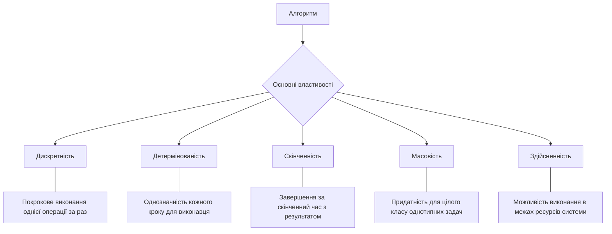
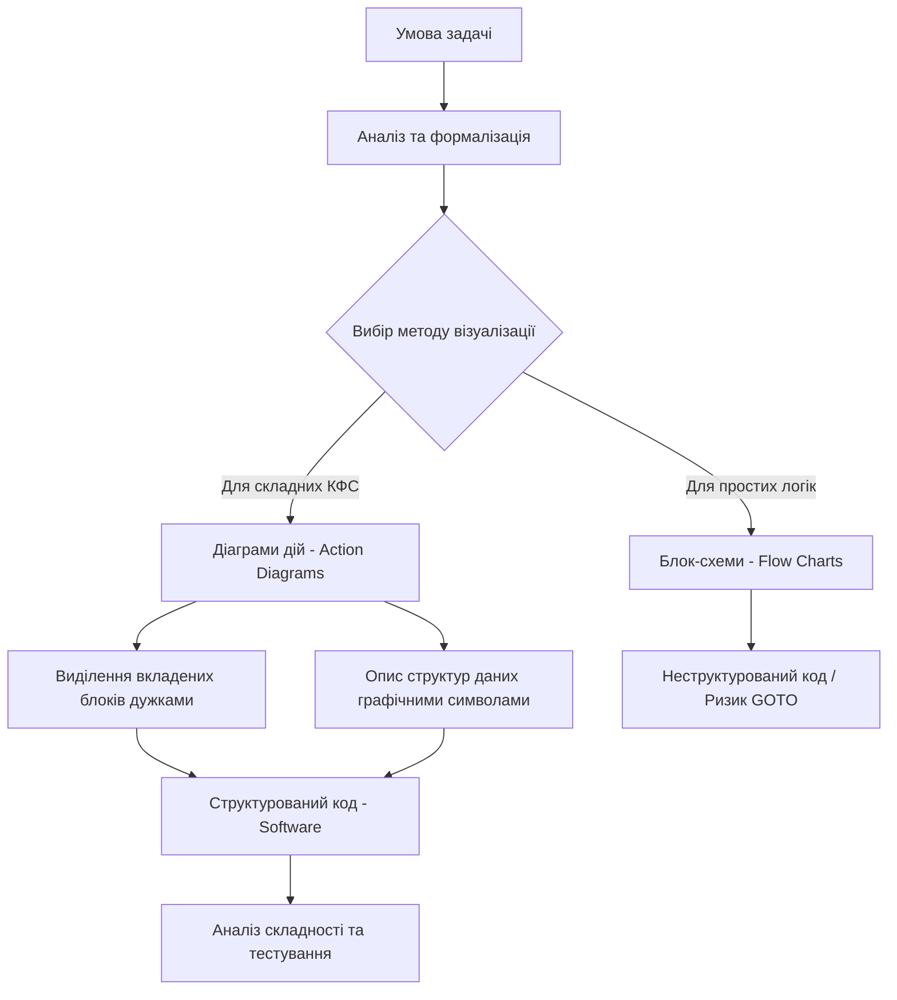
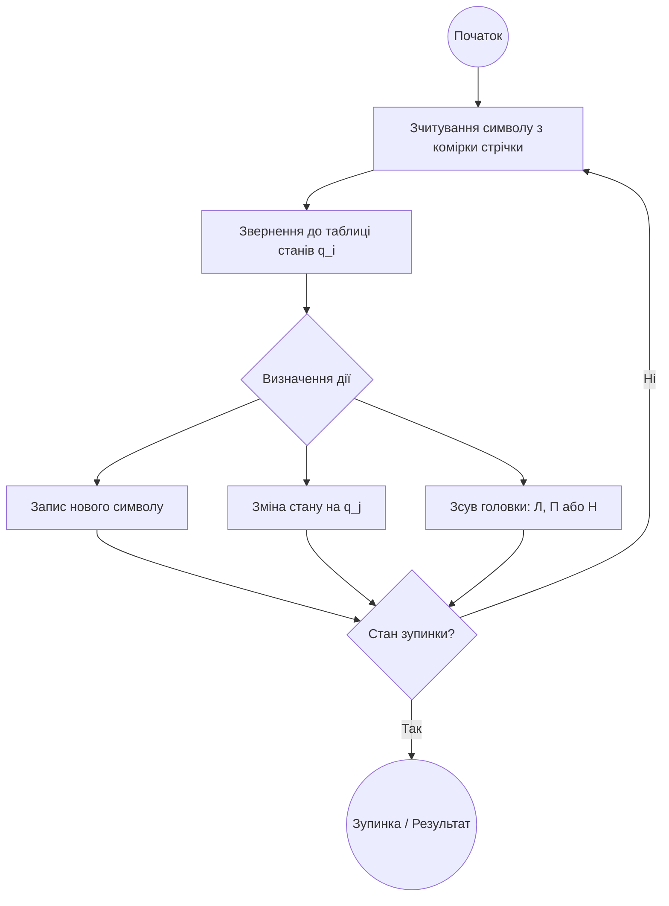

# Тема 1. Теоретичні засади алгоритмізації в КФС

## 1.1 Поняття алгоритму, його властивості та способи запису

У сучасному науковому розумінні, що розглядається в контексті проектування кіберфізичних систем (КФС), **алгоритм** визначається як точне розпорядження про виконання в певному порядку чітко зазначеної послідовності операцій, що дозволяє отримати результат із початкових даних для цілого класу однотипних задач. Сама назва походить від імені середньовічного перського математика Абу Абдулли Мухаммада ібн Муса аль-Хорезмі, чиє ім'я в латинській транскрипції записувалося як **Alhoritmi**. Саме він першим формалізував правила виконання арифметичних дій, що згодом заклало фундамент для виділення алгоритмізації як самостійної інтелектуальної дисципліни.

Теоретики програмування виділяють особливий рівень архітектури обчислювальних систем — **Brainware** (мозкова начинка), який стоїть над апаратним (**Hardware**) та програмним (**Software**) забезпеченням. Якщо Hardware — це фізична основа, а Software — текст програми, то Brainware — це сюжетна лінія, тобто сам алгоритм, який визначає логіку поведінки системи. Для інженера КФС алгоритмічне мислення є первинним, оскільки воно дозволяє прорахувати проєкт на максимальну кількість ситуацій наперед, незалежно від конкретної мови програмування.

Будь-який алгоритм повинен володіти набором фундаментальних властивостей, які відрізняють його від довільного набору інструкцій. По-перше, це **дискретність**, яка проявляється у двох аспектах: дискретності інформації (дані подаються у вигляді скінченних слів у певному алфавіті) та дискретності роботи (процес виконується покроково, де кожна операція завершується перед початком наступної). По-друге, це **детермінованість** (визначеність), яка гарантує, що кожен крок алгоритму є строго однозначним для виконавця, а повторне застосування алгоритму до тих самих вхідних даних завжди призведе до ідентичного результату.

Наступною критичною властивістю є **скінченність** (або збіжність), що передбачає завершення роботи алгоритму за кінцеве число кроків із видачею результату, що тісно пов’язано з його **результативністю**. Також алгоритм має відповідати критерію **масовості**, тобто бути придатним для розв'язання не однієї конкретної задачі, а цілого класу завдань із заданої предметної області. Нарешті, властивість **здійсненності** вимагає, щоб кожна операція алгоритму була фізично та логічно можливою для виконання в межах наявних ресурсів пам’яті та часу.

За своєю структурою алгоритми класифікують на чотири базові типи. **Послідовні (лінійні)** алгоритми складаються з простої послідовності дій, що виконуються одна за одною. **Розгалужені** алгоритми містять умовні переходи, де подальший шлях обчислень залежить від істинності певного логічного виразу. **Циклічні** алгоритми передбачають багаторазове повторення певної групи операцій, а **комбіновані** (складні) типи являють собою поєднання попередніх структур у довільному порядку та вкладеності.

Для фіксації логіки обчислень використовують різні способи запису. **Словесний спосіб** описує алгоритм природною мовою, що є зручним для людей, але не досить формалізованим для машин. **Формульно-словесний (аналітичний)** спосіб широко застосовується в математиці для доведення теорем. **Графічні методи**, такі як блок-схеми, забезпечують високу наочність для простих структур, де овал позначає початок або кінець, прямокутник — операцію, а ромб — умовне розгалуження. Однак для складних систем блок-схеми стають громіздкими та стимулюють використання неструктурних переходів **goto**, що є критичним недоліком у сучасному програмуванні.

Професійним стандартом для навчання та проєктування є **структурні діаграми дій (Action Diagrams)**. На відміну від блок-схем, вони є строго структурними і не дозволяють створити неструктурований алгоритм. Вкладені дії в них виділяються боковими лініями або дужками, що робить структуру алгоритму максимально наближеною до коду мов програмування високого рівня. Це дозволяє програмісту легко транслювати логіку Brainware у Software. Також виділяють **псевдокоди** — універсальні мови опису алгоритмів, що абстрагуються від синтаксису конкретних реалізацій для кращого розуміння суті процесів.

У теорії алгоритмів час виконання програми оцінюється як функція від обсягу вхідних даних $n$. Цей показник називається **часовою складністю** і визначається кількістю елементарних операцій, які необхідно виконати.

Загальний час виконання алгоритму $T(n)$ можна представити як суму часу виконання окремих інструкцій:

$$
T(n) = \sum_{i=1}^{N} t_i,
$$

де:
- $T(n)$ — загальний час виконання (або кількість операцій) як функція від розмірності входу $n$.
- $t_i$ — фіксований час виконання $i$-ї елементарної операції. У спрощеній моделі приймається, що $t_i = 1$ для всіх операцій (присвоєння, порівняння, арифметичні дії).
- $N$ — загальна кількість таких операцій у конкретному алгоритмі.

Для аналізу КФС часто використовують поняття **функції трудомісткості** $\Psi$, яка враховує не лише час, а й інші ресурси системи:

$$
\Psi = c_1 \cdot F_a(N) + c_2 \cdot M + c_3 \cdot S_d + c_4 \cdot S_r,
$$

де:

- $F_a(N)$ — кількість виконуваних операцій (часова складність).
- $M$ — кількість машинних інструкцій (об'єм програмного коду).
- $S_d$ — обсяг пам'яті для зберігання проміжних результатів.
- $S_r$ — обсяг пам'яті для організації самих обчислень (стек, рекурсія тощо).
- $c_1, c_2, c_3, c_4$ — вагові коефіцієнти, що визначають значущість кожного ресурсу для конкретної апаратної платформи КФС.

Класифікація та порівняльна характеристика основних способів запису алгоритмів наведена у таблиці нижче.

| Спосіб запису | Основні характеристики | Переваги | Недоліки |
| :--- | :--- | :--- | :--- |
| **Словесний** | Опис природною мовою. | Зрозумілість для широкого загалу. | Низька формалізація, неоднозначність. |
| **Графічний (Блок-схеми)** | Використання геометричних фігур для дій та умов. | Висока наочність для простих алгоритмів. | Втрата наочності у складних системах, провокування неструктурного коду. |
| **Діаграми дій (Action Diagrams)** | Структурні дужки, вертикальне зростання. | Строга структурованість, легка трансляція в код. | Вимагає спеціальних навичок малювання/читання. |
| **Програмний** | Запис мовою програмування (C, Python тощо). | Можливість безпосереднього виконання на ЕОМ. | Залежність від синтаксису конкретної мови. |
| **Псевдокод** | Універсальна нотація високого рівня. | Мовонезалежність, зосередженість на логіці. | Неможливість прямого запуску на комп'ютері. |

Нижче наведено ієрархічну структуру властивостей алгоритму, які є обов'язковими для його коректного функціонування в кіберфізичних системах.

Наведена схема ілюструє логічний взаємозв'язок між фундаментальними вимогами до алгоритму. Кожна з цих властивостей є необхідною: відсутність хоча б однієї з них (наприклад, детермінованості або скінченності) перетворює набір інструкцій на некоректну послідовність, що не може бути надійно реалізована в КФС.

### Питання для самоперевірки

1. Поясніть концептуальну різницю між поняттями Brainware, Software та Hardware в контексті розробки кіберфізичних систем. Чому рівень Brainware вважається первинним?
2. Яка властивість алгоритму гарантує, що він не "зациклиться" і обов'язково видасть результат після виконання певної кількості кроків? Поясніть її зв’язок із результативністю.
3. Чому використання блок-схем при проєктуванні великих програмних комплексів вважається шкідливим, і яку альтернативу пропонують фахівці зі структурного програмування?
4. Дайте визначення часової складності алгоритму $T(n)$. Які операції в спрощеній моделі обчислень прийнято вважати елементарними?
5. Опишіть переваги використання діаграм дій (Action Diagrams) порівняно з іншими графічними способами запису алгоритмів. Як вони забезпечують структурність коду?

## 1.2 Візуалізація алгоритмів: блок-схеми та структурні діаграми дій (Action Diagrams)

У процесі проєктування складних систем, зокрема кіберфізичних, етап алгоритмізації вимагає використання інструментів, що забезпечують високу наочність та строгість логіки. Візуалізація алгоритмів дозволяє розробнику абстрагуватися від синтаксичних особливостей конкретних мов програмування та зосередитися на сюжетній лінії поведінки системи, яку теоретики називають **Brainware**. Основними графічними способами представлення алгоритмів є класичні блок-схеми та сучасні структурні діаграми, серед яких особливе місце посідають **діаграми дій** (Action Diagrams) та діаграми Нассі-Шнейдермана.

**Блок-схеми** (Flow charts) є найбільш традиційним методом візуалізації, що використовує набір стандартизованих геометричних блоків, з’єднаних лініями переходу. Згідно з міжнародними та державними стандартами, кожна фігура має своє функціональне призначення: «овал» позначає термінальні вузли (початок та кінець), «прямокутник» — обчислювальну дію або послідовність операторів, а «ромб» — вузол розгалуження, де вибір подальшого шляху залежить від істинності певної логічної умови. Головною перевагою блок-схем є їхня висока інтуїтивна зрозумілість при описі простих лінійних або слабо розгалужених процесів. Однак при переході до складних алгоритмів блок-схеми виявляють критичні недоліки, оскільки відсутність жорстких обмежень на проведення з’єднувальних ліній призводить до перетину зв’язків та неконтрольованого розростання схеми в усіх напрямках. Це стимулює так званий неструктурний стиль програмування, що базується на використанні операторів безумовного переходу **goto**, що робить логіку програми заплутаною («спагеті-код») і практично неможливою для ефективного налагодження.

Історично проблема заплутаності алгоритмів призвела до виникнення парадигми **структурного програмування**. Важливим етапом стала публікація Едсгера Дейкстри у 1968 році статті «Оператор Go To вважається шкідливим», де він математично обґрунтував необхідність відмови від неструктурних переходів на користь базових конструкцій: послідовності, вибору та циклу. Цей підхід підтримали такі вчені, як Ніклаус Вірт та Тоні Хоар, що заклало фундамент для створення нових засобів візуалізації, які б фізично не дозволяли програмісту створити неструктурований алгоритм.

**Структурні діаграми дій** (Action Diagrams) стали професійним інструментом, що поєднує наочність графіки зі строгістю структурованого коду. На відміну від блок-схем, діаграми дій ростуть переважно вертикально, що дозволяє легко розміщувати їх на екрані комп’ютера або папері незалежно від складності завдання. Ключовою особливістю цих діаграм є обов’язкове виділення вкладених блоків боковими лініями або дужками, що наочно демонструє ієрархію керуючих конструкцій. Це забезпечує фактично однозначну трансляцію алгоритму в код будь-якої сучасної мови програмування високого рівня (C/C++, Java, Python), оскільки структура діаграми «один-в-один» відповідає структурі операторних дужок у тексті програми.

У практичній діяльності використовують дві рівноцінні форми запису діаграм дій: **прямокутну**, де блоки обмежені замкненими контурами, та **дужкову**, де використовуються лише ліві вертикальні межі блоків. Прямокутна форма є більш естетичною та наочною для презентаційних цілей, тоді як дужкова форма є значно зручнішою для швидкого запису алгоритму від руки під час проектування чи навчання. Завдяки відсутності специфічних ключових слів та акценту на графічних символах структур даних (наприклад, спеціальні позначки для масивів, множин чи файлів), діаграми дій забезпечують максимальну прозорість логіки, недоступну для звичайного програмного тексту.

Візуалізація алгоритму є основою для подальшого аналізу його часової та ємнісної складності. При використанні діаграм дій оцінювання загальної кількості операцій виконується шляхом сумування операцій у кожному структурному блоці.

Загальна кількість операцій алгоритму $K$ обчислюється як сума витрат на окремі типи дій:

$$
K = K_L + K_{AS} + K_A + K_C.
$$

У цій формулі змінна $K_L$ позначає кількість обробок заголовків циклів, що безпосередньо корелює з кількістю ітерацій, відображених на діаграмі. Змінна $K_{AS}$ відповідає кількості операцій присвоювання (assignment), які на діаграмах дій зазвичай групуються в операторних блоках. Параметр $K_A$ визначає кількість арифметичних операцій, а $K_C$ — кількість операцій порівняння (comparison) у вузлах розгалуження та заголовках умовних циклів.

Для розгалужених алгоритмів, що мають декілька гілок, розраховується середня кількість операцій $K_{сер}$:

$$
K_{сер} = \frac{K_{min} + K_{max}}{2},
$$

де $K_{min}$ та $K_{max}$ — це відповідно мінімальна та максимальна кількість операцій, що може бути виконана залежно від вхідних даних. На графічних схемах ці значення визначаються шляхом аналізу найбільш та найменш навантажених шляхів проходження алгоритму.

Для обґрунтованого вибору методу візуалізації доцільно порівняти характеристики основних графічних способів запису алгоритмів.

| Критерій порівняння | Блок-схеми (Flow Charts) | Діаграми дій (Action Diagrams) | Діаграми Нассі-Шнейдермана |
| :--- | :--- | :--- | :--- |
| **Напрямок розростання** | У довжину та ширину, хаотично | Переважно вертикально (вниз) | У довжину та ширину одночасно |
| **Підтримка структурованості** | Низька (дозволяють `goto`) | Абсолютна (блочна вкладеність) | Висока, але обмежена розміром |
| **Складність реалізації** | Легко для дуже простих задач | Зручно для задач будь-якої складності | Тільки для простих навчальних задач |
| **Відповідність коду** | Низька, важка трансляція | Максимальна (один в один) | Середня |
| **Наочність вкладеності** | Потребує відстеження ліній | Пряма (через бокові дужки) | Пряма (через вкладені рамки) |

Логіка побудови структурних діаграм дій базується на чіткій ієрархії компонентів. Нижче наведено схему життєвого циклу створення алгоритму через візуальні моделі.

Описана модель демонструє, що використання діаграм дій є критичним фільтром, який запобігає появі логічних помилок ще на етапі проектування. Прямокутна форма (а) та дужкова форма (б) є алгоритмічно еквівалентними, оскільки обидві використовують ідентичні позначки для вводу даних `In(A, B, C)`, умов `(A > B)` та виводу результатів `Out`. Головна відмінність полягає лише у способі замикання візуального контуру блоку.

### Питання для самоперевірки

1. Яким чином блок-схеми стимулюють використання оператора `goto` і чому це вважається критичним недоліком при розробці програмного забезпечення КФС?
2. Поясніть концепцію «структурної вкладеності» в діаграмах дій. Які графічні елементи використовуються для її відображення?
3. У чому полягає практична різниця між прямокутною та дужковою формами запису діаграм дій і яку з них рекомендується використовувати для швидких начерків алгоритму?
4. Чому діаграми Нассі-Шнейдермана, незважаючи на їхню структурність, рідко використовуються для опису великих промислових алгоритмів?
5. Як візуалізація алгоритму у формі діаграми дій допомагає розрахувати середню часову складність $K_{сер}$ для розгалужених процесів?

## 1.3 Формальні моделі обчислень: машини Поста та Тюрінґа

Незважаючи на те, що фундаментальне поняття алгоритму виникло в математиці ще у глибокому середньовіччі, основні наукові положення, що стосуються концепції застосування алгоритмів як невід’ємної частини машинних обчислень, були розроблені лише у XX сторіччі. У 1930-х роках американський математик Еміль Пост та британський математик Алан Тюрінґ незалежно один від одного заклали теоретичні основи алгоритмічної реалізації, створивши абстрактні обчислювальні моделі. Ці моделі отримали назву «машин» через їхню функціональну схожість з обчислювальними автоматами, а з огляду на спільні принципи побудови, їх часто об’єднують під загальною назвою **машини Поста — Тюрінґа**. Обидві моделі містять ряд ідентичних елементів: теоретично нескінченну стрічку, розбиту на комірки для зберігання символів, та каретку (або головку), що здатна переміщуватися над стрічкою та виконувати дії над символами згідно із заданою програмою.

**Машина Поста** стала першою спробою поглянути на алгоритм як на універсальний засіб вирішення будь-якої проблеми, яку можна математично формалізувати та перекласти на мову однозначних інструкцій. Основною особливістю цієї моделі є робота в унарній системі числення, де використовуються лише однакові символи — мітки та пробіли. Програма для машини Поста складається зі скінченного впорядкованого набору інструкцій, кожна з яких має свій номер. Пост виділив шість базових інструкцій: поставити мітку в порожню комірку, стерти існуючу мітку, переміститися вліво, переміститися вправо, перевірити наявність мітки (умовний перехід) та зупинити роботу. Важливою теоретичною конструкцією є поняття **фінітного 1-процесу**, який визначає такий набір інструкцій, що гарантовано завершується результатом для кожної конкретної проблеми із заданого класу.

**Машина Тюрінґа**, запропонована у 1937 році, стала першою універсальною алгоритмічною схемою, яка лягла в основу сучасної концепції обчислювальних машин фон Неймана. На відміну від моделі Поста, машина Тюрінґа є **знакопереробним пристроєм**, що працює із зовнішнім алфавітом довільних символів $A = \{ \alpha, \beta, \gamma, \dots \}$, обов’язковим елементом якого є порожній символ $\Lambda$. Обчислювальний процес у цій моделі визначається не лише символом на стрічці, а й внутрішнім станом каретки $q_i \in Q$, що фактично виконує роль пам’яті системи. Коли машина перебуває у різних станах, вона може виконувати абсолютно різні дії над одним і тим самим символом, що дозволяє реалізовувати надскладні логічні конструкції.

Теоретичне значення цих моделей узагальнюється у **тезі Черча — Тюрінґа**, яка стверджує, що будь-яка функція є ефективно обчислюваною тоді і тільки тоді, коли вона є рекурсивною і може бути реалізована на машині Тюрінґа. Ця теза не є теоремою в класичному розумінні, оскільки вона ототожнює інтуїтивне поняття алгоритму з математично строгою моделлю, проте вона є фундаментом всієї сучасної теорії алгоритмів. Завдяки роботам Тюрінґа було доведено існування **алгоритмічно нерозв’язних проблем**, таких як «проблема зупинки», що математично підтверджує неможливість побудови універсального алгоритму, який би визначав завершення будь-якої іншої програми за скінченний час.

Логіка функціонування машини Тюрінґа описується через систему команд, кожна з яких визначає перетворення поточної конфігурації системи. Основна розрахункова одиниця — команда переходу — записується у наступному форматі:

$$
\alpha q_i \to \beta q_j \xi, \text{ де } \xi \in \{\text{Л}, \text{П}, \text{Н}\}.
$$

У наведеній математичній залежності змінна $\alpha$ позначає символ, який головка зчитує в поточній комірці стрічки, а $q_i$ відповідає поточному внутрішньому стану машини. Символ $\beta$ вказує на новий знак, який буде записаний у комірку замість $\alpha$ (причому $\beta$ може дорівнювати $\alpha$, якщо зміна не потрібна), а $q_j$ визначає стан, у який перейде машина після виконання операції. Параметр $\xi$ задає напрямок подальшого руху головки: вліво ($Л$), вправо ($П$) або залишення на місці ($Н$).

Для аналізу ефективності алгоритмів, реалізованих на таких моделях, використовують **функцію трудомісткості** $\Psi$, яка враховує не лише час, а й апаратні ресурси:

$$
\Psi = c_1 \cdot F_a(N) + c_2 \cdot M + c_3 \cdot S_d + c_4 \cdot S_r.
$$

У цій формулі параметр $F_a(N)$ відображає кількість елементарних операцій (кроків машини), що прямо пропорційно часовій складності алгоритму. Змінна $M$ позначає обсяг програмного коду (кількість машинних інструкцій або станів у таблиці переходів). Величини $S_d$ та $S_r$ описують обсяг пам’яті (кількість комірок стрічки), необхідний для зберігання вхідних даних та організації проміжних обчислень відповідно. Коефіцієнти $c_1 \dots c_4$ визначають вагову значущість кожного ресурсу залежно від специфіки фізичної реалізації обчислювальної системи.

Класифікація та порівняльна характеристика базових формальних моделей обчислень наведена у таблиці нижче.

| Характеристика | Машина Поста | Машина Тюрінґа |
| :--- | :--- | :--- |
| **Система числення** | Виключно унарна (мітки) | Довільний алфавіт символів |
| **Кількість команд** | Фіксована (6 стандартних інструкцій) | Необмежена (визначається таблицею) |
| **Внутрішні стани** | Стан визначається номером кроку | Спеціальний алфавіт станів $Q$ |
| **Тип пристрою** | Обчислювальний автомат низького рівня | Знакопереробний універсальний пристрій |
| **Призначення** | Формалізація простих крокових процесів | Математичне визначення алгоритму |
| **Критерій зупинки** | Виконання спеціальної команди «!» | Перехід у заключний стан зупинки |

Для практичного використання машини Поста використовується стандартний набір інструкцій, що наведений у таблиці 2.1 джерел.

| Номер інструкції | Позначення | Зміст дії каретки |
| :--- | :--- | :--- |
| 1 | `V` | Помітити порожню комірку міткою |
| 2 | `X` | Стерти мітку в поточній комірці |
| 3 | `←` | Переміститися на одну комірку вліво |
| 4 | `→` | Переміститися на одну комірку вправо |
| 5 | `? i; j` | Якщо є мітка — перехід на крок $i$, якщо ні — на $j$ |
| 6 | `!` | Повна зупинка роботи алгоритму |

Алгоритмічний цикл функціонування машини Тюрінґа можна представити як послідовність дискретних тактів, де кожен наступний крок детермінований поєднанням поточного стану та зчитаного символу.

Наведена модель ілюструє властивість **дискретності**, згідно з якою виконання алгоритму здійснюється покроково, і перехід до наступної дії можливий лише після повного завершення попередньої. Описана схема також демонструє **детермінованість** процесу: для кожної комбінації стану та символу в таблиці передбачено лише один варіант дії, що забезпечує однозначність обчислень.

### Питання для самоперевірки

1. У чому полягає фундаментальна відмінність між алфавітами символів у машині Поста та машині Тюрінґа і як це впливає на складність розв’язуваних задач?
2. Поясніть роль внутрішніх станів $q_i$ у моделі Тюрінґа. Чому ці стани вважаються аналогом пам’яті сучасної обчислювальної системи?
3. Яке практичне та теоретичне значення має теза Черча — Тюрінґа для проектування прикладних алгоритмів у кіберфізичних системах?
4. Опишіть умови виникнення колізій у роботі машини Поста. Які ситуації вважаються некоректним застосуванням набору інструкцій?
5. Чому проблема зупинки машини Тюрінґа вважається алгоритмічно нерозв’язною і як це відкриття обмежило можливості автоматизованих систем обчислень?
