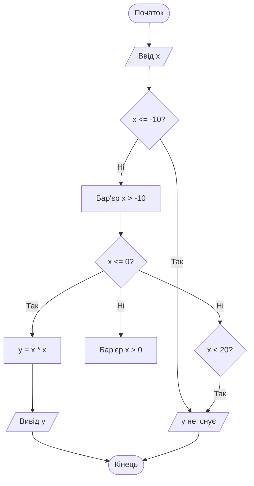
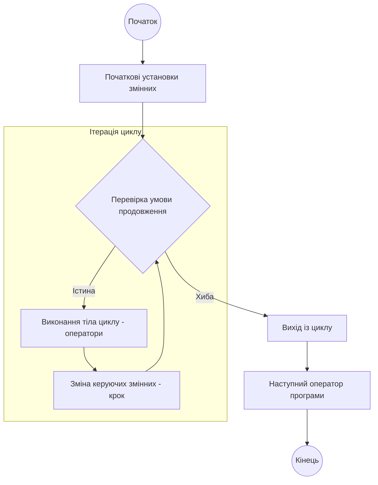
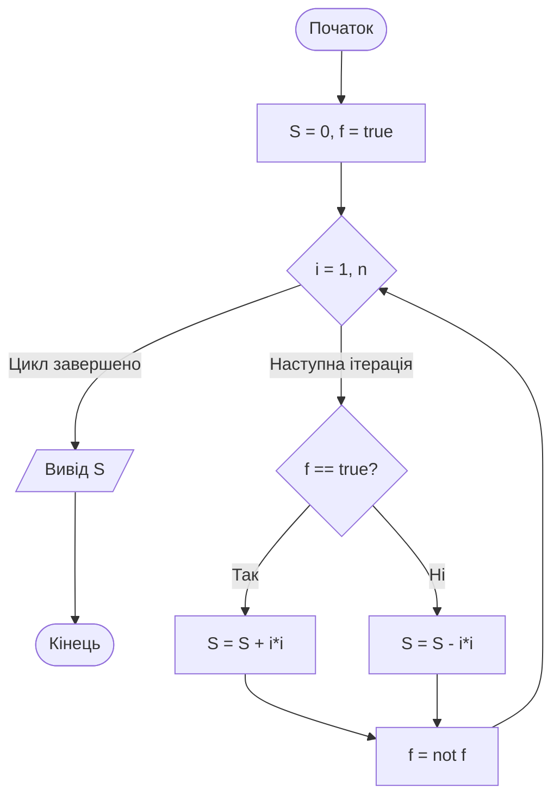

# Тема 2. Керуючі конструкції в алгоритмах реального часу

## 2.1 Розгалужені алгоритми та булеві операції в умовах обмежених ресурсів

У контексті розробки кіберфізичних систем (КФС) реального часу, де обчислювальні ресурси часто є суворо обмеженими, проектування **розгалужених алгоритмів** вимагає особливого підходу до вибору керуючих конструкцій та логічних операцій. Розгалужений алгоритм — це послідовність операторних і умовних блоків, у якій відсутні зворотні зв’язки, а шлях обчислень визначається істинністю певних умов. На рівні **Brainware** (алгоритмічного забезпечення) розробник має знайти баланс між читабельністю коду та його апаратною ефективністю.

Фундаментом для побудови умов у таких алгоритмах є **булева алгебра**, яка оперує логічними виразами, що можуть приймати лише одне з двох значень: «істина» (**true**) або «хибність» (**false**). Базовий логічний базис включає три операції: заперечення (**not**), кон’юнкцію (**and**) та диз’юнкцію (**or**). При роботі в умовах обмежених ресурсів (наприклад, у вбудованих системах з малим об'ємом пам'яті) важливо враховувати **пріоритети операцій**: найвищий пріоритет має унарна операція **not**, далі слідує **and**, а найнижчий — **or**. Це дозволяє мінімізувати кількість дужок у коді, що економить пам'ять програм.

Розробка розгалужених алгоритмів може здійснюватися за трьома основними стратегіями. Перша стратегія передбачає послідовне відсікання діапазонів значень (наприклад, за точками зліва направо на числовій осі), що дозволяє створювати регулярні та прозорі алгоритми без використання складних булевих виразів. Друга стратегія фокусується виключно на виділенні діапазонів існування функції, а третя — на попередньому відсіканні областей, де результат не визначений. Використання булевих операцій (стратегії 2 та 3) дозволяє об'єднати декілька простих перевірок в одну складну умову, що значно покращує читабельність алгоритму, але може негативно вплинути на швидкість його виконання.

Критичним аспектом для систем реального часу є вибір між **повною** та **короткою схемою обчислення** булевих виразів. При повній схемі компілятор обчислює всі частини виразу незалежно від проміжних результатів, що може призвести до зайвих витрат процесорного часу або навіть помилок доступу до пам'яті (наприклад, звернення до неіснуючого елемента масиву). Коротка схема припиняє обчислення, як тільки результат стає однозначним (наприклад, якщо перший операнд у зв'язці **and** є хибним). Це властивість є надзвичайно важливою для КФС, оскільки дозволяє суттєво прискорити обробку даних у критичних ділянках коду.

Для об’єктивної оцінки ефективності алгоритму в умовах обмежених ресурсів використовують **функцію трудомісткості** $\Psi$, яка враховує не лише час виконання, а й витрати пам'яті. Математично вона виглядає наступним чином:

$$
\Psi = c_1 \cdot F_a(N) + c_2 \cdot M + c_3 \cdot S_d + c_4 \cdot S_r.
$$

У наведеній формулі:
- $F_a(N)$ — **часова складність**, що визначається кількістю елементарних операцій (порівняння, присвоєння, арифметичні дії), які виконує алгоритм при вхідних даних розмірністю $N$.
- $M$ — об'єм програмного коду (кількість машинних інструкцій), що є критичним для систем з обмеженою флеш-пам'яттю.
- $S_d$ — обсяг пам'яті, необхідний для зберігання статичних та динамічних структур даних.
- $S_r$ — обсяг оперативної пам'яті, що витрачається на організацію обчислювального процесу (стек, рекурсивні виклики тощо).
- $c_1, c_2, c_3, c_4$ — вагові коефіцієнти, що визначаються специфікою конкретного мікроконтролера чи процесора.

При аналізі швидкодії розгалужених алгоритмів розраховують **середню кількість операцій** $K_{сер}$:

$$
K_{сер} = \frac{K_{min} + K_{max}}{2},
$$

де $K_{min}$ та $K_{max}$ — мінімальна та максимальна кількість операцій залежно від гілки, якою підуть обчислення. Згідно з дослідженнями, алгоритми без булевих операцій зазвичай мають менше $K_{сер}$, ніж еквівалентні їм алгоритми зі складними булевими виразами, що робить їх кращим вибором для жорсткого реального часу.

Порівняльна характеристика підходів до реалізації розгалужень наведена в таблиці нижче за основними критеріями ефективності КФС.

| Критерій оцінки | Без булевих операцій (А1, А2) | З булевими операціями (А3, А4) |
| :--- | :--- | :--- |
| **Читабельність** | Низька (через велику вкладеність умов) | Висока (компактний запис логіки) |
| **Швидкість (Kсер)** | **Максимальна** (швидке проходження гілок) | Середня/Низька (час на обчислення виразів) |
| **Обсяг коду (M)** | Більший (багато операторів `if-else`) | **Менший** (менше структурних блоків) |
| **Обсяг пам'яті (Sd)** | Однаковий | Однаковий |
| **Режим реального часу** | Рекомендовано для жорстких обмежень | Допустимо при короткій схемі обчислень |

Також важливо враховувати варіанти позначення логічних операцій у різних середовищах проектування.

| Назва операції | Мова C/C++ | Математична логіка | Опис дії |
| :--- | :--- | :--- | :--- |
| **Заперечення** | `!` | $\neg$ | Змінює значення на протилежне |
| **Кон'юнкція** | `&&` | $\wedge$ | Істина, якщо обидва операнди істинні |
| **Диз'юнкція** | `||` | $\vee$ | Істина, якщо хоча б один операнд істинний |

Логіка обробки вхідного сигналу $x$ для кусково-неперервної функції за стратегією «відсікання бар'єрами» ілюструє, як працює розгалуження без булевих операцій. Зелена лінія на схемі позначає «бар'єр», лівіше якого значення вже не розглядаються.

Описана модель демонструє принцип **детермінованості**: після кожного кроку чітко визначено наступну дію, що забезпечує надійність системи.

### Питання для самоперевірки

1. Чому при розробці систем жорсткого реального часу рекомендується мінімізувати вкладеність булевих операцій у складних логічних виразах?
2. Поясніть фізичний зміст коефіцієнта $c_2$ у формулі функції трудомісткості $\Psi$ та його значення для вбудованих контролерів.
3. Яким чином «коротка схема обчислення» булевих виразів дозволяє уникнути критичних помилок при роботі з масивами даних?
4. Опишіть переваги стратегії «відсікання точок зліва направо» (Алгоритм 1) перед стратегією виділення тільки зон існування в контексті швидкодії.
5. Як зміна пріоритету логічних операцій (наприклад, через дужки) впливає на часову складність $F_a(N)$ та об'єм програмного коду $M$?

## 2.2 Циклічні конструкції (While, DoWhile, For) та правила їх організації

У теорії алгоритмізації та практичному програмуванні **циклічні алгоритми** займають центральне місце, оскільки вони дозволяють описувати процеси, що потребують багаторазового повторення певної послідовності дій над різними даними або до досягнення заданої мети. Відповідно до графічної нотації блок-схем, циклічний алгоритм складається з операторних та умовних блоків, у яких хоча б один із логічних зв'язків обов'язково є **зворотним (циклічним)**. Кожен окремий прохід тіла циклу в програмуванні прийнято називати **ітерацією**.

Класифікація керуючих конструкцій виділяє три основні види циклів: з передумовою (**While**), з післяумовою (**DoWhile**) та з лічильником, або параметром (**For**). Вибір конкретної конструкції визначається логікою задачі та вимогами до початкового стану системи. На рівні структурного проектування для візуалізації циклів найбільш ефективно використовувати **діаграми дій (Action Diagrams)**, де циклічність позначається спеціальними подвійними горизонтальними лініями в заголовку та в кінці блоку, що наочно демонструє межі повторюваних операцій.

**Цикл з передумовою While** характеризується тим, що перевірка логічного виразу (умови продовження) здійснюється до початку виконання тіла циклу. Це фундаментальна конструкція, оскільки, згідно з теоретичними положеннями, будь-яка структурна програма може бути реалізована лише за допомогою лінійних блоків, розгалужень та циклів While. Важливою особливістю цієї конструкції є те, що вона може не виконатися жодного разу, якщо при першому вході умова відразу виявиться хибною. На діаграмах дій заголовок такого циклу містить умову в круглих дужках безпосередньо під верхньою подвійною лінією.

**Цикл з післяумовою DoWhile** застосовується у випадках, коли тіло циклу необхідно виконати хоча б один раз, незалежно від істинності умови на старті. У цій конструкції логічна перевірка виконується в самому кінці ітерації. Відповідно до правил візуалізації в діаграмах дій, умова в DoWhile записується внизу блоку, біля закриваючої подвійної лінії. Типовими прикладами використання такої структури є організація користувацького меню або перевірка коректності введення даних, де програма спочатку запитує значення, а потім перевіряє його на відповідність діапазону.

**Цикл з лічильником For** є найбільш структурованим варіантом, де кількість повторень точно визначається початковим та кінцевим значеннями параметра, а також кроком його зміни. Головна відмінність For від умовних циклів полягає в автоматизації керування: значення лічильника нарощується або зменшується самостійно після кожної ітерації, тоді як у While та DoWhile програміст повинен окремим оператором (наприклад, `i = i + 1`) змінювати стан змінної. У діаграмах дій заголовок циклу For містить інформацію про лічильник та його межі, наприклад `(i = 1, n)`, та стрілку, що вказує напрямок (крок +1 або інший).

Окрему категорію становить **безумовний (нескінченний) цикл**, який не має в заголовку жодних перевірок і теоретично працює вічно. Такі конструкції є критично важливими для кіберфізичних систем, де бортове програмне забезпечення (наприклад, система керування супутником) не повинно завершуватися за жодних обставин. Вихід із нескінченного циклу може бути реалізований лише всередині його тіла за допомогою спеціальних операторів переходу, таких як **break**.

Для коректної організації циклічного процесу необхідно враховувати функціональну залежність між параметрами циклу. Якщо ми розглядаємо задачу накопичення суми натуральних чисел від $1$ до $n$, загальний вигляд результату $S$ визначається формулою:

$$
S = \sum_{i=1}^{n} i = 1 + 2 + 3 + \dots + n,
$$

де:
- $S$ — цільова змінна-акумулятор (результат).
- $i$ — параметр циклу (лічильник), що змінюється на кожній ітерації.
- $n$ — верхня границя циклу (кількість елементів).

При розробці алгоритмів оцінюється їхня **часова складність** $T(n)$, яка для простих циклів зазвичай має лінійний характер $O(n)$. Загальна кількість операцій $K$ у циклічному алгоритмі обчислюється як:

$$
K = K_L + K_{AS} + K_A + K_C,
$$

де:
- $K_L$ — кількість разів обробки заголовків циклів (дорівнює кількості ітерацій).
- $K_{AS}$ — кількість операцій присвоювання (включаючи ініціалізацію перед циклом та накопичення в тілі).
- $K_A$ — кількість арифметичних операцій (наприклад, множення або додавання на кожному кроці).
- $K_C$ — кількість операцій порівняння в заголовку або тілі циклу.

Якщо крок циклу $s$ відмінний від одиниці, кількість ітерацій розраховується як $\lfloor (n - 1) / s \rfloor + 1$ (для циклу від $1$ до $n$). У випадку вкладених циклів складність зростає поліноміально. Наприклад, для суми степенів $S = \sum_{i=1}^{n} i^i$ складність становитиме $O(n^2)$, оскільки внутрішній цикл виконуватиметься різну кількість разів для кожного кроку зовнішнього циклу.

Порівняльна характеристика основних типів циклів дозволяє обрати оптимальну конструкцію залежно від специфіки задачі.

| Характеристика | Цикл While | Цикл DoWhile | Цикл For |
| :--- | :--- | :--- | :--- |
| **Місце перевірки умови** | Перед ітерацією (передумова) | Після ітерації (післяумова) | Перед ітерацією |
| **Мінімальна кількість ітерацій** | 0 (може не виконатися) | 1 (виконується завжди хоча б раз) | 0 |
| **Керування лічильником** | Вручну в тілі циклу (`i = i + 1`) | Вручну в тілі циклу | Автоматично в заголовку |
| **Початкові установки** | Обов'язкові перед заголовком | Обов'язкові перед заголовком | Вбудовані в заголовок |
| **Типове застосування** | Коли кількість ітерацій заздалегідь невідома | Меню, перевірка вводу, ітераційні наближення | Обробка масивів, відома кількість повторів |

Також існують суворі **правила організації умовних циклів**, недотримання яких призводить до логічних помилок:

| Елемент організації | Опис правила |
| :--- | :--- |
| **Початкові установки** | Перед циклом змінні, що входять в умову, повинні отримати коректні значення. |
| **Умова циклу** | Визначає логіку «працювати, поки істинно» та «завершити, коли хибно». |
| **Зміна стану** | В тілі циклу має бути хоча б один оператор, що змінює змінні, які керують умовою. |
| **Коректність кроку** | Крок повинен змінювати лічильник у напрямку до межі, а не від неї. |

Логічний зв'язок між компонентами циклічного процесу можна представити у вигляді моделі, що ілюструє життєвий цикл ітерації.

Ця схема демонструє механізм **циклу з передумовою**. У випадку циклу For блок "Зміна керуючих змінних" інтегрований у логіку заголовка, а для DoWhile перевірка в ромбі була б розташована після блоку "Body". Важливо пам'ятати правило перевірки: необхідно «прокрутити» цикл 3-4 рази, перевіривши коректність початку, переходу між ітераціями та виходу в крайніх випадках.

### Питання для самоперевірки

1. У чому полягає принципова різниця між циклами While та DoWhile щодо гарантованого виконання коду і за яких умов цикл While не виконає жодної ітерації?
2. Чому при використанні циклу For у мові С категорично не рекомендується змінювати значення лічильника безпосередньо в тілі циклу, хоча синтаксис це дозволяє?
3. Які три елементи організації умовного циклу знаходяться у тісному взаємозв’язку, і чому зміна одного з них вимагає негайної перевірки інших?
4. Опишіть призначення безумовного циклу в критичних системах управління та вкажіть, за допомогою яких керуючих конструкцій можна перервати його хід.
5. Як визначається значення змінної-лічильника після нормального завершення циклу For згідно зі строгим структурним стилем, і які варіанти реалізації цього існують у різних компіляторах?

## 2.3 Алгоритмічні прийоми: прапорці, знакові змінні, бар'єри

У процесі розробки алгоритмів для кіберфізичних систем, де критично важливими є надійність логіки (**Brainware**) та ефективність використання ресурсів, програмісти використовують набір стандартизованих інтелектуальних прийомів. Ці методи дозволяють спростити структуру програмного коду, зробити його більш читабельним та мінімізувати кількість вкладених умовних переходів. До базових алгоритмічних прийомів, що широко застосовуються у процедурному програмуванні, належать використання знакових змінних, прапорців (булевих змінних) та бар'єрів.

Прийом використання **знакової змінної** є найбільш доцільним при реалізації обчислювальних алгоритмів, що працюють із числовими рядами, де знаки доданків чергуються. Суть цього методу полягає у введенні додаткової робочої змінної, яка на кожній ітерації циклу змінює своє значення на протилежне (наприклад, з 1 на -1 і навпаки). Це дозволяє уникнути складних перевірок парності індексу лічильника або використання математичної функції піднесення -1 до степеня, що суттєво прискорює роботу програми в системах реального часу.

**Прапорець** (flag) — це один із найбільш універсальних прийомів, який базується на застосуванні булевої змінної для фіксації настання певної події або вибору шляху подальшого виконання алгоритму. У програмуванні під прапорцями розуміють змінні, що приймають значення «істина» (**true**) або «хибність» (**false**). Для коректної роботи алгоритму з прапорцем необхідно суворо дотримуватися чотирьох правил: обов'язкове оголошення з коментарем щодо змісту значень, початкова установка (ініціалізація), наявність принаймні однієї перевірки стану та обов'язковий оператор інверсії (зміни стану). Якщо хоча б одна з цих точок використання відсутня, логіка прапорця вважається помилковою.

Окремим випадком є **індекс-прапорець**, де роль індикатора стану виконує цілочисельна змінна, яка зазвичай зберігає номер знайденого елемента масиву. Якщо об'єкт не знайдено, такий «прапорець» ініціалізується значенням, що не входить у допустимий діапазон (наприклад, -1), що дозволяє програмі чітко розрізняти результат пошуку та факт його неуспішності.

Прийом **бар'єра** використовується для оптимізації алгоритмів пошуку та сортування в масивах. Бар'єром називають додатковий (фіктивний) елемент, який додається на початку або в кінці структури даних для виключення необхідності постійної перевірки виходу індексу за межі масиву під час ітерацій. Занесення шуканого значення безпосередньо в комірку бар'єра гарантує, що цикл обов'язково завершиться, навіть якщо в основній частині даних значення відсутнє. Це дозволяє прибрати одну з двох умов у заголовку циклу, що дає відчутний виграш у швидкодії при обробці великих масивів даних у КФС.

При використанні знакової змінної $p$ для обчислення суми ряду виду $S = 1^2 - 2^2 + 3^2 - \dots$, математична модель зміни знака на кожному кроці циклу описується рекурентним співвідношенням:

$$
p_{i+1} = -p_i.
$$

У наведеній залежності змінна $p$ ініціалізується значенням 1 перед початком циклу ($p=1$). На кожній $i$-й ітерації поточний доданок множиться на $p$, після чого виконується операція $p = -p$ для підготовки наступного кроку.

Ефективність алгоритмів оцінюється через загальну кількість операцій $K$. Для циклічного алгоритму обчислення суми за допомогою прапорця або знакової змінної часова складність визначається як:

$$
K = K_L + K_{AS} + K_A + K_C,
$$

де:
- $K_L$ — кількість обробок заголовків циклу (відповідає числу ітерацій $n$);
- $K_{AS}$ — кількість операцій присвоювання, включаючи ініціалізацію прапорця та його інверсію ($p = -p$ або $f = not f$);
- $K_A$ — кількість арифметичних операцій;
- $K_C$ — кількість порівнянь, яка при використанні прапорця в умові `if` збільшується на $n$.

Аналіз показує, що алгоритм із використанням бар’єра в лінійному пошуку має лінійну складність $O(n)$, проте фактична кількість операцій порівняння $K_C$ зменшується вдвічі порівняно з класичним пошуком, оскільки перевірка $i < n$ виноситься за межі тіла циклу.

Порівняльна характеристика розглянутих алгоритмічних прийомів наведена в таблиці нижче.

| Алгоритмічний прийом | Основне призначення | Тип змінної | Переваги для КФС |
| :--- | :--- | :--- | :--- |
| **Знакова змінна** | Чергування знаків у числових рядах. | Ціла (int/Z) | Висока швидкість обчислень порівняно з функцією pow$[0, 1]$. |
| **Прапорець (Flag)** | Моніторинг станів, керування розгалуженнями. | Булева (bool/B) | Універсальність логіки, покращення читабельності коду. |
| **Бар'єр** | Пошук та сортування в масивах. | Елемент масиву | Зменшення кількості перевірок у циклі, захист від виходу за межі. |
| **Індекс-прапорець** | Пошук елементів із фіксацією позиції. | Ціла (int/Z) | Суміщення функцій пошуку результату та індикації успіху. |

Обов'язкові етапи (точки) використання прапорця в алгоритмі згідно з методикою:

| № точки | Дія в алгоритмі | Зміст та вимоги |
| :--- | :--- | :--- |
| 1 | **Оголошення** | Створення змінної булевого типу з обов'язковим коментарем смислу значень. |
| 2 | **Ініціалізація** | Встановлення початкового стану (true/false) до входу в цикл або умовний блок. |
| 3 | **Перевірка** | Використання змінної в логічному виразі (наприклад, `if (f == true)`). |
| 4 | **Інверсія** | Зміна стану прапорця на протилежний (`f = not f`) всередині логіки процесу. |

Логіку роботи алгоритму з використанням прапорця для чергування дій (наприклад, додавання та віднімання в циклі) можна представити наступною схемою.

Ця модель демонструє застосування **прапорця** для керування логічними гілками всередині циклічного процесу. Стан змінної `f` визначає, яка саме гілка обчислень буде активована на поточному кроці, а операція інверсії забезпечує правильний перехід до іншого стану для наступної ітерації.

### Питання для самоперевірки

1. Чому при використанні знакової змінної для чергування знаків у рядах її ініціалізація зазвичай виконується значенням 1, а не 0?
2. Поясніть, у яких випадках доцільно використовувати індексну змінну як прапорець, і яке значення рекомендується надавати їй для позначення ситуації "елемент не знайдено"?
3. Які чотири обов'язкові точки використання прапорця в коді програми визначають коректність реалізації алгоритму?
4. Яким чином використання бар'єра в алгоритмі лінійного пошуку дозволяє скоротити кількість операцій порівняння в заголовку циклу?
5. Проаналізуйте, як впливає вибір між використанням прапорця та двома окремими циклами (для парних і непарних елементів) на загальну часову складність алгоритму.
