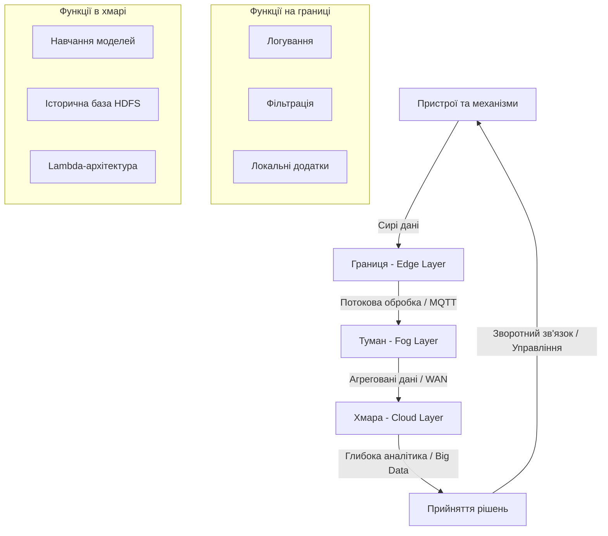
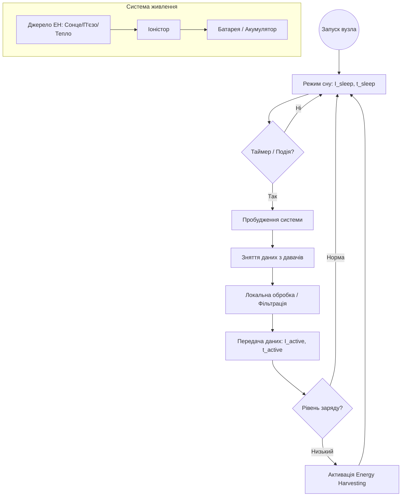
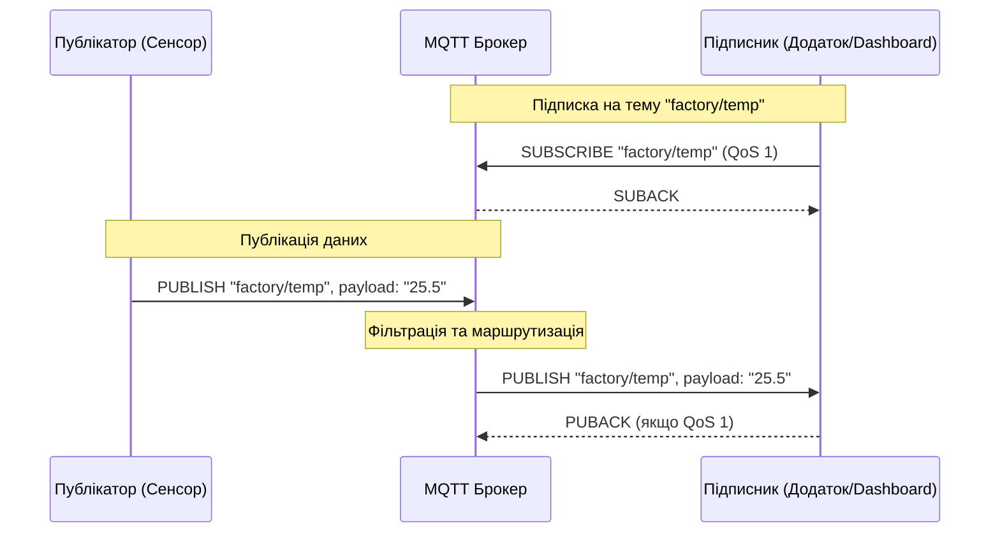

# Тема 3. Архітектура та обмін даними в КФС

## 3.1 Екосистема Інтернету речей (IoT) та архітектура IIoT

У сучасній інженерії **екосистема Інтернету речей** (Internet of Things, IoT) розглядається як фундаментальна складова кіберфізичних систем, що забезпечує інтеграцію фізичних об’єктів у цифровий простір для автоматизованого збору та обміну даними. Ця екосистема базується на принципах побудови мереж, де кожен пристрій має унікальну ідентифікацію та здатність взаємодіяти з іншими вузлами без прямої участі людини. Фундаментальними принципами побудови такої системи є її класифікація за основними ознаками, такими як дальність дії, тип енергозабезпечення та методи передачі сигналів. У контексті кіберфізичних систем особливого значення набуває рівень **Brainware** (алгоритмічне забезпечення), який перетворює "сирі" дані з сенсорів на інтелектуальні рішення для управління технологічними процесами.

**Промисловий Інтернет речей** (Industrial IoT, IIoT) є розширенням загальної концепції IoT, орієнтованим на критичну інфраструктуру та виробничі потужності, де вимоги до надійності та безпеки є значно вищими. Архітектор IIoT-системи стикається з величезним вибором технологічних рішень, оскільки на сьогодні доступно понад 1,5 мільйона різних комбінацій архітектурних параметрів: від типу давача до вибору хмарного провайдера. Ключовою бізнес-метою створення такої архітектури є не просто збір даних, а досягнення конкретних показників ефективності через зв’язування об’єктів керування в єдину мережу. Важливим аспектом архітектури є інтеграція **технології функціонування** (Operational Technology, OT) з **інформаційними технологіями** (Information Technology, IT), що дозволяє оптимізувати витрати ресурсів та прогнозувати стан обладнання.

На нижньому рівні архітектури розташовані **сенсорні пристрої** та **давачі**, які поділяються на автономні та керовані. **Автономний давач** самостійно визначає моменти передачі даних на шлюз або до сусідніх систем, тоді як керований пристрій діє за командами центрального контролера. Наступним рівнем є комунікаційна інфраструктура, яка може базуватися на IP-технологіях або специфічних не-IP протоколах, таких як Bluetooth Mesh чи LPWAN. Для забезпечення ефективного обміну даними в умовах обмежених ресурсів використовується протокол **MQTT**, який працює за моделлю "публікація/підписка" та дозволяє гнучко налаштовувати ієрархію тем (топіків).

Верхні рівні архітектури включають **хмарні**, **граничні** (Edge) та **туманні** (Fog) обчислення. Граничні обчислення дозволяють обробляти критично важливі дані безпосередньо біля джерела сигналу, що забезпечує мінімальну затримку (латентність), необхідну для систем реального часу. Туманні обчислення виступають як проміжний рівень віртуалізації, що об’єднує ресурси локальної мережі для виконання складних обчислювальних завдань. На найвищому рівні архітектури застосовуються технології **Big Data** та аналітичні пакети, що працюють у хмарах, для обробки історичних даних та виявлення прихованих закономірностей у роботі системи. Зокрема, **Lambda-архітектура** дозволяє поєднувати пакетну обробку великих обсягів даних із потоковою обробкою подій у режимі реального часу.

Для оцінки ефективності передачі даних в екосистемі IoT використовується **теорема Шеннона-Гартлі**, яка визначає максимальну пропускну здатність каналу $C$ (біт/с) залежно від смуги пропускання $W$ (Гц) та відношення сигнал/шум $S/N$:

$$
C = W \cdot \log_2\left(1 + \frac{S}{N}\right).
$$

У наведеній формулі смуга пропускання $W$ визначає частотний діапазон, у якому працює радіомодуль давача, а відношення $S/N$ відображає якість сигналу в умовах завад. Збільшення потужності сигналу або розширення смуги дозволяє підвищити швидкість передачі, проте це веде до зростання енергоспоживання пристрою.

Важливим розрахунковим показником для автономних вузлів IoT є **час життя батареї** (Battery Life), який залежить від ємності джерела живлення та середнього струму споживання. Якщо пристрій працює циклічно, середній струм споживання $I_{avg}$ розраховується як:

$$
I_{avg} = \frac{I_{active} \cdot t_{active} + I_{sleep} \cdot t_{sleep}}{t_{cycle}},
$$

де $I_{active}$ та $t_{active}$ — струм та час роботи пристрою в активному режимі (передача даних), $I_{sleep}$ та $t_{sleep}$ — показники в режимі сну, а $t_{cycle}$ — загальний період циклу. Мінімізація часу перебування в активному режимі за рахунок використання ефективних алгоритмів (Brainware) дозволяє суттєво подовжити термін експлуатації вузла.

Для оцінки затримок у сенсорних мережах розраховується **латентність**, яка в системах Edge-обчислень має бути суворо обмеженою для запобігання аварійним ситуаціям. Кількість операцій у алгоритмах обробки даних на граничних вузлах оцінюється через часову складність $O(n)$, що дозволяє визначити придатність конкретного мікроконтролера для виконання завдань аналітики.

Порівняльна характеристика основних технологій зв'язку далекої дії (LPWAN), що використовуються в екосистемі IIoT, наведена в таблиці нижче.

| Специфікація | NB-IoT (13 реліз) | LoRa/LoRaWAN | Sigfox |
| :--- | :--- | :--- | :--- |
| **Смуга пропускання** | 180 КГц | 125 КГц | 100 Гц |
| **Пікове навантаження** | до 200 Кб/с | до 50 Кб/с | до 600 б/с |
| **Дальність дії** | ~7 x Cat-1 (стільниковий) | до 15 км (пригород) | до 50 км |
| **Енергоспоживання** | Дуже низьке (~15 мкА) | Екстремально низьке | Екстремально низьке |
| **Затримка (Latency)** | 1,6 – 10 мс | 500 мс – 2 с | до 60 с |
| **Вартість вузла** | ~\$5 | ~\$15 | ~\$3 |

Також в архітектурі IIoT важливим є поділ сервісів за моделями обслуговування, що представлено у наступній класифікації.

| Модель сервісу | Опис та приналежність | Сфера відповідальності користувача |
| :--- | :--- | :--- |
| **IaaS** | Інфраструктура як сервіс. | Операційні системи, дані, додатки. |
| **PaaS** | Платформа як сервіс. | Власні розроблені додатки та дані. |
| **SaaS** | Програмне забезпечення як сервіс. | Тільки налаштування конфігурації. |

Логічна архітектура IIoT базується на багаторівневому потоці даних від фізичного об’єкта до хмарних сервісів аналітики. Схема нижче ілюструє взаємодію між основними рівнями обчислень.

Наведена модель демонструє, що **граничний рівень** бере на себе завдання первинної фільтрації та швидкого реагування, тоді як **хмарний рівень** забезпечує довгострокове зберігання та навчання складних моделей машинного навчання.

### Питання для самоперевірки

1. Чому при проектуванні IIoT-системи архітектору необхідно враховувати понад 1,5 мільйона комбінацій технологічних рішень і як це впливає на вибір апаратної платформи?
2. У чому полягає принципова різниця між автономним та керованим давачем у контексті енергозабезпечення та логіки обміну повідомленнями в мережі IoT?
3. Поясніть роль Lambda-архітектури в обробці великих даних (Big Data) для промислових систем. Які два типи обробки вона поєднує?
4. Яким чином використання Edge-обчислень допомагає зменшити латентність системи і чому це критично для забезпечення безпеки персоналу на виробництві?
5. На основі теореми Шеннона-Гартлі поясніть, чому підвищення рівня завад у радіоканалі (зменшення $S/N$) змушує архітектора обирати протоколи з меншим піковим навантаженням.

## 3.2 Сенсорні пристрої, давачі та системи їх живлення

У структурі сучасних кіберфізичних систем (КФС) сенсорний рівень виступає фундаментальною ланкою, що забезпечує отримання первинної інформації про стан фізичних об’єктів та навколишнього середовища. **Сенсорні пристрої** та **давачі** інтегруються у єдину екосистему Інтернету речей (IoT), де кожен вузол має унікальну ідентифікацію та здатність до взаємодії без прямої участі людини. У контексті промислового Інтернету речей (IIoT) архітектор системи стикається з надзвичайно широким спектром технічних рішень: на сьогодні доступно понад 1,5 мільйона комбінацій архітектурних параметрів, починаючи від вибору типу сенсора і закінчуючи методами обробки даних у хмарі. Важливо розуміти, що збір даних сам по собі не є кінцевою бізнес-метою; основне завдання полягає у досягненні конкретних показників ефективності через інтелектуальне зв’язування об’єктів керування.

За логікою функціонування сенсорні пристрої поділяються на дві великі категорії: **автономні** та **керовані**. **Автономний давач** самостійно визначає моменти передачі даних на шлюз або до сусідніх вузлів мережі, ґрунтуючись на внутрішніх алгоритмах або змінах вимірюваної величини. На противагу йому, **керований давач** діє суворо за командами центрального контролера або шлюзу. Окреме місце посідають **інтелектуальні давачі**, які мають вбудовані обчислювальні ресурси для первинної фільтрації, логування та локальної обробки сигналів безпосередньо на «границі» (Edge Layer) системи. Це дозволяє суттєво зменшити навантаження на канали зв'язку та знизити латентність системи, що є критичним для забезпечення функціональної безпеки персоналу та обладнання.

Якість сенсорного пристрою визначається набором характеристик, серед яких ключовими є **чутливість** (здатність реагувати на мінімальні зміни вхідного сигналу) та **динамічний діапазон** (діапазон значень між мінімально та максимально можливим рівнем вимірювання). Вибір апаратної платформи для сенсорного вузла завжди є компромісом між обчислювальною потужністю, вартістю та енергоефективністю, оскільки більшість таких пристроїв працює в умовах обмежених енергетичних ресурсів.

Системи живлення в КФС та IoT стикаються з низкою проблем, пов'язаних із необхідністю тривалої автономної роботи без заміни джерел енергії. Традиційні **батареї живлення** мають обмежену ємність, тому сучасні технології орієнтовані на використання систем **відновлення енергії (Energy Harvesting)**. До основних методів належать перетворення сонячної енергії за допомогою фотоелементів, використання п'єзомеханічних ефектів (перетворення енергії вібрації або натискання), термоелектричне перетворення (використання різниці температур) та збір енергії радіохвиль. Для короткочасного зберігання енергії та згладжування пікових навантажень часто використовуються **іоністори** (суперконденсатори), які витримують значно більшу кількість циклів заряду-розряду порівняно з акумуляторами. У специфічних галузях, де заміна живлення неможлива протягом десятиліть, розглядається використання радіоактивних джерел живлення.

Для забезпечення надійної роботи автономного вузла КФС критично важливим є точний розрахунок **часу життя батареї** ($T_{life}$). Цей показник залежить від ємності джерела живлення та середнього струму споживання пристрою в різних режимах роботи. Оскільки типовий IoT-пристрій більшу частину часу проводить у режимі глибокого сну і активується лише для замірів та передачі даних, середній струм споживання ($I_{avg}$) розраховується за формулою циклічного режиму:

$$
I_{avg} = \frac{I_{active} \cdot t_{active} + I_{sleep} \cdot t_{sleep}}{t_{cycle}}.
$$

У цій формулі:
*   $I_{avg}$ — середній струм споживання пристрою протягом одного повного циклу (вимірюється в амперах, А, або міліамперах, мА).
*   $I_{active}$ — струм, який споживає пристрій під час виконання активних операцій: опитування сенсорів, обробки даних процесором та радіопередачі.
*   $t_{active}$ — тривалість активної фази циклу (секунди, с).
*   $I_{sleep}$ — струм споживання в режимі енергозбереження (сну), коли активним залишається лише таймер пробудження.
*   $t_{sleep}$ — час перебування пристрою в стані сну (секунди, с).
*   $t_{cycle}$ — загальний період циклу роботи ($t_{cycle} = t_{active} + t_{sleep}$).

Знаючи середній струм та номінальну ємність батареї ($C_{bat}$), можна обчислити теоретичний термін експлуатації вузла до повної розрядки:

$$
T_{life} = \frac{C_{bat}}{I_{avg} \cdot 24 \cdot 365},
$$

де $T_{life}$ — час життя джерела живлення в роках, а $C_{bat}$ — ємність батареї (мА·год). При розрахунках слід враховувати коефіцієнт саморозряду батареї та ефективність перетворювачів напруги, що зазвичай зменшує реальний час роботи на 10-20%. Використання ефективних алгоритмів передачі даних, таких як MQTT з оптимізованими рівнями QoS, дозволяє мінімізувати $t_{active}$ і, відповідно, суттєво подовжити термін роботи вузла.

Ефективність сенсорного вузла залежить від правильного вибору методу отримання енергії з навколишнього середовища. Нижче наведено порівняльну характеристику джерел відновлюваної енергії для IoT.

| Метод відновлення енергії | Фізичний принцип | Переваги | Обмеження |
| :--- | :--- | :--- | :--- |
| **Сонячна енергія** | Фотоелектричний ефект | Висока щільність енергії на відкритому повітрі. | Залежність від часу доби та погодних умов. |
| **П'єзомеханічний** | П'єзоефект (вібрація, тиск) | Незалежність від світла, можливість вбудовування в дороги/механізми. | Потребує постійної механічної дії (руху). |
| **Термоелектричний** | Ефект Зеєбека (градієнт температур) | Відсутність рухомих частин, надійність. | Потребує значної різниці температур для ефективності. |
| **Енергія радіохвиль** | Індукція від ЕМ-полів (RF harvesting) | Можливість живлення всередині приміщень з Wi-Fi/LTE. | Дуже низька вихідна потужність, мала дальність. |

Також важливо враховувати фундаментальні характеристики, що визначають придатність давача для конкретної задачі в КФС.

| Характеристика давача | Сутність параметру | Вплив на систему |
| :--- | :--- | :--- |
| **Чутливість** | Мінімальна зміна входу для зміни виходу. | Визначає точність моніторингу процесів. |
| **Динамічний діапазон** | Відношення max сигналу до min (шуму). | Впливає на здатність працювати в різних середовищах. |
| **Час відгуку** | Швидкість реакції на фізичну зміну. | Критично для систем реального часу та Edge-обчислень. |
| **Лінійність** | Сталість коефіцієнту передачі сигналу. | Спрощує математичну обробку даних (Brainware). |

Життєвий цикл керування енергоспоживанням сенсорного вузла в кіберфізичній системі базується на балансі між накопиченням енергії та виконанням корисних дій.

Дана модель ілюструє дискретність роботи IoT-пристрою, де фаза передачі даних через радіоканал є найбільш енерговитратною. Застосування Edge-обчислень безпосередньо перед фазою передачі дозволяє відфільтрувати "інформаційне сміття" і не вмикати радіомодуль, якщо стан фізичного об'єкта не змінився, що радикально економить ресурс батареї.

### Питання для самоперевірки

1. У чому полягає принципова відмінність між автономним та керованим давачем з точки зору архітектури мережі та споживання трафіку?
2. Як використання інтелектуальних давачів на рівні Edge обчислень впливає на загальну відмовостійкість та латентність КФС?
3. Поясніть фізичний зміст параметрів $I_{active}$ та $I_{sleep}$ у формулі розрахунку середнього струму споживання. Який із цих параметрів зазвичай має більший вплив на час життя пристрою при тривалому циклі ($t_{cycle}$ > 1 год)?
4. Порівняйте використання іоністорів та традиційних акумуляторів для систем, що використовують Energy Harvesting. Які переваги надає іоністор у буферній зоні живлення?
5. На основі аналізу літератури, поясніть, чому підвищення чутливості та динамічного діапазону давача часто призводить до збільшення вимог до обчислювальних ресурсів Brainware.

## 3.3 Протоколи обміну даними: MQTT та використання веб-сокетів

У сучасному ландшафті кіберфізичних систем та промислового Інтернету речей (IIoT) вибір протоколу обміну даними є критичним архітектурним рішенням, оскільки він визначає латентність, енергоефективність та надійність зв'язку між мільйонами розподілених пристроїв. Одним із найпоширеніших стандартів для таких завдань є протокол **MQTT (Message Queuing Telemetry Transport)**, який був спеціально розроблений для роботи в умовах обмежених обчислювальних ресурсів та нестабільних каналів зв'язку. На відміну від традиційної моделі «запит-відповідь», властивої протоколу HTTP, MQTT базується на моделі **«публікація/підписка» (publish/subscribe)**, що дозволяє повністю розв'язати відправника та отримувача повідомлень у часі та просторі.

Архітектура MQTT-мережі включає два типи вузлів: **клієнти** (сенсори або виконавчі механізми) та центральний вузол — **брокер**, який виконує роль посередника, приймаючи повідомлення від публікаторів та пересилаючи їх відповідним підписникам згідно із заданими **топіками (темами)**. Топік у MQTT — це рядок у форматі UTF-8, який має ієрархічну структуру, де рівні розділені символом слешу («/»), що дозволяє створювати складні логічні дерева даних, наприклад, `місто / вулиця / квартира / температура`. Для гнучкого управління підписками протокол підтримує символи шаблонів: **однорівневий шаблон «+»**, який замінює будь-яку одну назву на поточному рівні ієрархії, та **багаторівневий шаблон «#»**, що замінює всі наступні підрівні та повинен завжди вказуватися наприкінці рядка.

Важливою перевагою MQTT є вбудована підтримка рівнів якості обслуговування (**Quality of Service, QoS**), що дозволяє розробнику гнучко налаштовувати гарантії доставки повідомлень. Рівень **QoS 0** забезпечує доставку «не більше одного разу» без підтвердження, що є найбільш енергоефективним методом, але не гарантує отримання даних. Рівень **QoS 1** гарантує доставку «принаймні один раз» через систему підтверджень, проте може призвести до дублювання повідомлень. Найбільш складним є рівень **QoS 2**, який через чотирьохетапне рукостискання забезпечує доставку «строго один раз», що критично для фінансових транзакцій або команд керування в КФС, де дублювання команди може призвести до аварії. Крім того, протокол містить механізми запобігання наслідкам розриву з'єднання, зокрема функцію **Last Will and Testament (LWT)**, яка дозволяє брокеру сповістити підписників про раптову втрату зв'язку з клієнтом.

Паралельно з MQTT у кіберфізичних системах широко використовуються **веб-сокети (WebSockets)**, які забезпечують повнодуплексний, двосторонній обмін даними між клієнтом (зазвичай веб-браузером або панеллю моніторингу) та сервером через одне стійке TCP-з'єднання. На відміну від MQTT, веб-сокети частіше застосовуються на верхніх рівнях архітектури IIoT для візуалізації станів системи в реальному часі, оскільки вони дозволяють серверу ініціювати передачу даних клієнту без необхідності постійного опитування. Це радикально знижує накладні витрати на заголовки повідомлень порівняно з HTTP та забезпечує мінімальну латентність, необхідну для динамічних інтерфейсів операторів КФС.

Ефективність передачі даних у MQTT безпосередньо залежить від структури пакета, яка складається з фіксованого заголовка, заголовка змінної довжини та корисного навантаження (**payload**). Загальна довжина пакета MQTT кодується специфічним чином у фіксованому заголовку для економії байтів. Для кодування поля «Remaining Length» використовується від одного до чотирьох байтів, де сім молодших бітів кожного байта зберігають дані, а восьмий біт є «прапорцем продовження» (continuation bit).

Якщо ми позначимо значення байтів як $B_1, B_2, B_3, B_4$, то розрахунок фактичної довжини повідомлення $L$ у байтах виконується за наступною формулою:

$$
L = \sum_{i=1}^{n} (B_i \ \& \ 127) \cdot 128^{i-1}.
$$

У наведеній формулі:
- $L$ — результуюча довжина залишкової частини пакета.
- $n$ — кількість байтів, використаних для кодування довжини (від 1 до 4).
- $B_i$ — значення $i$-го байта поля довжини.
- Операція $\& \ 127$ (побітове «І» з числом 127) дозволяє виділити 7 бітів даних, відкинувши службовий біт продовження.

Така схема кодування дозволяє MQTT передавати повідомлення довжиною до 256 МБ, витрачаючи при цьому мінімальну кількість байтів для коротких повідомлень, що є типовим для сенсорних мереж. Часова складність обробки таких пакетів на мікроконтролерах сенсорних вузлів є лінійною $O(n)$, що підтверджує придатність протоколу для систем реального часу.

Порівняльна характеристика рівнів якості обслуговування (QoS) у протоколі MQTT представлена у наступній таблиці.

| Рівень QoS | Назва гарантії | Механізм підтвердження | Вплив на ресурси (енергія/трафік) | Типове застосування |
| :--- | :--- | :--- | :--- | :--- |
| **QoS 0** | Не більше одного разу (At most once). | Відсутнє. | Мінімальний, найвища швидкість. | Передача телеметрії, де втрата окремих точок не є критичною. |
| **QoS 1** | Принаймні один раз (At least once). | PUBACK (підтвердження публікації). | Середній, можливе дублювання пакетів. | Важливі статуси станів, де факт доставки є пріоритетним. |
| **QoS 2** | Строго один раз (Exactly once). | Чотири фази: PUBREC, PUBREL, PUBCOMP. | Максимальний, найбільша затримка. | Команди управління виконавчим механізмом, фінансові операції. |

Вибір ієрархії топіків також потребує структурування для забезпечення масштабованості системи КФС.

| Елемент шаблону | Символ | Опис дії | Приклад використання |
| :--- | :--- | :--- | :--- |
| **Однорівневий** | `+` | Замінює точно один рівень ієрархії. | `sensor/+/temp` (всі температурні датчики всіх пристроїв). |
| **Багаторівневий** | `#` | Замінює всі рівні від поточної позиції до кінця. | `factory/shop1/#` (всі дані з усіх пристроїв першого цеху). |
| **Роздільник** | `/` | Розділяє логічні рівні ієрархії тем. | `home/livingroom/light` (чітка адресація пристрою). |

Взаємодія між компонентами MQTT-мережі за моделлю «публікація/підписка» ілюструє логіку децентралізованого обміну повідомленнями.

Наведена діаграма демонструє, що **публікатор** не знає про існування **підписника**, що дозволяє легко додавати нові вузли до кіберфізичної системи без переналаштування існуючих компонентів. **Брокер** виступає інтелектуальним фільтром, який забезпечує доставку даних лише тим споживачам, які виявили зацікавленість у конкретній темі.

### Питання для самоперевірки

1. Чому використання моделі «публікація/підписка» в протоколі MQTT є більш виправданим для великих сенсорних мереж порівняно з моделлю «клієнт-сервер», що використовується в HTTP?
2. Яким чином вибір рівня QoS 2 впливає на час життя батареї автономного давача в мережі IoT та чому цей рівень рідко використовується для передачі періодичної телеметрії?
3. Поясніть алгоритм розрахунку поля довжини повідомлення у фіксованому заголовку MQTT. Яку максимальну довжину корисного навантаження можна закодувати за допомогою чотирьох байтів?
4. У чому полягає функціональна різниця між використанням символів «+» та «#» при формуванні підписки на топіки і які обмеження накладаються на позицію символу «#» у рядку?
5. Опишіть переваги веб-сокетів над традиційним HTTP-опитуванням (polling) у контексті побудови диспетчерських пультів моніторингу КФС реального часу.
