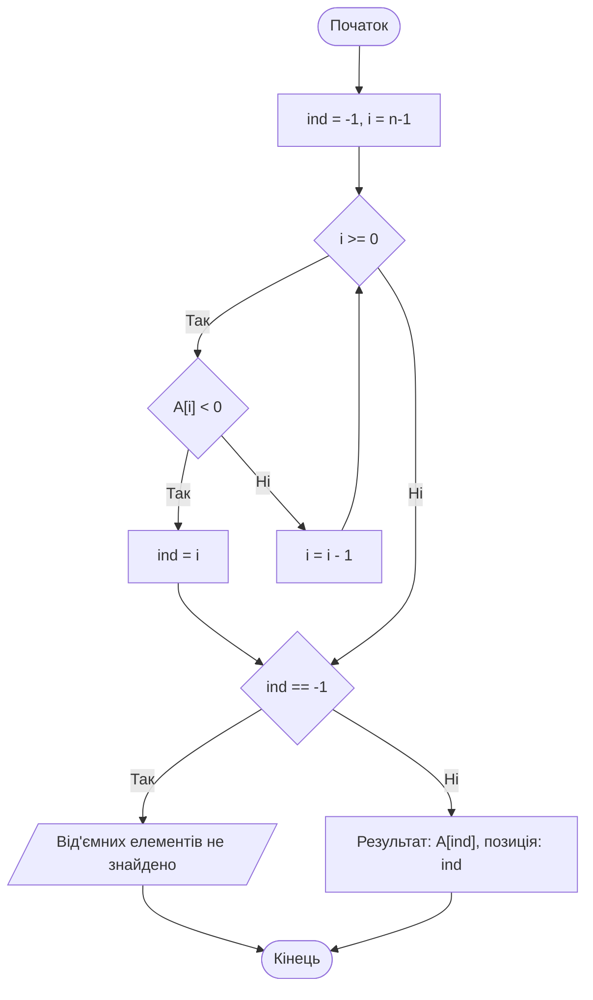
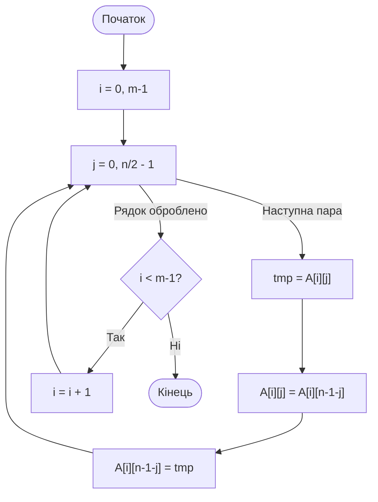
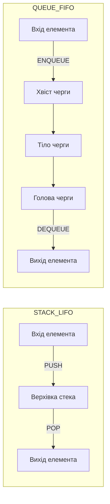

# Тема 4. Алгоритми обробки структурованих даних

## 4.1 Опрацювання одновимірних масивів (векторів) та двовимірних матриць

У сучасній алгоритмізації та програмуванні **масив** визначається як іменована послідовність областей пам’яті, що містять однотипні елементи, розташовані в пам'яті комп'ютера безпосередньо один за одним. Така структура даних є статичною, що означає фіксацію кількості елементів та обсягу виділеної пам’яті на етапі оголошення програми. Основними характеристиками масиву є його **вимір**, який визначає кількість індексів для доступу до елемента (одновимірні, двовимірні тощо), та **розмірність**, що задає кількість елементів у кожному вимірі. 

**Одновимірні масиви**, часто звані **векторами**, потребують лише одного індексу для ідентифікації конкретного значення. Опрацювання векторів зазвичай ґрунтується на циклічних алгоритмах, де параметр циклу виступає в ролі індексу. Базовими задачами при роботі з векторами є обчислення суми або добутку елементів. При знаходженні суми змінна-акумулятор обов'язково ініціалізується нульовим значенням, тоді як для накопичення добутку початкове значення має дорівнювати одиниці. Окрему групу складають алгоритми пошуку елементів за певними ознаками: пошук мінімального/максимального значення або знаходження елементів з абсолютними характеристиками (додатних, від’ємних чи нульових). Для фіксації результату пошуку професійною практикою вважається використання змінної типу **індекс-прапорець**, яка зберігає індекс знайденого елемента або спеціальне значення (наприклад, -1), якщо елемент відсутній у масиві.

**Двовимірні масиви**, або **матриці**, являють собою сукупність елементів, доступ до яких здійснюється за допомогою двох індексів: номера рядка та номера стовпчика. У пам’яті комп'ютера матриця зазвичай розгортається у лінійну послідовність, де елементи розташовані рядок за рядком. Ключовим поняттям при роботі з матрицями є **обхід матриці** — послідовне звертання до кожного її елемента для виконання певної дії. Прості способи обходу включають прохід по рядках або по стовпчиках, що реалізується за допомогою вкладених циклів. Більш складні, «декоративні» способи, такі як обхід **«змійкою»**, **«спіралью»** або по діагоналях, використовуються для специфічних задач, наприклад, у графічній обробці даних.

Для **квадратних матриць** (де кількість рядків дорівнює кількості стовпчиків) особливе значення мають **головна діагональ**, елементи якої мають однакові індекси рядка та стовпчика, та **побічна діагональ**, що проходить від верхнього правого до нижнього лівого кута. Алгоритми перетворення матриць охоплюють симетричні («дзеркальні») відображення відносно осей симетрії чи діагоналей, а також повороти частин матриці навколо її центру на кути, кратні 90 градусам. Такі перетворення вимагають чіткого математичного зв’язку між індексами вихідних та цільових комірок пам’яті.

При оцінюванні складності алгоритмів опрацювання масивів використовується поняття **часової складності** $T(n)$, яка визначає залежність кількості операцій від розмірності вхідних даних. Для повного перебору елементів вектора довжиною $n$ часова складність є лінійною:

$$
T(n) = O(n),
$$

де $n$ — кількість елементів у векторі. Для двовимірної матриці розміром $m \times n$ складність повного обходу стає квадратичною (якщо $m=n$):

$$
T(n) = O(n^2),
$$

оскільки кожен елемент у кожному рядку має бути оброблений.

При виконанні перестановок елементів (наприклад, при дзеркальному відображенні вектора) використовується допоміжна комірка пам'яті для тимчасового зберігання значення. Розрахункова формула для індексу симетричного елемента у векторі $A[n]$ при відображенні виглядає наступним чином:

$$
j = (n - 1) - i,
$$

де $i$ — поточний індекс елемента від початку масиву, а $j$ — індекс елемента, з яким необхідно виконати обмін.

Для квадратних матриць порядку $n$ математичні властивості діагоналей визначають логіку доступу до елементів $A[i][j]$ наступним чином:
1. Елементи головної діагоналі задовольняють умові: $i = j$.
2. Елементи побічної діагоналі задовольняють умові: $i + j = n - 1$.
3. Елементи вище головної діагоналі характеризуються нерівністю: $i < j$.

Порівняльна характеристика основних методів обходу та опрацювання матриць наведена в таблиці нижче.

| Спосіб обходу / Дія | Особливості реалізації | Сфера застосування |
| :--- | :--- | :--- |
| **По рядках / стовпчиках** | Найпростіші вкладені цикли з послідовною ітерацією індексів. | Стандартна обробка даних, обчислення сум, пошук. |
| **«Змійкою»** | Зміна напрямку проходу в кожному наступному рядку/стовпчику. | Специфічні алгоритми візуалізації, сортування. |
| **По «спіралі»** | Чотири фази руху (вправо, вниз, вліво, вгору) зі звуженням меж. | Криптографія, стиснення зображень, матричні ігри. |
| **Дзеркальне відображення** | Обмін елементів відносно осі симетрії з проходом лише половини масиву. | Обробка зображень, матрична алгебра. |
| **Транспонування** | Обмін елементів $A[i][j]$ та $A[j][i]$ відносно головної діагоналі. | Розв'язання систем лінійних рівнянь, зміна орієнтації даних. |

Логіка алгоритму пошуку останнього від’ємного елемента у векторі (ефективний варіант з проходом від кінця до початку) представлена на схемі нижче. Такий підхід дозволяє припинити виконання циклу одразу після знаходження першого підходящого елемента, що є оптимальним для систем реального часу.

Ця модель демонструє використання **індекс-прапорця** `ind` для фіксації результату та властивість детермінованості алгоритму.

### Питання для самоперевірки

1. Чому при розробці ефективного алгоритму пошуку *останнього* від’ємного елемента вектора рекомендується починати обхід з індексу $n-1$, а не з $0$?
2. Яким чином використання «бар’єра» в алгоритмах лінійного пошуку дозволяє зменшити кількість операцій порівняння в заголовку циклу?
3. Поясніть, які математичні умови накладаються на індекси $i$ та $j$ для ідентифікації елементів, що знаходяться суворо *нижче* побічної діагоналі квадратної матриці.
4. У чому полягає відмінність між фізичним розташуванням матриці в пам’яті комп’ютера та її логічним представленням у вигляді таблиці?
5. Опишіть алгоритмічну логіку повороту квадратної матриці на 180 градусів: які саме індексні перетворення мають відбутися для кожного елемента?

## 4.2 Способи обходу матриць (змійка, спіраль) та симетричні перетворення

У процесі розробки прикладних алгоритмів для роботи з двовимірними масивами ключовим поняттям є **обхід матриці**, що визначається як послідовне звернення до кожного її елемента для виконання певних операцій, таких як обчислення, порівняння або модифікація значень. Традиційно способи обходу поділяють на прості та «декоративні». До простих методів відносять прохід по рядках або по стовпчиках, де внутрішній стан індексів змінюється лінійно. Однак для специфічних задач, наприклад, у графічній обробці даних або при створенні візуальних ефектів, застосовуються складніші стратегії, такі як обхід **«змійкою»** та **«спіралью»**.

Обхід матриці **«змійкою»** за рядками передбачає, що в кожному наступному рядку напрямок проходу змінюється на протилежний (зліва направо в парних рядках і справа наліво в непарних, або навпаки). Виділяють чотири варіанти такої «змійки» по рядках та чотири варіанти по стовпчиках. Більш складним є обхід «змійкою» по діагоналях, який має вісім різних модифікацій залежно від початкової точки та першого напрямку руху. Ці алгоритми вимагають ретельного керування індексами $i$ та $j$, щоб забезпечити правильний перехід між суміжними діагоналями.

Обхід матриці **«спіралью»** характеризується рухом по периметрах вкладених прямокутників, що утворюють структуру матриці. Розрізняють два основних типи спіралі: **ззовні всередину** (від країв до центру) та **зсередини назовні** (від центру до країв). Кожен із цих типів має по вісім варіантів реалізації залежно від напрямку руху (за годинниковою стрілкою чи проти) та початкового кута. Алгоритми спірального обходу зазвичай реалізуються через зміну чотирьох меж (верхньої, нижньої, лівої та правої), які поступово звужуються або розширюються.

Окрему групу операцій становлять **симетричні («дзеркальні») перетворення**, які дозволяють змінити логічну структуру матриці шляхом перестановки елементів відносно певних осей. **Вертикальна вісь симетрії** проходить через середину рядків, і перетворення відносно неї міняє місцями ліві та праві частини матриці. **Горизонтальна вісь симетрії** розділяє матрицю на верхню та нижню частини. Для квадратних матриць критично важливими є перетворення відносно **головної діагоналі** (відоме як **транспонування**) та відносно **побічної діагоналі**. Крім того, виділяють відображення відносно **центру симетрії**, що еквівалентно повороту матриці на $180^\circ$. Повороти на $90^\circ$ ліворуч або праворуч є складнішими, оскільки вимагають не просто обміну елементів, а циклічного переміщення значень між чотирма квадрантами матриці.

Для виконання симетричних перетворень необхідно встановити математичний зв'язок між індексами вихідного елемента $A[i][j]$ та цільового елемента $A[i^*][j^*]$. У матриці розміром $m \times n$ (де $m$ — кількість рядків, а $n$ — кількість стовпчиків) застосовуються наступні залежності:

1.  **Симетричне відображення відносно вертикальної осі симетрії:**
    
$$
j^* = (n - 1) - j, \quad i^* = i.
$$

    У наведеній формулі індекс рядка $i$ залишається незмінним, а індекс стовпчика $j$ трансформується таким чином, що перший елемент стає останнім, а другий — передостаннім у межах того ж рядка.

2.  **Симетричне відображення відносно горизонтальної осі симетрії:**
    
$$
i^* = (m - 1) - i, \quad j^* = j.
$$

    Тут незмінним залишається індекс стовпчика $j$, тоді як індекси рядків відображаються дзеркально відносно середини висоти матриці.

3.  **Транспонування квадратної матриці порядку $n$ (відображення відносно головної діагоналі):**
    
$$
i^* = j, \quad j^* = i.
$$

    Це перетворення передбачає взаємний обмін місцями індексів рядка та стовпчика. Важливо, що операція виконується лише для елементів, де $i < j$ (вище діагоналі) або $i > j$ (нижче діагоналі), щоб уникнути подвійного обміну, який повернув би елементи на вихідні позиції.

4.  **Відображення відносно побічної діагоналі квадратної матриці:**
    
$$
i^* = (n - 1) - j, \quad j^* = (n - 1) - i.
$$

    Дана формула описує складне перетворення, де новий індекс рядка залежить від старого індексу стовпчика, а новий індекс стовпчика — від старого індексу рядка, з врахуванням розмірності матриці $n$.

5.  **Поворот матриці на $180^\circ$ (відображення відносно центру симетрії):**
    
$$
i^* = (m - 1) - i, \quad j^* = (n - 1) - j.
$$

    Це перетворення поєднує в собі вертикальне та горизонтальне дзеркальне відображення. Для реалізації такого алгоритму «на тому ж місці» необхідно обійти лише половину елементів матриці (наприклад, $i < m/2$), щоб не виконати повторний обмін.

Порівняльна характеристика типів симетрії в матрицях та умов їх застосування представлена у таблиці нижче.

| Тип симетрії / Вісь | Математична умова для $A[i][j]$ | Область обміну елементів | Примітка |
| :--- | :--- | :--- | :--- |
| **Вертикальна** | $j \leftrightarrow (n-1)-j$ | $i \in [0, m-1], j \in [0, n/2)$ | Обмін у кожному рядку. |
| **Горизонтальна** | $i \leftrightarrow (m-1)-i$ | $i \in [0, m/2), j \in [0, n-1]$ | Обмін у кожному стовпчику. |
| **Головна діагональ** | $i \leftrightarrow j, j \leftrightarrow i$ | $i \in [0, n-1], j \in (i, n-1]$ | Тільки для квадратних матриць. |
| **Побічна діагональ** | $i \leftrightarrow (n-1)-j, \dots$ | $i \in [0, n-2], j \in [0, n-2-i]$ | Тільки для квадратних матриць. |
| **Центральна ($180^\circ$)** | $i, j \leftrightarrow (m-1)-i, (n-1)-j$ | Половина загальної кількості елементів | Еквівалентно подвійному віддзеркаленню. |

Варіанти «декоративних» способів обходу матриць згідно з класифікацією джерела:

| Спосіб обходу | Кількість варіантів | Характер траєкторії | Сфера застосування |
| :--- | :--- | :--- | :--- |
| **«Змійка» по рядках** | 4 | Горизонтальні зигзаги | Специфічне сканування даних. |
| **«Змійка» по стовпчиках** | 4 | Вертикальні зигзаги | Обробка сигналів, сортування. |
| **«Змійка» по діагоналях** | 8 | Нахилені зигзаги | Стиснення зображень (напр. JPEG). |
| **«Спіраль» (ззовні/зсередини)** | 16 (8+8) | Концентричні прямокутники | Матричні ігри, криптографія. |

Логіка виконання симетричного відображення матриці відносно вертикальної осі «на тому ж місці» (з використанням однієї додаткової комірки пам'яті $tmp$) може бути представлена наступним алгоритмом.

Ця схема ілюструє важливу особливість: внутрішній цикл по $j$ виконується лише до середини рядка ($n/2$), що забезпечує коректність дзеркального відображення без повернення елементів у початковий стан. У випадку «декоративних» обходів (наприклад, змійки) блок-схема містила б умовний оператор для перевірки парності індексу $i$ для вибору напрямку руху індексу $j$ (зростання або спадання).

### Питання для самоперевірки

1. Чому при реалізації алгоритму транспонування квадратної матриці важливо обходити тільки елементи, що знаходяться вище (або нижче) головної діагоналі? Який результат буде отримано при повному обході матриці ($i \in [0, n-1], j \in [0, n-1]$)?
2. Опишіть траєкторію обходу матриці «змійкою» по рядках. Як змінюється напрямок руху індексу $j$ при переході від нульового до першого рядка?
3. Яка математична залежність описує симетричне відображення елемента квадратної матриці $A[i][j]$ відносно її центру симетрії (поворот на $180^\circ$)? Чим це перетворення відрізняється від горизонтального відображення?
4. Скільки всього існує варіантів обходу матриці «спіралью» зсередини назовні згідно з матеріалами посібника? Назвіть чинники, що визначають ці варіанти.
5. Поясніть логіку використання чотирьох змінних-меж при побудові алгоритму обходу матриці по спіралі ззовні всередину. Яка з меж змінюється після завершення проходу вздовж верхнього ряду?

## 4.3 Лінійні структури: стек, черга, пріоритетна черга

У фундаментальній теорії алгоритмів та структур даних особливе місце посідають лінійні структури, які забезпечують впорядковане зберігання та доступ до елементів інформації. **Стек** (stack) визначається як динамічна структура даних, побудована на принципі «останнім прийшов — першим пішов», що в міжнародній термінології позначається абревіатурою **LIFO** (Last-In, First-Out). Характерною особливістю стека є те, що всі операції — як додавання нового елемента, так і видалення існуючого — здійснюються лише з одного кінця структури, який називається **верхівкою стека** (top). Наочною фізичною аналогією стека є стопка книжок: для того, щоб дістати книгу, яка знаходиться всередині або знизу, необхідно послідовно прибрати всі книжки, що лежать над нею, оскільки безпосередній доступ можливий лише до верхнього елемента. У системному програмуванні стек є незамінним для реалізації механізму рекурсивних викликів функцій, обробки переривань та аналізу збалансованості дужкових послідовностей у математичних виразах.

На відміну від стека, **черга** (queue) базується на протилежному логічному принципі — «першим прийшов — першим пішов», або **FIFO** (First-In, First-Out). У цій структурі додавання нових елементів відбувається в один кінець, який зазвичай називають хвостом або тилом (rear), а видалення — з іншого кінця, відомого як голова черги (head). Такий підхід моделює поведінку реальних черг у повсякденному житті, де обслуговування здійснюється в порядку надходження запитів. Різновидом черги є **дек** (deque — double-ended queue), або черга з двома кінцями, що дозволяє виконувати операції додавання та видалення з обох боків структури, поєднуючи в собі властивості і стека, і звичайної черги.

Окрему інтелектуальну категорію становить **пріоритетна черга** (priority queue). У цій структурі порядок обслуговування елементів визначається не лише часом їхнього потрапляння в систему, а й пов'язаним із кожним елементом числовим значенням — **пріоритетом**. Під час вилучення елемента з пріоритетної черги система завжди обирає той об'єкт, який має найвищий пріоритет (або найменше значення пріоритету, залежно від реалізації). Хоча таку чергу можна змоделювати на основі звичайного впорядкованого масиву або списку, найбільш ефективною формою її реалізації для роботи з великими обсягами даних є структура **двійкової купи** (binary heap), яка забезпечує високу продуктивність операцій.

Ефективність лінійних структур даних оцінюється через показник асимптотичної складності операцій. Для базових структур, таких як стек та проста черга, час виконання основних операцій (додавання та видалення) не залежить від кількості елементів у структурі $n$. Це означає, що часова складність цих операцій є константною:

$$
T(n) = O(1).
$$

У наведеній формулі $T(n)$ позначає функцію часу виконання відносно розмірності входу $n$. Стала складність $O(1)$ свідчить про те, що доступ до верхівки стека або голови черги здійснюється за один крок, незалежно від того, наскільки великим є обсяг даних.

Однак для пріоритетної черги ситуація змінюється. Якщо вона реалізована на основі двійкової купи, то операції вставки нового елемента та видалення елемента з найвищим пріоритетом вимагають перебудови дерева (процедури «просіювання» вгору або вниз). Математично час виконання таких операцій має логарифмічну залежність від загальної кількості елементів $n$ у черзі:

$$
T(n) = O(\log_2 n).
$$

Це означає, що при збільшенні кількості елементів у черзі в 1024 рази, час виконання операції зросте лише приблизно в 10 разів (оскільки $\log_2 1024 = 10$), що робить таку структуру надзвичайно масштабованою для систем реального часу та алгоритмів на графах, таких як алгоритм Дейкстри.

Для системного порівняння лінійних структур доцільно розглянути їхні ключові характеристики в межах єдиної класифікації.

| Характеристика | Стек (Stack) | Черга (Queue) | Пріоритетна черга |
| :--- | :--- | :--- | :--- |
| **Логічний принцип** | **LIFO** (останнім прийшов — першим пішов) | **FIFO** (першим прийшов — першим пішов) | За значенням пріоритету елемента |
| **Точки доступу** | Тільки верхівка (один кінець) | Голова (видалення) та хвіст (додавання) | Видалення — найвищий пріоритет, вставка — у хвіст купи |
| **Складність операцій** | $O(1)$ для всіх операцій | $O(1)$ для всіх операцій | $O(\log n)$ (при використанні купи) |
| **Типові застосування** | Рекурсія, обробка виразів, відміна дій (Undo) | Буферизація, планування завдань ОС | Планування процесів, алгоритми на графах |

Логіку функціонування стека та черги можна представити через послідовні фази зміни стану структур під час виконання операцій. Нижче наведено схему життєвого циклу елементів у цих структурах.

### Питання для самоперевірки

1. Поясніть сутність принципу LIFO на прикладі стопки книг. Чому доступ до нижньої книги вимагає виконання послідовності операцій видалення?
2. У чому полягає фундаментальна відмінність між чергою (FIFO) та деком (double-ended queue) з точки зору можливих точок модифікації структури?
3. Чому використання двійкової купи для реалізації пріоритетної черги є більш ефективним, ніж використання звичайного несортованого масиву, якщо ми оцінюємо складність операції видалення елемента?
4. Яке значення має показник часової складності $O(1)$ для операцій зі стеком у контексті розробки високонавантажених обчислювальних систем?
5. Наведіть приклад завдання, для розв'язання якого обов'язково потрібен стек, і поясніть, як саме він там використовується (наприклад, при перевірці збалансованості дужок).
