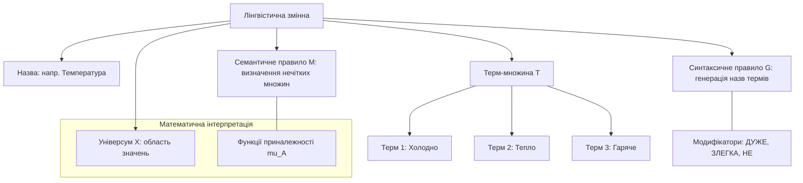
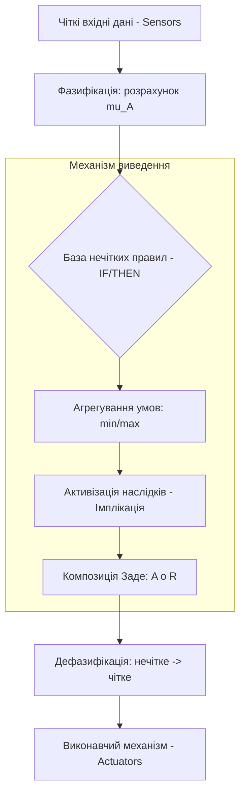
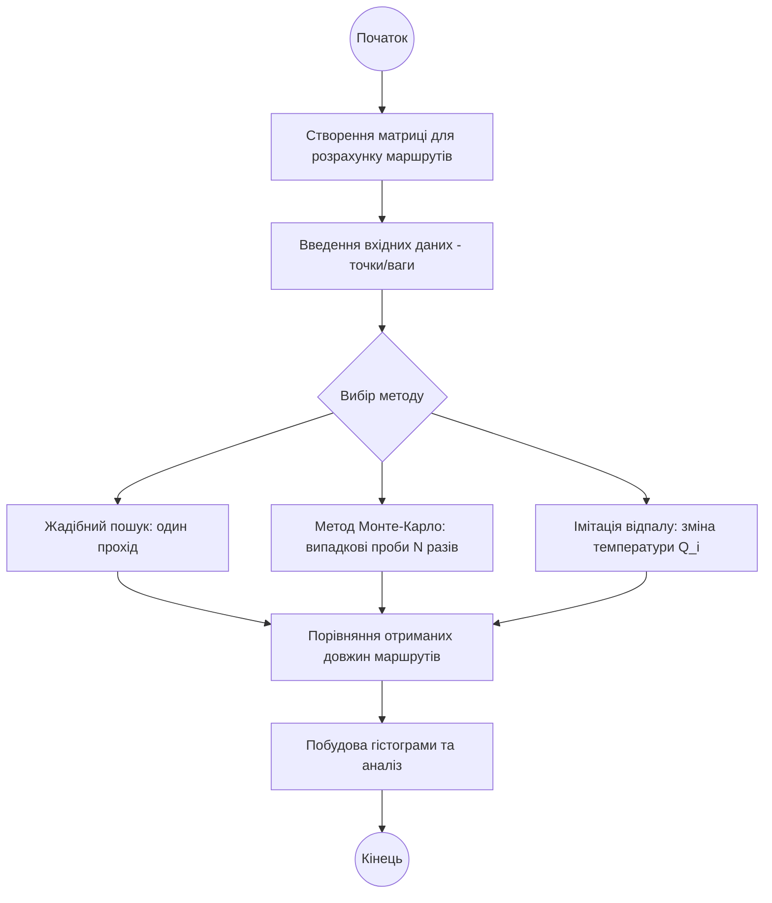

# Тема 5. Нечітка логіка та евристики в КФС

## 5.1 Поняття нечітких множин, лінгвістичні змінні та функції приналежності

У проектуванні складних кіберфізичних систем (КФС) виникає необхідність формалізації знань про прикладні проблемні області, які часто є погано структурованими та містять невизначеність. Традиційна математична логіка, що базується на бінарних значеннях «істина» або «хибність», не завжди здатна адекватно описати реальні фізичні процеси та людські міркування. Концепція **нечітких множин** (fuzzy sets) є фундаментальним узагальненням класичної канторовської теорії множин, де перехід від приналежності елемента до множини до його неприналежності здійснюється не стрибкоподібно, а плавно. Це дозволяє обробляти інформацію, подану природною мовою, що є критично важливим для інтелектуального рівня **Brainware** у сучасних КФС.

**Нечітка множина** визначається як сукупність пар, що складаються з елемента універсальної множини та відповідного йому ступеня приналежності. На відміну від чіткої множини, де характеристична функція може приймати лише значення 0 або 1, у нечітких множинах вводиться **функція приналежності** $\mu_A(x)$, значення якої лежать у неперервному інтервалі від $[0, 1]$. Якщо значення функції дорівнює одиниці, елемент безумовно належить множині, якщо нулю — безумовно не належить, а проміжні значення вказують на ступінь схожості або часткової відповідності. Важливою характеристикою нечіткої множини є її **носій** (support) — підмножина елементів, для яких ступінь приналежності є суворо більшим за нуль. Також виділяють **ядро** нечіткої множини, яке утворюють елементи з максимальним ступенем приналежності, що дорівнює одиниці.

Для опису якісних характеристик об'єктів у системах управління КФС використовується поняття **лінгвістичної змінної**. Лінгвістична змінна — це змінна, значеннями якої є не числа, а слова або речення природної чи штучної мови, що називаються **термами**. Наприклад, для фізичного параметра «температура» термами можуть бути «холодно», «тепло» та «гаряче». Кожен такий терм математично описується певною нечіткою множиною через власну функцію приналежності. Структура лінгвістичної змінної включає назву, терм-множину (набір значень), універсум (область визначення), а також синтаксичні правила для генерації нових термів за допомогою модифікаторів (наприклад, «дуже», «злегка») та семантичні правила для визначення змісту цих термів.

Побудова коректної функції приналежності є ключовим етапом алгоритмізації нечіткої логіки. Існує декілька методів їх формування, серед яких найбільш поширеними є метод статистичної обробки експертної інформації та метод парних порівнянь. Статистичний метод базується на опитуванні групи експертів, де ступінь приналежності елемента до нечіткої множини визначається як відношення кількості позитивних відповідей до загальної кількості експертів. Метод парних порівнянь Сааті використовує матриці переваг, де експерти порівнюють елементи між собою за ступенем вираженості певної властивості, що дозволяє отримати більш точні ваги приналежності через розрахунок власних векторів матриці.

Графічне представлення функцій приналежності наочно ілюструє логіку нечіткого висновку. На графіку по осі абсцис відкладаються фізичні значення (наприклад, зріст у сантиметрах), а по осі ординат — значення $\mu \in [0, 1]$. Опис графіка показує три криві: «низький», «середній» та «високий», які перетинаються між собою. Це означає, що одне й те саме числове значення (наприклад, 175 см) може одночасно належати до множини «середній» зі ступенем 1.0 та до множини «низький» зі ступенем 0.0, або до множини «середній» та «високий» з різними ненульовими ступенями, що відображає природну розмитість понять.

Для кількісного оцінювання степеня приналежності елемента $u_i$ до лінгвістичного терму $l_j$ на основі думок експертів використовується формула статистичної ймовірності:

$$
\mu_{l_j}(u_i) = \frac{1}{K} \sum_{k=1}^{K} b_{j,i}^k
$$

У наведеній математичній залежності використовуються такі змінні:
*   $\mu_{l_j}(u_i)$ — розрахований ступінь приналежності елемента $u_i$ до нечіткої множини, що відповідає терму $l_j$.
*   $K$ — загальна кількість експертів, що брали участь в опитуванні.
*   $b_{j,i}^k$ — бінарна оцінка $k$-го експерта щодо наявності у елемента $u_i$ властивостей нечіткої множини $l_j$. Значення $1$ вказує на наявність властивості, $0$ — на її відсутність.
*   $u_i$ — конкретний елемент з універсальної множини $U$.

Для нормалізації нечіткої множини, яка за результатами опитування або розрахунків виявилася субнормальною (тобто максимальне значення приналежності менше за одиницю), застосовується операція ділення всіх ступенів приналежності на максимальне отримане значення:

$$
\mu_{norm}(u_i) = \frac{\mu_{sub}(u_i)}{\max(\mu_{sub})}
$$

Де $\mu_{norm}(u_i)$ — нормалізоване значення приналежності, а $\mu_{sub}(u_i)$ — вихідне значення ступеня приналежності для кожного елемента. Ця процедура забезпечує наявність у множині хоча б одного елемента з повним ступенем приналежності, що спрощує подальше нечітке логічне виведення у КФС.

Результати обробки експертних оцінок для лінгвістичної змінної «зріст чоловіка» (на основі матеріалів прикладу 10.3) представлені у таблиці нижче. Дані демонструють перехід від фізичних діапазонів до абстрактних ступенів приналежності.

| Лінгвістичний терм | Діапазон [160, 165) | Діапазон [170, 175) | Діапазон [175, 180) | Діапазон [185, 190) | Діапазон [195, 200) |
| :--- | :---: | :---: | :---: | :---: | :---: |
| **«Низький» (степінь $\mu$)** | 1.0 | 0.6 | 0.0 | 0.0 | 0.0 |
| **«Середній» (степінь $\mu$)** | 0.0 | 0.8 | 1.0 | 0.4 | 0.0 |
| **«Високий» (степінь $\mu$)** | 0.0 | 0.0 | 0.2 | 0.8 | 1.0 |

Порівняння властивостей класичних та нечітких множин у контексті алгоритмізації наведено у наступній класифікації.

| Характеристика | Класична множина (Кантора) | Нечітка множина (Заде) |
| :--- | :--- | :--- |
| **Значення приналежності** | Дискретне {0, 1}. | Неперервне. |
| **Межі множини** | Суворо визначені, різкі. | Розмиті, плавні переходи. |
| **Формалізація** | Предикати першого порядку. | Лінгвістичні змінні та терми. |
| **Логічні операції** | Булева алгебра (AND, OR, NOT). | Нечіткі операції (min, max, інверсія). |
| **Сфера застосування** | Чіткі математичні доведення. | Системи штучного інтелекту, КФС. |

Структура лінгвістичної змінної як складного об'єкта, що поєднує мовні поняття з математичними моделями, представлена на діаграмі нижче.

Наведена схема ілюструє ієрархічну побудову інтелектуального аналізу даних у КФС: від визначення фізичного параметра до формування набору термів, що мають чітко задану математичну семантику через функції приналежності.

### Питання для самоперевірки

1. Поясніть концептуальну різницю між характеристичною функцією класичної множини та функцією приналежності нечіткої множини. Як це впливає на визначення меж множин?
2. Опишіть компоненти лінгвістичної змінної згідно з визначенням Лотфі Заде. Яку роль відіграють синтаксичні та семантичні правила у її формуванні?
3. У чому полягає сутність статистичного методу побудови функцій приналежності? Яким чином думки експертів трансформуються у числові значення ступенів приналежності?
4. Дайте визначення поняттям «носій», «ядро» та «$\alpha$-рівень» нечіткої множини. Як ці характеристики використовуються для аналізу нечітких даних?
5. Поясніть процедуру нормалізації субнормальної нечіткої множини. Чому наявність хоча б одного елемента зі ступенем приналежності $1.0$ є важливою для нечіткої логіки?

## 5.2 Нечітке логічне виведення та правила прийняття рішень

У сучасному проектуванні інтелектуальних систем управління, зокрема кіберфізичних систем, виникає гостра потреба у методах, які б дозволяли комп’ютеру приймати рішення в умовах невизначеності та неповноти вхідної інформації. Одним із найбільш ефективних способів реалізації таких процесів є **нечітке логічне виведення**, яке базується на апараті нечіткої логіки та теорії нечітких множин. На відміну від класичних детермінованих алгоритмів, де умови є суворо бінарними («так» або «ні»), нечітке виведення дозволяє оперувати поняттями природної мови, що робить поведінку системи більш гнучкою та наближеною до людського мислення.

Фундаментальною основою нечіткого виведення є перехід від чітких числових значень, отриманих від сенсорів, до абстрактних понять, що описуються через **лінгвістичні змінні**. Кожна така змінна характеризується набором значень (терм-множиною), де кожен терм математично представлений своєю функцією приналежності. Процес прийняття рішення в такій системі реалізується через систему **нечітких правил**, які зазвичай мають структуру «ЯКЩО умова, ТО наслідок». Наприклад, у системі клімат-контролю правило може виглядати так: «ЯКЩО температура Висока, ТО потужність охолодження Велика».

Ключовим теоретичним положенням у цій галузі є **композиційне правило виведення Заде**. Воно стверджує: якщо відоме нечітке відношення між вхідною та вихідною змінними, то при наявності нечіткого значення вхідної змінної можна однозначно визначити нечітке значення виходу за допомогою операції максимінної композиції. У практичних задачах часто використовується розширена форма умовного висловлювання: «ЯКЩО $x$ є $A$, ТО $y$ є $B$, ІНАКШЕ $y$ є $C$». Такий підхід дозволяє створювати складні логічні дерева, де брокер знань або контролер аналізує одночасно декілька правил, що спрацьовують з різним ступенем істинності.

Процес нечіткого виведення складається з декількох послідовних етапів. Спочатку виконується фазифікація, під час якої чіткі вхідні дані трансформуються у ступені приналежності до відповідних термів. Далі за допомогою логічних зв'язок (кон'юнкція, диз'юнкція) обчислюється рівень істинності передумов кожного правила. Наступний етап — активізація наслідків, де за допомогою методів нечіткої імплікації формуються вихідні нечіткі множини. Завершується процес дефазифікацією, яка перетворює отриманий нечіткий результат у конкретну керуючу дію або числове значення. Це забезпечує цілісність архітектури **Brainware**, де високорівнева логіка безпосередньо впливає на фізичні компоненти системи.

Математична інтерпретація нечіткого виведення базується на операціях над функціями приналежності. Для визначення ступеня приналежності пари елементів до нечіткого відношення (наприклад, при формуванні бази правил) використовується операція мінімуму:

$$
\mu_{<a_i; b_j>} = \min(\mu_a, \mu_{b_j})
$$

У наведеній формулі змінна $\mu_a$ позначає ступінь приналежності входу до множини $A$, а $\mu_{b_j}$ — ступінь приналежності виходу до множини $B$. Результат $\mu_{<a_i; b_j>}$ визначає силу зв'язку між конкретними значеннями входу та виходу в рамках одного логічного правила.

Для обчислення результату виведення $\tilde{D}$ за композиційним правилом Заде використовується вираз:

$$
y = \tilde{A} \circ R
$$

де $\tilde{A}$ — нечітке значення вхідної змінної, а $R$ — нечітке відношення, що описує правило «ЯКЩО-ТО». Оператор $\circ$ позначає **максимінну композицію**, яка вибирає максимальне значення серед мінімальних попарних приналежностей.

Окрему увагу приділяють правилам, що переводять умовне висловлювання у нечітке відношення. Одне з таких правил для імплікації $\mu_A(u) \to \mu_B(v)$ описується кусочно-заданою функцією:

$$
\mu_A(u) \to \mu_B(v) = 
\begin{cases} 
1, & \text{якщо } \mu_A \le \mu_B \\
\mu_B, & \text{якщо } \mu_A > \mu_B 
\end{cases}
$$

Ця залежність (відома як імплікація Геделя) гарантує, що якщо умова правила виконується меншою мірою, ніж очікуваний наслідок, то правило вважається повністю істинним ($1$). Якщо ж ступінь виконання умови перевищує ступінь наслідку, істинність правила обмежується значенням $\mu_B$.

Логіка прийняття рішень у системах із нечітким виведенням вимагає чіткої класифікації типів правил та способів їх поєднання. У таблиці нижче наведено порівняння основних структур правил.

| Тип логічної конструкції | Формальний запис (псевдокод) | Сфера застосування |
| :--- | :--- | :--- |
| **Проста імплікація** | IF $x$ is $A$ THEN $y$ is $B$ | Базові ланки управління КФС. |
| **Альтернативна імплікація** | IF $x$ is $A$ THEN $y$ is $B$ ELSE $y$ is $C$ | Системи з чітким поділом на нормальні та аварійні режими. |
| **Складна умова (AND)** | IF $x_1$ is $A_1$ AND $x_2$ is $A_2$ THEN $y$ is $B$ | Багатофакторний аналіз (напр. температура + вологість). |
| **Складна умова (OR)** | IF $x_1$ is $A_1$ OR $x_2$ is $A_2$ THEN $y$ is $B$ | Резервування каналів отримання даних. |

Також важливо враховувати відмінності між нечітким виведенням та ймовірнісними методами, які часто плутають у проектуванні.

| Критерій порівняння | Нечітка логіка (Fuzzy Logic) | Теорія ймовірностей |
| :--- | :--- | :--- |
| **Природа невизначеності** | Розмитість значень понять (термів). | Випадковість настання події. |
| **Значення** | Ступінь приналежності $\mu \in [0, 1]$. | Ймовірність події $P \in$. |
| **Сума значень** | Не обов'язково дорівнює 1. | Сума ймовірностей повної групи завжди 1. |
| **Застосування** | Моделювання знань експерта. | Статистичний аналіз масивів даних. |

Цикл нечіткого логічного виведення від моменту отримання даних до формування керуючої дії можна представити у вигляді наступної моделі.

Описана модель ілюструє покрокову трансформацію інформації. На стадії **агрегування** система з'єднує декілька умов за допомогою нечітких операцій, а стадія **композиції** забезпечує отримання результуючої нечіткої множини, яка потім перетворюється у фізичний сигнал на етапі **дефазифікації**.

### Питання для самоперевірки

1. Чому нечітке логічне виведення вважається більш ефективним для кіберфізичних систем, ніж класична булева логіка, при описі процесів, що задані природною мовою?
2. Поясніть фізичний та математичний зміст операції максимінної композиції у правилі Заде. Як вона пов'язує вхідне нечітке значення з результатом виведення?
3. Опишіть умови істинністі правила «ЯКЩО-ТО» згідно з імплікацією Геделя, наведеною в математичному апараті. Що відбувається, коли ступінь приналежності входу перевищує ступінь приналежності виходу?
4. У чому полягає роль семантичного правила $M$ у структурі лінгвістичної змінної в контексті підготовки даних для логічного виведення?
5. Яким чином використання нечітких відношень $R$ дозволяє об'єднувати знання декількох експертів у єдину базу правил прийняття рішень?

## 5.3 Евристичні алгоритми: жадібний пошук, метод Монте-Карло та імітація відпалу

У теорії алгоритмів існує значний клас задач, для яких пошук точного розв'язку за допомогою детермінованих методів потребує надмірних обчислювальних ресурсів або часу, що перевищує життєвий цикл системи. Для вирішення таких проблем, особливо тих, що відносяться до класів складності **NP** та **NP-повних**, застосовуються **евристичні алгоритми**. Евристичний алгоритм — це наближений метод розв'язання задачі, який не гарантує знаходження глобального оптимуму, проте забезпечує отримання прийнятного результату за осяжний час. Основний акцент у таких підходах робиться на балансі між швидкістю виконання та якістю отриманого рішення.

**Жадібний пошук** (Greedy Search) базується на принципі прийняття локально оптимального рішення на кожному окремому кроці з надією, що послідовність таких кроків приведе до глобально оптимального результату. У процесі роботи цей алгоритм ніколи не повертається назад для перегляду вже прийнятих рішень, що робить його надзвичайно швидким, проте схильним до потрапляння в локальні екстремуми, які значно гірші за загальний мінімум або максимум цільової функції. Типовим прикладом застосування жадібного підходу є побудова початкового маршруту в задачах комівояжера, де на кожному етапі обирається найближче невідвідане місто.

**Метод Монте-Карло** являє собою групу евристичних методів, що ґрунтуються на використанні випадкових величин та статистичного моделювання. Сутність методу полягає у багаторазовому генерації випадкових станів системи (проб) та виборі найкращого результату серед усіх отриманих варіантів. Цей метод демонструє високу ефективність в умовах обмеженої пам’яті та дозволяє аналізувати складні обчислювальні простори, де аналітичний опис є неможливим. При розрахунку маршрутів метод Монте-Карло дозволяє за велику кількість ітерацій (наприклад, від 10 000 до 50 000) знайти статистично виправдане наближення до оптимального шляху.

**Алгоритм імітації відпалу** (Simulated Annealing) відноситься до класу метаевристичних методів та використовує фізичну метафору процесу охолодження металу для досягнення кристалічної структури з мінімальною енергією. На відміну від жадібного пошуку, імітація відпалу дозволяє системі приймати «гірші» рішення на початкових етапах з певною ймовірністю, що дає можливість вийти з локальних ям. Ця ймовірність поступово зменшується відповідно до закону спадання «температури», що врешті-решт приводить систему до стійкого стану, близького до глобального оптимуму.

Логіка переходу в алгоритмі імітації відпалу описується ймовірнісною функцією, яка визначає, чи буде прийнято новий стан системи, якщо він є гіршим за поточний. Математична модель переходу структури до рівноважного стану має наступний вигляд:

$$
P(x^* \to x_{i+1} | x_i) = \begin{cases} 1, & F(x^*) - F(x_i) \geq 0 \\ \exp\left(-\frac{F(x^*) - F(x_i)}{Q_i}\right), & F(x^*) - F(x_i) < 0 \end{cases}
$$

У наведеній математичній залежності використовуються такі змінні:
- $P$ — ймовірність переходу з поточного стану $x_i$ до наступного стану $x_{i+1}$.
- $x^*$ — обрана випадковим чином точка в просторі пошуку (кандидат на наступний стан).
- $x_i$ — поточна точка на маршруті або поточний стан системи.
- $F(x)$ — значення цільової функції (наприклад, довжина маршруту), яку необхідно мінімізувати або максимізувати.
- $Q_i$ — параметр, що позначає «температуру» на $i$-му кроці, який є елементом довільної спадаючої послідовності, що сходиться до нуля.

Дана формула демонструє, що при великих значеннях $Q_i$ (на початку алгоритму) ймовірність прийняття гіршого рішення є високою, що забезпечує активне дослідження всього простору станів. Зі зменшенням $Q_i$ алгоритм стає все більш схожим на жадібний пошук, концентруючись на локальному уточненні результату.

Ефективність розглянутих евристичних методів залежить від розмірності вхідних даних та кількості ітерацій. Порівняльна характеристика методів наведена в таблиці нижче на основі лабораторних досліджень.

| Характеристика | Жадібний пошук | Метод Монте-Карло | Імітація відпалу |
| :--- | :--- | :--- | :--- |
| **Принцип вибору** | Локальний оптимум (найкраще зараз). | Випадковий перебір станів. | Ймовірнісний перехід (метафора відпалу). |
| **Ризик локального оптимуму** | Дуже високий (завжди застрягає). | Низький (залежить від кількості проб). | Мінімальний (має механізм виходу). |
| **Швидкість виконання** | Миттєво (один прохід). | Залежить від кількості ітерацій $N$. | Середня/Низька (потребує охолодження). |
| **Точність результату** | Низька (приблизна). | Статистична (покращується з часом). | Висока (найближча до оптимуму). |
| **Кількість ітерацій** | Фіксована (1). | Велика (10 000 – 50 000). | Визначена графіком охолодження. |

Послідовність застосування евристичних методів для розрахунку оптимальних маршрутів у кіберфізичних системах та теорії алгоритмів передбачає створення матриці та ітераційну обробку даних.

Описана схема ілюструє логіку лабораторного дослідження, де результати різних евристик порівнюються для визначення найбільш ефективного підходу для конкретної структури даних.

### Питання для самоперевірки

1. Чому евристичні алгоритми вважаються наближеними методами і за яких умов розробник має надати їм перевагу перед точними методами повного перебору?
2. Поясніть сутність «жадібної» стратегії. Яка головна вада цього підходу при роботі зі складними ландшафтами цільових функцій?
3. Яким чином метод Монте-Карло використовує статистичну ймовірність для знаходження наближеного розв'язку задачі комівояжера?
4. Опишіть фізичний зміст параметра «температури» $Q_i$ в алгоритмі імітації відпалу та його вплив на ймовірність прийняття рішення, що погіршує поточний стан.
5. На основі формули ймовірності переходу поясніть, чому на фінальних стадіях (коли $Q_i$ наближається до нуля) алгоритм імітації відпалу починає поводитися як жадібний пошук.
