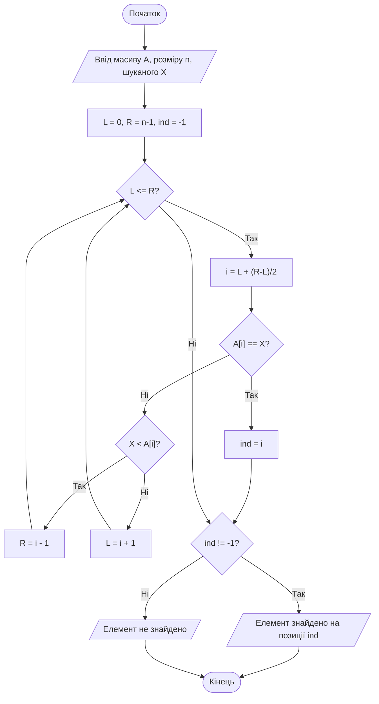
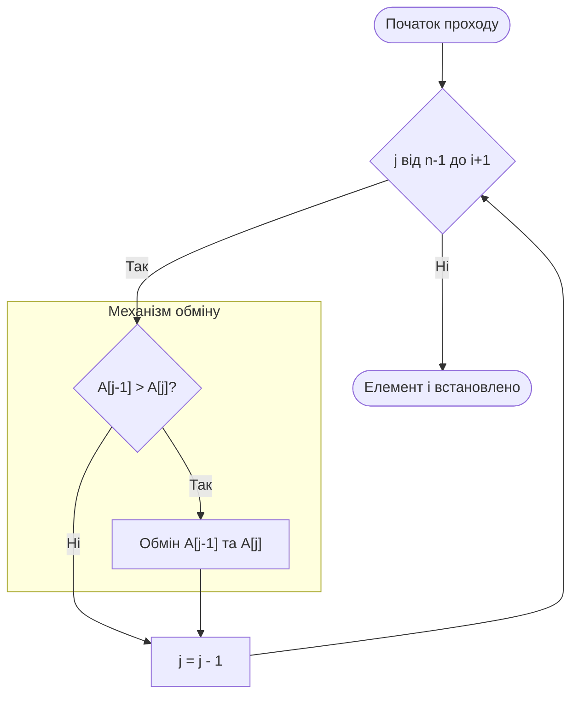
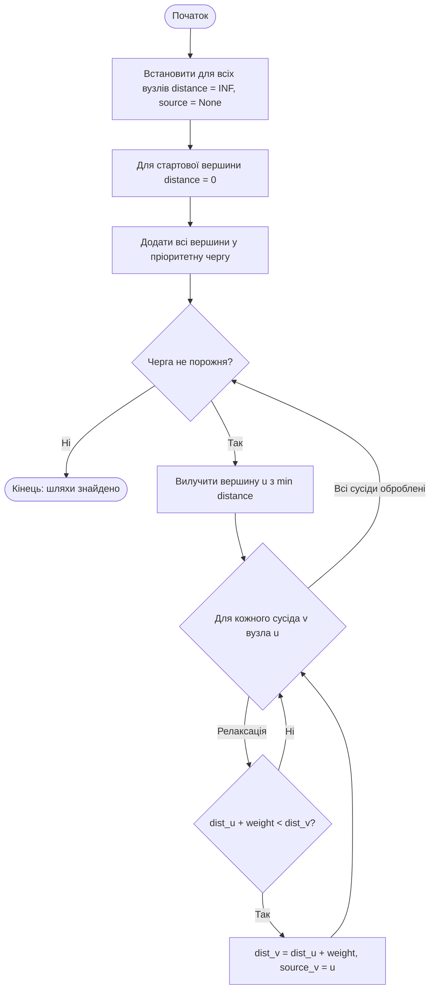

# Тема 6. Пошук, сортування та графи в мережах КФС

## 6.1 Алгоритми пошуку (лінійний, бінарний) та їх часова складність

У теорії алгоритмів та структурованої обробки даних у мережах кіберфізичних систем (КФС) **загальна задача пошуку** визначається як процес встановлення факту присутності та точного місцезнаходження заданого елемента $X$ у певній сукупності елементів. Залежно від наявності додаткової інформації про взаємозв'язки між даними (наприклад, їхньої впорядкованості), виділяють два основні підходи до вирішення цієї задачі. У випадку, коли будь-яка апріорна інформація про структуру даних відсутня, єдиним можливим розв’язком є **лінійний (послідовний) пошук**, який базується на послідовному переборі всіх елементів масиву та їх порівнянні з шуканим еталоном. Якщо ж дані в КФС-мережі попередньо впорядковані (наприклад, за зростанням або спаданням), стає можливим застосування значно ефективнішого **двійкового (бінарного) пошуку**, що суттєво скорочує час доступу до інформації в умовах обмежених ресурсів.

**Лінійний пошук** у своїй класичній реалізації за допомогою циклу з передумовою спирається на дві умови закінчення: або елемент $X$ знайдено ($A[i] = X$), або всі елементи сукупності вже перебрані, але збігу не виявлено. Важливим аспектом проектування таких алгоритмів для КФС є врахування схеми обчислення булевих виразів компілятором. При використанні **короткої схеми обчислення** вираз у заголовку циклу `(i < n) && (A[i] != X)` працює коректно, оскільки при досягненні межі масиву ($i = n$) перша частина виразу стає хибною, і звернення до пам’яті за межами масиву ($A[i]$) не відбувається. Для підвищення швидкодії систем реального часу використовується алгоритмічний прийом **бар'єра**, при якому в кінець масиву додається фіктивний елемент, що дорівнює шуканому $X$. Це дозволяє виключити перевірку індексу ($i < n$) з тіла циклу, оскільки гарантує, що елемент обов'язково буде знайдений (принаймні в позиції бар’єра), що скорочує кількість операцій порівняння в заголовку вдвічі.

**Двійковий (бінарний) пошук** реалізує стратегію «розділяй і володарюй», постійно ділячи область пошуку навпіл. Алгоритм порівнює шуканий елемент із середнім значенням поточного діапазону. Якщо значення збігаються, пошук успішно завершено. Якщо $X$ менше середнього, подальший пошук триває в лівій половині, якщо більше — у правій. У посібниках виділяють дві модифікації бінарного пошуку: **Алгоритм 1**, який знаходить випадковий елемент серед тих, що дорівнюють шуканому, та **Алгоритм 2**, що гарантовано знаходить «найлівіший» (перший) елемент у групі дублікатів. Особливу увагу слід приділяти формулі обчислення середнього індексу. Хоча математично вирази $(L+R)/2$ та $L+(R-L)/2$ еквівалентні, у практичному програмуванні другий варіант є пріоритетним, оскільки він запобігає можливому арифметичному переповненню при роботі з великими масивами даних, де сума $L+R$ може перевищити максимальне значення цілого типу.

Ефективність алгоритмів пошуку оцінюється через їхню **часову складність** $T(n)$, яка описує залежність максимальної кількості операцій від розмірності вхідних даних $n$. 

Для **лінійного пошуку** часова складність є лінійною функцією:

$$
T(n) = O(n)
$$

де $n$ позначає кількість елементів у масиві. У найгіршому випадку, коли елемент відсутній або знаходиться в самому кінці, алгоритм виконує $n$ порівнянь.

Для **двійкового пошуку** часова складність має логарифмічний характер:

$$
T(n) = O(\log_2 n)
$$

Ця залежність випливає з того, що на кожному кроці область пошуку зменшується вдвічі. Максимальна кількість порівнянь $K_c^{max}$ для масиву довжиною $n$ розраховується як $K_c^{max} = \lfloor \log_2(n+1) \rfloor$. 

Порівняння ефективності цих підходів при зростанні обсягу даних наведено нижче (з розрахунку 1 нс на операцію):
- При $n = 1024$ ($1K$): лінійний пошук потребує близько $1,02$ мкс, тоді як бінарний — лише $10$ нс.
- При $n = 1,048,576$ ($1024K$): лінійний пошук триватиме понад $1,05$ мс, а бінарний — всього $20$ нс.

Розрахунок індексу середнього елемента $i$ у бінарному пошуку для запобігання переповненню:

$$
i = L + \left\lfloor \frac{R - L}{2} \right\rfloor
$$

де $L$ — ліва межа поточного діапазону, а $R$ — права межа.

Порівняльна характеристика алгоритмів пошуку за ключовими критеріями ефективності наведена в таблиці.

| Характеристика | Лінійний пошук | Лінійний пошук з бар'єром | Бінарний пошук |
| :--- | :--- | :--- | :--- |
| **Вимоги до даних** | Немає (довільний порядок) | Немає + 1 вільна комірка | **Обов'язкова впорядкованість** |
| **Складність $T(n)$** | $O(n)$ | $O(n)$ | **$O(\log_2 n)$** |
| **Кількість порівнянь** | $2n$ (включаючи межу масиву) | **$n+1$** (економія на межі) | $\log_2(n+1)$ |
| **Типове застосування** | Малі масиви, динамічні дані | Оптимізація послідовного пошуку | Великі статичні бази даних |
| **Режим реального часу** | Низька прогнозованість | Середня | **Найвища (стабільний час)** |

Класифікація результатів бінарного пошуку залежно від напрямку та виходу з циклу:

| Умова циклу та виходу | Результат при дублюванні значень |
| :--- | :--- |
| Цикл з виходом при знаходженні | Знаходить **випадковий** елемент із рівних. |
| Цикл без виходу (Алгоритм 2) | Знаходить **найлівіший** елемент із рівних. |

Логіка роботи бінарного пошуку (Алгоритм 1) з виходом при знаходженні елемента представлена нижче. Модель ілюструє ітераційне звуження меж $L$ та $R$.

Ця схема демонструє перевагу бінарного методу: з кожною ітерацією кількість потенційних кандидатів зменшується вдвічі, що забезпечує логарифмічну швидкість збіжності алгоритму.

### Питання для самоперевірки

1. Поясніть, чому для великих обсягів даних у мережах КФС логарифмічна часова складність $O(\log_2 n)$ є критично важливою порівняно з лінійною $O(n)$.
2. Яким чином використання «бар’єра» в лінійному пошуку дозволяє скоротити кількість машинних інструкцій у циклі, і які вимоги це накладає на розмір масиву?
3. У чому полягає небезпека використання простої формули $(L+R)/2$ для знаходження середини в бінарному пошуку при роботі з критичними системами?
4. Чим відрізняється поведінка Алгоритму 1 та Алгоритму 2 бінарного пошуку у випадку, якщо шуканий елемент зустрічається в масиві декілька разів?
5. Опишіть умови, за яких лінійний пошук може виявитися доцільнішим за бінарний, незважаючи на гіршу асимптотичну складність.

## 6.2 Методи сортування: вставки, вибору, обміну (бульбашка), швидке сортування

У теорії алгоритмів та структур даних **сортування** визначається як процес переупорядкування заданої сукупності елементів у певній послідовності відповідно до значень їхніх ключів. Залежно від обсягу даних та способу їхнього збереження, методи сортування поділяють на внутрішні (виконуються в оперативній пам'яті) та зовнішні (використовуються для великих масивів на дискових носіях). У межах внутрішнього сортування особливу цінність мають алгоритми, що працюють **«на тому ж місці» (in-place)**, оскільки вони не потребують значних обсягів додаткової пам'яті, крім декількох допоміжних комірок для виконання операцій обміну. Класифікація цих методів базується на логіці вибору, вставки або обміну елементів.

**Сортування прямим обміном**, більш відоме як **бульбашкове сортування (Bubble sort)**, базується на принципі послідовного порівняння та, за необхідності, взаємної перестановки сусідніх елементів масиву. Під час кожного проходу алгоритм «проштовхує» найбільший (або найменший) елемент невідсортованої частини у відповідний кінець структури, подібно до того, як бульбашка повітря піднімається на поверхню води. Посібники виділяють кілька модифікацій цього методу для підвищення його ефективності: використання **прапорця (flag)** для дострокової зупинки при відсутності перестановок, запам'ятовування місця останнього обміну та двостороннє **Шейкерне сортування**, що змінює напрямок проходу на кожній ітерації.

**Сортування прямим вибором (Selection sort)** реалізує стратегію пошуку екстремального значення. На кожному кроці алгоритм знаходить мінімальний елемент у залишку масиву та міняє його місцями з першим елементом цієї невідсортованої частини. Хоча кількість операцій порівняння у цьому методі залишається сталою для будь-якого вхідного стану, кількість фактичних перестановок є значно меншою порівняно з бульбашковим методом, що робить його ефективнішим у випадках, коли операції запису в пам'ять є дорогими.

**Сортування прямою вставкою (Insertion sort)** нагадує процес упорядкування карт у руках гравця: елементи послідовно вилучаються з вихідної структури та вставляються у вже відсортовану частину на свої коректні позиції. Зазвичай виділяють чотири основні варіанти реалізації вставки: з лінійним пошуком місця зліва або справа, з використанням **бар’єра** для виключення перевірки межі масиву, та найбільш досконалий варіант — із **двійковим (бінарним) пошуком** місця вставки, що суттєво прискорює процес пошуку впорядкованої позиції.

**Швидке сортування (Quick sort)**, розроблене Тоні Хоаром, базується на концепції **декомпозиції** або методі «розділяй і володарюй». Алгоритм обирає опорний елемент (півот), після чого розбиває масив на дві підмножини: елементи, менші за півот, та елементи, більші або рівні йому. Процес рекурсивно повторюється для кожної підмножини доти, доки розмір частин не стане тривіальним (один елемент). Цей метод вважається одним із найшвидших у середньому випадку, оскільки він мінімізує кількість переміщень даних на великі відстані.

Ефективність сортування оцінюється через часову складність $T(n)$, яка залежить від кількості порівнянь та обмінів. Для алгоритмів прямого вибору, вставки та обміну часова складність у найгіршому випадку має квадратичний характер:

$$
T(n) = O(n^2)
$$

де $n$ — загальна кількість елементів у масиві. Наприклад, при $n = 1024K$ (понад мільйон елементів) виконання такого алгоритму може тривати близько 18.3 хвилин, якщо одна операція займає 1 нс.

Для **швидкого сортування** часова складність у середньому та найкращому випадках є значно меншою і описується логарифмічною залежністю:

$$
T(n) = O(n \log_2 n)
$$

Цей показник радикально впливає на швидкість обробки великих даних: для того ж обсягу в $1024K$ елементів час виконання складе лише близько 21 мс. Однак слід пам'ятати, що у найгіршому випадку (при вкрай невдалому виборі півота на впорядкованих даних) швидке сортування може деградувати до $O(n^2)$.

Загальна кількість операцій $K$ при виконанні ітераційних методів обчислюється як сума операцій ініціалізації, ітерацій циклів та порівнянь:

$$
K = K_{init} + \sum_{i=1}^{n} (K_{compare} + K_{swap})
$$

Для методу вставки з бінарним пошуком кількість порівнянь для пошуку позиції $i$-го елемента зменшується з $O(i)$ до $O(\log_2 i)$.

Порівняльна характеристика розглянутих методів сортування за ключовими показниками асимптотичної складності та стабільності наведена у таблиці нижче.

| Метод сортування | Складність (найкраща) | Складність (найгірша) | Стабільність (стійкість) | Особливість реалізації |
| :--- | :--- | :--- | :--- | :--- |
| **Бульбашка (Обмін)** | $O(n)$ (з прапорцем) | $O(n^2)$ | Стійке | Прості перестановки сусідів. |
| **Вибір (Selection)** | $O(n^2)$ | $O(n^2)$ | Нестійке | Мінімум переміщень даних. |
| **Вставка (Insertion)** | $O(n)$ | $O(n^2)$ | Стійке | Ефективне на малих масивах. |
| **Швидке (Quick sort)** | $O(n \log n)$ | $O(n^2)$ | Нестійке | Використовує рекурсію та півот. |

Під **стійкістю (стабільністю)** сортування розуміють здатність алгоритму зберігати відносний порядок елементів із однаковими ключами.

Логіку виконання однієї ітерації бульбашкового сортування (прохід «бульбашки» знизу вгору) можна представити у вигляді наступної діаграми дій.

Ця модель ілюструє дискретний крок алгоритму, де на кожній ітерації внутрішнього циклу один елемент гарантовано займає своє фінальне місце у відсортованій частині. Для швидкого сортування така схема включала б фазу розділення масиву відносно опорного елемента.

### Питання для самоперевірки

1. Поясніть сутність принципу «бульбашки» при сортуванні обміном. Яким чином використання прапорця (булевої змінної) дозволяє оптимізувати цей процес для вже впорядкованих масивів?
2. Чому сортування вибором вважається кращим за бульбашкове у випадках, коли елементи масиву є складними структурами великого обсягу, хоча асимптотична складність обох методів однакова?
3. Опишіть переваги використання двійкового пошуку замість лінійного при визначенні місця вставки в алгоритмі сортування вставками. Як це впливає на загальну кількість порівнянь?
4. Яку роль відіграє «опорний елемент» (півот) у методі швидкого сортування і як невдалий вибір цього елемента може призвести до деградації швидкодії до $O(n^2)$?
5. На основі розрахункових даних часової складності порівняйте прогнозований час сортування масиву розміром 50 000 елементів методами вставки та швидкого сортування (за умови 1 нс на операцію).

## 6.3 Алгоритми на графах: пошук найкоротшого шляху (Дейкстра, А*)

У фундаментальній теорії алгоритмів **графи** розглядаються як універсальна математична модель, що призначена для зображення сукупності об’єктів та існуючих зв’язків між ними. У контексті розробки сучасного програмного забезпечення велика кількість структур, що мають практичну цінність — від систем автомобільних доріг та схем метрополітену до комунікаційних вузлів в мережі Інтернет — представляються саме у вигляді графів. Особливого значення в таких мережах набуває задача відшукання **найкоротшого шляху**, яка в навантажених (зважених) графах полягає у значенні такого ланцюга ребер між двома вершинами, сумарна вага яких є мінімальною.

**Алгоритм Дейкстри** є класичним методом розв’язання задачі пошуку найкоротшого шляху від однієї фіксованої вершини до всіх інших вершин у зваженому графі з невід’ємними вагами ребер. Його логіка базується на "жадібній" стратегії, де на кожному кроці обирається вершина з мінімальною поточною оцінкою відстані, яка ще не була оброблена. Для технічної реалізації цього процесу використовується спеціалізований клас вершин (наприклад, `VertexForAlgorithms`), який містить додаткові атрибути: **відстань** (`mDistance`), що ініціалізується умовним значенням нескінченності, та **джерело** (`mSource`), яке вказує на попередню вершину в оптимальному шляху. Процес завершується, коли всі доступні вершини стають відвіданими, а їхні навантаження відображають фактичну мінімальну відстань від стартової точки.

**Алгоритм А*** (A-star) є інтелектуальним розширенням методу Дейкстри, орієнтованим на пошук шляху до конкретної цільової вершини. На відміну від звичайного пошуку, який рівномірно розширює зону дослідження, А* використовує **евристичну функцію**, яка допомагає алгоритму "вгадувати", у якому напрямку знаходиться мета. Це дозволяє суттєво скоротити кількість переглянутих вершин, що особливо критично для систем реального часу та ігрових симуляцій. Обидва алгоритми спираються на однакову технічну базу збереження інформації про стан вузлів, проте А* потребує додаткового розрахунку пріоритету на основі поєднання пройденої відстані та оцінки залишку шляху.

При проектуванні таких систем важливо враховувати спосіб представлення графа в пам'яті. Використання **матриці суміжності** є ефективним для задач, де кількість сусідів для кожної вершини є значною, проте для розріджених мереж (де кількість ребер набагато менша за квадрат кількості вершин) такий підхід може призвести до нераціонального використання ресурсів. Ефективність пошуку також прямо залежить від обраної структури даних для черги вершин: використання **пріоритетної черги** на основі двійкової купи забезпечує виконання операцій за логарифмічний час, що робить алгоритм масштабованим для великих обсягів даних.

Математична логіка оновлення оцінок у алгоритмах пошуку найкоротшого шляху базується на процедурі **релаксації ребра**. Якщо ми позначимо поточну відстань до вершини $u$ як $d(u)$, а вагу ребра між вершинами $u$ та $v$ як $w(u, v)$, то нова оцінка відстані до вершини $v$ розраховується за формулою:

$$
d(v) = \min(d(v), d(u) + w(u, v))
$$

У цій залежності змінна $d(v)$ позначає найкоротшу відому відстань від старту до вузла $v$ на поточному етапі. Якщо сума відстані до вершини $u$ та ваги переходу $(u, v)$ є меншою за вже зафіксовану в $v$, значення $d(v)$ оновлюється, а $u$ записується як нове джерело (`mSource`) для вузла $v$.

Асимптотична складність алгоритму Дейкстри при використанні пріоритетної черги визначається кількістю вершин $V$ та ребер $E$ і описується виразом:

$$
T = O(E \cdot \log V)
$$

У цій формулі операція $\log V$ відображає складність процедур "просіювання" елементів у двійковій купі під час додавання або вилучення вузла з найвищим пріоритетом.

Для алгоритму А* функція вартості вузла $f(n)$ поєднує реальні витрати та прогноз:

$$
f(n) = g(n) + h(n)
$$

Де:
- $g(n)$ — фактична вартість шляху від стартової вершини до поточної вершини $n$.
- $h(n)$ — евристична оцінка вартості найкоротшого шляху від вершини $n$ до мети (наприклад, евклідова відстань).

Порівняльна характеристика алгоритмів пошуку найкоротшого шляху на графах наведена в таблиці нижче на основі аналізу теоретичних матеріалів.

| Критерій порівняння | Алгоритм Дейкстри | Алгоритм А* | Алгоритм Беллмана-Форда |
| :--- | :--- | :--- | :--- |
| **Тип пошуку** | Рівномірний (від однієї до всіх). | Направлений (евристичний). | Універсальний (від однієї до всіх). |
| **Обмеження по вагах** | Тільки невід’ємні ваги. | Тільки невід’ємні ваги. | Допускає від’ємні ваги. |
| **Часова складність** | $O(E \log V)$ (з купою). | Залежить від евристики. | $O(V \cdot E)$. |
| **Використання пам'яті** | Зберігає відстані до всіх вузлів. | Потребує менше вузлів у черзі. | Ітераційне оновлення всього графа. |
| **Основна перевага** | Гарантована оптимальність. | Висока швидкість до мети. | Робота з від’ємними циклами. |

Технічні атрибути вершини для реалізації цих алгоритмів згідно з об'єктно-орієнтованою моделлю:

| Назва атрибута | Математичний зміст | Початкове значення | Призначення в алгоритмі |
| :--- | :--- | :--- | :--- |
| **mDistance** | Оцінка найкоротшого шляху. | $INF$ (нескінченність) | Зберігання накопиченої ваги переходу. |
| **mSource** | Батьківська вершина. | $None$ (невизначено) | Відновлення шляху у зворотному порядку. |
| **mKey** | Ідентифікатор вузла. | Ціле число / рядок | Унікальне ім'я вершини в графі. |

Життєвий цикл алгоритму Дейкстри, що забезпечує ітераційне оновлення навантажень у вершинах, представлений наступною моделлю.

Ця модель ілюструє дискретний крок вибору вершини з мінімальним навантаженням та подальшу перевірку умови релаксації для всіх її суміжних вузлів. На графіку це виглядає як хвиля, що розповсюджується від джерела, поступово уточнюючи значення у віддалених частинах графа.

### Питання для самоперевірки

1. Поясніть роль "нескінченності" ($INF$) при ініціалізації вершин перед початком роботи алгоритму Дейкстри. Як це значення впливає на першу операцію релаксації?
2. Чому використання пріоритетної черги на основі двійкової купи критично впливає на часову складність алгоритму при роботі з графами, що мають тисячі вершин?
3. У чому полягає принципова різниця в поведінці алгоритму Дейкстри та алгоритму А* при пошуку шляху до конкретної цілі в умовах великого графа?
4. Яким чином за допомогою значень атрибутів `mSource` (джерело) можна відновити повний ланцюжок вершин найкоротшого шляху після завершення розрахунків?
5. Проаналізуйте обмеження алгоритму Дейкстри: чому він може працювати некоректно у графах, де існують ребра з від’ємною вагою?
