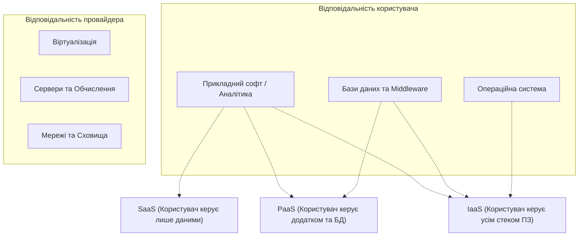
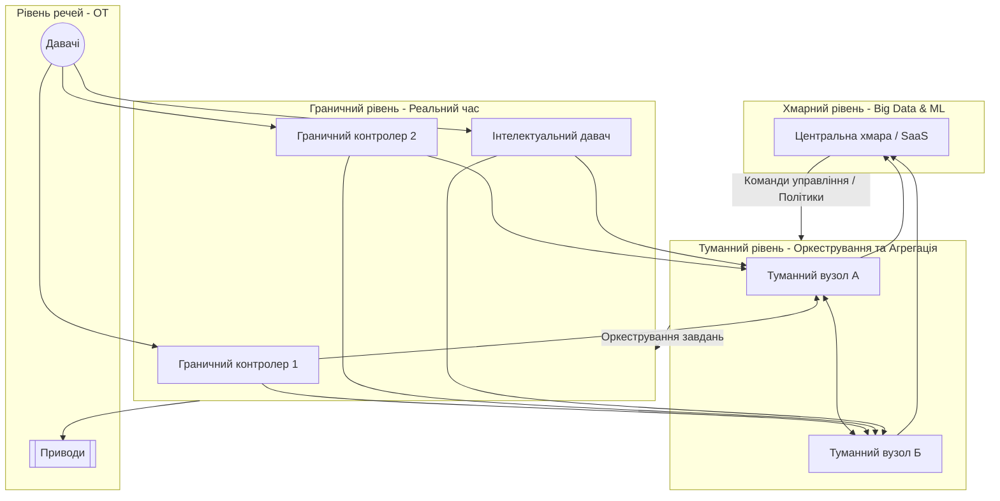
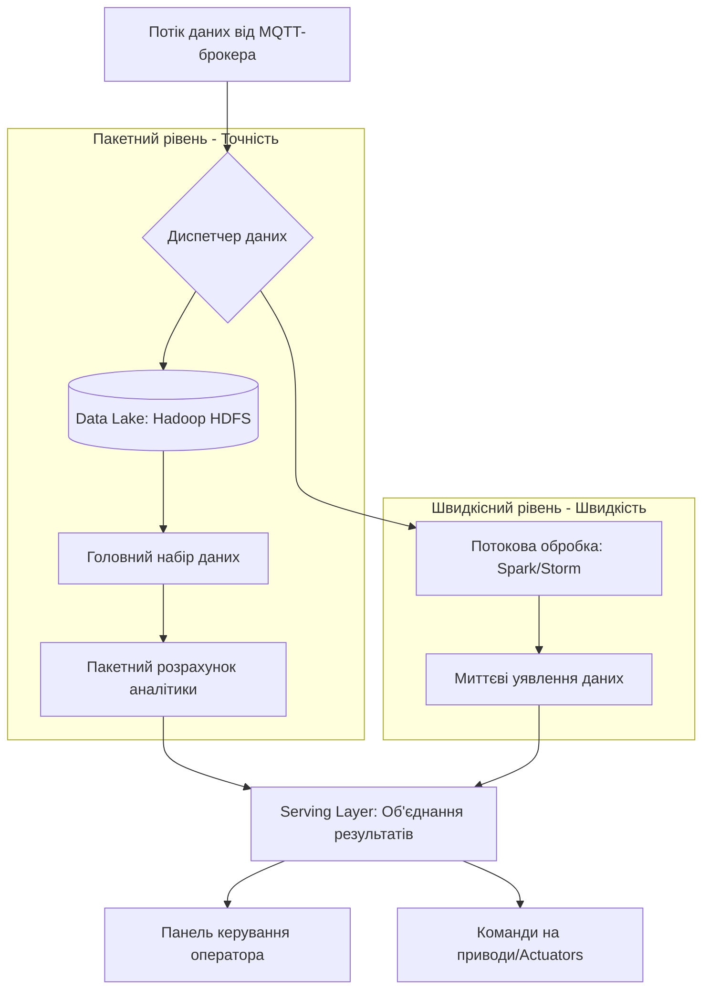

# Тема 7. Хмарні та граничні обчислення

## 7.1 Моделі хмарних сервісів (IaaS, PaaS, SaaS) у кіберфізичних системах

У сучасній архітектурі кіберфізичних систем (КФС) та промислового Інтернету речей (IIoT) хмарні обчислення виступають як верхній рівень ієрархії, що забезпечує глибоку аналітику великих даних та інтелектуальне управління. Проектування такої складної екосистеми вимагає від **архітектора IIoT** системі глибокого розуміння моделей обслуговування, оскільки на сьогодні доступно понад 1,5 мільйона комбінацій архітектурних рішень, де вибір моделі безпосередньо впливає на надійність, масштабованість та безпеку всієї системи. Моделі хмарних сервісів визначають розподіл відповідальності між провайдером послуг та користувачем (розробником КФС), що є критичним для інтеграції **технологій функціонування** (OT) з **інформаційними технологіями** (IT).

**Інфраструктура як сервіс (IaaS)** є найбільш базовою моделлю, яка надає користувачеві доступ до фундаментальних обчислювальних ресурсів, таких як віртуальні сервери, мережева інфраструктура та сховища даних. У контексті КФС ця модель дозволяє гнучко розгортати обчислювальні потужності для обробки телеметрії, не інвестуючи у власне апаратне забезпечення. Користувач у моделі IaaS зберігає повний контроль над операційними системами, базами даних та прикладним програмним забезпеченням, що дозволяє реалізовувати специфічні алгоритми рівня **Brainware** для управління фізичними об’єктами. Цей підхід вимагає високої кваліфікації системних адміністраторів та архітекторів рішень для забезпечення безпеки на рівні платформи та інфраструктури.

**Платформа як сервіс (PaaS)** пропонує вищий рівень абстракції, надаючи розробникам КФС готове середовище з набором інструментів, бібліотек та сервісів для розробки, тестування та розгортання додатків. У цій моделі провайдер бере на себе управління нижніми рівнями (ОС, сервери, мережі), дозволяючи архітектору зосередитися на логіці управління технологічними процесами та аналітиці даних. PaaS є оптимальним вибором для створення інтелектуальних давачів та систем моніторингу в реальному часі, де важливо швидко інтегрувати нові типи пристроїв та протоколи обміну даними, такі як **MQTT**. Використання PaaS дозволяє реалізувати складні сценарії обробки подій та навчання моделей машинного навчання без необхідності налаштування серверного оточення.

**Програмне забезпечення як сервіс (SaaS)** є моделлю, за якої користувач отримує доступ до готового прикладного програмного забезпечення через мережу Інтернет, зазвичай за допомогою веб-браузера або мобільного додатка. У кіберфізичних системах SaaS часто реалізується у вигляді диспетчерських панелей (dashboards), систем управління активами або пакетів прогнозної аналітики стану обладнання. Спеціалізація **SaaS-архітектор** передбачає створення таких рішень, де користувач не відповідає за технічну підтримку інфраструктури чи платформи, а лише налаштовує параметри функціонування під свої бізнес-цілі. Це дозволяє малим та середнім підприємствам використовувати передові технології **Big Data** та аналітичні інструменти для оптимізації виробництва без значних капітальних витрат.

Ефективність використання хмарних моделей у КФС часто оцінюється через показники латентності та пропускної здатності. Згідно з **теоремою Шеннона-Гартлі**, максимальна швидкість передачі даних $C$ (біт/с) від сенсорного вузла до хмарного сервісу обмежена смугою пропускання каналу $W$ (Гц) та відношенням сигнал/шум $S/N$:

$$
C = W \cdot \log_2\left(1 + \frac{S}{N}\right).
$$

Вибір між моделями (наприклад, локальним IaaS або віддаленим SaaS) залежить від того, чи здатна мережа забезпечити передачу необхідного обсягу телеметрії без критичних затримок. У системах реального часу також розраховується **час життя батареї** автономних давачів, оскільки часті звернення до хмарних сервісів через енергоємні протоколи зв'язку можуть суттєво скоротити термін експлуатації вузла:

$$
T_{life} = \frac{C_{bat}}{I_{avg} \cdot 24 \cdot 365},
$$

де:

*   $T_{life}$ — прогнозований час роботи пристрою (в роках).
*   $C_{bat}$ — номінальна ємність батареї (мА·год).
*   $I_{avg}$ — середній струм споживання (А або мА), розрахований на основі циклів активності при взаємодії з хмарою.

Порівняльна характеристика моделей хмарних сервісів за рівнями відповідальності та типовими прикладами використання наведена в таблиці нижче.

| Критерій порівняння | IaaS (Інфраструктура) | PaaS (Платформа) | SaaS (Програмне забезпечення) |
| :--- | :--- | :--- | :--- |
| **Що надається** | Віртуальні машини, сховища, мережі. | Середовище розробки, БД, runtime-середовища. | Готові до використання додатки. |
| **Керування користувачем** | ОС, дані, додатки, середовище виконання. | Тільки власні додатки та дані. | Лише налаштування інтерфейсу та конфігурації. |
| **Перевага для КФС** | Повна кастомізація архітектури керування. | Швидка розробка та масштабування аналітики. | Мінімальний час впровадження систем моніторингу. |
| **Типові приклади** | AWS EC2, Microsoft Azure VMs. | Google App Engine, IBM Cloud (Watson). | Salesforce, хмарні SCADA-системи, ERP. |

Модель розподілу шарів (layers) у хмарній архітектурі IIoT ілюструє межі відповідальності між різними сервісними моделями.

Дана схема показує, що при переході від **IaaS** до **SaaS** ступінь контролю користувача над системою зменшується, проте пропорційно зростає швидкість розгортання інтелектуальних сервісів рівня **Software** та **Brainware**.

### Питання для самоперевірки

1. Яким чином вибір моделі хмарного сервісу (IaaS vs PaaS) впливає на роль архітектора IIoT системи в контексті управління безпекою платформи?
2. Поясніть, чому модель SaaS є найбільш привабливою для швидкої реалізації систем предиктивного обслуговування (наприклад, підключених ліфтів), але може бути обмеженою для глибокої кастомізації алгоритмів керування?
3. На основі теореми Шеннона-Гартлі обґрунтуйте, які обмеження накладає використання публічної хмари (Public Cloud) на системи КФС реального часу з великою кількістю сенсорів.
4. У чому полягає сутність інтеграції OT та IT технологій при використанні хмарних моделей у промисловості?
5. Які компоненти обчислювальної системи (Hardware, Software, Brainware) покриваються відповідальністю провайдера в моделі PaaS?

## 7.2 Граничні (Edge) та туманні (Fog) обчислення: топологія та оркестрування

У сучасній ієрархічній структурі кіберфізичних систем (КФС) та промислового Інтернету речей (IIoT) спостерігається тенденція до зміщення обчислювальних потужностей від централізованих хмарних серверів безпосередньо до джерел виникнення даних. **Граничні обчислення (Edge computing)** визначаються як парадигма, за якої обробка інформації відбувається на «границі» мережі, тобто на пристроях, що знаходяться у безпосередній близькості до давачів та виконавчих механізмів. Основна мета впровадження граничного рівня полягає у мінімізації затримок (латентності), зменшенні навантаження на канали зв'язку та забезпеченні автономності локальних сегментів системи у разі втрати зв'язку з глобальною мережею. Використання граничних обчислень є критично важливим для завдань, що потребують реакції у реальному часі, таких як забезпечення безпеки персоналу на виробництві або предиктивне обслуговування динамічного обладнання, наприклад, підключених ліфтів.

**Туманні обчислення (Fog computing)** виступають як розширення хмарних сервісів, створюючи проміжний шар між «границею» та «хмарою». На відміну від граничних обчислень, які часто зосереджені на окремих вузлах, туманна інфраструктура передбачає створення розподіленого обчислювального середовища, яке об’єднує ресурси багатьох пристроїв у єдину мережу. Архітектура туманних обчислень, зокрема згідно зі стандартом **OpenFog**, є багатошаровою і включає такі компоненти, як прикладні сервіси, підтримку програмних застосувань, управління вузлами, віртуалізацію обладнання та забезпечення безпеки на рівні вузла. Туманні вузли забезпечують не лише обробку, а й короткострокове зберігання даних та агрегацію трафіку перед його передачею до верхніх рівнів ієрархії.

Вибір конкретної **топології** туманних та граничних обчислень залежить від масштабу КФС та вимог до відмовостійкості. Джерела виділяють кілька різновидів топологій: проста туманна топологія, топологія «туман у хмару», а також конфігурації з одним або декількома туманними вузлами, що взаємодіють з одним або декількома хмарними провайдерами. Найбільш складною є багаторівнева туманна топологія, яка дозволяє будувати каскадні системи обробки даних, де кожен наступний рівень має більші обчислювальні ресурси та ширший контекст аналітики.

Ключовим процесом у забезпеченні життєдіяльності таких розподілених систем є **оркестрування (координація)**. Оркестрування в граничних та туманних обчисленнях полягає у динамічному управлінні ресурсами, розподілі обчислювальних завдань між вузлами та забезпеченні цілісності виконання алгоритмів управління. Оскільки ресурси граничних пристроїв часто обмежені, система оркестрування повинна враховувати поточне навантаження на процесори, доступну смугу пропускання та навіть енергетичний стан вузлів, що живляться від автономних джерел.

Ефективність топології граничних та туманних обчислень прямо залежить від пропускної здатності каналів зв'язку. Згідно з **теоремою Шеннона-Гартлі**, максимальна швидкість передачі даних $C$ (біт/с) у каналі з граничною смугою пропускання $W$ (Гц) та певною потужністю сигналу відносно шуму визначається наступною залежністю:

$$
C = W \cdot \log_2\left(1 + \frac{S}{N}\right)
$$

У наведеній формулі:

*   $C$ — пропускна здатність каналу, що визначає максимальний обсяг телеметрії, який граничний вузол може передати до туманного рівня без накопичення затримок.
*   $W$ — смуга пропускання, яка в сенсорних мережах часто є дефіцитним ресурсом.
*   $S/N$ — відношення сигнал/шум, яке безпосередньо впливає на надійність оркестрування в умовах промислових завад.

Оскільки граничні вузли часто працюють автономно, важливим розрахунковим параметром є **час життя батареї** ($T_{life}$), який обмежує тривалість виконання складних обчислень безпосередньо на «границі»:

$$
T_{life} = \frac{C_{bat}}{I_{avg} \cdot 24 \cdot 365}
$$

Де:

*   $T_{life}$ — прогнозований термін роботи пристрою в роках.
*   $C_{bat}$ — номінальна ємність джерела живлення в міліампер-годинах (мА·год).
*   $I_{avg}$ — середній струм споживання (мА), який суттєво зростає при активізації обчислювальних функцій Edge-рівня або частих сесіях зв'язку під час оркестрування.

Порівняльна характеристика моделей обчислень у КФС дозволяє визначити оптимальне місце для розміщення аналітичних інструментів.

| Критерій порівняння | Хмарні обчислення (Cloud) | Туманні обчислення (Fog) | Граничні обчислення (Edge) |
| :--- | :--- | :--- | :--- |
| **Місце обробки** | Централізовані дата-центри. | Розподілені вузли в мережі. | Безпосередньо на пристроях/давачах. |
| **Латентність (затримка)** | Висока (залежить від Internet). | Низька (локальна мережа). | Мінімальна (реальний час). |
| **Обсяг даних** | Big Data (весь масив). | Агреговані дані та потоки. | Первинні сигнали та події. |
| **Масштабованість** | Практично необмежена. | Висока за рахунок ієрархії. | Обмежена ресурсами пристрою. |
| **Основна функція** | Глибока аналітика, ML. | Координація, фільтрація. | Швидка реакція, фільтрація шуму. |

Різновиди топологій туманних обчислень та чинники, що їх визначають, наведені у таблиці нижче.

| Тип топології | Основна особливість | Сфера застосування |
| :--- | :--- | :--- |
| **Проста туманна** | Один рівень туманних вузлів. | Локальні системи автоматизації. |
| **Туман у хмару** | Прямий зв'язок вузлів з хмарою. | Гібридні системи моніторингу. |
| **Багаторівнева** | Складна ієрархія (вузол під вузлом). | Розумні міста, великі заводи. |
| **Мульти-хмарна** | Взаємодія з різними провайдерами. | Критичні системи з резервуванням. |

Ієрархічна модель взаємодії рівнів обробки даних та процес оркестрування в кіберфізичній системі представлена нижче.

Описана модель показує, що **оркестрування** спускається зверху вниз: хмара визначає глобальні політики, туманний рівень розподіляє завдання між граничними пристроями, а граничний рівень забезпечує безпосередній вплив на фізичний світ через приводи.

### Питання для самоперевірки

1. У чому полягає фундаментальна відмінність між граничними та туманними обчисленнями з точки зору розподілу обчислювальних ресурсів у мережі?
2. Які переваги надає багаторівнева туманна топологія при розгортанні систем класу «Розумне місто» (Smart City)?
3. Поясніть роль оркестрування у забезпеченні відмовостійкості КФС при виході з ладу одного з туманних вузлів.
4. Як теорема Шеннона-Гартлі допомагає архітектору IIoT визначити необхідність впровадження Edge-обробки для високочастотних давачів?
5. Опишіть компоненти архітектури OpenFog, які відповідають за підтримку програмних застосувань та віртуалізацію обладнання.

## 7.3 Big Data в КФС та Lambda-архітектура

У сучасній архітектурі кіберфізичних систем (КФС) та промислового Інтернету речей (IIoT) технології **Big Data** (Великі дані) посідають місце на верхньому ієрархічному рівні, забезпечуючи глибоку аналітику та інтелектуальне управління фізичними процесами. Великі дані у КФС — це не просто значний обсяг інформації, а складна екосистема методів обробки телеметрії, що надходить від мільйонів розподілених інтелектуальних давачів у реальному часі. Для ідентифікації приналежності масивів інформації до категорії Big Data в інженерії IIoT використовують концепцію «6V», яка включає обсяг (**Volume**), швидкість генерування та обробки (**Velocity**), різноманітність форматів (**Variety**), достовірність (**Veracity**), цінність для прийняття рішень (**Value**) та мінливість структури або навантаження (**Variability**).

Проектування систем обробки даних у КФС стикається з фундаментальним протиріччям між необхідністю миттєвої реакції на події та потребою в глибокому аналізі історичних трендів. Традиційно виділяють два підходи: **пакетна обробка** (batch processing), яка ефективна для обробки великих масивів збереженої інформації (наприклад, у сховищах Hadoop HDFS), та **потокова обробка** (stream processing), що орієнтована на мінімальну затримку при аналізі поточних подій у пам'яті. Пакетна обробка добре підходить для зіставлення показань давачів з раніше збереженою інформацією для виявлення ознак зносу обладнання, тоді як потокова обробка є критичною для запобігання аваріям у режимі, близькому до реального часу.

Для вирішення проблеми поєднання цих підходів була запропонована **Lambda-архітектура** — гібридна модель обробки даних, яка дозволяє одночасно отримувати переваги як від пакетного, так і від потокового рівнів. У межах цієї архітектури вхідні дані з брокера повідомлень (наприклад, MQTT або Kafka) дублюються на два напрямки: **Batch Layer** (рівень пакетної обробки) та **Speed Layer** (рівень швидкості). Рівень пакетної обробки відповідає за управління головним набором даних та розрахунок комплексних функцій аналітики з високою точністю, тоді як швидкісний рівень компенсує високу латентність пакетного рівня, надаючи приблизні, але миттєві результати аналізу останніх подій.

Результати обох рівнів об'єднуються на **Serving Layer** (сервісному рівні), де створюються консолідовані звіти або формуються команди керування для виконавчих механізмів КФС. Хоча Lambda-архітектура має підвищену складність через необхідність підтримки двох різних кодових баз для обробки одного й того ж типу даних, вона є незамінною для критичних систем предиктивного обслуговування, де вартість помилки або затримки є надзвичайно високою. Технічна реалізація такої архітектури часто базується на стеку технологій Apache: Hadoop/HDFS для пакетного рівня, Spark/Storm для потокового рівня та Druid або Cassandra для сервісного рівня.

Ефективність систем Big Data у КФС обмежена фізичними параметрами каналів зв'язку та енергоспоживанням сенсорних вузлів. Максимальна пропускна здатність каналу $C$, яка визначає ліміт швидкості передачі даних для рівня Velocity, розраховується за **теоремою Шеннона-Гартлі**:

$$
C = W \cdot \log_2\left(1 + \frac{S}{N}\right).
$$

У наведеній формулі:

- $C$ — максимальна швидкість передачі інформації (біт/с).
- $W$ — смуга пропускання каналу зв'язку (Гц).
- $S/N$ — відношення потужності корисного сигналу до потужності шуму (сигнал/шум).

Для автономних інтелектуальних давачів, що генерують потоки Big Data, критичним є розрахунок **часу життя батареї** $T_{life}$, оскільки інтенсивна передача даних суттєво скорочує енергоресурс:

$$
T_{life} = \frac{C_{bat}}{I_{avg} \cdot 24 \cdot 365},
$$

де:

- $T_{life}$ — прогнозований термін роботи вузла у роках.
- $C_{bat}$ — номінальна ємність акумулятора (мА·год).
- $I_{avg}$ — середній струм споживання (мА), що залежить від частоти сесій зв'язку з Lambda-архітектурою.

Характеристики Big Data в контексті кіберфізичних систем представлені у таблиці нижче.

| Характеристика (V) | Зміст у КФС | Приклад застосування |
| :--- | :--- | :--- |
| **Volume (Обсяг)** | Накопичення петабайтів телеметрії за роки експлуатації. | Історичні архіви SCADA-систем. |
| **Velocity (Швидкість)** | Генерація мільйонів подій на секунду від сенсорів. | Моніторинг вібрації турбін у реальному часі. |
| **Variety (Різноманітність)** | Об'єднання структурованих логів та неструктурованих медіаданих. | Відеоаналітика безпеки разом із даними RFID. |
| **Veracity (Достовірність)** | Фільтрація шумів та аномалій у даних давачів. | Очищення даних від інтерференційних завад. |
| **Value (Цінність)** | Перетворення «сирих» бітів у бізнес-рішення. | Прогнозування відмови вузла за тиждень до аварії. |
| **Variability (Мінливість)** | Зміна інтенсивності потоків даних у пікові години. | Навантаження на мережу Smart City під час свят. |

Порівняння рівнів Lambda-архітектури за ключовими параметрами обробки даних.

| Параметр порівняння | Batch Layer (Пакетний) | Speed Layer (Швидкісний) |
| :--- | :--- | :--- |
| **Час обробки** | Хвилини, години (висока латентність). | Мілісекунди (реальний час). |
| **Точність** | Максимальна (обробка всього масиву). | Наближена (інкрементальна обробка). |
| **Типові інструменти** | Apache Hadoop, HDFS, Hive. | Apache Spark Streaming, Kafka, Storm. |
| **Функція** | Перерахунок історичних даних. | Обробка дельти за останній період. |

Логічна структура Lambda-архітектури, що забезпечує паралельну обробку даних для КФС, може бути представлена наступною схемою.

Наведена модель ілюструє, як **диспетчер** розділяє вхідні дані для досягнення балансу між точністю пакетних обчислень та швидкістю реагування потокових алгоритмів.

### Питання для самоперевірки

1. Яким чином характеристика **Velocity** (швидкість) у Big Data впливає на вибір протоколу зв'язку (наприклад, MQTT) для сенсорної мережі КФС?
2. Поясніть концепцію «озера даних» (**Data Lake**) та його роль у Lambda-архітектурі порівняно з реляційними базами даних.
3. Чому швидкісний рів (**Speed Layer**) у Lambda-архітектурі надає лише наближені результати аналітики і як це компенсується на пакетному рівні?
4. Як теорема Шеннона-Гартлі допомагає оцінити масштабованість системи Big Data при збільшенні кількості давачів у КФС?
5. Опишіть технічну перевагу використання Apache Hadoop HDFS як фундаменту для пакетного рівня обробки великих даних.
