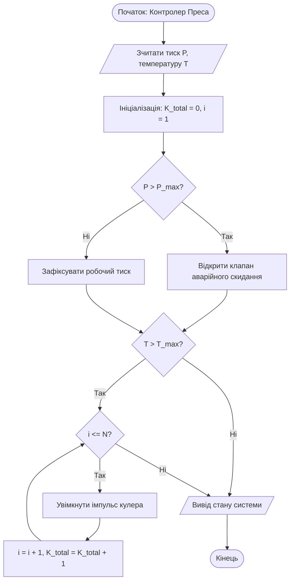
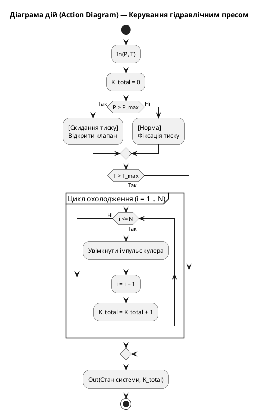

## Практичне заняття № 1. Графічна формалізація алгоритмів КФС

**Тема:** Візуалізація алгоритмів: блок-схеми та структурні діаграми дій (Action Diagrams)  
**Мета:** Засвоєння практичних навичок графічної формалізації та проєктування алгоритмів керування виконавчими механізмами кіберфізичних систем, вивчення принципів структурного програмування за Едсгером Дейкстрою, опанування методики побудови класичних блок-схем (ISO 5807:1985) та структурних діаграм дій у прямокутній і дужковій формах із використанням інструментів Diagrams.net, Mermaid.js та PlantUML.  
**Стек та інструменти:** Diagrams.net (Draw.io), Mermaid.js (CLI / Live Editor), PlantUML, VS Code, Node.js (пакет `@mermaid-js/mermaid-cli`), мова програмування JavaScript (Node.js).  

---

### 1. Теоретичні відомості

У сучасному інженерному підході до розробки кіберфізичних систем проєктування обчислювальних процесів відбувається на особливому архітектурному рівні, який називається рівнем мозкового забезпечення або Brainware. Цей рівень стоїть вище за фізичне апаратне забезпечення (Hardware) та програмний код (Software), оскільки він визначає фундаментальну логіку та алгоритмічну сюжетну лінію поведінки системи. Проєктування логіки КФС вимагає застосування засобів візуалізації, які дозволяють абстрагуватися від синтаксису конкретних мов програмування та гарантувати детермінованість процесів управління у реальному часі.

Історично першим графічним стандартом візуалізації алгоритмів стали блок-схеми (Flow Charts), регламентовані міжнародним стандартом ISO 5807:1985. У блок-схемах кожна дія описується геометричним блоком: овал відповідає вузлам початку та кінця, прямокутник відображає обчислювальну дію або присвоєння, а ромб використовується для розгалуження за умови. Попри інтуїтивну зрозумілість для простих завдань, блок-схеми виявляють критичні недоліки при проєктуванні складних кіберфізичних комплексів. Оскільки з'єднувальні лінії між блоками можуть перетинатися та розростатися в усіх напрямках, блок-схеми провокують неструктурний стиль програмування. Це призводить до появи операторів безумовного переходу `goto`, формуючи заплутану логіку або «спагеті-код», який практично неможливо налагоджувати та верифікувати в системах реального часу.

Проблема неструктурованості алгоритмів зумовила виникнення парадигми структурного програмування. У 1968 році видатний вчений Едсгер Дейкстра опублікував фундаментальну працю «Оператор Go To вважається шкідливим», де довів, що будь-який складний алгоритм може бути поданий за допомогою лише трьох базових керуючих конструкцій: послідовного виконання дій, вибору (розгалуження) та повторення (циклу). Праці Ніклауса Вірта та Тоні Хоара остаточно заклали фундамент для створення нових засобів візуалізації, які фізично унеможливлюють створення неструктурованого алгоритму.

Професійним стандартом для навчання та промислового проєктування стали структурні діаграми дій (Action Diagrams). На відміну від блок-схем, діаграми дій ростуть суворо вертикально, що полегшує їх розміщення на екрані комп’ютера або у документації. Ключовою особливістю цих діаграм є обов’язкове виділення вкладених блоків боковими лініями або дужками, що наочно демонструє ієрархію керуючих конструкцій. Це забезпечує однозначну трансляцію алгоритму з рівню Brainware у Software, оскільки структура діаграми точно відповідає операторним дужкам мов програмування високого рівня.

У практичній інженерній діяльності використовують дві рівноцінні форми запису діаграм дій. Прямокутна форма передбачає замикання кожного блоку у замкнений контур, що є естетичним для презентацій та офіційної документації. Дужкова форма використовує лише ліві вертикальні межі блоків, що є зручним для швидкого запису алгоритму від руки або в текстових редакторах.

```mermaid
flowchart TD
    subgraph Flowchart_Concept [Концепція класичних блок-схем]
        A[Початок] --> B[Операція 1]
        B --> C{Умова}
        C -- Так --> D[Операція 2]
        C -- Ні --> E[Операція 3]
        D --> F[Goto Jump - Неструктурний перехід]
        E --> G[Кінець]
        F --> E
    end

    subgraph ActionDiagram_Concept [Концепція структурних діаграм дій]
        H[Заголовок алгоритму] === I[&#124; Послідовна дія 1]
        I === J[&#124; IF Умова THEN]
        J === K[&#124; &#124; Послідовна дія 2]
        J === L[&#124; ELSE]
        L === M[&#124; &#124; Послідовна дія 3]
        M === N[&#124; END IF]
        N === O[Завершення блоку]
    end
```


*Рисунок 1 — Структурне порівняння концепцій побудови блок-схем та діаграм дій*

На рисунку 1 показано принципову різницю між двома підходами. На відміну від блок-схем, які дозволяють виконувати хаотичні неструктуровані переходи між блоками за допомогою зв'язків типу `goto`, діаграми дій вимагають жорсткого замикання керуючих конструкцій у вертикальні бокові дужки, що виключає появу неконтрольованих розгалужень.

Математична оцінка складності алгоритму при використанні діаграм дій виконується шляхом сумування операцій у кожному структурному блоці. Загальна кількість операцій $K$ розраховується за формулою:

$$
K = K_L + K_{AS} + K_A + K_C
$$

де:
*   Змінна $K_L$ відповідає кількості обробок заголовків циклів і прямо пропорційна кількості ітерацій.
*   Змінна $K_{AS}$ визначає кількість операцій присвоювання значень змінним.
*   Змінна $K_A$ позначає кількість виконаних арифметичних операцій.
*   Змінна $K_C$ відображає кількість перевірок умов у вузлах розгалуження та циклів.

Для розгалужених процесів середня кількість операцій $K_{сер}$ обчислюється як середнє арифметичне між найкращим та найгіршим шляхами виконання:

$$
K_{сер} = \frac{K_{min} + K_{max}}{2}
$$

де $K_{min}$ та $K_{max}$ позначають відповідно мінімальну та максимальну кількість операцій залежно від гілки, якою підуть обчислення.

Загальна функція трудомісткості алгоритму $\Psi$ враховує апаратні ресурси КФС та виражається залежністю:

$$
\Psi = c_1 \cdot F_a(N) + c_2 \cdot M + c_3 \cdot S_d + c_4 \cdot S_r
$$

де $F_a(N)$ позначає часову складність (еквівалент операцій $K$), $M$ відображає обсяг скомпільованого коду, $S_d$ відповідає обсягу пам'яті для даних, $S_r$ описує витрати оперативної пам'яті на стек, а $c_1, c_2, c_3, c_4$ є ваговими коефіцієнтами платформи.

---

### 2. Підготовка середовища та розгортання проєкту (Крок 0)

Для виконання практичного заняття та генерації графічних схем необхідно налаштувати робоче середовище, що включає інструменти розробки Node.js, генератор Diagrams CLI та розширення для редактора VS Code.

#### Крок 0.1. Перевірка та налаштування Node.js
Відкрийте системний термінал вашої операційної системи та перевірте наявність середовища Node.js:

```bash
node -v
npm -v
```

Якщо інструменти встановлені, у консолі відобразяться їхні версії. Встановити CLI-генератор Mermaid.js можна за допомогою глобальної команди:

```bash
npm install -g @mermaid-js/mermaid-cli
```

#### Крок 0.2. Створення каталогу проєкту
Створіть робочу папку проєкту `cps-pz1-action-diagrams` та перейдіть у неї через термінал:

```bash
mkdir cps-pz1-action-diagrams
cd cps-pz1-action-diagrams
mkdir src exports
```

Ініціалізуйте конфігураційний файл проєкту:

```bash
npm init -y
```

Структура каталогу проєкту матиме такий вигляд:

```
cps-pz1-action-diagrams/
├── exports/                (Папка для експортованих зображень PNG/SVG)
├── src/
│   ├── action_diagram.puml (Маніфест діаграми дій у PlantUML)
│   ├── flowchart.mmd       (Маніфест блок-схеми у Mermaid)
│   └── logic.js            (Структурований код алгоритму на JS)
├── package.json
└── README.md
```

#### Крок 0.3. Довідка щодо синтаксису Mermaid.js та PlantUML
Синтаксис Mermaid.js дозволяє описувати блок-схеми у текстовому форматі. Основні елементи:
*   Декларація напрямку: `flowchart TD` (згори вниз) або `flowchart LR` (зліва направо).
*   Форми блоків: `[Текст]` — прямокутник дії, `(Текст)` — овал, `{Текст}` — ромб умови.
*   Зв'язки: `-->` — лінія зі стрілкою, `-->|Так|` — підписаний перехід.

Синтаксис PlantUMLActivity використовується для опису діаграм дій. Блоки обгортаються у дужки `if () then ... else ... endif` та `while () ... endwhile`, що фізично блокує використання безумовних переходів `goto`.

---

### 3. Порядок виконання роботи

#### 3.1. Індивідуальні завдання

Кожен студент виконує завдання відповідно до свого номера у списку групи. Необхідно розробити класичну блок-схему та діаграму дій (у прямокутній та дужковій формах) для алгоритму керування вказаним виконавчим механізмом КФС.

| Варіант | Виконавчий механізм КФС | Вхідні сенсорні параметри | Логіка розгалуження та алгоритм | Кількість ітерацій $N$ | Форма Action Diagram |
| :---: | :--- | :--- | :--- | :---: | :---: |
| **1** | Гідравлічний прес лиття | Тиск $P$, температура $T$ | Якщо $P > P_{max}$, увімкнути скидання; якщо $T > T_{max}$, запустити кулер $N$ разів | $10$ | Прямокутна |
| **2** | Дозатор агресивної рідини | Рівень $L$, маса $M$ | Клапан відкритий, поки $L < L_{set}$; виконати $N$ промивок клапана | $5$ | Дужкова |
| **3** | Кліматичний заслон теплиці | Освітленість $I$, СО2 | Якщо $I < I_{min}$, закрити заслон; цикловий моніторинг СО2 $N$ тактів | $12$ | Прямокутна |
| **4** | Привод зварювального робота| Струм $I$, позиція $X$ | Перевірка дуги; якщо $I$ поза нормою, виконувати позиціонування $N$ мм | $20$ | Дужкова |
| **5** | Антенний трекер супутника | Рівень сигналу $S$, азимут $\theta$| Поворот за азимутом; якщо $S < S_{thr}$, виконати $N$ кроків сканування | $8$ | Прямокутна |
| **6** | Конвеєр сортування браку | Оптичний код, вага $W$ | Якщо вага $W \neq W_{std}$, штовхач вибиває деталь; цикл очищення $N$ с | $15$ | Дужкова |
| **7** | Охолоджувач фарм-реактора | Температура $T$, pH | Якщо $T > T_{crit}$, відкрити хладоагент; $N$ ітерацій перемішування | $6$ | Прямокутна |
| **8** | Насос змащування турбіни | Тиск масла $P_{oil}$, вибрація | Якщо $P_{oil} < P_{min}$, включити резерв; виконати $N$ тактів прокачки | $10$ | Дужкова |
| **9** | Елеватор зерносховища | Вологість $H$, температура | Якщо $H > H_{max}$, сушка увімкнена; цикл провітрювання $N$ хвилин | $24$ | Прямокутна |
| **10** | Вентилятор дегазації шахти | Концентрація CH4 | Якщо CH4 $> 2\%$, запуск на MAX; виконати $N$ продувок каналу | $10$ | Дужкова |
| **11** | Автоматичний шлагбаум | Датчик петлі, RFID | Якщо код вірний, підняти; очікування виїзду авто $N$ секунд | $7$ | Прямокутна |
| **12** | Сервопривод позиціонування | Помилка $\Delta X$, струм | Якщо $\Delta X > \varepsilon$, подати імпульс; обмеження за струмом $N$ разів | $50$ | Дужкова |
| **13** | Очищувач фільтра води | Перепад тиску $\Delta P$ | Якщо $\Delta P > \Delta P_{crit}$, зворотно промити фільтр $N$ циклів | $4$ | Прямокутна |
| **14** | Інжектор ТПА пластику | Напруга $V$, температура | Перевірка прогріву; якщо $T > T_{set}$, виконати $N$ вприсків | $16$ | Дужкова |
| **15** | Модуль пожежогасіння | Дим, температура $T$ | Якщо $T > 70^\circ\text{C}$ та Дим=1, подати газ; затримка сирени $N$ с | $30$ | Прямокутна |
| **16** | Роботизований штабелер | Лазерний дальномір $D$ | Якщо $D > D_{min}$, рух вперед; підйом вил на $N$ ступенів | $12$ | Дужкова |
| **17** | Системи орієнтації батарей | Кут сонця $\alpha$ | Перевірка генерації; якщо $\alpha \neq \alpha_{opt}$, корекція $N$ град | $45$ | Прямокутна |
| **18** | Компресор пневмомережі | Тиск в ресивері $P$ | Якщо $P < P_{off}$, накачка; продувка конденсату $N$ разів | $3$ | Дужкова |
| **19** | Шлюз очищення приміщень | Тиск повітря, таймер | Створення підпору повітря; обробка УФ променями $N$ тактів | $18$ | Прямокутна |
| **20** | Привод змішувача фарби | В'язкість $\eta$, рівень | Якщо $\eta > \eta_{max}$, додати розчинник; цикл змішування $N$ хв | $15$ | Дужкова |

---

#### 3.2. Покроковий алгоритм розробки з роз'ясненням коду

Нижче наведено приклад виконання практичного заняття для **Варіанта №1 (Гідравлічний прес лиття)**.

##### Крок 1. Розробка класичної блок-схеми в Mermaid.js (`src/flowchart.mmd`)

Створіть файл `src/flowchart.mmd` та додайте наступний код:


*Рисунок 2 — Класична блок-схема алгоритму керування гідравлічним пресом КФС*

Рисунок 2 ілюструє традиційне подання алгоритму за стандартом ISO 5807:1985. Вхідні дані з датчиків тиску та температури обробляються у послідовних вузлах розгалуження, після чого при перевищенні температурного порогу активується циклічний блок охолодження.

##### Крок 2. Розробка структурної діаграми дій у PlantUML (`src/action_diagram.puml`)

Створіть файл `src/action_diagram.puml` для відображення алгоритму в прямокутній та дужковій формах:



##### Крок 3. Реалізація структурованого коду на JavaScript без `goto` (`src/logic.js`)

Створіть файл `src/logic.js`, який містить повну реалізацію алгоритму, моделює роботу виконавчого механізму та обчислює кількість виконаних операцій $K$:

```javascript
/**
 * Модуль керування гідравлічним пресом ливарної машини (Варіант №1).
 * Дотримується принципів структурного програмування Е. Дейкстри.
 */

function runHydraulicPressController(pressureP, tempT, pMax, tMax, N) {
  console.log("=== ЗАПУСК АЛГОРИТМУ КЕРУВАННЯ ГІДРАВЛІЧНИМ ПРЕСОМ ===");
  
  // Ініціалізація лічильників операцій для аналізу складності
  let K_L = 0;  // Лічильник заголовок циклів
  let K_AS = 0; // Лічильник операцій присвоєння
  let K_A = 0;  // Лічильник арифметичних операцій
  let K_C = 0;  // Лічильник порівнянь

  // 1. Зчитати вхідні дані
  let P = pressureP; K_AS++;
  let T = tempT; K_AS++;
  let isValveOpen = false; K_AS++;
  let coolerPulses = 0; K_AS++;

  console.log(`Вхідні параметри: Тиск P = ${P} бар, Температура T = ${T} °C`);

  // 2. Перший блок розгалуження: Перевірка тиску
  K_C++;
  if (P > pMax) {
    isValveOpen = true; K_AS++;
    console.log("[УВАГА] Тиск перевищує P_max! Аварійний клапан ВІДКРИТО.");
  } else {
    isValveOpen = false; K_AS++;
    console.log("[ІНФО] Тиск у межах норми. Аварійний клапан ЗАКРИТО.");
  }

  // 3. Другий блок розгалуження: Перевірка температури та цикл охолодження
  K_C++;
  if (T > tMax) {
    console.log("[УВАГА] Перевищення температури! Запуск циклу охолодження...");
    
    let i = 1; K_AS++;
    K_L++; K_C++; // Перша перевірка умови циклу
    
    while (i <= N) {
      coolerPulses++; K_AS++; K_A++; // Генерація імпульсу
      console.log(`  -> Охолодження: Імпульс кулера №${i} виконано.`);
      
      i++; K_AS++; K_A++;
      K_L++; K_C++; // Повторна перевірка умови циклу
    }
  } else {
    console.log("[ІНФО] Температура у межах норми. Охолодження не потрібне.");
  }

  // 4. Підрахунок загальної кількості операцій K
  let K_total = K_L + K_AS + K_A + K_C;
  
  console.log("--------------------------------------------------");
  console.log(`Статистика операцій: K_L=${K_L}, K_AS=${K_AS}, K_A=${K_A}, K_C=${K_C}`);
  console.log(`Загальна складність виконання K_total = ${K_total} операцій.`);
  console.log("==================================================\n");

  return {
    isValveOpen: isValveOpen,
    coolerPulses: coolerPulses,
    K_total: K_total
  };
}

// Демонстрація виконання двох різних шляхів (K_min та K_max)
console.log("--- СЦЕНАРІЙ 1: Мінімальне навантаження (K_min) ---");
let resMin = runHydraulicPressController(80, 50, 100, 70, 10);

console.log("--- СЦЕНАРІЙ 2: Максимальне навантаження (K_max) ---");
let resMax = runHydraulicPressController(120, 85, 100, 70, 10);

let K_avg = (resMin.K_total + resMax.K_total) / 2;
console.log(`Середня розрахункова складність K_сер = (${resMin.K_total} + ${resMax.K_total}) / 2 = ${K_avg} операцій.`);
```

##### Крок 4. Експорт графічних схем за допомогою CLI

Для генерації графічного файла блок-схеми виконайте команду у терміналі:

```bash
mmdc -i src/flowchart.mmd -o exports/flowchart.png -t forest
```

##### Крок 5. Запуск програмного модуля та перевірка роботи

Запустіть написаний модуль розрахунку за допомогою Node.js:

```bash
node src/logic.js
```

Приклад виведення результату у консолі термінала:

```text
--- СЦЕНАРІЙ 1: Мінімальне навантаження (K_min) ---
=== ЗАПУСК АЛГОРИТМУ КЕРУВАННЯ ГІДРАВЛІЧНИМ ПРЕСОМ ===
Вхідні параметри: Тиск P = 80 бар, Температура T = 50 °C
[ІНФО] Тиск у межах норми. Аварійний клапан ЗАКРИТО.
[ІНФО] Температура у межах норми. Охолодження не потрібне.
--------------------------------------------------
Статистика операцій: K_L=0, K_AS=5, K_A=0, K_C=2
Загальна складність виконання K_total = 7 операцій.
==================================================

--- СЦЕНАРІЙ 2: Максимальне навантаження (K_max) ---
=== ЗАПУСК АЛГОРИТМУ КЕРУВАННЯ ГІДРАВЛІЧНИМ ПРЕСОМ ===
Вхідні параметри: Тиск P = 120 бар, Температура T = 85 °C
[УВАГА] Тиск перевищує P_max! Аварійний клапан ВІДКРИТО.
[УВАГА] Перевищення температури! Запуск циклу охолодження...
  -> Охолодження: Імпульс кулера №1 виконано.
  ...
  -> Охолодження: Імпульс кулера №10 виконано.
--------------------------------------------------
Статистика операцій: K_L=11, K_AS=26, K_A=20, K_C=13
Загальна складність виконання K_total = 70 операцій.
==================================================

Середня розрахункова складність K_сер = (7 + 70) / 2 = 38.5 операцій.
```

---

### 4. Вимоги до змісту звіту

Звіт з практичного заняття оформлюється у форматі PDF або MS Word та повинен містити наступні обов'язкові розділи:

1.  **Титульна сторінка:** Назва університету, факультету, кафедри, дисципліни, номер практичної роботи, тема, варіант, ПІБ студента та викладача.
2.  **Завдання варіанта:** Постановка задачі відповідно до вашого варіанта з вказівкою виконавчого механізму, параметрів та кількості ітерацій $N$.
3.  **Графічна формалізація алгоритму:**
    *   Класична блок-схема за стандартом ISO 5807:1985 (експортований рисунок із Mermaid.js або Diagrams.net).
    *   Структурна діаграма дій (Action Diagram) у прямокутній формі.
    *   Структурна діаграма дій (Action Diagram) у дужковій формі.
4.  **Програмна реалізація:** Повний текст коду мовою JavaScript/C++ без використання безумовних переходів `goto`.
5.  **Математичний розрахунок складності:**
    *   Детальний підрахунок кількості операцій $K_{min}$ та $K_{max}$ для найкращого та найгіршого сценаріїв.
    *   Розрахунок середньої кількості операцій $K_{сер} = \frac{K_{min} + K_{max}}{2}$.
    *   Формула функції трудомісткості $\Psi$ для обраного варіанта.
6.  **Висновки:** Порівняльний аналіз наочності блок-схем та діаграм дій, обґрунтування переваг структурного програмування для КФС.

---

### 5. Контрольні запитання

1.  Яким чином класичні блок-схеми провокують використання безумовного переходу `goto` і чому це вважається критичним недоліком у програмуванні кіберфізичних систем реального часу?
2.  Сформулюйте суть концепції структурного програмування Едсгера Дейкстри. Які три базові керуючі конструкції є достатніми для вираження будь-якого алгоритму?
3.  У чому полягає відмінність між прямокутною та дужковою формами структурних діаграм дій (Action Diagrams) і яка з них рекомендується для швидких начерків логіки?
4.  Як за допомогою діаграм дій розраховується середня часова складність $K_{сер}$ для розгалужених обчислювальних процесів?
5.  Поясніть фізичний та системний зміст коефіцієнтів $c_1, c_2, c_3, c_4$ у математичній формулі функції трудомісткості $\Psi$.
