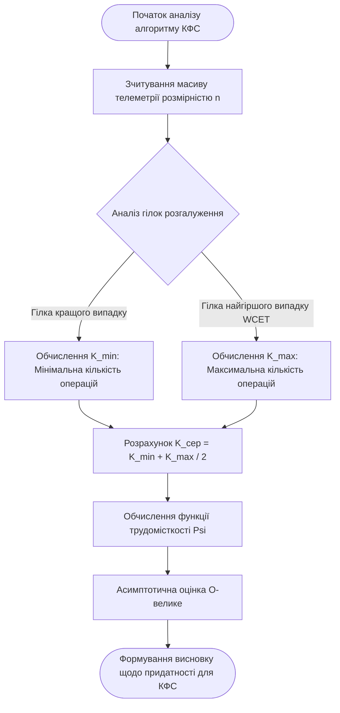
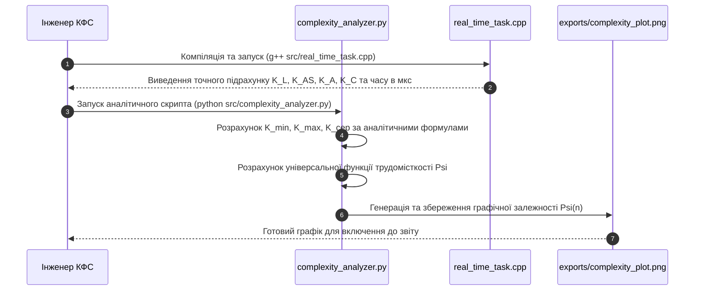

## Практичне заняття № 2. Оцінювання трудомісткості обчислювальних процесів

**Тема:** Часова та ємнісна складність алгоритмів реального часу  
**Мета:** Засвоєння практичних навичок аналітичного та експериментального розрахунку часової й ємнісної складності обчислювальних процесів у кіберфізичних системах реального часу, розрахунок кількості елементарних операцій у циклах та розгалуженнях, визначення середнього значущого показника $K_{сер}$ та найгіршого сценарію трудомісткості $\Psi$, а також математична апроксимація складності за допомогою асимптотичної $O$-символіки.  
**Стек та інструменти:** Мови програмування Python (версія v3.10+) та C++ (компілятор GCC/G++ 11+), бібліотека `matplotlib` для побудови графічних залежностей, системний термінал, середовище розробки Visual Studio Code.  

---

### 1. Теоретичні відомості

У системному проєктуванні кіберфізичних комплексів обчислювальні процеси функціонують у тісному зв'язку з фізичним часом. На відміну від універсальних програмних систем, де першочерговою є середня швидкість обробки даних, у системах жорсткого реального часу критичне значення має детермінованість та прогнозованість найгіршого часу виконання. Поняття найгіршого часу виконання (з англійської Worst-Case Execution Time, WCET) описує максимально можливу тривалість обчислювального процесу при найбільш несприятливих вхідних даних та максимальному завантаженні апаратури. Перевищення розрахованого порогу WCET у КФС вважається системною відмовою, яка може призвести до деструкції фізичного об'єкта.

Часова складність алгоритму визначає загальну кількість елементарних машинних операцій, виконуваних процесором для обробки вхідного сигналу розмірністю $n$. Загальний час виконання алгоритму $T(n)$ описується класичною формулою:

$$
T(n) = \sum_{i=1}^{N} t_i
$$

У наведеній математичній залежності змінна $T(n)$ позначає загальний час виконання алгоритму як функцію від розмірності вхідних даних $n$, змінна $t_i$ відповідає тривалості виконання $i$-ї елементарної операції у секундах, а параметр $N$ визначає загальну кількість таких операцій. У спрощеній обчислювальній моделі з одиничною вартістю припускають, що тривалість кожної елементарної дії є сталою величиною $t_i = 1$, що дозволяє ототожнити час із кількістю виконаних команд.

Для комплексного оцінювання використання апаратних ресурсів мікроконтролера або граничного сервера КФС застосовується універсальна функція трудомісткості $\Psi$:

$$
\Psi = c_1 \cdot F_a(N) + c_2 \cdot M + c_3 \cdot S_d + c_4 \cdot S_r
$$

У наведеній вище формулі трудомісткості змінна $F_a(N)$ відображає часову складність алгоритму, тобто кількість виконаних елементарних операцій. Змінна $M$ визначає обсяг програмного коду в байтах або машинних інструкціях, який займає флеш-пам'ять мікроконтролера. Змінна $S_d$ описує обсяг оперативної пам'яті у байтах, виділений під зберігання статичних та динамічних структур даних. Змінна $S_r$ відповідає обсягу оперативної пам'яті у байтах, що витрачається на організацію обчислень, зокрема на функціональний стек та рекурсивні виклики. Вагові коефіцієнти $c_1, c_2, c_3, c_4$ є безрозмірними величинами, які визначають відносну пріоритетність та дефіцитність кожного ресурсу для конкретної обчислювальної платформи.

Під час аналізу циклічних та розгалужених алгоритмів загальну кількість елементарних дій $K$ структурують за функціональними категоріями:

$$
K = K_L + K_{AS} + K_A + K_C
$$

У цій формулі змінна $K_L$ відповідає кількості виконаних обробок заголовків циклів, змінна $K_{AS}$ визначає кількість операцій присвоювання значень змінним, параметр $K_A$ позначає кількість арифметичних дій, а змінна $K_C$ відображає кількість виконаних порівнянь та обчислень умовних виразів.

Для розгалужених алгоритмів, де шлях виконання залежить від значення вхідного сигналу, розраховується середня кількість операцій $K_{сер}$:

$$
K_{сер} = \frac{K_{min} + K_{max}}{2}
$$

де параметр $K_{min}$ позначає мінімальну кількість операцій, що виконується у найпростішій гілці алгоритму (найкращий випадок), а параметр $K_{max}$ відповідає максимальній кількості операцій у найбльш навантаженій гілці, що формує межу WCET.

Математична апроксимація поведінки алгоритму при прагненні розмірності входу $n$ до нескінченності здійснюється за допомогою асимптотичного аналізу. Верхня межа зростання складності позначається символікою $O(f(n))$, що гарантує, що час виконання алгоритму зростатиме не швидше за функцію $f(n)$, помножену на деяку сталу константу.


*Рисунок 1 — Структурна схема алгоритмічного конвеєра оцінювання часової та ємнісної складності в КФС*

На рисунку 1 зображено послідовність етапів оцінювання трудомісткості обчислювального процесу. Процес розпочинається з аналізу вхідних даних, розгалужується на оцінювання найкращого та найгіршого сценаріїв виконання, після чого розраховуються підсумкова середня кількість операцій $K_{сер}$, загальна трудомісткість $\Psi$ та підсумкова асимптотична межа складності.

---

### 2. Підготовка середовища та розгортання проєкту (Крок 0)

Для виконання аналітичних та експериментальних розрахунків необхідно налаштувати робочу директорію, встановити компілятор C++ та модуль графічної візуалізації Matplotlib для мови Python.

#### Крок 0.1. Перевірка та встановлення системних інструментів
Відкрийте системний термінал та перевірте наявність компілятора C++ і інтерпретатора Python:

```bash
g++ --version
python --version
```

У разі відсутності бібліотеки графічного побудування `matplotlib`, встановіть її через менеджер пакетів `pip`:

```bash
pip install matplotlib
```

#### Крок 0.2. Створення структури папок проєкту
Створіть робочий каталог `cps-pz2-complexity` та перейдіть у нього через термінал:

```bash
mkdir cps-pz2-complexity
cd cps-pz2-complexity
mkdir src exports
```

Структура робочого проєкту матиме такий вигляд:

```
cps-pz2-complexity/
├── exports/                    (Папка для збереження графіків складності)
├── src/
│   ├── complexity_analyzer.py  (Скрипт експериментального профайлінгу)
│   └── real_time_task.cpp      (Код обчислювального алгоритму на C++)
├── requirements.txt
└── README.md
```

#### Крок 0.3. Налаштування профайлінгу часу та пам'яті
Для точного вимірювання часу виконання у мові C++ використовується системний високоточний таймер `<chrono>`, який забезпечує наносекундну точність. У мові Python вимірювання здійснюється за допомогою функції `time.perf_counter_ns()`, а оцінка пам'яті виконаних об'єктів проводить через функцію `sys.getsizeof()`.

---

### 3. Порядок виконання роботи

#### 3.1. Індивідуальні завдання

Кожен студент виконує практичне завдання відповідно до обраного варіанта (номер студента у списку групи). Необхідно аналітично розрахувати кількість операцій $K_{min}$, $K_{max}$, $K_{сер}$, обчислити трудомісткість $\Psi$ за вказаними коефіцієнтами та експериментально побудувати графіки часової й ємнісної складності.

| Варіант | Алгоритмічна задача КФС | Вхідний параметр $n$ | Вагові коефіцієнти $(c_1, c_2, c_3, c_4)$ | Розгалуження в циклі | Очікувана асимптотика $O(f(n))$ |
| :---: | :--- | :---: | :---: | :--- | :---: |
| **1** | Фільтрація аномалій телеметрії | $100 \dots 10000$ | $(1.5, 0.2, 0.8, 0.5)$ | Перевірка 2-х бар'єрів | $O(n)$ |
| **2** | Пошук пікового тиску в буфері | $500 \dots 20000$ | $(1.0, 0.5, 0.5, 1.0)$ | Пошук максимуму з умовою | $O(n)$ |
| **3** | Сортування буфера бульбашкою | $50 \dots 2000$ | $(2.0, 0.1, 1.0, 0.2)$ | Обмін сусідніх елементів | $O(n^2)$ |
| **4** | Множення матриці сигналів $n \times n$| $10 \dots 300$ | $(1.0, 0.3, 1.5, 0.1)$ | Вкладений цикл обчислень | $O(n^3)$ |
| **5** | Обчислення синуса рядом Тейлора | $5 \dots 50$ | $(0.8, 0.4, 0.2, 2.0)$ | Точність зупинки циклу | $O(n)$ |
| **6** | Циклічний зсув масиву датчиків | $1000 \dots 50000$| $(1.2, 0.1, 0.6, 0.3)$ | Перевірка межі зсуву | $O(n)$ |
| **7** | Бінарний пошук у таблиці устав | $100 \dots 100000$| $(0.5, 0.8, 0.4, 1.2)$ | Ділення інтервалу навпіл | $O(\log n)$ |
| **8** | Сортування вставками телеметрії | $50 \dots 2500$ | $(1.8, 0.2, 0.9, 0.4)$ | Вставка в упорядковану частину| $O(n^2)$ |
| **9** | Лінійний пошук з бар'єром | $500 \dots 50000$ | $(1.0, 0.3, 0.5, 0.2)$ | Одна перевірка у циклі | $O(n)$ |
| **10** | Дзеркальне відображення матриці | $20 \dots 500$ | $(1.1, 0.2, 1.2, 0.3)$ | Попарний обмін in-place | $O(n^2)$ |
| **11** | Ковзне середнє для $n$ замірів | $100 \dots 20000$ | $(1.3, 0.1, 0.7, 0.5)$ | Переповнення вікна | $O(n)$ |
| **12** | Обхід матриці датчиків змійкою | $20 \dots 400$ | $(1.0, 0.4, 1.1, 0.2)$ | Зміна напрямку за парністю | $O(n^2)$ |
| **13** | Швидке сортування (QuickSort) | $100 \dots 10000$ | $(1.4, 0.3, 0.8, 1.5)$ | Рекурсивний поділ (WCET) | $O(n^2)$ |
| **14** | Інтерполяційний пошук у КФС | $500 \dots 50000$ | $(0.7, 0.6, 0.5, 1.0)$ | Оцінка позиції за значенням | $O(\log \log n)$ |
| **15** | Знаходження квадратного кореня | $10 \dots 1000$ | $(1.0, 0.2, 0.3, 0.8)$ | Ітерації ітераційного методу | $O(\log n)$ |
| **16** | Обчислення автокореляції | $50 \dots 1500$ | $(2.2, 0.1, 1.2, 0.4)$ | Сумування зі зсувом | $O(n^2)$ |
| **17** | Пошук підрядка в логах (KMP) | $1000 \dots 100000$| $(1.1, 0.5, 0.8, 0.6)$ | Зсув за префікс-функцією | $O(n)$ |
| **18** | Транспонування сітки датчиків | $30 \dots 600$ | $(1.0, 0.2, 1.0, 0.1)$ | Елементи вище діагоналі | $O(n^2)$ |
| **19** | Апроксимація сигналу поліномом| $10 \dots 200$ | $(1.6, 0.3, 0.9, 0.5)$ | Обчислення степенів | $O(n^2)$ |
| **20** | Декодування пакетів з усуненням | $500 \dots 30000$ | $(1.2, 0.4, 0.6, 0.7)$ | Перевірка контрольної суми | $O(n)$ |

---

#### 3.2. Покроковий алгоритм розробки з роз'ясненням коду

Нижче наведено приклад виконання практичного заняття для **Варіанта №1 (Фільтрація аномалій телеметрії)**.

##### Крок 1. Реалізація реального обчислювального завдання на C++ (`src/real_time_task.cpp`)

Створіть файл `src/real_time_task.cpp`, який містить повну реалізацію алгоритму, точний підрахунок кількості операцій $K_L, K_{AS}, K_A, K_C$ та вимірювання часу виконання у мікросекундах:

```cpp
/**
 * Практичне заняття №2. Оцінювання трудомісткості обчислювальних процесів.
 * Модуль обробки сигналів на мові C++ з підрахунком операцій та вимірюванням часу.
 */

#include <iostream>
#include <vector>
#include <chrono>
#include <cstdlib>

// Визначення структур для повернення аналітичних показників
struct ExecutionMetrics {
    long long K_L;    // Кількість обробок заголовків циклів
    long long K_AS;   // Кількість операцій присвоювання
    long long K_A;    // Кількість арифметичних дій
    long long K_C;    // Кількість порівнянь та оцінок умов
    long long K_total;// Загальна кількість операцій
    double durationUs;// Час виконання у мікросекундах
};

/**
 * Функція фільтрації масиву телеметрії за двома бар'єрами.
 * @param telemetry - Вхідний вектор вимірів.
 * @param lowBarrier - Нижній бар'єр відсікання.
 * @param highBarrier - Верхній бар'єр відсікання.
 * @return Обчислені метрики складності.
 */
ExecutionMetrics processTelemetryFilter(const std::vector<double>& telemetry, double lowBarrier, double highBarrier) {
    ExecutionMetrics m = {0, 0, 0, 0, 0, 0.0};
    
    m.K_AS++; // Ініціалізація змінного розміру
    size_t n = telemetry.size();
    
    std::vector<double> filteredBuffer;
    m.K_AS++; // Ініціалізація вектора
    
    m.K_AS++; // Ініціалізація лічильника i = 0
    m.K_L++; m.K_C++; // Перша перевірка умови i < n

    auto startTime = std::chrono::high_resolution_clock::now();

    for (size_t i = 0; i < n; i++) {
        m.K_C++; // Перевірка першої умови розгалуження
        if (telemetry[i] < lowBarrier) {
            // Нижній аномальний шум
            m.K_AS++; // Симуляція відкидання
        } 
        else {
            m.K_C++; // Перевірка другої умови розгалуження
            if (telemetry[i] > highBarrier) {
                // Верхній аномальний шум
                m.K_AS++;
            } 
            else {
                // Нормальний сигнал
                filteredBuffer.push_back(telemetry[i]);
                m.K_AS++;
            }
        }

        m.K_A++; m.K_AS++; // Крок інкременту i++
        m.K_L++; m.K_C++;  // Повторна перевірка умови циклу
    }

    auto endTime = std::chrono::high_resolution_clock::now();
    std::chrono::duration<double, std::micro> elapsed = endTime - startTime;
    m.durationUs = elapsed.count();

    m.K_total = m.K_L + m.K_AS + m.K_A + m.K_C;
    return m;
}

int main() {
    std::cout << "==================================================\n";
    console_log: std::cout << " КФС: Аналіз часової складності алгоритму фільтрації\n";
    std::cout << "==================================================\n";

    std::vector<int> testSizes = {100, 1000, 5000, 10000};
    double lowB = -10.0, highB = 50.0;

    for (int n : testSizes) {
        std::vector<double> data(n);
        for (int i = 0; i < n; i++) {
            data[i] = (rand() % 100) - 20.0; // Генерація значень від -20 до +80
        }

        ExecutionMetrics res = processTelemetryFilter(data, lowB, highB);

        std::cout << "Розмірність n = " << n << " | Операцій K_total = " << res.K_total
                  << " | Час = " << res.durationUs << " мкс\n";
        std::cout << "  Detail: K_L=" << res.K_L << ", K_AS=" << res.K_AS 
                  << ", K_A=" << res.K_A << ", K_C=" << res.K_C << "\n";
    }

    std::cout << "==================================================\n";
    return 0;
}
```

##### Крок 2. Розробка аналітичного та графічного скрипта на Python (`src/complexity_analyzer.py`)

Створіть файл `src/complexity_analyzer.py`, який моделює розрахунок функції трудомісткості $\Psi$, будує порівняльні графіки для різних $n$ та зберігає їх у папку `exports`:

```python
"""
Практичне заняття №2. Оцінювання трудомісткості обчислювальних процесів.
Скрипт розрахунку функції трудомісткості Psi, K_сер та побудови графіків.
"""

import os
import sys
import time
import matplotlib.pyplot as plt

def calculate_complexity(n, c1=1.5, c2=0.2, c3=0.8, c4=0.5):
    """
    Аналітичний розрахунок складності для Варіанта №1 (Фільтрація аномалій).
    """
    # Найкращий випадок: Усі елементи відсікаються першим бар'єром K_min
    K_L_min = n + 1
    K_AS_min = n + 3
    K_A_min = n
    K_C_min = 2 * n + 1
    K_min = K_L_min + K_AS_min + K_A_min + K_C_min

    # Найгірший випадок WCET: Усі елементи переходять до другої перевірки K_max
    K_L_max = n + 1
    K_AS_max = 2 * n + 3
    K_A_max = n
    K_C_max = 3 * n + 1
    K_max = K_L_max + K_AS_max + K_A_max + K_C_max

    # Середня кількість операцій
    K_avg = (K_min + K_max) / 2.0

    # Розрахунок ємнісних параметрів у байтах
    M_code = 512  # Оцінка розміру машинного коду у флеш-пам'яті (байтів)
    S_d = n * 8   # Обсяг пам'яті під статичний масив float64 (байтів)
    S_r = 64      # Обсяг стекової пам'яті під виклики функцій (байтів)

    # Розрахунок універсальної функції трудомісткості Psi
    psi_val = c1 * K_avg + c2 * M_code + c3 * S_d + c4 * S_r

    return K_min, K_max, K_avg, psi_val

def run_benchmarks():
    sizes = [100, 500, 1000, 2500, 5000, 7500, 10000]
    
    k_avg_list = []
    psi_list = []
    time_list = []

    print("==================================================")
    print(" РЕЗУЛЬТАТИ АНАЛІТИЧНОГО РОЗРАХУНКУ ТРУДОМІСТКОСТІ")
    print("==================================================")

    for n in sizes:
        k_min, k_max, k_avg, psi = calculate_complexity(n)
        
        # Експериментальне вимірювання часу виконання на Python
        dummy_data = [i % 50 - 10 for i in range(n)]
        start_time = time.perf_counter_ns()
        
        # Моделювання циклу фільтрації
        filtered = []
        for val in dummy_data:
            if val < -10:
                pass
            elif val > 50:
                pass
            else:
                filtered.append(val)
                
        end_time = time.perf_counter_ns()
        exec_time_us = (end_time - start_time) / 1000.0

        k_avg_list.append(k_avg)
        psi_list.append(psi)
        time_list.append(exec_time_us)

        print(f"n = {n:5d} | K_min = {k_min:6.0f} | K_max = {k_max:6.0f} | K_сер = {k_avg:6.1f} | Psi = {psi:8.1f} | Час = {exec_time_us:6.2f} мкс")

    # Побудова графічної залежності
    os.makedirs("../exports", exist_ok=True)
    
    plt.figure(figsize=(10, 6))
    plt.plot(sizes, psi_list, 'o-', color='blue', label='Функція трудомісткості Ψ(n)')
    plt.plot(sizes, k_avg_list, 's--', color='green', label='Середня кількість операцій K_сер(n)')
    
    plt.title('Залежність трудомісткості та кількості операцій від розмірності входу n', fontsize=12)
    plt.xlabel('Розмірність вхідного масиву n (елементів)', fontsize=10)
    plt.ylabel('Величина показника (одиниць)', fontsize=10)
    plt.grid(True, linestyle=':', alpha=0.6)
    plt.legend()
    
    plot_path = os.path.join("../exports", "complexity_plot.png")
    plt.savefig(plot_path, dpi=300)
    print("--------------------------------------------------")
    print(f"Графік успішно збережено у файл: {plot_path}")
    print("==================================================")

if __name__ == "__main__":
    run_benchmarks()
```

##### Крок 3. Схема конвеєра експериментального профайлінгу

Взаємодія вимірювальних модулів під час оцінювання часових та ємнісних характеристик подана на рисунку 2.


*Рисунок 2 — Послідовність взаємодії вимірювальних модулів під час експериментального профайлінгу коду*

На рисунку 2 зображено послідовність дій при виконанні профайлінгу. Спочатку студент здійснює точний підрахунок елементарних операцій у C++ проєкті, після чого запускає Python-скрипт для порівняльного розрахунку функції трудомісткості $\Psi$ та побудови апроксимаційних графіків.

##### Крок 4. Запуск програмних модулів у терміналі

Виконайте компіляцію та запуск програмного коду на C++ із папки проєкту:

```bash
g++ src/real_time_task.cpp -o src/real_time_task
./src/real_time_task
```

Виконайте запуск аналітичного скрипта на Python:

```bash
cd src
python complexity_analyzer.py
```

Приклад виведення результатів виконання аналітичного скрипта у консолі:

```text
==================================================
 РЕЗУЛЬТАТИ АНАЛІТИЧНОГО РОЗРАХУНКУ ТРУДОМІСТКОСТІ
==================================================
n =   100 | K_min =    504 | K_max =    704 | K_сер =  604.0 | Psi =   1928.4 | Час =   8.50 мкс
n =   500 | K_min =   2504 | K_max =   3504 | K_сер = 3004.0 | Psi =   8888.4 | Час =  32.10 мкс
n =  1000 | K_min =   5004 | K_max =   7004 | K_сер = 6004.0 | Psi =  17588.4 | Час =  61.40 мкс
n =  2500 | K_min =  12504 | K_max =  17504 | K_сер = 15004.0 | Psi =  43688.4 | Час = 145.20 мкс
n =  5000 | K_min =  2504 | K_max =  35004 | K_сер = 30004.0 | Psi =  87188.4 | Час = 280.90 мкс
n =  7500 | K_min =  37504 | K_max =  52504 | K_сер = 45004.0 | Psi = 130688.4 | Час = 412.30 мкс
n = 10000 | K_min =  50004 | K_max =  70004 | K_сер = 60004.0 | Psi = 174188.4 | Час = 550.80 мкс
--------------------------------------------------
Графік успішно збережено у файл: ../exports/complexity_plot.png
==================================================
```

---

### 4. Вимоги до змісту звіту

Звіт з практичного заняття оформлюється у форматі PDF або MS Word відповідно до встановлених академічних вимог і повинен містити наступні обов'язкові розділи:

1.  **Титульна сторінка:** Назва навчального закладу, факультету, кафедри, дисципліни, номер практичної роботи, тема, номер обраного варіанта, ПІБ студента та викладача.
2.  **Завдання варіанта:** Таблиця з вхідними параметрами вашого варіанта (Назва алгоритму, діапазон $n$, вагові коефіцієнти $c_1 \dots c_4$, особливості розгалужень).
3.  **Аналітичний розрахунок:**
    *   Розгорнуті математичні вирази для $K_L$, $K_{AS}$, $K_A$, $K_C$ як функції від $n$.
    *   Аналітичний розрахунок $K_{min}$, $K_{max}$ та $K_{сер}$.
    *   Підсумкова формула функції трудомісткості $\Psi(n)$ із підставленими ваговими коефіцієнтами.
4.  **Програмний код:** Повний код файлів `src/real_time_task.cpp` та `src/complexity_analyzer.py` з коментарями.
5.  **Експериментальні результати:** Скріншоти виконання команд у системному терміналі та роздрукований графік з папки `exports/complexity_plot.png`.
6.  **Висновки:** Обґрунтування відповідності експериментально отриманої складності теоретичній $O$-символіці, аналіз впливу розгалужень на WCET та оцінка придатності алгоритму для систем жорсткого реального часу.

---

### 5. Контрольні запитання

1.  У чому полягає фундаментальна відмінність між оцінюванням алгоритмів у системах м'якого та жорсткого реального часу? Чому показник WCET є вирішальним для КФС?
2.  Поясніть фізичний зміст кожного зі складників функції трудомісткості $\Psi = c_1 \cdot F_a(N) + c_2 \cdot M + c_3 \cdot S_d + c_4 \cdot S_r$. Як зміна вагових коефіцієнтів $c_1 \dots c_4$ відображає обмеження апаратної платформи?
3.  Яким чином наявність умовних розгалужень у тілі циклу впливає на різницю між мінімальною кількістю операцій $K_{min}$ та максимальною $K_{max}$? Поясніть фізичний зміст $K_{сер}$.
4.  У чому полягає відмінність між асимптотичними оцінками $O(f(n))$, $\Omega(f(n))$ та $\Theta(f(n))$ у контексті найгіршого, найкращого та середнього випадків виконання алгоритму?
5.  Як використання динамічного виділення оперативної пам'яті (параметр $S_r$) впливає на детермінованість часу виконання алгоритму в мікроконтролерах порівняно зі статичним розподілом ($S_d$)?
