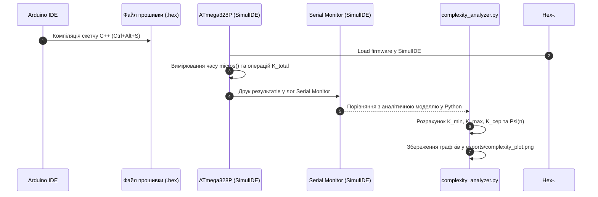

Ось оновлений текст **Практичного заняття № 2**, повністю адаптований під використання **Arduino IDE**, симулятора **SimulIDE** (платформа ATmega328P / Arduino Uno) та **Python** для побудови графіків:

---

# Практичне заняття № 2<br>Оцінювання трудомісткості обчислювальних процесів

**Мета.** Засвоєння практичних навичок аналітичного та експериментального розрахунку часової й ємнісної складності обчислювальних процесів у кіберфізичних системах реального часу, розрахунок кількості елементарних операцій у циклах та розгалуженнях, визначення середнього значущого показника $K_{сер}$ та найгіршого сценарію трудомісткості $\Psi$ (WCET) на базі мікроконтролера ATmega328P у середовищах Arduino IDE та SimulIDE, а також математична апроксимація складності за допомогою асимптотичної $O$-символіки у Python.

**Стек та інструменти:**
*   **Мови програмування:** C/C++ (стандарт C++17 для вбудованих систем), Python (версія v3.10+).
*   **Середовище розробки:** Arduino IDE (версії 1.8.x або 2.x).
*   **Схемотехнічний симулятор:** SimulIDE (версія 0.4.15 або новіша).
*   **Апаратна платформа симуляції:** мікроконтролер ATmega328P (платформа Arduino Uno), послідовний порт UART (Serial Monitor).
*   **Аналітичні бібліотеки Python:** `matplotlib` (для побудови графічних залежностей складності).

---

### 1 Теоретичні відомості

У системному проєктуванні кіберфізичних комплексів обчислювальні процеси функціонують у тісному зв'язку з фізичним часом. На відміну від універсальних програмних систем, де першочерговою є середня швидкість обробки даних, у системах жорсткого реального часу критичне значення має детермінованість та прогнозованість найгіршого часу виконання. Поняття найгіршого часу виконання (з англійської **Worst-Case Execution Time, WCET**) описує максимально можливу тривалість обчислювального процесу при найбільш несприятливих вхідних даних та максимальному завантаженні апаратури. Перевищення розрахованого порогу WCET у КФС вважається системною відмовою, яка може призвести до деструкції фізичного об'єкта.

Часова складність алгоритму визначає загальну кількість елементарних машинних операцій, виконуваних процесором для обробки вхідного сигналу розмірністю $n$. Загальний час виконання алгоритму $T(n)$ описується класичною формулою:

$$
T(n) = \sum_{i=1}^{N} t_i
$$

У наведеній математичній залежності змінна $T(n)$ позначає загальний час виконання алгоритму як функцію від розмірності вхідних даних $n$, змінна $t_i$ відповідає тривалості виконання $i$-ї елементарної операції у секундах, а параметр $N$ визначає загальну кількість таких операцій. У спрощеній обчислювальній моделі з одиничною вартістю припускають, що тривалість кожної елементарної дії є сталою величиною $t_i = 1$, що дозволяє ототожнити час із кількістю виконаних команд.

Для комплексного оцінювання використання апаратних ресурсів мікроконтролера (наприклад, ATmega328P) застосовується універсальна функція трудомісткості $\Psi$:

$$
\Psi = c_1 \cdot F_a(N) + c_2 \cdot M + c_3 \cdot S_d + c_4 \cdot S_r
$$

У наведеній формулі трудомісткості:
*   $F_a(N)$ — часова складність алгоритму, тобто кількість виконаних елементарних операцій у тактах;
*   $M$ — обсяг програмного коду у байтах (розмір Flash-пам'яті, зайнятий прошивкою);
*   $S_d$ — обсяг оперативної пам'яті (SRAM) у байтах, виділений під зберігання статичних та глобальних змінних (буферів);
*   $S_r$ — обсяг оперативної пам'яті у байтах, що витрачається на системний стек та виклики функцій;
*   $c_1, c_2, c_3, c_4$ — безрозмірні вагові коефіцієнти, які визначають дефіцитність кожного ресурсу для конкретної апаратної платформи.

Під час аналізу циклічних та розгалужених алгоритмів загальну кількість елементарних дій $K$ структурують за функціональними категоріями:

$$
K = K_L + K_{AS} + K_A + K_C
$$

де:
*   $K_L$ — кількість виконаних обробок заголовків циклів;
*   $K_{AS}$ — кількість операцій присвоювання значень змінним;
*   $K_A$ — кількість виконаних арифметичних дій;
*   $K_C$ — кількість виконаних порівнянь та обчислень умовних виразів.

Для розгалужених алгоритмів, де шлях виконання залежить від значення вхідного сигналу, розраховується середня кількість операцій $K_{сер}$:

$$
K_{сер} = \frac{K_{min} + K_{max}}{2}
$$

де $K_{min}$ позначає мінімальну кількість операцій, що виконується у найпростішій гілці алгоритму (найкращий випадок), а $K_{max}$ відповідає максимальній кількості операцій у найбільш навантаженій гілці, що формує межу WCET.

Математична апроксимація поведінки алгоритму при прагненні розмірності входу $n$ до нескінченності здійснюється за допомогою асимптотичного аналізу. Верхня межа зростання складності позначається символікою $O(f(n))$, що гарантує, що час виконання алгоритму зростатиме не швидше за функцію $f(n)$, помножену на деяку сталу константу.


*Рисунок 1 — Структурна схема алгоритмічного конвеєра оцінювання часової та ємнісної складності в КФС*

---

### 2 Підготовка середовища та розгортання проєкту (Крок 0)

Для виконання аналітичних та експериментальних розрахунків використовується середовище **Arduino IDE** для компіляції прошивки мікроконтролера, симулятор **SimulIDE** для вимірювання часу виконання через UART та інтерпретатор **Python** із бібліотекою `matplotlib` для побудови графічних залежностей.

#### Крок 0.1. Перевірка та встановлення системних інструментів
1. Перевірте наявність середовища **Arduino IDE** та симулятора **SimulIDE**.
2. Відкрийте системний термінал та перевірте наявність Python:
   ```bash
   python --version
   ```
3. У разі відсутності бібліотеки графічного побудування `matplotlib`, встановіть її через менеджер пакетів `pip`:
   ```bash
   pip install matplotlib
   ```

#### Крок 0.2. Створення структури папок проєкту
Створіть робочий каталог `cps-pz2-complexity` та перейдіть у нього через термінал:

```bash
mkdir cps-pz2-complexity
cd cps-pz2-complexity
mkdir src exports
```

Структура робочого проєкту матиме такий вигляд:

```text
cps-pz2-complexity/
├── cps-pz2-complexity.ino   (Скетч C/C++ для Arduino IDE / ATmega328P)
├── circuit.simu              (Схема симуляції SimulIDE)
├── src/
│   └── complexity_analyzer.py (Скрипт побудови графіків у Python)
└── exports/
    └── complexity_plot.png    (Збережений графік складності)
```

#### Крок 0.3. Налаштування профайлінгу часу та пам'яті у мікроконтролері
*   Для точного вимірювання часу виконання алгоритму в мікроконтролері ATmega328P використовується системний мікросекундний таймер `micros()`.
*   Показники використання Flash-пам'яті ($M$) та оперативної пам'яті SRAM ($S_d$) визначаються безпосередньо зі звіту компілятора Arduino IDE після завершення збірки скетчу.

---

### 3 Порядок виконання роботи

#### 3.1 Індивідуальні завдання

Кожен студент виконує практичне завдання відповідно до обраного варіанта (номер студента у списку групи). Необхідно аналітично розрахувати кількість операцій $K_{min}$, $K_{max}$, $K_{сер}$, обчислити трудомісткість $\Psi$ за вказаними коефіцієнтами та експериментально побудувати графіки часової й ємнісної складності.

> **Примітка щодо пам'яті ATmega328P:** Для експериментального випробування на мікроконтролері з $2\text{ КБ}$ SRAM тестова розмірність вхідного масиву обмежена $n \in [10, 200]$ елементів, тоді як у Python-аналізаторі проводиться математична екстраполяція до великих $n$.

| Варіант | Алгоритмічна задача КФС | Вхідний параметр $n$ (на MCU / аналіз) | Вагові коефіцієнти $(c_1, c_2, c_3, c_4)$ | Розгалуження в циклі | Очікувана асимптотика $O(f(n))$ |
| :---: | :--- | :---: | :---: | :--- | :---: |
| **1** | Фільтрація аномалій телеметрії | $10 \dots 200$ / $100 \dots 10000$ | $(1.5, 0.2, 0.8, 0.5)$ | Перевірка 2-х бар'єрів | $O(n)$ |
| **2** | Пошук пікового тиску в буфері | $10 \dots 200$ / $500 \dots 20000$ | $(1.0, 0.5, 0.5, 1.0)$ | Пошук максимуму з умовою | $O(n)$ |
| **3** | Сортування буфера бульбашкою | $10 \dots 100$ / $50 \dots 2000$ | $(2.0, 0.1, 1.0, 0.2)$ | Обмін сусідніх елементів | $O(n^2)$ |
| **4** | Множення матриці сигналів $n \times n$| $4 \dots 20$ / $10 \dots 300$ | $(1.0, 0.3, 1.5, 0.1)$ | Вкладений цикл обчислень | $O(n^3)$ |
| **5** | Обчислення синуса рядом Тейлора | $5 \dots 50$ / $5 \dots 50$ | $(0.8, 0.4, 0.2, 2.0)$ | Точність зупинки циклу | $O(n)$ |
| **6** | Циклічний зсув масиву датчиків | $10 \dots 200$ / $1000 \dots 50000$| $(1.2, 0.1, 0.6, 0.3)$ | Перевірка межі зсуву | $O(n)$ |
| **7** | Бінарний пошук у таблиці устав | $10 \dots 200$ / $100 \dots 100000$| $(0.5, 0.8, 0.4, 1.2)$ | Ділення інтервалу навпіл | $O(\log n)$ |
| **8** | Сортування вставками телеметрії | $10 \dots 100$ / $50 \dots 2500$ | $(1.8, 0.2, 0.9, 0.4)$ | Вставка в упорядковану частину| $O(n^2)$ |
| **9** | Лінійний пошук з бар'єром | $10 \dots 200$ / $500 \dots 50000$ | $(1.0, 0.3, 0.5, 0.2)$ | Одна перевірка у циклі | $O(n)$ |
| **10** | Дзеркальне відображення матриці | $4 \dots 20$ / $20 \dots 500$ | $(1.1, 0.2, 1.2, 0.3)$ | Попарний обмін in-place | $O(n^2)$ |
| **11** | Ковзне середнє для $n$ замірів | $10 \dots 200$ / $100 \dots 20000$ | $(1.3, 0.1, 0.7, 0.5)$ | Переповнення вікна | $O(n)$ |
| **12** | Обхід матриці датчиків змійкою | $4 \dots 20$ / $20 \dots 400$ | $(1.0, 0.4, 1.1, 0.2)$ | Зміна напрямку за парністю | $O(n^2)$ |
| **13** | Швидке сортування (QuickSort) | $10 \dots 100$ / $100 \dots 10000$ | $(1.4, 0.3, 0.8, 1.5)$ | Рекурсивний поділ (WCET) | $O(n^2)$ |
| **14** | Інтерполяційний пошук у КФС | $10 \dots 200$ / $500 \dots 50000$ | $(0.7, 0.6, 0.5, 1.0)$ | Оцінка позиції за значенням | $O(\log \log n)$ |
| **15** | Знаходження квадратного кореня | $10 \dots 200$ / $10 \dots 1000$ | $(1.0, 0.2, 0.3, 0.8)$ | Ітерації ітераційного методу | $O(\log n)$ |
| **16** | Обчислення автокореляції | $10 \dots 80$ / $50 \dots 1500$ | $(2.2, 0.1, 1.2, 0.4)$ | Сумування зі зсувом | $O(n^2)$ |
| **17** | Пошук підрядка в логах (KMP) | $10 \dots 200$ / $1000 \dots 100000$| $(1.1, 0.5, 0.8, 0.6)$ | Зсув за префікс-функцією | $O(n)$ |
| **18** | Транспонування сітки датчиків | $4 \dots 20$ / $30 \dots 600$ | $(1.0, 0.2, 1.0, 0.1)$ | Елементи вище діагоналі | $O(n^2)$ |
| **19** | Апроксимація сигналу поліномом| $5 \dots 30$ / $10 \dots 200$ | $(1.6, 0.3, 0.9, 0.5)$ | Обчислення степенів | $O(n^2)$ |
| **20** | Декодування пакетів з усуненням | $10 \dots 200$ / $500 \dots 30000$ | $(1.2, 0.4, 0.6, 0.7)$ | Перевірка контрольної суми | $O(n)$ |

---

#### 3.2 Покроковий алгоритм розробки з роз'ясненням коду

Нижче наведено приклад виконання практичного заняття для **Варіанта №1 (Фільтрація аномалій телеметрії)**.

##### Крок 1. Реалізація скетчу C++ в Arduino IDE (`cps-pz2-complexity.ino`)

Створіть у папці проєкту файл скетчу `cps-pz2-complexity.ino`. Код реалізує фільтрацію телеметрії, обчислення точної кількості операцій $K_L, K_{AS}, K_A, K_C$ та вимірювання часу виконання у мікросекундах за допомогою таймера `micros()`.

```cpp
/**
 * Практичне заняття №2. Оцінювання трудомісткості обчислювальних процесів.
 * Варіант №1: Фільтрація аномалій телеметрії для платформи ATmega328P.
 */

#include <Arduino.h>

// Максимальний розмір буфера в SRAM
const int MAX_SAMPLES = 100;
float telemetryData[MAX_SAMPLES];
float filteredBuffer[MAX_SAMPLES];

// Структурні метрики складності виконання
struct ExecutionMetrics {
  unsigned long K_L;     // Заголовки циклів
  unsigned long K_AS;    // Присвоєння
  unsigned long K_A;     // Арифметика
  unsigned long K_C;     // Порівняння
  unsigned long K_total; // Загальна кількість операцій
  unsigned long durationUs; // Час виконання в мікросекундах
};

/**
 * Функція фільтрації телеметрії з підрахунком операцій та вимірюванням WCET
 */
ExecutionMetrics processTelemetryFilter(int n, float lowBarrier, float highBarrier) {
  ExecutionMetrics m = {0, 0, 0, 0, 0, 0};
  
  m.K_AS++; // Ініціалізація лічильника запису
  int filteredCount = 0;

  m.K_AS++; // Ініціалізація лічильника i = 0
  m.K_L++; m.K_C++; // Перша перевірка умови циклу

  // Фіксація початкового часу в мікросекундах
  unsigned long tStart = micros();

  for (int i = 0; i < n; i++) {
    m.K_C++; // Перевірка першої умови розгалуження (T < lowBarrier)
    if (telemetryData[i] < lowBarrier) {
      m.K_AS++; // Відкидання нижньої аномалії
    } 
    else {
      m.K_C++; // Перевірка другої умови розгалуження (T > highBarrier)
      if (telemetryData[i] > highBarrier) {
        m.K_AS++; // Відкидання верхньої аномалії
      } 
      else {
        // Замір у межах норми
        filteredBuffer[filteredCount] = telemetryData[i];
        filteredCount++;
        m.K_AS += 2;
      }
    }

    m.K_A++; m.K_AS++; // Інкремент i++
    m.K_L++; m.K_C++;  // Повторна перевірка умови циклу
  }

  // Фіксація кінцевого часу
  unsigned long tEnd = micros();
  m.durationUs = tEnd - tStart;
  m.K_total = m.K_L + m.K_AS + m.K_A + m.K_C;

  return m;
}

void setup() {
  Serial.begin(9600);
  delay(1000);

  Serial.println(F("=================================================="));
  Serial.println(F(" КФС: Аналіз часової складності та WCET (ATmega328P)"));
  Serial.println(F(" Стратегія: Відсікання бар'єрами телеметрії"));
  Serial.println(F("=================================================="));

  int testSizes[] = {10, 20, 50, 100};
  float lowB = 15.0, highB = 40.0;

  for (int idx = 0; idx < 4; idx++) {
    int n = testSizes[idx];

    // Заповнення масиву тестовими даними (суміш норми та аномалій)
    for (int i = 0; i < n; i++) {
      telemetryData[i] = random(50, 500) / 10.0; // Значення 5.0 ... 50.0
    }

    ExecutionMetrics res = processTelemetryFilter(n, lowB, highB);

    Serial.print(F("Розмірність n = ")); Serial.print(n);
    Serial.print(F(" | K_total = ")); Serial.print(res.K_total);
    Serial.print(F(" | Час = ")); Serial.print(res.durationUs);
    Serial.println(F(" us"));

    Serial.print(F("  [Деталі] K_L=")); Serial.print(res.K_L);
    Serial.print(F(", K_AS=")); Serial.print(res.K_AS);
    Serial.print(F(", K_A=")); Serial.print(res.K_A);
    Serial.print(F(", K_C=")); Serial.println(res.K_C);
    Serial.println(F("--------------------------------------------------"));
  }
}

void loop() {
  // Одноразовий запуск у setup()
}
```

##### Крок 2. Розробка аналітичного та графічного скрипта у Python (`src/complexity_analyzer.py`)

Створіть файл `src/complexity_analyzer.py`, який моделює розрахунок функції трудомісткості $\Psi$, будує порівняльні графіки для великих $n$ та зберігає їх у папку `exports`:

```python
"""
Практичне заняття №2. Оцінювання трудомісткості обчислювальних процесів.
Скрипт розрахунку функції трудомісткості Psi, K_сер та побудови графіків.
"""

import os
import sys
import time
import matplotlib.pyplot as plt

def calculate_complexity(n, c1=1.5, c2=0.2, c3=0.8, c4=0.5):
    """
    Аналітичний розрахунок складності для Варіанта №1 (Фільтрація аномалій).
    """
    # Найкращий випадок: Усі елементи відсікаються першим бар'єром K_min
    K_L_min = n + 1
    K_AS_min = n + 3
    K_A_min = n
    K_C_min = 2 * n + 1
    K_min = K_L_min + K_AS_min + K_A_min + K_C_min

    # Найгірший випадок WCET: Усі елементи переходять до другої перевірки K_max
    K_L_max = n + 1
    K_AS_max = 2 * n + 3
    K_A_max = n
    K_C_max = 3 * n + 1
    K_max = K_L_max + K_AS_max + K_A_max + K_C_max

    # Середня кількість операцій
    K_avg = (K_min + K_max) / 2.0

    # Розрахунок ємнісних параметрів у байтах для платформи ATmega328P
    M_code = 4500 # Оцінка розміру Flash-пам'яті (байтів)
    S_d = n * 4   # Пам'ять SRAM під масив float (байтів)
    S_r = 32      # Стекова пам'ять під виклики функцій (байтів)

    # Розрахунок універсальної функції трудомісткості Psi
    psi_val = c1 * K_avg + c2 * M_code + c3 * S_d + c4 * S_r

    return K_min, K_max, K_avg, psi_val

def run_benchmarks():
    sizes = [100, 500, 1000, 2500, 5000, 7500, 10000]
    
    k_avg_list = []
    psi_list = []

    print("==================================================")
    print(" РЕЗУЛЬТАТИ АНАЛІТИЧНОГО РОЗРАХУНКУ ТРУДОМІСТКОСТІ")
    print("==================================================")

    for n in sizes:
        k_min, k_max, k_avg, psi = calculate_complexity(n)
        k_avg_list.append(k_avg)
        psi_list.append(psi)

        print(f"n = {n:5d} | K_min = {k_min:6.0f} | K_max = {k_max:6.0f} | K_сер = {k_avg:6.1f} | Psi = {psi:8.1f}")

    # Побудова графічної залежності
    os.makedirs("../exports", exist_ok=True)
    
    plt.figure(figsize=(10, 6))
    plt.plot(sizes, psi_list, 'o-', color='blue', label='Функція трудомісткості Ψ(n)')
    plt.plot(sizes, k_avg_list, 's--', color='green', label='Середня кількість операцій K_сер(n)')
    
    plt.title('Залежність трудомісткості та кількості операцій від розмірності входу n', fontsize=12)
    plt.xlabel('Розмірність вхідного масиву n (елементів)', fontsize=10)
    plt.ylabel('Величина показника (одиниць)', fontsize=10)
    plt.grid(True, linestyle=':', alpha=0.6)
    plt.legend()
    
    plot_path = os.path.join("../exports", "complexity_plot.png")
    plt.savefig(plot_path, dpi=300)
    print("--------------------------------------------------")
    print(f"Графік успішно збережено у файл: {plot_path}")
    print("==================================================")

if __name__ == "__main__":
    run_benchmarks()
```

##### Крок 3. Схема конвеєра експериментального профайлінгу в SimulIDE

Взаємодія інструментів під час виконання хронометражу та аналізу подана на рисунку 2.


*Рисунок 2 — Послідовність взаємодії апаратно-симуляційного комплексу та аналітичного скрипта Python*

---

##### Крок 4. Запуск та зняття метрик

1. У середовищі **Arduino IDE** зкомпілюйте скетч та експортуйте двійковий файл: **Sketch -> Export Compiled Binary** (`Ctrl + Alt + S`).
2. Запустіть **SimulIDE**, завантажте файл `.hex` у мікроконтролер **ATmega328P**, відкрийте **Serial Monitor** та запустіть симуляцію.
3. Запустіть аналітичний скрипт Python у терміналі:
   ```bash
   cd src
   python complexity_analyzer.py
   ```

**Приклад очікуваного виведення у Serial Monitor (SimulIDE):**

```text
==================================================
 КФС: Аналіз часової складності та WCET (ATmega328P)
 Стратегія: Відсікання бар'єрами телеметрії
==================================================
Розмірність n = 10 | K_total = 74 | Час = 112 us
  [Деталі] K_L=11, K_AS=23, K_A=10, K_C=30
--------------------------------------------------
Розмірність n = 20 | K_total = 144 | Час = 216 us
  [Деталі] K_L=21, K_AS=43, K_A=20, K_C=60
--------------------------------------------------
Розмірність n = 50 | K_total = 354 | Час = 528 us
  [Деталі] K_L=51, K_AS=103, K_A=50, K_C=150
--------------------------------------------------
Розмірність n = 100 | K_total = 704 | Час = 1048 us
  [Деталі] K_L=101, K_AS=203, K_A=100, K_C=300
--------------------------------------------------
```

---

### 4 Вимоги до змісту звіту

Звіт з практичного заняття оформлюється у форматі PDF або MS Word і повинен містити наступні обов'язкові розділи:

1.  **Титульна сторінка.**
    *   Назва вищого навчального закладу, кафедри, дисципліни.
    *   Номер та назва лабораторної роботи, номер обраного варіанта.
    *   ПІБ, шифр навчальної групи.
2.  **Мета роботи, короткі теоретичні відомості та опис отриманого завдання.**
    *   Виклад основного теоретичного базису.
    *   Опис завдання згідно з таблицею варіантів.
3.  **Схемотехнічна модель SimulIDE.** Скріншот робочого поля симулятора з підключеною платою Arduino Uno та відкритим вікном Serial Monitor.
4.  **Аналітичний розрахунок.**
    *   Розгорнуті математичні вирази для $K_L$, $K_{AS}$, $K_A$, $K_C$ як функції від $n$.
    *   Аналітичний розрахунок $K_{min}$, $K_{max}$ та $K_{сер}$.
    *   Підсумкова формула функції трудомісткості $\Psi(n)$ із підставленими ваговими коефіцієнтами для ATmega328P.
5.  **Програмний код.** Повний код скетчу `cps-pz2-complexity.ino` та Python-скрипта `src/complexity_analyzer.py` з коментарями.
6.  **Експериментальні результати.** Скріншоти логів з Serial Monitor та роздрукований графік з папки `exports/complexity_plot.png`.
7.  **Висновки.** Обґрунтування відповідності експериментально отриманої складності теоретичній $O$-символіці, аналіз впливу розгалужень на WCET та оцінка придатності алгоритму для систем жорсткого реального часу.

---

### 5 Контрольні запитання

1.  У чому полягає фундаментальна відмінність між оцінюванням алгоритмів у системах м'якого та жорсткого реального часу? Чому показник WCET є вирішальним для КФС?
2.  Поясніть фізичний зміст кожного зі складників функції трудомісткості $\Psi = c_1 \cdot F_a(N) + c_2 \cdot M + c_3 \cdot S_d + c_4 \cdot S_r$. Як обмеження Flash та SRAM пам'яті мікроконтролера ATmega328P впливають на коефіцієнти $c_2$ та $c_3$?
3.  Яким чином наявність умовних розгалужень у тілі циклу впливає на різницю між мінімальною кількістю операцій $K_{min}$ та максимальною $K_{max}$? Поясніть фізичний зміст $K_{сер}$.
4.  У чому полягає відмінність між асимптотичними оцінками $O(f(n))$, $\Omega(f(n))$ та $\Theta(f(n))$ у контексті найгіршого, найкращого та середнього випадків виконання алгоритму?
5.  Як використання системного таймера `micros()` в Arduino IDE дозволяє експериментально вимірювати тривалість виконання обчислювальних процедур КФС?
