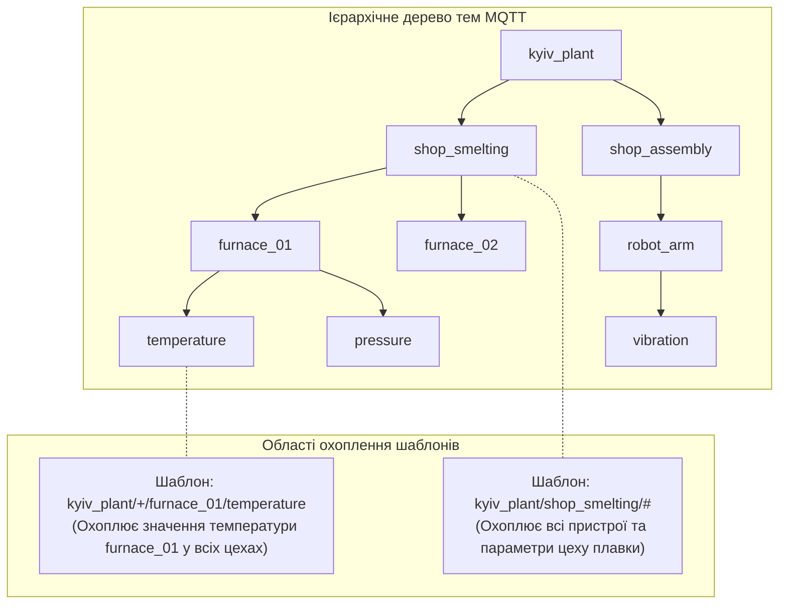
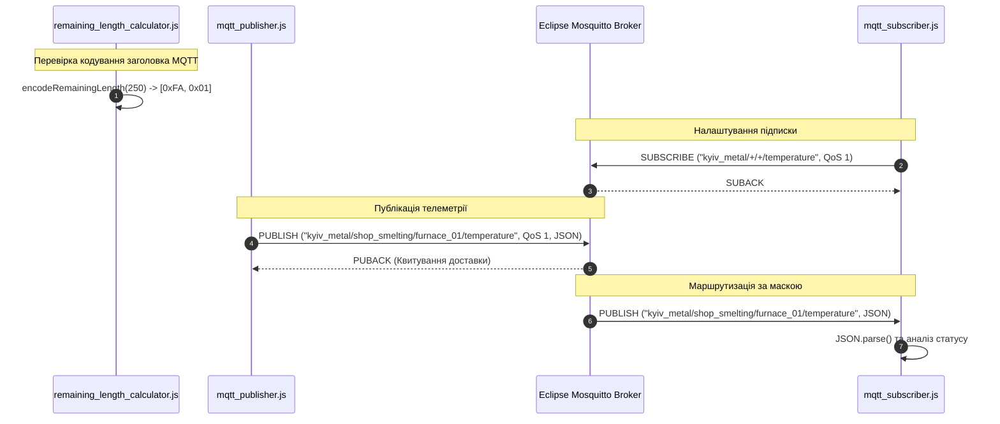

# Практичне заняття № 3<br>Проєктивання ієрархії тем MQTT


**Мета.** Засвоєння практичних навичок проєктування структурованих ієрархічних тем (топіків) протоколу MQTT для великих мереж давачів у промисловому Інтернеті речей (IIoT), опанування механізмів маскування та фільтрації за допомогою шаблонів підписки (`+` та `#`), аналіз алгоритму розрахунку кодування остаточної довжини (Remaining Length) у фіксованому заголовку MQTT-пакета, а також розробка скриптів публікації та маршрутизації телеметрії мовою JavaScript у середовищі Node.js.  

**Стек та інструменти:** MQTT-брокер Eclipse Mosquitto, консольні утиліти `mosquitto_sub` та `mosquitto_pub`, кросплатформовий графічний клієнт MQTT Explorer, середовище виконання Node.js (версія v18+), пакет `mqtt`, кодування UTF-8, формат даних JSON.  

---

### 1 Теоретичні відомості

У сучасних кіберфізичних системах та промисловому Інтернеті речей обмін даними між мільйонами розподілених сенсорних вузлів і серверами аналітики вимагає застосування протоколів із мінімальним мережевим накладом. Протокол MQTT (Message Queuing Telemetry Transport) функціонує поверх транспортного протоколу TCP/IP і базується на брокер-центричній архітектурі «публікація/підписка» (publish/subscribe). У цій моделi пристрої-джерела телеметрії (публікатори) не взаємодіють напряму з пристроями-споживачами (підписниками), що забезпечує повне розв'язання вузлів у часі, просторі та за мережевими адресами.

Центральним елементом маршрутизації даних виступає **MQTT-брокер**. Всі повідомлення, що передаються через брокер, маркуються **темами (топіками)**. Тема являє собою текстовий рядок у кодуванні UTF-8, що має ієрархічну структуру, де окремі рівні розділяються символом похилої риски `/`. Для промислових об'єктів стандартом де-факто є побудова чотирирівневих дерев тем, що відповідають фізичній та логічній топології підприємства:

$$
\text{Структура теми} = \text{фабрика} / \text{цех} / \text{пристрій} / \text{параметр}
$$

Для гнучкого налаштування маршрутизації та збору агрегованої телеметрії підписники можуть використовувати спеціальні символи шаблонів (wildcards):

Використання однорівневого шаблону підписки, що позначається символом плюс `+`, дозволяє заміщувати рівно один логічний рівень у структурі теми. Наприклад, підписка на тему `zavod_kyiv/+/press_01/temperature` забезпечить отримання даних про температуру преса №1 з усіх цехів київського заводу.

Застосування багаторівневого шаблону підписки, що позначається символом решітки `#`, дозволяє заміщувати всі наступні підрівні ієрархії, починаючи з позиції символу. Багаторівневий шаблон обов'язково повинен розміщуватися останнім символом у рядку теми. Наприклад, підписка `zavod_kyiv/shop_boiler/#` дає змогу отримувати геть усю телеметрію з усіх пристроїв та датчиків котельного цеху.



*Рисунок 1 — Ієрархічне дерево тем MQTT та області охоплення шаблонів підписки + та #*

На рисунку 1 зображено принцип логічної адресації телеметрії. Структура тем розгалужується від кореневого рівня підприємства до конкретних вимірювальних параметрів, а шаблони підписки дозволяють агрегувати потоки даних з різних гілок дерева за допомогою одного мережевого запиту.

Кожен кадр протоколу MQTT містить фіксований заголовок (Fixed Header) розміром 2 байти, де перший байт відповідає за тип пакета та прапорці, а наступні байти кодують остаточну довжину корисного навантаження (Remaining Length). Для забезпечення мінімального розміру кадру кодування остаточної довжини виконується за алгоритмом ущільнення байтів зі змінною довжиною (від 1 до 4 байтів).

У кожному байті поля остаточної довжини 7 молодших бітів використовуються для кодування числа, а 8-й старший біт (біт продовження, continuation bit) вказує на наявність наступного байта довжини. Якщо 8-й біт дорівнює `1`, це означає, що наступний байт також належить до поля довжини. Математичне декодування залишковій довжини $L$ у байтах виконується за формулою:

$$
L = \sum_{i=1}^{n} (B_i \wedge 127) \cdot 128^{i-1}
$$

У наведеній формулі змінна $L$ позначає підсумкову обчислену довжину корисного навантаження у байтах, параметр $n$ визначає кількість байтів, використаних для кодування довжини (від $1$ до $4$), змінна $B_i$ відповідає значенню $i$-го байта поля довжини, а побітова операція $\wedge 127$ виконує побітове «І» з числом 127 для обнулення старшого біта продовження.

Максимальна пропускна здатність каналу зв'язку $C$, яка визначає часову складність відправки MQTT-пакетів через зашумлене середовище, розраховується за **теоремою Шеннона-Гартлі**:

$$
C = W \cdot \log_2\left(1 + \frac{S}{N}\right)
$$

де змінна $C$ позначає максимальну швидкість передачі даних у бітах за секунду ($\text{біт/с}$), змінна $W$ відповідає смузі пропускання каналу у герцах ($\text{Гц}$), а безрозмірний параметр $S/N$ відображає відношення потужності сигналу до потужності шуму.

Розрахунок тривалості автономної роботи акумулятора $T_{life}$ для сенсорного вузла IIoT, що надсилає MQTT-повідомлення, виконується за формулами:

$$
T_{life} = \frac{C_{bat}}{I_{avg} \cdot 24 \cdot 365}, \quad I_{avg} = \frac{I_{active} \cdot t_{active} + I_{sleep} \cdot t_{sleep}}{t_{cycle}}
$$

де параметр $C_{bat}$ позначає ємність акумулятора у міліампер-годинах ($\text{мА}\cdot\text{год}$), змінна $I_{avg}$ відповідає середньому струму споживання у міліамперах ($\text{мА}$), змінні $I_{active}$ та $t_{active}$ описують струм ($\text{мА}$) та тривалість ($\text{с}$) фази відправки MQTT-пакета, змінні $I_{sleep}$ та $t_{sleep}$ описують струм та тривалість режиму сну, а параметр $t_{cycle}$ визначає загальний період опитування у секундах.

---

### 2 Підготовка середовища та розгортання проєкту (Крок 0)

Для виконання практичних завдань необхідно розгорнути локальний MQTT-брокер Mosquitto, встановити консольні утиліти та налаштувати Node.js проєкт.

#### Крок 0.1. Встановлення MQTT-брокера та консольних утиліт
Залежно від операційної системи виконайте розгортання брокера Eclipse Mosquitto:

*   **Linux (Ubuntu/Debian):**
    ```bash
    sudo apt update
    sudo apt install -y mosquitto mosquitto-clients
    sudo systemctl enable --now mosquitto
    ```
*   **Windows:** Завантажте інсталятор з офіційного сайту [mosquitto.org](https://mosquitto.org/download/) та встановіть сервіс.

Перевірте статус роботи брокера на локальному порту `1883`:

```bash
mosquitto_sub -h localhost -t "test/status" -v
```

У новому терміналі відправте тестовий сигнал:

```bash
mosquitto_pub -h localhost -t "test/status" -m "Broker Active"
```

#### Крок 0.2. Створення проєкту Node.js та встановлення залежностей
Створіть робочу директорію `cps-pz3-mqtt-hierarchy` та ініціалізуйте проєкт Node.js:

```bash
mkdir cps-pz3-mqtt-hierarchy
cd cps-pz3-mqtt-hierarchy
npm init -y
```

Встановіть офіційну бібліотеку `mqtt` для Node.js:

```bash
npm install mqtt
```

Створіть папку `src` та необхідні файли проєкту:

```bash
mkdir src
touch src/remaining_length_calculator.js
touch src/mqtt_publisher.js
touch src/mqtt_subscriber.js
```

Структура папок проєкту матиме такий вигляд:

```
cps-pz3-mqtt-hierarchy/
├── node_modules/
├── package.json
└── src/
    ├── mqtt_publisher.js                 (Скрипт генерування телеметрії)
    ├── mqtt_subscriber.js                (Скрипт маршрутизації з масками)
    └── remaining_length_calculator.js   (Декодер заголовка MQTT)
```

#### Крок 0.3. Довідка щодо структури JSON-повідомлення
Повідомлення телеметрії передаються у форматі JSON. Кожен пакет містить ідентифікатор пристрою, мітку часу ISO 8601, значення параметра, одиниці вимірювання та діагностичний статус:

```json
{
  "timestamp": "2026-08-12T12:00:00.000Z",
  "factory": "kyiv_metal",
  "shop": "shop_smelting",
  "device": "furnace_01",
  "metric": "temperature",
  "value": 1250.45,
  "unit": "degC",
  "status": "NORMAL"
}
```

---

### 3 Порядок виконання роботи

#### 3.1 Індивідуальні завдання

Параметри ієрархії тем, обладнання та телеметрії обираються з наведеної нижче таблиці відповідно до номера вашого варіанта (номер у списку групи).

| Варіант | Назва підприємства | Підрозділи (Цехи) | Пристрої (Обладнання) | Телеметричний параметр | Розмір корисного кадру | Маска підписки для тестування | Рівень QoS |
| :---: | :--- | :--- | :--- | :--- | :---: | :---: | :---: |
| **1** | `kyiv_metal` | `shop_smelting`, `shop_rolling` | `furnace_01`, `press_02` | `temperature` | $250\ \text{б}$ | `kyiv_metal/+/+/temperature` | QoS 1 |
| **2** | `dnipro_auto` | `shop_assembly`, `shop_paint` | `robot_arm_1`, `dryer_03` | `vibration` | $180\ \text{б}$ | `dnipro_auto/shop_assembly/#` | QoS 2 |
| **3** | `lviv_pharma` | `shop_clean`, `shop_pack` | `reactor_v2`, `capper_01` | `pressure` | $320\ \text{б}$ | `lviv_pharma/+/+/pressure` | QoS 0 |
| **4** | `kharkiv_chem` | `shop_acid`, `shop_synthesis` | `pump_p102`, `column_c1` | `flow_rate` | $120\ \text{б}$ | `kharkiv_chem/shop_acid/#` | QoS 1 |
| **5** | `odesa_port` | `grain_terminal`, `oil_depot` | `conveyor_c1`, `valve_v12` | `load_weight` | $450\ \text{б}$ | `odesa_port/+/+/load_weight` | QoS 2 |
| **6** | `zap_power` | `turbine_hall`, `reactor_hall`| `generator_g1`, `pump_p01` | `frequency` | $95\ \text{б}$ | `zap_power/turbine_hall/#` | QoS 1 |
| **7** | `vin_agro` | `greenhouse_01`, `greenhouse_02`| `climate_node`, `irrigation` | `humidity` | $210\ \text{б}$ | `vin_agro/+/+/humidity` | QoS 0 |
| **8** | `poltava_gas` | `well_site_12`, `compressor_st`| `compressor_k4`, `separator` | `gas_pressure` | $500\ \text{б}$ | `poltava_gas/well_site_12/#` | QoS 2 |
| **9** | `chernihiv_paper`| `shop_paper`, `shop_pulp` | `dryer_d02`, `mixer_m01` | `temp_roller` | $310\ \text{б}$ | `chernihiv_paper/+/+/temp_roller` | QoS 1 |
| **10** | `sumy_machine` | `shop_cnc`, `shop_foundry` | `milling_m01`, `lathe_l02` | `spindle_speed` | $140\ \text{б}$ | `sumy_machine/shop_cnc/#` | QoS 0 |
| **11** | `rivne_basalt` | `crushing_plant`, `kiln_dept` | `jaw_crusher`, `feeder_f1` | `current_draw` | $280\ \text{б}$ | `rivne_basalt/+/+/current_draw` | QoS 1 |
| **12** | `zhytomyr_milk` | `pasteurizer_dept`, `cheese_shop`| `tank_t3`, `homogenizer` | `level_liters` | $160\ \text{б}$ | `zhytomyr_milk/pasteurizer_dept/#` | QoS 2 |
| **13** | `kremenchuk_oil`| `refinery_unit`, `blending_shop`| `cracking_c1`, `pump_p301` | `temp_column` | $620\ \text{б}$ | `kremenchuk_oil/+/+/temp_column` | QoS 1 |
| **14** | `ternopil_solar`| `inverter_st_1`, `inverter_st_2`| `inverter_i05`, `tracker_t1` | `dc_voltage` | $110\ \text{б}$ | `ternopil_solar/inverter_st_1/#` | QoS 0 |
| **15** | `frankivsk_cement`| `kiln_dept`, `mill_dept` | `rotary_kiln`, `ball_mill` | `torque` | $800\ \text{б}$ | `frankivsk_cement/+/+/torque` | QoS 2 |
| **16** | `lutsk_plastic` | `injection_shop`, `extrusion_shop`| `moulding_m04`, `extrud_e2` | `oil_pressure` | $230\ \text{б}$ | `lutsk_plastic/injection_shop/#` | QoS 1 |
| **17** | `cherkasy_azot` | `ammonia_shop`, `urea_shop` | `synthesis_s2`, `granulator` | `gas_temp` | $1200\ \text{б}$ | `cherkasy_azot/+/+/gas_temp` | QoS 2 |
| **18** | `zakarpattia_wind`| `wind_farm_01`, `wind_farm_02` | `turbine_t12`, `pitch_ctrl` | `wind_speed` | $170\ \text{б}$ | `zakarpattia_wind/wind_farm_01/#` | QoS 0 |
| **19** | `kropyv_oil` | `extraction_shop`, `refining_shop`| `extractor_e1`, `press_p02` | `solvent_level` | $290\ \text{б}$ | `kropyv_oil/+/+/solvent_level` | QoS 1 |
| **20** | `mfg_smart_city`| `water_pumping`, `boiler_house` | `pump_station_3`, `boiler_b1` | `water_head` | $400\ \text{б}$ | `mfg_smart_city/water_pumping/#` | QoS 2 |

---

#### 3.2 Покроковий алгоритм розробки з роз'ясненням коду

##### Крок 1. Реалізація розрахунку кодування Remaining Length (`src/remaining_length_calculator.js`)

Відкрийте файл `src/remaining_length_calculator.js` та вставте повний код декодера й енкодера фіксованого заголовка MQTT:

```javascript
/**
 * Модуль розрахунку кодування остаточної довжини (Remaining Length) MQTT.
 * Реалізує алгоритм стиснення байтів зі змінною довжиною (Variable Byte Integer).
 */

/**
 * Енкодер: кодує числову довжину у масив байтів MQTT (від 1 до 4 байтів).
 * @param {number} length - Довжина корисного навантаження у байтах.
 * @returns {Array<number>} Масив кодованих байтів.
 */
function encodeRemainingLength(length) {
    const encodedBytes = [];
    let x = length;
    
    do {
        let encodedByte = x % 128; // Виділення 7 бітів даних
        x = Math.floor(x / 128);
        
        // Якщо є ще дані, встановлюємо 8-й біт продовження (128)
        if (x > 0) {
            encodedByte = encodedByte | 128;
        }
        encodedBytes.push(encodedByte);
    } while (x > 0);

    return encodedBytes;
}

/**
 * Декодер: перетворює масив кодованих байтів MQTT у числову довжину.
 * @param {Array<number>} bytes - Масив байтів поля довжини.
 * @returns {number} Обчислена остаточна довжина у байтах.
 */
function decodeRemainingLength(bytes) {
    let multiplier = 1;
    let value = 0;
    
    for (let i = 0; i < bytes.length; i++) {
        const encodedByte = bytes[i];
        // Побітове І з 127 видаляє 8-й біт продовження
        value += (encodedByte & 127) * multiplier;
        multiplier *= 128;
        
        // Якщо 8-й біт дорівнює 0, кодування завершено
        if ((encodedByte & 128) === 0) {
            break;
        }
    }
    return value;
}

// Тестування роботи алгоритму для Варіанта №1 (розмір кадру 250 байтів)
const testPayloadLength = 250; // розмір у байтах з Варіанта №1
const encoded = encodeRemainingLength(testPayloadLength);
const decoded = decodeRemainingLength(encoded);

console.log("==================================================");
console.log(" АНАЛІЗ КОДУВАННЯ ZАГОЛОВКА MQTT (REMAINING LENGTH)");
console.log("==================================================");
console.log(`Вхідна довжина кадру: ${testPayloadLength} байтів`);
console.log(`Кодовані байти заголовка (HEX): [ ${encoded.map(b => '0x' + b.toString(16).toUpperCase()).join(', ')} ]`);
console.log(`Кількість байтів заголовка: ${encoded.length} байт(и)`);
console.log(`Декодована довжина: ${decoded} байтів`);
console.log(`Результат перевірки: ${testPayloadLength === decoded ? "УСПІШНО (Збігається)" : "ПОМИЛКА"}`);
console.log("==================================================\n");

module.exports = { encodeRemainingLength, decodeRemainingLength };
```

##### Крок 2. Реалізація генерування та публікації телеметрії (`src/mqtt_publisher.js`)

Відкрийте файл `src/mqtt_publisher.js` та вставте наступний код для публікації структурованих JSON-повідомлень за варіантною ієрархією:

```javascript
/**
 * Модуль публікації телеметрії КФС за протоколом MQTT (Варіант №1).
 * Формує топіки вигляду "фабрика/цех/пристрій/параметр" та надсилає JSON-пакети.
 */

const mqtt = require('mqtt');

// 1. Конфігурація підключення до MQTT-брокера
const brokerUrl = 'mqtt://localhost:1883';
const clientOptions = {
    clientId: 'publisher_kyiv_metal_node',
    clean: true,
    connectTimeout: 4000
};

// 2. Параметри варіанта завдання (Варіант №1)
const factory = "kyiv_metal";
const shops = ["shop_smelting", "shop_rolling"];
const devices = ["furnace_01", "press_02"];
const metric = "temperature";
const qosLevel = 1; // QoS 1 з Варіанта №1

console.log("Підключення до MQTT-брокера...");
const client = mqtt.connect(brokerUrl, clientOptions);

client.on('connect', () => {
    console.log("[УСПІХ] Підключено до MQTT-брокера Mosquitto!");
    
    // Інтервальна відправка телеметрії кожні 2 секунди
    setInterval(() => {
        // Випадковий вибір цеху та пристрою для розгалуження топіків
        const shop = shops[Math.floor(Math.random() * shops.length)];
        const device = devices[Math.floor(Math.random() * devices.length)];
        
        // Побудова ієрархічного топіка
        const topic = `${factory}/${shop}/${device}/${metric}`;
        
        // Генерація значення температури у діапазоні 500 - 1500 degC
        const tempVal = parseFloat((500.0 + Math.random() * 1000.0).toFixed(2));
        
        // Формування структурованого JSON-пакета
        const payloadObject = {
            timestamp: new Date().toISOString(),
            factory: factory,
            shop: shop,
            device: device,
            metric: metric,
            value: tempVal,
            unit: "degC",
            status: tempVal > 1400.0 ? "CRITICAL" : "NORMAL"
        };

        const payloadString = JSON.stringify(payloadObject);

        // Публікація повідомлення з вказаним QoS
        client.publish(topic, payloadString, { qos: qosLevel, retain: false }, (err) => {
            if (!err) {
                console.log(`[ОПУБЛІКОВАНО] Топік: ${topic} | QoS: ${qosLevel}`);
                console.log(`  Payload: ${payloadString}`);
            } else {
                console.error(`[ПОМИЛКА ПУБЛІКАЦІЇ] ${err.message}`);
            }
        });
    }, 2000);
});

client.on('error', (err) => {
    console.error(`[ПОМИЛКА МЕРЕЖІ] Не вдалося підключитися: ${err.message}`);
});
```

##### Крок 3. Реалізація підписника та маршрутизатора з масками (`src/mqtt_subscriber.js`)

Відкрийте файл `src/mqtt_subscriber.js` та додайте код підписника, який демонструє обробку однорівневих `+` та багаторівневих `#` шаблонів:

```javascript
/**
 * Модуль підписника та маршрутизатора телеметрії MQTT (Варіант №1).
 * Демонструє підписку за маскою "kyiv_metal/+/+/temperature" та обробку аномалій.
 */

const mqtt = require('mqtt');

const brokerUrl = 'mqtt://localhost:1883';
const clientOptions = {
    clientId: 'subscriber_kyiv_metal_router',
    clean: true
};

// Варіантна маска підписки з використанням однорівневих шаблонів '+'
const wildcardTopic = "kyiv_metal/+/+/temperature";
const qosLevel = 1;

const client = mqtt.connect(brokerUrl, clientOptions);

client.on('connect', () => {
    console.log("[УСПІХ] Підписник підключився до брокера!");
    
    // Оформлення підписки за маскою
    client.subscribe(wildcardTopic, { qos: qosLevel }, (err, granted) => {
        if (!err) {
            console.log(`[ПІДПИСКА АКТИВНА] Маска топіка: "${wildcardTopic}" | Наданий QoS: ${granted[0].qos}`);
            console.log("Очікування потоку телеметрії...\n--------------------------------------------------");
        } else {
            console.error(`[ПОМИЛКА ПІДПИСКИ] ${err.message}`);
        }
    });
});

// Обробник надходження нових повідомлень з брокера
client.on('message', (topic, message) => {
    console.log(`\n[ОТРИМАНО ПОВІДОМЛЕННЯ] Топік: ${topic}`);
    
    try {
        // Десеріалізація JSON-пакета
        const telemetry = JSON.parse(message.toString());
        
        console.log(`  Джерело: Фабрика "${telemetry.factory}", Цех "${telemetry.shop}", Пристрій "${telemetry.device}"`);
        console.log(`  Параметр: ${telemetry.metric} = ${telemetry.value} ${telemetry.unit}`);
        console.log(`  Метка часу: ${telemetry.timestamp}`);
        
        if (telemetry.status === "CRITICAL") {
            console.warn(`  [УВАГА: КРИТИЧНИЙ СТАН] Перевищено критичний поріг для ${telemetry.device}!`);
        }
    } catch (e) {
        console.error(`  [ПОМИЛКА ПАРСИНГУ JSON] Некоректний формат: ${e.message}`);
    }
});
```

---

### 3.3 Схема маршрутизації та декодування повідомлень

Принцип взаємодії програмних скриптів та брокера Mosquitto під час тестування маршрутизації зображено на рисунку 2.


*Рисунок 2 — Схема маршрутизації та декодування повідомлень у мережі MQTT*

На рисунку 2 зображено послідовність дій під час виконання лабораторного сценарію. Модуль розрахунку перевіряє правильність ущільнення заголовка кадру, підписник реєструє тему з однорівневими шаблонами `+`, після чого публікатор надсилає JSON-телеметрію, яку брокер маршрутизує до підписника.

---

### 3.4 Запуск та перевірка функціонування

#### Крок 1. Перевірка розрахунку Remaining Length
Запустіть скрипт декодування заголовка MQTT у терміналі:

```bash
node src/remaining_length_calculator.js
```

#### Крок 2. Запуск підписника MQTT
У першому вікні термінала запустіть скрипт підписника:

```bash
node src/mqtt_subscriber.js
```

#### Крок 3. Запуск публікатора MQTT
У другому вікні термінала запустіть скрипт генерації та публікації телеметрії:

```bash
node src/mqtt_publisher.js
```

#### Крок 4. Моніторинг за допомогою консольних утиліт Mosquitto
У третьому терміналі перевірте роботу підписки за багаторівневим шаблоном `#`:

```bash
mosquitto_sub -h localhost -t "kyiv_metal/#" -v
```

**Приклад очікуваного виведення у терміналі підписника (`mqtt_subscriber.js`):**

```text
==================================================
 АНАЛІЗ КОДУВАННЯ ZАГОЛОВКА MQTT (REMAINING LENGTH)
==================================================
Вхідна довжина кадру: 250 байтів
Кодовані байти заголовка (HEX): [ 0xFA, 0x1 ]
Кількість байтів заголовка: 2 байт(и)
Декодована довжина: 250 байтів
Результат перевірки: УСПІШНО (Збігається)
==================================================

[УСПІХ] Підписник підключився до брокера!
[ПІДПИСКА АКТИВНА] Маска топіка: "kyiv_metal/+/+/temperature" | Наданий QoS: 1
Очікування потоку телеметрії...
--------------------------------------------------

[ОТРИМАНО ПОВІДОМЛЕННЯ] Топік: kyiv_metal/shop_smelting/furnace_01/temperature
  Джерело: Фабрика "kyiv_metal", Цех "shop_smelting", Пристрій "furnace_01"
  Параметр: temperature = 1245.8 degC
  Метка часу: 2026-08-12T12:05:10.123Z

[ОТРИМАНО ПОВІДОМЛЕННЯ] Топік: kyiv_metal/shop_rolling/press_02/temperature
  Джерело: Фабрика "kyiv_metal", Цех "shop_rolling", Пристрій "press_02"
  Параметр: temperature = 1420.1 degC
  Метка часу: 2026-08-12T12:05:12.125Z
  [УВАГА: КРИТИЧНИЙ СТАН] Перевищено критичний поріг для press_02!
```

---

### 4 Вимоги до змісту звіту

Звіт з практичного заняття оформлюється у форматі PDF або MS Word відповідно до встановлених академічних стандартів і повинен містити наступні обов'язкові розділи:

1.  **Титульна сторінка.**
    *   Назва вищого навчального закладу, кафедри, дисципліни.
    *   Номер та назва лабораторної роботи, номер обраного варіанта.
    *   ПІБ, шифр навчальної групи.
2.  **Мета роботи, короткі теоретичні відомості та опис отриманого завдання.**
    *   Виклад основного теоретичного базису.
    *   Опис завдання згідно з таблицею варіантів.
3.  **Дерево тем MQTT.** Графічне зображення або текстова діаграма ієрархічного дерева тем, розробленого для вашого підприємства.
4.  **Аналітичний розрахунок.**
    *   Покроковий розрахунок кодування остаточної довжини (Remaining Length) для вказаного у варіанті розміру кадру.
    *   Розрахунок пропускної здатності каналу $C$ за теоремою Шеннона-Гартлі для вашої мережі.
    *   Розрахунок терміну автономної роботи акумулятора $T_{life}$ при заданій частоті MQTT-публікацій.
5.  **Програмний код рішення.** Повний код файлів `src/remaining_length_calculator.js`, `src/mqtt_publisher.js` та `src/mqtt_subscriber.js` із коментарями.
6.  **Результати тестування.** Скріншоти терміналів з логами публікації, підписки за масками `+` та `#`, а також скріншот топіків у програмі MQTT Explorer.
7.  **Висновки.** Оцінка масштабованості розробленої ієрархії тем та надійності доставки повідомлень при різних рівнях QoS.

---

### 5 Контрольні запитання

1.  У чому полягає відмінність між використанням однорівневого шаблону підписки `+` та багаторівневого шаблону `#` у протоколі MQTT? Які обмеження накладаються на позицію символу `#` у рядку теми?
2.  Опишіть математичний алгоритм декодування поля остаточної довжини (Remaining Length) у фіксованому заголовку MQTT. Навіщо використовується 8-й біт у кожному байті цього поля?
3.  Як вибір рівнів якості обслуговування QoS 0, QoS 1 та QoS 2 впливає на часову складність передачі пакетів та використання енергоресурсу автономного сенсорного вузла КФС?
4.  Як теорема Шеннона-Гартлі допомагає обґрунтувати вибір оптимальної частоти відправки MQTT-повідомлень при підвищенні рівня електромагнітних завад (зменшенні $S/N$) на виробництві?
5.  Які переваги надає використання формату JSON для формування корисного навантаження (payload) MQTT-повідомлень порівняно з передачею неструктурованого бінарного масиву?
