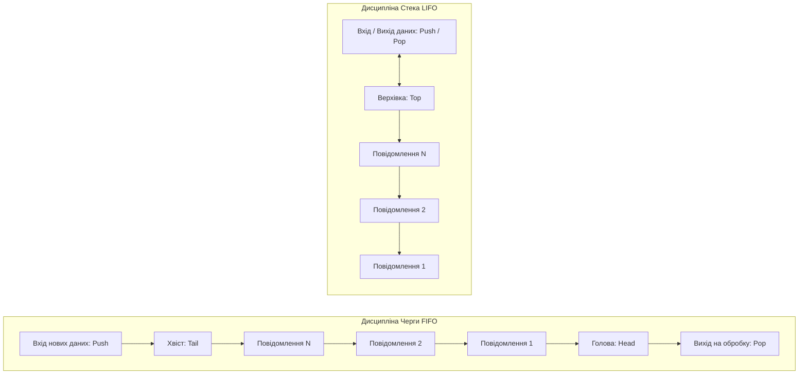
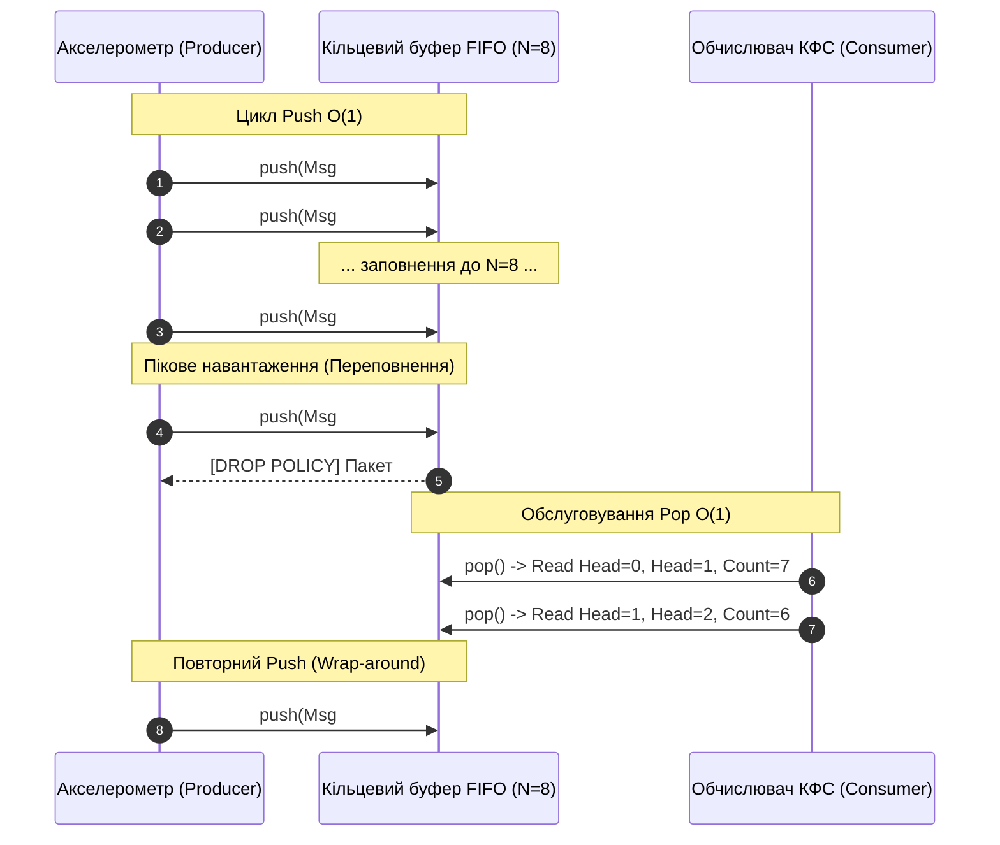

# Практичне заняття № 4<br>Реалізація черги повідомлень для керування завданнями

**Мета.** Засвоєння практичних навичок проєктування, реалізації та аналізу ефективності лінійних структур даних для буферизації асинхронних потоків телеметрії в кіберфізичних системах (КФС), розробка статичного кільцевого буфера черги повідомлень за принципом FIFO (First-In, First-Out) із гарантованою часовою складністю операцій $\mathcal{O}(1)$, дослідження механізмів захисту від переповнення при пікових навантаженнях датчиків та реалізація програмного комплексу мовою C++.  
**Стек та інструменти:** мова програмування C++ (стандарт C++17), компілятор GCC / G++ (версія v11+), системна консоль/термінал (Bash, PowerShell), текстовий редактор Visual Studio Code.  

---

### 1 Теоретичні відомості

У кіберфізичних системах процеси генерації даних первинними сенсорами та процеси їхньої обробки центральним процесором рознесені у часі та функціонують асинхронно. Датчики можуть генерувати високочастотні сплески телеметрії (наприклад, при реєстрації детонації, вібрації чи аномальних стрибків напруги), тоді як обчислювальний модуль реалізує детермінований алгоритм обробки зі сталою швидкістю. Для запобігання втраті інформації та згладжування пікових навантажень між рівнем збору даних та рівнем обробки розгортають **буфери повідомлень**, побудовані на основі лінійних структур даних.

Основні принципи впорядкування елементів у лінійних структурах описуються за допомогою наступних дисциплін обслуговування:

Принцип черги «першим прийшов — першим пішов» (з англійської First-In, First-Out, FIFO) визначає порядок обслуговування елементів, за якого повідомлення, що надійшло до буфера найпершим, обробляється першим. Подібна дисципліна є фундаментальною для систем збору телеметрії, оскільки вона зберігає часову послідовність виникнення подій у фізичному світі.

Принцип стека «останнім прийшов — першим пішов» (з англійської Last-In, First-Out, LIFO) передбачає, що опрацюванню підлягає той елемент, який був занесений до структури останнім. У КФС стек використовується для обробки системних переривань, збереження контексту задач та реалізації скасування дій.

Принцип пріоритетної черги полягає у тому, що порядок вилучення елементів визначається не часом їхнього надходження, а числовим значенням пріоритету. Обслуговуванню підлягає елемент із найвищим пріоритетом. Ефективна реалізація пріоритетної черги виконується на основі двоічної купи (Binary Heap), де складність операцій становить $\mathcal{O}(\log n)$.


*Рисунок 1 — Порівняння схем руху даних у структурах Черги (FIFO) та Стека (LIFO)*

На рисунку 1 наочно продемонстровано відмінність у точках доступу до даних. У черзі додавання нового елемента відбувається в один кінець (хвіст), а вилучення — з протилежного кінця (голова), що забезпечує збереження хронології. У стеці всі операції додавання та вилучення виконуються виключно через один кінець (верхівку).

У системах жорсткого реального часу використання динамічної пам'яті (за допомогою операторів `new` або `malloc`) є неприпустимим через ризик фрагментації оперативної пам'яті (SRAM) та непередбачувані затримки роботи збирача сміття. Тому буфери повідомлень КФС реалізують у вигляді **статичного кільцевого буфера (Circular Ring Buffer)** на основі фіксованого масиву розмірністю $N$.

Кільцевий буфер керується двома вказівниками (індексами):
*   Індекс `Head` вказує на позицію найстарішого елемента, який підлягає зчитуванню.
*   Індекс `Tail` вказує на позицію, в яку буде записане наступне нове повідомлення.

Зсув вказівників при додаванні та вилученні елементів здійснюється за допомогою циклічної арифметики за модулем $N$:

$$
Head_{next} = (Head + 1) \pmod{N}
$$

$$
Tail_{next} = (Tail + 1) \pmod{N}
$$

де $N$ позначає повну ємність виділеного статичного масиву буфера.

При пікових навантаженнях, коли швидкість надходження повідомлень від датчиків $P_{peak}$ перевищує швидкість обробки процесором $P_{proc}$, відбувається насичення буфера ($Tail_{next} = Head$). У КФС застосовують дві основні стратегії захисту від переповнення:
1.  **Стратегія відкидання (Drop / Reject Policy):** Нове повідомлення ігнорується, а лічильник втрачених пакетів збільшується. Це гарантує цілісність раніше накопичених даних.
2.  **Стратегія перезапису (Overwrite / Overrun Policy):** Нове повідомлення записується на місце найстарішого, а індекс `Head` примусово зміщується на одну позицію праворуч. Це забезпечує обробку найактуальніших замірів телеметрії.

Математична оцінка втрат телеметрії при переповненні буфера $P_{loss}$ виражається у відсотках:

$$
P_{loss} = \frac{N_{dropped}}{N_{total}} \cdot 100\%
$$

де $N_{dropped}$ позначає кількість відкинутих або перезаписаних повідомлень, а $N_{total}$ визначає загальну кількість згенерованих датчиками пакетів.

Функція трудомісткості обробки буфера $\Psi$ з огляду на константну часову складність $\mathcal{O}(1)$ має вигляд:

$$
\Psi = c_1 \cdot F_a(1) + c_2 \cdot M_{code} + c_3 \cdot S_d + c_4 \cdot S_r
$$

де $F_a(1)$ відображає константну кількість елементарних операцій для додавання чи вилучення елемента з кільцевого буфера ($F_a = 1$), $M_{code}$ позначає розмір Flash-пам'яті під код класу буфера, $S_d$ відповідає обсягу статично виділеної SRAM під масив із $N$ елементів ($S_d = N \cdot \text{sizeof}(Message)$), $S_r$ описує витрати стека на виклики методів, а $c_1, c_2, c_3, c_4$ є ваговими коефіцієнтами платформи.

---

### 2 Підготовка середовища та розгортання проєкту (Крок 0)

Для виконання практичної роботи необхідно перевірити наявність компілятора C++ та налаштувати проектну директорію.

#### Крок 0.1. Перевірка компілятора C++
Відкрийте системний термінал та перевірте наявність компілятора `g++`:

```bash
g++ --version
```

Якщо компілятор встановлено, у терміналі відобразиться його версія (наприклад, `g++ (GCC) 11.4.0`).

#### Крок 0.2. Створення структури папок проєкту
Створіть робочий каталог `cps-pz4-message-queue` та необхідні підпапки:

```bash
mkdir cps-pz4-message-queue
cd cps-pz4-message-queue
mkdir src bin exports
```

Структура каталогу проєкту матиме такий вигляд:

```
cps-pz4-message-queue/
├── bin/                        (Папка для виконуваних файлів)
├── exports/                    (Папка для логів та аналізу втрат)
├── src/
│   └── message_queue.cpp       (Повний C++ код кільцевого буфера КФС)
└── README.md
```

---

### 3 Порядок виконання роботи

#### 3.1 Індивідуальні завдання

Параметри обчислювального буфера телеметрії обираються з наведеної нижче таблиці відповідно до номера вашого варіанта (номеру у списку групи).

| Варіант | Джерело телеметрії КФС | Дисципліна | Ємність буфера $N$ | Стратегія при переповненні | Пікова інтенсивність $P_{peak}$ | Швидкість обробки $P_{proc}$ |
| :---: | :--- | :---: | :---: | :--- | :---: | :---: |
| **1** | Акселерометр вібрації турбіни | FIFO | $8$ | Відкидання нових (Drop) | $20\ \text{пак/с}$ | $5\ \text{пак/с}$ |
| **2** | Оптичний лідар БПЛА | FIFO | $10$ | Перезапис старих (Overwrite)| $50\ \text{пак/с}$ | $10\ \text{пак/с}$ |
| **3** | CAN-шина автомобіля | FIFO | $16$ | Відкидання нових (Drop) | $100\ \text{пак/с}$ | $20\ \text{пак/с}$ |
| **4** | Звуковий датчик детонації | LIFO | $8$ | Перезапис старих (Overwrite)| $30\ \text{пак/с}$ | $5\ \text{пак/с}$ |
| **5** | Лічильник імпульсів ГЕС | FIFO | $12$ | Відкидання нових (Drop) | $40\ \text{пак/с}$ | $10\ \text{пак/с}$ |
| **6** | Потік фотоприймача супутника | FIFO | $32$ | Перезапис старих (Overwrite)| $200\ \text{пак/с}$ | $50\ \text{пак/с}$ |
| **7** | Датчик струму інвертора | LIFO | $16$ | Відкидання нових (Drop) | $80\ \text{пак/с}$ | $20\ \text{пак/с}$ |
| **8** | Сканер штрих-кодів конвеєра | FIFO | $6$ | Перезапис старих (Overwrite)| $15\ \text{пак/с}$ | $3\ \text{пак/с}$ |
| **9** | Метрологічний тискомір | FIFO | $10$ | Відкидання нових (Drop) | $25\ \text{пак/с}$ | $5\ \text{пак/с}$ |
| **10** | Радіоприймач логістичного трекера| FIFO | $20$ | Перезапис старих (Overwrite)| $60\ \text{пак/с}$ | $15\ \text{пак/с}$ |
| **11** | ІК-датчик пожежної сигналізації| LIFO | $8$ | Відкидання нових (Drop) | $35\ \text{пак/с}$ | $5\ \text{пак/с}$ |
| **12** | Сенсор крутного моменту | FIFO | $16$ | Перезапис старих (Overwrite)| $90\ \text{пак/с}$ | $30\ \text{пак/с}$ |
| **13** | Диспетчер інжекторів ТПА | FIFO | $12$ | Відкидання нових (Drop) | $45\ \text{пак/с}$ | $10\ \text{пак/с}$ |
| **14** | Інклінометр бурової вишки | LIFO | $10$ | Перезапис старих (Overwrite)| $30\ \text{пак/с}$ | $8\ \text{пак/с}$ |
| **15** | Потік гамма-спектрометра | FIFO | $24$ | Відкидання нових (Drop) | $120\ \text{пак/с}$ | $40\ \text{пак/с}$ |
| **16** | Аналізатор складу газу | FIFO | $8$ | Перезапис старих (Overwrite)| $18\ \text{пак/с}$ | $4\ \text{пак/с}$ |
| **17** | Датчик зусилля роборуки | LIFO | $16$ | Відкидання нових (Drop) | $75\ \text{пак/с}$ | $15\ \text{пак/с}$ |
| **18** | Тахометр колінчастого вала | FIFO | $32$ | Перезапис старих (Overwrite)| $150\ \text{пак/с}$ | $50\ \text{пак/с}$ |
| **19** | Контролер ваги дозатора | FIFO | $10$ | Відкидання нових (Drop) | $22\ \text{пак/с}$ | $5\ \text{пак/с}$ |
| **20** | Мережевий розрядник АСУ ТП | LIFO | $12$ | Перезапис старих (Overwrite)| $50\ \text{пак/с}$ | $10\ \text{пак/с}$ |

---

#### 3.2 Покроковий алгоритм розробки з роз'ясненням коду

Відкрийте файл `src/message_queue.cpp` та додайте повний програмний код рішення (наведено реалізацію для **Варіанта №1**: FIFO черга, ємність $N = 8$, стратегія відкидання Drop, $P_{peak} = 20\text{ пак/с}$, $P_{proc} = 5\text{ пак/с}$).

```cpp
/**
 * Практичне заняття №4. Прикладні алгоритми КФС.
 * Моделювання кільцевого буфера телеметрії з гарантованою складністю O(1).
 * Варіант №1: Акселерометр вібрації турбіни (FIFO, N=8, Стратегія Drop).
 */

#include <iostream>
#include <chrono>
#include <thread>
#include <iomanip>
#include <string>

// 1. Структура телеметричного повідомлення
struct TelemetryMessage {
    uint32_t sequenceId; // Порядковий номер пакета
    double timestampMs;  // Час генерації від початку симуляції
    double sensorValue;  // Значення виміру (наприклад, прискорення м/с^2)
};

// 2. Клас статичного кільцевого буфера FIFO з захистом від переповнення
class CircularTelemetryQueue {
private:
    static const int CAPACITY = 8; // Фіксована ємність буфера N з Варіанта №1
    TelemetryMessage buffer[CAPACITY]; // Статичний масив у SRAM
    int head; // Вказівник зчитання
    int tail; // Вказівник запису
    int count; // Поточна кількість елементів у буфері

    // Метрики втрат для аналізу
    uint32_t totalPushed;
    uint32_t totalDropped;
    uint32_t totalPopped;

public:
    CircularTelemetryQueue() {
        head = 0;
        tail = 0;
        count = 0;
        totalPushed = 0;
        totalDropped = 0;
        totalPopped = 0;
    }

    /**
     * Операція додавання повідомлення в буфер (Push / Enqueue).
     * Часова складність: O(1) - вимагає лише індексного перерахунку за модулем N.
     */
    bool push(const TelemetryMessage& msg) {
        totalPushed++;

        // Перевірка умови повного буфера
        if (count == CAPACITY) {
            // Стратегія DROP: нове повідомлення відкидається
            totalDropped++;
            std::cout << "  [ПЕРЕПОВНЕННЯ - DROP] Пакет #" << msg.sequenceId 
                      << " відкинуто! Буфер повний (" << count << "/" << CAPACITY << ")\n";
            return false;
        }

        // Запис у поточну позицію tail
        buffer[tail] = msg;
        
        // Циклічний зсув вказівника tail за модулем N
        tail = (tail + 1) % CAPACITY;
        count++;

        std::cout << "  [PUSH O(1)] Пакет #" << msg.sequenceId 
                  << " додано в осередку [" << ((tail - 1 + CAPACITY) % CAPACITY) 
                  << "]. Заповнення: " << count << "/" << CAPACITY << "\n";
        return true;
    }

    /**
     * Операція вилучення найстарішого повідомлення з буфера (Pop / Dequeue).
     * Часова складність: O(1) - вимагає лише читання за Head та зсуву індексу.
     */
    bool pop(TelemetryMessage& outMsg) {
        if (count == 0) {
            std::cout << "  [UNDERFLOW] Спроба зчитати з порожнього буфера!\n";
            return false;
        }

        // Зчитання елемента з позиції head
        outMsg = buffer[head];
        
        // Циклічний зсув вказівника head за модулем N
        head = (head + 1) % CAPACITY;
        count--;
        totalPopped++;

        std::cout << "  [POP O(1)] Пакет #" << outMsg.sequenceId 
                  << " зчитано з осередку [" << ((head - 1 + CAPACITY) % CAPACITY) 
                  << "]. Залишилось: " << count << "/" << CAPACITY << "\n";
        return true;
    }

    // Декларація допоміжних методів перевірки стану
    bool isFull() const { return count == CAPACITY; }
    bool isEmpty() const { return count == 0; }
    int getCount() const { return count; }
    uint32_t getTotalPushed() const { return totalPushed; }
    uint32_t getTotalDropped() const { return totalDropped; }
    uint32_t getTotalPopped() const { return totalPopped; }
};

int main() {
    std::cout << "==================================================\n";
    std::cout << " КФС: Моделювання кільцевого буфера телеметрії FIFO\n";
    std::cout << " Об'єкт: Акселерометр вібрації турбіни (N=8, Drop Policy)\n";
    std::cout << "==================================================\n\n";

    CircularTelemetryQueue queue;
    uint32_t seqCounter = 1;

    // Сценарій 1: Заповнення буфера до насичення (8 пакетів)
    std::cout << "--- СЦЕНАРІЙ 1: Послідовне заповнення буфера O(1) ---\n";
    for (int i = 0; i < 8; i++) {
        TelemetryMessage msg = { seqCounter++, (double)(i * 50), 12.5 + i * 0.3 };
        queue.push(msg);
    }

    // Сценарій 2: Спроба запису в повний буфер (Симуляція пікового сплеску)
    std::cout << "\n--- СЦЕНАРІЙ 2: Піковий сплеск (Переповнення та Drop) ---\n";
    for (int i = 0; i < 3; i++) {
        TelemetryMessage msg = { seqCounter++, (double)(400 + i * 10), 99.9 };
        queue.push(msg); // Має спрацювати стратегія DROP
    }

    // Сценарій 3: Часткове вилучення даних обчислювачем (Dequeue 4 пакети)
    std::cout << "\n--- СЦЕНАРІЙ 3: Обслуговування завдань обчислювачем O(1) ---\n";
    for (int i = 0; i < 4; i++) {
        TelemetryMessage poppedMsg;
        queue.pop(poppedMsg);
    }

    // Сценарій 4: Додавання нових даних у звільнені осередки (Перевірка модуля N)
    std::cout << "\n--- СЦЕНАРІЙ 4: Циклічний перехід вказівників (Wrap-around) ---\n";
    for (int i = 0; i < 3; i++) {
        TelemetryMessage msg = { seqCounter++, (double)(600 + i * 50), 14.1 };
        queue.push(msg);
    }

    // Підсумкова статистика роботи буфера
    std::cout << "\n==================================================\n";
    std::cout << " ПІДСУМКОВА СТАТИСТИКА БУФЕРИЗАЦІЇ ТЕЛЕМЕТРІЇ\n";
    std::cout << "==================================================\n";
    std::cout << " Всього згенеровано пакетів: " << queue.getTotalPushed() << "\n";
    std::cout << " Успішно занесено в буфер:   " << (queue.getTotalPushed() - queue.getTotalDropped()) << "\n";
    std::cout << " Втрачено пакетів (Dropped): " << queue.getTotalDropped() << "\n";
    std::cout << " Обслуговано процесором:      " << queue.getTotalPopped() << "\n";

    double lossRate = ((double)queue.getTotalDropped() / queue.getTotalPushed()) * 100.0;
    std::cout << " Коефіцієнт втрат P_loss:   " << std::fixed << std::setprecision(2) 
              << lossRate << " %\n";
    std::cout << "==================================================\n";

    return 0;
}
```


*Рисунок 2 — Схема передачі та буферизації телеметричних пакетів у кільцевій черзі*

На рисунку 2 зображено часову послідовність дій під час обробки телеметрії. При надходженні нових пакетів відбувається перевірка заповнення буфера; у разі насичення спрацьовує стратегія Drop, а після зчитування елемента процесором вказівники Head та Tail циклічно перескакують на початок масиву за модулем $N$.

---

#### 3.3 Запуск та перевірка результатів у терміналі

Виконайте компіляцію програми за допомогою компілятора `g++`:

```bash
g++ -std=c++17 src/message_queue.cpp -o bin/message_queue
```

Запустіть виконуваний файл:

```bash
./bin/message_queue
```

**Приклад очікуваного виведення в консолі:**

```text
==================================================
 КФС: Моделювання кільцевого буфера телеметрії FIFO
 Об'єкт: Акселерометр вібрації турбіни (N=8, Drop Policy)
==================================================

--- СЦЕНАРІЙ 1: Послідовне заповнення буфера O(1) ---
  [PUSH O(1)] Пакет #1 додано в осередку [0]. Заповнення: 1/8
  [PUSH O(1)] Пакет #2 додано в осередку [1]. Заповнення: 2/8
  [PUSH O(1)] Пакет #3 додано в осередку [2]. Заповнення: 3/8
  [PUSH O(1)] Пакет #4 додано в осередку [3]. Заповнення: 4/8
  [PUSH O(1)] Пакет #5 додано в осередку [4]. Заповнення: 5/8
  [PUSH O(1)] Пакет #6 додано в осередку [5]. Заповнення: 6/8
  [PUSH O(1)] Пакет #7 додано в осередку [6]. Заповнення: 7/8
  [PUSH O(1)] Пакет #8 додано в осередку [7]. Заповнення: 8/8

--- СЦЕНАРІЙ 2: Піковий сплеск (Переповнення та Drop) ---
  [ПЕРЕПОВНЕННЯ - DROP] Пакет #9 відкинуто! Буфер повний (8/8)
  [ПЕРЕПОВНЕННЯ - DROP] Пакет #10 відкинуто! Буфер повний (8/8)
  [ПЕРЕПОВНЕННЯ - DROP] Пакет #11 відкинуто! Буфер повний (8/8)

--- СЦЕНАРІЙ 3: Обслуговування завдань обчислювачем O(1) ---
  [POP O(1)] Пакет #1 зчитано з осередку [0]. Залишилось: 7/8
  [POP O(1)] Пакет #2 зчитано з осередку [1]. Залишилось: 6/8
  [POP O(1)] Пакет #3 зчитано з осередку [2]. Залишилось: 5/8
  [POP O(1)] Пакет #4 зчитано з осередку [3]. Залишилось: 4/8

--- СЦЕНАРІЙ 4: Циклічний перехід вказівників (Wrap-around) ---
  [PUSH O(1)] Пакет #12 додано в осередку [0]. Заповнення: 5/8
  [PUSH O(1)] Пакет #13 додано в осередку [1]. Заповнення: 6/8
  [PUSH O(1)] Пакет #14 додано в осередку [2]. Заповнення: 7/8

==================================================
 ПІДСУМКОВА СТАТИСТИКА БУФЕРИЗАЦІЇ ТЕЛЕМЕТРІЇ
==================================================
 Всього згенеровано пакетів: 14
 Успішно занесено в буфер:   11
 Втрачено пакетів (Dropped): 3
 Обслуговано процесором:      4
 Коефіцієнт втрат P_loss:   21.43 %
==================================================
```

---

### 4 Вимоги до змісту звіту

Звіт з практичного заняття оформлюється у форматі PDF або MS Word та повинен містити наступні обов’язкові розділи:

1.  **Титульна сторінка.**
    *   Назва вищого навчального закладу, кафедри, дисципліни.
    *   Номер та назва лабораторної роботи, номер обраного варіанта.
    *   ПІБ, шифр навчальної групи.
2.  **Мета роботи, короткі теоретичні відомості та опис отриманого завдання.**
    *   Виклад основного теоретичного базису.
    *   Опис завдання згідно з таблицею варіантів.
3.  **Математична частина.**
    *   Розградування індексних арифметичних формул для зсуву вказівників $Head$ та $Tail$ за модулем $N$.
    *   Аналітичний розрахунок коефіцієнта втрат телеметрії $P_{loss}$ при заданих пікових навантаженнях.
    *   Розрахунок функції трудомісткості $\Psi$ для статично виділеного масиву.
4.  **Програмний код рішення.** Повний текст файла `src/message_queue.cpp` із деталізацією коментарями.
5.  **Результати тестування.** Скріншот системного термінала із зображенням заповнення буфера, спрацьовування захисту від переповнення та підсумкової статистики.
6.  **Висновки.** Аналіз переваг гарантованої складності $\mathcal{O}(1)$ кільцевого буфера для забезпечення реального часу в КФС.

---

### 5 Контрольні запитання

1.  Чому у системах жорсткого реального часу критично важливо забезпечити часову складність операцій додавання та вилучення елементів з буфера на рівні $\mathcal{O}(1)$?
2.  У чому полягає відмінність між стратегіями обробки переповнення буфера Drop (відкидання нових) та Overwrite (перезапис старих)? Наведіть приклади КФС, де застосовується кожна зі стратегій.
3.  Поясніть математичний механізм адресації вказівників у кільцевому буфері за допомогою операції остачі від ділення (модуля $N$).
4.  Чому виділення динамічної пам'яті (за допомогою `new` або `malloc`) є неприпустимим при розробці буферів телеметрії для вбудованих мікроконтролерів?
5.  Як використання пріоритетної черги на основі двійкової купи змінює часову складність операцій додавання та вилучення елементів порівняно з простим кільцевим буфером FIFO?

