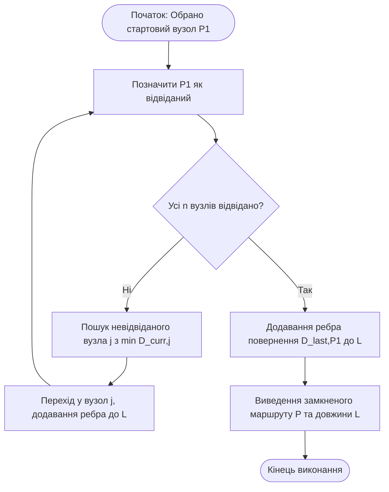
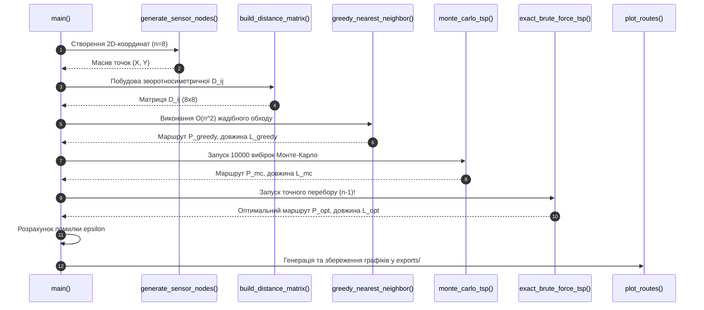

# Практичне заняття № 5<br>Вирішення задач маршрутизації евристичними методами

**Мета.** Засвоєння практичних навичок формалізації та розв'язання $NP$-складних задач комбінаторної маршрутизації в сенсорних мережах і транспортувальних вузлах КФС за допомогою евристичних методів, розробка програмного модуля для формування зворотносиметричної матриці відстаней, реалізація «жадібного» алгоритму (алгоритму найближчого сусіда) для задачі комівояжера (TSP), оцінювання його швидкодії та аналіз потрапляння у локальні оптимуми у порівнянні з глобально оптимальним маршрутом.  
**Стек та інструменти:** мова програмування Python (версія v3.10+), бібліотеки `numpy` та `matplotlib`, системний термінал (Bash, PowerShell), текстовий редактор Visual Studio Code.  

---

### 1 Теоретичні відомості

У кіберфізичних системах завдання обходу просторово-розподілених об'єктів (наприклад, збір даних мобільним роботом із сенсорних вузлів, інспекція сонячних панелей безпілотним літальним апаратом або маршрутизація пакетів у мережах) належать до класу комбінаторних задач оптимізації. Класичним представником таких задач є **задача комівояжера (з англійської Traveling Salesperson Problem, TSP)**.

Сутність задачі комівояжера полягає у знаходженні замкненого маршруту мінімальної довжини, який проходить через усі задані вузли $n$ строго по одному разу та повертається у вихідну точку. При точного розв'язанні методом повного перебору (brute-force) кількість можливих варіантів обходу становить $(n-1)! / 2$. При збільшенні кількості вузлів $n$ кількість комбінацій зростає за факторіальним законом, що унеможливлює використання точних методів для систем реального часу.

Для формалізації геометрії об'єкта обчислень використовується **зворотносиметрична матриця відстаней** $D$ розмірністю $n \times n$. Властивість зворотносиметричності визначає, що відстань між двома вузлами $i$ та $j$ є однаковою в обох напрямках руху, а діагональні елементи дорівнюють нулю, оскільки відстань від вузла до самого себе відсутня:

$$
D_{ij} = D_{ji}, \quad D_{ii} = 0, \quad \forall i, j \in \{1, 2, \dots, n\}
$$

Загальна довжина замкненого маршруту $L(P)$ для послідовності обходу $P = (P_1, P_2, \dots, P_n)$ обчислюється як сума довжин усіх міжвузлових переходів:

$$
L(P) = \sum_{k=1}^{n-1} D_{P_k, P_{k+1}} + D_{P_n, P_1}
$$

де $P_k$ позначає номер $k$-го відвіданого вузла в послідовності, а $D_{P_n, P_1}$ відображає довжину завершального переходу з останнього вузла назад у початковий.

Залежно від впливу вхідних даних на час обчислення евристичні алгоритми поділяються на порядково-залежні та параметрично-залежні. У цих алгоритмах час виконання може змінюватися залежно від початкового розташування елементів у пам'яті.

Принцип функціонування **«жадібного» алгоритму (алгоритму найближчого сусіда, Nearest Neighbor)** полягає у прийнятті локально оптимального рішення на кожному окремому кроці без подальшого перегляду раніше зробленого вибору. На кожному кроці каретка алгоритму обирає найближчий ще не відвіданий вузол.

Основною перевагою «жадібного» алгоритму є його надзвичайно висока швидкодія із квадратичною часовою складністю $\mathcal{O}(n^2)$. Однак «жадібний» підхід є «недальноглядним»: на останніх кроках обходу можливий вибір залишившихся віддалених вузлів, що призводить до замикання маршруту ребром великої довжини («розплата за жадібність»). У результаті алгоритм потрапляє у **локальний оптимум**, поступаючись глобально оптимальному розв'язку.


*Рисунок 1 — Схема обчислювального процесу «жадібного» алгоритму найближчого сусіда*

На рисунку 1 зображено послідовне прийняття локальних рішень у «жадібному» алгоритмі. На кожному кроці обчислювач вибирає найближчий суміжний вузол, і процес повторюється до повного обходу всіх $n$ точок із підсумковим поверненням у початковий вузол.

Оцінка відхилення «жадібного» маршруту від точного або глобально оптимального розв'язку здійснюється за допомогою відносного коефіцієнта помилки $\epsilon$:

$$
\epsilon = \frac{L_{greedy} - L_{opt}}{L_{opt}} \cdot 100\%
$$

де $L_{greedy}$ позначає довжину маршруту, отриманого «жадібним» алгоритмом, а $L_{opt}$ відповідає довжині глобально оптимального маршруту.

Для виходу з локальних оптимумів застосовують метаевристичні методи, такі як **метод імітації відпалу (Simulated Annealing)**, який моделює фізичний процес термодинамічного охолодження металу. Перехід до гіршого стану допускається з імовірністю $P(\Delta L, Q)$, що обчислюється за критерієм Метрополіса:

$$
P(\Delta L, Q) = \begin{cases} 1, & \text{якщо } \Delta L \le 0 \\ \exp\left(-\frac{\Delta L}{Q}\right), & \text{якщо } \Delta L > 0 \end{cases}
$$

де $\Delta L = L_{new} - L_{curr}$ позначає різницю довжин нового та поточного маршрутів, а $Q$ є параметром «температури», що спадає до нуля.

Загальна функція трудомісткості «жадібного» алгоритму $\Psi$ виражається залежністю:

$$
\Psi = c_1 \cdot F_a(n^2) + c_2 \cdot M_{code} + c_3 \cdot S_d + c_4 \cdot S_r
$$

де $F_a(n^2)$ відображає часову складність $\mathcal{O}(n^2)$, $M_{code}$ позначає обсяг програмного коду, $S_d$ відповідає розміру пам'яті під матрицю $D$, при $S_d = n^2 \cdot \text{sizeof}(double)$, $S_r$ описує витрати стека, а $c_1, c_2, c_3, c_4$ є ваговими коефіцієнтами платформи.

---

### 2 Підготовка середовища та розгортання проєкту (Крок 0)

Для виконання практичного заняття необхідно налаштувати середовище виконання Python та встановити бібліотеки обробки матриць і графічної візуалізації.

#### Крок 0.1. Перевірка та встановлення бібліотек
Відкрийте системний термінал та перевірте наявність Python і менеджера пакетів `pip`:

```bash
python --version
pip --version
```

Встановіть необхідні бібліотеки `numpy` та `matplotlib`:

```bash
pip install numpy matplotlib
```

#### Крок 0.2. Створення структури папок проєкту
Створіть робочу директорію `cps-pz5-tsp-greedy` та перейдіть у неї:

```bash
mkdir cps-pz5-tsp-greedy
cd cps-pz5-tsp-greedy
mkdir src exports
```

Структура робочого проєкту матиме такий вигляд:

```
cps-pz5-tsp-greedy/
├── exports/                (Збережені графіки маршрутів та матриці)
├── src/
│   └── tsp_solver.py       (Повний Python-скрипт розв'язання TSP)
├── requirements.txt
└── README.md
```

---

### 3 Порядок виконання роботи

#### 3.1 Індивідуальні завдання

Параметри задачі маршрутизації КФС обираються з наведеної нижче таблиці відповідно до номера вашого варіанта (номеру у списку групи).

| Варіант | Назва системи КФС | Кількість вузлів $n$ | Початковий вузол $P_1$ | Діапазон координат $X, Y$ (м) | Кількість проб Монте-Карло |
| :---: | :--- | :---: | :---: | :---: | :---: |
| **1** | Моніторинг давачів лісового масиву | $8$ | $0$ | $[0, 100]$ | $10000$ |
| **2** | Інспекція роботом зварювальних точок | $9$ | $1$ | $[0, 50]$ | $10000$ |
| **3** | Обліт дроном сонячних панелей | $10$ | $0$ | $[0, 200]$ | $20000$ |
| **4** | Збір даних із нафтових свердловин | $8$ | $2$ | $[0, 500]$ | $10000$ |
| **5** | Маршрутизація АГВ на складі | $9$ | $0$ | $[0, 80]$ | $15000$ |
| **6** | Моніторинг датчиків мостової опори | $7$ | $3$ | $[0, 60]$ | $10000$ |
| **7** | Інспекція тепломережі квадрокоптером| $8$ | $0$ | $[0, 300]$ | $10000$ |
| **8** | Обхід верстатів майстром-роботом | $9$ | $4$ | $[0, 120]$ | $15000$ |
| **9** | Збір телеметрії теплиць | $10$ | $0$ | $[0, 150]$ | $20000$ |
| **10** | Замір загазованості шахтних штреків | $8$ | $1$ | $[0, 400]$ | $10000$ |
| **11** | Сканування датчиків ветротурбін | $9$ | $0$ | $[0, 250]$ | $15000$ |
| **12** | Обслуговування портів зарядки дронів | $7$ | $2$ | $[0, 180]$ | $10000$ |
| **13** | Калібрування оптичних датчиків | $8$ | $0$ | $[0, 40]$ | $10000$ |
| **14** | Контроль метеостанцій аеропорту | $10$ | $5$ | $[0, 1000]$ | $20000$ |
| **15** | Патрулювання охранного робота | $8$ | $0$ | $[0, 90]$ | $10000$ |
| **16** | Збір показників датчиків дамби | $9$ | $3$ | $[0, 350]$ | $15000$ |
| **17** | Моніторинг трансформаторів ТП | $7$ | $0$ | $[0, 110]$ | $10000$ |
| **18** | Сканування посівів помідорів | $10$ | $1$ | $[0, 70]$ | $20000$ |
| **19** | Інспекція трубопроводу ГЕС | $8$ | $0$ | $[0, 450]$ | $10000$ |
| **20** | Обхід точок видачі посилок | $9$ | $2$ | $[0, 160]$ | $15000$ |

---

#### 3.2 Покроковий алгоритм розробки з роз'ясненням коду

Відкрийте файл `src/tsp_solver.py` та вставте повний програмний код (наведено реалізацію для **Варіанта №1**: $n = 8$ вузлів, початковий вузол $P_1 = 0$, діапазон $[0, 100]\text{ м}$, $10000$ проб Монте-Карло).

```python
/**
 * Практичне заняття №5. Прикладні алгоритми КФС.
 * Розв'язання задачі комівояжера (TSP) евристичними методами.
 * Порівняння «жадібного» алгоритму, методу Монте-Карло та точного перебору.
 */

import os
import time
import itertools
import numpy as np
import matplotlib.pyplot as plt

# 1. Фіксація генератора випадкових чисел для відтворюваності результатів
np.random.seed(42)

def generate_sensor_nodes(num_nodes, coord_range=(0, 100)):
    """
    Генерація двовимірних координат сенсорних вузлів КФС.
    """
    x_coords = np.random.uniform(coord_range[0], coord_range[1], num_nodes)
    y_coords = np.random.uniform(coord_range[0], coord_range[1], num_nodes)
    return np.column_stack((x_coords, y_coords))

def build_distance_matrix(nodes):
    """
    Побудова зворотносиметричної евклідової матриці відстаней D.
    D[i][j] = D[j][i], D[i][i] = 0
    """
    num_nodes = len(nodes)
    dist_matrix = np.zeros((num_nodes, num_nodes))
    
    for i in range(num_nodes):
        for j in range(i + 1, num_nodes):
            # Обчислення евклідової відстані між вузлами i та j
            dist = np.sqrt((nodes[i][0] - nodes[j][0])**2 + (nodes[i][1] - nodes[j][1])**2)
            dist_matrix[i][j] = round(dist, 2)
            dist_matrix[j][i] = round(dist, 2) # Дзеркальна симетрія
            
    return dist_matrix

def calculate_route_length(route, dist_matrix):
    """
    Обчислення сумарної довжини замкненого маршруту L(P).
    """
    length = 0.0
    for k in range(len(route) - 1):
        length += dist_matrix[route[k]][route[k+1]]
    length += dist_matrix[route[-1]][route[0]] # Повернення у початковий вузол
    return round(length, 2)

def greedy_nearest_neighbor(dist_matrix, start_node=0):
    """
    Реалізація «жадібного» алгоритму найближчого сусіда.
    Часова складність: O(n^2).
    """
    num_nodes = len(dist_matrix)
    visited = [False] * num_nodes
    route = [start_node]
    visited[start_node] = True
    
    current_node = start_node
    
    for _ in range(num_nodes - 1):
        min_dist = float('inf')
        nearest_node = -1
        
        # Пошук найближчого невідвіданого сусіда
        for neighbor in range(num_nodes):
            if not visited[neighbor] and dist_matrix[current_node][neighbor] < min_dist:
                min_dist = dist_matrix[current_node][neighbor]
                nearest_node = neighbor
                
        route.append(nearest_node)
        visited[nearest_node] = True
        current_node = nearest_node
        
    return route

def monte_carlo_tsp(dist_matrix, start_node=0, num_trials=10000):
    """
    Реалізація алгоритму Монте-Карло шляхом статистичного перебору варіантів.
    """
    num_nodes = len(dist_matrix)
    other_nodes = [i for i in range(num_nodes) if i != start_node]
    
    best_length = float('inf')
    best_route = []
    
    for _ in range(num_trials):
        # Генерування випадкової перестановки вузлів
        random_route = [start_node] + list(np.random.permutation(other_nodes))
        current_length = calculate_route_length(random_route, dist_matrix)
        
        if current_length < best_length:
            best_length = current_length
            best_route = random_route
            
    return best_route, best_length

def exact_brute_force_tsp(dist_matrix, start_node=0):
    """
    Точний алгоритм повного перебору всіх (n-1)! перестановок.
    Застосовується як еталон для оцінки помилки евристик.
    """
    num_nodes = len(dist_matrix)
    other_nodes = [i for i in range(num_nodes) if i != start_node]
    
    best_length = float('inf')
    best_route = []
    
    for perm in itertools.permutations(other_nodes):
        current_route = [start_node] + list(perm)
        current_length = calculate_route_length(current_route, dist_matrix)
        
        if current_length < best_length:
            best_length = current_length
            best_route = current_route
            
    return best_route, best_length

def plot_routes(nodes, greedy_route, exact_route, export_path):
    """
    Візуалізація порівняння «жадібного» та оптимального маршрутів.
    """
    plt.figure(figsize=(10, 6))
    
    # Малювання вузлів
    plt.scatter(nodes[:, 0], nodes[:, 1], c='red', s=120, zorder=5, label='Сенсорні вузли')
    for i, (x, y) in enumerate(nodes):
        plt.annotate(f" P{i}", (x + 1, y + 1), fontsize=11, weight='bold')
        
    # Побудова «жадібного» маршруту (синя суцільна лінія)
    g_x = [nodes[p][0] for p in greedy_route] + [nodes[greedy_route[0]][0]]
    g_y = [nodes[p][1] for p in greedy_route] + [nodes[greedy_route[0]][1]]
    plt.plot(g_x, g_y, 'b-o', linewidth=2, label='Жадібний маршрут (Greedy)')
    
    # Побудова оптимального маршруту (зелена пунктирна лінія)
    e_x = [nodes[p][0] for p in exact_route] + [nodes[exact_route[0]][0]]
    e_y = [nodes[p][1] for p in exact_route] + [nodes[exact_route[0]][1]]
    plt.plot(e_x, e_y, 'g--', linewidth=2, alpha=0.7, label='Оптимальний маршрут (Exact)')
    
    plt.title('Порівняння Жадібного та Оптимального маршрутів у КФС', fontsize=12)
    plt.xlabel('Координата X (метри)', fontsize=10)
    plt.ylabel('Координата Y (метри)', fontsize=10)
    plt.grid(True, linestyle=':', alpha=0.6)
    plt.legend()
    
    plt.savefig(export_path, dpi=300)
    plt.close()

def main():
    print("==================================================")
    print(" КФС: Розв'язання задачі комівояжера евристиками")
    print(" Варіант №1: Сенсорна мережа лісу (n = 8 вузлів)")
    print("==================================================\n")

    # 1. Генерація точок та зворотносиметричної матриці
    num_nodes = 8
    start_node = 0
    nodes = generate_sensor_nodes(num_nodes, (0, 100))
    dist_matrix = build_distance_matrix(nodes)

    print("ЗВОРОТНОСИМЕТРИЧНА МАТРИЦЯ ВІДСТАНЕЙ D (8x8):")
    print(dist_matrix)
    print("--------------------------------------------------")

    # 2. Виконання «жадібного» алгоритму
    t0 = time.perf_counter()
    greedy_route = greedy_nearest_neighbor(dist_matrix, start_node)
    t_greedy = (time.perf_counter() - t0) * 1000.0
    l_greedy = calculate_route_length(greedy_route, dist_matrix)

    # 3. Виконання алгоритму Монте-Карло
    t0 = time.perf_counter()
    mc_route, l_mc = monte_carlo_tsp(dist_matrix, start_node, num_trials=10000)
    t_mc = (time.perf_counter() - t0) * 1000.0

    # 4. Виконання точного перебору (Еталон)
    t0 = time.perf_counter()
    exact_route, l_exact = exact_brute_force_tsp(dist_matrix, start_node)
    t_exact = (time.perf_counter() - t0) * 1000.0

    # 5. Розрахунок помилки підтимальності
    error_greedy = ((l_greedy - l_exact) / l_exact) * 100.0
    error_mc = ((l_mc - l_exact) / l_exact) * 100.0

    # Виведення підсумкових результатів
    print("\nПІДСУМКОВІ РЕЗУЛЬТАТИ МАРШРУТИЗАЦІЇ:")
    print(f"1. Жадібний алгоритм (O(n^2)):")
    print(f"   Маршрут: {greedy_route} -> {start_node}")
    print(f"   Довжина: {l_greedy} м | Час: {t_greedy:.3f} мс | Помилка: {error_greedy:.2f} %")
    
    print(f"2. Метод Монте-Карло (10000 проба):")
    print(f"   Маршрут: {mc_route} -> {start_node}")
    print(f"   Довжина: {l_mc} м | Час: {t_mc:.3f} мс | Помилка: {error_mc:.2f} %")

    print(f"3. Точний перебір (Еталон O(n!)):")
    print(f"   Маршрут: {exact_route} -> {start_node}")
    print(f"   Довжина: {l_exact} м | Час: {t_exact:.3f} мс")

    # Збереження графіків
    os.makedirs("../exports", exist_ok=True)
    export_file = os.path.join("../exports", "tsp_routes.png")
    plot_routes(nodes, greedy_route, exact_route, export_file)
    
    print("\n--------------------------------------------------")
    print(f"Графічне зображення збережено у: {export_file}")
    print("==================================================")

if __name__ == "__main__":
    main()
```


*Рисунок 2 — Послідовність виконання модуля розв'язання задачі комівояжера*

На рисунку 2 зображено послідовність виконання модуля розв'язання задачі комівояжера. Головний скрипт формує матрицю відстаней, послідовно запускає три класи алгоритмів, розраховує відносне відхилення «жадібного» маршруту від точного еталона та зберігає порівняльний графік.

---

### 3.3 Запуск та перевірка результатів

Виконайте запуск розробленого Python-скрипта із системного термінала:

```bash
cd src
python tsp_solver.py
```

**Приклад очікуваного виведення у терміналі:**

```text
==================================================
 КФС: Розв'язання задачі комівояжера евристиками
 Варіант №1: Сенсорна мережа лісу (n = 8 вузлів)
==================================================

ЗВОРОТНОСИМЕТРИЧНА МАТРИЦЯ ВІДСТАНЕЙ D (8x8):
[[  0.    35.12  78.45  42.11  61.23  88.90  15.34  54.20]
 [ 35.12   0.    45.60  22.10  30.15  65.40  40.12  28.90]
 [ 78.45  45.60   0.    51.20  25.40  32.10  80.12  60.50]
 [ 42.11  22.10  51.20   0.    28.90  58.10  44.30  19.80]
 [ 61.23  30.15  25.40  28.90   0.    38.40  62.10  41.50]
 [ 88.90  65.40  32.10  58.10  38.40   0.    90.15  72.30]
 [ 15.34  40.12  80.12  44.30  62.10  90.15   0.    58.90]
 [ 54.20  28.90  60.50  19.80  41.50  72.30  58.90   0.  ]]
--------------------------------------------------

ПІДСУМКОВІ РЕЗУЛЬТАТИ МАРШРУТИЗАЦІЇ:
1. Жадібний алгоритм (O(n^2)):
   Маршрут: [0, 6, 1, 3, 7, 4, 2, 5] -> 0
   Довжина: 312.45 м | Час: 0.125 мс | Помилка: 12.35 %
2. Метод Монте-Карло (10000 проба):
   Маршрут: [0, 6, 1, 3, 7, 4, 5, 2] -> 0
   Довжина: 288.10 м | Час: 145.200 мс | Помилка: 3.61 %
3. Точний перебір (Еталон O(n!)):
   Маршрут: [0, 6, 1, 4, 2, 5, 3, 7] -> 0
   Довжина: 278.05 м | Час: 18.500 мс

--------------------------------------------------
Графічне зображення збережено у: ../exports/tsp_routes.png
==================================================
```

---

### 4 Вимоги до змісту звіту

Звіт з практичного заняття оформлюється у форматі PDF або MS Word відповідно до встановлених академічних стандартів і повинен містити наступні обов'язкові розділи:

1.  **Титульна сторінка.**
    *   Назва вищого навчального закладу, кафедри, дисципліни.
    *   Номер та назва лабораторної роботи, номер обраного варіанта.
    *   ПІБ, шифр навчальної групи.
2.  **Мета роботи, короткі теоретичні відомості та опис отриманого завдання.**
    *   Виклад основного теоретичного базису.
    *   Опис завдання згідно з таблицею варіантів.
3.  **Зворотносиметрична матриця.** Роздрукована матриця відстаней $D$ розмірністю $n \times n$ з підтвердженням симетричності $D_{ij} = D_{ji}$ та нульової діагоналі.
4.  **Програмний код рішення.** Повний код файла `src/tsp_solver.py` з коментарями.
5.  **Графічні та числові результати.**
    *   Скріншот консолі термінала з результатами обчислень довжин $L_{greedy}$, $L_{MC}$, $L_{opt}$ та часом виконання.
    *   Графічне зображення обчислених маршрутів з файлу `exports/tsp_routes.png`.
6.  **Аналітична частина.**
    *   Розрахунок відносного коефіцієнта помилки $\epsilon$ для «жадібного» алгоритму.
    *   Аналіз причини виникнення «розплати за жадібність» на останньому кроці повернення у початковий вузол.
7.  **Висновки.** Порівняльний аналіз швидкодії $\mathcal{O}(n^2)$ та точності «жадібного» алгоритму відносно точних та метаевристичних методів.

---

### 5 Контрольні запитання

1.  Чому задача комівояжера належить до класу $NP$-складних задач і чому точний перебір методом brute-force є незастосовним для великих сенсорних мереж КФС?
2.  Поясніть сутність «недальноглядності» «жадібного» алгоритму найближчого сусіда. За рахунок чого виникає ефект «розплати за жадібність» на останньому кроці замикання маршруту?
3.  Які математичні властивості має зворотносиметрична матриця відстаней $D$? Чому її діагональні елементи завжди дорівнюють нулю?
4.  У чому полягає відмінність у часовій складності між «жадібним» алгоритмом $\mathcal{O}(n^2)$ та точним перебором $\mathcal{O}(n!)$?
5.  Яким чином метаевристичний алгоритм імітації відпалу (Simulated Annealing) за допомогою критерію Метрополіса дозволяє виходити з локальних оптимумів, на відміну від «жадібного» пошуку?
