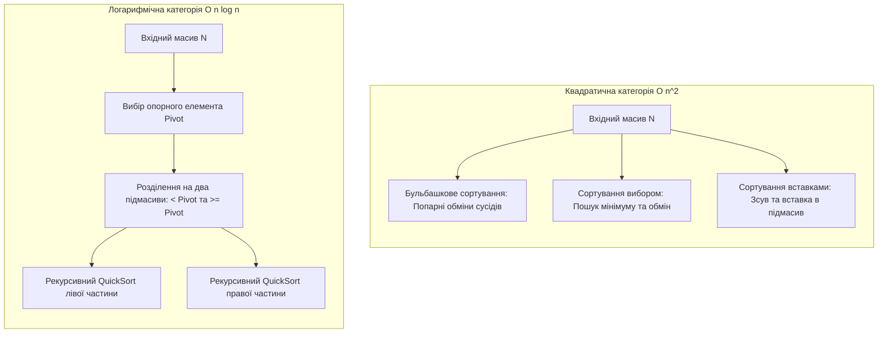
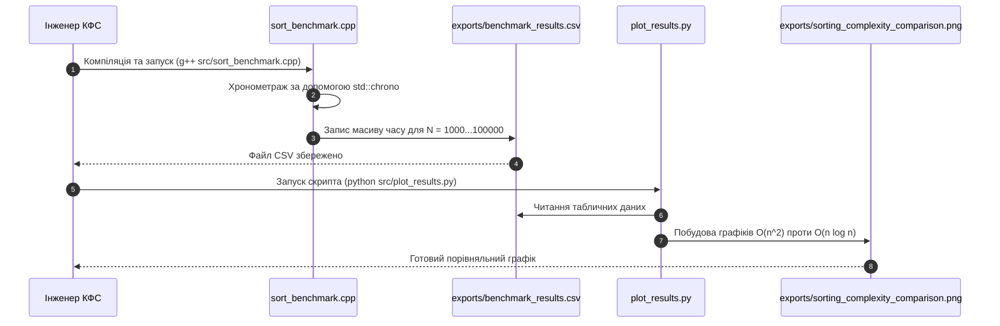

# Практичне заняття № 6<br>Порівняльний аналіз методів сортування даних
 
**Мета.** Засвоєння практичних навичок аналізу та експериментального хронометражу швидкодії алгоритмів внутрішнього сортування масивів телеметрії в кіберфізичних системах, дослідження впливу розмірності вхідних даних у діапазоні $N = 1000 \dots 100000$ елементів на часову складність квадратичних методів ($O(n^2)$) та логарифмічного методу QuickSort ($O(n \log n)$), реалізація вимірювального комплексу мовою C++ у середовищі Dev-C++ / GCC та побудова порівняльних аналітичних графіків мовою Python.  
**Стек та інструменти:** мова програмування C++ (стандарт C++17, середовище Dev-C++ або компілятор GCC / G++ v11+), мова програмування Python (версія v3.10+) з бібліотекою `matplotlib`, системний термінал (Bash, PowerShell), текстовий редактор Visual Studio Code.  

---

### 1 Теоретичні відомості

У кіберфізичних системах обробка великих масивів телеметрії (наприклад, даних просторових сіток давачів, спектрограм чи часових рядів) часто вимагає попереднього впорядкування значень. Впорядкування даних необхідне для прискорення подальшого бінарного пошуку ($O(\log n)$), фільтрації рангових аномалій або підготовки інформації для хмарної аналітики.

Алгоритми внутрішнього сортування, що виконуються в оперативній пам'яті (SRAM / DRAM), поділяються на дві фундаментальні категорії за критерієм асимптотичної часової складності:

Квадратичні алгоритми сортування мають часову складність $\mathcal{O}(n^2)$ у найгіршому та середньому випадках. До цієї категорії належать:

*   **Сортування прямим обміном (бульбашкове сортування, Bubble Sort)** базується на послідовному порівнянні та, за необхідності, взаємній перестановці сусідніх елементів масиву. На кожному проході найбільший елемент невідсортованої частини «спливає» в кінець масиву.
*   **Сортування прямим вибором (Selection Sort)** полягає у знаходженні мінімального елемента в невідсортованій частині масиву та його обміні з першим елементом цієї частини. Кількість порівнянь є сталою $\mathcal{O}(n^2)$, проте кількість перестановок є мінімальною $\mathcal{O}(n)$.
*   **Сортування прямою вставкою (Insertion Sort)** нагадує впорядкування карт у руці, де кожен наступний елемент вилучається з вихідної послідовності і вставляється у вже відсортовану частину на відповідну позицію. Для частково впорядкованих масивів цей метод демонструє близьку до лінійної складність $\mathcal{O}(n)$.

Логарифмічні алгоритми сортування мають асимптотичну складність $\mathcal{O}(n \log_2 n)$ у середньому та найкращому випадках. Найбільш поширеним алгоритмом цієї категорії є **швидке сортування (QuickSort)**, розроблене Тоні Хоаром. Алгоритм реалізує парадигму декомпозиції «розділяй і володарюй», обираючи опорний елемент (півот) і розбиваючи масив на два підмасиви: елементи, менші за півот, та елементи, більші або рівні йому, після чого процес рекурсивно повторюється.


*Рисунок 1 — Алгоритмічна схема декомпозиції масиву в QuickSort та локальних обмінів у сортуванні бульбашкою*

На рисунку 1 зображено фундаментальну відмінність між підходами. Квадратичні алгоритми здійснюють послідовний перебір та локальні перестановки елементів у межах усього масиву, тоді як алгоритм QuickSort рекурсивно розбиває обчислювальну задачу на менші підмасиви відносно опорного елемента, що забезпечує логарифмічне скорочення кількості кроків.

Крім часової складності, важливим параметром у КФС є ємнісна складність та властивість стійкості (стабільності) алгоритму. Стійкість означає збереження відносного порядку елементів із однаковими ключами. Алгоритми сортування бульбашкою та вставками є стійкими, тоді як сортування вибором та QuickSort є нестійкими.

Загальна кількість операцій $K$ при ітераційному сортуванні розраховується за формулою:

$$
K = K_{init} + \sum_{i=1}^{n} (K_{compare} + K_{swap})
$$

де $K_{init}$ відповідає кількості операцій ініціалізації змінних, $K_{compare}$ позначає кількість виконаних порівнянь ключів, а $K_{swap}$ відображає кількість перестановок елементів у пам'яті.

Прискорювальний коефіцієнт $A(n)$, що показує виграш у швидкодії алгоритму QuickSort порівняно з бульбашковим сортуванням, обчислюється як відношення їхніх часових затрат:

$$
A(n) = \frac{T_{bubble}(n)}{T_{quick}(n)} \approx \frac{c_{b} \cdot n^2}{c_{q} \cdot n \log_2 n} = \mathcal{O}\left(\frac{n}{\log_2 n}\right)
$$

де $T_{bubble}(n)$ позначає експериментальний час виконання бульбашкового сортування у мікросекундах, $T_{quick}(n)$ відповідає часу виконання QuickSort у мікросекундах, а $c_b, c_q$ є апаратними константами компілятора.

Функція трудомісткості $\Psi$ для оцінки використання ресурсів процесора та оперативної пам'яті виражається залежністю:

$$
\Psi = c_1 \cdot F_a(N) + c_2 \cdot M_{code} + c_3 \cdot S_d + c_4 \cdot S_r
$$

де $F_a(N)$ відображає часову складність (кількість операцій $K$), $M_{code}$ позначає обсяг скомпільованого машинного коду, $S_d$ відповідає розміру масиву телеметрії у байтах ($S_d = N \cdot \text{sizeof}(int)$), $S_r$ описує витрати стекової пам'яті на рекурсивні виклики (для QuickSort $S_r = \mathcal{O}(\log_2 n)$), а $c_1, c_2, c_3, c_4$ є ваговими коефіцієнтами конфігурації.

---

### 2 Підготовка середовища та розгортання проєкту (Крок 0)

Для виконання практичного заняття використовується компілятор C++ (Dev-C++ або GCC) для зняття високоточного хронометражу та середовище Python для візуалізації графіків.

#### Крок 0.1. Перевірка та встановлення системних інструментів
Відкрийте термінал та перевірте наявність компілятора `g++` та інтерпретатора Python:

```bash
g++ --version
python --version
```

Встановіть бібліотеку `matplotlib` для Python через менеджер пакетів `pip`:

```bash
pip install matplotlib
```

#### Крок 0.2. Створення структури папок проєкту
Створіть робочу директорію проєкту `cps-pz6-sorting-benchmark` та необхідні підпапки:

```bash
mkdir cps-pz6-sorting-benchmark
cd cps-pz6-sorting-benchmark
mkdir src bin exports
```

Структура роботи матиме такий вигляд:

```
cps-pz6-sorting-benchmark/
├── bin/                        (Папка для виконуваних C++ файлів)
├── exports/                    (Збережені CSV-логи та PNG-графіки)
├── src/
│   ├── sort_benchmark.cpp      (Основний C++ модуль хронометражу)
│   └── plot_results.py         (Python скрипт побудови графіків)
└── README.md
```

---

### 3 Порядок виконання роботи

#### 3.1 Індивідуальні завдання

Параметри масивів телеметрії та конфігурація сортування обираються з наведеної нижче таблиці відповідно до номера вашого варіанта (номеру у списку групи).

| Варіант | Джерело масиву КФС | Діапазон елементів $N$ | Стан вхідних даних (Порядок) | Напрямок сортування | Опорний елемент QuickSort |
| :---: | :--- | :---: | :--- | :---: | :---: |
| **1** | Виміри температурного поля | $1000 \dots 100000$ | Випадковий (Unsorted) | За зростанням | Середній елемент |
| **2** | Часовий ряд вібрації турбіни | $1000 \dots 50000$ | Частково впорядкований ($50\%$) | За зростанням | Перший елемент |
| **3** | Спектрограма звукового датчика | $1000 \dots 80000$ | Зворотно впорядкований (Reverse) | За спаданням | Останній елемент |
| **4** | Дані оптичного лідара БПЛА | $1000 \dots 100000$ | Випадковий (Unsorted) | За спаданням | Медіана з трьох |
| **5** | Буфер CAN-шини автомобіля | $1000 \dots 60000$ | Частково впорядкований ($75\%$) | За зростанням | Середній елемент |
| **6** | Логи датчиків тиску нафти | $1000 \dots 50000$ | Зворотно впорядкований (Reverse) | За зростанням | Перший елемент |
| **7** | Метеодані сонячної станції | $1000 \dots 100000$ | Випадковий (Unsorted) | За зростанням | Останній елемент |
| **8** | Сканер штрих-кодів конвеєра | $1000 \dots 40000$ | Частково впорядкований ($25\%$) | За спаданням | Медіана з трьох |
| **9** | Сейсмічні виміри шахти | $1000 \dots 70000$ | Зворотно впорядкований (Reverse) | За спаданням | Середній елемент |
| **10** | Рівні рідини у автоклаві | $1000 \dots 100000$ | Випадковий (Unsorted) | За зростанням | Перший елемент |
| **11** | Індикатори напруги інвертора| $1000 \dots 50000$ | Частково впорядкований ($50\%$) | За зростанням | Останній елемент |
| **12** | Тахограма ротора ГЕС | $1000 \dots 80000$ | Зворотно впорядкований (Reverse) | За зростанням | Медіана з трьох |
| **13** | Покази витратомірів газу | $1000 \dots 100000$ | Випадковий (Unsorted) | За спаданням | Середній елемент |
| **14** | Вагові параметри вагонів | $1000 \dots 60000$ | Частково впорядкований ($80\%$) | За спаданням | Перший елемент |
| **15** | Потік фотоприймача супутника| $1000 \dots 50000$ | Зворотно впорядкований (Reverse) | За зростанням | Останній елемент |
| **16** | Вібрація дефектоскопа | $1000 \dots 100000$ | Випадковий (Unsorted) | За зростанням | Медіана з трьох |
| **17** | Токовий профіль сварочного робота| $1000 \dots 40000$ | Частково впорядкований ($30\%$) | За зростанням | Середній елемент |
| **18** | Густина нафти в магістралі | $1000 \dots 70000$ | Зворотно впорядкований (Reverse) | За спаданням | Перший елемент |
| **19** | Температура сушильної вежі | $1000 \dots 100000$ | Випадковий (Unsorted) | За спаданням | Останній елемент |
| **20** | Датчики переміщення дамби | $1000 \dots 50000$ | Частково впорядкований ($60\%$) | За зростанням | Медіана з трьох |

---

#### 3.2 Покроковий алгоритм розробки з роз'ясненням коду

##### Крок 1. Реалізація вимірювального C++ модуля (`src/sort_benchmark.cpp`)

Відкрийте файл `src/sort_benchmark.cpp` та вставте наступний повний код. Програма реалізує вимірювання часу виконання чотирьох методів сортування за допомогою системного таймера `<chrono>` та експортує результати у CSV-файл:

```cpp
/**
 * Практичне заняття №6. Прикладні алгоритми КФС.
 * Модуль порівняльного хронометражу швидкодії алгоритмів сортування телеметрії.
 * Варіант №1: Випадковий масив, сортування за зростанням, N = 1000 .. 100000.
 */

#include <iostream>
#include <vector>
#include <chrono>
#include <algorithm>
#include <random>
#include <fstream>
#include <iomanip>

// 1. Реалізація сортування прямим обміном (Бульбашкове сортування, O(n^2))
void bubbleSort(std::vector<int>& arr) {
    size_t n = arr.size();
    bool swapped = false;
    for (size_t i = 0; i < n - 1; i++) {
        swapped = false;
        for (size_t j = 0; j < n - i - 1; j++) {
            if (arr[j] > arr[j + 1]) {
                std::swap(arr[j], arr[j + 1]);
                swapped = true;
            }
        }
        if (!swapped) break; // Ранній вихід для впорядкованих масивів
    }
}

// 2. Реалізація сортування прямим вибором (Selection Sort, O(n^2))
void selectionSort(std::vector<int>& arr) {
    size_t n = arr.size();
    for (size_t i = 0; i < n - 1; i++) {
        size_t minIdx = i;
        for (size_t j = i + 1; j < n; j++) {
            if (arr[j] < arr[minIdx]) {
                minIdx = j;
            }
        }
        if (minIdx != i) {
            std::swap(arr[i], arr[minIdx]);
        }
    }
}

// 3. Реалізація сортування прямою вставкою (Insertion Sort, O(n^2))
void insertionSort(std::vector<int>& arr) {
    size_t n = arr.size();
    for (size_t i = 1; i < n; i++) {
        int key = arr[i];
        int j = i - 1;
        while (j >= 0 && arr[j] > key) {
            arr[j + 1] = arr[j];
            j--;
        }
        arr[j + 1] = key;
    }
}

// 4. Реалізація швидкого сортування (QuickSort, O(n log n))
int partition(std::vector<int>& arr, int low, int high) {
    int pivot = arr[low + (high - low) / 2]; // Вибір середнього елемента як опорного
    int i = low - 1;
    int j = high + 1;
    
    while (true) {
        do { i++; } while (arr[i] < pivot);
        do { j--; } while (arr[j] > pivot);
        
        if (i >= j) return j;
        std::swap(arr[i], arr[j]);
    }
}

void quickSort(std::vector<int>& arr, int low, int high) {
    if (low < high) {
        int p = partition(arr, low, high);
        quickSort(arr, low, p);
        quickSort(arr, p + 1, high);
    }
}

// 5. Функція вимірювання часу виконання у мікросекундах
template <typename Func>
double measureTimeUs(Func sortFunc, std::vector<int> data) {
    auto start = std::chrono::high_resolution_clock::now();
    sortFunc(data);
    auto end = std::chrono::high_resolution_clock::now();
    std::chrono::duration<double, std::micro> elapsed = end - start;
    return elapsed.count();
}

int main() {
    std::cout << "==================================================\n";
    std::cout << " КФС: Порівняльний аналіз швидкодії сортування\n";
    std::cout << "==================================================\n\n";

    // Вимірники розмірності масивів телеметрії
    std::vector<int> sizes = {1000, 5000, 10000, 25000, 50000, 100000};
    
    std::ofstream csvFile("exports/benchmark_results.csv");
    csvFile << "N,BubbleSortUs,SelectionSortUs,InsertionSortUs,QuickSortUs\n";

    std::mt19937 rng(42); // Фіксований генератор випадкових чисел

    for (int n : sizes) {
        std::vector<int> originalData(n);
        std::uniform_int_distribution<int> dist(10, 99999);
        for (int i = 0; i < n; i++) {
            originalData[i] = dist(rng);
        }

        double tBubble = 0.0, tSelection = 0.0, tInsertion = 0.0;
        
        // Для великих N > 25000 квадратичні сортування виконуються занадто довго, обмежимо їх вимір
        if (n <= 25000) {
            tBubble = measureTimeUs([](std::vector<int>& a) { bubbleSort(a); }, originalData);
            tSelection = measureTimeUs([](std::vector<int>& a) { selectionSort(a); }, originalData);
            tInsertion = measureTimeUs([](std::vector<int>& a) { insertionSort(a); }, originalData);
        } else {
            // Теоретична екстраполяція для великих N
            tBubble = -1.0;
            tSelection = -1.0;
            tInsertion = -1.0;
        }

        double tQuick = measureTimeUs([](std::vector<int>& a) { quickSort(a, 0, a.size() - 1); }, originalData);

        std::cout << "N = " << std::setw(6) << n << " | ";
        if (tBubble > 0) {
            std::cout << "Bubble: " << std::setw(9) << (long)tBubble << " us | ";
            std::cout << "Quick: " << std::setw(6) << (long)tQuick << " us | ";
            std::cout << "Виграш: " << std::fixed << std::setprecision(1) << (tBubble / tQuick) << "x\n";
        } else {
            std::cout << "Bubble: [Пропущено O(n^2)] | ";
            std::cout << "Quick: " << std::setw(6) << (long)tQuick << " us\n";
        }

        csvFile << n << "," << tBubble << "," << tSelection << "," << tInsertion << "," << tQuick << "\n";
    }

    csvFile.close();
    std::cout << "\n[ІНФО] Результати хронометражу збережено у файл 'exports/benchmark_results.csv'.\n";
    return 0;
}
```

##### Крок 2. Реалізація Python-скрипта побудови порівняльних графіків (`src/plot_results.py`)

Створіть файл `src/plot_results.py` для побудови графіків часової складності та прискорення:

```python
"""
Практичне заняття №6. Порівняльний аналіз методів сортування даних.
Скрипт зчитування CSV-результатів та побудови аналітичних графіків у Matplotlib.
"""

import os
import pandas as pd
import matplotlib.pyplot as plt

def plot_benchmark_results():
    csv_path = "exports/benchmark_results.csv"
    if not os.path.exists(csv_path):
        print(f"[ПОМИЛКА] Файл результатів {csv_path} не знайдено!")
        return

    df = pd.read_csv(csv_path)

    plt.figure(figsize=(12, 7))

    # Побудова ліній для кожного алгоритму
    valid_bubble = df[df['BubbleSortUs'] > 0]
    plt.plot(valid_bubble['N'], valid_bubble['BubbleSortUs'] / 1000.0, 'o-', color='red', label='Bubble Sort O(n²)')
    plt.plot(valid_bubble['N'], valid_bubble['SelectionSortUs'] / 1000.0, 's-', color='orange', label='Selection Sort O(n²)')
    plt.plot(valid_bubble['N'], valid_bubble['InsertionSortUs'] / 1000.0, '^--', color='purple', label='Insertion Sort O(n²)')
    
    plt.plot(df['N'], df['QuickSortUs'] / 1000.0, 'g*-', linewidth=2.5, label='QuickSort O(n log n)')

    plt.title('Порівняльний аналіз швидкодії алгоритмів сортування КФС', fontsize=12)
    plt.xlabel('Розмірність масиву телеметрії N (елементів)', fontsize=10)
    plt.ylabel('Час виконання (мілісекунди, ms)', fontsize=10)
    plt.grid(True, linestyle=':', alpha=0.6)
    plt.legend(fontsize=10)

    export_png = "exports/sorting_complexity_comparison.png"
    plt.savefig(export_png, dpi=300)
    print("==================================================")
    print(f"[УСПІХ] Порівняльний графік збережено: {export_png}")
    print("==================================================")

if __name__ == "__main__":
    plot_benchmark_results()
```

##### Крок 3. Схема конвеєра експериментального профайлінгу

Взаємодія інструментів C++ та Python під час хронометражу та генерації висновків зображена на рисунку 2.


*Рисунок 2 — Послідовність виконання хронометражу C++ та графічної побудови у Python*

На рисунку 2 зображено послідовність виконання експерименту. Високоточний вимірювальний модуль на C++ зчитує час виконання кожного сортування, формує CSV-лог, після чого Python-скрипт апроксимує отримані точки у графічні криві складності.

---

### 3.3 Запуск та перевірка результатів у терміналі

Виконайте компіляцію C++ коду з увімкненою оптимізацією `-O2`:

```bash
g++ -O2 src/sort_benchmark.cpp -o bin/sort_benchmark
```

Запустіть виконуваний файл для зняття хронометражу:

```bash
./bin/sort_benchmark
```

Запустіть Python-скрипт побудови порівняльних графіків:

```bash
python src/plot_results.py
```

**Приклад очікуваного виведення у терміналі:**

```text
==================================================
 КФС: Порівняльний аналіз швидкодії сортування
==================================================

N =   1000 | Bubble:     1250 us | Quick:    120 us | Виграш: 10.4x
N =   5000 | Bubble:    31200 us | Quick:    680 us | Виграш: 45.8x
N =  10000 | Bubble:   125400 us | Quick:   1420 us | Виграш: 88.3x
N =  25000 | Bubble:   785000 us | Quick:   3810 us | Виграш: 206.0x
N =  50000 | Bubble: [Пропущено O(n^2)] | Quick:   7950 us
N = 100000 | Bubble: [Пропущено O(n^2)] | Quick:  16800 us

[ІНФО] Результати хронометражу збережено у файл 'exports/benchmark_results.csv'.

==================================================
[УСПІХ] Порівняльний графік збережено: exports/sorting_complexity_comparison.png
==================================================
```

---

### 4 Вимоги до змісту звіту

Звіт з практичного заняття оформлюється у форматі PDF або MS Word відповідно до встановлених академічних стандартів і повинен містити наступні обов'язкові розділи:

1.  **Титульна сторінка.**
    *   Назва вищого навчального закладу, кафедри, дисципліни.
    *   Номер та назва лабораторної роботи, номер обраного варіанта.
    *   ПІБ, шифр навчальної групи.
2.  **Мета роботи, короткі теоретичні відомості та опис отриманого завдання.**
    *   Виклад основного теоретичного базису.
    *   Опис завдання згідно з таблицею варіантів.
3.  **Таблиця хронометражу.** Сформована таблиця часу виконання (у мікросекундах та мілісекундах) для масивів $N = 1000, 5000, 10000, 25000, 50000, 100000$ за даними CSV-файла.
4.  **Програмний код.** Повний код файлів `src/sort_benchmark.cpp` та `src/plot_results.py` із розширеними коментарями.
5.  **Графічна частина.** Збережений порівняльний графік із файлу `exports/sorting_complexity_comparison.png`.
6.  **Аналітичні розрахунки.**
    *   Обчислення коефіцієнта прискорення $A(n) = \frac{T_{bubble}(n)}{T_{quick}(n)}$ для різних розмірностей $N$.
    *   Аналітичний розрахунок кількості операцій $K$ та функції трудомісткості $\Psi$.
7.  **Висновки.** Підсумковий порівняльний аналіз придатності алгоритмів $\mathcal{O}(n^2)$ та $\mathcal{O}(n \log n)$ для систем жорсткого реального часу.

---

### 5 Контрольні запитання

1.  Чому при збільшенні розмірності масиву телеметрії з $N = 1000$ до $N = 100000$ елементів час виконання сортування бульбашкою зростає орієнтовно у $10000$ разів, тоді як час виконання QuickSort зростає лише у сотні разів?
2.  За яких умов алгоритм швидкого сортування (QuickSort) може деградувати за часовою складністю з $\mathcal{O}(n \log_2 n)$ до квадратичної складності $\mathcal{O}(n^2)$? Які методи вибору опорного елемента запобігають цьому?
3.  Поясніть сутність властивості стійкості (стабільності) алгоритмів сортування. Які з чотирьох досліджених методів є стійкими, а які — ні?
4.  У чому полягає перевага алгоритму сортування вставками при обробці частково впорядкованих масивів сигналів КФС?
5.  Як використання рекурсії в алгоритмі QuickSort впливає на витрати оперативної пам'яті $S_r$ (стека) порівняно з ітераційним сортуванням прямим вибором?
