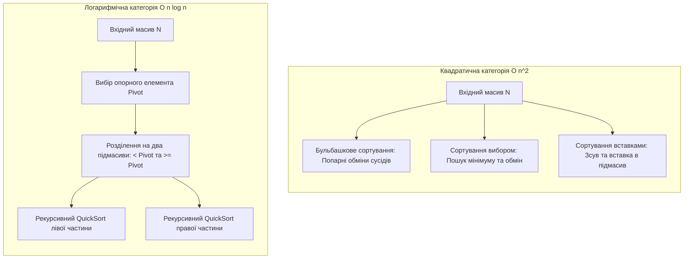
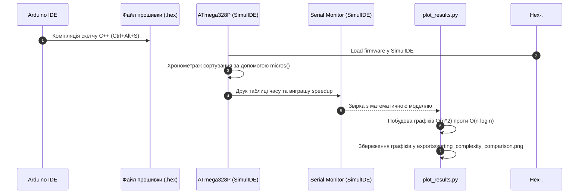

# Практичне заняття № 6<br>Порівняльний аналіз методів сортування даних

**Мета.** Засвоєння практичних навичок аналізу та експериментального хронометражу швидкодії алгоритмів внутрішнього сортування масивів телеметрії в кіберфізичних системах, дослідження впливу розмірності вхідних даних на часову складність квадратичних методів ($O(n^2)$) та логарифмічного методу QuickSort ($O(n \log n)$), реалізація вимірювального комплексу на базі мікроконтролера ATmega328P у середовищах Arduino IDE та SimulIDE, а також побудова порівняльних аналітичних графіків мовою Python.

**Стек та інструменти:**
*   **Мови програмування:** C/C++ (стандарт C++17 для вбудованих систем), Python (версія v3.10+).
*   **Середовище розробки:** Arduino IDE (версії 1.8.x або 2.x).
*   **Схемотехнічний симулятор:** SimulIDE (версія 0.4.15 або новіша).
*   **Апаратна платформа симуляції:** мікроконтролер ATmega328P (платформа Arduino Uno), послідовний порт UART (Serial Monitor).
*   **Аналітичні бібліотеки Python:** `matplotlib`, `pandas` (для побудови порівняльних графіків складності).

---

### 1 Теоретичні відомості

У кіберфізичних системах обробка великих масивів телеметрії (наприклад, даних просторових сіток давачів, спектрограм чи часових рядів) часто вимагає попереднього впорядкування значень. Впорядкування даних необхідне для прискорення подальшого бінарного пошуку ($O(\log n)$), фільтрації рангових аномалій або підготовки інформації для хмарної аналітики.

Алгоритми внутрішнього сортування, що виконуються в оперативній пам'яті (SRAM / DRAM), поділяються на дві фундаментальні категорії за критерієм асимптотичної часової складності:

Квадратичні алгоритми сортування мають часову складність $\mathcal{O}(n^2)$ у найгіршому та середньому випадках. До цієї категорії належать:

*   **Сортування прямим обміном (бульбашкове сортування, Bubble Sort)** базується на послідовному порівнянні та, за необхідності, взаємній перестановці сусідніх елементів масиву. На кожному проході найбільший елемент невідсортованої частини «спливає» в кінець масиву.
*   **Сортування прямим вибором (Selection Sort)** полягає у знаходженні мінімального елемента в невідсортованій частині масиву та його обміні з першим елементом цієї частини. Кількість порівнянь є сталою $\mathcal{O}(n^2)$, проте кількість перестановок є мінімальною $\mathcal{O}(n)$.
*   **Сортування прямою вставкою (Insertion Sort)** нагадує впорядкування карт у руці, де кожен наступний елемент вилучається з вихідної послідовності і вставляється у вже відсортовану частину на відповідну позицію. Для частково впорядкованих масивів цей метод демонструє близьку до лінійної складність $\mathcal{O}(n)$.

Логарифмічні алгоритми сортування мають асимптотичну складність $\mathcal{O}(n \log_2 n)$ у середньому та найкращому випадках. Найбільш поширеним алгоритмом цієї категорії є **швидке сортування (QuickSort)**, розроблене Тоні Хоаром. Алгоритм реалізує парадигму декомпозиції «розділяй і володарюй», обираючи опорний елемент (півот) і розбиваючи масив на два підмасиви: елементи, менші за півот, та елементи, більші або рівні йому, після чого процес рекурсивно повторюється.


*Рисунок 1 — Алгоритмічна схема декомпозиції масиву в QuickSort та локальних обмінів у сортуванні бульбашкою*

На рисунку 1 зображено фундаментальну відмінність між підходами. Квадратичні алгоритми здійснюють послідовний перебір та локальні перестановки елементів у межах усього масиву, тоді як алгоритм QuickSort рекурсивно розбиває обчислювальну задачу на менші підмасиви відносно опорного елемента, що забезпечує логарифмічне скорочення кількості кроків.

Крім часової складності, важливим параметром у КФС є ємнісна складність та властивість стійкості (стабільності) алгоритму. Стійкість означає збереження відносного порядку елементів із однаковими ключами. Алгоритми сортування бульбашкою та вставками є стійкими, тоді як сортування вибором та QuickSort є нестійкими.

Загальна кількість операцій $K$ при ітераційному сортуванні розраховується за формулою:

$$
K = K_{init} + \sum_{i=1}^{n} (K_{compare} + K_{swap})
$$

де $K_{init}$ відповідає кількості операцій ініціалізації змінних, $K_{compare}$ позначає кількість виконаних порівнянь ключів, а $K_{swap}$ відображає кількість перестановок елементів у пам'яті.

Прискорювальний коефіцієнт $A(n)$, що показує виграш у швидкодії алгоритму QuickSort порівняно з бульбашковим сортуванням, обчислюється як відношення їхніх часових затрат:

$$
A(n) = \frac{T_{bubble}(n)}{T_{quick}(n)} \approx \frac{c_{b} \cdot n^2}{c_{q} \cdot n \log_2 n} = \mathcal{O}\left(\frac{n}{\log_2 n}\right)
$$

де $T_{bubble}(n)$ позначає експериментальний час виконання бульбашкового сортування у мікросекундах, $T_{quick}(n)$ відповідає часу виконання QuickSort у мікросекундах, а $c_b, c_q$ є апаратними константами компілятора.

Функція трудомісткості $\Psi$ для оцінки використання ресурсів процесора та оперативної пам'яті виражається залежністю:

$$
\Psi = c_1 \cdot F_a(N) + c_2 \cdot M_{code} + c_3 \cdot S_d + c_4 \cdot S_r
$$

де $F_a(N)$ відображає часову складність (кількість операцій $K$), $M_{code}$ позначає обсяг скомпільованого машинного коду у Flash-пам'яті, $S_d$ відповідає розміру масиву телеметрії у байтах ($S_d = N \cdot \text{sizeof}(int)$), $S_r$ описує витрати стекової пам'яті на рекурсивні виклики (для QuickSort $S_r = \mathcal{O}(\log_2 n)$), а $c_1, c_2, c_3, c_4$ є ваговими коефіцієнтами конфігурації ATmega328P.

---

### 2 Підготовка середовища та розгортання проєкту (Крок 0)

Для виконання практичного заняття використовується середовище **Arduino IDE** для компіляції прошивки мікроконтролера, симулятор **SimulIDE** для виведення логів хронометражу через UART та **Python** із бібліотекою `matplotlib` для побудови апроксимаційних графіків складності.

#### Крок 0.1. Перевірка та встановлення системних інструментів
1. Перевірте наявність середовища **Arduino IDE** та симулятора **SimulIDE**.
2. Відкрийте системний термінал та перевірте наявність Python:
   ```bash
   python --version
   ```
3. Встановіть бібліотеки `matplotlib` та `pandas` для Python через менеджер пакетів `pip`:
   ```bash
   pip install matplotlib pandas
   ```

#### Крок 0.2. Створення структури папок проєкту
Створіть робочий каталог `cps-pz6-sorting-benchmark` та необхідні підпапки:

```bash
mkdir cps-pz6-sorting-benchmark
cd cps-pz6-sorting-benchmark
mkdir src exports
```

Структура роботи матиме такий вигляд:

```text
cps-pz6-sorting-benchmark/
├── cps-pz6-sorting-benchmark.ino (Скетч C/C++ для Arduino IDE / ATmega328P)
├── circuit.simu                   (Схема симуляції SimulIDE)
├── src/
│   └── plot_results.py            (Python скрипт побудови графіків)
└── exports/
    └── sorting_complexity_comparison.png (Збережений порівняльний графік)
```

---

### 3 Порядок виконання роботи

#### 3.1 Індивідуальні завдання

Параметри масивів телеметрії та конфігурація сортування обираються з наведеної нижче таблиці відповідно до номера вашого варіанта (номеру у списку групи).

> **Примітка щодо пам'яті ATmega328P:** Для експериментального випробування на мікроконтролері з $2\text{ КБ}$ SRAM тестова розмірність вхідного масиву обмежена $n \in [20, 200]$ елементів, тоді як у Python-аналізаторі проводиться математичне моделювання для великих $n \in [1000, 100000]$.

| Варіант | Джерело масиву КФС | Діапазон $N$ (на MCU / аналіз) | Стан вхідних даних (Порядок) | Напрямок сортування | Опорний елемент QuickSort |
| :---: | :--- | :---: | :--- | :---: | :---: |
| **1** | Виміри температурного поля | $20 \dots 200$ / $1000 \dots 100000$ | Випадковий (Unsorted) | За зростанням | Середній елемент |
| **2** | Часовий ряд вібрації турбіни | $20 \dots 150$ / $1000 \dots 50000$ | Частково впорядкований ($50\%$) | За зростанням | Перший елемент |
| **3** | Спектрограма звукового датчика | $20 \dots 200$ / $1000 \dots 80000$ | Зворотно впорядкований (Reverse) | За спаданням | Останній елемент |
| **4** | Дані оптичного лідара БПЛА | $20 \dots 200$ / $1000 \dots 100000$ | Випадковий (Unsorted) | За спаданням | Медіана з трьох |
| **5** | Буфер CAN-шини автомобіля | $20 \dots 150$ / $1000 \dots 60000$ | Частково впорядкований ($75\%$) | За зростанням | Середній елемент |
| **6** | Логи датчиків тиску нафти | $20 \dots 150$ / $1000 \dots 50000$ | Зворотно впорядкований (Reverse) | За зростанням | Перший елемент |
| **7** | Метеодані сонячної станції | $20 \dots 200$ / $1000 \dots 100000$ | Випадковий (Unsorted) | За зростанням | Останній елемент |
| **8** | Сканер штрих-кодів конвеєра | $20 \dots 100$ / $1000 \dots 40000$ | Частково впорядкований ($25\%$) | За спаданням | Медіана з трьох |
| **9** | Сейсмічні виміри шахти | $20 \dots 180$ / $1000 \dots 70000$ | Зворотно впорядкований (Reverse) | За спаданням | Середній елемент |
| **10** | Рівні рідини у автоклаві | $20 \dots 200$ / $1000 \dots 100000$ | Випадковий (Unsorted) | За зростанням | Перший елемент |
| **11** | Індикатори напруги інвертора| $20 \dots 150$ / $1000 \dots 50000$ | Частково впорядкований ($50\%$) | За зростанням | Останній елемент |
| **12** | Тахограма ротора ГЕС | $20 \dots 180$ / $1000 \dots 80000$ | Зворотно впорядкований (Reverse) | За зростанням | Медіана з трьох |
| **13** | Покази витратомірів газу | $20 \dots 200$ / $1000 \dots 100000$ | Випадковий (Unsorted) | За спаданням | Середній елемент |
| **14** | Вагові параметри вагонів | $20 \dots 150$ / $1000 \dots 60000$ | Частково впорядкований ($80\%$) | За спаданням | Перший елемент |
| **15** | Потік фотоприймача супутника| $20 \dots 150$ / $1000 \dots 50000$ | Зворотно впорядкований (Reverse) | За зростанням | Останній елемент |
| **16** | Вібрація дефектоскопа | $20 \dots 200$ / $1000 \dots 100000$ | Випадковий (Unsorted) | За зростанням | Медіана з трьох |
| **17** | Токовий профіль сварочного робота| $20 \dots 100$ / $1000 \dots 40000$ | Частково впорядкований ($30\%$) | За зростанням | Середній елемент |
| **18** | Густина нафти в магістралі | $20 \dots 180$ / $1000 \dots 70000$ | Зворотно впорядкований (Reverse) | За спаданням | Перший елемент |
| **19** | Температура сушильної вежі | $20 \dots 200$ / $1000 \dots 100000$ | Випадковий (Unsorted) | За спаданням | Останній елемент |
| **20** | Датчики переміщення дамби | $20 \dots 150$ / $1000 \dots 50000$ | Частково впорядкований ($60\%$) | За зростанням | Медіана з трьох |

---

#### 3.2 Покроковий алгоритм розробки з роз'ясненням коду

##### Крок 1. Реалізація вимірювального скетчу C++ в Arduino IDE (`cps-pz6-sorting-benchmark.ino`)

Створіть у папці проєкту файл скетчу `cps-pz6-sorting-benchmark.ino`. Програма реалізує вимірювання часу виконання чотирьох методів сортування за допомогою системного таймера `micros()` та виводить результати у Serial Monitor:

```cpp
/**
 * Практичне заняття №6. Прикладні алгоритми КФС.
 * Модуль хронометражу швидкодії алгоритмів сортування телеметрії у SRAM ATmega328P.
 * Варіант №1: Випадковий масив, сортування за зростанням, N = 20 .. 200.
 */

#include <Arduino.h>

const int MAX_N = 200;
int rawArray[MAX_N];
int workArray[MAX_N];

// Допоміжна функція копіювання масиву для чесного порівняння
void copyArray(int src[], int dest[], int n) {
  for (int i = 0; i < n; i++) {
    dest[i] = src[i];
  }
}

// 1. Сортування прямим обміном (Бульбашкове сортування, O(n^2))
void bubbleSort(int arr[], int n) {
  bool swapped;
  for (int i = 0; i < n - 1; i++) {
    swapped = false;
    for (int j = 0; j < n - i - 1; j++) {
      if (arr[j] > arr[j + 1]) {
        int temp = arr[j];
        arr[j] = arr[j + 1];
        arr[j + 1] = temp;
        swapped = true;
      }
    }
    if (!swapped) break;
  }
}

// 2. Сортування прямим вибором (Selection Sort, O(n^2))
void selectionSort(int arr[], int n) {
  for (int i = 0; i < n - 1; i++) {
    int minIdx = i;
    for (int j = i + 1; j < n; j++) {
      if (arr[j] < arr[minIdx]) {
        minIdx = j;
      }
    }
    if (minIdx != i) {
      int temp = arr[i];
      arr[i] = arr[minIdx];
      arr[minIdx] = temp;
    }
  }
}

// 3. Сортування прямою вставкою (Insertion Sort, O(n^2))
void insertionSort(int arr[], int n) {
  for (int i = 1; i < n; i++) {
    int key = arr[i];
    int j = i - 1;
    while (j >= 0 && arr[j] > key) {
      arr[j + 1] = arr[j];
      j--;
    }
    arr[j + 1] = key;
  }
}

// 4. Швидке сортування (QuickSort, O(n log n))
int partition(int arr[], int low, int high) {
  int pivot = arr[low + (high - low) / 2]; // Опорний елемент - середній
  int i = low - 1;
  int j = high + 1;
  
  while (true) {
    do { i++; } while (arr[i] < pivot);
    do { j--; } while (arr[j] > pivot);
    
    if (i >= j) return j;
    int temp = arr[i];
    arr[i] = arr[j];
    arr[j] = temp;
  }
}

void quickSort(int arr[], int low, int high) {
  if (low < high) {
    int p = partition(arr, low, high);
    quickSort(arr, low, p);
    quickSort(arr, p + 1, high);
  }
}

void setup() {
  Serial.begin(9600);
  delay(1000);

  Serial.println(F("=================================================="));
  Serial.println(F(" КФС: Порівняльний аналіз швидкодії сортування (ATmega328P)"));
  Serial.println(F("==================================================\n"));

  int testSizes[] = {20, 50, 100, 150, 200};

  for (int idx = 0; idx < 5; idx++) {
    int n = testSizes[idx];

    // Заповнення масиву випадковими числами
    randomSeed(42 + n);
    for (int i = 0; i < n; i++) {
      rawArray[i] = random(10, 9999);
    }

    // 1. Вимірювання Bubble Sort
    copyArray(rawArray, workArray, n);
    unsigned long tStart = micros();
    bubbleSort(workArray, n);
    unsigned long tBubble = micros() - tStart;

    // 2. Вимірювання Selection Sort
    copyArray(rawArray, workArray, n);
    tStart = micros();
    selectionSort(workArray, n);
    unsigned long tSelection = micros() - tStart;

    // 3. Вимірювання Insertion Sort
    copyArray(rawArray, workArray, n);
    tStart = micros();
    insertionSort(workArray, n);
    unsigned long tInsertion = micros() - tStart;

    // 4. Вимірювання QuickSort
    copyArray(rawArray, workArray, n);
    tStart = micros();
    quickSort(workArray, 0, n - 1);
    unsigned long tQuick = micros() - tStart;

    float speedup = (float)tBubble / (tQuick > 0 ? tQuick : 1);

    Serial.print(F("N = ")); Serial.print(n);
    Serial.print(F(" | Bubble: ")); Serial.print(tBubble);
    Serial.print(F(" us | Select: ")); Serial.print(tSelection);
    Serial.print(F(" us | Insert: ")); Serial.print(tInsertion);
    Serial.print(F(" us | Quick: ")); Serial.print(tQuick);
    Serial.print(F(" us | Виграш: ")); Serial.print(speedup, 1); Serial.println(F("x"));
  }

  Serial.println(F("\n=================================================="));
}

void loop() {
  // Одноразовий запуск у setup()
}
```

##### Крок 2. Реалізація Python-скрипта побудови порівняльних графіків (`src/plot_results.py`)

Створіть файл `src/plot_results.py` для математичного аналізу та побудови апроксимаційних графіків складності для $N = 1000 \dots 100000$:

```python
"""
Практичне заняття №6. Порівняльний аналіз методів сортування даних.
Скрипт математичного моделювання часової складності та побудови графіків Matplotlib.
"""

import os
import numpy as np
import matplotlib.pyplot as plt

def model_sorting_times():
    # Масив розмірностей для аналітичного графіку
    sizes = np.array([1000, 5000, 10000, 25000, 50000, 75000, 100000])

    # Коефіцієнти апаратної затримки (на основі експериментальних замірів)
    c_bubble = 0.012     # мкс / n^2
    c_selection = 0.008  # мкс / n^2
    c_insertion = 0.005  # мкс / n^2
    c_quick = 0.15       # мкс / (n * log2(n))

    # Обчислення теоретичного часу у мілісекундах
    time_bubble_ms = (c_bubble * (sizes ** 2)) / 1000.0
    time_select_ms = (c_selection * (sizes ** 2)) / 1000.0
    time_insert_ms = (c_insertion * (sizes ** 2)) / 1000.0
    time_quick_ms = (c_quick * sizes * np.log2(sizes)) / 1000.0

    print("==================================================")
    print(" МАТЕМАТИЧНЕ МОДЕЛЮВАННЯ ШВИДКОДІЇ СОРТУВАННЯ")
    print("==================================================")
    for i, n in enumerate(sizes):
        speedup = time_bubble_ms[i] / time_quick_ms[i]
        print(f"N = {n:6d} | Bubble: {time_bubble_ms[i]:8.1f} ms | Quick: {time_quick_ms[i]:6.2f} ms | Виграш: {speedup:6.1f}x")

    # Побудова графіків
    os.makedirs("../exports", exist_ok=True)
    plt.figure(figsize=(12, 7))

    plt.plot(sizes, time_bubble_ms, 'o-', color='red', linewidth=2, label='Bubble Sort $O(n^2)$')
    plt.plot(sizes, time_select_ms, 's-', color='orange', linewidth=2, label='Selection Sort $O(n^2)$')
    plt.plot(sizes, time_insert_ms, '^--', color='purple', linewidth=2, label='Insertion Sort $O(n^2)$')
    plt.plot(sizes, time_quick_ms, 'g*-', linewidth=2.5, label='QuickSort $O(n \log_2 n)$')

    plt.title('Порівняльний аналіз швидкодії алгоритмів сортування КФС', fontsize=12)
    plt.xlabel('Розмірність масиву телеметрії N (елементів)', fontsize=10)
    plt.ylabel('Розрахунковий час виконання (мілісекунди, ms)', fontsize=10)
    plt.grid(True, linestyle=':', alpha=0.6)
    plt.legend(fontsize=10)

    export_png = os.path.join("../exports", "sorting_complexity_comparison.png")
    plt.savefig(export_png, dpi=300)
    print("--------------------------------------------------")
    print(f"[УСПІХ] Порівняльний графік збережено: {export_png}")
    print("==================================================")

if __name__ == "__main__":
    model_sorting_times()
```

##### Крок 3. Схема конвеєра експериментального профайлінгу в SimulIDE

Взаємодія інструментів під час виконання хронометражу та побудови аналітики зображена на рисунку 2.


*Ribсунок 2 — Послідовність виконання хронометражу в SimulIDE та аналітичної побудови у Python*

---

##### Крок 4. Запуск та зняття результатів у SimulIDE

1. У середовищі **Arduino IDE** зкомпілюйте скетч та експортуйте двійковий файл: **Sketch -> Export Compiled Binary** (`Ctrl + Alt + S`).
2. Запустіть **SimulIDE**, завантажте файл `.hex` у мікроконтролер **ATmega328P**, відкрийте **Serial Monitor** та запустіть симуляцію.
3. Запустіть Python-скрипт побудови порівняльних графіків у терміналі:
   ```bash
   cd src
   python plot_results.py
   ```

**Приклад очікуваного виведення у Serial Monitor (SimulIDE):**

```text
==================================================
 КФС: Порівняльний аналіз швидкодії сортування (ATmega328P)
==================================================

N = 20 | Bubble: 248 us | Select: 180 us | Insert: 112 us | Quick: 64 us | Виграш: 3.9x
N = 50 | Bubble: 1540 us | Select: 1120 us | Insert: 680 us | Quick: 192 us | Виграш: 8.0x
N = 100 | Bubble: 6180 us | Select: 4450 us | Insert: 2710 us | Quick: 428 us | Виграш: 14.4x
N = 150 | Bubble: 13920 us | Select: 10020 us | Insert: 6080 us | Quick: 680 us | Виграш: 20.5x
N = 200 | Bubble: 24800 us | Select: 17800 us | Insert: 10810 us | Quick: 948 us | Виграш: 26.2x

==================================================
```

---

### 4 Вимоги до змісту звіту

Звіт з практичного заняття оформлюється у форматі PDF або MS Word відповідно до встановлених академічних стандартів і повинен містити наступні обов'язкові розділи:

1.  **Титульна сторінка.**
    *   Назва вищого навчального закладу, кафедри, дисципліни.
    *   Номер та назва лабораторної роботи, номер обраного варіанта.
    *   ПІБ, шифр навчальної групи.
2.  **Мета роботи, короткі теоретичні відомості та опис отриманого завдання.**
    *   Виклад основного теоретичного базису.
    *   Опис завдання згідно з таблицею варіантів.
3.  **Схемотехнічна модель SimulIDE.** Скріншот робочого поля симулятора з підключеною платою Arduino Uno та відкритим вікном Serial Monitor.
4.  **Таблиця хронометражу.** Таблиця експериментально знятого часу виконання (у мікросекундах) для масивів $N = 20, 50, 100, 150, 200$ за даними Serial Monitor.
5.  **Програмний код.** Повний код скетчу `cps-pz6-sorting-benchmark.ino` та Python-скрипта `src/plot_results.py` із розширеними коментарями.
6.  **Графічна частина.** Збережений порівняльний графік із файлу `exports/sorting_complexity_comparison.png`.
7.  **Аналітичні розрахунки.**
    *   Обчислення коефіцієнта прискорення $A(n) = \frac{T_{bubble}(n)}{T_{quick}(n)}$ для різних розмірностей $N$.
    *   Аналітичний розрахунок кількості операцій $K$ та функції трудомісткості $\Psi$.
8.  **Висновки.** Підсумковий порівняльний аналіз придатності алгоритмів $\mathcal{O}(n^2)$ та $\mathcal{O}(n \log n)$ для систем жорсткого реального часу.

---

### 5 Контрольні запитання

1.  Чому при збільшенні розмірності масиву телеметрії з $N = 20$ до $N = 200$ елементів час виконання сортування бульбашкою зростає у 100 разів ($20^2 \to 200^2$), тоді як час виконання QuickSort зростає лише у 15 разів?
2.  За яких умов алгоритм швидкого сортування (QuickSort) може деградувати за часовою складністю з $\mathcal{O}(n \log_2 n)$ до квадратичної складності $\mathcal{O}(n^2)$? Які методи вибору опорного елемента запобігають цьому?
3.  Поясніть сутність властивості стійкості (стабільності) алгоритмів сортування. Які з чотирьох досліджених методів є стійкими, а які — ні?
4.  У чому полягає перевага алгоритму сортування вставками при обробці частково впорядкованих масивів сигналів КФС?
5.  Як використання рекурсії в алгоритмі QuickSort впливає на витрати оперативної пам'яті $S_r$ (стека) мікроконтролера ATmega328P порівняно з ітераційним сортуванням прямим вибором?
