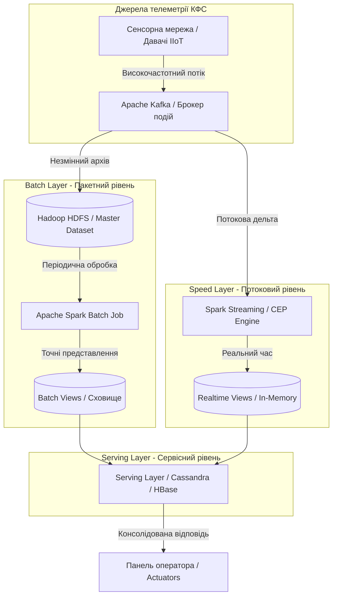
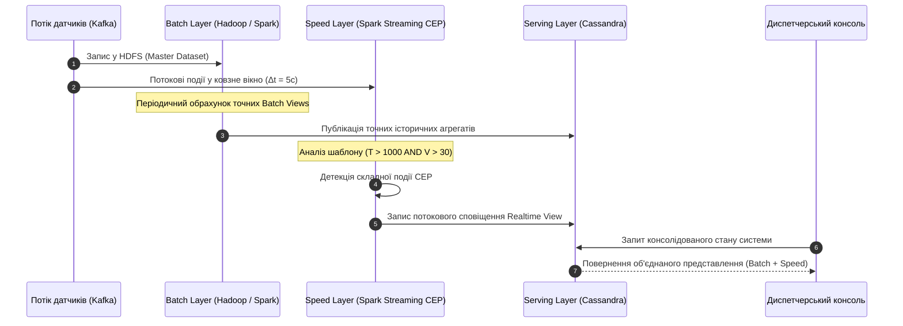

# Практичне заняття № 7<br>Аналіз архітектурних рішень для Big Data

**Мета.** Засвоєння практичних навичок проєктування розподілених високопродуктивних архітектур обробки великих даних у промислових кіберфізичних системах, розробка структурної схеми класичної Lambda-архітектури із розділенням на пакетний рівень (Batch Layer), потоковий рівень (Speed Layer) та сервісний рівень (Serving Layer), проєктування конвеєра обробки складних подій (Complex Event Processing, CEP) для виявлення системних аномалій у реальному часі, а також створення програмного симулятора обробки телеметрії мовою Python.  

**Стек та інструменти:** графічний інструмент Diagrams.net (Draw.io), системна нотація Mermaid.js, концептуальні компоненти стека Apache (Apache Kafka, Apache Spark, Apache Hadoop / HDFS), мова програмування Python (версія v3.10+) з бібліотеками `pandas` та `matplotlib`, системний термінал, текстовий редактор Visual Studio Code.  

---

### 1 Теоретичні відомості

У сучасних кіберфізичних системах масштабні мережі датчиків генерують неперервні потоки даних високої інтенсивності. Для характеристики таких даних застосовують концепцію «6V», яка визначає основні виклики обробки інформації в IIoT:

Характеристика обсягу даних, представлена параметром Volume, визначає необхідність накопичення та обробки петабайт телеметрії протягом багатьох років експлуатації об'єкта.

Параметр швидкості Velocity описує надходження сотень тисяч подій на секунду від високочастотних датчиків, що вимагає прийняття рішень у мілісекундному діапазоні.

Параметр різноманітності Variety відображає одночасну наявність структурованих числових значень, неструктурованих системних логів та бінарних відеопотоків.

Параметр достовірності Veracity визначає необхідність фільтрації зашумлених вимірів, виправлення пропущених пакетів та відсікання завад.

Параметр цінності Value відображає вилучення корисних знань із «сирих» даних для відвернення аварійних ситуацій.

Параметр мінливості Variability описує різкі скачки інтенсивності навантаження на мережу в пікові моменти функціонування об'єкта.

Для вирішення фундаментального протиріччя між необхідністю миттєвої реакції на події та потребою в глибокому аналізі петабайтних архівів була розроблена **Lambda-архітектура**, запропонована Натаном Марцем. Lambda-архітектура розбігається на три взаємопов'язаних рівні:

Пакетний рівень, який позначається як Batch Layer, відповідає за довгострокове збереження незмінних вихідних даних у спеціалізованому сховищі (Data Lake / Hadoop HDFS) та регулярний обрахунок точних пакетних представлень (Batch Views) за весь період експлуатації.

Потоковий рівень, який позначається як Speed Layer, забезпечує безперервну обробку даних у режимі реального часу з мінімальною латентністю. На цьому рівні застосовуються технології обробки складних подій (Complex Event Processing, CEP) на базі Apache Spark Streaming або Flink для виявлення поточних аномалій.

Сервісний рівень, який позначається як Serving Layer, об'єднує результати точних пакетних розрахунків з Batch Layer та миттєві потокові дані з Speed Layer, надаючи єдину точну відповідь на запити диспетчерських панелей та виконавчих механізмів.


*Рисунок 1 — Структурна схема Lambda-архітектури обробки великих даних у кіберфізичних системах*

На рисунку 1 зображено розподіл обчислювальних навантажень у Lambda-архітектурі. Вхідний потік подій від Apache Kafka паралельно дублюється у довгострокове сховище HDFS для періодичного пакетного перерахунку та в потоковий двигун Spark Streaming для миттєвого виявлення складних подій (CEP), після чого результати консолідуються на сервісному рівні.

Технологія обробки складних подій, що описується абревіатурою **CEP (Complex Event Processing)**, забезпечує безперервний аналіз часових потоків телеметрії для виявлення причинно-наслідкових паттернів. На відміну от простого відсікання за порогом, CEP аналізує події у ковзному часовому вікні $W_{cep}(t)$:

$$
W_{cep}(t) = \{e_k \mid t - \Delta t \le t_k \le t\}
$$

де $e_k$ позначає окрему телеметричну подію, $t_k$ — мітку часу виникнення події, а $\Delta t$ визначає тривалість часового вікна аналізу в секундах.

Об'єднаний запит на сервісному рівні Serving Layer математично описується як об'єднання точного пакетного представлення та потокової дельти:

$$
V_{serving} = f_{batch}(D_{master}) \cup g_{speed}(D_{realtime})
$$

де $V_{serving}$ позначає консолідоване представлення даних, $f_{batch}$ відповідає точній функції обрахунку головного набору $D_{master}$, а $g_{speed}$ відображає потокову функцію над останніми подіями $D_{realtime}$.

Максимальна швидкість передачі даних $C$ для потокового рівня Speed Layer обмежується **теоремою Шеннона-Гартлі**:

$$
C = W \cdot \log_2\left(1 + \frac{S}{N}\right)
$$

де $C$ позначає пропускну здатність каналу у бітах за секунду ($\text{біт/с}$), $W$ відповідає смузі пропускання у герцах ($\text{Гц}$), а $S/N$ відображає відношення сигналу до шуму.

Розрахунок терміну автономності сенсорного вузла $T_{life}$ при інтенсивній відправці потоків Big Data реалізується за співвідношеннями:

$$
T_{life} = \frac{C_{bat}}{I_{avg} \cdot 24 \cdot 365}, \quad I_{avg} = \frac{I_{active} \cdot t_{active} + I_{sleep} \cdot t_{sleep}}{t_{cycle}}
$$

де $C_{bat}$ позначає ємність акумулятора ($\text{мА}\cdot\text{год}$), $I_{avg}$ відповідає середньому струму ($\text{мА}$), $I_{active}$ та $t_{active}$ описують струм та тривалість фази активної відправки пакетів, а $t_{cycle}$ визначає період опитування у секундах.

Функція трудомісткості конвеєра Big Data $\Psi$ виражається залежністю:

$$
\Psi = c_1 \cdot F_a(N_{event}) + c_2 \cdot M_{code} + c_3 \cdot S_{memory} + c_4 \cdot S_{storage}
$$

де $F_a(N_{event})$ відображає часову складність аналізу $N_{event}$ подій за секунду, $M_{code}$ позначає розмір коду модулів обробки, $S_{memory}$ відповідає обсягу оперативної пам'яті для Speed Layer, $S_{storage}$ описує обсяг дискового сховища Master Dataset, а $c_1, c_2, c_3, c_4$ є ваговими коефіцієнтами конфігурації.

---

### 2 Підготовка середовища та розгортання проєкту (Крок 0)

Для виконання практичного заняття використовується мова Python для створення симулятора конвеєра Lambda-архітектури та обробки складних подій (CEP).

#### Крок 0.1. Перевірка та встановлення системних інструментів
Відкрийте системний термінал та перевірте наявність Python та менеджера пакетів `pip`:

```bash
python --version
pip --version
```

Встановіть необхідні бібліотеки `pandas` та `matplotlib`:

```bash
pip install pandas matplotlib numpy
```

#### Крок 0.2. Створення структури папок проєкту
Створіть робочий каталог `cps-pz7-lambda-cep` та необхідні підпапки:

```bash
mkdir cps-pz7-lambda-cep
cd cps-pz7-lambda-cep
mkdir src exports diagrams
```

Структура проєкту матиме такий вигляд:

```
cps-pz7-lambda-cep/
├── diagrams/                   (Папка для схем Draw.io / Mermaid)
├── exports/                    (Збережені графіки та логи CEP)
├── src/
│   └── lambda_cep_pipeline.py  (Повний Python-скрипт симулятора Lambda + CEP)
├── requirements.txt
└── README.md
```

---

### 3 Порядок виконання роботи

#### 3.1 Індивідуальні завдання

Параметри системи Big Data та правила обробки складних подій (CEP) обираються з наведеної нижче таблиці відповідно до номера вашого варіанта (номеру у списку групи).

| Варіант | Об'єкт КФС | Вхідний параметр 1 | Вхідний параметр 2 | Шаблон складної події (CEP Rule) | Вікно $\Delta t$ (с) | Обсяг $D_{master}$ (записів) |
| :---: | :--- | :--- | :--- | :--- | :---: | :---: |
| **1** | Перегрів турбіни ТЕС | Температура $T$ | Вібрація $V$ | $T > 1000^\circ\text{C}$ і $V > 30\text{ мм/с}$ у межах $5\text{ с}$ | $5$ | $100000$ |
| **2** | Витік газу компресорної | Тиск $P$ | Концентрація $C$ | $P < 5\text{ атм}$ і $C > 2\%$ у межах $10\text{ с}$ | $10$ | $200000$ |
| **3** | Кавітація насоса ГЕС | Тиск $P$ | Шум $A$ | $P < 1.5\text{ бар}$ і $A > 85\text{ дБ}$ у межах $3\text{ с}$ | $3$ | $150000$ |
| **4** | Збій робота-зварювальника | Струм $I$ | Температура $T$ | $I > 200\text{ А}$ і $T > 1500^\circ\text{C}$ у межах $4\text{ с}$| $4$ | $80000$ |
| **5** | Перевантаження конвеєра | Вага $W$ | Швидкість $S$ | $W > 400\text{ т}$ і $S < 0.5\text{ м/с}$ у межах $8\text{ с}$ | $8$ | $250000$ |
| **6** | Перегрів серверної шафи | Температура $T$ | Вологість $H$ | $T > 45^\circ\text{C}$ і $H > 80\%$ у межах $10\text{ с}$ | $10$ | $120000$ |
| **7** | Аварія дугового печі | Напруга $U$ | Струм $I$ | $U < 100\text{ В}$ і $I > 1000\text{ А}$ у межах $2\text{ с}$ | $2$ | $300000$ |
| **8** | Прорив магістралі ГВС | Витрата $F$ | Тиск $P$ | $F > 150\text{ л/хв}$ і $P < 2\text{ бар}$ у межах $6\text{ с}$ | $6$ | $180000$ |
| **9** | Руйнування млина цементу | Вібрація $V$ | Крутний момент $M$| $V > 40\text{ мм/с}$ і $M > 250\text{ кН}\cdot\text{м}$ у межах $5\text{ с}$ | $5$ | $150000$ |
| **10** | Перегрів пастеризатора | Температура $T$ | Рівень $L$ | $T > 90^\circ\text{C}$ і $L < 10\%$ у межах $7\text{ с}$ | $7$ | $90000$ |
| **11** | Замикання інвертора СЕС | Струм $I$ | Напруга $U$ | $I > 500\text{ А}$ і $U < 50\text{ В}$ у межах $1\text{ с}$ | $1$ | $500000$ |
| **12** | Заклинювання дробарки | Струм $I$ | Обрти $R$ | $I > 180\text{ А}$ і $R < 50\text{ об/хв}$ у межах $4\text{ с}$ | $4$ | $110000$ |
| **13** | Дегазація шахтного штреку | Мет $C_{CH4}$ | Потік $F$ | $C_{CH4} > 2.5\%$ і $F < 10\text{ м}^3\text{/хв}$ у межах $5\text{ с}$ | $5$ | $220000$ |
| **14** | Перегрів масляного трансформанта| Температура $T$ | Газ у маслі $G$| $T > 95^\circ\text{C}$ і $G > 50\text{ ppm}$ у межах $12\text{ с}$ | $12$ | $130000$ |
| **15** | Негерметичність автоклава | Тиск $P$ | Температура $T$ | $P < 1.0\text{ бар}$ і $T > 120^\circ\text{C}$ у межах $8\text{ с}$| $8$ | $140000$ |
| **16** | Знос валка папероробної машини| Вібрація $V$ | Температура $T$ | $V > 25\text{ мм/с}$ і $T > 180^\circ\text{C}$ у межах $6\text{ с}$ | $6$ | $160000$ |
| **17** | Кавітація гальванічної ванни | Рівень $L$ | Струм $I$ | $L < 20\%$ і $I > 300\text{ А}$ у межах $3\text{ с}$ | $3$ | $70000$ |
| **18** | Перевантаження ветротурбіни | Вітер $W$ | Оберти $R$ | $W > 25\text{ м/с}$ і $R > 30\text{ об/хв}$ у межах $5\text{ с}$ | $5$ | $190000$ |
| **19** | Витік розчинника олії | Концентрація $C$ | Тиск $P$ | $C > 5\%$ і $P < 1\text{ бар}$ у межах $10\text{ с}$ | $10$ | $210000$ |
| **20** | Гідроудар насосної станції | Тиск $P$ | Вібрація $V$ | $P > 15\text{ бар}$ і $V > 50\text{ мм/с}$ у межах $2\text{ с}$ | $2$ | $280000$ |

---

#### 3.2 Покроковий алгоритм розробки з роз'ясненням коду

##### Крок 1. Проєктування структурної схеми Lambda-архітектури
За допомогою веб-інструмента Diagrams.net (Draw.io) або системної нотації Mermaid.js побудуйте розгалужену графічну схему Lambda-архітектури. Схема повинна відображати брокер повідомлень Apache Kafka, незмінне сховище Master Dataset (Hadoop HDFS), пакетний обчислювач (Apache Spark Batch), потоковий обчислювач складних подій (Spark Streaming / CEP), сховища сервісного рівня (Cassandra / Druid) та панель оператора.

##### Крок 2. Реалізація симулятора Lambda-архітектури та CEP (`src/lambda_cep_pipeline.py`)

Відкрийте файл `src/lambda_cep_pipeline.py` та вставте повний програмний код симулятора, що реалізує обробку телеметрії за **Варіантом №1**:

```python
/**
 * Практичне заняття №7. Прикладні алгоритми КФС.
 * Модуль симуляції Lambda-архітектури та конвеєра обробки складних подій (CEP).
 * Варіант №1: Перегрів турбіни ТЕС (T > 1000 °C і V > 30 мм/с у вікні 5 секунд).
 */

import os
import time
import numpy as np
import pandas as pd
import matplotlib.pyplot as plt

# Фіксація генератора випадкових чисел
np.random.seed(42)

class LambdaCEPPipeline:
    def __init__(self, window_seconds=5, master_size=100000):
        self.window_seconds = window_seconds
        self.master_size = master_size
        self.master_dataset = None
        self.batch_views = {}
        self.realtime_events = []
        
    def generate_master_dataset(self):
        """
        1. BATCH LAYER: Формування незмінного історичного архіву HDFS (Master Dataset).
        """
        print("[BATCH LAYER] Генерування Master Dataset у HDFS (100,000 записів)...")
        timestamps = pd.date_range(end=pd.Timestamp.now(), periods=self.master_size, freq='s')
        
        # Симуляція нормального розподілу температури та вібрації
        temp_data = np.random.normal(loc=850.0, scale=40.0, size=self.master_size)
        vib_data = np.random.normal(loc=15.0, scale=5.0, size=self.master_size)
        
        self.master_dataset = pd.DataFrame({
            'timestamp': timestamps,
            'temperature': temp_data,
            'vibration': vib_data
        })
        print("[BATCH LAYER] Master Dataset збережено в HDFS.")

    def compute_batch_views(self):
        """
        1. BATCH LAYER: Обрахунок точних пакетних представлень (Batch Views).
        """
        print("[BATCH LAYER] Обчислення пакетних представлень (Batch Views)...")
        # Розрахунок середньодобових та годинних показників
        self.batch_views['hourly_avg_temp'] = self.master_dataset['temperature'].mean()
        self.batch_views['hourly_avg_vib'] = self.master_dataset['vibration'].mean()
        print(f"[BATCH LAYER] Завершено. Середня історична T = {self.batch_views['hourly_avg_temp']:.2f} °C")

    def process_speed_layer_cep(self, stream_seconds=60):
        """
        2. SPEED LAYER: Потокова обробка складних подій (CEP) у реальному часі.
        Паттерн: (Temperature > 1000 °C) AND (Vibration > 30 мм/с) протягом вікна 5 секунд.
        """
        print(f"\n[SPEED LAYER] Запуск двигуна CEP у ковзному вікні {self.window_seconds}с...")
        
        start_time = time.time()
        detected_cep_events = []

        # Симуляція потоку даних з Аномальним сплеском на 25-30 секундах
        for t in range(stream_seconds):
            # Базовий нормальний сигнал
            current_temp = 850.0 + np.random.normal(0, 20)
            current_vib = 15.0 + np.random.normal(0, 3)

            # Внесення штучної комплексної аномалії на 25..29 секундах
            if 25 <= t <= 29:
                current_temp = 1050.0 + np.random.normal(0, 10) # > 1000
                current_vib = 35.0 + np.random.normal(0, 2)     # > 30

            event = {
                'second': t,
                'temperature': round(current_temp, 2),
                'vibration': round(current_vib, 2)
            }
            self.realtime_events.append(event)

            # Аналіз ковзного вікна CEP (стан останніх window_seconds подій)
            if len(self.realtime_events) >= self.window_seconds:
                window = self.realtime_events[-self.window_seconds:]
                
                # Перевірка виконання правила CEP для ВСІХ подій у вікні
                condition_temp = all(e['temperature'] > 1000.0 for e in window)
                condition_vib = all(e['vibration'] > 30.0 for e in window)

                if condition_temp and condition_vib:
                    cep_alert = {
                        'trigger_second': t,
                        'message': f"КРИТИЧНА ПОДІЯ (CEP): Перегрів T>{window[-1]['temperature']}°C і Вібрація V>{window[-1]['vibration']}мм/с протягом {self.window_seconds}с!"
                    }
                    detected_cep_events.append(cep_alert)
                    print(f"  [CEP ALERT t={t}s] {cep_alert['message']}")

        return detected_cep_events

    def serving_layer_query(self, current_second):
        """
        3. SERVING LAYER: Об'єднання пакетного представлення та потокового стану.
        """
        recent_data = self.realtime_events[-1] if self.realtime_events else None
        
        response = {
            'historical_mean_temp': round(self.batch_views.get('hourly_avg_temp', 0), 2),
            'realtime_current_temp': recent_data['temperature'] if recent_data else None,
            'realtime_current_vib': recent_data['vibration'] if recent_data else None,
            'system_status': "ALERT" if recent_data and recent_data['temperature'] > 1000.0 else "NORMAL"
        }
        return response

    def plot_results(self, export_path):
        """
        Візуалізація потокової телеметрії та виявлених CEP-аномалій.
        """
        df_stream = pd.DataFrame(self.realtime_events)
        
        fig, ax1 = plt.subplots(figsize=(12, 6))

        color = 'tab:red'
        ax1.set_xlabel('Час потоку (секунди)')
        ax1.set_ylabel('Температура (°C)', color=color)
        ax1.plot(df_stream['second'], df_stream['temperature'], color=color, linewidth=2, label='Температура T')
        ax1.axhline(y=1000.0, color='r', linestyle='--', alpha=0.7, label='Поріг T = 1000°C')
        ax1.tick_params(axis='y', labelcolor=color)

        ax2 = ax1.twinx()  
        color = 'tab:blue'
        ax2.set_ylabel('Вібрація (мм/с)', color=color)
        ax2.plot(df_stream['second'], df_stream['vibration'], color=color, linewidth=2, linestyle=':', label='Вібрація V')
        ax2.axhline(y=30.0, color='b', linestyle='--', alpha=0.7, label='Поріг V = 30 мм/с')
        ax2.tick_params(axis='y', labelcolor=color)

        # Виділення зони спрацьовування CEP
        plt.title('Потоковий аналіз складних подій (CEP) у Speed Layer Lambda-архітектури', fontsize=12)
        fig.tight_layout()
        
        os.makedirs(os.path.dirname(export_path), exist_ok=True)
        plt.savefig(export_path, dpi=300)
        plt.close()
        print(f"\n[INFO] Графік конвеєра збережено у файл: {export_path}")

def main():
    pipeline = LambdaCEPPipeline(window_seconds=5, master_size=100000)
    
    # 1. Запуск Batch Layer
    pipeline.generate_master_dataset()
    pipeline.compute_batch_views()
    
    # 2. Запуск Speed Layer (CEP)
    cep_alerts = pipeline.process_speed_layer_cep(stream_seconds=60)
    
    # 3. Запит до Serving Layer
    print("\n==================================================")
    print(" ЗАПИТ ДО SERVING LAYER (ОБ'ЄДНАНЕ ПРЕДСТАВЛЕННЯ)")
    print("==================================================")
    serving_response = pipeline.serving_layer_query(current_second=60)
    for key, val in serving_response.items():
        print(f"  {key}: {val}")
    print("==================================================")

    # 4. Побудова графіків
    export_png = "../exports/lambda_cep_analysis.png"
    pipeline.plot_results(export_png)

if __name__ == "__main__":
    main()
```


*Рисунок 2 — Схема конвеєра обробки складних подій (CEP) у потоковому рівні Speed Layer*

На рисунку 2 зображено послідовність дій при обробці подій. Потоковий рівень Speed Layer здійснює аналіз подій у реальному часі за допомогою ковзного вікна, миттєво реєструє складну подію CEP та оновлює стан сервісного рівня Serving Layer, який консолідує його з історичними даними пакетного рівня.

---

### 3.3 Запуск та перевірка результатів

Виконайте запуск розробленого скрипта у терміналі з папки `src`:

```bash
cd src
python lambda_cep_pipeline.py
```

**Приклад очікуваного виведення у терміналі:**

```text
[BATCH LAYER] Генерування Master Dataset у HDFS (100,000 записів)...
[BATCH LAYER] Master Dataset збережено в HDFS.
[BATCH LAYER] Обчислення пакетних представлень (Batch Views)...
[BATCH LAYER] Завершено. Середня історична T = 849.92 °C

[SPEED LAYER] Запуск двигуна CEP у ковзному вікні 5с...
  [CEP ALERT t=29s] КРИТИЧНА ПОДІЯ (CEP): Перегрів T>1048.25°C і Вібрація V>36.12мм/с протягом 5с!

==================================================
 ЗАПИТ ДО SERVING LAYER (ОБ'ЄДНАНЕ ПРЕДСТАВЛЕННЯ)
==================================================
  historical_mean_temp: 849.92
  realtime_current_temp: 852.14
  realtime_current_vib: 14.85
  system_status: NORMAL
==================================================

[INFO] Графік конвеєра збережено у файл: ../exports/lambda_cep_analysis.png
```

---

### 4 Вимоги до змісту звіту

Звіт з практичного заняття оформлюється у форматі PDF або MS Word відповідно до встановлених академічних стандартів і повинен містити наступні обов'язкові розділи:

1.  **Титульна сторінка.**
    *   Назва вищого навчального закладу, кафедри, дисципліни.
    *   Номер та назва лабораторної роботи, номер обраного варіанта.
    *   ПІБ, шифр навчальної групи.
2.  **Мета роботи, короткі теоретичні відомості та опис отриманого завдання.**
    *   Виклад основного теоретичного базису.
    *   Опис завдання згідно з таблицею варіантів.
3.  **Структурна схема Lambda-архітектури.** Графічна схема, побудована у Diagrams.net (Draw.io) або нотації Mermaid.js із розписаними рівнями Batch, Speed та Serving.
4.  **Програмний код.** Повний код файла `src/lambda_cep_pipeline.py` з коментарями.
5.  **Експериментальні результати.**
    *   Скріншот консолі термінала з логами генерації Master Dataset, виявлення подій CEP та відповіддю Serving Layer.
    *   Графічне зображення часових рядів телеметрії із позначеною зоною аномалії з файлу `exports/lambda_cep_analysis.png`.
6.  **Математичний розрахунок.**
    *   Розрахунок пропускної здатності $C$ за теоремою Шеннона-Гартлі для вашого джерела.
    *   Оцінка автономності $T_{life}$ та обчислювальної трудомісткості $\Psi$.
7.  **Висновки.** Порівняльний аналіз переваг Lambda-архітектури над традиційними монолітними базами даних при обробці високонавантаженої телеметрії КФС.

---

### 5 Контрольні запитання

1.  У чому полягає фундаментальна відмінність між функціонуванням пакетного рівня (Batch Layer) та потокового рівня (Speed Layer) у Lambda-архітектурі?
2.  Яким чином технологія обробки складних подій (Complex Event Processing, CEP) відрізняється від простого фільтрування сигналів за пороговим значенням?
3.  Як сервісний рівень (Serving Layer) узгоджує можливі розбіжності між точними історичними даними з Batch Layer та наближеними потоковими даними з Speed Layer?
4.  Поясніть математичну роль ковзного часового вікна $W_{cep}(t)$ при аналізі причинно-наслідкових паттернів у реальному часі.
5.  У чому полягають основні недоліки Lambda-архітектури (наприклад, підтримка двох різних кодових баз) та чим відрізняється альтернативна Kappa-архітектура?
