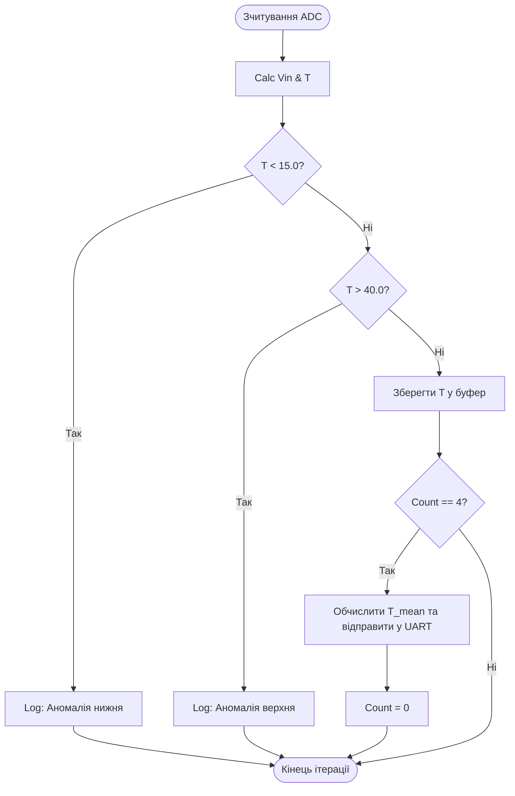

## ПЕРЕЛІК ТЕСТОВИХ ЗАПИТАНЬ ДО ТЕМАТИЧНОГО КОНТРОЛЮ ТА ТЕОРЕТИЧНОЇ ЧАСТИНИ ПІДСУМКОВОГО ІСПИТУ

### ТЕМА 1. ТЕОРЕТИЧНІ ЗАСАДИ АЛГОРИТМІЗАЦІЇ

#### 1. Основні поняття, властивості та класифікація алгоритмів

**1.** В архітектурі обчислювальних та кіберфізичних систем первинний концептуальний рівень, який описує математичну логіку та алгоритмічну концепцію поведінки системи незалежно від мови програмування чи апаратури, називається...
- Brainware
- Software
- Hardware
- Firmware

**2.** Назва «алгоритм» походить від латинської транскрипції імені якого середньовічного математика?
- Абу Абдулли Мухаммада ібн Муса аль-Хорезмі
- Алана Тюрінґа
- Еміля Поста
- Едсгера Дейкстри

**3.** Яка властивість алгоритму гарантує, що кожен його крок є строго однозначним, а повторне застосування до ідентичних вхідних даних завжди призводить до однакового результату?
- Детермінованість
- Дискретність
- Масовість
- Скінченність

**4.** Властивість алгоритму, яка вимагає обов'язкового завершення обчислювального процесу за скінченне число кроків із отриманням результату, називається...
- Скінченністю (збіжністю)
- Дискретністю
- Масовістю
- Здійсненністю

**5.** У чому полягає властивість дискретності алгоритму?
- Обчислювальний процес розбивається на окремі елементарні кроки, що виконуються послідовно
- Алгоритм придатний для розв'язання цілого класу однотипних задач
- Кожен крок алгоритму трактується однозначно незалежно від виконавця
- Алгоритм обов'язково видає конкретні вихідні дані

**6.** Властивість масовості алгоритму означає, що він розроблений виключно для розв'язання однієї конкретної задачі з унікальними вхідними даними.
- Правильно
- Неправильно

**7.** Рівень Brainware залишається незмінним незалежно від того, якою мовою програмування реалізовано код та яка процесорна архітектура використовується.
- Правильно
- Неправильно

**8.** У спрощеній обчислювальній моделі з одиничною вартістю прийнято вважати, що тривалість виконання кожної елементарної операції є однаковою і дорівнює одиниці.
- Правильно
- Неправильно

**9.** Встановіть відповідність між властивістю алгоритму та її змістом:

*Властивості:*
1. Детермінованість
2. Дискретність
3. Масовість
4. Здійсненність

*Зміст:*
- Покрокове виконання послідовності окремих дій
- Однозначність кожного кроку обчислень для виконавця
- Фізична та логічна можливість виконання в межах наявних ресурсів
- Придатність для розв'язання цілого класу однотипних задач

**10.** Встановіть відповідність між типом алгоритму та його характеристикою:

*Типи алгоритмів:*
1. Лінійний
2. Розгалужений
3. Циклічний
4. Комбінований

*Характеристики:*
- Багаторазове повторення певної групи операцій
- Послідовне виконання дій одна за одною без умовних переходів
- Поєднання лінійних, розгалужених та циклічних структур
- Наявність умовних переходів залежно від істинності виразу

**11.** Які з наведених властивостей є фундаментальними вимогами до алгоритму? *(Оберіть усі правильні варіанти)*
- Дискретність
- Детермінованість
- Скінченність
- Масовість
- Здійсненність
- Невизначеність
- Безкінечність

**12.** У функції трудомісткості $\Psi = c_1 F_a(N) + c_2 M + c_3 S_d + c_4 S_r$, який параметр відповідає за обсяг оперативної пам'яті для організації самих обчислень (стек, рекурсія)?
- $S_r$
- $S_d$
- $M$
- $F_a(N)$

**13.** Як називається параметр $F_a(N)$ у формулі оцінки трудомісткості ресурсів алгоритму? *(Відкрите запитання)*

**14.** На відміну від блок-схем, структурні діаграми дій ростуть переважно ________, що дозволяє зручно розміщувати їх на екрані комп'ютера.
- вертикально
- горизонтально
- діагонально
- хаотично

**15.** Який основний недолік класичних блок-схем за ISO 5807:1985 при проєктуванні складних програмних комплексів?
- Провокують неструктурний стиль програмування з використанням операторів goto
- Неможливість використання умовних розгалужень
- Заборона використання прямокутних блоків дій
- Відсутність графічних позначень для початку та кінця

**16.** У 1968 році Едсгер Дейкстра опублікував працю, що заклала основи парадигми структурного програмування. Яку назву вона мала?
- «Оператор Go To вважається шкідливим»
- «Теорія алгоритмів та структур даних»
- «Принципи машини Тюрінґа»
- «Мова програмування Паскаль»

**17.** Правила побудови класичних блок-схем регламентуються міжнародним стандартом ISO 5807:1985.
- Правильно
- Неправильно

**18.** Структурні діаграми дій (Action Diagrams) дозволяють вільно створювати неструктуровані переходи за допомогою оператора goto.
- Правильно
- Неправильно

**19.** Встановіть відповідність між геометричним блоком блок-схеми та його функцією за стандартом ISO 5807:1985:

*Геометричні блоки:*
1. Овал
2. Прямокутник
3. Ромб
4. Паралелограм

*Функції:*
- Вузол розгалуження за логічною умовою
- Термінальні вузли (початок та кінець алгоритму)
- Введення або виведення даних
- Обчислювальна дія або послідовність операторів

**20.** Які дві форми запису використовуються для побудови структурних діаграм дій (Action Diagrams)?
- Прямокутна та дужкова
- Овальна та ромбічна
- Словесна та графічна
- Лінійна та матрична

---

#### 2. Візуалізація та розрахунок складності

**21.** У формулі підрахунку операцій $K = K_L + K_{AS} + K_A + K_C$, яка змінна відповідає за кількість операцій порівняння у розгалуженнях і циклах? *(Відкрите запитання)*

**22.** Якщо у найпростішій гілці розгалуженого алгоритму виконується $K_{min} = 10$ операцій, а у наиболее навантаженій гілці $K_{max} = 30$ операцій, обчисліть середню кількість операцій $K_{avg}$. *(Розрахункове завдання)*

**23.** Позначення $K_{AS}$ у розрахунку кількості операцій алгоритму $K = K_L + K_{AS} + K_A + K_C$ означає кількість...
- операторів присвоєння значень
- обробок заголовків циклів
- арифметичних операцій
- операцій порівняння

**24.** Хто з науковців зробив вирішальний внесок у створення та розвиток парадигми структурного програмування? *(Оберіть усі правильні варіанти)*
- Едсгер Дейкстра
- Ніклаус Вірт
- Тоні Хоар
- Еміль Пост
- Алан Тюрінґ

**25.** Дужкова форма діаграм дій є менш наочною за прямокутну, але зручнішою для швидкого запису алгоритму від руки.
- Правильно
- Неправильно

**26.** У якому році американський математик Еміль Пост запропонував абстрактну обчислювальну модель машини Поста?
- 1936
- 1945
- 1956
- 1928

**27.** У якій системі числення працює класична машина Поста?
- Унарній
- Двійковій
- Десятковій
- Шістнадцятковій

**28.** Що називають колізією машини Поста?
- Спробу записати мітку в вже зайняту комірку або стерти мітку в порожній комірці
- Перехід каретки за межі лівої межі стрічки
- Спробу виконання термінальної команди зупинки
- Нескінченне зациклення умовного переходу

**29.** Послідовність інструкцій машини Поста, яка не створює колізій і гарантовано завершується командою зупинки за скінченне число кроків з коректним результатом, називається...
- фінітним 1-процесом
- детермінованим циклом
- автоматним графом
- алгоритмічним лініаром

**30.** Встановіть відповідність між позначенням команди машини Поста та її дією:

*Команди:*
1. `V i`
2. `X i`
3. `? i; j`
4. `!`

*Дії:*
- Зупинити роботу алгоритму
- Стерти мітку в поточній комірці та перейти до інструкції i
- Перевірити комірку: якщо є мітка, перейти на i, якщо порожньо — на j
- Поставити мітку в поточну комірку та перейти до інструкції i

---

#### 3. Формальні моделі обчислень (Машини Поста та Тюрінґа)

**31.** Стрічка машини Поста є скінченною з двох боків і обмежується 256 комірками.
- Правильно
- Неправильно

**32.** На відміну від машини Поста, машина Тюрінґа є знакопереробним пристроєм, що працює з довільним алфавітом символів.
- Правильно
- Неправильно

**33.** Що у машині Тюрінґа виконує роль внутрішньої пам'яті автомата?
- Алфавіт внутрішніх станів $q_i$
- Розмір каретки
- Індекс комірки стрічки
- Таблиця колізій

**34.** Про що стверджує теза Черча — Тюрінґа?
- Будь-яка ефективно обчислювана функція може бути реалізована на машині Тюрінґа
- Машина Поста є більш потужною за обчислювальними можливостями, ніж машина Тюрінґа
- Кожна алгоритмічна задача має точний детермінований розв'язок
- Проблема зупинки машини Тюрінґа є алгоритмічно розв'язною

**35.** Що доводить «проблема зупинки» у теорії алгоритмів?
- Існування алгоритмічно нерозв'язних проблем
- Неможливість побудови машини Поста без колізій
- Необхідність використання мов програмування високого рівня
- Залежність часової складності від апаратного забезпечення

**36.** Як називається фундаментальна проблема теорії алгоритмів, яка доводить неможливість побудови універсального алгоритму для визначення завершення довільної програми? *(Відкрите запитання)*

**37.** Команда переходу машини Тюрінґа записується у вигляді $\alpha q_i \to \beta q_j \xi$, де параметр $\xi$ визначає ________.
- напрямок руху каретки
- новий символ
- новий стан
- номер комірки

**38.** У команді переходу машини Тюрінґа $\alpha q_i \to \beta q_j \xi$, які значення може приймати параметр напрямку руху $\xi$?
- Л (вліво), П (вправо), Н (залишитися на місці)
- V (поставити мітку), X (стерти мітку)
- 0, 1, -1
- +1, -1

**39.** Порівняйте характеристики машин Поста та Тюрінґа (встановіть відповідність):

*Поняття / Елементи:*
1. Система числення Поста
2. Алфавіт Тюрінґа
3. Внутрішній стан Тюрінґа
4. Команда `!` в Пості

*Характеристики:*
- Довільна множина символів та порожній символ
- Термінальна команда зупинки
- Виключно унарна (мітки та пробіли)
- Пам'ять автомата $q_i$

**40.** У функції трудомісткості машини Поста $\Psi = c_1 F_a(N) + c_2 M + c_3 S_d + c_4 S_r$, що означає параметр $M$?
- Обсяг програмного коду (кількість команд у системі інструкцій)
- Масу процесорного модуля
- Загальну кількість виконаних кроків каретки
- Розмірність вхідного унарного сигналу

**41.** Що відображає параметр $S_d$ у функції трудомісткості $\Psi$?
- Обсяг пам'яті стрічки, зайнятий вхідними та вихідними даними
- Обсяг оперативної пам'яті під проміжні обчислення
- Часову складність алгоритму у тактах
- Кількість команд у системі інструкцій

**42.** Скільки міток ('1') містить суцільний блок для представлення числа 4 в унарній системі числення на стрічці машини Поста? *(Відкрите запитання)*

**43.** Якщо на стрічці машини Поста задано декілька унарних чисел, чим вони відокремлюються одне від одного?
- Одною порожньою коміркою ('0')
- Двома мітками ('11')
- Спеціальним символом '#'
- Командою '!'

**44.** Теза Черча — Тюрінґа є строгою математичною теоремою, яка має формальне доведення.
- Правильно
- Неправильно

**45.** Чому діаграми Нассі-Шнейдермана рідко використовуються для опису великих промислових алгоритмів?
- Схема розростається в ширину і довжину, через що її важко розмістити та читати
- Вони дозволяють використовувати неструктурний оператор goto
- Вони не мають засобів для відображення умовних розгалужень
- Вони призначені виключно для асемблерних команд

**46.** Головна перевага діаграм дій перед блок-схемами при збільшенні складності алгоритму полягає у тому, що діаграми дій...
- зростають переважно вертикально та зберігають чітку структурованість
- не вимагають використання змінних
- автоматично виконуються на процесорі без компіляції
- використовують лише геометричні ромби

**47.** Які з наведених тверджень є правильними щодо псевдокоду? *(Оберіть усі правильні варіанти)*
- Це універсальна нотація опису алгоритмів високого рівня
- Він абстрагується від синтаксису конкретних мов програмування
- Його мета — пояснити логіку алгоритму для людини
- Він може безпосередньо виконуватися комп'ютерним процесором
- Він вимагає строгого оголошення типів усіх змінних

**48.** Назвіть прізвища двох науковців, які у 1930-х роках незалежно заклали теоретичні основи алгоритмів, створивши абстрактні обчислювальні машини. *(Відкрите запитання)*

**49.** У стандарті ISO 5807:1985 геометрична фігура «прямокутник» у блок-схемах позначає:
- Обчислювальну дію або послідовність операторів
- Термінальний вузол (початок чи кінець)
- Умовний перехід за логічним виразом
- Введення чи виведення даних

**50.** У стандарті ISO 5807:1985 геометрична фігура «ромб» у блок-схемах позначає:
- Вузол розгалуження за логічною умовою
- Виконання послідовної обчислювальної дії
- Початок або кінець алгоритму
- Зчитування даних із зовнішнього пристрою

**51.** Інструкція `? i; j` у машині Поста виконує умовний перехід: якщо в комірці є мітка, перехід здійснюється на крок `i`, а якщо порожньо — на крок `j`.
- Правильно
- Неправильно

**52.** Команди `<- i` та `-> i` у машині Поста переміщують каретку на дві комірки ліворуч або праворуч відповідно.
- Правильно
- Неправильно

**53.** Встановіть відповідність між нотацією складності та її призначенням:

*Нотації:*
1. $T(n)$
2. $F_a(N)$
3. $\Psi$
4. $O(n)$

*Призначення:*
- Часова складність у функції трудомісткості
- Комплексна функція трудомісткості ресурсів КФС
- Точний час виконання або кількість елементарних операцій
- Верхня межа асимптотичної складності

**54.** Де найчастіше застосовується формульно-словесний (аналітичний) спосіб запису алгоритмів?
- У математиці для доведення теорем
- У мікроконтролерах КФС для керування двигунами
- У веб-серверах Node.js
- У комп'ютерних відеоіграх

**55.** Математичний вираз $T(n) = \sum_{i=1}^{N} t_i$ описує:
- Загальний час виконання алгоритму як суму часу окремих операцій
- Функцію трудомісткості оперативної пам'яті
- Асимптотичну верхню межу за нотацією O-велике
- Кількість колізій машини Поста

**56.** Властивість алгоритму, яка передбачає розбиття обчислень на окремі завершені кроки, називається ________.
- дискретністю
- детермінованістю
- масовістю
- скінченністю

**57.** Який елемент у діаграмах дій (Action Diagrams) забезпечує наочність ієрархії та вкладеності операторних блоків?
- Бокові вертикальні лінії (дужки)
- Стрілки між ромбами
- Пунктирні лінії переходу
- Геометричні овали

**58.** Властивість масовості гарантує, що правильно побудований алгоритм може застосовуватися для розв'язання будь-якої довільної задачі без обмежень.
- Правильно
- Неправильно

**59.** Вкажіть номер міжнародного стандарту, який регламентує правила побудови класичних блок-схем. *(Відкрите запитання)*

**60.** Чому фахівці зі структурного програмування не рекомендують використовувати класичні блок-схеми для великих програмних систем? *(Оберіть усі правильні варіанти)*
- Вони стимулюють використання неструктурних переходів (goto)
- При ускладненні алгоритму лінії зв'язку перетинаються і втрачається наочність
- Вони заборонені міжнародними стандартами
- Вони не дозволяють зображати циклічні процеси


### ТЕМА 2. КЕРУЮЧІ КОНСТРУКЦІЇ В АЛГОРИТМАХ РЕАЛЬНОГО ЧАСУ

#### 2.1. Розгалужені алгоритми та булеві операції в умовах обмежених ресурсів

**1.** Який порядок пріоритету (від найвищого до найнижчого) мають базові логічні операції у булевій алгебрі?
- not, and, or
- and, or, not
- or, and, not
- not, or, and

**2.** У чому полягає перевага стратегії послідовного відсікання бар'єрами (зліва направо) при розробці розгалужень для КФС жорсткого реального часу?
- Мінімізує середню кількість операцій $K_{сер}$ та забезпечує детермінований час виконання
- Збільшує обсяг програмного коду у флеш-пам'яті
- Забороняє використання операторів if-else
- Вимагає обов'язкового використання складених булевих виразів

**3.** Що означає коротка схема обчислення булевих виразів (short-circuit evaluation)?
- Обчислення виразу припиняється, як тільки результат стає однозначним
- Обчислюються всі операнди виразу незалежно від проміжних результатів
- Всі логічні оператори замінюються на арифметичні дії
- Вираз обчислюється справа наліво

**4.** Яка головна практична користь від короткої схеми обчислення булевих виразів при роботі з масивами даних?
- Запобігає помилкам звернення до пам'яті за межами масиву
- Збільшує кількість операцій порівняння
- Автоматично відсортовує масив
- Зменшує розрядність АЦП

**5.** Як обчислюється середня кількість операцій $K_{сер}$ для розгалуженого алгоритму з мінімальною $K_{min}$ та максимальною $K_{max}$ кількістю операцій?
- $K_{сер} = (K_{min} + K_{max}) / 2$
- $K_{сер} = K_{max} - K_{min}$
- $K_{сер} = K_{min} \cdot K_{max}$
- $K_{сер} = (K_{min} + K_{max}) \cdot 2$

**6.** При повній схемі обчислення булевих виразів компілятор обчислює всі частини виразу незалежно від проміжних результатів.
- Правильно
- Неправильно

**7.** Складні булеві вирази з багатьма операторами `&&` та `||` завжди виконуються швидше, ніж послідовне відсікання простими умовами.
- Правильно
- Неправильно

**8.** У функції трудомісткості $\Psi = c_1 F_a(N) + c_2 M + c_3 S_d + c_4 S_r$ параметр $S_d$ позначає обсяг оперативної пам'яті (SRAM), виділений під статичні дані.
- Правильно
- Неправильно

**9.** 10-розрядний АЦП мікроконтролера ATmega328P трансформує аналогову напругу у цифровий код від 0 до 1023.
- Правильно
- Неправильно

**10.** Встановіть відповідність між назвою логічної операції та її позначенням у мові C/C++:

*Операції:*
1. Заперечення (NOT)
2. Кон'юнкція (AND)
3. Диз'юнкція (OR)
4. Побітове І

*Позначення:*
- `&&`
- `!`
- `&`
- `||`

**11.** Встановіть відповідність між параметром функції трудомісткості $\Psi$ та його значенням:

*Параметри:*
1. $F_a(N)$
2. $M$
3. $S_d$
4. $S_r$

*Значення:*
- Обсяг SRAM під статичні дані
- Часова складність (кількість операцій у тактах)
- Обсяг SRAM під системний стек
- Обсяг програмного коду у флеш-пам'яті

**12.** Встановіть відповідність між стратегією розгалуження та її особливістю:

*Стратегії:*
1. Відсікання бар'єрами
2. Виділення зон існування
3. Попереднє відсікання

*Особливості:*
- Використання складених булевих виразів для ізоляції інтервалів
- Послідовна перевірка границь зліва направо простими умовами
- Перевірка областей, де результат не визначений

**13.** Які з наведених тверджень є правильними щодо булевих операцій у C/C++? *(Оберіть усі правильні варіанти)*
- Операція заперечення (`!`) має вищий пріоритет за кон'юнкцію (`&&`)
- Коротка схема обчислень припиняє перевірку, якщо перший операнд `&&` дорівнює `false`
- Операція диз'юнкція (`||`) має вищий пріоритет за заперечення (`!`)
- Булеві вирази можуть приймати три значення: `true`, `false` та `null`

**14.** Які параметри необхідні для перерахунку цифрового коду 10-бітного АЦП $ADC_{val}$ у значення напруги $V_{in}$? *(Оберіть усі правильні варіанти)*
- Цифровий код АЦП $ADC_{val}$
- Опорна напруга АЦП $V_{ref}$
- Температура довкілля
- Частота тактування процесора

**15.** За якою формулою обчислюється напруга $V_{in}$ для 10-розрядного АЦП із опорною напругою $V_{ref}$?
- $V_{in} = (ADC_{val} \cdot V_{ref}) / 1023$
- $V_{in} = (ADC_{val} \cdot 1023) / V_{ref}$
- $V_{in} = ADC_{val} \cdot V_{ref} \cdot 1024$
- $V_{in} = V_{ref} / (ADC_{val} \cdot 1023)$

**16.** Обчисліть середню кількість операцій $K_{сер}$, якщо для найкращого випадку $K_{min} = 4$ операції, а для найгіршого $K_{max} = 12$ операцій. *(Розрахункове завдання)*

**17.** Яке максимальне ціле значення може прийняти код 10-розрядного АЦП мікроконтролера ATmega328P? *(Відкрите запитання)*

**18.** При короткій схемі обчислення булевих виразів, якщо перший операнд операції `&&` дорівнює ________, другий операнд взагалі не обчислюється.
- false
- true
- null
- 1

**19.** Яка з трьох базових логічних операцій (NOT, AND, OR) має найвищий пріоритет виконання? *(Відкрите запитання)*

**20.** Для АЦП з 10 розрядами скільки всього дискретних рівнів квантування існує від 0 до максимуму? *(Відкрите запитання)*

---

#### 2.2. Циклічні конструкції (While, DoWhile, For) та правила їх організації

**21.** Головна особливість циклу з передумовою While полягає у тому, що...
- Перевірка умови здійснюється до початку ітерації, і цикл може не виконатися жодного разу
- Тіло циклу гарантовано виконується щонайменше один раз
- Лічильник циклу автоматично збільшується на 1 в заголовку
- Умова перевіряється строго в кінці ітерації

**22.** Головна відмінність циклу з післяумовою DoWhile від циклу While полягає у тому, що...
- Тіло циклу DoWhile гарантовано виконується принаймні один раз
- DoWhile не може містити умовних операторів у тілі
- While виконується завжди принаймні один раз
- DoWhile автоматично ініціалізує лічильник

**23.** У чому полягає основна перевага конструкції For при обробці масивів фіксованої довжини?
- Автоматизує ініціалізацію, перевірку умови та модифікацію лічильника в заголовку
- Не вимагає виділення пам'яті під лічильник
- Працює без використання оперативної пам'яті
- Дозволяє виконувати нескінченні цикли без оператора break

**24.** За допомогою якого оператора здійснюється примусовий вихід із нескінченного циклу у мові C/C++?
- break
- continue
- return
- goto

**25.** Яка дія відбувається при виконанні оператора continue всередині тіла циклу?
- Завершується поточна ітерація і здійснюється перехід до наступної ітерації циклу
- Повністю припиняється виконання всього циклу
- Програма аварійно завершує роботу
- Відбувається вихід із функції main()

**26.** Цикл з післяумовою DoWhile гарантовано виконує тіло циклу щонайменше один раз незалежно від початкового значення умови.
- Правильно
- Неправильно

**27.** Зміна значення змінної-лічильника циклу For всередині його тіла є рекомендованою практикою у структурному програмуванні.
- Правильно
- Неправильно

**28.** Якщо при вході у цикл While умова відразу є хибною (false), тіло циклу не виконається жодного разу.
- Правильно
- Неправильно

**29.** У діаграмах дій (Action Diagrams) циклічні блоки позначаються подвійними горизонтальними лініями в заголовку та кінці блоку.
- Правильно
- Неправильно

**30.** Встановіть відповідність між типом циклу та його характеристикою:

*Типи циклів:*
1. While
2. DoWhile
3. For
4. Нескінченний цикл

*Характеристики:*
- Автоматизований лічильник з ініціалізацією та модифікацією
- Відсутність умови завершення в заголовку (`while(1)` / `for(;;)`)
- Передумова, мінімальна кількість ітерацій — 0
- Післяумова, мінімальна кількість ітерацій — 1

**31.** Встановіть відповідність між елементом організації циклу та його призначенням:

*Елементи:*
1. Початкові установки
2. Умова циклу
3. Модифікація
4. Крок циклу

*Призначення:*
- Логічний вираз "працювати, поки істинно"
- Величина та напрямок зміни лічильника на кожній ітерації
- Встановлення значень змінних до входу в цикл
- Оператор у тілі чи заголовку, що змінює стан керуючої змінної

**32.** Встановіть відповідність між оператором керування циклом та його дією:

*Оператори:*
1. break
2. continue
3. return
4. goto

*Дії:*
- Переривання поточної ітерації та перехід до наступної
- Неструктурний стрибок на довільну мітку
- Дострокове повне припинення виконання циклу
- Повернення значення з функції та завершення циклу

**33.** Які з наведених правил є обов'язковими при перевірці циклічних алгоритмів? *(Оберіть усі правильні варіанти)*
- Перевірити значення початкових установок змінних до входу в цикл
- Перевірити наявність оператора, що змінює стан керуючої змінної в тілі циклу
- Перевірити роботу циклу для мінімального (виродженого) випадку
- Переконатися, що значення лічильника For змінюється в тілі циклу вручну
- Використовувати тільки безумовні цикли

**34.** У яких ситуаціях застосування нескінченних циклів є доцільним у КФС? *(Оберіть усі правильні варіанти)*
- У бортових програмах безперервного моніторингу об'єкта
- При програмуванні паралельних процесів та потоків
- Для обчислення суми елементів масиву фіксованої довжини
- Для заміни усіх операторів if-else

**35.** Якщо цикл For виконується від $1$ до $n$ із кроком $s$, як обчислюється кількість ітерацій цього циклу?
- $\lfloor (n - 1) / s \rfloor + 1$
- $(n + 1) \cdot s$
- $(n - 1) / (s + 1)$
- $n \cdot s - 1$

**36.** Скільки ітерацій виконає цикл `for (int i = 0; i < 10; i += 2)`? *(Розрахункове завдання)*

**37.** Як у програмуванні називається один окремий прохід тіла циклу? *(Відкрите запитання)*

**38.** У циклі з післяумовою DoWhile перевірка логічного виразу здійснюється ________ ітерації.
- в кінці
- на початку
- у середині
- поза межами

**39.** Запишіть синтаксис нескінченного циклу For без умов у мові C++. *(Відкрите запитання)*

**40.** Скільки ітерацій виконає цикл `int i = 10; while (i < 5) { i++; }`? *(Розрахункове завдання)*

---

#### 2.3. Алгоритмічні прийоми та фільтрація телеметрії

**41.** Яким рекурентним співвідношенням описується зміна знака на кожній ітерації циклу при використанні знакової змінної $p$?
- $p_{i+1} = -p_i$
- $p_{i+1} = p_i + 1$
- $p_{i+1} = p_i^2$
- $p_{i+1} = p_i / 2$

**42.** У чому полягає головна перевага використання знакової змінної $p = -p$ порівняно з використанням математичної функції `pow(-1, i)`?
- Забезпечує значно вищу швидкість обчислень у системах реального часу
- Зменшує обсяг використаної SRAM-пам'яті вдвічі
- Дозволяє уникнути оголошення змінних
- Автоматично зупиняє цикл

**43.** Що таке прапорець (flag) в алгоритмізації?
- Булева змінна, що служить для фіксації настання певної події або керування гілками обчислень
- Двовимірний масив цілих чисел
- Спеціальний оператор переходу
- Аналоговий сигнал з АЦП

**44.** Яким значенням зазвичай ініціалізується цілочисельна змінна типу «індекс-прапорець» до початку пошуку елемента в масиві?
- -1 (значенням поза допустимим діапазоном індексів)
- 0
- 1
- 1023

**45.** Який головний виграш дає використання прийому «бар'єра» (фіктивного елемента) при пошуку елемента в масиві?
- Виключає необхідність перевірки виходу за межі масиву ($i < n$) у заголовку циклу, зменшуючи кількість порівнянь $K_C$
- Завжди гарантує відсутність колізій
- Автоматично сортує елементи масиву
- Зменшує розрядність АЦП

**46.** Прийом «бар'єра» полягає у додаванні шуканого значення як фіктивного елемента в кінець масиву, що гарантує зупинку циклу пошуку.
- Правильно
- Неправильно

**47.** Індекс-прапорець суміщає у собі дві функції: зберігає номер знайденого елемента та індикує факт успішності пошуку.
- Правильно
- Неправильно

**48.** Для накопичення ковзного середнього з N замірів у вбудованих системах рекомендується використовувати динамічну пам'ять (`malloc`).
- Правильно
- Неправильно

**49.** При обчисленні знакозмінного ряду з першим додатним доданком знакова змінна $p$ ініціалізується значенням 1 перед входом у цикл.
- Правильно
- Неправильно

**50.** Встановіть відповідність між алгоритмічним прийомом та його призначенням:

*Прийоми:*
1. Знакова змінна
2. Прапорець
3. Індекс-прапорець
4. Бар'єр

*Призначення:*
- Фіксація стану події або керування розгалуженнями (`bool`)
- Чергування знаків доданків у числових рядах ($p = -p$)
- Оптимізація пошуку в масиві через виключення перевірки меж
- Пошук елемента з фіксацією його позиції та стану

**51.** Встановіть відповідність між точкою використання прапорця в коді та її змістом:

*Точки використання:*
1. Точка 1 (Оголошення)
2. Точка 2 (Ініціалізація)
3. Точка 3 (Перевірка)
4. Точка 4 (Інверсія)

*Зміст:*
- Встановлення стартового стану (`true`/`false`) до циклу
- Зміна стану прапорця на протилежний ($f = !f$) у тілі циклу
- Створення булевої змінної з коментарем змісту значень
- Використання змінної у логічному виразі умовного оператора

**52.** Встановіть відповідність між етапом обробки телеметрії та його методом:

*Етапи:*
1. Відсікання аномалій
2. Згладжування шуму
3. Трансформація коду
4. Масштабування

*Методи:*
- Перерахунок цифрового коду АЦП у напругу $V_{in}$
- Послідовне відсікання значень бар'єрами $T < T_{low}$ та $T > T_{high}$
- Лінійний перерахунок напруги у фізичну температуру $T$
- Обчислення ковзного середнього за вікном з $N$ вимірів

**53.** Які чотири обов'язкові точки використання прапорця мають бути присутні в коді для його коректної роботи? *(Оберіть усі правильні варіанти)*
- Оголошення змінної з коментарем змісту значень
- Початкова установка (ініціалізація) до циклу
- Щонайменше одна перевірка стану у логічному виразі
- Обов'язковий оператор зміни стану (інверсії) у тілі циклу
- Використання оператора `goto` для переходу по прапорцю
- Виділення динамічної пам'яті через `malloc`

**54.** Які властивості притаманні алгоритму ковзного середнього у вбудованих КФС? *(Оберіть усі правильні варіанти)*
- Згладжує високочастотні флуктуації та завади аналогово-цифрового перетворення
- Використовує циклічний буфер (масив) для збереження $N$ коректних замірів
- Завжди відкидає всі додатні значення температури
- Вимагає обов'язкової наявності 64-бітного процесора

**55.** За якою формулою обчислюється ковзне середнє значення температури $\bar{T}$ для вибірки з $N$ замірів?
- $\bar{T} = \frac{1}{N} \sum_{i=0}^{N-1} T_i$
- $\bar{T} = \sum_{i=0}^{N-1} (T_i \cdot N)$
- $\bar{T} = T_{max} - T_{min}$
- $\bar{T} = \frac{T_0 \cdot T_{N-1}}{2}$

**56.** Обчисліть ковзне середнє значення температури для вікна з $N = 4$ замірів зі значеннями: $20.0, 22.0, 24.0, 26.0$. *(Розрахункове завдання)*

**57.** Яке стандартне ціле значення надається змінній «індекс-прапорець» при її ініціалізації перед початком пошуку в масиві? *(Відкрите запитання)*

**58.** При використанні прийому бар'єра шуканий елемент записується у ________ перед початком циклу пошуку.
- фіктивний елемент масиву
- першу комірку пам'яті
- окремий файл
- регістр команд

**59.** Скільки обов'язкових точок (етапів) використання прапорця має бути в коді для гарантії його коректності? *(Відкрите запитання)*

**60.** Обчисліть напругу $V_{in}$ (у Вольтах) при коді АЦП $ADC_{val} = 1023$ та опорній напрузі $V_{ref} = 5.0\text{ В}$. *(Розрахункове завдання)*


### ТЕМА 3. АРХІТЕКТУРА ТА ОБМІН ДАНИМИ В КФС

#### 3.1 & 3.2. Архітектура IIoT, сенсорні пристрої, живлення та LPWAN

**1.** Що означає абревіатура OT (Operational Technology) у контексті IIoT-архітектури КФС?
- Технології та обладнання керування безпосередніми фізичними процесами виробництва
- Інформаційні веб-сервери та бази даних
- Операційні системи персональних комп'ютерів
- Протоколи бездротового супутникового зв'язку

**2.** Яка головна мета використання граничних обчислень (Edge Computing) на нижньому рівні IIoT?
- Мінімізація затримок (латентності) та первинна обробка даних біля джерела сигналу
- Довгострокове зберігання петабайт історичних даних
- Повне відключення апаратних давачів від живлення
- Заміна протоколу MQTT на HTTP

**3.** У якій моделі хмарного обслуговування розробник КФС отримує готове середовище з інструментами та БД, контролюючи лише власні додатки та дані?
- PaaS (Платформа як сервіс)
- IaaS (Інфраструктура як сервіс)
- SaaS (Програмне забезпечення як сервіс)
- CaaS (Контейнер як сервіс)

**4.** Яка з наведених технологій бездротового зв'язку є неліцензованою мережею LPWAN з дальністю дії до 15 км?
- LoRaWAN
- NB-IoT
- Zigbee
- Bluetooth

**5.** Чим автономний давач у мережі IoT відрізняється від керованого?
- Самостійно визначає моменти передачі даних на основі алгоритму чи зміни величини
- Працює тільки від постійної електромережі 220 В
- Не має власних первинних перетворювачів
- Передає дані тільки після команди від центрального контролера

**6.** Технологія Energy Harvesting дозволяє автономним вузлам IoT отримувати енергію з навколишнього середовища (сонце, вібрація, градієнт температур).
- Правильно
- Неправильно

**7.** Іоністори (суперконденсатори) витримують значно меншу кількість циклів заряду-розряду порівняно з традиційними акумуляторами.
- Правильно
- Неправильно

**8.** Згідно з теоремою Шеннона-Гартлі, підвищення рівня завад і шуму (зменшення S/N) призводить до зростання максимальної пропускної здатності каналу.
- Правильно
- Неправильно

**9.** У моделі хмарного обслуговування SaaS користувач відповідає за адміністрування та оновлення операційної системи віртуального сервера.
- Правильно
- Неправильно

**10.** Встановіть відповідність між моделлю хмарного обслуговування та її описом:

*Моделі:*
1. IaaS
2. PaaS
3. SaaS
4. Edge

*Описи:*
- Надання готової платформи, середовища розробки та баз даних
- Обчислення безпосередньо на граничних пристроях
- Надання віртуалізованих обчислювальних ресурсів, серверів та сховищ
- Надання готового прикладного ПЗ через веб-інтерфейс

**11.** Встановіть відповідність між характеристикою давача та її значенням:

*Характеристики:*
1. Чутливість
2. Динамічний діапазон
3. Час відгуку
4. Лінійність

*Значення:*
- Діапазон між мінімальним та максимально вимірюваним рівнем
- Здатність реагувати на мінімальні зміни вхідного сигналу
- Сталість коефіцієнта передачі у всьому діапазоні
- Швидкість реакції давача на фізичну зміну параметра

**12.** Встановіть відповідність між методом Energy Harvesting та його фізичним принципом:

*Методи:*
1. П'єзомеханічний
2. Термоелектричний
3. Фотоелектричний
4. RF-harvesting

*Принципи:*
- Перетворення сонячного світла за допомогою фотоелементів
- Перетворення енергії вібрації або тиску
- Індукція від електромагнітних полів радіохвиль
- Використання ефекту Зеєбека (різниці температур)

**13.** Які з наведених технологій належать до стандарту LPWAN (Low-Power Wide-Area Network)? *(Оберіть усі правильні варіанти)*
- LoRaWAN
- NB-IoT
- Sigfox
- Ethernet
- USB 3.0

**14.** Вплив на час життя акумулятора автономного вузла КФС $T_{life}$ мають такі чинники: *(Оберіть усі правильні варіанти)*
- Ємність акумулятора $C_{bat}$
- Тривалість активного стану $t_{active}$
- Струм споживання у режимі сну $I_{sleep}$
- Розмір кольорового дисплея сервера
- Мова програмування бази даних

**15.** За якою формулою обчислюється середній струм споживання $I_{avg}$ за один період циклу $t_{cycle} = t_{active} + t_{sleep}$?
- $I_{avg} = (I_{active} \cdot t_{active} + I_{sleep} \cdot t_{sleep}) / t_{cycle}$
- $I_{avg} = (I_{active} + I_{sleep}) \cdot t_{cycle}$
- $I_{avg} = (I_{active} \cdot t_{sleep}) / t_{active}$
- $I_{avg} = I_{active} \cdot t_{active} \cdot t_{cycle}$

**16.** Обчисліть середній струм $I_{avg}$ (у мА) за період $t_{cycle} = 10\text{ с}$, якщо активний стан триває $t_{active} = 1\text{ с}$ ($I_{active} = 100\text{ мА}$), а режим сну $t_{sleep} = 9\text{ с}$ ($I_{sleep} = 0.0\text{ мА}$). *(Розрахункове завдання)*

**17.** Як називається шар обчислень, що створює проміжний рівень віртуалізації між граничними пристроями (Edge) та хмарою (Cloud)? *(Відкрите запитання)*

**18.** Інтелектуальний давач виконує первинну фільтрацію та обробку даних безпосередньо на ________ рівні КФС.
- граничному
- хмарному
- зовнішньому
- супутниковій

**19.** У чому вимірюється максимальна пропускна здатність каналу $C$ за теоремою Шеннона-Гартлі? *(Відкрите запитання)*

**20.** Обчисліть розрахунковий термін роботи батареї у годинах, якщо ємність акумулятора $C_{bat} = 2000\text{ мА}\cdot\text{год}$, а середній струм споживання $I_{avg} = 2\text{ мА}$. *(Розрахункове завдання)*

**21.** За якою формулою розраховується гранична пропускна здатність радіоканалу $C$?
- $C = W \cdot \log_2(1 + S/N)$
- $C = W \cdot (1 + S/N)^2$
- $C = \log_{10}(W \cdot S/N)$
- $C = W / (1 + S/N)$

**22.** Поєднання яких двох типів обробки даних реалізує Lambda-архітектура IIoT?
- Пакетної (Batch) та потокової (Speed) обробки
- Аналогової та цифрової обробки
- Локальної та автономної обробки
- Графічної та звукової обробки

**23.** Граничні обчислення (Edge) забезпечують меншу затримку реагування порівняно із передачею даних у централізовану хмару.
- Правильно
- Неправильно

**24.** Який пристрій збереження енергії, також відомий як суперконденсатор, використовується для згладжування піків живлення в Energy Harvesting? *(Відкрите запитання)*

**25.** На базі інфраструктури яких мереж функціонує стандарт NB-IoT?
- Мереж стільникового зв'язку (LTE/GSM)
- Мереж супутникового навігатора GPS
- Прямого радіоканалу Wi-Fi
- Кабельних мереж Ethernet

---

#### 3.3. Протоколи MQTT та WebSockets

**26.** На якій архітектурній моделі обміну даними базується протокол MQTT?
- Публікація/підписка (publish/subscribe)
- Запит/відповідь (client-server HTTP)
- Загальна розділювана пам'ять
- Передавання файлів FTP

**27.** Як називається центральний вузол мережі MQTT, який приймає та маршрутизує повідомлення від публікаторів до підписників?
- Брокер (Broker)
- Шлюз (Gateway)
- Маршрутизатор (Router)
- Контролер (Controller)

**28.** Який символ використовується як роздільник рівнів у ієрархічній структурі тем (топіків) MQTT?
- Похила риска (`/`)
- Крапка (`.`)
- Двокрапка (`:`)
- Решітка (`#`)

**29.** Який символ у підписці MQTT використовується як однорівневий шаблон (wildcard), заміщуючи точно один рівень ієрархії?
- Плюс (`+`)
- Решітка (`#`)
- Зірочка (`*`)
- Знак питання (`?`)

**30.** Який символ є багаторівневим шаблоном (wildcard) в MQTT і де він має розміщуватися у рядку підписки?
- Символ «`#`», обов'язково останнім символом рядка
- Символ «`+`», у довільному місці
- Символ «`*`», на початку рядка
- Символ «`/`», після кожного слова

**31.** Які гарантії доставки забезпечує рівень якості обслуговування QoS 0 у протоколі MQTT?
- Доставка не більше одного разу без очікування підтвердження (At most once)
- Доставка принаймні один раз із повторною передачею
- Строго одноразова доставка без дублювання (Exactly once)
- Повна відсутність передачі пакетів

**32.** За допомогою якого кадру підтверджується успішна доставка повідомлення при рівні QoS 1 у протоколі MQTT?
- PUBACK
- PUBREC
- PUBCOMP
- SUBACK

**33.** Скільки етапів підтвердження (рукостискання) містить процедура доставки кадру при рівні QoS 2 в MQTT?
- Чотири етапи (PUBLISH, PUBREC, PUBREL, PUBCOMP)
- Один етап без підтвердження
- Два етапи (PUBLISH, PUBACK)
- Шість етапів

**34.** Що означає функція LWT (Last Will and Testament) у протоколі MQTT?
- Заздалегідь заготоване повідомлення, яке брокер надсилає підписникам у разі раптового обриву зв'язку з клієнтом
- Автоматичне видалення старих тем з брокера
- Оновлення версії прошивки мікроконтролера
- Шифрування корисного навантаження

**35.** Протокол WebSockets забезпечує повнодуплексний двосторонній обмін даними через один постійне TCP-з'єднання.
- Правильно
- Неправильно

**36.** Багаторівневий шаблон підписки «`#`» можна розміщувати у середині рядка підписки MQTT, наприклад `kyiv/#/temperature`.
- Правильно
- Неправильно

**37.** Рівень якості обслуговування QoS 2 повністю виключає можливість дублювання або втрати повідомлення.
- Правильно
- Неправильно

**38.** Поле зміна довжини пакета MQTT (Remaining Length) кодується суворо фіксованими 4 байтами незалежно від розміру даних.
- Правильно
- Неправильно

**39.** Встановіть відповідність між рівнем QoS та його гарантією доставки:

*Рівні / Поняття:*
1. QoS 0
2. QoS 1
3. QoS 2
4. LWT

*Гарантії / Описи:*
- At least once (принаймні один раз, можливі дублі через PUBACK)
- Exactly once (строго один раз, 4-етапне рукостискання)
- At most once (не більше одного разу, без підтвердження)
- Завіщальне повідомлення брокера при аварійному відключенні

**40.** Встановіть відповідність між шаблоном підписки та його прикладом збігу:

*Шаблони підписки:*
1. `kyiv/+/press/temp`
2. `kyiv/shop1/#`
3. `kyiv/+/+/temp`
4. `kyiv/shop1/press/temp`

*Приклади збігу:*
- Збігається з `kyiv/shop1/press/temp` та `kyiv/shop1/sensor/status`
- Точний збіг без використання шаблонів
- Збігається з `kyiv/shop1/press/temp` та `kyiv/shop2/press/temp`
- Збігається з даними про температуру будь-якого пристрою у будь-якому цеху

**41.** Встановіть відповідність між типом MQTT-пакета та його призначенням:

*Пакети:*
1. CONNECT
2. PUBLISH
3. SUBSCRIBE
4. PINGREQ

*Призначення:*
- Передача корисного навантаження у конкретний топік
- Запит клієнта на встановлення сесії з брокером
- Перевірка активності з'єднання (Keep-Alive)
- Запит клієнта на підписку на одну або декілька тем

**42.** Які службові кадри беруть участь у 4-етапній процедурі доставки QoS 2 в MQTT? *(Оберіть усі правильні варіанти)*
- PUBLISH
- PUBREC
- PUBREL
- PUBCOMP
- HTTP_GET
- PINGREQ

**43.** Які переваги надає використання WebSockets порівняно з періодичним HTTP-опитуванням (polling)? *(Оберіть усі правильні варіанти)*
- Низькі накладні витрати заголовків після встановлення з'єднання
- Можливість сервера ініціювати миттєву передачу даних клієнту (Server Push)
- Автоматичне перетворення JSON у C++ код
- Відсутність потреби у транспортному протоколі TCP

**44.** Скільки бітів у кожному байті поля Remaining Length MQTT виділено під дані, а скільки під біт продовження?
- 7 бітів під дані, 1 старший біт під прапорець продовження
- 8 бітів суворо під дані
- 4 біти під дані, 4 біти під адресацію
- 1 біт під дані, 7 бітів під прапорець

**45.** Якщо заголовок Remaining Length складається з одного байта зі значенням 0x64 (десяткове 100, старший біт дорівнює 0), яка остаточна довжина кадру у байтах? *(Розрахункове завдання)*

**46.** Декодуйте довжину кадру у байтах за формулою $L = (B_1 \wedge 127) + (B_2 \wedge 127) \cdot 128$, якщо $B_1 = 193$ (0xC1), а $B_2 = 2$ (0x02). *(Розрахункове завдання)*

**47.** Який текстовий формат структуризації об'єктів (ключ-значення) є стандартом де-факто для формування корисного навантаження (payload) в IIoT? *(Відкрите запитання)*

**48.** Символ шаблону підписки «`+`» заміщує рівно ________ рівень ієрархії топіка MQTT.
- один
- два
- всі
- три

**49.** На базі якого асинхронного серверного середовища виконання JavaScript працює платформа потокового програмування Node-RED? *(Відкрите запитання)*

**50.** Чи отримає підписник з топіком `kyiv/shop1/+/temperature` повідомлення, опубліковане у топік `kyiv/shop1/press01/temperature`?
- Так, оскільки шаблон «+» відповідає рівню «press01»
- Ні, оскільки використано неправильний QoS
- Ні, оскільки потрібен шаблон «#»
- Ні, оскільки топіки не збігаються початком

**51.** Чи отримає підписник з топіком `kyiv/+/temperature` повідомлення з топіка `kyiv/shop1/press01/temperature`?
- Ні, оскільки шаблон «+» заміщує лише один рівень, а тут між ними два рівні
- Так, оскільки «+» заміщує будь-яку кількість рівнів
- Так, якщо QoS дорівнює 2
- Ні, оскільки відсутній брокер

**52.** Яку максимальну кількість байтів може займати поле зміна довжини (Remaining Length) у фіксованому заголовку MQTT-пакета? *(Відкрите запитання)*

**53.** Запишіть назву кадру підтвердження доставки, який надсилає брокер відправнику при рівні QoS 1. *(Відкрите запитання)*

**54.** Які два основних вузли палітри Node-RED використовуються для підключення до MQTT-брокера?
- `mqtt in` та `mqtt out`
- `http request` та `http response`
- `inject` та `debug`
- `json` та `function`

**55.** Прапорець Retain у MQTT змушує брокер зберігати останнє повідомлення теми та миттєво відправляти його новим підписникам при підключенні.
- Правильно
- Неправильно

**56.** Вкажіть стандартний номер мережевого порту TCP, який використовується для незахищеного з'єднання з MQTT-брокером. *(Відкрите запитання)*

**57.** За допомогою якого протоколу починається первинне рукостискання (Handshake) для встановлення WebSockets-з'єднання?
- HTTP (з заголовком `Upgrade: websocket`)
- MQTT (пакетом CONNECT)
- FTP (командою USER)
- DNS (запитом A)

**58.** Багаторівневий шаблон підписки «`#`» у топіку MQTT може розміщуватися тільки ________ рядка теми.
- наприкінці
- на початку
- у середині
- після кожного

**59.** Вкажіть назву офіційного модуля палітри Node-RED, що надає вузли візуалізації (Gauge, Chart, Slider). *(Відкрите запитання)*

**60.** Скільки всього службових кадрів (включаючи PUBLISH) обмінюють між собою клієнт і брокер для успішної доставки одного повідомлення при QoS 2? *(Відкрите запитання)*


### ТЕМА 4. АЛГОРИТМИ ОБРОБКИ СТРУКТУРОВАНИХ ДАНИХ

#### 4.1. Одновимірні масиви (вектори), двовимірні матриці та діагоналі

**1.** За якою формулою обчислюється лінійний індекс пам'яті $Idx(i, j)$ для елемента двовимірної матриці $A[i][j]$ розмірністю $M \times N$ при розташуванні за рядками (row-major order)?
- $Idx(i, j) = i \cdot N + j$
- $Idx(i, j) = j \cdot M + i$
- $Idx(i, j) = (i + j) \cdot N$
- $Idx(i, j) = i \cdot M + j \cdot N$

**2.** Обчисліть лінійний індекс $Idx(2, 3)$ для елемента матриці розмірністю $4 \times 5$ ($N = 5$ стовпчиків) при збереженні за рядками (індексація з 0). *(Розрахункове завдання)*

**3.** Якій математичній умові задовольняють індекси рядка $i$ та стовпчика $j$ для елементів головної діагоналі квадратної матриці?
- $i = j$
- $i + j = N - 1$
- $i < j$
- $i > j$

**4.** Якій математичній умові задовольняють індекси $i$ та $j$ для елементів побічної діагоналі квадратної матриці порядку $N$?
- $i + j = N - 1$
- $i = j$
- $i - j = 1$
- $i + j = N$

**5.** Яка умова виконується для індексів елементів, розміщених суворо вище головної діагоналі квадратної матриці?
- $i < j$
- $i > j$
- $i + j < N - 1$
- $i + j > N - 1$

**6.** Яка умова виконується для індексів елементів, розміщених суворо нижче головної діагоналі квадратної матриці?
- $i > j$
- $i < j$
- $i + j = N - 1$
- $i = j$

**7.** Яким початковим значенням обов'язково ініціалізується змінна-акумулятор перед виконанням циклу обчислення суми елементів масиву?
- 0
- 1
- -1
- 100

**8.** Яким початковим значенням обов'язково ініціалізується змінна-акумулятор перед виконанням циклу накопичення добутку елементів масиву?
- 1
- 0
- -1
- 2

**9.** Всі елементи статичного одновимірного масиву (вектора) розташовуються в оперативній пам'яті комп'ютера безпосередньо один за одним у послідовних комірках.
- Правильно
- Неправильно

**10.** У фізичній оперативній пам'яті елементи двовимірної матриці зберігаються у вигляді прямокутної сітки з фізичними стовпчиками.
- Правильно
- Неправильно

**11.** Встановіть відповідність між розташуванням елемента квадратної матриці та умовою для його індексів $i$ та $j$:

*Розташування:*
1. Головна діагональ
2. Побічна діагональ
3. Вище головної діагоналі
4. Нижче головної діагоналі

*Умови:*
- $i < j$
- $i == j$
- $i > j$
- $i + j == N - 1$

**12.** Встановіть відповідність між задачею накопичення та початковим значенням змінної:

*Задачі:*
1. Сума елементів масиву
2. Добуток елементів масиву
3. Пошук мінімуму
4. Індекс-прапорець відсутності

*Початкові значення:*
- 1
- Значення першого елемента масиву `A[0]`
- 0
- -1

**13.** Які властивості притаманні змінній типу «індекс-прапорець» при пошуку елементів у масиві? *(Оберіть усі правильні варіанти)*
- Ініціалізується значенням -1 (поза межами діапазону індексів)
- Зберігає індекс знайденого елемента та одночасно індикує факт успішності пошуку
- Завжди має булевий тип даних `bool`
- Вимагає обов'язкового використання динамічної пам'яті

**14.** Яку асимптотичну часову складність $T(M, N)$ має повний перебір усіх елементів двовимірної матриці розмірністю $M \times N$?
- $\mathcal{O}(M \cdot N)$
- $\mathcal{O}(M + N)$
- $\mathcal{O}(\log(M \cdot N))$
- $\mathcal{O}(1)$

**15.** При 2D індексації масиву $A[i][j]$ у мовах C/C++/JS, що позначає перший індекс $i$? *(Відкрите запитання)*

**16.** При 2D індексації масиву $A[i][j]$ у мовах C/C++/JS, що позначає другий індекс $j$? *(Відкрите запитання)*

**17.** При збереженні матриці за рядками у послідовній пам'яті спочатку розташовуються всі елементи ________ рядка, а за ними — елементи наступного.
- нульового
- останнього
- центрального
- діагонального

**18.** Обчисліть індекс $j$ елемента, симетричного до елемента з індексом $i = 1$ відносно середини вектора з $N = 5$ елементів (індексація з 0). *(Розрахункове завдання)*

**19.** Для елементів, розміщених суворо вище побічної діагоналі квадратної матриці порядку $N$, виконується нерівність $i + j < N - 1$.
- Правильно
- Неправильно

**20.** Скільки елементів лежить на головній діагоналі квадратної матриці розмірністю $6 \times 6$? *(Розрахункове завдання)*

---

#### 4.2. Способи обходу матриць (змійка, спіраль) та in-place перетворення

**21.** У чому полягає алгоритмічна особливість обходу матриці «змійкою» по рядках?
- У парних рядках обхід виконується зліва направо, а у непарних — справа наліво
- Елементи обходяться виключно по діагоналях від центру
- Парні стовпчики пропускаються
- Елементи сортуються перед кожним проходом

**22.** Які чотири змінні-межі використовуються для керування концентричним звуженням діапазонів при обході матриці «спіраллю» ззовні всередину?
- top, bottom, left, right
- start, end, min, max
- x1, x2, y1, y2
- head, tail, front, rear

**23.** Яку ємнісну складність $S(M, N)$ мають алгоритми симетричних перетворень матриць, виконані «на тому ж місці» (in-place)?
- $\mathcal{O}(1)$
- $\mathcal{O}(M \cdot N)$
- $\mathcal{O}(N)$
- $\mathcal{O}(\log N)$

**24.** Чому при дзеркальному відображенні матриці відносно вертикальної осі внутрішній цикл за стовпчиками $j$ виконується суворо до середини $j < \lfloor N / 2 \rfloor$?
- Щоб запобігти подвійному обміну, який поверне елементи у початковий стан
- Щоб зберегти корисне навантаження
- Через обмеження оперативної пам'яті
- Щоб обійти лише парні елементи

**25.** За якою формулою обчислюється цільовий індекс стовпчика $j^*$ при дзеркальному відображенні матриці $A[i][j]$ відносно вертикальної осі симетрії?
- $j^* = (N - 1) - j$
- $j^* = (M - 1) - i$
- $j^* = i$
- $j^* = N - j$

**26.** За якою формулою обчислюється цільовий індекс рядка $i^*$ при дзеркальному відображенні матриці $A[i][j]$ відносно горизонтальної осі симетрії?
- $i^* = (M - 1) - i$
- $i^* = (N - 1) - j$
- $i^* = j$
- $i^* = M - i$

**27.** Яка індексна перестановка виконується для елементів квадратної матриці при її транспонуванні (відображенні відносно головної діагоналі)?
- $A[i][j] \leftrightarrow A[j][i]$
- $A[i][j] \leftrightarrow A[N-1-i][N-1-j]$
- $A[i][j] \leftrightarrow A[i][N-1-j]$
- $A[i][j] \leftrightarrow A[M-1-i][j]$

**28.** Які цільові індекси $(i^*, j^*)$ відповідають повороту матриці $A[i][j]$ на 180 градусів (центральна симетрія)?
- $i^* = (M - 1) - i, \quad j^* = (N - 1) - j$
- $i^* = j, \quad j^* = i$
- $i^* = i, \quad j^* = (N - 1) - j$
- $i^* = (M - 1) - i, \quad j^* = j$

**29.** Виконання алгоритму in-place означає, що перевиділення додаткового масиву для результату не здійснюється, а модифікується вихідний масив у тій же пам'яті.
- Правильно
- Неправильно

**30.** При транспонуванні квадратної матриці in-place внутрішній цикл $j$ має виконуватися виключно для елементів вище головної діагоналі ($j > i$).
- Правильно
- Неправильно

**31.** Встановіть відповідність між типом симетричного перетворення та формулою для цільових індексів:

*Типи перетворень:*
1. Вертикальне дзеркало
2. Горизонтальне дзеркало
3. Транспонування (головна)
4. Центральна симетрія (180 deg)

*Формули:*
- $i^* = (M - 1) - i$
- $i^* = (M - 1) - i, \quad j^* = (N - 1) - j$
- $j^* = (N - 1) - j$
- $i^* = j, \quad j^* = i$

**32.** Встановіть відповідність між способом обходу матриці та його описом:

*Способи обходу:*
1. По рядках
2. Змійкою по рядках
3. Спіраллю ззовні
4. По стовпчиках

*Описи:*
- Чергування напрямку проходу в сусідніх рядках
- Послідовний прохід елементів кожного стовпчика зверху вниз
- Послідовний прохід елементів кожного рядка зліва направо
- Концентричний прохід периметрів вкладених прямокутників

**33.** Які переваги надають in-place алгоритми обробки телеметрії на граничних пристроях КФС? *(Оберіть усі правильні варіанти)*
- Економія оперативної пам'яті (ємнісна складність $S(M,N) = \mathcal{O}(1)$)
- Відсутність накладних витрат на динамічне виділення пам'яті (`malloc`/`new`)
- Автоматична зміна розрядності АЦП
- Заборона використання векторних інструкцій

**34.** Яким буде значення першого елемента (індекс 0) масиву `[10, 20, 30, 40, 50]` після циклічного зсуву вліво на $k = 2$ позиції? *(Розрахункове завдання)*

**35.** Як у програмуванні називається виконання обчислень безпосередньо у вихідній пам'яті без створення копії масиву (англійський термін)? *(Відкрите запитання)*

**36.** Операція транспонування квадратної матриці являє собою симетричне відображення елементів відносно ________ діагоналі.
- головної
- побічної
- вертикальної
- горизонтальної

**37.** Для квадратної матриці порядку $N$ при відображенні відносно побічної діагоналі елемент $A[0][0]$ міняється місцями з елементом $A[N-1][...]$. Заповніть пропущений індекс стовпчика. *(Відкрите запитання)*

**38.** Для матриці $4 \times 4$ ($N = 4$) обчисліть цільовий індекс рядка $i^*$ при відображенні відносно побічної діагоналі елемента з індексами $i = 0, j = 1$ ($i^* = (N - 1) - j$). *(Розрахункове завдання)*

**39.** У класичному обході матриці «змійкою» по рядках у непарному рядку (індекс $i = 1$) елементи проходяться справа наліво.
- Правильно
- Неправильно

**40.** Скільки фаз руху уздовж меж (верхня, права, нижня, ліва) містить один повний виток спірального обходу? *(Розрахункове завдання)*

---

#### 4.3. Лінійні структури даних (стек, черга, дек, пріоритетна черга)

**41.** Яка дисципліна обслуговування елементів покладена в основу динамічної структури даних «стек»?
- LIFO (Last-In, First-Out — останнім прийшов, першим пішов)
- FIFO (First-In, First-Out — першим прийшов, першим пішов)
- LILO (Last-In, Last-Out — останнім прийшов, останнім пішов)
- Random Access (довільний доступ за індексом)

**42.** Яка дисципліна обслуговування елементів покладена в основу класичної черги?
- FIFO (First-In, First-Out — першим прийшов, першим пішов)
- LIFO (Last-In, First-Out — останнім прийшов, першим пішов)
- FILO (First-In, Last-Out)
- Priority Access

**43.** Як називається єдина точка доступу, через яку здійснюються операції додавання та вилучення елементів у стеці?
- Верхівка (Top)
- Голова (Head)
- Хвіст (Tail)
- Корінь (Root)

**44.** Як називаються точки доступу до черги, через які відповідно додаються нові елементи та вилучаються існуючі?
- Додавання — у хвіст (Tail/Rear), вилучення — з голови (Head/Front)
- Додавання — у голову (Head), вилучення — з хвоста (Tail)
- Всі операції виконуються тільки через верхівку (Top)
- Доступ здійснюється до довільного індексу

**45.** Що таке дек (deque — double-ended queue)?
- Черга з двома кінцями, що дозволяє додавати та вилучати елементи з обох боків
- Двовимірна матриця для зсуву сигналів
- Стек із довільним доступом до елементів
- Пріоритетна черга на основі списку

**46.** Чим вилучення елемента з пріоритетної черги відрізняється від класичної черги FIFO?
- Вилучається елемент із найвищим пріоритетом, а не найстаріший за часом надходження
- Елементи завжди вилучаються у зворотному порядку
- Вилучення здійснюється за випадковим індексом
- Елементи не можна видаляти взагалі

**47.** Яку асимптотичну часову складність мають базові операції додавання (`push`) та вилучення (`pop`) у стеці?
- $\mathcal{O}(1)$
- $\mathcal{O}(N)$
- $\mathcal{O}(\log N)$
- $\mathcal{O}(N^2)$

**48.** Яку часову складність мають операції вставки та вилучення елемента у пріоритетній черзі, реалізованій на основі двійкової купи (Binary Heap)?
- $\mathcal{O}(\log N)$
- $\mathcal{O}(1)$
- $\mathcal{O}(N)$
- $\mathcal{O}(N^2)$

**49.** Системний стек оперативної пам'яті використовується компілятором для збереження контексту та адрес повернення при рекурсивних викликах функцій.
- Правильно
- Неправильно

**50.** Структура даних «черга» використовується у канонічному алгоритмі обходу графа в ширину (BFS).
- Правильно
- Неправильно

**51.** Встановіть відповідність між лінійною структурою даних та її принципом обслуговування:

*Структури даних:*
1. Стек (Stack)
2. Черга (Queue)
3. Дек (Deque)
4. Пріоритетна черга

*Принципи обслуговування:*
- FIFO (першим прийшов — першим пішов)
- Вилучення за числовим ключем пріоритету
- LIFO (останнім прийшов — першим пішов)
- Двосторонній доступ (додавання/вилучення з обох кінців)

**52.** Встановіть відповідність між структурою даних та назвою операції додавання елемента:

*Структури даних:*
1. Стек
2. Черга
3. Дек
4. Пріоритетна черга на купі

*Назви операцій:*
- `enqueue` (або `push_back`)
- `push`
- `insert` (з просіюванням вгору)
- `push_front` / `push_back`

**53.** У яких алгоритмічних задачах традиційно застосовується стек? *(Оберіть усі правильні варіанти)*
- Перевірка збалансованості дужкових послідовностей
- Обчислення виразів у постфіксній нотації (обернений польський запис)
- Пошук найкоротшого шляху алгоритмом Дейкстри
- Згладжування високочастотного шуму сенсора

**54.** У яких задачах КФС застосовується класична черга (FIFO)? *(Оберіть усі правильні варіанти)*
- Буферизація асинхронних потоків телеметрії від сенсорних вузлів
- Планування черговості виконання завдань в операційній системі
- Рекурсивний виклик функцій без повернення
- Транспонування квадратної матриці in-place

**55.** Що робить операція `pop()` у класичній реалізації стека?
- Вилучає та повертає верхівку стека
- Додає новий елемент на верхівку
- Перевіряє, чи стек порожній
- Очищає всі елементи стека

**56.** Запишіть розшифровку абревіатури LIFO англійською мовою. *(Відкрите запитання)*

**57.** Запишіть розшифровку абревіатури FIFO англійською мовою. *(Відкрите запитання)*

**58.** Найбільш ефективною структурою даних для реалізації пріоритетної черги зі складністю $\mathcal{O}(\log N)$ є двійкова ________.
- купа
- матриця
- ланцюг
- сітка

**59.** Як називається метод стека, який повертає значення верхівки без її вилучення зі структури? *(Відкрите запитання)*

**60.** Для вузла двійкової купи з індексом $i = 5$ (індексація з 0) обчисліть індекс його батьківського вузла за формулою $\lfloor (i - 1) / 2 \rfloor$. *(Розрахункове завдання)*


### ТЕМА 5. НЕЧІТКА ЛОГІКА ТА ЕВРИСТИКИ

#### 5.1. Поняття нечітких множин, лінгвістичні змінні та функції приналежності

**1.** Хто є автором концепції нечітких множин, запропонованої у 1965 році?
- Лотфі Заде
- Алан Тюрінґ
- Едсгер Дейкстра
- Еміль Пост

**2.** Які значення може приймати функція приналежності $\mu_A(x)$ для нечіткої множини $A$?
- Будь-які значення з неперервного інтервалу $[0, 1]$
- Строго бінарні значення $\{0, 1\}$
- Довільні цілі числа від -100 до +100
- Лише від'ємні значення

**3.** Що називається носієм (support) нечіткої множини $A$?
- Підмножина елементів, для яких значення функції приналежності є суворо більшим за нуль ($\mu_A(x) > 0$)
- Підмножина елементів, для яких $\mu_A(x) = 1$
- Множина елементів, де $\mu_A(x) = 0$
- Сума всіх значень функції приналежності

**4.** Що називається ядром (core) нечіткої множини $A$?
- Підмножина елементів, для яких функція приналежності дорівнює одиниці ($\mu_A(x) = 1$)
- Множина елементів, де $\mu_A(x) < 0.5$
- Усі елементи універсуму $X$
- Порожня множина

**5.** Що таке лінгвістична змінна в теорії нечіткої логіки?
- Змінна, значеннями якої є слова або речення природної чи штучної мови (терми)
- Машинна інструкція асемблера
- Цілочисельний індекс масиву
- Логічний прапорець типу `bool`

**6.** Яка нечітка множина називається нормалізованою (нормальною)?
- Множина, у якій існує принаймні один елемент із максимальним ступенем приналежності $\mu(x) = 1$
- Множина, сума елементів якої дорівнює 100
- Множина з однаковою кількістю елементів
- Множина без носія

**7.** На відміну від класичних множин Кантора з різкими межами, нечітки множини Заде описують плавну зміну ступеня приналежності елемента.
- Правильно
- Неправильно

**8.** Для нормалізації субнормальної нечіткої множини всі її значення ступенів приналежності ділять на максимальне отримане значення $\max(\mu_{sub})$.
- Правильно
- Неправильно

**9.** Метод парних порівнянь Сааті використовує матриці переваг для побудови функцій приналежності за оцінками експертів.
- Правильно
- Неправильно

**10.** Встановіть відповідність між компонентом лінгвістичної змінної та його описом:

*Компоненти:*
1. Назва
2. Терм-множина T
3. Універсум X
4. Семантичне правило

*Описи:*
- Сукупність нечітких термів ("Холодно", "Комфортно", "Жарко")
- Ідентифікатор фізичного параметра (наприклад, "Температура")
- Правило, що задає функції приналежності для термів
- Фізична область визначення параметра (наприклад, [0, 100] °C)

**11.** Встановіть відповідність між терміном та його математичною умовою:

*Терміни:*
1. Ядро (Core)
2. Носій (Support)
3. Субнормальна множина
4. Порожня нечітка множина

*Умови:*
- $\mu_A(x) > 0$
- $\mu_A(x) = 1$
- $\mu_A(x) = 0$ для всіх $x$
- $\max(\mu_A(x)) < 1$

**12.** Встановіть відповідність між формою функції приналежності та параметрами її опису:

*Форми:*
1. Трикутна
2. Трапецієподібна
3. Гаусова
4. Синглтон

*Параметри опису:*
- Визначається чотирма точками (a, b, c, d), де [b, c] — верхня основа
- Описується гладкою колоподібною функцією з центральним значенням та дисперсією
- Визначається трьома точками (a, b, c), де b — вершина з $\mu = 1$
- Нечітка точка, де $\mu = 1$ тільки для одного значення і 0 для інших

**13.** Які методи застосовуються для побудови функцій приналежності нечітких множин? *(Оберіть усі правильні варіанти)*
- Метод статистичної обробки експертної інформації
- Метод парних порівнянь Сааті
- Алгоритм Дейкстри
- Сортування бульбашкою

**14.** Які слова відіграють роль синтаксичних модифікаторів (концентраторів/розтягувачів) для утворення нових термів? *(Оберіть усі правильні варіанти)*
- «дуже» (very)
- «злегка» (slightly)
- «while»
- «return»

**15.** Для трикутної функції приналежності $\mu(x; a, b, c)$ чому дорівнює значення приналежності у точці вершини $x = b$?
- 1
- 0
- 0.5
- Невизначено

**16.** Обчисліть нормалізоване значення приналежності $\mu_{norm}(x)$ для елемента, якщо вихідне значення $\mu_{sub}(x) = 0.6$, а максимум субнормальної множини $\max(\mu_{sub}) = 0.8$. *(Розрахункове завдання)*

**17.** Назвіть прізвище американського математика, автора статті «Fuzzy Sets» (1965 р.). *(Відкрите запитання)*

**18.** Значеннями лінгвістичної змінної є якісні терми, що описуються нечіткими ________.
- множинами
- матрицями
- графами
- стеками

**19.** Чому дорівнює значення функції приналежності $\mu_A(x)$ для всех елементів, що входять до ядра нечіткої множини? *(Відкрите запитання)*

**20.** В опитуванні брали участь $K = 10$ експертів. $8$ з них підтвердили приналежність об'єкта до терму. Обчисліть статистичний ступінь приналежності $\mu$. *(Розрахункове завдання)*

---

#### 5.2. Нечітке логічне виведення (Мамдані) та дефазифікація

**21.** Як називається перший етап нечіткого логічного виведення за методом Мамдані, на якому чіткі вхідні дані датчиків перетворюються у ступені приналежності до термів?
- Фазифікація (Fuzzification)
- Дефазифікація (Defuzzification)
- Агрегування (Aggregation)
- Акумуляція (Accumulation)

**22.** Як називається завершальний етап нечіткого виведення, на якому результуюча нечітка множина перетворюється у чітке числове значення керуючого сигналу?
- Дефазифікація (Defuzzification)
- Фазифікація (Fuzzification)
- Імплікація (Implication)
- Нормалізація (Normalization)

**23.** Який метод є найбільш поширеним для виконання дефазифікації в нечітких контролерах Мамдані?
- Метод Центру Ваги (Center of Gravity / Center of Area)
- Метод найближчого сусіда
- Метод бульбашкового зсуву
- Метод Монте-Карло

**24.** Як у нечіткій логіці Мамдані обчислюється сила спрацьовування правила $\alpha_k$ для кон'юнктивного антецедента «IF $x_1$ is $A_1$ AND $x_2$ is $A_2$»?
- За допомогою операції мінімуму: $\alpha_k = \min(\mu_{A1}(x_1), \mu_{A2}(x_2))$
- За допомогою операції максимуму: $\alpha_k = \max(\mu_{A1}(x_1), \mu_{A2}(x_2))$
- Шляхом додавання значень
- Шляхом ділення на $N$

**25.** За допомогою яких логічних операторів реалізується максимінна композиція Заде для об'єднання (акумуляції) зрізаних вихідних термів правил?
- Оператора мінімуму (для AND/імплікації) та оператора максимуму (для OR/диз'юнкції)
- Операторів додавання та віднімання
- Операторів диференціювання та інтегрування
- Операторів бітового зсуву

**26.** Нечітка логіка описує якісну розмитість суб'єктивних понять, тоді як теорія ймовірностей описує випадковість настання подій.
- Правильно
- Неправильно

**27.** Формула Центру Ваги (CoG) для дефазифікації обчислюється як відношення суми добутків $u_i \cdot \mu(u_i)$ до суми значень приналежності $\sum \mu(u_i)$.
- Правильно
- Неправильно

**28.** В імплікації за Мамдані вихідні функції приналежності «зрізаються» (обрізаються) по горизонталі за рівнем сили спрацьовування правила $\alpha_k$.
- Правильно
- Неправильно

**29.** У базах нечітких правил конструкція «IF» відповідає антецеденту (передумові), а конструкція «THEN» — консеквенту (наслідку).
- Правильно
- Неправильно

**30.** Встановіть відповідність між етапом алгоритму Мамдані та його змістом:

*Етапи:*
1. Фазифікація
2. Оцінка правил
3. Імплікація
4. Дефазифікація

*Зміст:*
- Розрахунок сили спрацьовування $\alpha_k$ за допомогою $\min(\text{AND})$
- Перетворення нечіткої області у чітке значення методом CoG
- Обчислення ступенів приналежності вхідного сигналу до термів
- Зрізання вихідних функцій приналежності за рівнем $\alpha_k$

**31.** Встановіть відповідність між методом дефазифікації та його описом:

*Методи:*
1. Центр Ваги (CoG)
2. Центр Максимуму (CoM)
3. Перший Максимум (FoM)
4. Останній Максимум (LoM)

*Описи:*
- Обчислення середнього значення між точками максимальної приналежності
- Вибір найпершого значення $u$ з максимальним степенем
- Розрахунок геометричного центру площі під огинаючою функцією
- Вибір найостаннішого значення $u$ з максимальним степенем

**32.** Встановіть відповідність між логічною операцією та нечітким еквівалентом Заде:

*Логічні операції:*
1. Нечітке І (AND / Кон'юнкція)
2. Нечітке АБО (OR / Диз'юнкція)
3. Нечітке НЕ (NOT / Доповнення)
4. Нечітка імплікація

*Нечіткі еквіваленти:*
- Операція максимуму $\max(\mu_A, \mu_B)$
- Зрізання ($\min$) або множення ($\text{prod}$)
- Операція мінімуму $\min(\mu_A, \mu_B)$
- Операція інверсії $1 - \mu_A$

**33.** Які етапи входять до повного циклу нечіткого логічного виведення Мамдані? *(Оберіть усі правильні варіанти)*
- Фазифікація вхідних даних
- Оцінка бази нечітких правил IF-THEN
- Акумуляція / Максимінна композиція Заде
- Дефазифікація методом Центру Ваги
- Сортування бульбашкою
- Компіляція машинної прошивки

**34.** Які переваги надає використання нечітких контролерів у КФС порівняно з ПІД-регуляторами? *(Оберіть усі правильні варіанти)*
- Здатність керувати нелінійними фізичними об'єктами без точної математичної моделі
- Можливість формалізації досвіду людини-експерта у вигляді мовних правил
- Повна відсутність потреби у мікроконтролерах
- Гарантована робота тільки з двійковими кодами АЦП

**35.** Як обчислюється сила спрацьовування правила для диз'юнктивного антецедента «IF $x_1$ is $A_1$ OR $x_2$ is $A_2$»?
- За допомогою операції максимуму: $\alpha_k = \max(\mu_{A1}(x_1), \mu_{A2}(x_2))$
- За допомогою операції мінімуму: $\alpha_k = \min(\mu_{A1}(x_1), \mu_{A2}(x_2))$
- Шляхом віднімання значень
- Шляхом множення на 100

**36.** Обчисліть чітке значення виходу $u^*$ за методом Центру Ваги для двох дискретних точок: $u_1 = 10\%$ ($\mu_1 = 0.2$) та $u_2 = 30\%$ ($\mu_2 = 0.6$). Формула: $(10 \cdot 0.2 + 30 \cdot 0.6) / (0.2 + 0.6)$. *(Розрахункове завдання)*

**37.** Як називається процес перетворення чіткого числового сигналу датчика у ступені приналежності до нечітких термів? *(Відкрите запитання)*

**38.** Результатом виконання процедури дефазифікації є ________ значення керуючого сигналу.
- чітке числове
- нечітке якісне
- булеве
- текстове

**39.** Яка математична функція (min або max) використовується для обчислення нечіткого кон'юнктивного «І» (AND) за Заде? *(Відкрите запитання)*

**40.** Обчисліть силу спрацьовування правила $\alpha_k$ для умови «IF Cold AND Fast», якщо $\mu_{Cold} = 0.7$, а $\mu_{Fast} = 0.4$. *(Розрахункове завдання)*

---

#### 5.3. Евристичні алгоритми (жадібний, Монте-Карло, імітація відпалу) та TSP

**41.** Що таке евристичний алгоритм?
- Наближений метод розв'язання задачі, який не гарантує глобального оптимуму, але дає прийнятне рішення за осяжний час
- Точний математичний метод повного перебору всіх комбінацій
- Алгоритм, який завжди знаходить тільки глобальний мінімум
- Програма для перевірки колізій машини Поста

**42.** У чому полягає сутність задачі комівояжера (Traveling Salesperson Problem, TSP)?
- У знаходженні замкненого маршруту мінімальної довжини, що проходить через усі вузли по одному разу та повертається в стартову точку
- У сортуванні масиву за зростанням
- У дефазифікації вихідної нечіткої множини
- У пошуку найкоротшого шляху тільки між двома суміжними точками

**43.** Яку асимптотичну складність має точний метод повного перебору (brute-force) для задачі комівояжера з $n$ містами?
- $\mathcal{O}(n!)$
- $\mathcal{O}(n^2)$
- $\mathcal{O}(\log n)$
- $\mathcal{O}(1)$

**44.** Який принцип покладено в основу «жадібного» алгоритму (алгоритму найближчого сусіда)?
- Прийняття локально оптимального рішення на кожному кроці без перегляду раніше зробленого вибору
- Випадковий перебір тисяч варіантів маршруту
- Термодинамічне повільне охолодження матеріалу
- Сортування елементів методом злиття

**45.** Яка головна вада «жадібного» алгоритму найближчого сусіда?
- Схильність до потрапляння у локальні оптимуми через «недальноглядність» та «розплату за жадібність» на останніх кроках
- Надзвичайно низька швидкість виконання
- Величезні витрати оперативної пам'яті $S_r = \mathcal{O}(n!)$
- Неможливість роботи з матрицями відстаней

**46.** На чому базується метод Монте-Карло при розв'язанні комбінаторних задач маршрутизації?
- На багаторазовому генеруванні випадкових варіантів (проб) та виборі найкращого результату
- На точних матричних перетвореннях in-place
- На вилученні елементів зі стека LIFO
- На фазифікації вхідного сигналу

**47.** Який фізичний процес імітує метаевристичний алгоритм імітації відпалу (Simulated Annealing)?
- Процес нагрівання металу та його подальшого повільного термодинамічного охолодження
- Процес спливання бульбашок у рідині
- Процес поширення хвилі в графах
- Процес передачі пакетів по MQTT

**48.** Для чого в алгоритмі імітації відпалу використовується критерій Метрополіса?
- Для розрахунку ймовірності прийняття «гіршого» рішення з метою виходу з локальних оптимумів
- Для перевірки симетрії матриці відстаней
- Для перетворення числа з унарної системи
- Для зупинки машини Тюрінґа

**49.** Жадібний алгоритм найближчого сусіда для задачі комівояжера з $n$ містами має квадратичну часову складність $\mathcal{O}(n^2)$.
- Правильно
- Неправильно

**50.** У зворотносиметричній матриці відстаней $D$ для задачі комівояжера відстань $D_{ij} = D_{ji}$, а діагональні елементи дорівнюють нулю ($D_{ii} = 0$).
- Правильно
- Неправильно

**51.** Встановіть відповідність між евристичним методом та його принципом:

*Евристичні методи:*
1. Жадібний пошук
2. Метод Монте-Карло
3. Імітація відпалу
4. Повний перебір (Brute-force)

*Принципи:*
- Статистичне випробування великої кількості випадкових проб
- Точний перебір усіх $(n-1)!/2$ комбінацій
- Локально оптимальний вибір найближчого сусіда на кожному кроці
- Термодинамічна метафора охолодження з ймовірнісним виходом із ям

**52.** Встановіть відповідність між алгоритмом розв'язання TSP та його часовою складністю:

*Алгоритми:*
1. Жадібний алгоритм
2. Повний перебір (Brute-force)
3. Монте-Карло (N проб)
4. Бінарний пошук

*Часова складність:*
- $\mathcal{O}(n!)$
- $\mathcal{O}(\log n)$
- $\mathcal{O}(n^2)$
- $\mathcal{O}(N \cdot n)$

**53.** Які особливості притаманні алгоритму імітації відпалу? *(Оберіть усі правильні варіанти)*
- На початкових етапах (при високій «температурі» Q) може приймати гірші рішення
- Зі спаданням «температури» ймовірність прийняття гірших рішень прямує до нуля
- Завжди знаходить точний розв'язок за 1 ітерацію
- Працює виключно з булевими прапорцями

**54.** Які властивості має зворотносиметрична матриця відстаней $D$ розміром $n \times n$? *(Оберіть усі правильні варіанти)*
- Елементи на головній діагоналі дорівнюють нулю ($D_{ii} = 0$)
- Симетрична відносно головної діагоналі ($D_{ij} = D_{ji}$)
- Всі елементи мають бути від'ємними
- Вона містить тільки булеві значення `true`/`false`

**55.** За якою формулою обчислюється відносний коефіцієнт помилки $\epsilon$ для оцінки якості евристичного маршруту $L_{greedy}$ порівняно з оптимальним $L_{opt}$?
- $\epsilon = \frac{L_{greedy} - L_{opt}}{L_{opt}} \cdot 100\%$
- $\epsilon = L_{greedy} \cdot L_{opt}$
- $\epsilon = \frac{L_{opt}}{L_{greedy}} \cdot 100\%$
- $\epsilon = L_{greedy} + L_{opt}$

**56.** Обчисліть відносний коефіцієнт помилки $\epsilon$ (у відсотках), якщо довжина «жадібного» маршруту $L_{greedy} = 120\text{ м}$, а довжина глобально оптимального $L_{opt} = 100\text{ м}$. *(Розрахункове завдання)*

**57.** Яким параметром у критерії Метрополіса $P = \exp(-\Delta F / Q_i)$ позначається «температура» системи на $i$-му кроці? *(Відкрите запитання)*

**58.** Коли параметр «температури» $Q_i$ в алгоритмі імітації відпалу наближається до нуля, алгоритм за поведінкою стає схожим на ________.
- жадібний пошук
- метод Монте-Карло
- повний перебір
- бінарний пошук

**59.** Як українською мовою називається класична комбінаторна задача про обхід $n$ міст з поверненням у вихідну точку (TSP)? *(Відкрите запитання)*

**60.** Скільки нульових елементів містить головна діагональ зворотносиметричної матриці відстаней для $n = 8$ міст? *(Розрахункове завдання)*


### ТЕМА 6. ПОШУК, СОРТУВАННЯ ТА ГРАФИ В МЕРЕЖАХ

#### 6.1. Алгоритми пошуку (лінійний, бінарний) та їх складність

**1.** За якої умови щодо впорядкованості масиву можна використовувати лінійний (послідовний) пошук?
- За довільного порядку елементів (впорядкованість не вимагається)
- Масив має бути обов'язково відсортований за зростанням
- Масив має містити лише додатні числа
- Елементи мають розташовуватися по спіралі

**2.** Яку асимптотичну часову складність має лінійний пошук елемента в масиві з $n$ елементів у найгіршому випадку?
- $\mathcal{O}(n)$
- $\mathcal{O}(\log_2 n)$
- $\mathcal{O}(n^2)$
- $\mathcal{O}(1)$

**3.** У чому полягає основна мета використання прийому «бар'єра» (сентинела) в алгоритмі лінійного пошуку?
- Виключити перевірку межі масиву ($i < n$) із заголовка циклу, зменшуючи кількість порівнянь
- Зменшити ємнісну складність до $\mathcal{O}(1)$
- Автоматично відсортувати масив перед пошуком
- Забезпечити підтримку від'ємних чисел

**4.** Яка обов'язкова умова має виконуватися для вхідного масиву для застосування бінарного (двійкового) пошуку?
- Масив має бути обов'язково впорядкований (відсортований)
- Масив має бути квадратним
- Масив має містити парну кількість елементів
- Масив має бути заповнений за допомогою АЦП

**5.** Яку асимптотичну часову складність має бінарний пошук у відсортованому масиві з $n$ елементів?
- $\mathcal{O}(\log_2 n)$
- $\mathcal{O}(n)$
- $\mathcal{O}(n \log_2 n)$
- $\mathcal{O}(n^2)$

**6.** За якою формулою рекомендується обчислювати індекс середнього елемента $i$ у бінарному пошуку для запобігання цілочисельному переповненню?
- $i = L + \lfloor (R - L) / 2 \rfloor$
- $i = (L + R) / 2$
- $i = L \cdot R / 2$
- $i = (R - L) \cdot 2$

**7.** Чим Алгоритм 2 бінарного пошуку відрізняється від Алгоритму 1 при наявності декількох однакових шуканих елементів у масиві?
- Гарантовано знаходить найлівіший (перший) елемент із групи однакових
- Знаходить випадковий елемент із групи однакових
- Працює лише на непарних індексах
- Видаляє всі дублікати з масиву

**8.** Для відсортованого масиву з 1024 елементів бінарному пошуку потрібно не більше 10-11 порівнянь у найгіршому випадку.
- Правильно
- Неправильно

**9.** При лінійному пошуку з бар'єром шуканий елемент перед початком циклу записується у додаткову (фіктивну) комірку $A[n]$ в кінці масиву.
- Правильно
- Неправильно

**10.** У виразі `(i < n) && (A[i] != X)` при короткій схемі обчислень звернення до $A[n]$ не відбувається, бо перевірка `i < n` стає хибною при $i = n$.
- Правильно
- Неправильно

**11.** Встановіть відповідність між алгоритмом пошуку та його часовою складністю:

*Алгоритми пошуку:*
1. Лінійний пошук
2. Бінарний пошук
3. Пошук у хеш-таблиці
4. Інтерполяційний пошук

*Часова складність:*
- $\mathcal{O}(\log_2 n)$
- $\mathcal{O}(1)$
- $\mathcal{O}(n)$
- $\mathcal{O}(\log_2 \log_2 n)$ у середньому

**12.** Встановіть відповідність між змінною бінарного пошуку та її призначенням:

*Змінні:*
1. L (Left)
2. R (Right)
3. m або i
4. X

*Призначення:*
- Обчислений індекс середини діапазону
- Значення шуканого елемента
- Індекс лівої межі поточного діапазону пошуку
- Індекс правої межі поточного діапазону пошуку

**13.** Які властивості притаманні бінарному пошуку? *(Оберіть усі правильні варіанти)*
- Використовує стратегію декомпозиції «розділяй і володарюй»
- Має логарифмічну часову складність $\mathcal{O}(\log_2 n)$
- Працює на довільних невпорядкованих масивах
- Вимагає обов'язкового використання рекурсії

**14.** Які особливості притаманні лінійному пошуку з бар'єром? *(Оберіть усі правильні варіанти)*
- Скорочує кількість операцій порівняння у заголовку циклу з $2n$ до $n+1$
- Гарантує, що цикл пошуку завжди завершиться
- Зменшує складність алгоритму до $\mathcal{O}(1)$
- Вимагає сортування масиву за спаданням

**15.** Яка максимальна кількість поділів навпіл (порівнянь) знадобиться для бінарного пошуку в масиві з $n = 16$ елементів? *(Розрахункове завдання)*

**16.** Скільки всього порівнянь (заголовка $i < n$ та умови $A[i] \ne X$) виконає класичний лінійний пошук без бар'єра, якщо елемент відсутній у масиві з $n = 10$ елементів? *(Розрахункове завдання)*

**17.** Як українською мовою називається алгоритмічна стратегія, покладена в основу бінарного пошуку та сортування злиттям? *(Відкрите запитання)*

**18.** Бінарний пошук ділить область пошуку навпіл на кожному кроці, завдяки чому має ________ часову складність.
- логарифмічну
- квадратичну
- експоненціальну
- сталу

**19.** Обчисліть індекс середини $i$ за формулою $L + (R - L)/2$, якщо ліва межа $L = 2$, а права межа $R = 8$. *(Розрахункове завдання)*

**20.** Скільки порівнянь елементів масиву виконується у циклі лінійного пошуку З БАР'ЄРОМ, якщо елемент відсутній у масиві з $n = 10$ елементів? *(Розрахункове завдання)*

---

#### 6.2. Методи сортування та їх властивості

**21.** Який принцип покладено в основу сортування прямим обміном (бульбашкового сортування)?
- Послідовне порівняння та обмін сусідніх елементів $A[j]$ та $A[j+1]$
- Пошук мінімального елемента та його вставка на першу позицію
- Поділ масиву відносно опорного елемента Pivot
- Рекурсивне злиття двох відсортованих списків

**22.** У чому полягає особливість сортування прямим вибором (Selection Sort)?
- Виконує мінімальну кількість операцій обміну $\mathcal{O}(n)$, хоча кількість порівнянь завжди $\mathcal{O}(n^2)$
- Здійснює обміни тільки сусідніх елементів
- Має логарифмічну складність у найгіршому випадку
- Вимагає додаткового масиву такої ж довжини

**23.** Яку часову складність має сортування прямою вставкою (Insertion Sort) для ВЖЕ ВІДСОРТОВАНОГО масиву?
- $\mathcal{O}(n)$
- $\mathcal{O}(n^2)$
- $\mathcal{O}(n \log_2 n)$
- $\mathcal{O}(1)$

**24.** Яка парадигма розробки алгоритмів використовується у швидкому сортуванні Тоні Хоара (QuickSort)?
- Декомпозиція «розділяй і володарюй» (поділ відносно Pivot)
- Жадібний вибір найближчого сусіда
- Термодинамічне охолодження матеріалу
- Послідовне перебирання всіх перестановок

**25.** У якому випадку часова складність QuickSort деградує до квадратичної $\mathcal{O}(n^2)$?
- При невдалому виборі опорного елемента (наприклад, крайній елемент у вже відсортованому масиві)
- При використанні додаткового масиву
- При сортуванні масиву з 2 елементів
- При використанні рекурсії

**26.** Стійке (стабільне) сортування зберігає відносний порядок елементів із однаковими значеннями ключів.
- Правильно
- Неправильно

**27.** Швидке сортування (QuickSort) у своїй класичній реалізації є стійким (стабільним) алгоритмом сортування.
- Правильно
- Неправильно

**28.** Використання булевого прапорця у бульбашковому сортуванні дозволяє достроково припинити процес, якщо на черговому проході не було жодного обміну.
- Правильно
- Неправильно

**29.** Кількість порівнянь у сортуванні прямим вибором не залежить від початкової впорядкованості масиву і завжди дорівнює $(n^2 - n)/2$.
- Правильно
- Неправильно

**30.** Встановіть відповідність між алгоритмом сортування та його часовою складністю у середньому випадку:

*Алгоритми сортування:*
1. Бульбашкове сортування
2. Сортування вибором
3. Сортування вставками
4. QuickSort (Швидке)

*Часова складність:*
- $\mathcal{O}(n^2)$
- $\mathcal{O}(n \log_2 n)$
- $\mathcal{O}(n^2)$
- $\mathcal{O}(n^2)$

**31.** Встановіть відповідність між алгоритмом сортування та властивістю стійкості:

*Алгоритми сортування:*
1. Бульбашкове сортування
2. Сортування вставкою
3. Сортування вибором
4. QuickSort

*Властивість стійкості:*
- Нестійке (нестабільне)
- Стійке (стабільне)
- Нестійке (нестабільне)
- Стійке (стабільне)

**32.** Встановіть відповідність між модифікацією сортування та її описом:

*Модифікації сортування:*
1. Шейкерне сортування
2. Вставка з бінарним пошуком
3. QuickSort з медіаною трьох
4. Сортування з прапорцем

*Описи:*
- Прискорення пошуку позиції вставки в упорядкований підмасив
- Ранній вихід з циклу при відсутності обмінів
- Двостороннє бульбашкове сортування (зміна напрямку проходів)
- Оптимізація вибору опорного елемента Pivot

**33.** Які з наведених алгоритмів належать до категорії квадратичного сортування $\mathcal{O}(n^2)$? *(Оберіть усі правильні варіанти)*
- Бульбашкове сортування (Bubble sort)
- Сортування вибором (Selection sort)
- Сортування вставкою (Insertion sort)
- QuickSort у середньому випадку
- Сортування злиттям (Merge sort)

**34.** Які з наведених алгоритмів є СТІЙКИМИ (зберігають порядок рівних елементів)? *(Оберіть усі правильні варіанти)*
- Бульбашкове сортування
- Сортування вставкою
- Сортування вибором
- QuickSort

**35.** За якою формулою обчислюється коефіцієнт прискорення $A(n)$ алгоритму QuickSort відносно бульбашкового сортування?
- $A(n) = T_{bubble}(n) / T_{quick}(n)$
- $A(n) = T_{quick}(n) \cdot T_{bubble}(n)$
- $A(n) = T_{quick}(n) / T_{bubble}(n)$
- $A(n) = T_{bubble}(n) + T_{quick}(n)$

**36.** Обчисліть коефіцієнт прискорення $A(n)$, якщо бульбашкове сортування виконалося за $T_{bubble} = 50000\text{ мкс}$, а QuickSort — за $T_{quick} = 500\text{ мкс}$. *(Розрахункове завдання)*

**37.** Назвіть прізвище видатного англійського вченого, який розробив алгоритм швидкого сортування (QuickSort). *(Відкрите запитання)*

**38.** На кожному кроці алгоритму QuickSort масив розбивається на дві частини відносно обраного ________ елемента (Pivot).
- опорного
- фіктивного
- крайнього
- нульового

**39.** Як називається модифікація бульбашкового сортування, у якій напрямок проходу по масиву змінюється на кожній ітерації (зліва направо, потім справа наліво)? *(Відкрите запитання)*

**40.** Яка МАКСИМАЛЬНА кількість операцій обміну елементів $K_{swap}$ виконується при сортуванні вибором масиву з $n = 10$ елементів? *(Розрахункове завдання)*

---

#### 6.3. Алгоритми на графах (Представлення, Дейкстра, A*)

**41.** Чим у математиці визначається зважений неорієнтований граф $G$?
- Трійкою $G = (V, E, w)$, де $V$ — множина вершин, $E$ — множина ребер, $w$ — вагова функція ребер
- Матрицею з прапорцями `bool`
- Стеком із LIFO доступом
- Масивом із $N$ елементів

**42.** Які три обов'язкові атрибути вводяться для кожної вершини графа при об'єктно-орієнтованій реалізації алгоритму Дейкстри?
- `mDistance` (поточна відстань), `mSource` (попередній вузол), `mVisited` (прапорець обробки)
- `mKey`, `mValue`, `mIndex`
- `mLeft`, `mRight`, `mParent`
- `mTop`, `mBottom`, `mSize`

**43.** Яка умова перевіряється під час процедури релаксації ребра $(u, v)$ з вагою $w(u, v)$ в алгоритмі Дейкстри?
- Якщо $d(u) + w(u, v) < d(v)$, то відстань оновлюється $d(v) = d(u) + w(u, v)$
- Якщо $d(u) + d(v) > w(u, v)$
- Якщо $d(u) = w(u, v)$
- Якщо вершина $v$ вже відвідана

**44.** Яку асимптотичну часову складність має алгоритм Дейкстри при використанні пріоритетної черги на основі двійкової мінімальної купи (Min-Heap)?
- $\mathcal{O}(E \cdot \log V)$
- $\mathcal{O}(V^2)$
- $\mathcal{O}(V!)$
- $\mathcal{O}(1)$

**45.** Яку часову складність має алгоритм Дейкстри при використанні звичайного масиву для пошуку мінімальної відстані?
- $\mathcal{O}(V^2)$
- $\mathcal{O}(E \cdot \log V)$
- $\mathcal{O}(\log V)$
- $\mathcal{O}(E + V)$

**46.** За якою формулою обчислюється функція вартості вузла $f(n)$ в евристичному алгоритмі пошуку А*?
- $f(n) = g(n) + h(n)$, де $g(n)$ — пройдений шлях, $h(n)$ — евристична оцінка залишку
- $f(n) = g(n) \cdot h(n)$
- $f(n) = g(n) - h(n)$
- $f(n) = h(n) / g(n)$

**47.** За якою формулою обчислюється індекс батьківського вузла для елемента з індексом $i$ у масиві двійкової купи (індексація з 0)?
- $\lfloor (i - 1) / 2 \rfloor$
- $2i + 1$
- $2i + 2$
- $i / 2 + 1$

**48.** За якою формулою обчислюється індекс лівого дочірнього вузла для елемента з індексом $i$ у масиві двійкової купи?
- $2i + 1$
- $2i + 2$
- $\lfloor (i - 1) / 2 \rfloor$
- $i + 2$

**49.** Класичний алгоритм Дейкстри призначений виключно для графів із НЕВІД'ЄМНИМИ вагами ребер ($w \ge 0$).
- Правильно
- Неправильно

**50.** На відміну від Дейкстри, який рівномірно розширює зону пошуку в усі боки, алгоритм А* використовує евристичну функцію $h(n)$ для спрямування пошуку до мети.
- Правильно
- Неправильно

**51.** Встановіть відповідність між поняттям теорії графів та його описом:

*Поняття:*
1. Порядок графа $|V|$
2. Розмір графа $|E|$
3. Зважений граф
4. Спрямований граф (орграф)

*Описи:*
- Кількість ребер у графі
- Граф, ребра якого є однонаправленими дугами
- Кількість вершин у графі
- Граф, ребрам якого присвоєні числові ваги

**52.** Встановіть відповідність між атрибутом вершини в Дейкстрі та його функцією:

*Атрибути:*
1. `mDistance`
2. `mSource`
3. `mVisited`
4. `mKey`

*Функції:*
- Ідентифікатор попереднього вузла для відновлення шляху
- Накопичена мінімальна оцінка відстані від старту
- Унікальний ідентифікатор (номер) вершини
- Прапорець, що індикує остаточну обробку вершини

**53.** Які умови та обмеження притаманні алгоритму Дейкстри? *(Оберіть усі правильні варіанти)*
- Ваги всіх ребер графа мають бути невід'ємними ($w \ge 0$)
- Відновлення оптимального шляху здійснюється у зворотному порядку за атрибутами `mSource`
- Алгоритм працює тільки на ациклічних графах
- Алгоритм вимагає наявності від'ємних циклів

**54.** Які формули використовуються для знаходження індексів лівого та правого сина елемента $i$ у масиві двійкової купи? *(Оберіть усі правильні варіанти)*
- Лівий син: $2i + 1$
- Правий син: $2i + 2$
- Батько: $i / 2$
- Правий син: $2i - 1$

**55.** Що найчастіше використовується як евристична функція $h(n)$ в алгоритмі А* при пошуку маршруту на карті або в лабіринті?
- Евклідова або Мангеттенська відстань по прямій від поточної точки до фінішу
- Загальний розмір масиву в байтах
- Кількість некоректних викликів функції
- Код АЦП 10-бітного датчика

**56.** Для елемента з індексом $i = 2$ у масиві двійкової купи обчисліть індекс його лівого дочірнього вузла за формулою $2i + 1$. *(Розрахункове завдання)*

**57.** Як називається основна обчислювальна операція алгоритму Дейкстри, що оновлює відстань $d(v) = d(u) + w(u, v)$ при виявленні коротшого шляху? *(Відкрите запитання)*

**58.** За логікою вибору наступної вершини з мінімальною відстанню алгоритм Дейкстри належить до класу ________ алгоритмів.
- жадібних
- рекурсивних
- генетичних
- нейронних

**59.** У якому порядку (прямому чи зворотному) відновлюється ланцюжок вершин найкоротшого шляху за атрибутами `mSource` після завершення Дейкстри? *(Відкрите запитання)*

**60.** Для елемента з індексом $i = 4$ у масиві двійкової купи обчисліть індекс його батьківського вузла за формулою $\lfloor (i - 1) / 2 \rfloor$. *(Розрахункове завдання)*

### ТЕМА 7. ХМАРНІ ТА ГРАНИЧНІ ОБЧИСЛЕННЯ

#### 7.1. Моделі хмарних сервісів (IaaS, PaaS, SaaS) та віртуалізація / Docker

**1.** У якій моделі хмарного обслуговування користувачеві надаються фундаментальні обчислювальні ресурси (віртуальні сервери, мережі, сховища), а за керування ОС відповідає сам користувач?
- IaaS (Інфраструктура як сервіс)
- PaaS (Платформа як сервіс)
- SaaS (Програмне забезпечення як сервіс)
- CaaS (Контейнер як сервіс)

**2.** У якій моделі хмарного обслуговування провайдер бере на себе управління ОС та серверами, а розробник керує лише власними додатками та даними?
- PaaS (Платформа як сервіс)
- IaaS (Інфраструктура як сервіс)
- SaaS (Програмне забезпечення як сервіс)
- MaaS (Модуль як сервіс)

**3.** Модель хмарних сервісів, за якої користувач отримує повністю готове прикладне програмне забезпечення (наприклад, диспетчерську веб-панель) без адміністрування інфраструктури, називається...
- SaaS (Програмне забезпечення як сервіс)
- IaaS (Інфраструктура як сервіс)
- PaaS (Платформа як сервіс)
- FaaS (Функція як сервіс)

**4.** У чому полягає фундаментальна відмінність контейнеризації (наприклад, Docker) від класичної віртуалізації на базі гіпервізора (наприклад, VMware)?
- Контейнери ділять єдине ядро хостової ОС, а віртуальні машини потребують власної гостьової ОС
- Контейнери вимагають більше пам'яті за віртуальні машини
- Віртуальні машини запускаються за мілісекунди
- Контейнеризація працює тільки без мережі

**5.** Для чого використовуються іменовані томи (Named Volumes) у платформі контейнеризації Docker?
- Для збереження даних на хостовій системі між перезапусками та видаленнями контейнера
- Для прискорення роботи процесора
- Для автоматичного перекладу коду C++ у Python
- Для підвищення роздільної здатності АЦП

**6.** Як називається основний конфігураційний файл мовою YAML для декларативного оркестрування багатоконтейнерних стеків у Docker Compose?
- `docker-compose.yml`
- `Dockerfile`
- `config.xml`
- `package.json`

**7.** Образ (Image) у Docker є статичним виконуваним шаблоном, а контейнер (Container) — його динамічним запущеним екземпляром.
- Правильно
- Неправильно

**8.** Драйвер мережі `bridge` у Docker використовується для забезпечення мережевої ізоляції та взаємодії між контейнерами.
- Правильно
- Неправильно

**9.** У моделі SaaS розробник КФС зобов'язаний самостійно встановлювати оновлення безпеки для гостьової операційної системи.
- Правильно
- Неправильно

**10.** Встановіть відповідність між моделлю хмарного сервісу та елементом під управлінням користувача:

*Моделі / Концепції:*
1. IaaS
2. PaaS
3. SaaS
4. Гіпервізор

*Елементи управління:*
- Налаштування конфігурації готового інтерфейсу
- Віртуальні апаратні машини
- Операційна система, бази даних, прикладні додатки
- Прикладні додатки та дані

**11.** Встановіть відповідність між сутністю екосистеми Docker та її призначенням:

*Сутності Docker:*
1. Image
2. Container
3. Volume
4. Network bridge

*Призначення:*
- Ізольований процес, динамічний екземпляр образу
- Статичний шаблон із кодом та середовищем виконання
- Програмний комутатор для зв'язку між контейнерами
- Механізм мовлення дискової пам'яті для постійного збереження даних

**12.** Встановіть відповідність між параметром функції трудомісткості $\Psi$ для віртуалізованого стека та його змістом:

*Параметри:*
1. $F_a(N)$
2. $M_{image}$
3. $S_{RAM}$
4. $S_{Volume}$

*Зміст:*
- Розмір образів Docker у дисковій пам'яті (МБ)
- Часова складність обробки потоку $N$ повідомлень
- Обсяг дискового тома під базу даних телеметрії (ГБ)
- Обсяг оперативної пам'яті під активні контейнери (МБ)

**13.** Які переваги надає використання Docker Compose при розгортанні мікросервісного стека КФС? *(Оберіть усі правильні варіанти)*
- Можливість розгортання всього стека (брокер, БД, оркестратор) однією командою
- Декларативний опис мереж, томів та змінних середовища у єдиному файлі
- Автоматична заміна фізичних датчиків на віртуальні
- Повна відмова від використання оперативної пам'яті

**14.** Які мікросервісні компоненти зазвичай входять до складу контейнеризованого стека граничного вузла КФС? *(Оберіть усі правильні варіанти)*
- MQTT-брокер (Eclipse Mosquitto)
- Середовище оркестрування (Node-RED)
- База даних часових рядів (InfluxDB)
- Текстовий редактор Microsoft Word
- Графічний редактор Photoshop

**15.** За допомогою якої CLI-команди виконується створення та запуск усіх контейнерів у фоновому режимі згідно з маніфестом `docker-compose.yml`?
- `docker compose up -d`
- `docker run -all`
- `docker start compose`
- `docker-compose build --stop`

**16.** Який внутрішній номер порту контейнера за замовчуванням виділяється для MQTT-брокера Eclipse Mosquitto при прокиданні у `docker-compose.yml`? *(Відкрите запитання)*

**17.** Який символ суворо заборонено використовувати для відступів у файлі конфігурації `docker-compose.yml`? *(Відкрите запитання)*

**18.** Файлова система контейнера за замовчуванням є ________, тобто всі зміни втрачаються при видаленні контейнера без використання томів.
- ефемерною
- постійною
- захищеною
- апаратною

**19.** За допомогою якої команди Docker Compose можна зупинити та видалити всі контейнери і мережі розгорнутого стека? *(Відкрите запитання)*

**20.** Скільки вагових коефіцієнтів $c_i$ містить формула функції трудомісткості $\Psi = c_1 F_a(N) + c_2 M_{image} + c_3 S_{RAM} + c_4 S_{Volume}$? *(Розрахункове завдання)*

---

#### 7.2. Граничні (Edge) та туманні (Fog) обчислення: топологія та оркестрування

**21.** Що таке граничні обчислення (Edge Computing)?
- Парадигма, за якої обробка даних відбувається на пристроях у безпосередній близькості до давачів
- Централізована обробка даних у глобальних дата-центрах
- Збереження даних виключно на магнітних стрічках
- Обчислення, що виконуються суворо у веб-браузері

**22.** Що таке туманні обчислення (Fog Computing)?
- Проміжний шар між Edge та Cloud, який об'єднує ресурси багатьох пристроїв локальної мережі
- Повне видалення всіх фізичних сенсорів з КФС
- Модель обчислень виключно на супутниках
- Технологія охолодження серверних шаф

**23.** Яка міжнародна консорціумна специфікація визначає багатошарову архітектуру туманних обчислень (управління вузлами, віртуалізацію, безпеку)?
- OpenFog
- ISO 5807:1985
- MQTT v3.1.1
- POSIX

**24.** Яка головна перевага граничних обчислень у КФС жорсткого реального часу?
- Мінімальна затримка реагування (латентність) та автономність при втраті зв'язку з хмарою
- Необмежений обсяг дискової пам'яті
- Повна відсутність потреби у джерелах живлення
- Автоматичне безкоштовне використання хмари

**25.** Що називається оркеструванням (координацією) у туманно-граничних обчислювальних середовищах?
- Динамічне управління ресурсами та розподіл обчислювальних завдань між вузлами мережі
- Процес фізичної збірки датчиків на конвеєрі
- Сортування масиву за допомогою QuickSort
- Шифрування даних за допомогою симетричного ключа

**26.** Туманний шар (Fog) розташовується між граничними пристроями (Edge) та централізованою хмарою (Cloud).
- Правильно
- Неправильно

**27.** На граничному рівні (Edge) зазвичай обробляються первинні високочастотні сигнали та події, а не петабайтні архіви.
- Правильно
- Неправильно

**28.** Багаторівнева туманна топологія дозволяє будувати каскадні системи обробки даних із розширенням контексту аналітики.
- Правильно
- Неправильно

**29.** Теорема Шеннона-Гартлі дозволяє обґрунтувати необхідність впровадження Edge-обробки для зменшення обсягу трафіку в зашумлених каналах.
- Правильно
- Неправильно

**30.** Встановіть відповідність між обчислювальним рівнем КФС та його характеристикою:

*Обчислювальні рівні:*
1. Edge (Граничний)
2. Fog (Туманний)
3. Cloud (Хмарний)
4. OT (Операційний)

*Характеристики:*
- Локальна агрегація даних, координація та короткострокове збереження
- Фізичні приводи, двигуни, клапани
- Мінімальна латентність, обробка на сенсорних контролерах
- Глибока аналітика Big Data, навчання ML моделей, глобальний контекст

**31.** Встановіть відповідність між типом туманної топології та її структурою:

*Типи топологій:*
1. Проста туманна
2. Туман у хмару
3. Багаторівнева
4. Мульти-хмарна

*Структури:*
- Прямий зв'язок туманних вузлів із центральною хмарою
- Взаємодія з декількома незалежними хмарними провайдерами
- Один рівень туманних вузлів для локальної автоматизації
- Ієрархічний каскад туманних вузлів із різною потужністю

**32.** Встановіть відповідність між критерієм та його значенням для Edge-рівня:

*Критерії:*
1. Затримка (Latency)
2. Обсяг даних
3. Обчислювальні ресурси
4. Автономність

*Значення:*
- Первинні заміри та локальні події
- Мінімальна (мілісекунди або мікросекунди)
- Висока (здатність працювати без зв'язку з хмарою)
- Обмежені потужністю мікроконтролерів

**33.** Які чинники стимулюють перенесення обчислень з хмари на граничний рівень (Edge)? *(Оберіть усі правильні варіанти)*
- Вимоги до критично низької затримки реагування в системах жорсткого реального часу
- Обмежена пропускна здатність каналів зв'язку та економія трафіку
- Бажання збільшити обсяг переданих даних у 100 разів
- Заборона на використання протоколу MQTT

**34.** Які завдання вирішує система оркестрування у туманних обчисленнях? *(Оберіть усі правильні варіанти)*
- Динамічний розподіл обчислювальних завдань відповідно до навантаження вузлів
- Моніторинг доступності ресурсів та забезпечення відмовостійкості
- Автоматична компіляція коду асемблера
- Збільшення частоти живлення мережі

**35.** Як співвідноситься латентність (час затримки) при обробці даних на рівні Edge порівняно з Cloud?
- Латентність на Edge суттєво нижча, ніж на Cloud
- Латентність на Edge вища, ніж на Cloud
- Латентність є абсолютно однаковою
- Edge взагалі не має часу затримки

**36.** Обчисліть пропускну здатність каналу $C$ (у біт/с) за теоремою Шеннона-Гартлі, якщо смуга $W = 1000\text{ Гц}$, а відношення сигнал/шум $S/N = 3$. Формула: $1000 \cdot \log_2(1 + 3) = 1000 \cdot 2$. *(Розрахункове завдання)*

**37.** Біля яких пристроїв КФС безпосередньо розташовуються граничні обчислювачі (Edge Nodes)? *(Відкрите запитання)*

**38.** Стандарт OpenFog визначає туманні обчислення як ________ архітектуру розподілених ресурсів.
- багатошарову
- однорівневу
- статичну
- аналогову

**39.** Як українською мовою називається процес автоматизованого координаційного управління та розподілу задач у контейнерних і туманних середовищах? *(Відкрите запитання)*

**40.** Скільки основних обчислювальних рівнів містить класична трирівнева архітектура КФС (Edge — Fog — Cloud)? *(Розрахункове завдання)*

---

#### 7.3. Big Data в КФС, концепція «6V» та Lambda-архітектура

**41.** Які три основні параметри разом із Veracity, Value та Variability утворюють концепцію «6V» у Big Data?
- Volume (обсяг), Velocity (швидкість), Variety (різноманітність)
- Vector, Value, Variable
- Virtual, Visual, Verification
- Volume, Vertex, Version

**42.** Що означає характеристика Volume у концепції «6V» для Big Data в КФС?
- Накопичення величезних обсягів (петабайт) телеметрії протягом тривалого часу
- Швидкість генерації тисяч подій на секунду
- Різноманітність форматів даних
- Достовірність та очищення даних від шуму

**43.** Що означає характеристика Velocity у концепції «6V» для Big Data?
- Висока швидкість надходження та необхідність миттєвої обробки потокових даних
- Обсяг дискового простору в петабайтах
- Достовірність вимірювальних приладів
- Фінансова цінність інформації

**44.** Для чого була розроблена Lambda-архітектура у системах обробки великих даних?
- Для поєднання переваг високої точності пакетної обробки (Batch) та низької затримки потокової обробки (Speed)
- Для заміни всіх баз даних на текстові файли
- Для повного відключення мережевого з'єднання
- Для роботи виключно з унарним кодуванням Поста

**45.** З яких трьох основних рівнів складається класична гібридна Lambda-архітектура?
- Batch Layer (пакетний), Speed Layer (потоковий), Serving Layer (сервісний)
- Edge Layer, Fog Layer, Cloud Layer
- Input Layer, Hidden Layer, Output Layer
- Primary Layer, Secondary Layer, Master Layer

**46.** Яку функцію виконує пакетний рівень (Batch Layer) у Lambda-архітектурі?
- Зберігає незмінний Master Dataset та періодично обчислює точні пакетні представлення (Batch Views)
- Аналізує події у реальному часі з мілісекундною затримкою
- Відображає веб-графіки на екрані смартфона
- Видаляє всі історичні дані через 1 секунду

**47.** Яку функцію виконує потоковий рівень (Speed Layer) у Lambda-архітектурі?
- Обробляє поточну дельту даних у реальному часі для компенсації латентності пакетного рівня
- Зберігає незмінний архів за 10 років на дисках
- Виконує сортування методом вибору
- Шифрує повідомлення за допомогою шифру Цезаря

**48.** Яку функцію виконує сервісний рівень (Serving Layer) у Lambda-архітектурі?
- Об'єднує результати Batch Views та Realtime Views для надання відповіді на запити
- Генерує випадкові числа для методу Монте-Карло
- Вимірює напругу аналогово-цифрового перетворювача
- Перевіряє колізії машини Поста

**49.** Що таке обробка складних подій (Complex Event Processing, CEP) на потоковому рівні?
- Аналіз потоків подій у ковзному часовому вікні для виявлення причинно-наслідкових паттернів та аномалій
- Просте порівняння одного значення з порогом
- Збереження масиву у HDFS
- Обчислення середнього арифметичного двох чисел

**50.** У Lambda-архітектурі головний набір даних (Master Dataset) на пакетному рівні є незмінним (append-only), тобто нові дані лише додаються.
- Правильно
- Неправильно

**51.** Потоковий рівень (Speed Layer) надає миттєві, але іноді наближені результати аналізу останніх подій.
- Правильно
- Неправильно

**52.** Встановіть відповідність між параметром «6V» та його змістом у КФС:

*Параметри «6V»:*
1. Volume
2. Velocity
3. Variety
4. Veracity

*Зміст:*
- Висока швидкість надходження потокових подій
- Величезний обсяг збереженої телеметрії (петабайти)
- Достовірність та очищення даних від завад і шумів
- Різноманітність форматів (числа, тексти, медіа)

**53.** Встановіть відповідність між рівнем Lambda-архітектури та технологічним стеком:

*Рівні:*
1. Batch Layer
2. Speed Layer
3. Serving Layer
4. Data Source

*Технологічний стек:*
- Spark Streaming, Flink, CEP Engine
- Cassandra, HBase, Druid
- Hadoop HDFS, Master Dataset, Spark Batch
- Apache Kafka, MQTT Broker

**54.** Встановіть відповідність між типом обробки та його характеристикою:

*Типи обробки:*
1. Пакетна обробка (Batch)
2. Потокова обробка (Stream)
3. CEP (Складні події)
4. Serving Layer

*Характеристики:*
- Мінімальна затримка, інкрементальний аналіз в оперативній пам'яті
- Консолідація точних і потокових представлень
- Висока точність, велика латентність, обробка всього масиву
- Пошук часових паттернів у ковзному вікні $\Delta t$

**55.** Які з наведених параметрів входять до концепції «6V» великих даних? *(Оберіть усі правильні варіанти)*
- Volume (обсяг)
- Velocity (швидкість)
- Value (цінність)
- Voltage (напруга)
- Vector (вектор)

**56.** З яких частин складається консолідоване уявлення $V_{serving}$ на сервісному рівні Serving Layer? *(Оберіть усі правильні варіанти)*
- Точне пакетне представлення $f_{batch}(D_{master})$ з Batch Layer
- Потокова дельта $g_{speed}(D_{realtime})$ з Speed Layer
- Цифровий код АЦП від потенціометра
- Зміщена матриця для алгоритму Дейкстри

**57.** Назвіть розподілену файлову систему з екосистеми Apache, яка є стандартом де-факто для збереження Master Dataset у Batch Layer. *(Відкрите запитання)*

**58.** Обробка складних подій (CEP) виконує аналіз часових послідовностей у ________ часовому вікні $\Delta t$.
- ковзному
- стаціонарному
- нескінченному
- фіктивному

**59.** Назвіть високопродуктивний розподілений брокер подій з екосистеми Apache, який зазвичай служить джерелом даних для Lambda-архітектури. *(Відкрите запитання)*

**60.** Скільки основних шарів (рівнів) містить класична Lambda-архітектура (Batch, Speed, Serving)? *(Розрахункове завдання)*


## ПЕРЕЛІК ВАРІАНТІВ ПРАКТИЧНИХ ЗАВДАНЬ ПІДСУМКОВОГО ІСПИТУ


### БЛОК 1. Теоретична алгоритмізація, Машини Поста/Тюрінґа та Оцінка складності

#### **Варіант 1**
Побудувати симуляційну програму машини Поста мовою JavaScript для унарного обчислення арифметичної функції $f(n) = n + 2$. Початковий стан стрічки містить унарне число $n=3$ (`...0 1 1 1 0...`). Описати таблицю інструкцій, перевірити відсутність колізій Поста, розрахувати підсумкове значення тактів $T(n)$ та зобразити граф станів машини.

#### **Варіант 2**
Розробити систему інструкцій машини Поста для реалізації операції декременту унарного числа $f(n) = n - 1$ (для $n > 0$). Початковий стан: `...0 1 1 1 1 0...` ($n=4$). Продемонструвати обчислювальний цикл, розрахувати кількість виконаних кроків каретки $M$ та обчислити функцію трудомісткості $\Psi$ при $c_1=1.2, c_2=0.3, c_3=0.5, c_4=0.2$.

#### **Варіант 3**
Розробити алгоритм машини Поста для додавання двох унарних чисел $a + b$ ($a=2, b=3$), розділених однією порожньою коміркою (`...0 1 1 0 1 1 1 0...`). Написати програмний код емулятора на Node.js, оцінити часову складність $T(a,b)$ залежно від довжини вхідного сигналу та проілюструвати роботу системи через `console.log`.

#### **Варіант 4**
Створити систему команд машини Поста для зсуву блоку з $n=3$ унарних міток на $2$ комірки праворуч (`...0 1 1 1 0 0 0...` $\to$ `...0 0 0 1 1 1 0...`). Надати аналітичний розрахунок часової складності $T(n)$ та перевірити алгоритм на виникнення аварійних колізій при записі `V` чи стиранні `X`.

#### **Варіант 5**
Розробити програму для машини Поста, яка виконує множення унарного числа на 2 ($f(n) = 2n$) для $n=2$ (`...0 1 1 0...`). Надати синтаксичну таблицю команд, розрахувати кількість тактів каретки та побудувати структурну діаграму дій (Action Diagram) у дужковій формі.

#### **Варіант 6**
Побудувати систему команд машини Поста для перевірки парності унарного числа $n$ (якщо парне $\to 1$ мітка, якщо непарне $\to 0$ міток). Вхідний стан: `...0 1 1 1 1 0...` ($n=4$). Реалізувати ядро емулятора на JavaScript з використанням структури `Map` для збереження нескінченної стрічки.

#### **Варіант 7**
Розробити алгоритм машини Поста для копіювання блоку з $n=3$ міток через один пробіл (`...0 1 1 1 0 0 0...` $\to$ `...0 1 1 1 0 1 1 1 0...`). Провести аналітичний розрахунок часової складності $T(n)$ та обчислити обсяг пам'яті стрічки $S_d$ та $S_r$.


### БЛОК 2. Первинна обробка телеметрії, АЦП та системний розрахунок WCET

#### **Варіант 8**
Побудувати модуль первинної фільтрації телеметрії температурного поля охолодження реактора ($V_{ref}=5.0\,\text{В}$, $T \in [-50, +150]^\circ\text{C}$). 
- Реалізувати відсікання аномальних значень за бар'єрами $T_{low} = -20^\circ\text{C}$, $T_{high} = +100^\circ\text{C}$.
- Накопичувати ковзне середнє за вікном $N=8$.
- Написати скетч C++ для Arduino IDE / SimulIDE та розрахувати $K_{min}, K_{max}, K_{сер}$.

#### **Варіант 9**
Розробити систему зчитування та обробки телеметрії термообробки сталі ($V_{ref}=5.0\,\text{В}$, $T \in [0, 1000]^\circ\text{C}$). 
- Бар'єри відсікання: $T_{low} = +100^\circ\text{C}$, $T_{high} = +850^\circ\text{C}$.
- Вікно згладжування $N=10$.
- Розрахувати ціну найменшого розряду АЦП (LSB) у $^\circ\text{C}$ та оцінити обсяг SRAM $S_d$ під циклічний буфер.

#### **Варіант 10**
Побудувати алгоритм первинної обробки датчика тиску парового котла ($V_{ref}=5.0\,\text{В}$, $P \in [0, 100]\,\text{бар}$).
- Послідовне відсікання завад: $P_{low} = 5.0\,\text{бар}$, $P_{high} = 80.0\,\text{бар}$.
- Накопичення усередненого значення за вікном $N=5$.
- Оформити блок-схему алгоритму за ISO 5807:1985 та написати програму C++.

#### **Варіант 11**
Розробити модуль первинного аналізу температури масляного трансформатора ($V_{ref}=5.0\,\text{В}$, $T \in [-20, +120]^\circ\text{C}$).
- Фізичні бар'єри: $T_{low} = 0^\circ\text{C}$, $T_{high} = +90^\circ\text{C}$, розмір вікна $N=6$.
- Обчислити відсоток відкинутих аномальних замірів $P_{loss}$ при надходженні зашумленого сигналу.
- Скласти Action Diagram у прямокутній формі.

#### **Варіант 12**
Створити алгоритм обробки телеметрії кріогенної установки ($V_{ref}=5.0\,\text{В}$, $T \in [-200, +50]^\circ\text{C}$).
- Бар'єрні межі: $T_{low} = -180^\circ\text{C}$, $T_{high} = 0^\circ\text{C}$, розмір вікна накопичення $N=8$.
- Розрахувати функцію трудомісткості $\Psi$ для платформи ATmega328P ($c_1=1.5, c_2=0.2, c_3=0.8, c_4=0.5$).

#### **Варіант 13**
Побудувати алгоритм фільтрації датчика рівня автоклава ($V_{ref}=5.0\,\text{В}$, $L \in [0, 100]\%$).
- Відсікання шумів: $L_{low} = 10\%$, $L_{high} = 90\%$, вікно накопичення $N=5$.
- Написати модуль C++ з виведенням відфільтрованої телеметрії та статистики у консоль UART.

#### **Варіант 14**
Розробити алгоритм первинного зчитування аналогового сигналу газової турбіни ($V_{ref}=5.0\,\text{В}$, $T \in [0, 800]^\circ\text{C}$).
- Бар'єри відсікання: $T_{low} = 100^\circ\text{C}$, $T_{high} = 650^\circ\text{C}$, розмір вікна $N=10$.
- Розрахувати $K_{сер}$ та порівняти часову складність стратегії бар'єрів із варіантом використання складного булевого виразу `if (T >= T_low && T <= T_high)`.

### БЛОК 3. Протокол MQTT, Ієрархія Тем, WebSockets та Енергонезалежність

#### **Варіант 15**
Створити скрипт Node.js для публікації телеметрії металургійного комбінату `kyiv_metal`.
- Побудувати чотирирівневий топік `kyiv_metal/shop_smelting/furnace_01/temperature`.
- Налаштувати рівень QoS 1, сформувати JSON-пакет з міткою часу ISO 8601 та статусом `NORMAL`/`CRITICAL`.
- Обчислити кодування поля Remaining Length для кадру довжиною $L=250\,\text{байтів}$.

#### **Варіант 16**
Розробити модуль підписника MQTT для автомобільного заводу `dnipro_auto`.
- Налаштувати підписку за маскою з багаторівневим шаблоном `dnipro_auto/shop_assembly/#`.
- Написати скрипт на Node.js з використанням бібліотеки `mqtt` для автоматичної десеріалізації JSON та фільтрації аномалій вібрації ($V > 30\,\text{мм/с}$).

#### **Варіант 17**
Проєктувати мережеву архітектуру MQTT для фармацевтичної фабрики `lviv_pharma`.
- Побудувати тему `lviv_pharma/shop_clean/reactor_v2/pressure` (QoS 2).
- Написати декодер поля Remaining Length у Node.js для заголовочних байтів `[0xFA, 0x02]`.
- Обчислити пропускну здатність каналу $C$ за теоремою Шеннона-Гартлі при $W=125\,\text{КГц}$ та $S/N=30\,\text{дБ}$.

#### **Варіант 18**
Розрахувати термін автономної роботи $T_{life}$ сенсорного вузла IIoT з акумулятором $C_{bat} = 2200\,\text{мА}\cdot\text{год}$.
- Активний режим (MQTT-сесія): $I_{active} = 40\,\text{мА}$, $t_{active} = 1.5\,\text{с}$.
- Режим сну: $I_{sleep} = 15\,\text{мкА}$, період циклу $t_{cycle} = 60\,\text{с}$.
- Написати скрипт у Node-RED для автоматичної публікації показників розряду батареї.

#### **Варіант 19**
Розробити потік Node-RED для обробки телеметрії сонячної електростанції `ternopil_solar`.
- Топік публікації: `ternopil_solar/+/+/dc_voltage` з використанням однорівневих шаблонів `+`.
- Підключити вузли `JSON`, `Function` (перевірка $U \in [300, 800]\,\text{В}$) та вивести графік на `ui_chart` дашборду.

#### **Варіант 20**
Побудувати повнодуплексний модуль обміну даними між браузерним дашбордом та сервером КФС на базі **WebSockets** (Node.js).
- Забезпечити передачу високочастотних сигналів тиску ($50\,\text{Гц}$).
- Порівняти мережевий наклад заголовка WebSockets із кадрами HTTP та MQTT.

#### **Варіант 21**
Розробити конфігураційний файл `mosquitto.conf` та потік Node-RED з підтримкою механізму **Last Will and Testament (LWT)**.
- При раптовому розриві TCP-з'єднання з датчиком брокер має автоматично опублікувати сповіщення `OFFLINE` у тему `plant/shop1/device/status` з QoS 1 та прапорцем Retain.

### БЛОК 4. Обробка Матриць сигналів (In-Place) та Кільцеві Буфери (FIFO/LIFO)

#### **Варіант 22**
Розробити серверний модуль Node.js для обробки просторової матриці температурного поля реактора розмірністю $4 \times 4$.
- Реалізувати обхід матриці «змійкою» по рядках.
- Реалізувати дзеркальне відображення відносно вертикальної осі симетрії **на тому ж місці (in-place)** з ємнісною складністю $S(n) = O(1)$.
- Обчислити лінійний індекс $Idx(i,j) = i \cdot N + j$ для знайденого максимуму.

#### **Варіант 23**
Написати модуль обробки оптичної матриці сканера $4 \times 4$ на JavaScript.
- Реалізувати концентричний обхід матриці «спіраллю» ззовні всередину.
- Виконати транспонування квадратної матриці відносно головної діагоналі in-place ($i < j$).
- Здійснити циклічний зсув отриманого вектору телеметрії вліво на $k=2$ позиції.

#### **Варіант 24**
Побудувати алгоритм обробки просторової вібраційної сітки турбіни $5 \times 5$.
- Реалізувати обхід «змійкою» по стовпчиках.
- Реалізувати дзеркальне відображення відносно горизонтальної осі симетрії in-place.
- Знайти всі пікові аномалії, що перевищують поріг $85.0\,\text{мм/с}$, за допомогою індекс-прапорця.

#### **Варіант 25**
Розробити на мові C++ клас **статичного кільцевого буфера FIFO** для збереження пакетів телеметрії у SRAM мікроконтролера.
- Ємність буфера $N=8$ елементів, масив фіксованого розміру.
- Впровадити стратегію захисту від переповнення **Drop Policy** (відкидання нових пакетів).
- Довести константну часову складність операцій додавання та вилучення $T(n) = O(1)$.

#### **Варіант 26**
Створити клас **кільцевого буфера FIFO** на C++ для системи збору даних CAN-шини автомобіля ($N=16$).
- Впровадити стратегію захисту від переповнення **Overwrite Policy** (перезапис найстаріших даних зсувом `Head`).
- Обчислити коефіцієнт втрат телеметрії $P_{loss}$ при піковому навантаженні $P_{peak} = 100\,\text{пак/с}$ та швидкості обробки $P_{proc} = 20\,\text{пак/с}$.

#### **Варіант 27**
Розробити модель **стека (LIFO)** на базі статичного масиву C++ для обробки системних переривань КФС ($N=10$).
- Реалізувати методи `push()`, `pop()`, перевірку `isFull()` та `isEmpty()`.
- Розрахувати функцію трудомісткості $\Psi$ при $c_1=1.0, c_2=0.3, c_3=1.2, c_4=0.4$.

#### **Варіант 28**
Написати програму C++ для обробки матриці датчиків деформації мостової опори розміром $5 \times 5$.
- Виконати поворот матриці навколо центру на $180^\circ$ in-place ($i < m/2$).
- Організувати передачу відфільтрованого вектору через статичну чергу повідомлень.

### БЛОК 5. Нечітка Логіка (Mamdani/CoG) та Метаевристичні Алгоритми

#### **Варіант 29**
Проєктувати **нечіткий регулятор Мамдані** для управління нагрівачем теплиці ($T_{set} = +22^\circ\text{C}$) в середовищі Node-RED.
- Задати терм «Холодно» (трапеція $[-10, 0, 12, 18]$), «Комфорт» (трикутник $[15, 22, 28]$), «Жарко» (трапеція $[24, 30, 45, 60]$).
- Обчислити ступені приналежності $\mu$ для вхідного сигналу $T = 14^\circ\text{C}$.
- Оцінити базу з 3-х правил та виконати дефазифікацію методом Центру Ваги (CoG).

#### **Варіант 30**
Створити модуль нечіткого контролера для серверної шафи ($T_{set} = +18^\circ\text{C}$).
- Написати JavaScript-функції обчислення трикутної $\mu(x; a, b, c)$ та трапецієподібної $\mu(x; a, b, c, d)$ функцій приналежності.
- Провести дискретне інтегрування вихідної області потужності $u \in [-100, +100]\%$ з кроком $1\%$ за формулою CoG.

#### **Варіант 31**
Розробити нечіткий регулятор температури біореактора ферментації ($T_{set} = +37^\circ\text{C}$).
- Терми: «Холодно» $[0, 10, 30, 35]$, «Комфорт» $[33, 37, 41]$, «Жарко» $[39, 44, 55, 60]$.
- Реалізувати максимінну композицію Заде $\mu_{out}(u) = \max_k (\min(\alpha_k, \mu_k(u)))$ у Function node Node-RED.
- Побудувати дашборд з індикатором Gauge та графіком Chart.

#### **Варіант 32**
Реалізувати **«жадібний» алгоритм (найближчого сусіда)** мовою Python для розв'язання задачі комівояжера (TSP) обходу 8 сенсорних вузлів.
- Сформувати зворотносиметричну матрицю відстаней $D$ ($8 \times 8$).
- Обчислити довжину маршруту $L_{greedy}$, визначити відносне відхилення $\epsilon$ від точного розв'язку та пояснити ефект «розплати за жадібність».

#### **Варіант 33**
Розробити програму на Python для розв'язання задачі TSP методом **Монте-Карло** ($N=10000$ випадкових проб).
- Побудувати порівняльну гістограму розподілу довжин маршрутів.
- Оцінити часову складність методів та порівняти з точним перебором $O(n!)$.

#### **Варіант 34**
Реалізувати метаевристичний алгоритм **імітації відпалу (Simulated Annealing)** на Python для маршрутизації мобільного робота між 10 верстатами.
- Застосувати ймовірнісний критерій Метрополіса $P = \exp(-\Delta L / Q)$ для виходу з локальних ям.
- Побудувати графік спадання «температури» $Q$ та збіжності довжини маршруту.

#### **Варіант 35**
Створити модуль нечіткого керування сушильною шафою елеватора ($T_{set} = +65^\circ\text{C}$) у Node-RED.
- Провести повний математичний розрахунок фазифікації для $T = 59^\circ\text{C}$ та розрахувати чітке вихідне значення потужності нагрівача $u^*$ вручну та програмно.

### БЛОК 6. Сортування, Бінарний Пошук та Алгоритми на Графах

#### **Варіант 36**
Реалізувати вимірювальний комплекс на C++ для порівняльного хронометражу швидкодії алгоритмів сортування телеметрії ($N = 1000 \dots 50000$):
- Сортування бульбашкою ($O(n^2)$);
- Сортування вибором ($O(n^2)$);
- Швидке сортування QuickSort ($O(n \log n)$).
- Записати логи у CSV-файл та побудувати порівняльні графіки за допомогою Python (`matplotlib`).

#### **Варіант 37**
Розробити модуль **бінарного пошуку** (Алгоритм 2, що знаходить найлівіший елемент у групі дублікатів) на мові C++.
- Запобігти арифметичному переповненню індексу за формулою $i = L + \lfloor (R - L) / 2 \rfloor$.
- Порівняти кількість порівнянь бінарного пошуку $O(\log_2 n)$ з лінійним пошуком з бар'єром $O(n)$ для $N = 100000$ елементів.

#### **Варіант 38**
Розробити C++ програму **оптимізації маршрутів у бездротовій сенсорній мережі** ($V=6$ вузлів, $E=9$ ребер) за **алгоритмом Дейкстри**.
- Впровадити об'єктну структуру `Vertex` з атрибутами `mDistance`, `mSource`, `mVisited`.
- Реалізувати пріоритетну чергу **Min-Heap** для забезпечення часової складності $O(E \log V)$.
- Відновити та вивести у консоль UART оптимальний ланцюжок транзиту пакету від вузла $S=0$ до $T=5$.

#### **Варіант 39**
Реалізувати алгоритм **евристичного пошуку А*** (A-star) на мові C++ для навігації роботизованого штабелера у сітці з 10 вузлів.
- Використати цільову функцію оцінки $f(n) = g(n) + h(n)$, де $h(n)$ — евклідова відстань до цілі.
- Порівняти кількість переглянутих вершин алгоритмом А* та алгоритмом Дейкстри.

#### **Варіант 40**
Написати програму хронометражу **сорування вставками (Insertion Sort)** із бінарним пошуком місця вставки на C++.
- Провести вимірювання швидкодії на випадкових, впорядкованих та зворотно-впорядкованих масивах телеметрії ($N=10000$).

#### **Варіант 41**
Побудувати алгоритм сортування QuickSort на C++ із вибором опорного елемента (півота) за методом **медіани з трьох** (перший, середній, останній).
- Довести розрахунком, що цей метод запобігає деградації складності до $O(n^2)$ на вже впорядкованих масивах.

#### **Варіант 42**
Розробити C++ програму оптимізації транспортних шляхів нафтоперекачувальної станції ($V=8$ вузлів, $E=12$ ребер) за алгоритмом Дейкстри.
- Розрахувати мінімальну затримку передачі кадру та вивести послідовність ретрансляторів у термінал.

### БЛОК 7. Контейнеризація Docker, Граничні Обчислення, Lambda-Архітектура та CEP

#### **Варіант 43**
Розробити маніфест **`docker-compose.yml`** для розгортання мікросервісного стека КФС моніторингу тепломереж:
- Сервіс 1: MQTT-брокер Eclipse Mosquitto (порт `1883`);
- Сервіс 2: Двигун оркестрування Node-RED (порт `1880`);
- Сервіс 3: База даних часових рядів InfluxDB 2.7 (порт `8086`).
- Конфігурувати іменовані томи (volumes) та ізольовані мережі `edge_net` і `storage_net`.

#### **Варіант 44**
Створити маніфест `docker-compose.yml` для агро-сенсорної мережі з використанням реляційної бази даних PostgreSQL (порт `5432`) та pgAdmin.
- Забезпечити мережеву ізоляцію бази даних від зовнішнього доступу (доступ лише для Node-RED).
- Продемонструвати перевірку збереження даних після виконання команд `docker compose down` та `docker compose up -d`.

#### **Варіант 45**
Розробити Python-симулятор **Lambda-архітектури** Big Data для систем моніторингу КФС:
- **Batch Layer:** формує незмінний архів Master Dataset у HDFS ($100000$ записів) та розраховує точні добові середні $f_{batch}$.
- **Speed Layer:** реалізує потоковий аналіз останніх подій у реальному часі $g_{speed}$.
- **Serving Layer:** об'єднує результати $V_{serving} = f_{batch} \cup g_{speed}$.

#### **Варіант 46**
Розробити модуль обробки складних подій **CEP (Complex Event Processing)** на Python для виявлення перегріву турбіни ТЕС.
- Сформулювати правило CEP: спрацювання тривоги, якщо $(\text{Temperature} > 1000^\circ\text{C}) \wedge (\text{Vibration} > 30\,\text{мм/с})$ у ковзному часовому вікні $\Delta t = 5\,\text{секунд}$.
- Побудувати графіки часових рядів із виділенням зони реєстрації аномалії.

#### **Варіант 47**
Створити маніфест `docker-compose.yml` для системи моніторингу сонячної електростанції.
- Налаштувати змінні середовища для автоматичної ініціалізації організації, бакета та токена доступу в InfluxDB.
- Написати інструкцію перевірки стану запущенних контейнерів через `docker compose ps` та перегляду логів `docker compose logs`.

#### **Варіант 48**
Розробити Python-модуль CEP для виявлення витоку газу на компресорній станції.
- Правило CEP: $(\text{Pressure} < 5\,\text{атм}) \wedge (\text{Concentration} > 2\%)$ протягом часового вікна $\Delta t = 10\,\text{секунд}$.
- Розрахувати функцію трудомісткості $\Psi$ конвеєра обробки складних подій.

#### **Варіант 49**
Проєктувати топологію туманної мережі (Fog Computing) за стандартом OpenFog для системи «Розумне місто».
- Описати взаємодію Edge-контролерів, туманних вузлів та хмари.
- Розробити конфігурацію Docker Compose для туманного вузла агрегації даних.

#### **Варіант 50**
Розробити комплексний маніфест `docker-compose.yml` та Python-скрипт CEP для диспетчеризації водоканалу.
- Правило CEP: $(\text{Pressure} > 15\,\text{бар}) \wedge (\text{Vibration} > 50\,\text{мм/с})$ у вікні $\Delta t = 2\,\text{секунди}$ (гідроудар).
- Продемонструвати контейнеризований запуск брокера, обчислювача та бази даних із перевіркою збереження логів у томах `db_data`.


### ПРИКЛАД СТРУКТУРИ ВІДПОВІДІ НА ПРАКТИЧНЕ ЗАВДАННЯ ЕКЗАМЕНАЦІЙНОГО БІЛЕТА

#### Екзаменаційний білет № X. Практичне завдання
> **Задача:** Для системи клімат-контролю інкубатора теплиці побудувати модуль первинної обробки сигналів температури $T$ з аналогового входу A0 мікроконтролера ATmega328P. 
> - Опорна напруга $V_{ref} = 5.0\,\text{В}$, діапазон датчика $T \in [0, 50]^\circ\text{C}$.
> - Реалізувати відсікання завад за стратегією послідовних бар'єрів: нижній бар'єр $T_{low} = 15.0^\circ\text{C}$, верхній бар'єр $T_{high} = 40.0^\circ\text{C}$.
> - Для згладжування залишковій вибірки реалізувати накопичення ковзного середнього за вікном $N = 4$.
> - Розрахувати середню кількість операцій $K_{сер}$, оцінити трудомісткість $\Psi$ та розробити скетч мовою C++.

---

#### СТРУКТУРА ВІДПОВІДІ ЗДОБУВАЧА У ЗВІТІ З ПРАКТИЧНОГО ЗАВДАННЯ

##### 1. Формалізація задачі та математичне забезпечення
*   **Масштабування коду АЦП у фізичну температуру:**
    $$V_{in} = \frac{ADC_{val} \cdot V_{ref}}{1023}, \quad T = T_{min} + \frac{V_{in}}{V_{ref}} \cdot (T_{max} - T_{min}) = 0 + \frac{V_{in}}{5.0} \cdot 50 = 10 \cdot V_{in}$$
*   **Стратегія відсікання бар'єрами:** Значення $T$ перевіряється послідовно: 
    $\text{Якщо } T < 15.0 \implies \text{відкинути (шум нижній)}$;
    $\text{інакше якщо } T > 40.0 \implies \text{відкинути (шум верхній)}$;
    $\text{інакше } \implies \text{зберегти в буфер}$.
*   **Ковзне середнє:** $\bar{T} = \frac{1}{N} \sum_{i=0}^{N-1} T_i = \frac{T_0 + T_1 + T_2 + T_3}{4}$.

##### 2. Графічна формалізація алгоритму (Mermaid / Action Diagram)


##### 3. Програмна реалізація мовою C++ (Software)
```cpp
#include <Arduino.h>

const float V_REF = 5.0;
const float T_MIN = 0.0, T_MAX = 50.0;
const float T_LOW = 15.0, T_HIGH = 40.0;
const int N = 4;

float buffer[N];
int validCount = 0;

void setup() {
  Serial.begin(9600);
}

void loop() {
  uint16_t adcRaw = analogRead(A0);
  float vIn = (adcRaw * V_REF) / 1023.0;
  float T = T_MIN + (vIn / V_REF) * (T_MAX - T_MIN);

  // Стратегія послідовного відсікання бар'єрами без складних булевих виразів
  if (T < T_LOW) {
    Serial.println(F("[АНОМАЛІЯ НИЖНЯ] Відкинуто."));
  } else if (T > T_HIGH) {
    Serial.println(F("[АНОМАЛІЯ ВЕРХНЯ] Відкинуто."));
  } else {
    buffer[validCount++] = T;
    if (validCount >= N) {
      float sum = 0.0;
      for (int i = 0; i < N; i++) sum += buffer[i];
      float tMean = sum / N;
      Serial.print(F(">>> T_mean = ")); Serial.println(tMean, 2);
      validCount = 0;
    }
  }
  delay(500);
}
```

##### 4. Аналітичний розрахунок складності та трудомісткості
*   **Розрахунок кількості операцій у розгалуженні:**
    *   $K_{min}$ (відсікання на першому бар'єрі $T < T_{low}$): $1$ порівняння ($K_C=1$).
    *   $K_{max}$ (занесення в буфер та обчислення середнього на $N$-й ітерації): $2$ порівняння, $N$ додавань, $1$ ділення, $N$ присвоєнь ($K_C=2, K_A=N+1, K_{AS}=N$).
    *   Середня кількість операцій перевірки: $K_{сер} = \frac{K_{min} + K_{max}}{2} = \frac{1 + (3 + 2N)}{2} = 2 + N = 6$ операцій (при $N=4$).
*   **Функція трудомісткості $\Psi$:**
    $$\Psi = c_1 \cdot F_a(N) + c_2 \cdot M + c_3 \cdot S_d + c_4 \cdot S_r$$
    При $c_1=1.5, c_2=0.2, c_3=0.8, c_4=0.5$:
    *   $F_a(N) = O(N)$ — лінійна часова складність обробки вікна;
    *   $M \approx 4500\,\text{байт}$ (розмір Flash-пам'яті скетчу);
    *   $S_d = 4 \cdot 4 = 16\,\text{байт}$ (статичний буфер у SRAM);
    *   $S_r \approx 32\,\text{байт}$ (стек).

#### 5. Інженерні висновки
Застосована стратегія послідовного відсікання бар'єрами мінімізує обчислювальні витрати мікроконтролера в аномальних режимах ($K_{min} = 1$). Використання статичного масиву розміром $N=4$ гарантує детерміновану ємнісну складність $S_d = O(1)$ без ризику фрагментації оперативної пам'яті SRAM, що відповідає вимогам систем жорсткого реального часу.

---
