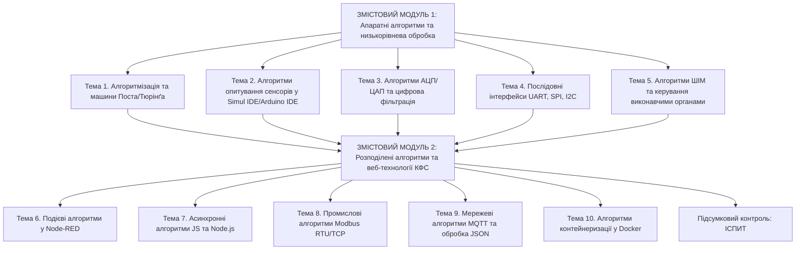

# РОБОЧА ПРОГРАМА НАВЧАЛЬНОЇ ДИСЦИПЛІНИ «Прикладні алгоритми кіберфізичних систем»

## 1. Опис навчальної дисципліни

Навчальна дисципліна «Прикладні алгоритми кіберфізичних систем» належить до циклу обов'язкових дисциплін професійної підготовки здобувачів вищої освіти першого (бакалаврського) рівня. Програма спрямована на вивчення фундаментальних та прикладних алгоритмічних рішень, що забезпечують безпосередню взаємодію обчислювальних компонентів із фізичними процесами, первинними перетворювачами, сенсорними мережами та виконавчими механізмами в умовах реального часу.

| Найменування показників | Галузь знань, спеціальність, освітній рівень | Характеристика навчальної дисципліни |
| :--- | :--- | :--- |
| **Кількість кредитів ECTS:** 6 | **Галузь знань:** F «Інформаційні технології» | **Вид дисципліни:** Обов'язкова |
| **Загальний обсяг годин:** 180 | **Спеціальність:** F7 «Комп'ютерна інженерія» | **Рік підготовки:** 1-й |
| **Кількість змістових модулів:** 2 | **Освітня програма:** «Кіберфізичні системи» | **Семестр:** 2-й |
| **Аудиторні години:** 60 год | **Освітній рівень:** Перший (бакалаврський) | **Лекції:** 30 год |
| **Лабораторні заняття:** 16 год | | **Практичні заняття:** 14 год |
| **Самостійна робота (СР):** 90 год | | **Індивідуальне завдання:** Розрахунково-графічна робота (30 год у складі СР) |
| **Тижневі години:** 4 аудиторні / 6 СР | | **Вид підсумкового контролю:** Іспит |

---

## 2. Мета та завдання навчальної дисципліни

**Метою викладання навчальної дисципліни** є формування у здобувачів вищої освіти комплексу теоретичних знань, системного інженерного мислення та практичних навичок із розробки, оптимізації, програмної реалізації та критичного аналізу прикладних алгоритмів низького та середнього рівнів, які функціонують у складі сучасних кіберфізичних систем.

**Основними завданнями вивчення дисципліни є:**
* засвоєння алгоритмічних моделей дискретизації, квантування та первинної цифрової обробки сигналів сенсорних вузлів у часовій та частотній областях;
* опанування програмно-апаратних алгоритмів фільтрації завад, обробки переривань та керування виконавчими механізмами за допомогою широтно-імпульсної модуляції та регуляторів;
* вивчення низькорівневих алгоритмів організації обміну даними через послідовні та мережеві інтерфейси в умовах асинхронності й обмежених ресурсів;
* набуття практичних навичок побудови подієво-орієнтованих алгоритмів та розподілених сервісів у середовищах Node-RED, Node.js та систем контейнеризації Docker;
* розробка обчислювальних алгоритмів для програмних та апаратних симуляторів КФС на базі середовищ Arduino IDE та Simul IDE.

**У результаті вивчення навчальної дисципліни здобувач вищої освіти повинен:**

**Знати:**
* теоретичні засади алгоритмізації процесів у кіберфізичних системах та математичні моделі формальних машин Поста та Тюрінґа;
* математичні та алгоритмічні принципи квантування напруги, аналого-цифрового перетворення та формування похибок вимірювальних каналів;
* алгоритми цифрової фільтрації сигналів, включаючи рекурсивні та нерекурсивні структури, а також методи придушення апаратного шуму;
* алгоритмічні особливості організації мережевої взаємодії за протоколами UART, HTTP/REST, MQTT та Modbus RTU/TCP;
* принципи побудови подієво-орієнтованих алгоритмів у середовищі Node-RED та асинхронної обробки даних мовою JavaScript;
* методи контейнеризації та ізоляції програмних алгоритмічних модулів КФС у середовищі Docker.

**Уміти:**
* розробляти та програмно реалізовувати алгоритми первинної обробки сигналів і фільтрації завад для мікроконтролерів у середовищі Arduino IDE;
* здійснювати схемотехнічне та алгоритмічне моделювання функціонування вузлів КФС у програмному симуляторі Simul IDE;
* програмувати подієві алгоритми збору, парсингу та агрегації телеметричних даних у середовищі Node-RED із використанням мови JavaScript;
* проектувати та розгортати мікросервісні алгоритмічні блоки для обробки даних КФС у ізольованих контейнерах Docker;
* реалізовувати алгоритми автоматичного керування на основі обрахованої похибки та зворотного зв'язку для виконавчих пристроїв.

**Сформовані компетентності та програмні результати навчання:**

* **Загальні компетентності (ЗК):**
  * ЗК1. Здатність застосовувати знання у практичних ситуаціях під час розробки алгоритмічного забезпечення.
  * ЗК2. Знання та розуміння предметної області та розуміння професійної діяльності в галузі кіберфізичних систем.
  * ЗК3. Здатність вчитися і оволодівати сучасними знаннями та новітніми алгоритмічними концепціями.
  * ЗК6. Здатність генерувати нові ідеї, виявляти, ставити та вирішувати складні інженерні проблеми.

* **Спеціальні (фахові) компетентності (СК):**
  * СК3. Здатність проектувати, розробляти та налагоджувати прикладне програмне забезпечення для вбудованих та розподілених комп'ютерних систем.
  * СК7. Здатність застосовувати математичний апарат, алгоритми цифрової обробки сигналів та теорію керування для створення кіберфізичних комплексів.
  * СК12. Здатність організовувати мережеву взаємодію між компонентами КФС з використанням сучасних протоколів та інтерфейсів.
  * СК14. Здатність використовувати інструментальні засоби симуляції, веб-технології та контейнеризацію для створення цифрових моделей систем.

* **Програмні результати навчання (РН):**
  * РН2. Застосовувати знання фундаментальних наук, математичного апарату та алгоритмізації для вирішення завдань комп'ютерної інженерії.
  * РН5. Розробляти програмне забезпечення для мікроконтролерних систем збору даних та первинної обробки інформації.
  * РН9. Проектувати розподілені обчислювальні структури КФС, застосовуючи асинхронні та подієво-орієнтовані алгоритми.
  * РН14. Обґрунтовувати вибір інструментальних засобів, мов програмування та середовищ симуляції для реалізації алгоритмів КФС.
  * РН18. Розгортати та адаптувати програмні сервіси КФС у контейнеризованих середовищах із забезпеченням стійкості обміну даними.

---

## 3. Програма навчальної дисципліни

*Рисунок 1 — Логіко-структурна схема навчальної дисципліни*

---

### Модуль 1. Апаратні алгоритми, низькорівнева обробка сигналів та фізичні інтерфейси КФС

#### Змістовий модуль 1. Алгоритмізація низького рівня та первинна обробка сигналів

* **Тема 1. Математичні основи алгоритмізації в кіберфізичних системах та моделювання Поста і Тюрінга.**  
  Тема присвячена вивченню теоретичних засад побудови алгоритмів, що працюють на межі обчислювального та фізичного світів. У межах теми розглядаються концепції детермінованості, дискретності та дискретного часу. Аналізуються математичні моделі формальних виконавців, зокрема машина Поста та машина Тюрінґа, як базові абстракції для розуміння обробки унарних та бінарних сигналів низького рівня. Особлива увага приділяється принципам побудови алгоритмічних систем із фіксованим алфавітом для управління потоками даних у кіберфізичних пристроях.

* **Тема 2. Апаратні алгоритми опитування сенсорів та первинної фільтрації завад у Simul IDE та Arduino IDE.**  
  У даній темі вивчаються алгоритмічні рішення для взаємодії мікроконтролера з аналоговими та цифровими первинними перетворювачами. Розглядаються алгоритми програмного усунення брязкоту контактів, методика організації таймерних переривань та обробки аналогових сигналів. Опановуються алгоритми ковзного середнього та медіанної фільтрації для придушення високочастотних завад у середовищі Arduino IDE, а також аналізуються процеси симуляції електричних кіл та мікроконтролерних модулів у програмному середовищі Simul IDE.

* **Тема 3. Дискретна обробка та алгоритми перетворення сигналів у цифро-аналогових і аналого-цифрових трактах.**  
  Тема охоплює алгоритми аналого-цифрового перетворення та математичні моделі похибок квантування. Розглядається квантування сигналу за рівнем і часом, яке описується розрядністю $n$ та опорною напругою $U_{ref}$, де крок квантування розраховується за формулою:
  $$\Delta U = \frac{U_{ref}}{2^n - 1}$$
  Аналізуються алгоритми обчислення дисперсії шуму квантування $\sigma_n^2$, відношення сигнал/шум $SNR$, а також методи побудови цифрових фільтрів нижніх частот для відновлення інформативності вхідного сигналу.

* **Тема 4. Алгоритми узгодження та синхронізації при послідовній передачі даних через інтерфейси UART, SPI та I2C.**  
  Тема присвячена низькорівневим алгоритмам організації апаратного та програмного зв'язку між мікроконтролером і периферійними пристроями. Розглядається алгоритм формування кадрів асинхронного інтерфейсу UART, обчислення контрольних сум, налаштування швидкості передачі даних та буферизація. Вивчаються синхронні алгоритми передачі даних по шинах SPI та I2C, порядок адресації ведених пристроїв, алгоритми повторного запиту при виникненні помилок та методи усунення колізій на шині.

* **Тема 5. Алгоритми керування виконавчими механізмами за допомогою широтно-імпульсної модуляції та ПІД-регулювання.**  
  Розглядаються алгоритми формування керуючих впливів для сипових актуаторів, електродвигунів та нагрівальних елементів. Вивчається алгоритм генерирування сигналів широтно-імпульсної модуляції (ШІМ) з регульованим коефіцієнтом заповнення. Аналізується дискретна реалізація пропорційно-інтегрально-диференціального (ПІД) регулятора, де керуючий сигнал $u(k)$ на $k$-му кроці обчислюється за рівнянням:
  $$u(k) = K_p e(k) + K_i T_s \sum_{i=0}^{k} e(i) + K_d \frac{e(k) - e(k-1)}{T_s}$$
  де $e(k)$ позначає похибку неузгодження, $T_s$ є періодом дискретизації, а $K_p, K_i, K_d$ являють собою коефіцієнти підсилення регулятора.

---

### Модуль 2. Розподілені алгоритми, мережева взаємодія та контейнеризація у КФС

#### Змістовий модуль 2. Мережеві алгоритми, подієва обробка та сервісна архітектура

* **Тема 6. Подієво-орієнтовані алгоритми та потокова обробка даних у середовищі Node-RED.**  
  У межах теми вивчаються концепції побудови подієво-орієнтованих алгоритмів для графічного програмування потоків даних. Розглядається архітектура програмних вузлів (nodes) у Node-RED, алгоритми маршрутизації повідомлень, трансформації об'єктів даних та обробки виключних ситуацій. Вивчаються алгоритми візуалізації телеметричних показників у режимі реального часу та створення інтерактивних дашбордів для оператора системи.

* **Тема 7. Алгоритми асинхронного обміну даними та веб-інтеграції на базі JavaScript та Node.js.**  
  Тема присвячена вивченню асинхронного програмування алгоритмів обробки даних у середовищі Node.js мовою JavaScript. Розглядаються алгоритми роботи з механізмом Event Loop, використання концепцій Promises та async/await для запобігання блокуванню основного потоку виконання при отриманні даних від фізичних пристроїв. Аналізуються алгоритми створення REST API серверів, форматування даних у формат JSON та реалізація клієнт-серверної взаємодії за допомогою методології HTTP (GET, POST).

* **Тема 8. Промислові алгоритми передачі даних та опитування регістрів за протоколами Modbus RTU/TCP.**  
  Розглядаються алгоритми функціонування промислового стандарту Modbus. Вивчається модель даних Modbus, включаючи алгоритми читання та запису дискретних входів/виходів, вхідних регістрів та регістрів зберігання. Досліджуються алгоритми упакування 32-бітних чисел із плаваючою комою в два 16-бітні регістри Modbus із урахуванням порядку байтів (Big-Endian, Little-Endian) та алгоритми циклічного опитування Slave-пристроїв Master-вузлом у мережах Modbus TCP.

* **Тема 9. Мережеві алгоритми розподіленого моніторингу за протоколом MQTT та обробка JSON-пакетів.**  
  Тема охоплює вивчення асинхронного протоколу MQTT, що працює за шаблоном «Видавець-Підписник» (Publish/Subscribe). Розглядаються алгоритми маршрутизації повідомлень через MQTT-брокер на основі ієрархічних топіків та символів підстановки (+, #). Вивчаються алгоритми забезпечення гарантії доставки повідомлень за рівнями якості обслуговування QoS (QoS 0, QoS 1, QoS 2), алгоритм обробки останньої волі (LWT) та збереження останніх станів (Retained Messages).

* **Тема 10. Алгоритми контейнеризації та ізоляції програмних сервісів КФС за допомогою Docker.**  
  Розглядаються сучасні алгоритмічні та системні підходи до забезпечення кросплатформності, масштабованості та ізоляції програмних модулів КФС. Вивчаються алгоритми створення Dockerfile, збирання образів контейнерів та оркестрації декількох сервісів (Node.js сервер, MQTT брокер, бази даних) за допомогою Docker Compose. Аналізуються алгоритми організації мережевої взаємодії між ізольованими контейнерами та передачі потоків даних через віртуальні мости.

---

## 4. Структура навчальної дисципліни

| Назви змістових модулів і тем | Усього годин | Аудиторні години | | | Самостійна робота |
| :--- | :---: | :---: | :---: | :---: | :---: |
| | | **Лекції** | **Практичні** | **Лабораторні** | |
| **1** | **2** | **3** | **4** | **5** | **6** |
| **Змістовий модуль 1. Algorithmic foundations and low-level processing** | | | | | |
| Тема 1. Математичні основи алгоритмізації в КФС та моделювання Поста і Тюрінга | 14 | 2 | 2 | — | 10 |
| Тема 2. Апаратні алгоритми опитування сенсорів у Simul IDE та Arduino IDE | 14 | 2 | — | 2 | 10 |
| Тема 3. Дискретна обробка та алгоритми перетворення сигналів у ЦАП/АЦП | 16 | 4 | 2 | 2 | 8 |
| Тема 4. Алгоритми узгодження та синхронізації інтерфейсів UART, SPI, I2C | 14 | 2 | 2 | 2 | 8 |
| Тема 5. Алгоритми керування виконавчими механізмами за допомогою ШІМ і ПІД | 16 | 4 | 2 | 2 | 8 |
| **Разом за змістовим модулем 1** | **74** | **14** | **8** | **8** | **44** |
| **Змістовий модуль 2. Distributed algorithms, event-driven processing and IoT** | | | | | |
| Тема 6. Подієво-орієнтовані алгоритми та потокова обробка у Node-RED | 16 | 2 | 2 | 2 | 10 |
| Тема 7. Алгоритми асинхронного обміну даними на базі JavaScript та Node.js | 16 | 4 | 2 | 2 | 8 |
| Тема 8. Промислові алгоритми передачі даних за протоколами Modbus RTU/TCP | 14 | 2 | 2 | 2 | 8 |
| Тема 9. Мережеві алгоритми розподіленого моніторингу за протоколом MQTT | 14 | 2 | — | 2 | 10 |
| Тема 10. Алгоритми контейнеризації та ізоляції сервісів КФС у Docker | 16 | 4 | — | — | 12 |
| Виконання розрахунково-графічної роботи (РГР) | 30 | — | — | — | 30 |
| **Разом за змістовим модулем 2** | **106** | **16** | **6** | **8** | **76** |
| **УСЬОГО ГОДИН** | **180** | **30** | **14** | **16** | **120** |

---

## 5. Теми лабораторних та практичних занять

### 5.1. Теми лабораторних робіт

| № з/п | Назва теми лабораторної роботи | Кількість годин |
| :---: | :--- | :---: |
| 1 | Моделювання та програмна реалізація апаратних алгоритмів фільтрації аналогових сигналів у середовищі Arduino IDE та Simul IDE | 2 |
| 2 | Дослідження алгоритмів квантування напруги та програмне обчислення похибок АЦП для вимірювальних каналів КФС | 2 |
| 3 | Реалізація низькорівневого алгоритму асинхронного передавання даних через інтерфейс UART із розрахунком контрольних сум | 2 |
| 4 | Програмна реалізація дискретного алгоритму ПІД-регулятора для керування об'єктом першого порядку через ШІМ-канал | 2 |
| 5 | Розробка подієво-орієнтованого алгоритму збору та візуалізації телеметрії у середовищі графічного програмування Node-RED | 2 |
| 6 | Побудова асинхронного алгоритму обробки потоків даних на базі Node.js та створення REST API сервера | 2 |
| 7 | Програмне кодування та декодування 32-бітних чисел із плаваючою комою в регістри Modbus TCP мовою JavaScript | 2 |
| 8 | Реалізація алгоритму розподіленого моніторингу за протоколом MQTT із обробкою структур JSON та рівнів QoS | 2 |
| **Разом** | | **16** |

### 5.2. Теми практичних занять

| № з/п | Назва теми практичного заняття | Кількість годин |
| :---: | :--- | :---: |
| 1 | Формалізація алгоритмів обробки унарних та бінарних сигналів на основі алгоритмічних моделей Поста та Тюрінґа | 2 |
| 2 | Розрахунок параметрів алгоритмів цифрової фільтрації сигналів та спектральний аналіз завад у часовій області | 2 |
| 3 | Аналіз часових затримок та пропускної здатності при використанні послідовних інтерфейсів UART, SPI та I2C | 2 |
| 4 | Синтез та розрахунок коефіцієнтів дискретного ПІД-регулятора для автоматичних систем керування | 2 |
| 5 | Проектування структури потоків даних та трансформації повідомлень у подієво-орієнтованих системах Node-RED | 2 |
| 6 | Розробка схем асинхронної обробки помилок та керування тайм-аутами у клієнт-серверних алгоритмах Node.js | 2 |
| 7 | Проектування алгоритмів адресації та формування кадрів даних для промислових мереж Modbus RTU/TCP | 2 |
| **Разом** | | **14** |

---

## 6. Самостійна робота

| № з/п | Назва теми для самостійного опрацювання | Кількість годин СР |
| :---: | :--- | :---: |
| 1 | Поглиблене вивчення теореми Котельникова-Шеннона та алгоритмів запобігання ефекту аліасингу в кіберфізичних системах | 10 |
| 2 | Дослідження алгоритмів автокалібрування та компенсації дрейфу нуля первинних перетворювачів у Simul IDE | 10 |
| 3 | Опрацювання методів цифрової фільтрації Баттерворта та алгоритмів медіанного згладжування імпульсних завад | 8 |
| 4 | Поняття про алгоритми апаратного колізійного доступу та арбітражу шини у промислових мережах | 8 |
| 5 | Математичний аналіз стійкості замкнених алгоритмів автоматичного керування при наявності апаратного запізнення | 8 |
| 6 | Вивчення веб-протоколів WebSockets для створення алгоритмів дуплексного обміну даними в реальному часі | 10 |
| 7 | Алгоритми маршрутизації та обробки повідомлень у складнопідрядних ієрархічних структурах JSON | 8 |
| 8 | Алгоритми організації безпечного з'єднання у розподілених мережах КФС на основі шифрування TLS/SSL | 8 |
| 9 | Методи обробки втрат пакетів та алгоритми повторного підключення в MQTT-мережах з нестабільним зв'язком | 10 |
| 10 | Вивчення алгоритмів розгортання багатоконтейнерних архітектур КФС із використанням інструменту Docker Compose | 12 |
| 11 | Виконання розрахунково-графічної роботи (РГР) на тему: «Розробка та симуляція комплексу прикладних алгоритмів збору, фільтрації та мережевої передачі даних для кіберфізичної системи моніторингу» | 30 |
| **Разом** | | **120** |

---

## 7. Методи навчання та контролю

Під час викладання навчальної дисципліни застосовуються словесні, наочні та практичні методи навчання, спрямовані на активізацію навчально-пізнавальної діяльності здобувачів вищої освіти та формування інженерного підходу до розв'язання задач.

**Методи навчання включають:**
* **пояснювально-ілюстративні та лекційні виклади:** використання мультимедійних презентацій, демонстрування алгоритмічних схем та онлайн-розбір прикладів коду мовами C/C++ та JavaScript;
* **практичні та лабораторні заняття:** виконання покрокових алгоритмічних завдань у середовищах Arduino IDE, Simul IDE, Node-RED та Docker із відпрацюванням індивідуальних варіантів;
* **інтерактивне та проблемне навчання:** проведення дискусій щодо вибору оптимальних алгоритмів обробки сигналів та порівняльного аналізу мережевих протоколів;
* **метод проектного навчання:** виконання розрахунково-графічної роботи (РГР), яка передбачає наскрізну розробку алгоритмічного забезпечення кіберфізичної системи від сенсора до контейнеризованого сервісу.

**Методи контролю знань включають:**
* **поточний контроль:** оцінювання роботи здобувачів на практичних заняттях, контроль виконання та захист лабораторних робіт (із перевіркою функціонування коду та відповідей на контрольні питання);
* **модульний контроль:** проведення двох письмових або комп'ютерних тестувань за матеріалами Змістових модулів 1 та 2;
* **перевірка індивідуального завдання:** оцінювання розрахунково-графічної роботи за критеріями правильності розрахунків, повноти коду та якості пояснювальної записки;
* **підсумковий семестровий контроль:** проведення семестрового іспиту у 2-му семестрі.

---

## 8. Розподіл балів та критерії оцінювання

### 8.1. Розподіл балів за темами та видами занять

Оцінювання знань здобувачів здійснюється за 100-бальною шкалою. Бали нараховуються за виконання всіх видів аудиторної та самостійної роботи.

#### Таблиця 8.1.1 — Розподіл балів за змістовими модулями та темами

| Змістовий модуль 1 | | | | | Змістовий модуль 2 | | | | | РГР | Іспит | Сума |
| :---: | :---: | :---: | :---: | :---: | :---: | :---: | :---: | :---: | :---: | :---: | :---: | :---: |
| **Т1** | **Т2** | **Т3** | **Т4** | **Т5** | **Т6** | **Т7** | **Т8** | **Т9** | **Т10** | | | |
| 4 | 5 | 6 | 5 | 5 | 5 | 5 | 5 | 5 | 5 | 20 | 30 | **100** |

#### Таблиця 8.1.2 — Розподіл балів за видами робіт

| Вид роботи / навчального заняття | Пояснення та нарахування балів | Максимальний бал |
| :--- | :--- | :---: |
| **Виконання лабораторних робіт** | 8 робіт по 2.5 бали за кожну захищену роботу | 20 |
| **Виконання практичних занять** | 7 занять по 2 бали за кожне виконане завдання | 14 |
| **Активність на лекціях та відвідування** | 10 лекційних блоків по 0.6 бала | 6 |
| **Виконання та захист РГР** | Розрахунково-графічна робота (оформлення + захист) | 20 |
| **Модульний контроль (2 тести)** | 2 тестові модульні роботи по 5 балів кожна | 10 |
| **Підсумковий іспит** | Семестровий іспит у 2 семестрі | 30 |
| **УСЬОГО БАЛІВ** | | **100** |

### 8.2. Критерії оцінювання за видами контролю

* **Критерії оцінювання лабораторних робіт (максимум 2.5 бали за роботу):**
  * **2.5 бали:** робота виконана повністю відповідно до індивідуального варіанта, програма/симуляція працює без помилок, код детально прокоментаваний, здобувач вільно відповідає на всі контрольні запитання та пояснює алгоритм;
  * **1.5–2.0 бали:** робота виконана, але є незначні зауваження до оформлення коду або здобувач припустився неточностей при відповіді на контрольні запитання;
  * **0.5–1.0 бал:** робота виконана частково, алгоритм містить помилки, здобувач важко пояснює функціонування коду.

* **Критерії оцінювання розрахунково-графічної роботи (максимум 20 балів):**
  * **18–20 балів:** завдання виконане у повному обсязі, математичні розрахунки вивірені, розроблені алгоритми та кодові модулі є повністю робочими, пояснювальна записка оформлена згідно зі стандартами, захист пройшов успішно;
  * **13–17 балів:** завдання виконане, але є поодинокі некритичні помилки у розрахунках або оформленні записки, захист проведений із незначними зауваженнями;
  * **9–12 балів:** розрахунки містять суттєві помилки, алгоритмічна частина виконана частково, здобувач слабко аргументує прийняті рішення.

* **Критерії оцінювання підсумкового іспиту (максимум 30 балів):**
  * **27–30 балів:** здобувач демонструє всебічні, глибокі знання теоретичного матеріалу, вільно оперує математичним апаратом, правильне вирішує прикладні алгоритмічні задачі;
  * **20–26 балів:** здобувач володіє основним матеріалом, але припускається незначних помилок у формулах чи алгоритмічних деталях;
  * **12–19 балів:** здобувач фрагментарно володіє матеріалом, демонструє лише поверхневе розуміння алгоритмів та не може вирішити практичну задачу.

### 8.3. Шкала оцінювання: національна та ECTS

| Сума балів за всі види навчальної діяльності | Оцінка ECTS | Значення оцінки ECTS | Критерії оцінювання | Оцінка за національною шкалою |
| :---: | :---: | :--- | :--- | :---: |
| **90–100** | **A** | Відмінно | Здобувач виявляє особливі творчі здібності, системні знання та вільно застосовує алгоритми на практиці | Відмінно |
| **82–89** | **B** | Дуже добре | Здобувач вільно володіє вивченим обсягом матеріалу, розв'язує задачі без суттєвих помилок | Добре |
| **74–81** | **C** | Добре | Здобувач володіє навчальним матеріалом, розв'язує більшість практичних завдань із незначними помилками | |
| **64–73** | **D** | Задовільно | Здобувач відтворює значну частину матеріалу, але припускається суттєвих помилок у розрахунках та коді | Задовільно |
| **60–63** | **E** | Достатньо | Знання здобувача відповідають мінімальним вимогам, висвітлено лише базові положення | |
| **35–59** | **FX** | Незадовільно з можливістю повторного складання | Здобувач володіє лише окремими фрагментами матеріалу, необхідне повторне складання підсумкового контролю | Незадовільно |
| **1–34** | **F** | Незадовільно з обов'язковим повторним вивченням | Здобувач володіє матеріалом на рівні елементарного розпізнавання, необхідне повторне вивчення дисципліни | |

---

## 9. Рекомендована література та інформаційні ресурси

### Основна література

1. Мельник А. О., Глухов В. С., Сало А. М. Кіберфізичні системи: багаторівнева організація та проєктування: монографія / за ред. проф. А. О. Мельника. Львів: Видавництво «Магнолія 2006», 2024. 238 с.
2. Бочкарьов О. Ю., Голембо В. А., Парамуд Я. С., Яцук В. О. Кіберфізичні системи: технології збору даних: монографія / за ред. проф. А. О. Мельника. Львів: Видавництво «Магнолія 2006», 2024. 176 с.
3. Лактіонов І. С., Удовик І. М. Методи та засоби побудови систем і мереж Інтернету речей: навчальний посібник. Дніпро: НТУ «Дніпровська політехніка», 2023. 251 с.
4. Marwedel P. Embedded System Design: Embedded Systems Foundations of Cyber-Physical Systems, and the Internet of Things. 4th ed. Cham: Springer, 2021. 433 p.
5. Lee E. A., Seshia S. A. Introduction to Embedded Systems: A Cyber-Physical Systems Approach. 2nd ed. MIT Press, 2017. 584 p.

### Додаткова література

6. Пулеко І. В., Єфіменко А. А. Архітектура та технології Інтернету речей: навчальний посібник. Житомир: Державний університет «Житомирська політехніка», 2022. 234 c.
7. Дубовой В. М. Ідентифікація та моделювання технологічних об’єктів і систем керування: навчальний посібник. Вінниця: ВНТУ, 2012. 308 с.
8. Перекрест А. Л., Вадурін К. О., Юдіна А. Л. Цифровий автомат як інструмент моделювання стану суспільства. *Вісник Кременчуцького національного університету імені Михайла Остроградського*. 2023. Вип. 3 (140). С. 52–61.
9. Taha W. M., Taha A. M., Thunberg J. Cyber-Physical Systems: A Model-Based Approach. Cham: Springer, 2021. 187 p.

### Інформаційні ресурси в Інтернеті

10. Офіційна документація Node.js та асинхронного середовища виконання. URL: https://nodejs.org/en/docs/
11. Документація платформи графічного програмування Node-RED. URL: https://nodered.org/docs/
12. Документація проекту Docker та специфікації контейнеризації. URL: https://docs.docker.com/
13. Офіційний сайт та документація апаратного середовища Arduino. URL: https://www.arduino.cc/
14. Онлайн-платформа та документація симулятора Simul IDE. URL: https://simulide.com/