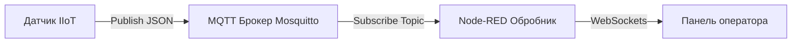
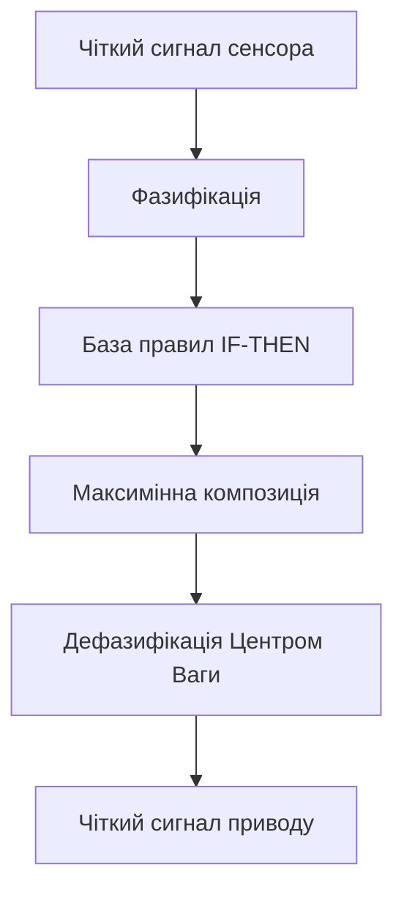

# МЕТОДИЧНІ ВКАЗІВКИ ДЛЯ САМОСТІЙНОЇ РОБОТИ З ОСВІТНЬОГО КОМПОНЕНТА «Прикладні алгоритми кіберфізичних систем»

## 1. ТЕМИ ТА ПОГОДИННИЙ РОЗКЛАД ЛЕКЦІЙ І САМОСТІЙНОЇ РОБОТИ

Нижче наведено академічний розподіл навчального часу між аудиторними лекційними заняттями та самостійною роботою студента за змістовими модулями та темами навчальної дисципліни.

| Назва змістового модуля та теми | Всього (год) | Лекції (л) | Самостійна робота (с.р.) |
| :--- | :---: | :---: | :---: |
| **Змістовий модуль 1. Фундаментальні основи алгоритмізації та структури даних у КФС** | **60** | **14** | **46** |
| Тема 1. Теоретичні засади алгоритмізації в КФС | 14 | 4 | 10 |
| Тема 2. Керуючі конструкції в алгоритмах реального часу | 14 | 2 | 12 |
| Тема 3. Архітектура та обмін даними в КФС | 16 | 4 | 12 |
| Тема 4. Алгоритми обробки структурованих даних | 16 | 4 | 12 |
| **Змістовий модуль 2. Інтелектуальні обчислення, граф-моделі та розподілені сервіси КФС** | **60** | **14** | **46** |
| Тема 5. Нечітка логіка та евристики в КФС | 16 | 4 | 12 |
| Тема 6. Пошук, сортування та графи в мережах КФС | 16 | 4 | 12 |
| Тема 7. Хмарні та граничні обчислення в КФС | 14 | 4 | 10 |
| Розрахунково-графічна робота (РГР) | 14 | — | 12 |
| **Всього годин з дисципліни** | **120** | **28** | **92** |

---

## 2. ПЕРЕЛІК ТЕМ І ПИТАНЬ ДЛЯ САМОСТІЙНОГО ОПРАЦЮВАННЯ

### Змістовий модуль 1. Фундаментальні основи алгоритмізації та структури даних у КФС

#### Тема 1. Теоретичні засади алгоритмізації в КФС
**Питання для самостійного опрацювання студентом:**
1. Поняття рівня Brainware як первинної алгоритмічної концепції поведінки кіберфізичної системи, що стоїть над програмним та апаратним забезпеченням.
2. Дослідження фундаментальних властивостей алгоритмів, що включають дискретність інформації і дій, детермінованість, скінченність, результативність, масовість та фізичну здійснюваність.
3. Аналітичне формалізування часової складності алгоритму $T(n) = \sum_{i=1}^{N} t_i$ та розрахунок функції трудомісткості $\Psi = c_1 F_a(N) + c_2 M + c_3 S_d + c_4 S_r$.
4. Опанування асимптотичного аналізу обчислювальної складності з використанням нотацій $O$-велике, $\Omega$-омега та $\Theta$-тета.
5. Порівняльний аналіз формальних моделей обчислень унарної машини Поста та знакопереробного автомата Тюрінґа зі станами $q_i \in Q$.
6. Дослідження тези Черча — Тюрінґа та математичного доведення існування алгоритмічно нерозв'язних проблем на прикладі проблеми зупинки.

**Питання для самоперевірки:**
1. Чому рівень алгоритмізації Brainware вважається первинним стосовно програмного забезпечення Software та апаратного рівня Hardware при проєктуванні КФС?
2. Які фізичні та логічні ресурси обчислювальної системи враховуються ваговими коефіцієнтами $c_1, c_2, c_3, c_4$ у функції трудомісткості $\Psi$?
3. У чому полягає відмінність між унарною системою кодування машини Поста та довільним алфавітом символів $A = \{\alpha, \beta, \gamma, \dots, \Lambda\}$ машини Тюрінґа?
4. Яке практичне значення має проблему зупинки машини Тюрінґа для розробки верифікованого бортового програмного забезпечення КФС?
5. Які умови виникнення аварійних колізій машини Поста свідчать про наявність помилок на рівні алгоритмічного проєктування Brainware?

**Література:** [2, с. 5–19; 3, с. 14–40; 5, с. 83–102].

---

#### Тема 2. Керуючі конструкції в алгоритмах реального часу
**Питання для самостійного опрацювання студентом:**
1. Проєктування алгоритмів реального часу на основі стратегії відсікання значень бар'єрами без використання складних вкладених булевих виразів.
2. Порівняльний аналіз повної та короткої схем обчислення булевих виразів у мовах високого рівня та їх вплив на запобігання помилкам доступу до пам'яті.
3. Організація умовних циклів зі зсувом керуючих змінних та дослідження гарантованої кількості ітерацій для конструкцій `while`, `do-while` та `for`.
4. Застосування алгоритмічного прийому знакової змінної $p_{i+1} = -p_i$ для чергування знаків у обчислювальних рядах реального часу.
5. Практичне використання логічного прапорця та індекс-прапорця для фіксації настання подій або аномалій у системі телеметрії.
6. Оптимізація алгоритмів пошуку в масивах за допомогою фіктивного елемента — бар'єра, що зменшує кількість операцій порівняння у циклі удвічі.
7. Дослідження методу динамічного програмування для оптимізації рекурсивних обчислень шляхом табуляції проміжних результатів.

**Питання для самоперевірки:**
1. Чому використання послідовного відсікання бар'єрами є пріоритетним у системах жорсткого реального часу порівняно зі складними умовними операторами?
2. Як обчислюється середня кількість операцій $K_{сер} = \frac{K_{min} + K_{max}}{2}$ для розгалужених алгоритмів і як вона пов'язана з оцінкою найгіршого випадку (WCET)?
3. Які чотири обов'язкові етапи використання прапорця визначають логічну коректність його реалізації в програмному коді?
4. Чому додавання бар'єра в кінець масиву дозволяє виключити перевірку виходу за межі масиву у заголовку циклу?
5. У чому полягає перевага табличного збереження результатів у динамічному програмуванні порівняно з канонічною рекурсією?

**Література:** [3, с. 41–79; 4, с. 41–62].

---

#### Тема 3. Архітектура та обмін даними в КФС
**Питання для самостійного опрацювання студентом:**
1. Архітектурна інтеграція технологій функціонування (OT) з інформаційними технологіями (IT) у екосистемах Промислового Інтернету речей (IIoT).
2. Розрахунок енергозабезпечення та часу життя автономних сенсорних вузлів $T_{life} = \frac{C_{bat}}{I_{avg} \cdot 24 \cdot 365}$ за циклічним режимом споживання.
3. Застосування методологій відновлення енергії (Energy Harvesting) з навколишнього середовища та використання іоністорів у буферних колах живлення.
4. Дослідження брокер-центричної моделі «публікація/підписка» протоколу MQTT та розробка чотирирівневих ієрархічних тем `фабрика/цех/пристрій/параметр`.
5. Порівняльний аналіз рівнів якості обслуговування QoS 0, QoS 1 та QoS 2 у протоколі MQTT за критеріями надійності доставки та мережевого накладу.
6. Математичний алгоритм декодування остаточної довжини (Remaining Length) у фіксованому заголовку MQTT пакета $L = \sum_{i=1}^{n} (B_i \ \& \ 127) \cdot 128^{i-1}$.
7. Опанування повнодуплексного обміну даними реального часу між браузером та сервером за допомогою протоколу WebSockets.

*Рисунок 1 — Потік передачі телеметрії від датчика до панелі оператора*

**Питання для самоперевірки:**
1. Як смуга пропускання $W$ та відношення сигнал/шум $S/N$ у теоремі Шеннона-Гартлі $C = W \cdot \log_2(1 + S/N)$ визначають граничну швидкість передачі телеметрії?
2. У чому полягає відмінність між функціонуванням автономного та керованого датчиків у мережі IIoT?
3. Чому функція Last Will and Testament (LWT) у протоколі MQTT є критично важливою для моніторингу аварійного відключення вузлів КФС?
4. Які обмеження накладаються на використання багаторівневого шаблону підписки `#` у рядку теми MQTT?
5. Чим відрізняється накладний мережевий заголовок кадру WebSockets від кадру HTTP при передачі високочастотних сигналів?

**Література:** [1, с. 26–55, с. 239–272].

---

#### Тема 4. Алгоритми обробки структурованих даних
**Питання для самостійного опрацювання студентом:**
1. Опрацювання одновимірних векторів та двовимірних матриць у послідовно виділеній пам'яті з використанням формули лінійного зміщення $Idx(i, j) = i \cdot N + j$.
2. Реалізація топологічних обходів матриць сигналів «змійкою» та «спіраллю» для завдань сканування просторових сенсорних сіток.
3. Проєктування алгоритмів симетричних перетворень матриць (дзеркальне відображення, транспонування, поворот на $180^\circ$) безпосередньо у вихідній пам'яті (in-place).
4. Застосування змінної типу індекс-прапорець для відстеження локалізацій пікових аномалій у просторових матрицях телеметрії.
5. Порівняльний аналіз лінійних структур даних: стека (LIFO), черги (FIFO) та двосторонньої черги (дек).
6. Реалізація пріоритетної черги на основі двійкової купи (Binary Heap) з часовою складністю операцій $O(\log_2 n)$.
7. Алгоритми обробки символьних рядків, пошуку підрядка та маніпулювання текстовими буферами телеметрії.

**Питання для самоперевірки:**
1. Чому виконання геометричних перетворень матриці на тому ж місці (in-place) забезпечує ємнісну складність $S(n) = O(1)$?
2. Яким чином обмеження індексу $j < \lfloor N / 2 \rfloor$ при дзеркальному відображенні матриці запобігає повторному обміну елементів?
3. Чому використання кільцевого буфера на основі масиву фіксованого розміру є кращим для систем реального часу, ніж динамічний зв'язаний список?
4. Яка математична залежність пов'язує індекси батьківського та дочірніх вузлів у масиві двійкової мінімальної купи?
5. У чому полягає відмінність у часовій складності пошуку максимального елемента у звичайній черзі та у пріоритетній черзі на базі купи?

**Література:** [2, с. 62–91; 3, с. 99–175].

---

### Змістовий модуль 2. Інтелектуальні обчислення, граф-моделі та розподілені сервіси КФС

#### Тема 5. Нечітка логіка та евристики в КФС
**Питання для самостійного опрацювання студентом:**
1. Математичне визначення нечітких множин Заде через функцію приналежності $\mu_A(x) \in [0, 1]$ та їх відмінність від класичних множин Кантора.
2. Структура лінгвістичної змінної, вибір терм-множин та побудова трикутних і трапецієподібних функцій приналежності.
3. Етапи нечіткого логічного виведення за методом Мамдані: фазифікація вхідних сигналів, оцінка бази правил «IF-THEN», агрегування та імплікація.
4. Обчислення максимінної композиції Заде $\mu_{out}(u) = \max_k (\min(\alpha_k, \mu_k(u)))$ та дефазифікація методом Центру Ваги (Center of Gravity, CoG).
5. Застосування евристичного жадібного пошуку (найближчого сусіда) для розв'язання $NP$-складної задачі комівояжера в мережах КФС та аналіз застрягання у локальних оптимумах.
6. Розв'язання задач комбінаторної оптимізації методом Монте-Карло на основі статистичного моделювання та випадкових вибірок.
7. Метаевристичний алгоритм імітації відпалу (Simulated Annealing) та використання ймовірнісного критерію Метрополіса $P = \exp(-\Delta L / Q)$ для виходу з локальних ям.
8. Формалізація знань засобами логічного програмування: факти, правила, хорнівські диз'юнкти та побудова дерева виведення.

*Рисунок 2 — Конвеєр нечіткого логічного виведення керуючого сигналу*

**Питання для самоперевірки:**
1. У чому полягає відмінність між носієм, ядром та $\alpha$-рівнем нечіткої множини?
2. Як здійснюється дефазифікація нечіткого виходу за допомогою дискретної формули центру ваги $u^* = \frac{\sum u_i \mu(u_i)}{\sum \mu(u_i)}$?
3. Чому жадібний алгоритм найближчого сусіда гарантує високу швидкість обчислення $O(n^2)$, але може давати значне відхилення від оптимального шляху?
4. Яку роль відіграє параметр «температури» $Q$ в алгоритмі імітації відпалу при виборі гірших розв'язків на початкових етапах?
5. Що таке хорнівський диз'юнкт і чому він є основою для ефективного резолютивного виведення в мові Prolog?

**Література:** [5, с. 156–172; 6, с. 42–48].

---

#### Тема 6. Пошук, сортування та графи в мережах КФС
**Питання для самостійного опрацювання студентом:**
1. Аналіз швидкодії алгоритму лінійного пошуку з бар'єром $O(n)$ та двійкового (бінарного) пошуку $O(\log_2 n)$ у впорядкованих масивах телеметрії.
2. Хронометраж та порівняльний аналіз квадратичних алгоритмів сортування: прямим обміном (бульбашкове), прямим вибором та прямою вставкою.
3. Реалізація логарифмічного алгоритму швидкого сортування (QuickSort) на основі рекурсивної декомпозиції «розділяй і володарюй» відносно опорного елемента (півота).
4. Теоретико-графове моделювання сенсорних мереж КФС: матриця суміжності, список суміжності, вагові характеристики каналів зв'язку.
5. Алгоритм Дейкстри для знаходження найкоротшого шляху у зваженому графі з невід'ємними вагами та його прискорення до $O(E \log V)$ за допомогою пріоритетної черги.
6. Інтелектуальний евристичний пошук маршрутів за допомогою алгоритму А* із застосуванням цільової функції оцінки $f(n) = g(n) + h(n)$.
7. Дослідження властивостей бінарних дерев пошуку, збалансованих AVL-дерев та дерев відрізків для індексування часових рядів.

**Питання для самоперевірки:**
1. Чому при бінарному пошуку розрахунок середнього індексу рекомендується виконувати за формулою $i = L + \lfloor (R - L) / 2 \rfloor$?
2. У яких випадках алгоритм швидкого сортування (QuickSort) деградує за часовою складністю до квадратичної межі $O(n^2)$?
3. У чому полягає математична операція релаксації ребра $d(v) = \min(d(v), d(u) + w(u, v))$ в алгоритмах на графах?
4. Чим відрізняється алгоритм А* від алгоритму Дейкстри при виборі наступної вершини для обробки?
5. Чому класичний алгоритм Дейкстри некоректно працює у графах із ребрами, що мають від'ємну вагу?

**Література:** [2, с. 143–198; 3, с. 176–246].

---

#### Тема 7. Хмарні та граничні обчислення в КФС
**Питання для самостійного опрацювання студентом:**
1. Розподіл відповідальності у моделях хмарного обслуговування IaaS, PaaS та SaaS при проєктуванні інфраструктури КФС.
2. Парадигми граничних (Edge) та туманних (Fog) обчислень за стандартом OpenFog для мінімізації латентності обробки сигналів реального часу.
3. Проєктування топологій туманних мереж та оркестрація розподілених мікросервісів за допомогою контейнеризації Docker та Docker Compose.
4. Концепція Big Data у КФС за характеристиками «6V»: Volume, Velocity, Variety, Veracity, Value, Variability.
5. Розробка гібридної Lambda-архітектури обробки даних із паралельним розділенням на Batch Layer (Hadoop HDFS), Speed Layer (Complex Event Processing) та Serving Layer.
6. Проєктування конвеєра обробки складних подій (Complex Event Processing, CEP) у часових ковзних вікнах $W_{cep}(t) = \{e_k \mid t - \Delta t \le t_k \le t\}$.
7. Операційна та функціональна безпека в КФС: шифрування даних, модульна арифметика, алгоритм RSA та хешування (SHA-256).

**Питання для самоперевірки:**
1. У чому полягає відмінність між контейнеризацією на рівні ядра ОС (Docker) та апаратною віртуалізацією на рівні гіпервізора?
2. Яким чином використання Edge-обчислень безпосередньо біля датчиків дозволяє знизити латентність системи до мілісекундного рівня?
3. Які функції виконують рівні Batch Layer та Speed Layer у Lambda-архітектурі та як вони об'єднуються на рівні Serving Layer?
4. Як робота CEP-двигуна дозволяє виявляти складні причинно-наслідкові аномалії в потоці телеметрії?
5. Чому операція ділення за модулем (модульна арифметика) є основою сучасної криптографії та алгоритмів асиметричного шифрування у КФС?

**Література:** [1, с. 241–281, с. 322–325].

---

## 3. ПИТАННЯ ДО МОДУЛЬНОГО ТА СЕМЕСТРОВОГО КОНТРОЛЮ

### Змістовий модуль 1. Фундаментальні основи алгоритмізації та структури даних у КФС

1. Дайте визначення поняття «алгоритм» та розкрийте зміст рівня алгоритмічного забезпечення Brainware у кіберфізичних системах.
2. Детально опишіть фундаментальні властивості алгоритмів: дискретність, детермінованість, скінченність, результативність, масовість та здійснюваність.
3. Наведіть математичну формулу часової складності алгоритму $T(n)$ та поясніть її фізичний зміст при спрощеній моделі обчислень.
4. Розкрийте математичний зміст універсальної функції трудомісткості $\Psi = c_1 F_a(N) + c_2 M + c_3 S_d + c_4 S_r$ та розшифруйте кожен її параметр.
5. Дайте визначення асимптотичним нотаціям $O(f(n))$, $\Omega(f(n))$ та $\Theta(f(n))$ для оцінювання складності алгоритмів.
6. Порівняйте класичні блок-схеми (ISO 5807:1985) та структурні діаграми дій (Action Diagrams) за напрямками зростання та відповідністю коду.
7. Поясніть сутність парадигми структурного програмування Едсгера Дейкстри та шкідливість використання безумовного переходу `goto`.
8. Опишіть будову та функціональні елементи абстрактної машини Поста. Наведіть перелік її 6 базових команд.
9. Що таке колізія машини Поста? Наведіть приклади некоректних дій каретки, що призводять до колізій.
10. Дайте визначення поняття «фінітний 1-процес» у теорії машин Поста.
11. Опишіть будову та принцип функціонування універсальної машини Тюрінґа. Поясніть роль внутрішніх станів $q_i \in Q$.
12. Сформулюйте математичний формат команди переходу машини Тюрінґа $\alpha q_i \to \beta q_j \xi$ та поясніть значення кожного символу.
13. Сформулюйте сутність тези Черча — Тюрінґа та її значення для теорії обчислюваності.
14. Поясніть суть проблеми зупинки машини Тюрінґа та її алгоритмічну нерозв'язність.
15. Опишіть стратегію побудови розгалужених алгоритмів реального часу на основі послідовного відсікання значень бар'єрами.
16. Поясніть відмінність між повною та короткою схемами обчислення булевих виразів у програмуванні.
17. Як обчислюється середня кількість операцій $K_{сер}$ для розгалужених алгоритмів із різними гілками виконання?
18. Наведіть порівняльний аналіз циклічних конструкцій `while`, `do-while` та `for` за місцем перевірки умови та мінімальною кількістю ітерацій.
19. Поясніть правила організації умовних циклів у системах реального часу для запобігання безкінечному зацикленню.
20. Опишіть алгоритмічний прийом використання знакової змінної для чергування знаків у обчислювальних рядах.
21. Розкрийте чотири обов’язкові етапи (точки) використання булевого прапорця в алгоритмах.
22. Поясніть сутність використання індекс-прапорця при пошуку елементів у масиві та значення його початкової ініціалізації числом `-1`.
23. Опишіть алгоритмічний прийом застосування «бар'єра» в масиві для оптимізації послідовного пошуку.
24. Сформулюйте концепцію екосистеми Промислового Інтернету речей (IIoT) та інтеграції OT і IT технологій.
25. Опишіть розрахункові формули середнього струму $I_{avg}$ та часу життя $T_{life}$ автономного сенсорного вузла.
26. Наведіть фізичні принципи та порівняльну характеристику методів збору відновлюваної енергії (Energy Harvesting).
27. Розкрийте архітектуру мережі MQTT: роль публікаторів, підписників та центрального брокера.
28. Поясніть правила побудови чотирирівневих ієрархічних тем MQTT вида `фабрика/цех/пристрій/параметр`.
29. Поясніть функціональну відмінність між однорівневим `+` та багаторівневим `#` шаблонами підписки в MQTT.
30. Детально опишіть механізми підтвердження доставки та використання ресурсів для рівнів якості обслуговування QoS 0, QoS 1 та QoS 2.
31. Поясніть призначення та механізм спрацьовування функції Last Will and Testament (LWT) у протоколі MQTT.
32. Опишіть математичний алгоритм кодування остаточної довжини (Remaining Length) у заголовку MQTT пакета.
33. Порівняйте протоколи MQTT та WebSockets за критеріями латентності, накладного заголовка та сфери застосування у КФС.
34. Наведіть математичну формулу розрахунку зміщення елемента $Idx(i, j)$ двовимірної матриці у послідовній оперативній пам'яті.
35. Опишіть алгоритм обходу матриці сигналів «змійкою» по рядках та по стовпчиках.
36. Опишіть алгоритм обходу матриці сигналів по концентричній «спіралі» ззовні всередину.
37. Сформулюйте математичні індексні співвідношення для дзеркального відображення матриці відносно вертикальної та горизонтальної осей.
38. Поясніть алгоритм транспонування квадратної матриці $N \times N$ на тому ж місці (in-place) та обмеження індексних циклів.
39. Дайте визначення та порівняльну характеристику динамічної структури даних «стек» (LIFO).
40. Дайте визначення та порівняльну характеристику динамічної структури даних «черга» (FIFO).
41. Поясніть будову та сфери застосування двосторонньої черги (дек).
42. Опишіть принципи функціонування пріоритетної черги та її реалізацію за допомогою двійкової купи (Binary Heap).
43. Чому часова складність додавання та вилучення елемента у пріоритетній купі становить $O(\log_2 n)$?
44. Опишіть алгоритми циклічного зсуву вектору телеметрії вліво та вправо для організації кільцевого буфера.
45. Поясніть використання теореми Шеннона-Гартлі $C = W \log_2(1 + S/N)$ для оцінювання пропускної здатності каналів зв'язку в IIoT.

---

### Змістовий модуль 2. Інтелектуальні обчислення, граф-моделі та розподілені сервіси КФС

1. Дайте визначення поняття нечіткої множини Заде та порівняйте її з класичною множиною Кантора.
2. Розкрийте поняття функції приналежності $\mu_A(x) \in [0, 1]$ та її фізичний зміст у нечіткій логіці.
3. Дайте визначення поняттям «носій», «ядро» та «$\alpha$-рівень» нечіткої множини.
4. Опишіть структуру лінгвістичної змінної та призначення її компонентів згідно з Лотфі Заде.
5. Наведіть математичні формули трикутних та трапецієподібних функцій приналежності.
6. Опишіть статистичний метод побудови функцій приналежності на основі опитування групи експертів.
7. Опишіть метод парних порівнянь Сааті з використанням 9-бальної шкали та власних векторів матриці.
8. Розкрийте сутність процедури нормалізації субнормальної нечіткої множини.
9. Детально опишіть етап фазифікації вхідних аналогових сигналів у нечіткому контролері.
10. Поясніть структуру нечітких правил прийняття рішень вида «IF-THEN» та процедуру оцінки їх сили спрацьовування $\alpha_k$.
11. Розкрийте математичний зміст операції максимінної композиції Заде при агрегуванні нечітких правил.
12. Поясніть алгоритм дефазифікації нечіткого виходу методом Центру Ваги (Center of Gravity, CoG).
13. Сформулюйте сутність евристичних алгоритмів та причини їх застосування для $NP$-складних задач КФС.
14. Опишіть принцип функціонування жадібного алгоритму (найближчого сусіда) для задачі комівояжера (TSP).
15. Чому жадібний алгоритм має квадратичну складність $O(n^2)$, але схильний до застрягання у локальних оптимумах?
16. Розкрийте сутність розв'язання комбінаторних задач методів Монте-Карло на основі випадкових вибірок.
17. Опишіть метаевристичний алгоритм імітації відпалу (Simulated Annealing) та фізичну аналогію охолодження металу.
18. Поясніть ймовірнісний критерій Метрополіса $P = \exp(-\Delta L / Q)$ та роль параметра «температури» $Q$.
19. Поясніть, чому при наближенні «температури» $Q \to 0$ алгоритм імітації відпалу трансформується у жадібний пошук.
20. Наведіть порівняльний аналіз швидкодії лінійного пошуку $O(n)$ та бінарного пошуку $O(\log_2 n)$.
21. Чому при бінарному пошуку розрахунок середнього індексу за формулою $i = L + \lfloor (R - L) / 2 \rfloor$ запобігає переповненню?
22. Опишіть алгоритм сортування прямим обміном (бульбашкове) та роль булевого прапорця у його оптимізації.
23. Опишіть алгоритм сортування прямим вибором (Selection Sort) та його переваги за кількістю перестановок.
24. Опишіть алгоритм сортування прямою вставкою (Insertion Sort) та використання бінарного пошуку позиції вставки.
25. Поясніть принцип декомпозиції «розділяй і володарюй» в алгоритмі швидкого сортування (QuickSort).
26. За яких умов алгоритм QuickSort деградує за часовою складністю до квадратичної межі $O(n^2)$?
27. Поясніть властивість стійкості (стабільності) алгоритмів сортування та наведіть приклади стійких і нестійких методів.
28. Сформулюйте математичну модель зваженого графа $G = (V, E, w)$ для опису топології сенсорної мережі.
29. Опишіть об'єктно-орієнтовану структуру атрибутів вершини графа: `mDistance`, `mSource`, `mVisited`.
30. Розкрийте математичний зміст умови релаксації ребра $d(v) = \min(d(v), d(u) + w(u, v))$ в алгоритмі Дейкстри.
31. Чому використання пріоритетної черги на базі двійкової купи скорочує складність алгоритму Дейкстри до $O(E \log V)$?
32. Поясніть відмінність алгоритму А* від алгоритму Дейкстри та роль евристичної функції оцінки залишку шляху $h(n)$.
33. Чому алгоритм Дейкстри не застосовується для графів, що містять ребра з від'ємною вагою?
34. Розкрийте розподіл відповідальності користувача та провайдера у хмарних моделях IaaS, PaaS та SaaS.
35. Поясніть концепцію граничних обчислень (Edge Computing) та їх роль у мінімізації латентності систем реального часу.
36. Поясніть концепцію туманних обчислень (Fog Computing) та компоненти стандарту OpenFog.
37. Опишіть завдання та механізми оркестрації розподілених сервісів у туманних мережах КФС.
38. Розкрийте зміст концепції «6V» великих даних (Big Data) стосовно промислових кіберфізичних систем.
39. Поясніть відмінність між пакетною обробкою (Batch Processing) та потоковою обробкою (Stream Processing) телеметрії.
40. Детально опишіть три рівні класичної Lambda-архітектури: Batch Layer, Speed Layer та Serving Layer.
41. Які інструменти стека Apache (Hadoop, HDFS, Spark, Kafka, Cassandra) застосовуються на кожному рівні Lambda-архітектури?
42. Сформулюйте поняття обробки складних подій (Complex Event Processing, CEP) та принцип аналізу у ковзних вікнах.
43. Поясніть математичне узгодження запитів на рівні Serving Layer $V_{serving} = f_{batch}(D_{master}) \cup g_{speed}(D_{realtime})$.
44. Опишіть відмінності між операційною та функціональною безпекою в кіберфізичних системах.
45. Поясніть використання модульної арифметики та алгоритму RSA для забезпечення шифрування даних у КФС.

---

## СПИСОК ЛІТЕРАТУРИ

1. **Грудзинський Ю. Є.** Технології сучасних кібер-фізичних систем : навч. посіб. для студ. спеціальності 151 «Автоматизація та комп’ютерно-інтегровані технології» / уклад. Ю. Є. Грудзинський ; КПІ ім. Ігоря Сікорського. — Київ : КПІ ім. Ігоря Сікорського, 2020. — 327 с. — URL: https://ela.kpi.ua/bitstream/123456789/43394/1/TKFS_NP_2020_Lektsii.pdf
2. **Креневич А. П.** Алгоритми і структури даних : підручник / А. П. Креневич. — Київ : ВПЦ «Київський Університет», 2021. — 200 с. — URL: https://www.mechmat.univ.kiev.ua/wp-content/uploads/2021/09/pidruchnyk-alhorytmy-i-struktury-danykh.pdf
3. **Марченко О. І.** Структури даних та алгоритми : підручник. У 2-х ч. Ч. 1 / О. І. Марченко, О. О. Марченко ; КПІ ім. Ігоря Сікорського. — Київ : Просвіта, 2024. — 268 с. — ISBN 978-617-7010-34-9. — URL: https://e-library.kpefk.com.ua/wp-content/uploads/2025/03/ASD-Marchenko-O.I.-Pidruchnyk-2024r-Liudmyla-Meleshchuk.pdf
4. **Назарчук І. В.** Програмування та алгоритмічні мови 1. Алгоритмізація та основи програмування : конспект лекцій : навч. посіб. для студ. спеціальності 124 «Системний аналіз» / уклад. І. В. Назарчук ; КПІ ім. Ігоря Сікорського. — Київ : КПІ ім. Ігоря Сікорського, 2020. — 140 с.
5. **Темнікова О. Л.** Математична логіка та теорія алгоритмів : конспект лекцій : навч. посіб. для студ. спеціальності 113 «Прикладна математика» / О. Л. Темнікова ; КПІ ім. Ігоря Сікорського. — Київ : КПІ ім. Ігоря Сікорського, 2021. — 177 с. — URL: https://ela.kpi.ua/server/api/core/bitstreams/90cfd1e3-1a98-4370-95f3-bd1d677d0e7c/content
6. **Троцько В. В.** Теорія алгоритмів : навч.-метод. посіб. / В. В. Троцько. — Київ : ВНЗ «Університет економіки та права «КРОК», 2023. — 126 с. — ISBN 978-966-170-075-7. — URL: https://library.krok.edu.ua/media/library/category/navchalni-posibniki/trotsko_0003.pdf